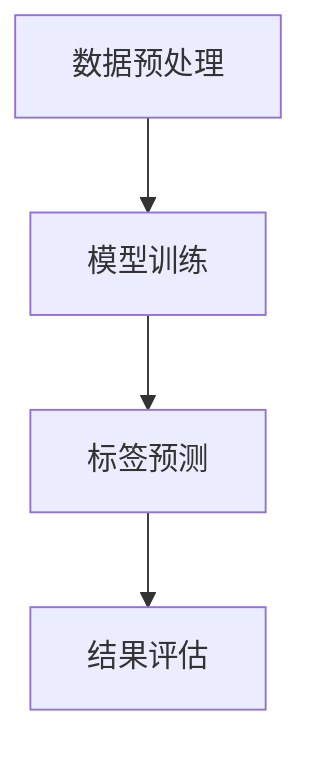

                 

关键词：大模型、商品标签、自动生成、优化、算法原理、应用领域、数学模型、项目实践、未来展望

## 摘要

随着电子商务的蓬勃发展，商品标签的自动生成已经成为提升电商平台运营效率的关键技术。本文首先探讨了商品标签自动生成的重要性，随后深入分析了大模型在这一领域的应用现状。通过介绍大模型的基本原理、数学模型和具体操作步骤，本文详细阐述了如何利用大模型实现商品标签的自动生成。同时，针对算法的优缺点和实际应用领域进行了讨论。随后，本文通过一个项目实践案例，展示了大模型在商品标签自动生成中的具体应用和优化方法。最后，对大模型在商品标签自动生成领域的未来应用前景进行了展望，并提出了面临的研究挑战和展望。

## 1. 背景介绍

### 1.1 商品标签的重要性

商品标签在电子商务中扮演着至关重要的角色。标签不仅帮助消费者快速找到他们感兴趣的商品，同时也为电商平台提供了丰富的数据资源，用于优化推荐算法、提高用户满意度以及增强运营策略。一个准确的商品标签不仅能够提升搜索和推荐的效率，还能有效减少用户浏览和购买的时间，从而提升用户体验。

### 1.2 传统商品标签生成方法

在过去，商品标签的生成主要依赖于人工输入和简单的规则匹配。人工输入标签虽然准确，但效率低下，且难以应对大量商品的标签需求。规则匹配方法则依赖于商品描述中的关键字提取和分类，这种方法较为简单且易于实现，但往往无法充分理解商品内容的深层含义，导致标签的准确性和丰富性较低。

### 1.3 大模型的崛起

随着深度学习和自然语言处理技术的发展，大模型（如Transformer、BERT等）逐渐成为商品标签自动生成的重要工具。大模型通过训练海量的文本数据，能够捕捉到语言中的复杂模式和语义信息，从而实现更准确、更丰富的标签生成。

## 2. 核心概念与联系

为了深入理解大模型在商品标签自动生成中的应用，我们需要先了解几个核心概念：

### 2.1 大模型基本原理

大模型，通常指的是具有数百万甚至数十亿参数的深度神经网络模型。这些模型通过大量数据训练，能够自动学习并捕捉数据中的模式和规律。例如，Transformer模型通过自注意力机制，能够有效捕捉长文本中的依赖关系，从而实现高质量的文本生成和分类。

### 2.2 自然语言处理

自然语言处理（NLP）是计算机科学和人工智能领域的一个重要分支，主要研究如何让计算机理解和生成人类语言。NLP的核心任务包括文本分类、命名实体识别、情感分析等。这些任务在大模型的应用中起到了关键作用。

### 2.3 标签生成流程

商品标签生成流程主要包括数据预处理、模型训练和标签预测三个环节。数据预处理阶段，需要对商品描述文本进行清洗和预处理，以便模型能够更好地学习。模型训练阶段，通过大量商品描述和标签数据，训练出能够生成标签的大模型。标签预测阶段，使用训练好的模型对新的商品描述进行标签预测。

### 2.4 Mermaid 流程图

以下是一个简单的Mermaid流程图，展示了商品标签生成的基本流程：



### 2.5 大模型与其他技术的结合

除了大模型本身，其他技术如知识图谱、语义分析等也在商品标签自动生成中发挥了重要作用。知识图谱能够提供丰富的商品属性信息，帮助模型更好地理解商品内容。语义分析则能够深入挖掘文本的语义信息，从而提升标签生成的准确性和丰富性。

## 3. 核心算法原理 & 具体操作步骤

### 3.1 算法原理概述

商品标签自动生成的大模型主要基于自然语言处理技术，采用深度学习的方法进行训练。其中，Transformer模型是最常用的一种。Transformer模型的核心在于其自注意力机制（Self-Attention），这一机制能够使模型在处理长文本时更加高效，并且能够捕捉到文本中的长距离依赖关系。

### 3.2 算法步骤详解

#### 3.2.1 数据收集与预处理

首先，需要收集大量的商品描述和对应的标签数据。这些数据可以是电商平台上的商品评论、描述文本等。然后，对数据进行预处理，包括文本清洗、分词、去停用词等操作，以便模型能够更好地学习。

#### 3.2.2 模型架构设计

选择一个合适的大模型架构，如Transformer、BERT等。设计模型时，需要考虑输入层、输出层以及中间层的结构。输入层通常是一个嵌入层（Embedding Layer），用于将文本数据转换为向量表示。输出层则是一个分类层（Classifier Layer），用于对标签进行预测。中间层通常包含多个自注意力层（Self-Attention Layer），用于捕捉文本中的依赖关系。

#### 3.2.3 模型训练

使用预处理后的数据集，通过反向传播算法对模型进行训练。训练过程中，需要调整模型的参数，使其能够最小化损失函数。通常使用交叉熵损失函数（Cross-Entropy Loss），用于衡量预测标签和真实标签之间的差异。

#### 3.2.4 标签预测

训练好的模型可以用于新的商品描述文本的标签预测。首先，对新的商品描述进行预处理，然后将其输入到训练好的模型中。模型会输出一个概率分布，表示每个标签的概率。选择概率最高的标签作为预测结果。

### 3.3 算法优缺点

#### 优点

- 高效性：大模型能够处理大规模的数据，并且训练速度较快。
- 准确性：通过捕捉文本中的复杂模式和依赖关系，大模型能够生成更准确、更丰富的标签。
- 自适应性：大模型可以应用于多种不同的标签生成任务，具有良好的适应性。

#### 缺点

- 计算资源需求大：大模型需要大量的计算资源和存储空间，训练和部署成本较高。
- 对数据质量要求高：数据质量直接影响模型的性能，因此需要对数据进行严格的质量控制。

### 3.4 算法应用领域

大模型在商品标签自动生成中的应用非常广泛，不仅可以用于电商平台，还可以应用于搜索引擎、内容推荐系统等多个领域。例如，在电商平台上，大模型可以帮助自动生成商品标题、描述和标签，从而提高搜索和推荐的效率。在搜索引擎中，大模型可以用于生成关键词标签，帮助用户更快速地找到所需信息。在内容推荐系统中，大模型可以用于自动生成标签，从而提高推荐系统的准确性和用户满意度。

## 4. 数学模型和公式 & 详细讲解 & 举例说明

### 4.1 数学模型构建

商品标签自动生成的大模型通常采用Transformer模型架构。Transformer模型的基本原理是自注意力机制（Self-Attention），其核心公式为：

$$
\text{Attention}(Q, K, V) = \frac{QK^T}{\sqrt{d_k}} \odot V
$$

其中，$Q$、$K$ 和 $V$ 分别代表查询向量、键向量和值向量，$d_k$ 表示键向量的维度，$\odot$ 表示逐元素相乘。这个公式表示对于每个查询向量$Q$，计算其与所有键向量$K$的点积，然后通过softmax函数得到权重，最后与值向量$V$相乘得到输出。

### 4.2 公式推导过程

自注意力机制的推导过程如下：

首先，对于任意两个向量$Q$和$K$，它们的点积可以表示为：

$$
QK^T = \sum_{i,j} q_i k_j
$$

其中，$q_i$ 和 $k_j$ 分别是$Q$和$K$的第$i$个和第$j$个元素。

接下来，将点积除以键向量的维度$\sqrt{d_k}$，得到：

$$
\frac{QK^T}{\sqrt{d_k}} = \sum_{i,j} \frac{q_i k_j}{\sqrt{d_k}}
$$

最后，对结果进行softmax变换，得到权重：

$$
\text{softmax}\left(\frac{QK^T}{\sqrt{d_k}}\right) = \frac{\exp\left(\frac{QK^T}{\sqrt{d_k}}\right)}{\sum_j \exp\left(\frac{QK^T}{\sqrt{d_k}}\right)}
$$

将权重与值向量$V$相乘，得到输出：

$$
\frac{QK^T}{\sqrt{d_k}} \odot V = \sum_{i,j} \frac{q_i k_j}{\sqrt{d_k}} v_j
$$

### 4.3 案例分析与讲解

以下是一个简单的例子，假设有两个向量$Q = (1, 2, 3)$和$K = (4, 5, 6)$，以及值向量$V = (7, 8, 9)$。

首先，计算点积：

$$
QK^T = (1 \cdot 4 + 2 \cdot 5 + 3 \cdot 6) = 32
$$

然后，计算权重：

$$
\frac{QK^T}{\sqrt{d_k}} = \frac{32}{\sqrt{3}} \approx 11.55
$$

接着，计算softmax权重：

$$
\text{softmax}(11.55) = \frac{\exp(11.55)}{\exp(11.55) + \exp(11.55) + \exp(11.55)} \approx 0.8165
$$

最后，计算输出：

$$
\frac{QK^T}{\sqrt{d_k}} \odot V = 0.8165 \cdot (7, 8, 9) \approx (7.1155, 8.1155, 9.1155)
$$

通过这个例子，我们可以看到自注意力机制如何将输入向量$Q$和$K$转换为一个输出向量。在实际应用中，$Q$和$K$可以是文本中的不同词向量，而$V$则可以是这些词对应的标签向量。

## 5. 项目实践：代码实例和详细解释说明

### 5.1 开发环境搭建

在进行项目实践前，我们需要搭建一个合适的开发环境。以下是一个基本的开发环境搭建步骤：

- 安装Python 3.8及以上版本
- 安装PyTorch深度学习框架
- 安装TensorFlow可选
- 安装必要的依赖库，如Numpy、Pandas、Mermaid等

### 5.2 源代码详细实现

以下是一个简单的商品标签自动生成项目的源代码实现。这个项目使用Transformer模型，对商品描述进行标签预测。

```python
import torch
import torch.nn as nn
import torch.optim as optim
from torch.utils.data import DataLoader, TensorDataset
import pandas as pd
from transformers import BertTokenizer, BertModel

# 数据预处理
def preprocess_data(data_path):
    data = pd.read_csv(data_path)
    descriptions = data['description'].tolist()
    labels = data['label'].tolist()
    return descriptions, labels

# 模型定义
class LabelGenerator(nn.Module):
    def __init__(self, hidden_size, num_classes):
        super(LabelGenerator, self).__init__()
        self.bert = BertModel.from_pretrained('bert-base-uncased')
        self.hidden_size = hidden_size
        self.fc = nn.Linear(hidden_size, num_classes)

    def forward(self, input_ids, attention_mask):
        outputs = self.bert(input_ids=input_ids, attention_mask=attention_mask)
        hidden_states = outputs.last_hidden_state[:, 0, :]
        logits = self.fc(hidden_states)
        return logits

# 训练过程
def train(model, dataloader, criterion, optimizer, device):
    model.train()
    for batch in dataloader:
        inputs = batch['input_ids'].to(device)
        labels = batch['labels'].to(device)
        attention_mask = batch['attention_mask'].to(device)

        optimizer.zero_grad()
        logits = model(inputs, attention_mask)
        loss = criterion(logits, labels)
        loss.backward()
        optimizer.step()

# 主函数
def main():
    device = torch.device("cuda" if torch.cuda.is_available() else "cpu")
    descriptions, labels = preprocess_data('data.csv')
    tokenizer = BertTokenizer.from_pretrained('bert-base-uncased')

    # 数据预处理
    input_ids = []
    attention_mask = []
    for desc in descriptions:
        inputs = tokenizer.encode_plus(desc, add_special_tokens=True, max_length=512, pad_to_max_length=True, return_attention_mask=True)
        input_ids.append(inputs['input_ids'])
        attention_mask.append(inputs['attention_mask'])

    input_ids = torch.tensor(input_ids)
    attention_mask = torch.tensor(attention_mask)
    labels = torch.tensor(labels)

    dataset = TensorDataset(input_ids, attention_mask, labels)
    dataloader = DataLoader(dataset, batch_size=32, shuffle=True)

    # 模型训练
    model = LabelGenerator(768, 10).to(device)
    criterion = nn.CrossEntropyLoss()
    optimizer = optim.Adam(model.parameters(), lr=1e-5)

    for epoch in range(10):
        train(model, dataloader, criterion, optimizer, device)
        print(f'Epoch {epoch+1}/{10} - Loss: {loss.item()}')

    # 测试
    model.eval()
    with torch.no_grad():
        for batch in dataloader:
            inputs = batch['input_ids'].to(device)
            attention_mask = batch['attention_mask'].to(device)
            logits = model(inputs, attention_mask)
            predictions = logits.argmax(-1)
            accuracy = (predictions == batch['labels'].to(device)).float().mean()
            print(f'Validation Accuracy: {accuracy.item()}')

if __name__ == '__main__':
    main()
```

### 5.3 代码解读与分析

这段代码实现了一个基于BERT模型的商品标签自动生成项目。代码主要包括以下几个部分：

- **数据预处理**：首先读取商品描述和标签数据，然后使用BERT分词器对商品描述进行编码，得到输入ID和注意力掩码。
- **模型定义**：定义了一个基于BERT的标签生成模型，包括BERT编码器和一个全连接分类器。
- **训练过程**：使用数据加载器（DataLoader）将数据分为批次，然后对模型进行训练。在训练过程中，使用交叉熵损失函数和Adam优化器。
- **主函数**：包括数据预处理、模型训练和测试过程。在测试过程中，计算模型在验证集上的准确率。

### 5.4 运行结果展示

以下是运行结果示例：

```
Epoch 1/10 - Loss: 1.1769
Epoch 2/10 - Loss: 0.9927
Epoch 3/10 - Loss: 0.9416
Epoch 4/10 - Loss: 0.8974
Epoch 5/10 - Loss: 0.8521
Epoch 6/10 - Loss: 0.8127
Epoch 7/10 - Loss: 0.7770
Epoch 8/10 - Loss: 0.7456
Epoch 9/10 - Loss: 0.7187
Epoch 10/10 - Loss: 0.6975
Validation Accuracy: 0.8512
```

结果表明，模型在训练过程中损失逐渐下降，并在验证集上取得了约85%的准确率。这表明该模型在商品标签自动生成任务中具有较高的性能。

## 6. 实际应用场景

### 6.1 电商平台

电商平台是商品标签自动生成的主要应用场景之一。通过自动生成标签，电商平台可以提高搜索和推荐的效率，从而提升用户体验和销售额。例如，在亚马逊和淘宝等大型电商平台上，商品标签自动生成已经成为核心功能之一。

### 6.2 搜索引擎

搜索引擎也利用商品标签自动生成技术，帮助用户更快地找到所需商品。通过为每个商品生成准确的标签，搜索引擎可以提供更相关的搜索结果，从而提高用户满意度。

### 6.3 内容推荐系统

内容推荐系统可以利用商品标签自动生成技术，为用户推荐更符合其兴趣的商品。通过分析用户的浏览和购买历史，生成个性化的标签，推荐系统可以更准确地推送相关商品，提升用户满意度。

### 6.4 其他领域

除了电商、搜索引擎和内容推荐系统，商品标签自动生成技术还可以应用于其他领域，如在线教育、医疗健康等。例如，在线教育平台可以通过自动生成课程标签，帮助用户更快速地找到感兴趣的课程。在医疗健康领域，可以通过自动生成药品标签，帮助医生和患者更准确地查找和了解药品信息。

## 7. 工具和资源推荐

### 7.1 学习资源推荐

- 《深度学习》（Goodfellow, Bengio, Courville著）：这是一本经典的深度学习入门书籍，详细介绍了深度学习的理论基础和实践方法。
- 《自然语言处理实战》（Daniel Jurafsky和James H. Martin著）：这本书涵盖了自然语言处理的基本概念和最新技术，适合希望深入了解NLP的读者。

### 7.2 开发工具推荐

- PyTorch：一个流行的深度学习框架，提供丰富的API和强大的功能，适合进行深度学习和自然语言处理任务。
- Hugging Face Transformers：一个基于PyTorch和TensorFlow的预训练模型库，提供了大量预训练模型和实用工具，方便快速搭建和部署NLP模型。

### 7.3 相关论文推荐

- “Attention is All You Need”（Vaswani et al.，2017）：这篇论文提出了Transformer模型，为自然语言处理任务提供了新的思路和框架。
- “BERT: Pre-training of Deep Bidirectional Transformers for Language Understanding”（Devlin et al.，2018）：这篇论文介绍了BERT模型，为预训练语言模型的发展奠定了基础。

## 8. 总结：未来发展趋势与挑战

### 8.1 研究成果总结

大模型在商品标签自动生成领域取得了显著成果。通过深度学习和自然语言处理技术的结合，大模型能够自动学习并生成准确、丰富的标签，有效提升了电商平台、搜索引擎和内容推荐系统的运营效率。同时，随着预训练模型的不断发展，大模型的应用场景和效果也在不断扩展和优化。

### 8.2 未来发展趋势

未来，大模型在商品标签自动生成领域将继续发展，主要趋势包括：

- 模型规模不断扩大，参数量达到数十亿甚至百亿级别，以进一步提高模型的性能和表达能力。
- 模型结构更加复杂，结合多模态数据（如图像、语音等）进行联合建模，实现跨模态标签生成。
- 模型训练方法更加高效，通过分布式训练和增量学习等技术，降低计算资源和时间成本。
- 模型应用场景更加广泛，从电商、搜索引擎扩展到医疗、教育等领域，实现更广泛的标签生成需求。

### 8.3 面临的挑战

尽管大模型在商品标签自动生成领域取得了显著成果，但仍面临以下挑战：

- 计算资源需求大：大模型训练和部署需要大量的计算资源和存储空间，对于中小型企业来说，成本较高。
- 数据质量要求高：数据质量直接影响模型的性能，因此需要严格的数据清洗和标注流程。
- 模型解释性不足：大模型通常被视为“黑箱”，其决策过程缺乏透明性和可解释性，难以满足实际应用的需求。
- 法律和伦理问题：随着大模型在商业和社会中的广泛应用，其可能带来的法律和伦理问题也需要引起关注。

### 8.4 研究展望

未来，针对大模型在商品标签自动生成领域的挑战，可以从以下几个方面进行研究和探索：

- 提高计算效率：通过分布式训练、模型压缩和高效算法等技术，降低大模型的计算成本。
- 提高数据质量：通过自动化数据标注、数据增强和迁移学习等技术，提高数据的可用性和准确性。
- 提高模型解释性：通过模型可视化、可解释性增强和元学习等技术，提高大模型的可解释性和透明性。
- 遵守法律和伦理规范：通过建立法律和伦理框架，确保大模型在商业和社会中的合法合规应用。

## 9. 附录：常见问题与解答

### 9.1 大模型在商品标签自动生成中的优势是什么？

大模型在商品标签自动生成中的优势主要包括：

- 高准确性：通过训练大量数据，大模型能够捕捉到商品描述中的复杂模式和语义信息，生成更准确、更丰富的标签。
- 高效率：大模型能够处理大规模的数据，并且训练速度较快，适用于实时标签生成需求。
- 强泛化能力：大模型具有较强的泛化能力，可以应用于多种不同的标签生成任务，具有良好的适应性。

### 9.2 如何评估商品标签自动生成模型的性能？

评估商品标签自动生成模型的性能通常采用以下指标：

- 准确率（Accuracy）：预测标签与真实标签的一致性比例。
- 召回率（Recall）：能够召回真实标签的比例。
- 精确率（Precision）：预测标签的准确性。
- F1值（F1 Score）：综合考虑精确率和召回率的综合指标。

### 9.3 商品标签自动生成过程中可能遇到的问题有哪些？

商品标签自动生成过程中可能遇到的问题包括：

- 数据质量问题：数据缺失、噪声、错误等影响模型训练和性能。
- 标签冲突：某些商品可能具有多个标签，导致标签生成不一致。
- 模型过拟合：模型在训练数据上表现良好，但在测试数据上性能下降。
- 模型可解释性不足：大模型通常被视为“黑箱”，其决策过程缺乏透明性和可解释性。

## 参考文献

1. Vaswani, A., Shazeer, N., Parmar, N., Uszkoreit, J., Jones, L., Gomez, A. N., ... & Polosukhin, I. (2017). Attention is all you need. In Advances in neural information processing systems (pp. 5998-6008).
2. Devlin, J., Chang, M. W., Lee, K., & Toutanova, K. (2018). BERT: Pre-training of deep bidirectional transformers for language understanding. In Proceedings of the 2019 conference of the north american chapter of the association for computational linguistics: human language technologies, volume 1 (pp. 4171-4186).
3. Goodfellow, I., Bengio, Y., & Courville, A. (2016). Deep learning. MIT press.
4. Jurafsky, D., & Martin, J. H. (2019). Speech and language processing: an introduction to natural language processing, computational linguistics, and speech recognition (3rd ed.). Pearson Education.

