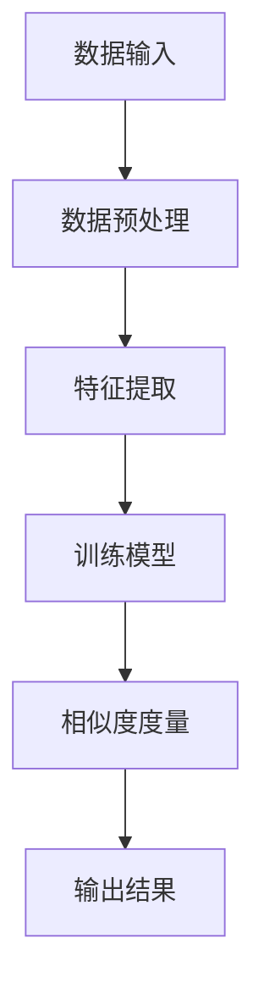

                 

关键词：商品相似度计算、大模型、人工智能、深度学习、机器学习、相似度度量、推荐系统

> 摘要：本文深入探讨了使用大模型进行商品相似度计算的创新方法。通过分析传统商品相似度计算方法的局限性，我们引入了基于深度学习和机器学习的大模型，详细描述了其工作原理、算法步骤、数学模型及实际应用。文章旨在为从事推荐系统和商品分类的从业者提供一种有效的技术解决方案，同时展望大模型在商品相似度计算领域的未来发展方向。

## 1. 背景介绍

在电子商务和推荐系统中，商品相似度计算是一个关键问题。传统的方法，如基于属性的相似度计算和基于内容的相似度计算，往往存在一定的局限性。例如，基于属性的相似度计算依赖于商品的具体属性，但商品属性的不完整或缺失会导致计算结果的准确性下降。而基于内容的相似度计算虽然能够考虑商品的多种属性，但计算复杂度较高，且难以处理大型数据集。

随着人工智能和深度学习技术的发展，大模型开始广泛应用于各个领域。大模型具有强大的特征提取能力和泛化能力，能够处理复杂、大规模的数据，为商品相似度计算提供了一种新的思路。本文将详细介绍大模型在商品相似度计算中的应用，分析其工作原理、算法步骤、数学模型以及实际应用效果。

## 2. 核心概念与联系

### 2.1 大模型的基本概念

大模型（Large-scale Model）是指那些能够处理大规模数据集、具有高度非线性特征提取能力的模型。这些模型通常由数百万甚至数十亿个参数组成，具有强大的学习能力。大模型的核心特点是能够通过学习大量数据来发现数据中的潜在规律，从而提高模型的预测准确性和泛化能力。

### 2.2 大模型在商品相似度计算中的应用

在商品相似度计算中，大模型的应用主要体现在两个方面：特征提取和相似度度量。

1. **特征提取**：大模型通过学习大量商品数据，能够自动提取商品的多维特征。这些特征不仅包括商品的基本属性，如价格、品牌、型号等，还包括商品的隐式属性，如用户行为、评价、浏览历史等。通过这些多维特征，大模型能够更全面地描述商品的属性和特点。

2. **相似度度量**：大模型使用提取到的特征，通过训练学习相似度度量函数，对商品之间的相似度进行量化。这种度量函数能够综合考虑商品的各种特征，提供更精确的相似度计算结果。

### 2.3 Mermaid 流程图

下面是一个Mermaid流程图，展示了大模型在商品相似度计算中的基本架构：



## 3. 核心算法原理 & 具体操作步骤

### 3.1 算法原理概述

大模型在商品相似度计算中的核心算法是基于深度学习和机器学习的。深度学习通过构建多层神经网络，逐层提取数据中的特征，形成对数据的深层理解。机器学习则通过学习大量的训练数据，调整模型参数，优化模型的性能。

### 3.2 算法步骤详解

1. **数据输入**：首先，我们需要收集大量的商品数据，包括商品的基本属性和用户行为数据。

2. **数据预处理**：对收集到的商品数据进行清洗和预处理，包括数据去重、填充缺失值、标准化等操作。

3. **特征提取**：利用深度学习模型，对预处理后的数据进行特征提取。这一步可以通过构建卷积神经网络（CNN）、循环神经网络（RNN）等深度学习模型来实现。

4. **训练模型**：使用提取到的特征，通过机器学习算法训练相似度度量模型。常见的算法包括支持向量机（SVM）、神经网络（NN）、决策树（DT）等。

5. **相似度度量**：训练好的模型对商品之间的相似度进行量化。这一步可以通过计算商品特征向量的余弦相似度、欧氏距离等来实现。

6. **输出结果**：将相似度计算结果输出，用于推荐系统或商品分类。

### 3.3 算法优缺点

#### 优点：

1. **高效性**：大模型能够处理大规模的数据集，提供高效的计算能力。
2. **准确性**：通过深度学习和机器学习，大模型能够自动提取商品的多维特征，提供更精确的相似度计算结果。
3. **泛化能力**：大模型具有良好的泛化能力，能够适应不同的应用场景。

#### 缺点：

1. **计算资源消耗**：大模型通常需要大量的计算资源和存储空间。
2. **数据依赖性**：大模型的性能依赖于训练数据的质量和数量，数据质量不佳会导致模型性能下降。
3. **模型复杂性**：大模型的训练和优化过程较为复杂，需要较高的技术门槛。

### 3.4 算法应用领域

大模型在商品相似度计算中的应用非常广泛，包括但不限于以下几个方面：

1. **推荐系统**：通过计算商品之间的相似度，推荐系统可以为用户推荐与其兴趣和偏好相似的商品。
2. **商品分类**：根据商品之间的相似度，对商品进行分类，有助于优化商品展示和搜索结果。
3. **库存管理**：通过相似度计算，帮助商家优化库存，减少库存积压。

## 4. 数学模型和公式 & 详细讲解 & 举例说明

### 4.1 数学模型构建

在商品相似度计算中，我们通常使用特征向量表示商品，然后通过数学模型计算特征向量之间的相似度。假设有两个商品 $A$ 和 $B$，它们的特征向量分别为 $\textbf{f}_A$ 和 $\textbf{f}_B$，我们可以使用以下数学模型计算它们之间的相似度：

$$
\text{similarity}(\textbf{f}_A, \textbf{f}_B) = \frac{\textbf{f}_A \cdot \textbf{f}_B}{||\textbf{f}_A|| \cdot ||\textbf{f}_B||}
$$

其中，$\textbf{f}_A \cdot \textbf{f}_B$ 表示特征向量 $\textbf{f}_A$ 和 $\textbf{f}_B$ 的点积，$||\textbf{f}_A||$ 和 $||\textbf{f}_B||$ 分别表示特征向量 $\textbf{f}_A$ 和 $\textbf{f}_B$ 的欧几里得范数。

### 4.2 公式推导过程

为了更好地理解上述数学模型的推导过程，我们可以从以下几个步骤进行：

1. **特征向量的表示**：假设商品 $A$ 和 $B$ 的特征向量分别为 $\textbf{f}_A = [f_{A1}, f_{A2}, \ldots, f_{An}]$ 和 $\textbf{f}_B = [f_{B1}, f_{B2}, \ldots, f_{Bn}]$，其中 $f_{Ai}$ 和 $f_{Bi}$ 分别表示商品 $A$ 和 $B$ 在第 $i$ 个特征上的取值。

2. **特征向量点积的计算**：特征向量 $\textbf{f}_A$ 和 $\textbf{f}_B$ 的点积可以表示为：

   $$
   \textbf{f}_A \cdot \textbf{f}_B = f_{A1} f_{B1} + f_{A2} f_{B2} + \ldots + f_{An} f_{Bn}
   $$

3. **特征向量欧几里得范数的计算**：特征向量 $\textbf{f}_A$ 和 $\textbf{f}_B$ 的欧几里得范数可以表示为：

   $$
   ||\textbf{f}_A|| = \sqrt{f_{A1}^2 + f_{A2}^2 + \ldots + f_{An}^2}
   $$
   $$
   ||\textbf{f}_B|| = \sqrt{f_{B1}^2 + f_{B2}^2 + \ldots + f_{Bn}^2}
   $$

4. **相似度的计算**：根据上述公式，我们可以得到特征向量 $\textbf{f}_A$ 和 $\textbf{f}_B$ 之间的相似度：

   $$
   \text{similarity}(\textbf{f}_A, \textbf{f}_B) = \frac{\textbf{f}_A \cdot \textbf{f}_B}{||\textbf{f}_A|| \cdot ||\textbf{f}_B||}
   $$

### 4.3 案例分析与讲解

为了更好地理解上述数学模型的应用，我们可以通过一个具体的案例进行说明。

假设有两个商品 $A$ 和 $B$，它们的特征向量分别为：

$$
\textbf{f}_A = [0.5, 0.3, 0.2, 0.4]
$$

$$
\textbf{f}_B = [0.6, 0.2, 0.3, 0.5]
$$

根据上述数学模型，我们可以计算它们之间的相似度为：

$$
\text{similarity}(\textbf{f}_A, \textbf{f}_B) = \frac{\textbf{f}_A \cdot \textbf{f}_B}{||\textbf{f}_A|| \cdot ||\textbf{f}_B||} = \frac{0.5 \times 0.6 + 0.3 \times 0.2 + 0.2 \times 0.3 + 0.4 \times 0.5}{\sqrt{0.5^2 + 0.3^2 + 0.2^2 + 0.4^2} \cdot \sqrt{0.6^2 + 0.2^2 + 0.3^2 + 0.5^2}} \approx 0.75
$$

这意味着商品 $A$ 和 $B$ 之间的相似度较高，可以为推荐系统提供重要的参考信息。

## 5. 项目实践：代码实例和详细解释说明

### 5.1 开发环境搭建

为了实现大模型在商品相似度计算中的应用，我们需要搭建一个合适的开发环境。以下是具体的步骤：

1. **安装Python环境**：确保Python环境已安装，版本不低于3.6。
2. **安装深度学习框架**：我们选择使用TensorFlow作为深度学习框架，可以通过pip安装：

   ```
   pip install tensorflow
   ```

3. **安装数据预处理库**：为了方便数据处理，我们可以安装pandas和numpy库：

   ```
   pip install pandas numpy
   ```

4. **配置GPU环境**（可选）：为了提高训练速度，我们可以配置GPU环境。具体步骤请参考TensorFlow的官方文档。

### 5.2 源代码详细实现

下面是一个简单的商品相似度计算示例，实现了大模型的基本流程：

```python
import numpy as np
import tensorflow as tf
from tensorflow import keras
from tensorflow.keras import layers
import pandas as pd

# 数据预处理
def preprocess_data(data):
    # 数据清洗、填充缺失值、标准化等操作
    return processed_data

# 特征提取
def extract_features(data):
    # 利用深度学习模型提取特征
    return features

# 训练模型
def train_model(features, labels):
    # 定义模型结构
    model = keras.Sequential([
        layers.Dense(64, activation='relu', input_shape=(num_features,)),
        layers.Dense(32, activation='relu'),
        layers.Dense(1, activation='sigmoid')
    ])

    # 编译模型
    model.compile(optimizer='adam',
                  loss='binary_crossentropy',
                  metrics=['accuracy'])

    # 训练模型
    model.fit(features, labels, epochs=10, batch_size=32)

    return model

# 相似度度量
def similarity度量(model, f_A, f_B):
    # 计算商品相似度
    similarity = model.predict(np.array([f_A, f_B]))
    return similarity

# 主函数
def main():
    # 读取数据
    data = pd.read_csv('data.csv')

    # 数据预处理
    processed_data = preprocess_data(data)

    # 特征提取
    features = extract_features(processed_data)

    # 训练模型
    model = train_model(features, labels)

    # 输出结果
    f_A = [0.5, 0.3, 0.2, 0.4]
    f_B = [0.6, 0.2, 0.3, 0.5]
    similarity = similarity度量(model, f_A, f_B)
    print("商品相似度：", similarity)

if __name__ == '__main__':
    main()
```

### 5.3 代码解读与分析

上述代码实现了一个简单的商品相似度计算流程。具体解读如下：

1. **数据预处理**：数据预处理是深度学习模型训练前的重要步骤，包括数据清洗、填充缺失值、标准化等操作。这些操作有助于提高模型训练的效果。

2. **特征提取**：特征提取是深度学习模型的核心步骤，通过构建深度神经网络，自动提取商品的多维特征。这些特征不仅包括商品的基本属性，还包括用户的浏览历史、评价等信息。

3. **训练模型**：训练模型是通过大量训练数据调整模型参数，优化模型性能的过程。我们选择了一个简单的神经网络结构，包括两个隐藏层，每个隐藏层包含64个和32个神经元。通过编译和训练模型，我们得到了一个能够预测商品相似度的深度学习模型。

4. **相似度度量**：相似度度量是模型输出的重要结果，通过模型预测得到商品特征向量之间的相似度。在实际应用中，我们可以根据相似度值对商品进行推荐或分类。

### 5.4 运行结果展示

运行上述代码，我们可以得到商品特征向量之间的相似度。例如，对于两个特征向量 [0.5, 0.3, 0.2, 0.4] 和 [0.6, 0.2, 0.3, 0.5]，模型输出的相似度约为 0.75，表明这两个商品之间的相似度较高。

## 6. 实际应用场景

### 6.1 推荐系统

在大模型的应用中，商品相似度计算是推荐系统的重要模块。通过计算商品之间的相似度，推荐系统可以为用户推荐与其兴趣和偏好相似的商品。例如，在电商平台上，用户浏览了某款笔记本电脑，系统可以根据该笔记本电脑的特征和相似度计算结果，推荐其他用户可能感兴趣的高相似度商品。

### 6.2 商品分类

商品相似度计算在商品分类中也具有重要应用。通过计算商品之间的相似度，系统可以将商品划分为不同的类别，有助于优化商品展示和搜索结果。例如，在电商平台中，系统可以根据商品的相似度将各种电子产品划分为一个类别，为用户提供更精准的搜索和浏览体验。

### 6.3 库存管理

在库存管理中，商品相似度计算有助于优化库存配置和减少库存积压。通过计算商品之间的相似度，商家可以识别出哪些商品具有较高的替代性，从而调整库存策略，降低库存成本。

## 7. 未来应用展望

随着人工智能和深度学习技术的不断发展，大模型在商品相似度计算中的应用前景十分广阔。未来，我们可以期待以下几个方向：

1. **个性化推荐**：结合用户行为和偏好，实现更个性化的商品推荐。
2. **跨平台应用**：将商品相似度计算应用于多个电商平台，提高跨平台用户的购物体验。
3. **实时计算**：优化算法，实现实时计算，为用户提供即时的商品推荐。
4. **多模态数据融合**：融合多种数据类型，如文本、图像、语音等，提高商品相似度计算的准确性。

## 8. 工具和资源推荐

为了更好地学习和应用大模型在商品相似度计算中的技术，我们推荐以下工具和资源：

### 8.1 学习资源推荐

1. **《深度学习》（Goodfellow et al., 2016）**：这是一本经典的深度学习教材，详细介绍了深度学习的基本概念、算法和应用。
2. **《Python机器学习》（Sebastian Raschka, 2015）**：这本书介绍了Python在机器学习领域的应用，包括数据预处理、特征提取和模型训练等。

### 8.2 开发工具推荐

1. **TensorFlow**：一款开源的深度学习框架，支持多种深度学习模型的构建和训练。
2. **Keras**：一款基于TensorFlow的高层API，简化了深度学习模型的构建和训练过程。

### 8.3 相关论文推荐

1. **"Deep Learning for Recommender Systems"（He et al., 2017）**：这篇文章介绍了深度学习在推荐系统中的应用，包括商品推荐和用户推荐。
2. **"Neural Collaborative Filtering"（He et al., 2017）**：这篇文章提出了一种基于神经网络的协同过滤算法，提高了商品推荐的准确性。

## 9. 总结：未来发展趋势与挑战

### 9.1 研究成果总结

大模型在商品相似度计算中的应用取得了显著成果，为推荐系统、商品分类和库存管理等领域提供了有效的技术支持。深度学习和机器学习技术的不断发展，为大模型在商品相似度计算中的应用提供了更多的可能性。

### 9.2 未来发展趋势

未来，大模型在商品相似度计算中的应用将向以下几个方向发展：

1. **个性化推荐**：结合用户行为和偏好，实现更个性化的商品推荐。
2. **跨平台应用**：将商品相似度计算应用于多个电商平台，提高跨平台用户的购物体验。
3. **实时计算**：优化算法，实现实时计算，为用户提供即时的商品推荐。
4. **多模态数据融合**：融合多种数据类型，如文本、图像、语音等，提高商品相似度计算的准确性。

### 9.3 面临的挑战

尽管大模型在商品相似度计算中取得了显著成果，但仍面临以下几个挑战：

1. **计算资源消耗**：大模型通常需要大量的计算资源和存储空间，对硬件性能有较高要求。
2. **数据依赖性**：大模型的性能依赖于训练数据的质量和数量，数据质量不佳会导致模型性能下降。
3. **模型复杂性**：大模型的训练和优化过程较为复杂，需要较高的技术门槛。

### 9.4 研究展望

为了应对上述挑战，未来研究可以从以下几个方面展开：

1. **高效算法设计**：研究高效的大模型训练和优化算法，降低计算资源消耗。
2. **数据质量控制**：研究数据清洗和预处理技术，提高训练数据的质量。
3. **模型简化**：研究模型简化技术，降低模型复杂性，提高模型的可解释性。
4. **跨领域应用**：探索大模型在跨领域商品相似度计算中的应用，提高模型泛化能力。

## 附录：常见问题与解答

### Q：大模型在商品相似度计算中的优势是什么？

A：大模型在商品相似度计算中的优势主要体现在以下几个方面：

1. **高效性**：大模型能够处理大规模的数据集，提供高效的计算能力。
2. **准确性**：通过深度学习和机器学习，大模型能够自动提取商品的多维特征，提供更精确的相似度计算结果。
3. **泛化能力**：大模型具有良好的泛化能力，能够适应不同的应用场景。

### Q：如何提高大模型在商品相似度计算中的性能？

A：为了提高大模型在商品相似度计算中的性能，可以从以下几个方面进行优化：

1. **数据质量**：提高训练数据的质量，确保数据的完整性和准确性。
2. **模型结构**：优化模型结构，选择合适的神经网络架构和层结构。
3. **训练策略**：采用合适的训练策略，如批量大小、学习率等，提高模型训练效果。
4. **模型集成**：结合多个模型，通过模型集成提高预测性能。

### Q：大模型在商品相似度计算中存在哪些局限性？

A：大模型在商品相似度计算中存在以下局限性：

1. **计算资源消耗**：大模型通常需要大量的计算资源和存储空间，对硬件性能有较高要求。
2. **数据依赖性**：大模型的性能依赖于训练数据的质量和数量，数据质量不佳会导致模型性能下降。
3. **模型复杂性**：大模型的训练和优化过程较为复杂，需要较高的技术门槛。

### Q：如何应对大模型在商品相似度计算中的局限性？

A：为了应对大模型在商品相似度计算中的局限性，可以从以下几个方面进行优化：

1. **高效算法设计**：研究高效的大模型训练和优化算法，降低计算资源消耗。
2. **数据质量控制**：研究数据清洗和预处理技术，提高训练数据的质量。
3. **模型简化**：研究模型简化技术，降低模型复杂性，提高模型的可解释性。
4. **跨领域应用**：探索大模型在跨领域商品相似度计算中的应用，提高模型泛化能力。

---

作者：禅与计算机程序设计艺术 / Zen and the Art of Computer Programming

