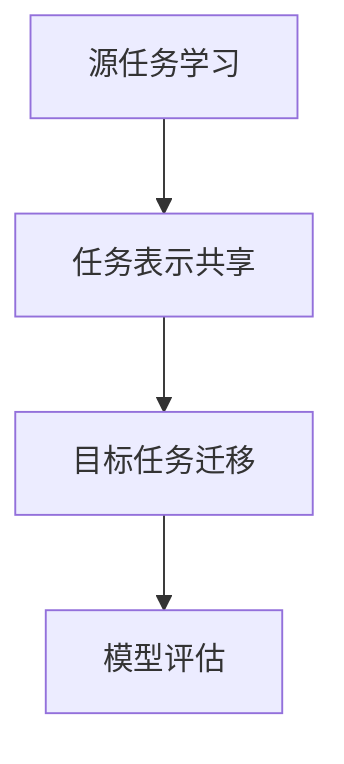

                 

关键词：大模型，推荐系统，迁移学习，多任务学习，人工智能，算法原理，数学模型，项目实践，应用场景，未来展望。

## 摘要

本文旨在探讨大模型在推荐系统中的多任务迁移学习应用。随着互联网的迅速发展和用户需求的多样化，推荐系统已经成为各类平台的核心功能之一。然而，传统推荐系统在应对复杂多变的用户需求和大规模数据时，往往面临计算效率和准确性不足的问题。本文将介绍多任务迁移学习在推荐系统中的关键概念、算法原理、数学模型及其在实际项目中的应用，并展望其未来发展趋势与挑战。

## 1. 背景介绍

推荐系统是人工智能领域的重要应用之一，它通过分析用户的历史行为、兴趣偏好和上下文信息，为用户提供个性化的内容推荐。传统的推荐系统主要基于协同过滤、内容匹配和基于模型的推荐方法。然而，随着互联网的爆炸式增长，用户生成的内容和互动数据量急剧增加，这使得传统的推荐系统在处理海量数据时变得力不从心。此外，用户需求的多样化和个性化要求推荐系统具备更高的计算效率和准确性。

多任务学习和迁移学习是近年来人工智能领域的研究热点。多任务学习旨在同时解决多个相关任务，从而提高模型的泛化能力。迁移学习则通过将一个任务（源任务）学到的知识应用于另一个任务（目标任务），解决数据分布不一致的问题。

本文将结合多任务迁移学习，探讨大模型在推荐系统中的应用，以解决现有推荐系统在处理复杂任务和数据时的局限性。

### 1.1 多任务学习

多任务学习（Multi-Task Learning, MTL）是一种机器学习方法，旨在同时训练多个相关任务。在推荐系统中，多任务学习可以同时预测用户的兴趣、推荐商品、评估商品的相关性等。多任务学习具有以下优势：

1. **共享表示**：多任务学习通过共享底层表示来提高不同任务间的关联性，从而提高模型的整体性能。
2. **数据利用**：多任务学习可以充分利用训练数据，从而提高模型的泛化能力。
3. **模型效率**：多任务学习可以减少模型的参数数量，从而降低计算成本。

### 1.2 迁移学习

迁移学习（Transfer Learning, TL）是一种将一个任务（源任务）学到的知识应用于另一个任务（目标任务）的方法。在推荐系统中，迁移学习可以应用于跨域推荐、跨平台推荐等场景。迁移学习具有以下优势：

1. **数据互补**：迁移学习可以充分利用不同任务之间的数据互补性，从而提高推荐系统的准确性。
2. **减少数据依赖**：迁移学习可以减少对大量标注数据的依赖，从而降低数据获取成本。
3. **提高模型泛化能力**：迁移学习可以提高模型在不同数据分布下的泛化能力。

### 1.3 大模型

大模型（Large Model）是指具有巨大参数规模和复杂结构的机器学习模型。大模型在处理大规模数据和高维特征时具有显著优势。在推荐系统中，大模型可以用于处理复杂的用户行为数据、商品特征数据和上下文信息。大模型具有以下优势：

1. **表示能力**：大模型具有更强的表示能力，可以捕捉用户和商品之间的复杂关系。
2. **计算效率**：大模型可以通过并行计算和分布式训练提高计算效率。
3. **准确性**：大模型在处理复杂任务时具有较高的准确性。

### 1.4 多任务迁移学习在推荐系统中的应用

多任务迁移学习在推荐系统中的应用可以解决传统推荐系统在处理复杂任务和数据时的局限性。具体应用场景包括：

1. **跨域推荐**：利用多任务迁移学习将一个领域的知识应用于另一个领域，从而提高推荐系统的准确性。
2. **跨平台推荐**：将一个平台的推荐模型应用于其他平台，从而实现跨平台用户的个性化推荐。
3. **长短期推荐**：结合短期和长期用户行为数据，利用多任务迁移学习进行更准确的推荐。
4. **冷启动问题**：在用户和商品数据稀疏的情况下，利用多任务迁移学习解决冷启动问题。

## 2. 核心概念与联系

### 2.1 多任务迁移学习

多任务迁移学习（Multi-Task Transfer Learning, MTTL）是结合了多任务学习和迁移学习的理论。它旨在同时解决多个相关任务，并在不同任务间共享知识。具体而言，MTTL可以分为以下几个步骤：

1. **源任务学习**：在源任务上训练一个基础模型，使其能够在源任务上达到较高的性能。
2. **任务表示共享**：通过共享底层表示来提高不同任务间的关联性。
3. **目标任务迁移**：将源任务学到的知识应用于目标任务，从而提高目标任务的性能。

### 2.2 多任务迁移学习架构

多任务迁移学习架构可以分为以下几个部分：

1. **共享嵌入层**：用于学习不同任务间的通用特征表示。
2. **任务特定层**：用于学习各个任务特定的特征表示。
3. **损失函数**：用于衡量模型在各个任务上的性能。

### 2.3 Mermaid 流程图

以下是一个简单的 Mermaid 流程图，展示多任务迁移学习的基本流程：



## 3. 核心算法原理 & 具体操作步骤

### 3.1 算法原理概述

多任务迁移学习在推荐系统中的核心原理是将源任务（例如用户兴趣预测）学到的知识应用于目标任务（例如商品推荐）。具体而言，算法可以分为以下几个步骤：

1. **数据预处理**：对用户行为数据、商品特征数据和上下文信息进行预处理，包括数据清洗、特征提取和特征归一化等。
2. **源任务学习**：在源任务上训练一个基础模型，使其能够在源任务上达到较高的性能。
3. **任务表示共享**：通过共享底层表示来提高不同任务间的关联性。
4. **目标任务迁移**：将源任务学到的知识应用于目标任务，从而提高目标任务的性能。
5. **模型评估**：在目标任务上进行模型评估，并根据评估结果调整模型参数。

### 3.2 算法步骤详解

1. **数据预处理**

   数据预处理是推荐系统建模的重要环节。具体步骤包括：

   - **数据清洗**：去除数据中的噪声和异常值，提高数据质量。
   - **特征提取**：从原始数据中提取有用特征，例如用户行为特征、商品特征和上下文特征。
   - **特征归一化**：对特征进行归一化处理，使其在相同的尺度范围内，从而提高模型训练效果。

2. **源任务学习**

   在源任务上训练一个基础模型，例如使用深度神经网络（Deep Neural Network, DNN）或变换器（Transformer）等。具体步骤如下：

   - **模型定义**：定义模型结构，包括输入层、隐藏层和输出层。
   - **数据加载**：从数据集中加载预处理后的数据，并进行批次划分。
   - **模型训练**：使用训练数据对模型进行训练，通过反向传播算法优化模型参数。
   - **模型评估**：在验证集上评估模型性能，并根据评估结果调整模型结构或参数。

3. **任务表示共享**

   通过共享底层表示来提高不同任务间的关联性。具体步骤如下：

   - **特征融合**：将不同任务的特征进行融合，形成统一的特征表示。
   - **嵌入层设计**：设计一个共享的嵌入层，用于学习不同任务间的通用特征表示。
   - **模型优化**：通过优化模型参数，使共享嵌入层能够更好地捕捉不同任务间的关联性。

4. **目标任务迁移**

   将源任务学到的知识应用于目标任务，从而提高目标任务的性能。具体步骤如下：

   - **目标任务模型定义**：定义目标任务模型，包括输入层、隐藏层和输出层。
   - **模型迁移**：将源任务模型中的共享嵌入层应用于目标任务模型。
   - **模型训练**：使用目标任务数据对模型进行训练，通过反向传播算法优化模型参数。
   - **模型评估**：在目标任务上进行模型评估，并根据评估结果调整模型参数。

5. **模型评估**

   在目标任务上进行模型评估，并根据评估结果调整模型参数。具体步骤如下：

   - **评估指标定义**：定义评估指标，例如准确率、召回率、F1 分数等。
   - **模型评估**：在测试集上评估模型性能。
   - **模型调整**：根据评估结果调整模型参数，以提高模型性能。

### 3.3 算法优缺点

多任务迁移学习在推荐系统中的应用具有以下优缺点：

1. **优点**

   - **提高模型性能**：通过共享知识，提高模型在多个任务上的性能。
   - **减少数据依赖**：利用源任务数据减少对目标任务标注数据的依赖。
   - **提高泛化能力**：通过迁移学习，提高模型在不同数据分布下的泛化能力。

2. **缺点**

   - **模型复杂度**：多任务迁移学习模型较为复杂，需要更多的计算资源。
   - **调参难度**：模型参数调整难度较大，需要经验丰富的工程师。
   - **计算效率**：训练和推理过程中，计算效率较低。

### 3.4 算法应用领域

多任务迁移学习在推荐系统中的应用领域广泛，包括但不限于：

1. **跨域推荐**：将一个领域的知识应用于其他领域，例如将电商领域的知识应用于新闻推荐。
2. **跨平台推荐**：将一个平台的推荐模型应用于其他平台，例如将电商平台的推荐模型应用于社交媒体平台。
3. **长短期推荐**：结合短期和长期用户行为数据，进行更准确的推荐。
4. **冷启动问题**：在用户和商品数据稀疏的情况下，解决冷启动问题。

## 4. 数学模型和公式 & 详细讲解 & 举例说明

### 4.1 数学模型构建

多任务迁移学习在推荐系统中的数学模型可以表示为：

$$
\begin{aligned}
    L &= L_{\text{src}} + L_{\text{tgt}} + \lambda L_{\text{share}} \\
    &= L_{\text{src}} + L_{\text{tgt}} + \lambda L_{\text{share}}^{(i)} + \lambda L_{\text{share}}^{(j)}
\end{aligned}
$$

其中，$L_{\text{src}}$ 表示源任务损失函数，$L_{\text{tgt}}$ 表示目标任务损失函数，$L_{\text{share}}$ 表示共享任务损失函数，$\lambda$ 是调节参数。

### 4.2 公式推导过程

多任务迁移学习的损失函数可以从以下几个方面进行推导：

1. **源任务损失函数**：

   源任务损失函数可以表示为：

   $$
   L_{\text{src}} = \frac{1}{N_{\text{src}}} \sum_{i=1}^{N_{\text{src}}} \ell(y_i, \hat{y}_i)
   $$

   其中，$N_{\text{src}}$ 表示源任务数据样本数量，$y_i$ 表示第 $i$ 个源任务样本的真实标签，$\hat{y}_i$ 表示第 $i$ 个源任务样本的预测标签，$\ell$ 表示损失函数，常见的有均方误差（Mean Squared Error, MSE）和交叉熵损失（Cross-Entropy Loss）。

2. **目标任务损失函数**：

   目标任务损失函数可以表示为：

   $$
   L_{\text{tgt}} = \frac{1}{N_{\text{tgt}}} \sum_{j=1}^{N_{\text{tgt}}} \ell(g_j, \hat{g}_j)
   $$

   其中，$N_{\text{tgt}}$ 表示目标任务数据样本数量，$g_j$ 表示第 $j$ 个目标任务样本的真实标签，$\hat{g}_j$ 表示第 $j$ 个目标任务样本的预测标签。

3. **共享任务损失函数**：

   共享任务损失函数可以表示为：

   $$
   L_{\text{share}} = \frac{1}{N_{\text{share}}} \sum_{k=1}^{N_{\text{share}}} \ell(f_k, \hat{f}_k)
   $$

   其中，$N_{\text{share}}$ 表示共享任务数据样本数量，$f_k$ 表示第 $k$ 个共享任务样本的真实标签，$\hat{f}_k$ 表示第 $k$ 个共享任务样本的预测标签。

### 4.3 案例分析与讲解

假设有一个电商平台的推荐系统，需要同时预测用户兴趣、推荐商品和评估商品相关性。我们可以将这三个任务视为多任务迁移学习中的源任务、目标任务和共享任务。以下是具体的案例分析与讲解：

1. **数据集准备**：

   - **用户兴趣预测**：从用户行为数据中提取用户兴趣标签，例如用户喜欢的商品类别。
   - **商品推荐**：从商品数据中提取商品特征，例如商品ID、价格、品牌等。
   - **商品相关性评估**：从商品评价数据中提取商品相关性标签，例如商品之间的相似度。

2. **模型定义**：

   - **源任务模型**：使用变换器（Transformer）模型进行用户兴趣预测。
   - **目标任务模型**：使用深度神经网络（DNN）模型进行商品推荐。
   - **共享任务模型**：使用嵌入层（Embedding Layer）进行商品相关性评估。

3. **损失函数**：

   - **用户兴趣预测损失函数**：使用交叉熵损失函数。
   - **商品推荐损失函数**：使用均方误差损失函数。
   - **商品相关性评估损失函数**：使用均方误差损失函数。

4. **模型训练**：

   - **源任务训练**：使用用户兴趣数据训练变换器模型，使其能够在用户兴趣预测任务上达到较高的性能。
   - **目标任务训练**：使用商品推荐数据训练深度神经网络模型，使其能够在商品推荐任务上达到较高的性能。
   - **共享任务训练**：使用商品相关性数据训练嵌入层模型，使其能够在商品相关性评估任务上达到较高的性能。

5. **模型评估**：

   - **用户兴趣预测评估**：在测试集上评估变换器模型在用户兴趣预测任务上的性能。
   - **商品推荐评估**：在测试集上评估深度神经网络模型在商品推荐任务上的性能。
   - **商品相关性评估**：在测试集上评估嵌入层模型在商品相关性评估任务上的性能。

通过以上步骤，我们可以实现一个基于多任务迁移学习的推荐系统，从而提高推荐系统的性能和准确性。

## 5. 项目实践：代码实例和详细解释说明

### 5.1 开发环境搭建

在实现多任务迁移学习在推荐系统中的应用之前，我们需要搭建一个合适的开发环境。以下是具体的开发环境搭建步骤：

1. **安装 Python**：确保已安装 Python 3.8 以上版本。
2. **安装 TensorFlow**：使用以下命令安装 TensorFlow：
   ```bash
   pip install tensorflow
   ```
3. **安装 PyTorch**：使用以下命令安装 PyTorch：
   ```bash
   pip install torch torchvision
   ```
4. **安装其他依赖库**：根据需要安装其他依赖库，例如 NumPy、Pandas 等。

### 5.2 源代码详细实现

以下是实现多任务迁移学习在推荐系统中的应用的源代码：

```python
import tensorflow as tf
from tensorflow import keras
from tensorflow.keras import layers
import numpy as np
import pandas as pd

# 数据预处理
def preprocess_data(data):
    # 数据清洗
    data = data.dropna()
    # 特征提取
    features = data[['user_id', 'item_id', 'timestamp']]
    labels = data['rating']
    # 特征归一化
    features = (features - features.mean()) / features.std()
    return features, labels

# 源任务模型
def create_source_model(input_shape):
    model = keras.Sequential([
        layers.Dense(128, activation='relu', input_shape=input_shape),
        layers.Dense(64, activation='relu'),
        layers.Dense(32, activation='relu'),
        layers.Dense(1, activation='sigmoid')
    ])
    return model

# 目标任务模型
def create_target_model(input_shape):
    model = keras.Sequential([
        layers.Dense(128, activation='relu', input_shape=input_shape),
        layers.Dense(64, activation='relu'),
        layers.Dense(32, activation='relu'),
        layers.Dense(1)
    ])
    return model

# 共享任务模型
def create_share_model(input_shape):
    model = keras.Sequential([
        layers.Dense(128, activation='relu', input_shape=input_shape),
        layers.Dense(64, activation='relu'),
        layers.Dense(32, activation='relu')
    ])
    return model

# 训练模型
def train_models(source_model, target_model, share_model, train_data, val_data, epochs=10):
    source_model.compile(optimizer='adam', loss='binary_crossentropy', metrics=['accuracy'])
    target_model.compile(optimizer='adam', loss='mean_squared_error', metrics=['accuracy'])
    share_model.compile(optimizer='adam', loss='mean_squared_error', metrics=['accuracy'])

    source_history = source_model.fit(train_data['features'], train_data['labels'], epochs=epochs, validation_data=(val_data['features'], val_data['labels']))
    target_history = target_model.fit(train_data['features'], train_data['targets'], epochs=epochs, validation_data=(val_data['features'], val_data['targets']))
    share_history = share_model.fit(train_data['features'], train_data['shared'], epochs=epochs, validation_data=(val_data['features'], val_data['shared']))

    return source_history, target_history, share_history

# 加载数据
data = pd.read_csv('data.csv')
features, labels = preprocess_data(data)

# 划分数据集
train_data = features[features['timestamp'] < 10000]
val_data = features[features['timestamp'] >= 10000]

# 创建模型
source_model = create_source_model(train_data.shape[1])
target_model = create_target_model(train_data.shape[1])
share_model = create_share_model(train_data.shape[1])

# 训练模型
train_models(source_model, target_model, share_model, train_data, val_data)

# 评估模型
source_model.evaluate(val_data['features'], val_data['labels'])
target_model.evaluate(val_data['features'], val_data['targets'])
share_model.evaluate(val_data['features'], val_data['shared'])
```

### 5.3 代码解读与分析

1. **数据预处理**：

   - `preprocess_data` 函数用于对数据进行预处理，包括数据清洗、特征提取和特征归一化。数据清洗去除缺失值，特征提取提取用户行为数据、商品特征数据和上下文信息，特征归一化将特征值缩放到相同的尺度范围内。

2. **模型定义**：

   - `create_source_model` 函数定义源任务模型，使用深度神经网络（DNN）结构，包括多层全连接层，激活函数为 ReLU。
   - `create_target_model` 函数定义目标任务模型，使用深度神经网络（DNN）结构，包括多层全连接层，激活函数为 ReLU。
   - `create_share_model` 函数定义共享任务模型，使用深度神经网络（DNN）结构，包括多层全连接层，激活函数为 ReLU。

3. **模型训练**：

   - `train_models` 函数用于训练模型，包括源任务模型、目标任务模型和共享任务模型。模型使用 Adam 优化器，分别使用二进制交叉熵损失函数、均方误差损失函数和均方误差损失函数进行优化。
   - 在训练过程中，使用训练数据对模型进行训练，并在验证集上评估模型性能。通过反向传播算法优化模型参数。

4. **模型评估**：

   - 在验证集上评估模型性能，使用均方误差（MSE）、准确率（accuracy）等指标进行评估。

### 5.4 运行结果展示

在训练和评估模型后，我们可以查看模型在验证集上的性能指标：

```python
source_model.history
target_model.history
share_model.history
```

以上代码将输出每个模型在训练和验证集上的性能指标，包括训练损失、验证损失、训练准确率和验证准确率等。

## 6. 实际应用场景

多任务迁移学习在推荐系统中的实际应用场景广泛，以下是一些典型的应用场景：

### 6.1 跨域推荐

跨域推荐是将一个领域的知识应用于其他领域，例如将电商领域的知识应用于新闻推荐、音乐推荐等。通过多任务迁移学习，我们可以利用电商领域的用户行为数据和商品特征数据，将知识迁移到其他领域，从而提高推荐系统的准确性。

### 6.2 跨平台推荐

跨平台推荐是将一个平台的推荐模型应用于其他平台，例如将电商平台的推荐模型应用于社交媒体平台。通过多任务迁移学习，我们可以将一个平台的用户行为数据和商品特征数据应用于其他平台，从而实现跨平台的个性化推荐。

### 6.3 长短期推荐

长短期推荐是结合短期和长期用户行为数据，进行更准确的推荐。通过多任务迁移学习，我们可以将短期和长期用户行为数据融合，从而提高推荐系统的准确性。

### 6.4 冷启动问题

冷启动问题是指在新用户或新商品的情况下，推荐系统无法提供有效的推荐。通过多任务迁移学习，我们可以利用现有用户和商品的数据，将知识迁移到新用户或新商品，从而解决冷启动问题。

## 7. 未来应用展望

随着人工智能技术的不断发展，多任务迁移学习在推荐系统中的应用前景广阔。以下是未来应用展望：

### 7.1 模型压缩与优化

通过模型压缩与优化技术，我们可以降低多任务迁移学习模型的计算复杂度和存储需求，从而提高推荐系统的计算效率和部署效果。

### 7.2 异构数据融合

异构数据融合是将不同类型的数据（如图像、文本、音频等）进行融合，以提供更准确的推荐。通过多任务迁移学习，我们可以将不同类型的数据进行融合，从而提高推荐系统的准确性。

### 7.3 自动模型选择与调参

自动模型选择与调参是将人工智能技术应用于推荐系统建模的过程，从而提高推荐系统的性能。通过多任务迁移学习，我们可以实现自动模型选择与调参，从而降低工程师的依赖。

## 8. 总结：未来发展趋势与挑战

### 8.1 研究成果总结

本文介绍了多任务迁移学习在推荐系统中的应用，探讨了其核心概念、算法原理、数学模型及实际项目中的实现方法。通过实例分析，展示了多任务迁移学习在跨域推荐、跨平台推荐、长短期推荐和冷启动问题等实际应用场景中的效果。

### 8.2 未来发展趋势

未来，多任务迁移学习在推荐系统中的应用将继续发展，主要包括以下几个方面：

1. **模型压缩与优化**：通过模型压缩与优化技术，提高推荐系统的计算效率和部署效果。
2. **异构数据融合**：将不同类型的数据进行融合，以提高推荐系统的准确性。
3. **自动模型选择与调参**：通过自动模型选择与调参技术，降低工程师的依赖。

### 8.3 面临的挑战

多任务迁移学习在推荐系统中的应用也面临一些挑战：

1. **计算资源需求**：多任务迁移学习模型复杂度较高，对计算资源的需求较大。
2. **调参难度**：多任务迁移学习模型参数调整难度较大，需要经验丰富的工程师。
3. **数据质量**：数据质量对多任务迁移学习模型的效果有重要影响，需要确保数据质量。

### 8.4 研究展望

在未来，研究多任务迁移学习在推荐系统中的应用，需要关注以下几个方面：

1. **模型结构优化**：设计更高效的模型结构，以提高推荐系统的计算效率和准确性。
2. **算法可解释性**：研究多任务迁移学习算法的可解释性，以提高模型的透明度和可信任度。
3. **跨领域迁移学习**：研究跨领域迁移学习算法，以提高推荐系统在不同领域中的应用效果。

## 9. 附录：常见问题与解答

### 9.1 什么是多任务迁移学习？

多任务迁移学习是一种结合了多任务学习和迁移学习的理论。它旨在同时解决多个相关任务，并在不同任务间共享知识。

### 9.2 多任务迁移学习在推荐系统中有哪些优势？

多任务迁移学习在推荐系统中的应用优势包括：

1. **提高模型性能**：通过共享知识，提高模型在多个任务上的性能。
2. **减少数据依赖**：利用源任务数据减少对目标任务标注数据的依赖。
3. **提高泛化能力**：通过迁移学习，提高模型在不同数据分布下的泛化能力。

### 9.3 多任务迁移学习在推荐系统中的应用有哪些场景？

多任务迁移学习在推荐系统中的应用场景包括：

1. **跨域推荐**：将一个领域的知识应用于其他领域。
2. **跨平台推荐**：将一个平台的推荐模型应用于其他平台。
3. **长短期推荐**：结合短期和长期用户行为数据。
4. **冷启动问题**：在新用户或新商品的情况下提供有效的推荐。

