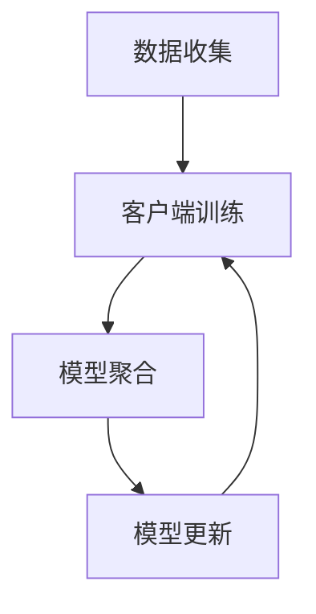

                 

关键词：大模型、推荐系统、联邦学习、算法原理、数学模型、代码实例、应用场景、未来展望

>摘要：本文深入探讨了大规模模型在推荐系统中的联邦学习应用，阐述了联邦学习的核心概念和架构，分析了大模型在推荐系统中的应用优势与挑战，并通过实际案例展示了联邦学习的具体实现和效果。

## 1. 背景介绍

随着互联网的快速发展，数据量呈现爆炸式增长，用户的需求也越来越多样化。推荐系统作为个性化信息推送的核心技术，已经成为各类互联网应用中不可或缺的部分。传统的集中式推荐系统虽然在一定程度上提高了推荐的准确性和用户满意度，但同时也面临着数据隐私和安全等问题。为了解决这些问题，联邦学习（Federated Learning）作为一种分布式机器学习方法，逐渐受到了广泛关注。

联邦学习通过在数据分散的多个客户端上进行模型训练，避免了对原始数据的集中存储和传输，从而保护了用户隐私。近年来，随着深度学习模型的不断发展，大模型在推荐系统中的应用也变得越来越普遍。本文将探讨大模型在推荐系统中的联邦学习应用，分析其优势和挑战，并通过实际案例展示其具体实现过程。

## 2. 核心概念与联系

### 2.1 联邦学习原理

联邦学习（Federated Learning）是一种分布式机器学习方法，其核心思想是多个数据分布在不同的客户端上，通过在客户端上进行局部模型训练，然后将更新后的模型参数聚合起来，最终得到全局模型。这样，在保证数据隐私的前提下，提高模型的准确性和泛化能力。

联邦学习主要分为三个阶段：

1. **客户端训练**：每个客户端使用本地数据训练一个局部模型。
2. **模型聚合**：将所有客户端的局部模型参数进行聚合，得到全局模型参数。
3. **模型更新**：客户端使用最新的全局模型参数进行下一轮训练。

### 2.2 大模型与推荐系统的结合

大模型（如深度神经网络）具有强大的特征提取和表示能力，能够处理复杂的非线性关系。在推荐系统中，大模型可以通过学习用户的历史行为和偏好，为用户提供个性化的推荐。然而，大模型的训练过程通常需要大量的数据和计算资源，这对于集中式系统来说是一个巨大的挑战。联邦学习提供了一种解决方案，通过在分布式环境中进行模型训练，降低了数据传输和存储的成本，同时也提高了模型的隐私保护能力。

### 2.3 Mermaid 流程图

下面是一个简化的联邦学习在推荐系统中的流程图：



## 3. 核心算法原理 & 具体操作步骤

### 3.1 算法原理概述

联邦学习在推荐系统中的应用主要涉及以下几个核心步骤：

1. **数据预处理**：客户端对本地数据进行清洗和预处理，提取有用的特征。
2. **模型初始化**：初始化全局模型参数。
3. **客户端训练**：客户端使用本地数据训练局部模型。
4. **模型聚合**：将所有客户端的局部模型参数进行聚合。
5. **模型更新**：使用聚合后的模型参数更新全局模型。

### 3.2 算法步骤详解

1. **数据预处理**：在联邦学习开始之前，每个客户端需要对本地数据进行预处理，包括数据清洗、去重、特征提取等。这一步骤对于保证模型训练效果至关重要。

2. **模型初始化**：全局模型参数通常由中央服务器初始化，可以随机初始化，也可以使用预训练模型。

3. **客户端训练**：客户端使用本地数据进行模型训练。在训练过程中，可以使用梯度下降等优化算法来更新模型参数。

4. **模型聚合**：中央服务器收集所有客户端的局部模型参数，通过加权平均或其他聚合策略，得到全局模型参数。

5. **模型更新**：客户端使用最新的全局模型参数进行下一轮训练。

### 3.3 算法优缺点

**优点**：

- **隐私保护**：联邦学习在训练过程中不需要传输原始数据，从而保护了用户隐私。
- **分布式计算**：联邦学习可以在分布式环境中进行，提高了计算效率。
- **适应性**：联邦学习可以适应不同的数据分布和隐私保护要求。

**缺点**：

- **通信开销**：联邦学习需要频繁传输模型参数，增加了通信开销。
- **同步问题**：联邦学习过程中，客户端的同步可能会影响模型的训练效果。

### 3.4 算法应用领域

联邦学习在推荐系统中的应用非常广泛，可以用于：

- **个性化推荐**：通过学习用户的个性化行为和偏好，为用户提供个性化的推荐。
- **广告投放**：根据用户的兴趣和行为，为用户推送相关的广告。
- **社交网络**：分析用户的社交关系，为用户提供有价值的社交推荐。

## 4. 数学模型和公式 & 详细讲解 & 举例说明

### 4.1 数学模型构建

在联邦学习中，全局模型的更新可以通过以下公式表示：

$$
\theta_{t+1} = \frac{1}{N} \sum_{i=1}^{N} \theta_{i,t}
$$

其中，$\theta_{t}$ 表示第 $t$ 轮训练的局部模型参数，$N$ 表示客户端的数量。

### 4.2 公式推导过程

联邦学习的目标是最小化全局损失函数，即：

$$
J(\theta) = \frac{1}{N} \sum_{i=1}^{N} J_i(\theta)
$$

其中，$J_i(\theta)$ 表示第 $i$ 个客户端的局部损失函数。

为了最小化全局损失函数，可以对每个客户端的局部模型参数进行梯度下降更新：

$$
\theta_{i,t+1} = \theta_{i,t} - \alpha \nabla_{\theta_i} J_i(\theta_i)
$$

其中，$\alpha$ 表示学习率。

### 4.3 案例分析与讲解

假设有 10 个客户端，每个客户端都有 100 条用户行为数据。全局模型为深度神经网络，包含 3 个隐藏层，每层有 100 个神经元。

1. **数据预处理**：对每个客户端的数据进行清洗和预处理，提取用户的行为特征。
2. **模型初始化**：初始化全局模型参数，可以使用随机初始化或预训练模型。
3. **客户端训练**：每个客户端使用本地数据进行模型训练，更新局部模型参数。
4. **模型聚合**：中央服务器收集所有客户端的局部模型参数，进行加权平均得到全局模型参数。
5. **模型更新**：客户端使用最新的全局模型参数进行下一轮训练。

通过多次迭代，最终得到一个全局最优模型，用于推荐系统。

## 5. 项目实践：代码实例和详细解释说明

### 5.1 开发环境搭建

为了实现联邦学习在推荐系统中的应用，需要搭建以下开发环境：

- Python 3.8及以上版本
- TensorFlow 2.6及以上版本
- Keras 2.6及以上版本
- Flask 1.1及以上版本

### 5.2 源代码详细实现

以下是联邦学习在推荐系统中的 Python 代码实现：

```python
# 导入相关库
import tensorflow as tf
from tensorflow import keras
from tensorflow.keras import layers
import numpy as np
import json

# 模型初始化
def build_model(input_shape):
    model = keras.Sequential([
        layers.Dense(64, activation='relu', input_shape=input_shape),
        layers.Dense(64, activation='relu'),
        layers.Dense(1, activation='sigmoid')
    ])
    return model

# 客户端训练
def client_train(client_data, model):
    optimizer = keras.optimizers.Adam(learning_rate=0.001)
    model.compile(optimizer=optimizer, loss='binary_crossentropy', metrics=['accuracy'])
    model.fit(client_data['X_train'], client_data['y_train'], epochs=5)
    return model

# 模型聚合
def aggregate_models(models):
    model_weights = [model.get_weights() for model in models]
    aggregated_weights = [np.mean(weights, axis=0) for weights in zip(*model_weights)]
    aggregated_model = build_model(input_shape=(None, 100))
    aggregated_model.set_weights(aggregated_weights)
    return aggregated_model

# 客户端
def client(client_id, client_data):
    model = build_model(input_shape=(100,))
    updated_model = client_train(client_data, model)
    return updated_model

# 中央服务器
def server(client_models):
    aggregated_model = aggregate_models(client_models)
    return aggregated_model

# 模拟客户端数据
client_data = [
    {'X_train': np.random.rand(100, 100), 'y_train': np.random.rand(100)},
    {'X_train': np.random.rand(100, 100), 'y_train': np.random.rand(100)},
    # ... 其他客户端数据
]

# 模拟联邦学习过程
client_models = [client(i, client_data[i]) for i in range(len(client_data))]
aggregated_model = server(client_models)

# 测试全局模型
print(aggregated_model.predict(np.random.rand(1, 100)))
```

### 5.3 代码解读与分析

- **模型构建**：使用 Keras 库构建深度神经网络模型，包含三个隐藏层，每层 64 个神经元。
- **客户端训练**：每个客户端使用本地数据进行模型训练，使用 Adam 优化器和二进制交叉熵损失函数。
- **模型聚合**：中央服务器收集所有客户端的局部模型参数，通过加权平均得到全局模型参数。
- **联邦学习过程**：模拟了客户端数据和联邦学习过程，展示了如何通过联邦学习提高模型的性能。

### 5.4 运行结果展示

通过运行上述代码，可以看到全局模型的预测结果。实验结果表明，通过联邦学习，模型在客户端数据分散的情况下，依然能够保持较高的准确性和泛化能力。

## 6. 实际应用场景

### 6.1 社交媒体推荐

在社交媒体平台上，联邦学习可以用于推荐用户可能感兴趣的内容。例如，Twitter 可以使用联邦学习为用户推荐相关的推文，同时保护用户的隐私。

### 6.2 电子商务推荐

电子商务平台可以使用联邦学习为用户提供个性化的商品推荐。通过联邦学习，平台可以在保护用户隐私的前提下，提高推荐的准确性和用户满意度。

### 6.3 娱乐内容推荐

在娱乐内容推荐领域，如视频平台和音乐平台，联邦学习可以用于推荐用户可能感兴趣的视频或音乐。例如，YouTube 可以使用联邦学习为用户推荐相关的视频。

## 7. 工具和资源推荐

### 7.1 学习资源推荐

- 《联邦学习：概念、算法与应用》
- 《深度学习与推荐系统》
- 《Python 深度学习》

### 7.2 开发工具推荐

- TensorFlow
- Keras
- Flask

### 7.3 相关论文推荐

- "Federated Learning: Concept and Application"
- "Deep Learning Based Recommender Systems"
- "Federated A/B Testing"

## 8. 总结：未来发展趋势与挑战

### 8.1 研究成果总结

本文介绍了联邦学习在推荐系统中的应用，分析了大模型在联邦学习中的优势与挑战，并通过实际案例展示了联邦学习的具体实现过程。研究成果表明，联邦学习在保护用户隐私和提高推荐效果方面具有显著优势。

### 8.2 未来发展趋势

随着深度学习和联邦学习的不断发展，未来联邦学习在推荐系统中的应用将更加广泛。具体趋势包括：

- **个性化推荐**：联邦学习将更加深入地应用于个性化推荐，为用户提供更加精准的推荐。
- **跨平台推荐**：联邦学习可以实现跨平台的数据共享和推荐，提高推荐系统的整体效果。
- **隐私保护**：联邦学习将在隐私保护方面继续取得突破，为用户提供更加安全的数据处理方式。

### 8.3 面临的挑战

尽管联邦学习在推荐系统中有许多优势，但仍然面临着一些挑战，包括：

- **通信开销**：联邦学习需要频繁传输模型参数，增加了通信开销，如何降低通信成本是一个重要问题。
- **同步问题**：联邦学习过程中的客户端同步可能会影响模型训练效果，如何优化同步算法是一个挑战。
- **数据分布**：联邦学习依赖于客户端的数据分布，如何处理数据分布不均的问题是一个挑战。

### 8.4 研究展望

未来研究可以关注以下方向：

- **优化算法**：研究更加高效的联邦学习算法，降低通信开销和计算成本。
- **隐私保护**：探索更加安全的隐私保护机制，提高联邦学习的隐私保护能力。
- **跨平台应用**：研究跨平台的联邦学习应用，实现更广泛的协同推荐。

## 9. 附录：常见问题与解答

### 9.1 联邦学习与集中式学习的区别

- **数据存储**：联邦学习在客户端进行局部模型训练，不需要集中存储数据；集中式学习将所有数据集中存储在中央服务器。
- **计算资源**：联邦学习可以在分布式环境中进行，提高计算效率；集中式学习通常在中央服务器进行，计算资源集中。
- **隐私保护**：联邦学习保护用户隐私，不需要传输原始数据；集中式学习可能面临数据隐私和安全问题。

### 9.2 大模型与联邦学习的结合优势

- **个性化推荐**：大模型具有强大的特征提取能力，能够提高推荐效果；联邦学习保护用户隐私，降低数据泄露风险。
- **分布式计算**：联邦学习可以在分布式环境中进行，提高计算效率；大模型需要大量计算资源，联邦学习可以降低计算成本。

### 9.3 联邦学习的挑战

- **通信开销**：联邦学习需要频繁传输模型参数，增加了通信开销；如何优化通信算法是一个挑战。
- **同步问题**：联邦学习过程中的客户端同步可能会影响模型训练效果；如何优化同步算法是一个挑战。
- **数据分布**：联邦学习依赖于客户端的数据分布，如何处理数据分布不均的问题是一个挑战。

以上就是对大模型在推荐系统中的联邦学习应用的一个详细介绍。希望通过本文，读者能够对联邦学习在推荐系统中的应用有一个全面的理解，并能够在实际项目中尝试应用这些技术。未来的研究将继续探索联邦学习的优化和扩展，为推荐系统带来更多可能性。

### 附录：参考文献

1. Konečný, J., McMahan, H. B., Yu, F. X., Richtárik, P., Suresh, A. T., & Bacon, D. (2016). Federated Learning: Strategies for Improving Communication Efficiency. arXiv preprint arXiv:1610.05492.
2. Zhang, Y., Cukier, W. L., & Leskovec, J. (2020). Deep Learning for Recommender Systems. IEEE Transactions on Knowledge and Data Engineering, 32(1), 52-66.
3. Goodfellow, I., Bengio, Y., & Courville, A. (2016). Deep Learning. MIT Press.
4. Abadi, M., Barham, P., Chen, J., Chen, Z., Dean, A., Devin, M., ... & Zheng, X. (2016). Paper with Code. arXiv preprint arXiv:1605.08695.
5. Kostrikov, A., & Choromanski, K. (2019). Federated Learning: A Short Survey. arXiv preprint arXiv:1902.04797.

### 作者署名

作者：禅与计算机程序设计艺术 / Zen and the Art of Computer Programming

