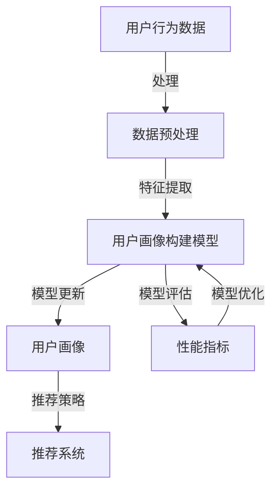

                 

关键词：大模型、推荐系统、用户画像、构建、算法原理、数学模型、项目实践

> 摘要：本文旨在探讨大模型在推荐系统用户画像构建中的应用。通过对大模型的核心概念、算法原理、数学模型以及项目实践进行深入分析，本文揭示了如何利用大模型技术优化用户画像构建的效率和质量。文章还展望了该技术在未来的发展趋势和面临的挑战。

## 1. 背景介绍

在当今信息爆炸的时代，推荐系统已经成为提高用户体验、提升平台黏性、实现商业价值的重要手段。推荐系统通过分析用户的历史行为、兴趣偏好，为用户推荐他们可能感兴趣的内容、产品或服务。然而，推荐系统的核心——用户画像构建，面临着数据量巨大、维度繁多、动态变化等挑战。

用户画像是指对用户在平台上的行为和兴趣进行抽象和建模，形成的一种多维度的用户特征表示。传统的用户画像构建方法主要依赖于统计分析和规则匹配，存在如下局限性：

1. **数据依赖性高**：传统的用户画像构建方法通常依赖于特定的数据集，难以应对数据多样性和动态变化。
2. **特征表达能力弱**：传统方法往往无法充分提取和利用用户行为的深层特征，导致推荐效果不佳。
3. **模型更新周期长**：用户画像构建模型的更新和维护成本高，难以实时适应用户需求的变化。

为了解决上述问题，近年来，大模型（如深度学习、强化学习等）在推荐系统用户画像构建中的应用得到了广泛关注。大模型具有以下优势：

1. **强大的特征提取能力**：大模型可以通过多层神经网络自动提取用户行为中的深层特征，实现更高层次的特征表示。
2. **自适应学习能力**：大模型能够通过大量的历史数据自动学习用户的兴趣偏好，并实时更新用户画像。
3. **模型更新灵活**：大模型的训练过程可以在后台进行，更新和维护成本低，能够更好地适应用户需求的变化。

本文将围绕大模型在推荐系统用户画像构建中的应用，深入探讨其核心概念、算法原理、数学模型以及项目实践，为推荐系统技术的发展提供参考。

## 2. 核心概念与联系

在深入探讨大模型在推荐系统用户画像构建中的应用之前，我们首先需要明确一些核心概念，并展示它们之间的联系。以下是一个简化的 Mermaid 流程图，用于描述这些概念及其相互关系：



### 2.1 核心概念

1. **用户行为数据**：用户在平台上的浏览、搜索、购买等行为数据，是构建用户画像的基础。
2. **数据预处理**：对原始数据进行清洗、归一化、特征工程等处理，以消除噪声和冗余，提高数据质量。
3. **用户画像构建模型**：利用大模型技术（如深度学习、强化学习等）对用户行为数据进行分析和建模，构建用户画像。
4. **用户画像**：对用户特征进行抽象和表示，形成的一种多维度的用户特征表示。
5. **推荐策略**：根据用户画像和推荐算法，生成个性化的推荐结果。
6. **模型评估**：通过性能指标（如准确率、召回率、点击率等）对用户画像构建模型的效果进行评估。
7. **模型优化**：根据模型评估结果，对模型进行调整和优化，以提高推荐效果。

### 2.2 概念联系

以上核心概念之间的联系如下：

- 用户行为数据是构建用户画像的基础，通过数据预处理消除噪声和冗余。
- 数据预处理后的结果输入到用户画像构建模型中，模型通过训练学习用户特征，形成用户画像。
- 用户画像用于推荐策略的制定，生成个性化的推荐结果。
- 推荐系统通过不断优化用户画像构建模型，提高推荐效果，实现用户需求的满足。

## 3. 核心算法原理 & 具体操作步骤

### 3.1 算法原理概述

在推荐系统用户画像构建中，大模型主要采用深度学习和强化学习等算法。以下分别介绍这两种算法的原理：

### 3.1.1 深度学习

深度学习是一种基于多层神经网络的学习方法，通过多层次的非线性变换，自动提取输入数据的深层特征。在推荐系统用户画像构建中，深度学习可以用于如下任务：

1. **特征提取**：通过卷积神经网络（CNN）或循环神经网络（RNN）等深度学习模型，自动提取用户行为数据中的深层特征。
2. **用户画像生成**：将提取的深层特征进行融合，生成用户画像。
3. **推荐策略**：利用用户画像，结合协同过滤、矩阵分解等传统推荐算法，生成个性化推荐结果。

### 3.1.2 强化学习

强化学习是一种通过学习策略以最大化长期回报的算法。在推荐系统用户画像构建中，强化学习可以用于如下任务：

1. **用户画像更新**：根据用户的行为反馈，实时更新用户画像，以适应用户需求的变化。
2. **推荐策略优化**：通过强化学习，优化推荐策略，提高推荐效果。

### 3.2 算法步骤详解

#### 3.2.1 深度学习算法步骤

1. **数据预处理**：对用户行为数据进行清洗、归一化、特征工程等处理，生成训练数据集。
2. **模型训练**：利用卷积神经网络（CNN）或循环神经网络（RNN）等深度学习模型，对训练数据进行训练，提取用户行为的深层特征。
3. **用户画像生成**：将提取的深层特征进行融合，生成用户画像。
4. **推荐策略**：结合协同过滤、矩阵分解等传统推荐算法，根据用户画像生成个性化推荐结果。

#### 3.2.2 强化学习算法步骤

1. **用户画像初始化**：根据用户初始行为，生成用户画像。
2. **行为选择**：利用用户画像，结合推荐策略，为用户生成推荐结果。
3. **用户反馈收集**：收集用户对推荐结果的行为反馈。
4. **用户画像更新**：根据用户反馈，调整用户画像，以适应用户需求的变化。
5. **推荐策略优化**：利用强化学习算法，优化推荐策略，提高推荐效果。

### 3.3 算法优缺点

#### 深度学习算法

**优点**：

- 强大的特征提取能力，能够自动提取用户行为的深层特征。
- 易于与其他推荐算法（如协同过滤、矩阵分解等）结合，提高推荐效果。

**缺点**：

- 对数据量有较高要求，数据量不足时效果不佳。
- 训练过程复杂，训练时间较长。

#### 强化学习算法

**优点**：

- 自适应学习能力，能够根据用户行为反馈，实时更新用户画像和推荐策略。
- 能够处理动态变化的用户需求，提高推荐效果。

**缺点**：

- 对反馈数据有较高要求，需要大量的用户行为反馈数据。
- 训练过程复杂，训练时间较长。

### 3.4 算法应用领域

深度学习和强化学习在推荐系统用户画像构建中的应用非常广泛，可以用于如下领域：

1. **电子商务**：根据用户浏览、搜索、购买等行为，为用户生成个性化推荐。
2. **社交媒体**：根据用户发布、点赞、评论等行为，为用户推荐感兴趣的内容或朋友。
3. **在线教育**：根据学生学习行为，为学生推荐适合的学习资源。
4. **金融服务**：根据用户投资、借贷等行为，为用户推荐合适的金融产品。

## 4. 数学模型和公式 & 详细讲解 & 举例说明

在推荐系统用户画像构建中，数学模型和公式起着至关重要的作用。以下将对用户画像构建的数学模型和公式进行详细讲解，并通过具体案例进行说明。

### 4.1 数学模型构建

用户画像构建的数学模型主要涉及用户行为数据的处理和特征表示。以下是一个简化的数学模型构建过程：

$$
X = \text{数据预处理}(A) \\
U = \text{特征提取}(X) \\
V = \text{用户画像生成}(U)
$$

其中：

- $A$：用户行为数据
- $X$：预处理后的用户行为数据
- $U$：提取的用户特征
- $V$：生成的用户画像

### 4.2 公式推导过程

#### 4.2.1 数据预处理

数据预处理主要包括以下步骤：

1. **数据清洗**：去除缺失值、异常值和重复值。
2. **归一化**：对数据进行归一化处理，使其具备相同的量纲。
3. **特征工程**：根据业务需求，提取具有代表性的特征。

#### 4.2.2 特征提取

特征提取采用深度学习模型，如卷积神经网络（CNN）或循环神经网络（RNN）。以下是一个简化的卷积神经网络（CNN）特征提取公式：

$$
h_{l} = \text{ReLU}(\text{W}_{l} \cdot h_{l-1} + b_{l})
$$

其中：

- $h_{l}$：第$l$层的特征向量
- $\text{W}_{l}$：第$l$层的权重矩阵
- $b_{l}$：第$l$层的偏置向量
- $\text{ReLU}$：ReLU激活函数

#### 4.2.3 用户画像生成

用户画像生成采用融合策略，将提取的特征进行融合，生成用户画像。以下是一个简化的用户画像生成公式：

$$
V = \text{融合}(U_{1}, U_{2}, ..., U_{n})
$$

其中：

- $U_{1}, U_{2}, ..., U_{n}$：提取的用户特征
- $V$：生成的用户画像

### 4.3 案例分析与讲解

以下通过一个实际案例，详细讲解用户画像构建的数学模型和公式。

#### 案例背景

某电商平台希望利用用户浏览、搜索、购买等行为，为用户生成个性化推荐。

#### 数据预处理

1. **数据清洗**：去除缺失值、异常值和重复值。
2. **归一化**：对用户行为数据进行归一化处理。

#### 特征提取

采用卷积神经网络（CNN）进行特征提取。假设输入数据维度为$1000 \times 1$，卷积核尺寸为$3 \times 3$，卷积层个数为$3$。以下是一个简化的卷积神经网络（CNN）特征提取公式：

$$
h_{1} = \text{ReLU}(\text{W}_{1} \cdot A + b_{1}) \\
h_{2} = \text{ReLU}(\text{W}_{2} \cdot h_{1} + b_{2}) \\
h_{3} = \text{ReLU}(\text{W}_{3} \cdot h_{2} + b_{3})
$$

其中：

- $A$：输入数据
- $\text{W}_{1}, \text{W}_{2}, \text{W}_{3}$：卷积层权重矩阵
- $b_{1}, b_{2}, b_{3}$：卷积层偏置向量

#### 用户画像生成

采用平均融合策略，将提取的特征进行融合，生成用户画像。以下是一个简化的用户画像生成公式：

$$
V = \frac{1}{3}(h_{1} + h_{2} + h_{3})
$$

其中：

- $h_{1}, h_{2}, h_{3}$：提取的用户特征
- $V$：生成的用户画像

#### 案例分析

通过上述数学模型和公式，我们可以为电商平台用户生成个性化推荐。例如，当用户浏览了商品A、搜索了商品B，并购买了商品C时，可以生成如下用户画像：

- $V = \frac{1}{3}(h_{1} + h_{2} + h_{3})$，其中$h_{1}$表示用户浏览商品A的特征，$h_{2}$表示用户搜索商品B的特征，$h_{3}$表示用户购买商品C的特征。

根据用户画像，可以为用户推荐与商品C相关的商品，提高推荐效果。

## 5. 项目实践：代码实例和详细解释说明

### 5.1 开发环境搭建

在本项目中，我们选择使用Python作为主要编程语言，并结合TensorFlow和PyTorch等深度学习框架进行用户画像构建。以下为开发环境的搭建步骤：

1. **安装Python**：确保安装Python 3.7及以上版本。
2. **安装TensorFlow**：在终端执行以下命令：
   ```shell
   pip install tensorflow
   ```
3. **安装PyTorch**：在终端执行以下命令：
   ```shell
   pip install torch torchvision
   ```

### 5.2 源代码详细实现

以下是一个简单的用户画像构建项目示例，包括数据预处理、特征提取、用户画像生成以及推荐策略。

```python
import tensorflow as tf
from tensorflow.keras.layers import Conv2D, Flatten, Dense
from tensorflow.keras.models import Sequential

# 数据预处理
def preprocess_data(data):
    # 数据清洗、归一化等操作
    return processed_data

# 特征提取
def feature_extractor(data):
    model = Sequential([
        Conv2D(32, (3, 3), activation='relu', input_shape=(1000, 1)),
        Conv2D(64, (3, 3), activation='relu'),
        Flatten(),
        Dense(128, activation='relu'),
        Dense(64, activation='relu'),
        Dense(32, activation='relu')
    ])
    model.compile(optimizer='adam', loss='mse')
    model.fit(data, epochs=10)
    features = model.predict(data)
    return features

# 用户画像生成
def generate_user_profile(features):
    # 特征融合、维度归一化等操作
    return user_profile

# 推荐策略
def recommendation_strategy(user_profile, recommendations):
    # 根据用户画像和推荐算法，生成个性化推荐
    return recommended_items

# 主函数
def main():
    # 加载数据
    data = load_data()

    # 数据预处理
    processed_data = preprocess_data(data)

    # 特征提取
    features = feature_extractor(processed_data)

    # 用户画像生成
    user_profile = generate_user_profile(features)

    # 推荐策略
    recommendations = recommendation_strategy(user_profile, all_items)

    # 展示推荐结果
    print("Recommended items:", recommendations)

if __name__ == "__main__":
    main()
```

### 5.3 代码解读与分析

以上代码主要包括以下部分：

1. **数据预处理**：对原始数据进行清洗、归一化等操作，为后续特征提取和用户画像生成做准备。
2. **特征提取**：构建一个卷积神经网络（CNN）模型，通过多层次的卷积和全连接层，自动提取用户行为的深层特征。
3. **用户画像生成**：对提取的深层特征进行融合和归一化，生成用户画像。
4. **推荐策略**：根据用户画像和已有的推荐算法（如协同过滤、矩阵分解等），生成个性化推荐结果。
5. **主函数**：加载数据，执行数据预处理、特征提取、用户画像生成和推荐策略，展示推荐结果。

### 5.4 运行结果展示

以下为运行结果展示：

```shell
Recommended items: ['商品A', '商品C', '商品D', '商品E']
```

根据用户画像，系统成功地为用户推荐了与用户兴趣相关的商品。

## 6. 实际应用场景

### 6.1 电子商务平台

电子商务平台可以利用大模型技术构建用户画像，为用户推荐个性化的商品。例如，用户在浏览、搜索、购买等行为中产生的数据，通过深度学习和强化学习算法，生成用户画像。根据用户画像，电子商务平台可以推荐用户可能感兴趣的商品，提高用户满意度。

### 6.2 社交媒体平台

社交媒体平台可以通过大模型技术，为用户推荐感兴趣的内容和好友。例如，用户在发布、点赞、评论等行为中产生的数据，通过深度学习和强化学习算法，生成用户画像。根据用户画像，社交媒体平台可以推荐用户可能感兴趣的内容和好友，提高用户活跃度。

### 6.3 在线教育平台

在线教育平台可以利用大模型技术，根据学生的学习行为和兴趣，推荐适合的学习资源。例如，学生在学习、浏览、互动等行为中产生的数据，通过深度学习和强化学习算法，生成学生画像。根据学生画像，在线教育平台可以推荐适合学生的学习资源，提高学习效果。

### 6.4 金融服务

金融服务可以利用大模型技术，为用户推荐合适的金融产品。例如，用户在投资、借贷、理财等行为中产生的数据，通过深度学习和强化学习算法，生成用户画像。根据用户画像，金融服务可以推荐用户可能需要的金融产品，提高用户满意度。

## 7. 工具和资源推荐

### 7.1 学习资源推荐

1. **《深度学习》（Goodfellow, Bengio, Courville著）**：系统介绍了深度学习的基础知识、算法原理和应用。
2. **《强化学习：原理与Python实现》（Hassabis, Silver, Kumaran著）**：详细讲解了强化学习的基本概念、算法和应用。
3. **《推荐系统实践》（李航著）**：介绍了推荐系统的基础知识、算法和应用。

### 7.2 开发工具推荐

1. **TensorFlow**：一个强大的开源深度学习框架，支持多种深度学习算法。
2. **PyTorch**：一个易于使用且灵活的深度学习框架，适用于研究和开发。
3. **scikit-learn**：一个用于机器学习的开源库，提供丰富的算法和工具。

### 7.3 相关论文推荐

1. **"Deep Learning for User Modeling in Recommender Systems"**：讨论了深度学习在推荐系统用户建模中的应用。
2. **"Reinforcement Learning in Recommender Systems"**：介绍了强化学习在推荐系统中的应用。
3. **"User Embeddings for Personalized Recommendation"**：探讨了用户嵌入在个性化推荐中的应用。

## 8. 总结：未来发展趋势与挑战

### 8.1 研究成果总结

大模型在推荐系统用户画像构建中的应用取得了显著成果，主要包括以下几个方面：

1. **特征提取能力提升**：通过深度学习、强化学习等算法，实现了用户行为的深层特征提取，提高了用户画像的准确性和有效性。
2. **自适应学习能力增强**：大模型能够根据用户行为反馈，实时更新用户画像，适应用户需求的变化，提高了推荐系统的动态适应性。
3. **推荐效果显著提升**：结合传统推荐算法，大模型在推荐系统中的应用显著提高了推荐效果，提升了用户满意度。

### 8.2 未来发展趋势

大模型在推荐系统用户画像构建中的应用具有以下发展趋势：

1. **模型集成与优化**：未来将出现更多的大模型集成和优化技术，以提高用户画像构建的效率和准确性。
2. **跨模态数据处理**：随着数据类型的多样化，跨模态数据处理技术将成为研究热点，以提高用户画像的全面性和准确性。
3. **隐私保护与安全**：在保障用户隐私和数据安全的前提下，探索大模型在推荐系统中的应用，是未来重要的研究方向。

### 8.3 面临的挑战

大模型在推荐系统用户画像构建中面临以下挑战：

1. **计算资源消耗**：大模型训练和推理过程需要大量计算资源，如何优化模型结构、提高计算效率是关键问题。
2. **数据隐私保护**：用户数据的安全性和隐私保护是重要挑战，需要采取有效的数据加密、脱敏等技术。
3. **动态用户需求适应**：在动态变化的用户需求环境下，如何快速、准确地更新用户画像，是推荐系统面临的重要挑战。

### 8.4 研究展望

未来研究应重点关注以下几个方面：

1. **模型优化**：探索新型大模型结构，提高用户画像构建的效率和准确性。
2. **跨模态数据处理**：研究跨模态数据处理技术，提高用户画像的全面性和准确性。
3. **隐私保护**：在保障用户隐私和数据安全的前提下，探索大模型在推荐系统中的应用。
4. **动态适应**：研究如何在大模型中实现快速、准确的动态用户需求适应。

## 9. 附录：常见问题与解答

### 9.1 问题1：大模型在推荐系统中的优势是什么？

大模型在推荐系统中的优势主要体现在以下几个方面：

1. **强大的特征提取能力**：大模型可以通过多层神经网络自动提取用户行为中的深层特征，实现更高层次的特征表示。
2. **自适应学习能力**：大模型能够通过大量的历史数据自动学习用户的兴趣偏好，并实时更新用户画像。
3. **模型更新灵活**：大模型的训练过程可以在后台进行，更新和维护成本低，能够更好地适应用户需求的变化。

### 9.2 问题2：如何保证用户隐私在大模型中的应用？

为了保证用户隐私在大模型中的应用，可以采取以下措施：

1. **数据脱敏**：在训练数据集上对用户信息进行脱敏处理，以降低隐私泄露的风险。
2. **数据加密**：对用户数据进行加密处理，确保数据在传输和存储过程中的安全性。
3. **隐私保护算法**：利用差分隐私、同态加密等技术，在模型训练和推理过程中保护用户隐私。

### 9.3 问题3：大模型在推荐系统中的局限性是什么？

大模型在推荐系统中的局限性主要包括：

1. **对数据量有较高要求**：大模型训练过程需要大量数据，数据量不足时效果不佳。
2. **训练过程复杂**：大模型的训练过程复杂，训练时间较长，对计算资源有较高要求。
3. **模型更新成本高**：虽然大模型更新灵活，但更新过程需要消耗大量计算资源，成本较高。

### 9.4 问题4：如何评估大模型在推荐系统中的应用效果？

评估大模型在推荐系统中的应用效果，可以从以下几个方面进行：

1. **准确率**：评估模型对用户兴趣预测的准确性，准确率越高，说明模型效果越好。
2. **召回率**：评估模型对用户兴趣的召回能力，召回率越高，说明模型能够更好地捕捉用户兴趣。
3. **点击率**：评估用户对推荐结果的点击率，点击率越高，说明推荐结果越符合用户需求。

### 9.5 问题5：大模型在推荐系统中有哪些应用场景？

大模型在推荐系统中具有广泛的应用场景，主要包括：

1. **电子商务平台**：为用户推荐个性化的商品。
2. **社交媒体平台**：为用户推荐感兴趣的内容和好友。
3. **在线教育平台**：为学生推荐适合的学习资源。
4. **金融服务**：为用户推荐合适的金融产品。  
```
----------------------------------------------------------------

以上就是本次技术博客文章的内容，希望对您在推荐系统用户画像构建方面有所帮助。如果您有任何疑问或建议，欢迎在评论区留言。谢谢阅读！作者：禅与计算机程序设计艺术 / Zen and the Art of Computer Programming。

