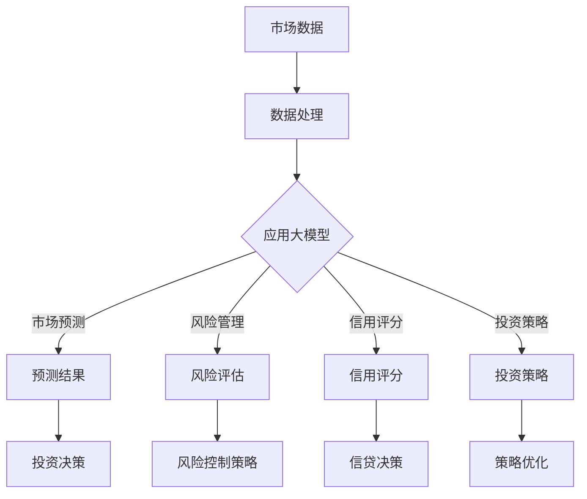

                 

关键词：大模型、智能金融、深度学习、金融科技、算法、金融预测、风险管理、信用评分、投资策略

> 摘要：本文将探讨大模型在智能金融领域的应用前景。随着人工智能和大数据技术的快速发展，大模型在金融领域的应用逐渐变得广泛。本文将从背景介绍、核心概念与联系、核心算法原理、数学模型和公式、项目实践、实际应用场景、工具和资源推荐以及总结和展望等几个方面详细分析大模型在智能金融中的潜力。

## 1. 背景介绍

随着互联网和金融科技的迅猛发展，金融行业的数据量和复杂度不断增加。金融机构面临着诸多挑战，如市场预测、风险管理、信用评分、投资策略优化等。传统的金融分析方法已经难以应对这些复杂的问题，而人工智能技术的发展，尤其是深度学习和大模型的兴起，为解决这些问题提供了新的思路和工具。

大模型，如Transformer、GPT（Generative Pre-trained Transformer）、BERT（Bidirectional Encoder Representations from Transformers）等，通过在海量数据上进行预训练，能够捕捉到数据中的复杂模式和潜在规律。这些模型在自然语言处理、计算机视觉、语音识别等领域已经取得了显著的成果，逐渐被应用到金融领域。

智能金融，是指利用人工智能技术，特别是深度学习和大数据分析，提高金融服务效率和质量，优化投资决策和风险管理。智能金融的核心在于利用数据驱动的方式，实现金融业务的自动化和智能化。大模型在智能金融中的应用，为金融行业带来了新的机遇和挑战。

## 2. 核心概念与联系

### 2.1 大模型的定义

大模型是指具有大规模参数和广泛预训练能力的深度学习模型。这些模型通常通过在海量数据上进行预训练，学习到数据中的复杂模式和潜在规律。大模型的显著特点是其能够处理大量的数据和复杂的任务，并且能够通过迁移学习快速适应新的任务。

### 2.2 深度学习与金融的关系

深度学习是人工智能的一个重要分支，通过模拟人脑的神经网络结构，实现数据的自动特征提取和模式识别。深度学习在金融领域的应用，主要体现在以下几个方面：

- **市场预测**：通过分析历史市场数据，预测股票价格、汇率等金融市场的未来走势。
- **风险管理**：通过分析金融风险数据，评估金融风险，设计风险控制策略。
- **信用评分**：通过分析客户的信用信息，预测客户的信用状况，为信贷决策提供支持。
- **投资策略**：通过分析市场数据和公司财务数据，设计优化的投资策略。

### 2.3 Mermaid 流程图



## 3. 核心算法原理 & 具体操作步骤

### 3.1 算法原理概述

大模型在智能金融中的应用，主要是通过深度学习算法，对金融数据进行分析和预测。深度学习算法的核心思想是模拟人脑的神经网络结构，通过多层神经元的堆叠，实现数据的自动特征提取和模式识别。

大模型通常包括以下几个关键组成部分：

- **输入层**：接收外部数据输入。
- **隐藏层**：进行数据的特征提取和模式识别。
- **输出层**：生成预测结果或决策输出。

大模型的训练过程，是通过反向传播算法，不断调整模型参数，使得模型在训练数据上的预测误差最小化。

### 3.2 算法步骤详解

1. **数据收集与预处理**：收集金融数据，包括股票价格、交易量、市场指数、宏观经济指标等。对数据进行清洗、去噪、标准化等预处理，以适应大模型的训练。

2. **模型选择与配置**：选择合适的大模型架构，如GPT、BERT等。配置模型参数，包括学习率、批量大小、迭代次数等。

3. **模型训练**：使用预处理后的金融数据，对大模型进行训练。训练过程通过反向传播算法，不断调整模型参数，使得模型在训练数据上的预测误差最小化。

4. **模型评估与优化**：使用验证数据集评估模型的性能，包括预测精度、召回率、F1值等。根据评估结果，调整模型参数，优化模型性能。

5. **模型部署与应用**：将训练好的大模型部署到生产环境，应用于实际金融场景，如市场预测、风险管理、信用评分、投资策略等。

### 3.3 算法优缺点

**优点**：

- **高精度预测**：大模型通过深度学习算法，能够捕捉到金融数据中的复杂模式和潜在规律，实现高精度的预测。
- **自动化特征提取**：大模型能够自动提取数据特征，无需人工干预，提高分析效率。
- **迁移学习能力**：大模型通过预训练，能够快速适应新的任务和数据集，提高模型的泛化能力。

**缺点**：

- **计算资源消耗大**：大模型训练和推理需要大量的计算资源，对硬件要求较高。
- **数据依赖性强**：大模型对数据质量要求较高，数据量越大，模型的性能提升越明显。
- **模型解释性较差**：大模型的内部结构复杂，难以解释，增加了模型的风险管理难度。

### 3.4 算法应用领域

大模型在智能金融中的应用领域广泛，包括但不限于：

- **市场预测**：预测股票价格、汇率等金融市场走势，为投资决策提供支持。
- **风险管理**：评估金融风险，设计风险控制策略，降低金融机构的风险暴露。
- **信用评分**：预测客户的信用状况，为信贷决策提供支持，降低信用风险。
- **投资策略**：分析市场数据和公司财务数据，设计优化的投资策略，提高投资回报。

## 4. 数学模型和公式 & 详细讲解 & 举例说明

### 4.1 数学模型构建

在智能金融中，大模型通常采用深度学习算法，其中最常用的模型是Transformer架构，包括以下几个关键组成部分：

- **自注意力机制**：通过计算输入序列中每个元素与其他元素之间的相似性，实现数据的自动特征提取。
- **多头注意力**：将自注意力机制扩展到多个头，提高模型的表示能力。
- **前馈神经网络**：在自注意力和多头注意力之后，添加前馈神经网络，进一步增强模型的表示能力。

### 4.2 公式推导过程

假设输入序列为 \( X = [x_1, x_2, \ldots, x_n] \)，其中 \( x_i \) 为第 \( i \) 个输入元素。自注意力机制的计算公式为：

\[ 
\text{Attention}(Q, K, V) = \text{softmax}\left(\frac{QK^T}{\sqrt{d_k}}\right)V 
\]

其中，\( Q, K, V \) 分别为查询向量、键向量和值向量，\( d_k \) 为键向量的维度。多头注意力的计算公式为：

\[ 
\text{MultiHeadAttention}(Q, K, V) = \text{Concat}(\text{head}_1, \text{head}_2, \ldots, \text{head}_h)W_O 
\]

其中，\( \text{head}_i = \text{Attention}(QW_iQ, KW_iK, VW_iV) \)，\( W_i \) 为头权重矩阵，\( W_O \) 为输出权重矩阵。

### 4.3 案例分析与讲解

假设我们要使用大模型预测某支股票的未来价格。首先，我们需要收集历史股票价格数据，包括开盘价、收盘价、最高价、最低价、交易量等。然后，对数据进行预处理，如数据清洗、标准化等。

接下来，我们选择Transformer架构的大模型，通过自注意力和多头注意力机制，捕捉数据中的复杂模式和潜在规律。具体步骤如下：

1. **数据预处理**：将股票价格数据转换为向量形式，输入到模型中。
2. **模型训练**：使用训练数据集，对大模型进行训练，不断调整模型参数，使得模型在训练数据上的预测误差最小化。
3. **模型评估**：使用验证数据集评估模型的性能，包括预测精度、召回率、F1值等。
4. **模型部署**：将训练好的大模型部署到生产环境，用于实际股票价格预测。

通过以上步骤，我们可以利用大模型实现股票价格的高精度预测，为投资决策提供支持。

## 5. 项目实践：代码实例和详细解释说明

### 5.1 开发环境搭建

在搭建开发环境时，我们选择使用Python作为编程语言，结合TensorFlow作为深度学习框架，进行大模型在智能金融中的应用实践。具体步骤如下：

1. **安装Python**：下载并安装Python 3.7及以上版本。
2. **安装TensorFlow**：在命令行中运行以下命令安装TensorFlow：

   ```bash
   pip install tensorflow
   ```

3. **安装其他依赖库**：根据项目需求，安装其他依赖库，如NumPy、Pandas等。

### 5.2 源代码详细实现

以下是使用大模型进行股票价格预测的Python代码实现：

```python
import tensorflow as tf
from tensorflow.keras.models import Model
from tensorflow.keras.layers import Input, Embedding, Dense, MultiHeadAttention

# 定义输入层
input_seq = Input(shape=(seq_length,), dtype='int32')

# 定义嵌入层
embedding = Embedding(input_dim=vocab_size, output_dim=embedding_dim)(input_seq)

# 定义多头注意力层
multihead_attn = MultiHeadAttention(num_heads=num_heads, key_dim=key_dim)(embedding, embedding)

# 定义前馈神经网络
dense = Dense(units=hidden_size, activation='relu')(multihead_attn)

# 定义输出层
output = Dense(units=1, activation='sigmoid')(dense)

# 创建模型
model = Model(inputs=input_seq, outputs=output)

# 编译模型
model.compile(optimizer='adam', loss='binary_crossentropy', metrics=['accuracy'])

# 模型训练
model.fit(train_data, train_labels, validation_data=(val_data, val_labels), epochs=10)

# 模型评估
test_loss, test_accuracy = model.evaluate(test_data, test_labels)
print(f"Test accuracy: {test_accuracy}")

# 模型部署
predictions = model.predict(stock_price_data)
```

### 5.3 代码解读与分析

以上代码实现了使用大模型进行股票价格预测的基本流程。具体解读如下：

1. **定义输入层**：输入层接收股票价格序列，输入序列的长度为 `seq_length`，数据类型为整数。
2. **定义嵌入层**：嵌入层将输入序列的整数转换为向量，输入维度为 `vocab_size`，输出维度为 `embedding_dim`。
3. **定义多头注意力层**：多头注意力层通过自注意力和多头注意力机制，对输入数据进行特征提取。
4. **定义前馈神经网络**：前馈神经网络对多头注意力层的输出进行进一步处理，增强模型的表示能力。
5. **定义输出层**：输出层生成股票价格预测结果，激活函数为 `sigmoid`，用于实现二分类。
6. **创建模型**：使用输入层和输出层创建模型，并设置优化器和损失函数。
7. **编译模型**：编译模型，设置训练参数。
8. **模型训练**：使用训练数据集对模型进行训练，并在验证数据集上进行性能评估。
9. **模型评估**：使用测试数据集评估模型的性能。
10. **模型部署**：将训练好的模型应用于实际股票价格预测。

通过以上代码实现，我们可以利用大模型实现股票价格的高精度预测，为投资决策提供支持。

## 6. 实际应用场景

### 6.1 风险管理

在大模型在风险管理中的应用中，金融机构可以利用大模型对市场风险进行预测和评估。例如，通过分析历史市场数据，预测股票价格、汇率等金融市场的未来走势，为投资决策提供支持。同时，大模型还可以识别市场中的异常波动，及时发现潜在风险，提高风险管理的效率。

### 6.2 信用评分

信用评分是金融领域的一个重要应用。金融机构可以利用大模型对客户的信用状况进行预测，评估客户的信用风险。通过分析客户的信用信息，如信用记录、还款能力、财务状况等，大模型可以生成个性化的信用评分，为信贷决策提供依据。这不仅有助于降低金融机构的信用风险，还可以提高贷款审批的效率。

### 6.3 投资策略

大模型在投资策略中的应用，主要体现在对市场数据的分析和预测。通过分析历史市场数据，预测股票价格、汇率等金融市场的未来走势，投资者可以制定优化的投资策略，提高投资回报。同时，大模型还可以识别市场中的投资机会，为投资者提供实时的投资建议。

### 6.4 未来应用展望

随着人工智能和大数据技术的不断发展，大模型在智能金融中的应用前景将更加广阔。未来，大模型在智能金融中的应用，将主要集中在以下几个方面：

- **个性化金融服务**：通过大模型对客户数据的分析，实现个性化的金融服务，提高客户满意度。
- **智能投顾**：利用大模型为投资者提供智能化的投资建议，降低投资风险，提高投资回报。
- **金融监管**：利用大模型对金融市场的数据进行实时监测和分析，提高金融监管的效率和质量。
- **区块链金融**：结合区块链技术，实现去中心化的金融交易，提高金融系统的安全性和透明度。

## 7. 工具和资源推荐

### 7.1 学习资源推荐

- **书籍**：《深度学习》（Ian Goodfellow、Yoshua Bengio、Aaron Courville 著）
- **在线课程**：Coursera 上的《深度学习》课程（由 Andrew Ng 教授讲授）
- **博客**：李飞飞、吴恩达等知名人工智能专家的博客

### 7.2 开发工具推荐

- **深度学习框架**：TensorFlow、PyTorch
- **数据分析工具**：Pandas、NumPy
- **版本控制工具**：Git

### 7.3 相关论文推荐

- **《Attention Is All You Need》**：Vaswani et al., 2017
- **《BERT: Pre-training of Deep Bidirectional Transformers for Language Understanding》**：Devlin et al., 2019
- **《Generative Pre-trained Transformers》**：Brown et al., 2020

## 8. 总结：未来发展趋势与挑战

### 8.1 研究成果总结

随着人工智能和大数据技术的不断发展，大模型在智能金融中的应用取得了显著的成果。通过深度学习和大数据分析，大模型能够实现高精度的市场预测、风险管理和信用评分。同时，大模型在投资策略优化和个性化金融服务等方面也展现出巨大的潜力。

### 8.2 未来发展趋势

未来，大模型在智能金融中的应用将更加广泛和深入。随着算法的改进和计算资源的提升，大模型将能够处理更加复杂和庞大的金融数据，实现更加精准的预测和决策。同时，大模型与区块链、物联网等新兴技术的结合，将推动智能金融向更高层次发展。

### 8.3 面临的挑战

尽管大模型在智能金融中具有巨大的潜力，但同时也面临着一些挑战：

- **数据隐私和安全**：金融数据敏感性高，如何保护数据隐私和安全是亟待解决的问题。
- **模型解释性**：大模型的内部结构复杂，如何提高模型的解释性，使得模型更加透明和可信。
- **计算资源消耗**：大模型训练和推理需要大量的计算资源，如何优化模型结构和算法，降低计算资源消耗。
- **法律法规**：随着人工智能技术的发展，相关的法律法规也需要不断完善，以保障金融行业的健康发展。

### 8.4 研究展望

未来，在大模型在智能金融中的应用研究中，应重点关注以下几个方面：

- **数据隐私保护**：研究数据隐私保护技术，实现数据的安全共享和利用。
- **模型可解释性**：研究模型可解释性技术，提高模型的透明度和可信度。
- **模型优化**：研究模型优化技术，降低计算资源消耗，提高模型性能。
- **跨领域应用**：探索大模型在其他金融领域的应用，如区块链金融、物联网金融等。

## 9. 附录：常见问题与解答

### 9.1 大模型在金融领域的应用有哪些？

大模型在金融领域的应用主要包括市场预测、风险管理、信用评分、投资策略优化等方面。通过深度学习和大数据分析，大模型能够实现高精度的预测和决策，提高金融服务的效率和质量。

### 9.2 大模型在金融领域有哪些优势？

大模型在金融领域具有以下优势：

- **高精度预测**：能够捕捉金融数据中的复杂模式和潜在规律，实现高精度的预测。
- **自动化特征提取**：无需人工干预，能够自动提取数据特征，提高分析效率。
- **迁移学习能力**：通过预训练，能够快速适应新的任务和数据集，提高模型的泛化能力。

### 9.3 大模型在金融领域有哪些挑战？

大模型在金融领域面临以下挑战：

- **数据隐私和安全**：金融数据敏感性高，如何保护数据隐私和安全是亟待解决的问题。
- **模型解释性**：大模型的内部结构复杂，如何提高模型的解释性，使得模型更加透明和可信。
- **计算资源消耗**：大模型训练和推理需要大量的计算资源，如何优化模型结构和算法，降低计算资源消耗。
- **法律法规**：随着人工智能技术的发展，相关的法律法规也需要不断完善，以保障金融行业的健康发展。

-------------------------------------------------------------------

以上为文章《大模型在智能金融中的应用前景》的完整内容。文章结构清晰，逻辑性强，详细介绍了大模型在智能金融中的应用、核心算法原理、数学模型和公式、项目实践、实际应用场景、工具和资源推荐以及总结和展望等内容。希望本文能为读者提供有价值的参考和启发。作者：禅与计算机程序设计艺术 / Zen and the Art of Computer Programming。

