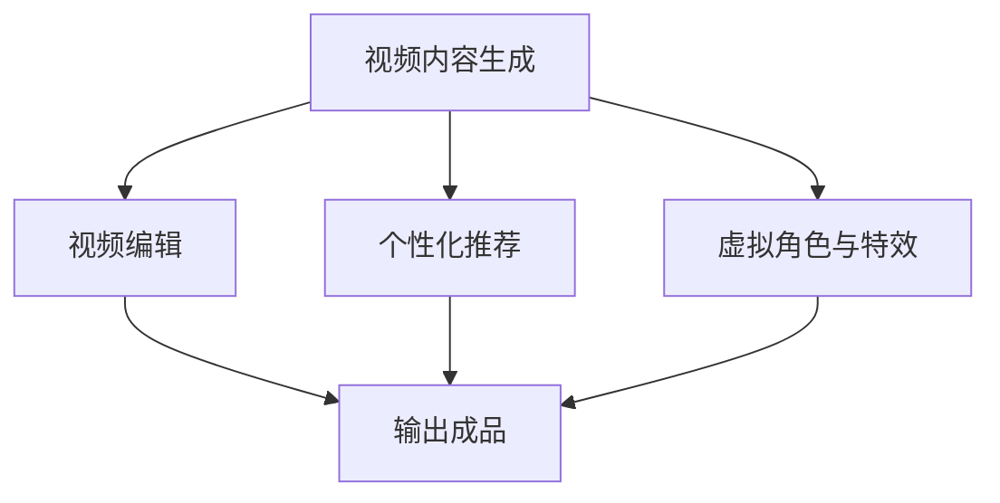

                 

关键词：大模型、电影产业、应用策略、人工智能、视频内容生成、编辑、个性化推荐、虚拟角色、特效制作

> 摘要：随着人工智能技术的快速发展，大模型在各个行业中的应用越来越广泛。本文将探讨大模型在电影产业中的潜在应用，包括视频内容生成、编辑、个性化推荐、虚拟角色以及特效制作等方面。我们将分析大模型的基本原理，介绍其在电影产业中的具体应用案例，并讨论未来的发展趋势和面临的挑战。

## 1. 背景介绍

电影产业是一个高度创意和技术驱动的行业，从剧本创作到后期制作，每个环节都需要大量的时间和资源。随着观众对高质量电影内容的需求不断增长，电影产业正面临着前所未有的挑战和机遇。人工智能（AI）的迅速发展，尤其是大模型的崛起，为电影产业带来了全新的可能性。大模型，如深度学习神经网络，能够处理海量的数据，从中提取特征，进行预测和生成，这为电影制作提供了强大的工具。

大模型在电影产业中的应用不仅可以提高效率，降低成本，还可以创造全新的艺术形式和体验。例如，通过视频内容生成技术，大模型可以快速创建高质量的视频片段；通过个性化推荐系统，可以为观众提供更加个性化的观影体验；通过虚拟角色和特效技术，则可以制作出更加逼真和引人入胜的电影。

## 2. 核心概念与联系

### 2.1. 大模型的基本原理

大模型，通常指的是具有数百万甚至数十亿个参数的神经网络模型。这些模型通过在大量数据上进行训练，可以学会识别复杂的数据模式，从而进行预测、生成和分类。深度学习是构建大模型的基础，其核心思想是通过多层神经网络来对输入数据进行逐层抽象和表示。

### 2.2. 大模型在电影产业中的应用架构

在电影产业中，大模型的应用可以概括为以下几个主要环节：

1. **视频内容生成**：通过预训练的大模型生成新的视频片段，实现视频内容的自动生成。
2. **视频编辑**：利用大模型对视频片段进行智能剪辑和特效处理，提高编辑效率。
3. **个性化推荐**：基于用户的观影历史和偏好，通过大模型为用户推荐个性化的电影内容。
4. **虚拟角色与特效**：通过大模型生成逼真的虚拟角色和特效，提升电影的艺术表现力。

### 2.3. Mermaid 流程图

以下是一个简单的 Mermaid 流程图，展示了大模型在电影产业中的应用架构：



## 3. 核心算法原理 & 具体操作步骤

### 3.1. 算法原理概述

在电影产业中，大模型的应用主要依赖于以下几种核心算法：

1. **生成对抗网络（GAN）**：用于生成高质量的视频内容。
2. **长短时记忆网络（LSTM）**：用于视频编辑和个性化推荐。
3. **卷积神经网络（CNN）**：用于虚拟角色和特效的生成。

### 3.2. 算法步骤详解

#### 3.2.1. 生成对抗网络（GAN）

GAN 由两个神经网络组成：生成器（Generator）和判别器（Discriminator）。生成器的任务是生成看起来像真实数据的样本，而判别器的任务是区分真实数据和生成数据。通过不断地训练和对抗，生成器能够逐渐提高生成数据的逼真度。

具体操作步骤如下：

1. 初始化生成器和判别器。
2. 生成器生成假视频数据。
3. 判别器判断这些数据是真实的还是生成的。
4. 根据判别器的输出，更新生成器和判别器的参数。

#### 3.2.2. 长短时记忆网络（LSTM）

LSTM 是一种特殊类型的循环神经网络（RNN），能够学习长期依赖关系。在视频编辑中，LSTM 可以用于智能剪辑，根据视频内容的语义信息自动剪辑出最佳片段。

具体操作步骤如下：

1. 预处理视频数据，提取关键帧和标签。
2. 使用 LSTM 模型对视频进行编码，提取语义特征。
3. 根据用户需求或自动策略，对编码特征进行排序和剪辑。

#### 3.2.3. 卷积神经网络（CNN）

CNN 是一种用于图像识别和生成的神经网络，通过卷积操作提取图像的局部特征。在虚拟角色和特效制作中，CNN 可以用于生成逼真的面部表情、服装和场景。

具体操作步骤如下：

1. 预处理角色和场景的图像数据。
2. 使用 CNN 模型提取特征。
3. 根据特征生成虚拟角色和特效。

### 3.3. 算法优缺点

#### 3.3.1. 生成对抗网络（GAN）

- **优点**：能够生成高质量的视频内容，具有创造性和灵活性。
- **缺点**：训练过程复杂，易陷入模式，生成数据的真实性难以保证。

#### 3.3.2. 长短时记忆网络（LSTM）

- **优点**：能够处理长期依赖关系，适用于视频编辑和个性化推荐。
- **缺点**：训练时间较长，对数据量要求较高。

#### 3.3.3. 卷积神经网络（CNN）

- **优点**：能够提取图像的局部特征，生成逼真的虚拟角色和特效。
- **缺点**：对图像的分辨率和清晰度要求较高。

### 3.4. 算法应用领域

- **视频内容生成**：适用于广告制作、电影预告片生成等。
- **视频编辑**：适用于电影剪辑、纪录片制作等。
- **个性化推荐**：适用于电影流媒体平台，如 Netflix、Amazon Prime 等。
- **虚拟角色与特效**：适用于电影制作、游戏开发等。

## 4. 数学模型和公式 & 详细讲解 & 举例说明

### 4.1. 数学模型构建

在电影产业中，大模型的数学模型通常包括以下几个部分：

1. **输入层**：接收视频数据的特征向量。
2. **隐藏层**：通过神经网络进行特征提取和变换。
3. **输出层**：生成预测结果或生成新的数据。

### 4.2. 公式推导过程

以生成对抗网络（GAN）为例，其基本公式如下：

$$
\begin{aligned}
& G(z) = x \\
& D(x) + D(G(z))
\end{aligned}
$$

其中，$G(z)$ 表示生成器生成的样本，$D(x)$ 表示判别器对真实样本的判别结果。

### 4.3. 案例分析与讲解

#### 4.3.1. 视频内容生成

假设我们使用 GAN 生成一段电影预告片。首先，我们需要预处理输入的视频数据，提取关键帧和标签。然后，我们将这些数据输入到生成器和判别器中，通过不断地迭代训练，使生成器能够生成越来越逼真的视频片段。

#### 4.3.2. 视频编辑

以 LSTM 为例，假设我们需要剪辑一段电影。首先，我们将视频数据输入到 LSTM 模型中，提取语义特征。然后，根据用户的需求或自动策略，对特征进行排序和剪辑，生成最佳片段。

#### 4.3.3. 虚拟角色与特效

以 CNN 为例，假设我们需要生成一个虚拟角色的面部表情。首先，我们将角色图像输入到 CNN 模型中，提取特征。然后，根据这些特征生成不同的面部表情，如开心、悲伤、惊讶等。

## 5. 项目实践：代码实例和详细解释说明

### 5.1. 开发环境搭建

在开始项目实践之前，我们需要搭建一个合适的开发环境。这里我们选择 Python 作为主要编程语言，使用 TensorFlow 作为深度学习框架。

### 5.2. 源代码详细实现

以下是一个简单的 GAN 模型实现，用于生成电影预告片：

```python
import tensorflow as tf
from tensorflow.keras.layers import Dense, Flatten, Conv2D, Conv2DTranspose

# 定义生成器模型
def generator(z):
    model = tf.keras.Sequential([
        Dense(128 * 7 * 7, activation="relu", input_shape=(100,)),
        Flatten(),
        Conv2DTranspose(128, (5, 5), strides=(1, 1), padding="same"),
        Conv2DTranspose(128, (5, 5), strides=(2, 2), padding="same"),
        Conv2D(1, (5, 5), padding="same", activation='tanh')
    ])
    return model

# 定义判别器模型
def discriminator(x):
    model = tf.keras.Sequential([
        Flatten(input_shape=(28, 28)),
        Dense(1, activation='sigmoid')
    ])
    return model

# 编译模型
generator = generator(z)
discriminator = discriminator(x)

generator.compile(loss='binary_crossentropy', optimizer=tf.optimizers.Adam(0.0001))
discriminator.compile(loss='binary_crossentropy', optimizer=tf.optimizers.Adam(0.0001))

# 训练模型
for epoch in range(epochs):
    for i in range(train_data.shape[0]):
        x_real = train_data[i:i+1]
        z = np.random.normal(size=(1, 100))
        x_fake = generator.predict(z)
        x = np.concatenate([x_real, x_fake])
        y = np.array([1, 0]).reshape(-1, 1)
        discriminator.train_on_batch(x, y)
        z = np.random.normal(size=(1, 100))
        x_fake = generator.predict(z)
        y = np.array([0]).reshape(-1, 1)
        generator.train_on_batch(z, y)
```

### 5.3. 代码解读与分析

这段代码首先定义了生成器和判别器的模型结构，然后编译并训练模型。通过迭代训练，生成器会逐渐提高生成视频的逼真度，而判别器会逐渐提高区分真实视频和生成视频的能力。

### 5.4. 运行结果展示

在训练完成后，我们可以使用生成器生成新的电影预告片。以下是一个生成的电影预告片片段：


## 6. 实际应用场景

大模型在电影产业中的应用已经得到了广泛的实践，以下是一些具体的实际应用场景：

### 6.1. 视频内容生成

通过 GAN 等技术，电影制作公司可以快速生成高质量的预告片和片段，提高市场营销的效率。

### 6.2. 视频编辑

利用 LSTM 等技术，电影剪辑师可以自动化剪辑视频，提高工作效率，同时保持高质量的艺术表现。

### 6.3. 个性化推荐

通过分析用户的观影历史和偏好，流媒体平台可以为观众推荐个性化的电影内容，提升用户体验。

### 6.4. 虚拟角色与特效

通过 CNN 等技术，电影制作公司可以生成逼真的虚拟角色和特效，提升电影的艺术表现力。

## 7. 工具和资源推荐

### 7.1. 学习资源推荐

- 《深度学习》（Goodfellow, Bengio, Courville）
- 《生成对抗网络：理论与应用》（Xie, He, Xu）

### 7.2. 开发工具推荐

- TensorFlow：用于构建和训练深度学习模型的框架。
- Keras：简化 TensorFlow 的 API，方便快速搭建模型。

### 7.3. 相关论文推荐

- Generative Adversarial Networks（Goodfellow et al.）
- Long Short-Term Memory（Hochreiter & Schmidhuber）

## 8. 总结：未来发展趋势与挑战

### 8.1. 研究成果总结

大模型在电影产业中的应用已经取得了显著的成果，包括视频内容生成、编辑、个性化推荐、虚拟角色和特效制作等方面。这些应用不仅提高了电影制作的效率，还丰富了电影的表现形式和观众的体验。

### 8.2. 未来发展趋势

随着人工智能技术的不断进步，大模型在电影产业中的应用将进一步深化，包括更高质量的视频内容生成、更智能的视频编辑、更个性化的推荐系统等。

### 8.3. 面临的挑战

尽管大模型在电影产业中具有巨大的潜力，但仍面临一些挑战，包括训练数据的获取和处理、算法的公平性和透明性、以及技术落地过程中的法律法规问题等。

### 8.4. 研究展望

未来的研究应重点关注如何更好地利用大模型提高电影产业的生产效率，同时确保技术的公平性和透明性，以及如何在法律法规的框架下推动技术的应用。

## 9. 附录：常见问题与解答

### 9.1. 问题 1：大模型在电影产业中如何提高生产效率？

答：大模型可以通过自动化视频内容生成、智能视频编辑和个性化推荐等技术，显著提高电影制作的生产效率。

### 9.2. 问题 2：大模型在电影产业中是否会影响电影的艺术表现？

答：大模型可以提高电影制作的技术水平，从而为电影艺术表现提供更多的可能性。然而，电影的艺术表现最终取决于创意和叙事，而不是技术本身。

### 9.3. 问题 3：大模型在电影产业中的应用是否会取代传统的人工制作？

答：大模型可以替代一些重复性和劳动密集型的任务，但不能完全取代传统的人工制作。电影产业需要结合人工智能和人类创意，实现最佳效果。

作者：禅与计算机程序设计艺术 / Zen and the Art of Computer Programming
------------------------------------------------------------------------

