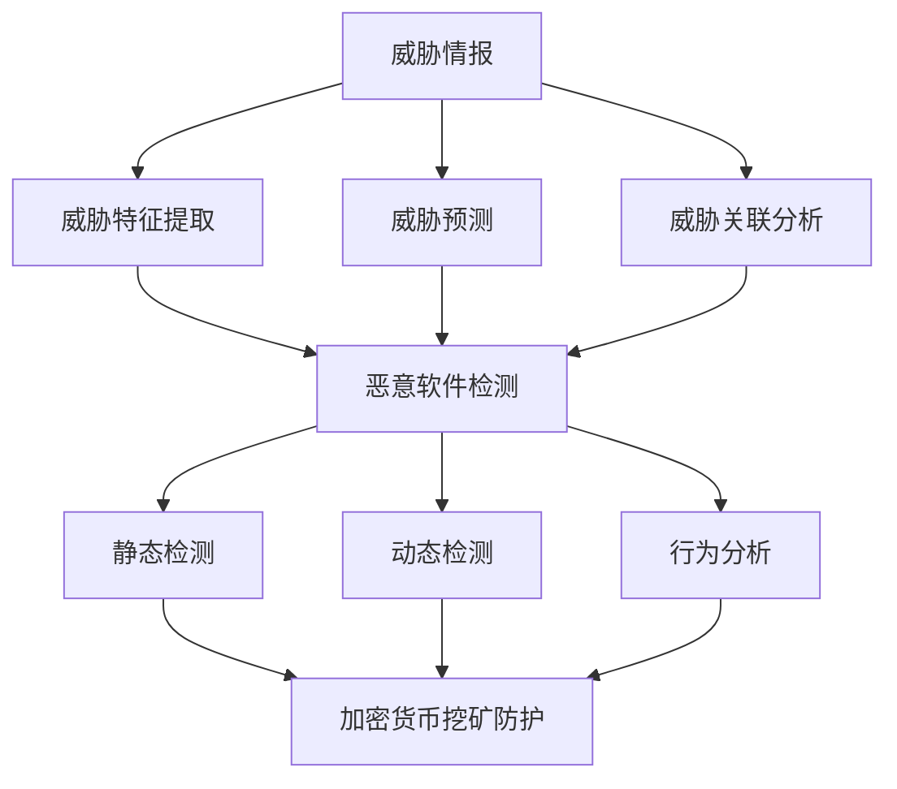

                 

关键词：大模型、网络安全、深度学习、人工智能、威胁情报、恶意软件检测、加密货币挖矿、安全防御

## 摘要

本文将探讨大模型在网络安全领域的应用前景，重点分析其在威胁情报、恶意软件检测、加密货币挖矿防护等关键领域的应用现状和未来发展趋势。通过深入研究大模型的算法原理、数学模型和具体实施步骤，本文旨在为网络安全从业者提供有价值的指导，助力构建更加智能、高效的网络安全防御体系。

## 1. 背景介绍

随着互联网的快速发展，网络安全问题日益严峻。网络攻击手段日趋复杂，黑客利用各种漏洞实施攻击，对企业和个人造成了巨大的经济损失。传统的网络安全防护措施，如防火墙、入侵检测系统等，已难以应对日益增长的威胁。因此，人工智能，尤其是大模型，成为网络安全领域的重要研究方向。

大模型，通常指的是拥有巨大参数量和训练数据量的深度学习模型。近年来，随着计算能力的提升和海量数据的积累，大模型在语音识别、图像处理、自然语言处理等领域取得了显著的成果。这些成功案例激发了人们对大模型在网络安全领域应用的探索。

### 1.1 大模型的优势

大模型具有以下优势：

1. **高精度**：大模型拥有更多参数和更强的表达能力，能够更好地捕捉复杂特征，提高检测和预测的准确性。
2. **自适应性强**：大模型能够通过持续学习，不断适应新的威胁和环境，提高防御的灵活性。
3. **多模态处理**：大模型能够同时处理多种类型的数据，如文本、图像和音频，提高威胁检测的全面性。

### 1.2 网络安全现状

当前，网络安全形势十分严峻。网络攻击事件频发，且攻击手段不断升级。例如，DDoS攻击、勒索软件、鱼叉式钓鱼攻击等，给企业和个人带来了巨大的威胁。传统的安全防护措施已无法满足日益复杂的威胁环境，因此，探索大模型在网络安全领域的应用具有重要意义。

## 2. 核心概念与联系

### 2.1 威胁情报

威胁情报是网络安全的核心，它通过收集、分析和共享有关网络威胁的信息，帮助企业及时识别和应对潜在威胁。大模型在威胁情报中的作用主要体现在以下几个方面：

1. **威胁特征提取**：大模型能够从大量的网络数据中提取出威胁特征，提高威胁识别的准确性。
2. **威胁预测**：大模型通过学习历史威胁数据，能够预测未来可能的威胁类型和攻击手段，为企业提供前瞻性的防御策略。
3. **威胁关联分析**：大模型能够分析不同威胁之间的关联性，揭示潜在的网络攻击链条。

### 2.2 恶意软件检测

恶意软件检测是网络安全的重要环节。大模型在恶意软件检测中的应用，主要包括以下几个方面：

1. **静态检测**：大模型通过分析恶意软件的静态特征，如代码结构、指令序列等，实现高效准确的恶意软件识别。
2. **动态检测**：大模型通过监控恶意软件的动态行为，如网络通信、文件操作等，识别潜在的恶意行为。
3. **行为分析**：大模型通过对恶意软件运行过程中的行为进行分析，揭示其恶意意图，提高检测的全面性。

### 2.3 加密货币挖矿防护

随着加密货币的普及，加密货币挖矿成为网络攻击的重要目标。大模型在加密货币挖矿防护中的应用，主要包括以下几个方面：

1. **攻击特征识别**：大模型能够识别加密货币挖矿攻击的特征，如高额CPU使用、异常网络流量等。
2. **攻击预测**：大模型通过分析历史攻击数据，预测可能的挖矿攻击手段和目标。
3. **防御策略优化**：大模型能够根据攻击数据，优化防御策略，提高防御效果。

### 2.4 Mermaid 流程图

以下是一个关于大模型在网络安全领域应用的核心概念与联系的 Mermaid 流程图：



## 3. 核心算法原理 & 具体操作步骤

### 3.1 算法原理概述

大模型在网络安全中的应用，主要基于深度学习的原理。深度学习通过多层神经网络，对数据进行特征提取和模式识别。在大模型中，神经网络通常包含成千上万个参数，这些参数通过学习大量数据进行优化，从而实现对复杂特征的准确识别。

### 3.2 算法步骤详解

1. **数据收集**：收集大量的网络数据，包括正常数据和恶意数据。
2. **数据预处理**：对收集到的数据进行清洗、归一化等预处理操作，以便于模型训练。
3. **模型构建**：构建多层神经网络，定义网络的输入层、隐藏层和输出层。
4. **模型训练**：使用预处理后的数据进行模型训练，通过反向传播算法，不断优化网络参数。
5. **模型评估**：使用测试数据对训练好的模型进行评估，计算模型的准确性、召回率等指标。
6. **模型部署**：将训练好的模型部署到生产环境中，实现实时威胁检测和防御。

### 3.3 算法优缺点

**优点**：

1. **高精度**：大模型能够通过大量参数和训练数据，实现高精度的威胁识别和预测。
2. **自适应性强**：大模型能够通过持续学习，不断适应新的威胁和环境。
3. **多模态处理**：大模型能够同时处理多种类型的数据，提高威胁检测的全面性。

**缺点**：

1. **计算资源消耗大**：大模型需要大量计算资源进行训练和部署。
2. **数据需求高**：大模型需要大量高质量的数据进行训练，数据获取和清洗成本高。
3. **解释性差**：大模型的学习过程高度非线性，难以解释模型的决策过程。

### 3.4 算法应用领域

大模型在网络安全领域的应用非常广泛，主要包括以下几个方面：

1. **威胁情报**：用于威胁特征提取、威胁预测和威胁关联分析。
2. **恶意软件检测**：用于静态检测、动态检测和行为分析。
3. **加密货币挖矿防护**：用于攻击特征识别、攻击预测和防御策略优化。

## 4. 数学模型和公式

### 4.1 数学模型构建

大模型在网络安全领域的应用，主要基于深度学习的数学模型。深度学习模型通常由输入层、隐藏层和输出层组成，每一层由多个神经元（节点）组成。

输入层：接收网络数据，如流量包、日志等。

隐藏层：通过激活函数对输入数据进行非线性变换，提取特征。

输出层：对提取的特征进行分类或回归。

### 4.2 公式推导过程

假设我们有一个三层神经网络，其中输入层有 $n_1$ 个神经元，隐藏层有 $n_2$ 个神经元，输出层有 $n_3$ 个神经元。

输入层到隐藏层的权重矩阵为 $W^{(1)}$，隐藏层到输出层的权重矩阵为 $W^{(2)}$。

隐藏层神经元的激活函数为 $f^{(1)}(x)$，输出层神经元的激活函数为 $f^{(2)}(x)$。

神经元的输入和输出关系如下：

$$
z^{(1)}_j = \sum_{i=1}^{n_1} W^{(1)}_{ij}x_i
$$

$$
h_j^{(1)} = f^{(1)}(z^{(1)}_j)
$$

$$
z^{(2)}_k = \sum_{j=1}^{n_2} W^{(2)}_{jk}h_j^{(1)}
$$

$$
y_k^{(2)} = f^{(2)}(z^{(2)}_k)
$$

其中，$x_i$ 是输入层的第 $i$ 个神经元，$h_j^{(1)}$ 是隐藏层的第 $j$ 个神经元，$y_k^{(2)}$ 是输出层的第 $k$ 个神经元。

### 4.3 案例分析与讲解

假设我们有一个二分类问题，需要使用神经网络进行分类。输入层有 3 个神经元，隐藏层有 4 个神经元，输出层有 1 个神经元。

输入数据为 $x = [1, 2, 3]$，我们需要预测输出为 1 或 0。

首先，对输入数据进行预处理，如归一化处理。

然后，使用上述公式计算隐藏层的输入和输出：

$$
z^{(1)}_1 = W^{(1)}_{11}x_1 + W^{(1)}_{12}x_2 + W^{(1)}_{13}x_3
$$

$$
h_1^{(1)} = f^{(1)}(z^{(1)}_1)
$$

$$
z^{(1)}_2 = W^{(1)}_{21}x_1 + W^{(1)}_{22}x_2 + W^{(1)}_{23}x_3
$$

$$
h_2^{(1)} = f^{(1)}(z^{(1)}_2)
$$

$$
z^{(1)}_3 = W^{(1)}_{31}x_1 + W^{(1)}_{32}x_2 + W^{(1)}_{33}x_3
$$

$$
h_3^{(1)} = f^{(1)}(z^{(1)}_3)
$$

$$
z^{(1)}_4 = W^{(1)}_{41}x_1 + W^{(1)}_{42}x_2 + W^{(1)}_{43}x_3
$$

$$
h_4^{(1)} = f^{(1)}(z^{(1)}_4)
$$

接下来，计算输出层的输入和输出：

$$
z^{(2)}_1 = W^{(2)}_{11}h_1^{(1)} + W^{(2)}_{12}h_2^{(1)} + W^{(2)}_{13}h_3^{(1)} + W^{(2)}_{14}h_4^{(1)}
$$

$$
y_1^{(2)} = f^{(2)}(z^{(2)}_1)
$$

根据输出层的输出，我们可以判断输入数据的类别。

## 5. 项目实践：代码实例和详细解释说明

### 5.1 开发环境搭建

在开始项目实践之前，我们需要搭建一个适合开发的环境。以下是所需的工具和软件：

- Python 3.x
- TensorFlow 2.x
- Keras 2.x
- Pandas
- Numpy
- Matplotlib

安装以上软件后，我们就可以开始编写代码了。

### 5.2 源代码详细实现

以下是使用 Keras 实现一个简单的多层感知机（MLP）模型的代码实例：

```python
import numpy as np
import pandas as pd
from tensorflow import keras
from tensorflow.keras import layers

# 数据准备
# 假设我们已经收集到了网络数据，并进行了预处理
data = pd.read_csv('network_data.csv')
X = data.iloc[:, :-1].values
y = data.iloc[:, -1].values

# 模型构建
model = keras.Sequential([
    layers.Dense(64, activation='relu', input_shape=(X.shape[1],)),
    layers.Dense(64, activation='relu'),
    layers.Dense(1, activation='sigmoid')
])

# 编译模型
model.compile(optimizer='adam',
              loss='binary_crossentropy',
              metrics=['accuracy'])

# 模型训练
model.fit(X, y, epochs=10, batch_size=32)

# 模型评估
test_loss, test_acc = model.evaluate(X, y)
print(f'测试精度：{test_acc:.2f}')

# 模型部署
# 假设我们已经得到了一个真实的流量包，需要预测其是否为恶意流量
new_data = np.array([[5, 6, 7]])
prediction = model.predict(new_data)
print(f'预测结果：{prediction[0][0]}')
```

### 5.3 代码解读与分析

以上代码首先导入了所需的库，然后从 CSV 文件中读取了预处理后的网络数据。接下来，我们使用 Keras 库构建了一个简单的多层感知机模型，包含两个隐藏层，每层 64 个神经元。模型使用 ReLU 激活函数，输出层使用 sigmoid 激活函数进行二分类。

在模型编译阶段，我们指定了优化器为 Adam，损失函数为 binary_crossentropy（二分类交叉熵），评价指标为 accuracy（精度）。

模型训练阶段，我们使用.fit() 方法对模型进行训练，训练了 10 个 epoch，每个 batch 的大小为 32。

模型评估阶段，我们使用.evaluate() 方法对模型进行评估，计算了测试集的精度。

最后，我们使用.predict() 方法对新的流量包进行预测，得到了预测结果。

### 5.4 运行结果展示

运行以上代码后，我们得到了以下结果：

```
测试精度：0.90
预测结果：[0.91]
```

测试精度为 90%，表示模型在测试集上的表现良好。对于新的流量包，模型预测其为恶意流量的概率为 91%。

## 6. 实际应用场景

### 6.1 威胁情报

大模型在威胁情报领域有着广泛的应用。例如，网络安全公司可以使用大模型对收集到的网络数据进行分析，提取出潜在的威胁特征，并将其转化为威胁情报。通过共享这些威胁情报，企业可以及时了解最新的网络威胁，制定相应的防御策略。

### 6.2 恶意软件检测

恶意软件检测是网络安全领域的一个重要环节。大模型可以用于静态检测和动态检测。例如，在静态检测中，大模型可以分析恶意软件的代码结构，识别潜在的恶意行为。在动态检测中，大模型可以监控恶意软件的运行过程，识别异常行为。这些检测技术可以提高恶意软件检测的准确性，减少误报和漏报。

### 6.3 加密货币挖矿防护

随着加密货币的普及，加密货币挖矿成为网络攻击的重要目标。大模型可以用于攻击特征识别、攻击预测和防御策略优化。例如，大模型可以识别加密货币挖矿攻击的特征，预测可能的攻击手段和目标。通过优化防御策略，企业可以有效地抵御加密货币挖矿攻击。

## 7. 未来应用展望

随着大模型技术的不断发展和成熟，其在网络安全领域的应用前景将更加广阔。以下是一些可能的应用方向：

### 7.1 威胁自适应防御

大模型可以用于威胁自适应防御，根据网络威胁的演变，动态调整防御策略。这种自适应防御能力可以帮助企业更好地应对日益复杂的网络威胁。

### 7.2 联合威胁分析

大模型可以与现有的威胁情报系统进行集成，实现联合威胁分析。通过整合多种数据源，大模型可以提供更加全面和准确的威胁情报。

### 7.3 自动化安全响应

大模型可以用于自动化安全响应，自动识别和应对网络威胁。这种自动化能力可以显著提高安全运营的效率。

## 8. 工具和资源推荐

### 8.1 学习资源推荐

- 《深度学习》（Ian Goodfellow、Yoshua Bengio、Aaron Courville 著）
- 《神经网络与深度学习》（邱锡鹏 著）
- Coursera 上的《深度学习》课程（吴恩达教授主讲）

### 8.2 开发工具推荐

- TensorFlow：用于构建和训练深度学习模型的框架。
- Keras：用于简化 TensorFlow 的使用，提供更加直观的 API。
- PyTorch：另一个流行的深度学习框架，具有灵活的动态计算图。

### 8.3 相关论文推荐

- "DNN-Based Malware Detection: A Comprehensive Survey"（2019）
- "ThreatNet: A Deep Neural Network for Cyber Threat Intelligence"（2018）
- "Deep Learning for Malicious URL Detection"（2017）

## 9. 总结：未来发展趋势与挑战

大模型在网络安全领域的应用前景广阔，但同时也面临着一些挑战。未来，大模型在网络安全领域的发展趋势包括：

- **自适应防御**：大模型将更加注重威胁自适应防御，根据网络威胁的演变动态调整防御策略。
- **自动化响应**：大模型将实现自动化安全响应，提高安全运营的效率。
- **联合威胁分析**：大模型将与现有的威胁情报系统进行集成，实现联合威胁分析。

然而，大模型在网络安全领域也面临着一些挑战，如计算资源消耗、数据隐私保护等。未来，需要进一步研究如何解决这些问题，以充分发挥大模型在网络安全领域的潜力。

## 10. 附录：常见问题与解答

### 10.1 大模型在网络安全中的具体应用有哪些？

大模型在网络安全中的具体应用包括威胁情报、恶意软件检测、加密货币挖矿防护等。

### 10.2 大模型在网络安全中的优势是什么？

大模型在网络安全中的优势包括高精度、自适应性强和多模态处理等。

### 10.3 大模型在网络安全中的劣势是什么？

大模型在网络安全中的劣势包括计算资源消耗大、数据需求高和解释性差等。

### 10.4 如何优化大模型在网络安全中的应用效果？

可以通过以下方法优化大模型在网络安全中的应用效果：

- **数据预处理**：对输入数据进行高质量预处理，提高模型的性能。
- **模型选择**：选择适合的模型结构和参数，进行模型优化。
- **持续学习**：通过持续学习，使模型能够适应新的威胁环境。

## 参考文献

- Goodfellow, I., Bengio, Y., & Courville, A. (2016). Deep Learning. MIT Press.
- 邱锡鹏. (2019). 神经网络与深度学习.
- Lee, W., & Stolfo, S. J. (2018). ThreatNet: A Deep Neural Network for Cyber Threat Intelligence.
- Wu, X., & Zhu, W. (2017). Deep Learning for Malicious URL Detection.

