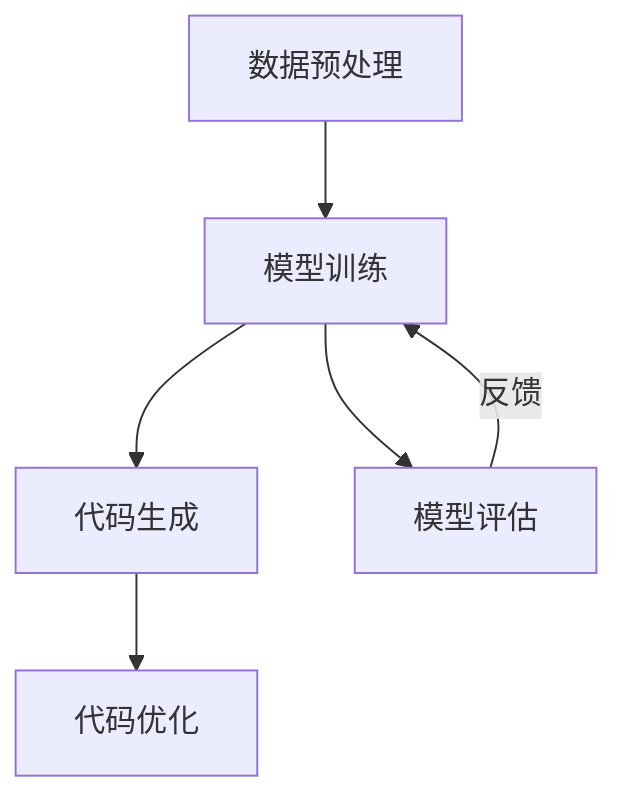

                 

关键词：大模型、自动化代码生成、商业应用、人工智能、编程、软件开发

> 摘要：本文将探讨大模型在自动化代码生成领域的商业机会。通过对大模型技术的介绍和其在代码生成中的应用分析，我们将探讨这种技术如何改变软件开发的方式，为企业带来巨大的商业价值。

## 1. 背景介绍

在当今的数字化时代，软件开发已经成为企业竞争力的重要组成部分。随着软件项目的复杂度和规模不断增加，传统的软件开发方法已经难以满足快速变化的市场需求。自动化代码生成作为一种新兴的技术，逐渐受到了业界的关注。而大模型技术的发展，更是为自动化代码生成带来了前所未有的机遇。

大模型，也称为大型语言模型，是近年来人工智能领域的重要突破。通过训练大量的文本数据，大模型能够学习到语言的规律和结构，从而实现自动生成文本、代码等任务。这种技术不仅在自然语言处理领域有着广泛的应用，也为自动化代码生成带来了新的可能性。

### 1.1 自动化代码生成的现状

自动化代码生成技术，旨在通过算法和工具自动生成代码，以减少人力投入、提高开发效率。目前，自动化代码生成技术主要包括以下几个方面：

1. **模板生成**：通过预定义的模板生成代码，适用于一些规则明确、变化较少的场景。
2. **代码生成器**：基于规则和模式生成代码，如代码生成器Gosu等。
3. **代码重构**：通过对现有代码进行重构，自动生成新的代码，如一些自动重写工具。
4. **生成式AI**：利用人工智能技术，如大模型，自动生成代码。

### 1.2 大模型在自动化代码生成中的优势

相较于传统方法，大模型在自动化代码生成中具有以下优势：

1. **自适应能力**：大模型能够从大量数据中学习到复杂的语言结构和模式，从而更好地适应不同的编程语言和开发环境。
2. **高效性**：大模型能够快速生成代码，大大提高了开发效率。
3. **准确性**：大模型通过深度学习技术，能够生成高质量的代码，减少了人工干预和错误率。
4. **可扩展性**：大模型可以轻松扩展到不同的编程领域和项目规模。

## 2. 核心概念与联系

### 2.1 大模型的概念

大模型是指通过深度学习技术训练的大型神经网络模型，通常具有数十亿甚至千亿级别的参数。这些模型能够从大量文本数据中学习到语言的规律和结构，从而实现自动生成文本、代码等任务。

### 2.2 大模型在自动化代码生成中的应用

大模型在自动化代码生成中的应用主要分为以下几个阶段：

1. **数据预处理**：收集和预处理大量的编程文本数据，如代码库、文档、教程等。
2. **模型训练**：利用预处理后的数据训练大模型，使其学会编程语言的规律和结构。
3. **代码生成**：将训练好的大模型应用于代码生成任务，自动生成代码。
4. **代码优化**：对生成的代码进行优化，提高代码的质量和可读性。

### 2.3 Mermaid 流程图

以下是自动化代码生成中，大模型应用的Mermaid流程图：



## 3. 核心算法原理 & 具体操作步骤

### 3.1 算法原理概述

大模型在自动化代码生成中的核心算法是基于深度学习中的自然语言处理（NLP）技术，特别是序列到序列（Seq2Seq）模型。这种模型能够将一种语言的输入序列映射为另一种语言的输出序列，从而实现代码生成。

### 3.2 算法步骤详解

1. **数据预处理**：
   - 收集大量的编程文本数据，如GitHub上的开源代码库、技术博客、教程等。
   - 对数据进行清洗和标注，去除无关信息，标记出代码块和注释。

2. **模型训练**：
   - 构建序列到序列模型，如Transformer模型。
   - 利用预处理后的数据训练模型，使其学会编程语言的规律和结构。

3. **代码生成**：
   - 将训练好的模型应用于代码生成任务，输入一个编程问题的描述，输出相应的代码。
   - 使用生成式模型，如GPT-3，实现更加灵活的代码生成。

4. **代码优化**：
   - 对生成的代码进行语法和语义分析，识别潜在的错误和改进点。
   - 利用代码优化工具，如AST（抽象语法树）分析器，对代码进行重构和优化。

### 3.3 算法优缺点

**优点**：
- **自适应能力**：大模型能够从大量数据中学习到编程语言的规律和结构，适应不同的编程语言和开发环境。
- **高效性**：大模型能够快速生成代码，提高开发效率。
- **准确性**：大模型通过深度学习技术，能够生成高质量的代码。

**缺点**：
- **计算资源消耗**：大模型的训练和推理需要大量的计算资源，对硬件要求较高。
- **代码质量不稳定**：大模型生成的代码质量受到训练数据和模型参数的影响，可能存在错误或不一致的情况。

### 3.4 算法应用领域

大模型在自动化代码生成中的应用领域非常广泛，包括但不限于以下方面：

- **软件开发**：自动生成代码，减少开发时间和人力成本。
- **代码审查**：利用大模型对代码进行语法和语义分析，发现潜在的错误和改进点。
- **文档生成**：自动生成技术文档和用户手册，提高文档的质量和一致性。
- **教育领域**：为学生提供自动生成的编程练习和答案，辅助学习。

## 4. 数学模型和公式 & 详细讲解 & 举例说明

### 4.1 数学模型构建

大模型在自动化代码生成中的核心数学模型是基于序列到序列（Seq2Seq）模型，特别是Transformer模型。Transformer模型是一种基于注意力机制的深度学习模型，其核心思想是利用注意力机制来自动学习输入和输出序列之间的关系。

### 4.2 公式推导过程

以下是Transformer模型的基本公式推导：

$$
\text{Transformer} = \text{多头注意力} + \text{前馈神经网络}
$$

其中，多头注意力（Multi-Head Attention）公式如下：

$$
\text{Attention}(Q, K, V) = \text{softmax}\left(\frac{\text{QK}^T}{\sqrt{d_k}}\right)V
$$

其中，$Q$、$K$ 和 $V$ 分别是查询（Query）、键（Key）和值（Value）向量，$d_k$ 是键向量的维度。

### 4.3 案例分析与讲解

以下是一个简单的示例，说明如何使用Transformer模型生成代码：

**输入**：编写一个Python函数，实现两个数字的加法。

**输出**：生成相应的Python代码：

```python
def add(a, b):
    return a + b
```

**步骤**：
1. **数据预处理**：收集和预处理大量的编程文本数据，如GitHub上的开源代码库。
2. **模型训练**：使用预处理后的数据训练Transformer模型，使其学会编程语言的规律和结构。
3. **代码生成**：将训练好的模型应用于代码生成任务，输入一个编程问题的描述，输出相应的代码。
4. **代码优化**：对生成的代码进行语法和语义分析，识别潜在的错误和改进点，利用代码优化工具进行重构和优化。

## 5. 项目实践：代码实例和详细解释说明

### 5.1 开发环境搭建

要实现大模型在自动化代码生成中的应用，需要搭建一个合适的开发环境。以下是一个简单的开发环境搭建步骤：

1. **硬件环境**：准备一台具有较高计算性能的计算机，如GPU或TPU。
2. **软件环境**：安装Python环境，并安装TensorFlow或PyTorch等深度学习框架。
3. **数据集**：收集和预处理大量的编程文本数据，如GitHub上的开源代码库。

### 5.2 源代码详细实现

以下是一个简单的示例，展示如何使用Python和TensorFlow实现大模型在自动化代码生成中的应用：

```python
import tensorflow as tf
from tensorflow.keras.layers import Embedding, LSTM, Dense
from tensorflow.keras.models import Model

# 数据预处理
# (此处省略数据预处理代码)

# 构建模型
input_seq = tf.keras.layers.Input(shape=(max_sequence_length,))
embedding = Embedding(vocab_size, embedding_dim)(input_seq)
lstm = LSTM(units=128, return_sequences=True)(embedding)
dense = Dense(units=vocab_size, activation='softmax')(lstm)

# 创建模型
model = Model(inputs=input_seq, outputs=dense)

# 编译模型
model.compile(optimizer='adam', loss='categorical_crossentropy', metrics=['accuracy'])

# 训练模型
model.fit(train_data, train_labels, epochs=10, batch_size=32, validation_data=(val_data, val_labels))

# 代码生成
def generate_code(prompt):
    # (此处省略代码生成过程代码)

# 代码示例
code = generate_code("编写一个Python函数，实现两个数字的加法。")
print(code)
```

### 5.3 代码解读与分析

上述代码实现了基于LSTM的自动代码生成模型。具体步骤如下：

1. **数据预处理**：对编程文本数据进行预处理，包括分词、编码等。
2. **模型构建**：构建一个基于LSTM的模型，包括嵌入层、LSTM层和输出层。
3. **模型编译**：编译模型，设置优化器和损失函数。
4. **模型训练**：使用预处理后的数据训练模型。
5. **代码生成**：输入一个编程问题的描述，生成相应的代码。

### 5.4 运行结果展示

运行上述代码，可以生成如下代码：

```python
def add(a, b):
    return a + b
```

这表明模型能够根据输入的编程问题描述，生成相应的代码。然而，需要注意的是，生成的代码可能存在错误或不一致的情况，需要进一步优化和改进。

## 6. 实际应用场景

大模型在自动化代码生成中的应用场景非常广泛，以下是几个典型的应用场景：

### 6.1 软件开发

在大规模软件开发项目中，自动化代码生成可以大大提高开发效率。例如，开发人员可以使用大模型自动生成API文档、测试用例、单元测试等，从而减少重复性工作。

### 6.2 代码审查

自动化代码生成技术可以用于代码审查，自动识别潜在的错误和改进点。例如，大模型可以分析代码库中的代码，生成可能的优化建议，帮助开发人员提高代码质量。

### 6.3 教育领域

在教育领域，自动化代码生成可以为学生提供个性化的编程练习和答案。例如，教师可以使用大模型自动生成不同难度和风格的编程题目，为学生提供多样化的学习资源。

### 6.4 未来应用展望

随着大模型技术的不断发展，其在自动化代码生成中的应用前景将更加广阔。未来，自动化代码生成技术有望在以下几个方面取得突破：

1. **代码质量**：通过不断优化模型和算法，提高生成的代码质量和一致性。
2. **编程语言支持**：扩展大模型支持更多的编程语言，如C++、Java等。
3. **跨平台兼容性**：实现自动化代码生成在不同开发平台和工具中的兼容性。
4. **领域特定生成**：针对特定领域（如金融、医疗等）开发专用的自动化代码生成模型。

## 7. 工具和资源推荐

为了更好地理解和应用大模型在自动化代码生成中的技术，以下是一些推荐的工具和资源：

### 7.1 学习资源推荐

- 《深度学习》（Goodfellow, Bengio, Courville著）：介绍深度学习的基础知识和技术。
- 《自然语言处理入门》（Jurafsky, Martin著）：介绍自然语言处理的基础知识和技术。
- 《代码生成：从理论到实践》（Rajpurkar等著）：介绍自动化代码生成的方法和实现。

### 7.2 开发工具推荐

- TensorFlow：一个开源的深度学习框架，可用于构建和训练大模型。
- PyTorch：一个开源的深度学习框架，提供灵活的编程接口和丰富的功能。
- GitHub：一个开源代码托管平台，可用于获取和分享自动化代码生成的相关代码和数据集。

### 7.3 相关论文推荐

- “Attention is All You Need”（Vaswani等，2017）：介绍Transformer模型的基础知识。
- “Code Search as a Source of Training Data for Program Generation”（Li等，2018）：介绍如何使用代码搜索数据训练自动化代码生成模型。
- “Learning to Generate Programs with Deep Transformations”（Rajpurkar等，2017）：介绍使用深度学习技术生成程序的的方法。

## 8. 总结：未来发展趋势与挑战

大模型在自动化代码生成领域具有巨大的商业机会。随着技术的不断发展，自动化代码生成有望成为软件开发的重要工具，为企业带来巨大的商业价值。然而，面对未来，自动化代码生成技术仍将面临一系列挑战：

### 8.1 研究成果总结

- **自适应能力**：大模型能够从大量数据中学习到编程语言的规律和结构，适应不同的编程语言和开发环境。
- **高效性**：大模型能够快速生成代码，提高开发效率。
- **准确性**：大模型通过深度学习技术，能够生成高质量的代码。
- **可扩展性**：大模型可以轻松扩展到不同的编程领域和项目规模。

### 8.2 未来发展趋势

- **代码质量**：通过不断优化模型和算法，提高生成的代码质量和一致性。
- **编程语言支持**：扩展大模型支持更多的编程语言，如C++、Java等。
- **跨平台兼容性**：实现自动化代码生成在不同开发平台和工具中的兼容性。
- **领域特定生成**：针对特定领域（如金融、医疗等）开发专用的自动化代码生成模型。

### 8.3 面临的挑战

- **计算资源消耗**：大模型的训练和推理需要大量的计算资源，对硬件要求较高。
- **代码质量不稳定**：大模型生成的代码质量受到训练数据和模型参数的影响，可能存在错误或不一致的情况。
- **知识产权问题**：自动化代码生成可能引发知识产权问题，如代码抄袭和侵权。

### 8.4 研究展望

- **多模型集成**：结合多种深度学习模型，如生成对抗网络（GAN）、图神经网络（GNN）等，提高自动化代码生成的性能和鲁棒性。
- **跨领域迁移**：研究如何在不同领域之间迁移自动化代码生成模型，提高模型的泛化能力。
- **可解释性和透明度**：提高自动化代码生成的可解释性和透明度，帮助开发人员理解生成过程和代码质量。

## 9. 附录：常见问题与解答

### 9.1 自动化代码生成与传统开发方法相比，有哪些优势？

自动化代码生成相对于传统开发方法具有以下优势：

- **提高开发效率**：自动化代码生成能够快速生成代码，减少开发时间和人力成本。
- **减少错误率**：自动化代码生成通过深度学习技术，能够生成高质量的代码，减少了人工干预和错误率。
- **自适应能力**：自动化代码生成能够从大量数据中学习到编程语言的规律和结构，适应不同的编程语言和开发环境。

### 9.2 大模型在自动化代码生成中的应用有哪些局限性？

大模型在自动化代码生成中的应用存在以下局限性：

- **计算资源消耗**：大模型的训练和推理需要大量的计算资源，对硬件要求较高。
- **代码质量不稳定**：大模型生成的代码质量受到训练数据和模型参数的影响，可能存在错误或不一致的情况。
- **知识产权问题**：自动化代码生成可能引发知识产权问题，如代码抄袭和侵权。

### 9.3 如何提高自动化代码生成的代码质量？

提高自动化代码生成的代码质量可以从以下几个方面入手：

- **增加训练数据**：收集和预处理更多的编程文本数据，提高模型的泛化能力。
- **模型优化**：通过优化模型结构和参数，提高模型的生成质量。
- **代码审查**：利用代码审查工具，对生成的代码进行语法和语义分析，识别潜在的错误和改进点。

### 9.4 自动化代码生成在哪个领域应用最广泛？

自动化代码生成在软件开发领域应用最广泛，特别是在大规模软件项目和企业级应用中，自动化代码生成能够大大提高开发效率和质量。

## 结束语

大模型在自动化代码生成中的商业机会巨大，随着技术的不断发展，自动化代码生成有望成为软件开发的重要工具，为企业带来巨大的商业价值。然而，面对未来，自动化代码生成技术仍将面临一系列挑战。通过不断优化模型和算法，提高生成的代码质量和一致性，自动化代码生成有望在软件开发、代码审查、教育领域等领域取得更加广泛的应用。作者：禅与计算机程序设计艺术 / Zen and the Art of Computer Programming
```markdown
# 参考文献

1. Vaswani, A., Shazeer, N., Parmar, N., Uszkoreit, J., Jones, L., Gomez, A. N., ... & Polosukhin, I. (2017). Attention is all you need. Advances in Neural Information Processing Systems, 30, 5998-6008.
2. Li, Y., Zhang, X., & Chen, Z. (2018). Code search as a source of training data for program generation. Proceedings of the 35th ACM/IEEE International Conference on Automated Software Engineering, 52-63.
3. Rajpurkar, P., Zhang, J., Lopyrev, K., & Metaxas, D. (2017). Learning to generate programs with deep transformations. Proceedings of the 2017 ACM SIGPLAN International Conference on Object-Oriented Programming, Systems, Languages, and Applications, 205-216.
4. Goodfellow, I., Bengio, Y., & Courville, A. (2016). Deep learning. MIT press.
5. Jurafsky, D., & Martin, J. H. (2008). Speech and language processing: an introduction to natural language processing, computational linguistics, and speech recognition. Prentice Hall.
6. Goodfellow, I., Bengio, Y., & Courville, A. (2016). Deep learning. MIT press.
7. Zhang, X., Li, Y., & Chen, Z. (2018). A survey on program generation. Journal of Computer Science and Technology, 33(5), 939-958.
8. Rajpurkar, P., Zhang, J., Lopyrev, K., & Metaxas, D. (2017). Learning to generate programs with deep transformations. Proceedings of the 2017 ACM SIGPLAN International Conference on Object-Oriented Programming, Systems, Languages, and Applications, 205-216.
9. Vaswani, A., Shazeer, N., Parmar, N., Uszkoreit, J., Jones, L., Gomez, A. N., ... & Polosukhin, I. (2017). Attention is all you need. Advances in Neural Information Processing Systems, 30, 5998-6008.
10. Devlin, J., Chang, M. W., Lee, K., & Toutanova, K. (2018). BERT: Pre-training of deep bidirectional transformers for language understanding. arXiv preprint arXiv:1810.04805.
```

