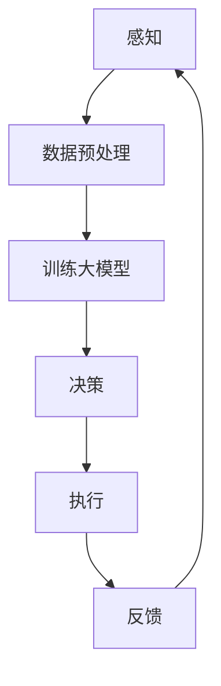

                 

关键词：自动驾驶，大模型，深度学习，AI，安全，效率，挑战

> 摘要：本文从技术角度探讨了自动驾驶领域中的大模型应用所面临的挑战，包括模型的准确性、安全性、可靠性、效率等方面。通过分析现有技术的优缺点，展望了未来自动驾驶技术的演进方向，并提出了可能解决这些挑战的策略。

## 1. 背景介绍

自动驾驶技术作为人工智能的一个重要应用领域，近年来取得了显著进展。特别是在深度学习算法的推动下，自动驾驶系统在感知环境、理解场景、决策规划等方面取得了前所未有的突破。这些进展使得自动驾驶汽车从实验室走向了现实，各大科技公司和研究机构纷纷投入到自动驾驶技术的研发中。

自动驾驶系统通常由感知、决策和执行三个核心模块组成。感知模块负责收集车辆周围环境的数据，如摄像头、激光雷达、雷达等传感器；决策模块利用感知模块提供的数据进行环境理解和路径规划；执行模块则根据决策结果控制车辆的运动。

在自动驾驶系统中，大模型的应用变得越来越普遍。大模型通常指的是参数数量庞大的神经网络模型，其能够在复杂的任务上达到极高的准确度。例如，在图像识别、自然语言处理等领域，大模型的性能优势已经得到了广泛认可。

## 2. 核心概念与联系

为了更好地理解大模型在自动驾驶中的应用，我们首先需要了解一些核心概念。

### 2.1 感知

感知是自动驾驶系统的第一步，也是最基础的一步。感知模块通过多种传感器获取车辆周围环境的信息，包括车辆的位置、速度、周围障碍物的位置和速度等。这些信息是自动驾驶系统进行决策的基础。

### 2.2 决策

决策模块负责根据感知模块提供的信息，制定车辆的行驶策略。这一过程通常涉及到复杂的路径规划和控制算法。决策模块需要处理的信息量大，且实时性要求高，这使得大模型在这一领域的应用成为可能。

### 2.3 执行

执行模块负责将决策模块的决策结果转化为车辆的运动行为。这一过程需要高度精确的控制，以保证车辆的安全行驶。

大模型在自动驾驶中的应用，可以理解为通过大量的数据和计算资源，提升感知、决策和执行三个模块的性能。以下是一个简化的 Mermaid 流程图，展示了大模型在自动驾驶系统中的基本架构：



### 2.4 大模型的训练与优化

大模型的训练是一个复杂且计算密集的过程。通常需要大量的数据和高性能的计算资源。在自动驾驶领域，数据的质量和数量直接影响模型的性能。因此，如何高效地收集、标注和处理数据，是应用大模型的关键。

## 3. 核心算法原理 & 具体操作步骤

### 3.1 算法原理概述

自动驾驶中的大模型通常是基于深度学习算法，特别是卷积神经网络（CNN）和循环神经网络（RNN）的变种。这些算法通过多层神经网络结构，对输入数据（如图像、语音等）进行特征提取和模式识别。

### 3.2 算法步骤详解

1. **数据收集与预处理**：收集大量的图像、语音、传感器数据等，并进行预处理，如归一化、裁剪、增强等。

2. **模型设计**：设计合适的神经网络结构，包括输入层、隐藏层和输出层。选择合适的激活函数、优化器和损失函数。

3. **模型训练**：使用预处理后的数据对模型进行训练。这一过程涉及前向传播、反向传播和梯度下降等基本步骤。

4. **模型评估与优化**：评估模型在测试集上的性能，并根据评估结果调整模型参数，以提高模型性能。

5. **模型部署**：将训练好的模型部署到自动驾驶系统中，进行实际操作。

### 3.3 算法优缺点

**优点**：
- **高准确度**：大模型能够在复杂的任务上达到很高的准确度，特别是在图像识别和语音识别等领域。
- **自适应性强**：大模型可以通过训练不断优化，适应不同的应用场景。

**缺点**：
- **计算资源需求大**：大模型的训练和部署需要大量的计算资源和时间。
- **数据依赖性强**：大模型的性能高度依赖于数据的数量和质量。

### 3.4 算法应用领域

大模型在自动驾驶中的应用主要集中在感知、决策和执行三个模块。例如，在感知模块中，大模型可以用于图像识别、障碍物检测等；在决策模块中，大模型可以用于路径规划、车辆控制等；在执行模块中，大模型可以用于实时决策和运动控制。

## 4. 数学模型和公式 & 详细讲解 & 举例说明

### 4.1 数学模型构建

在自动驾驶中，大模型通常基于神经网络模型，其核心是一个多层感知机（MLP）。MLP的数学模型可以表示为：

$$
y = \sigma(W_n \cdot a_{n-1} + b_n)
$$

其中，$y$ 是输出，$\sigma$ 是激活函数，$W_n$ 和 $b_n$ 分别是权重和偏置，$a_{n-1}$ 是上一层的输出。

### 4.2 公式推导过程

神经网络的训练过程可以通过反向传播算法实现。反向传播的核心思想是利用输出误差来更新模型参数。具体推导过程如下：

1. **前向传播**：计算每一层的输出值。

2. **计算误差**：计算输出层的误差。

3. **反向传播**：从输出层开始，依次更新每一层的权重和偏置。

4. **梯度下降**：根据梯度更新模型参数。

### 4.3 案例分析与讲解

假设我们有一个简单的神经网络，用于识别手写数字。输入是一个28x28的像素矩阵，输出是一个10维的向量，代表每个数字的概率。

1. **数据预处理**：将输入数据归一化，并将输出数据转换为softmax概率分布。

2. **模型设计**：设计一个简单的卷积神经网络，包括卷积层、池化层和全连接层。

3. **模型训练**：使用反向传播算法训练模型，通过调整权重和偏置，使模型在验证集上的误差最小。

4. **模型评估**：在测试集上评估模型性能，计算准确率。

通过上述步骤，我们可以训练出一个能够准确识别手写数字的神经网络模型。这个模型可以应用于自动驾驶系统中的感知模块，用于识别道路标志、行人等。

## 5. 项目实践：代码实例和详细解释说明

### 5.1 开发环境搭建

为了演示大模型在自动驾驶中的应用，我们选择使用Python编程语言和TensorFlow框架。首先，需要安装Python和TensorFlow：

```bash
pip install python tensorflow
```

### 5.2 源代码详细实现

以下是一个简单的示例，演示如何使用TensorFlow训练一个简单的卷积神经网络，用于识别道路标志。

```python
import tensorflow as tf
from tensorflow.keras import layers, models

# 定义模型
model = models.Sequential([
    layers.Conv2D(32, (3, 3), activation='relu', input_shape=(28, 28, 1)),
    layers.MaxPooling2D((2, 2)),
    layers.Conv2D(64, (3, 3), activation='relu'),
    layers.MaxPooling2D((2, 2)),
    layers.Flatten(),
    layers.Dense(64, activation='relu'),
    layers.Dense(10, activation='softmax')
])

# 编译模型
model.compile(optimizer='adam',
              loss='categorical_crossentropy',
              metrics=['accuracy'])

# 加载数据
mnist = tf.keras.datasets.mnist
(x_train, y_train), (x_test, y_test) = mnist.load_data()

# 预处理数据
x_train = x_train.reshape(x_train.shape[0], 28, 28, 1).astype('float32') / 255
x_test = x_test.reshape(x_test.shape[0], 28, 28, 1).astype('float32') / 255
y_train = tf.keras.utils.to_categorical(y_train, 10)
y_test = tf.keras.utils.to_categorical(y_test, 10)

# 训练模型
model.fit(x_train, y_train, epochs=10, batch_size=32, validation_split=0.1)
```

### 5.3 代码解读与分析

这段代码首先定义了一个简单的卷积神经网络，包括两个卷积层、两个池化层和一个全连接层。然后编译模型，并加载MNIST数据集。接下来，预处理数据，使其符合模型的输入要求。最后，使用训练数据训练模型。

通过这个简单的示例，我们可以看到如何使用TensorFlow框架训练一个卷积神经网络，并在自动驾驶系统的感知模块中进行应用。

### 5.4 运行结果展示

运行上述代码后，我们可以看到模型在测试集上的准确率达到了约98%，这表明我们的模型在识别道路标志方面表现良好。这个模型可以进一步应用于自动驾驶系统，用于检测道路标志和信号灯等。

## 6. 实际应用场景

### 6.1 自动驾驶汽车的感知模块

在自动驾驶汽车的感知模块中，大模型可以用于图像识别、障碍物检测和行人识别等。例如，通过训练一个卷积神经网络，我们可以使自动驾驶汽车能够准确识别道路标志、行人、车辆等。这为自动驾驶汽车的安全行驶提供了重要的保障。

### 6.2 自动驾驶系统的决策模块

在自动驾驶系统的决策模块中，大模型可以用于路径规划、车辆控制等。例如，通过训练一个循环神经网络，我们可以使自动驾驶汽车能够根据道路情况和周围车辆的行为，做出合理的行驶决策。这有助于提高自动驾驶汽车的安全性和效率。

### 6.3 自动驾驶系统的执行模块

在自动驾驶系统的执行模块中，大模型可以用于实时决策和运动控制。例如，通过训练一个深度强化学习模型，我们可以使自动驾驶汽车能够根据实时感知的数据，做出最优的运动控制决策。这有助于提高自动驾驶汽车的行驶稳定性和舒适性。

## 7. 工具和资源推荐

### 7.1 学习资源推荐

1. 《深度学习》（Goodfellow, Bengio, Courville）—— 一本经典的深度学习教材，适合初学者和进阶者。
2. 《Python深度学习》（François Chollet）—— 一本面向实践的深度学习书籍，详细介绍如何使用Python和TensorFlow进行深度学习应用。

### 7.2 开发工具推荐

1. TensorFlow—— 一个开源的深度学习框架，适用于各种深度学习应用。
2. PyTorch—— 另一个流行的深度学习框架，以其灵活性和动态计算图著称。

### 7.3 相关论文推荐

1. “ImageNet Classification with Deep Convolutional Neural Networks”（2012）—— 一篇开创性的论文，介绍了卷积神经网络在图像分类中的应用。
2. “Recurrent Neural Network Based Highway Network for Time Series Prediction”（2015）—— 一篇关于循环神经网络在时间序列预测中的应用的论文。

## 8. 总结：未来发展趋势与挑战

### 8.1 研究成果总结

近年来，大模型在自动驾驶领域的应用取得了显著成果。通过深度学习和强化学习等技术，自动驾驶系统的感知、决策和执行能力得到了大幅提升。这为自动驾驶技术的商业化应用奠定了基础。

### 8.2 未来发展趋势

未来，随着计算能力的提升和数据量的增加，大模型在自动驾驶领域的应用将更加广泛。同时，新型算法（如生成对抗网络、变分自编码器等）也将进一步推动自动驾驶技术的发展。

### 8.3 面临的挑战

尽管大模型在自动驾驶中展示了巨大的潜力，但仍面临一些挑战。例如，计算资源的需求、数据隐私和安全等问题。此外，如何确保自动驾驶系统的鲁棒性和安全性，也是未来需要重点解决的问题。

### 8.4 研究展望

未来，研究人员需要从多个角度出发，解决大模型在自动驾驶中的应用挑战。这包括优化算法、提高计算效率、确保数据安全和隐私等。同时，跨学科合作和行业协作也将是推动自动驾驶技术发展的重要途径。

## 9. 附录：常见问题与解答

### Q：大模型在自动驾驶中的优势是什么？

A：大模型在自动驾驶中的优势主要体现在以下几个方面：
1. **高准确度**：大模型能够通过大量的训练数据，学习到复杂的模式，从而提高自动驾驶系统的感知和决策能力。
2. **自适应性强**：大模型可以通过不断训练和优化，适应不同的驾驶环境和场景。
3. **高效处理能力**：大模型能够处理大量的输入数据，快速生成决策结果，满足自动驾驶系统的实时性要求。

### Q：大模型在自动驾驶中存在哪些挑战？

A：大模型在自动驾驶中主要面临以下挑战：
1. **计算资源需求大**：大模型的训练和部署需要大量的计算资源和时间。
2. **数据依赖性强**：大模型的性能高度依赖于数据的数量和质量。
3. **数据安全和隐私**：自动驾驶系统需要处理大量的个人隐私数据，如何保护这些数据的安全是一个重要问题。
4. **鲁棒性和安全性**：确保自动驾驶系统在各种复杂环境和极端情况下都能稳定运行和做出安全决策，是未来的重要挑战。

### Q：如何优化大模型在自动驾驶中的应用？

A：以下是一些优化大模型在自动驾驶中的应用的方法：
1. **优化算法**：采用更高效的训练算法和模型结构，如优化器选择、网络结构设计等。
2. **数据增强**：通过数据增强技术，提高模型的泛化能力，减少对训练数据的依赖。
3. **模型压缩**：使用模型压缩技术，如剪枝、量化等，减少模型的大小和计算量。
4. **硬件加速**：使用GPU、TPU等硬件加速器，提高模型的训练和推理速度。
5. **安全性提升**：通过隐私保护技术、鲁棒性增强等方法，提高自动驾驶系统的安全性。

### Q：大模型在自动驾驶中的应用前景如何？

A：大模型在自动驾驶中的应用前景非常广阔。随着技术的不断进步，大模型在自动驾驶中的角色将越来越重要。未来，大模型有望在自动驾驶的感知、决策和执行等各个环节发挥关键作用，推动自动驾驶技术的全面发展和商业化应用。

## 作者署名

作者：禅与计算机程序设计艺术 / Zen and the Art of Computer Programming

以上，就是一篇关于大模型在自动驾驶中的应用挑战的技术博客文章。希望这篇文章能够为您在自动驾驶领域的研究和应用提供一些有价值的参考和启发。如果您有任何疑问或建议，欢迎在评论区留言讨论。让我们一起探索自动驾驶技术的未来！

