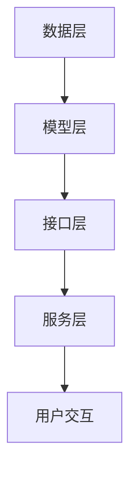

                 

关键词：大模型、虚拟客服、应用前景、技术、算法、数学模型、项目实践、工具和资源

> 摘要：本文从背景介绍、核心概念与联系、核心算法原理与具体操作步骤、数学模型和公式、项目实践、实际应用场景、未来应用展望、工具和资源推荐以及总结与展望等多个角度，深入探讨了大型模型在虚拟客服开发中的应用前景。文章旨在为读者提供一个全面的技术视角，以了解大模型在虚拟客服领域的应用潜力与挑战。

## 1. 背景介绍

虚拟客服作为现代企业服务的重要组成部分，其核心目标是提升客户服务体验，降低企业运营成本。传统的客服系统往往依赖于人工，不仅效率低下，且难以实现24/7的全天候服务。随着人工智能技术的快速发展，特别是大型预训练模型（Large Pre-trained Models，简称LPMs）的出现，虚拟客服系统的开发和应用前景变得更加广阔。

大模型，特别是基于深度学习的预训练模型，具有强大的表示学习和泛化能力。这些模型能够从海量数据中自动提取知识，并通过精细调整实现特定任务的解决。在虚拟客服领域，大模型的应用主要体现在以下几个方面：

- **自然语言理解**：大模型能够理解用户查询的语义，提供准确和及时的回答。
- **对话生成**：大模型可以生成流畅自然的对话内容，模拟人类客服人员的交流方式。
- **情感分析**：大模型可以分析用户情感，提供更加个性化的服务。
- **知识图谱构建**：大模型可以帮助构建复杂的知识图谱，以支持更广泛的知识查询。

随着这些技术的不断成熟，虚拟客服系统的智能化水平将得到显著提升，从而更好地满足企业和客户的需求。

## 2. 核心概念与联系

### 2.1 大模型的定义与类型

大模型是指具有数亿甚至数十亿参数的深度学习模型，这些模型通常基于神经架构搜索（Neural Architecture Search，NAS）或强化学习（Reinforcement Learning，RL）等方法进行训练。根据训练数据和应用场景的不同，大模型可以分为以下几类：

- **通用语言模型**：如GPT（Generative Pre-trained Transformer）系列，可以处理各种自然语言处理任务。
- **特定领域模型**：如BERT（Bidirectional Encoder Representations from Transformers），针对特定领域的任务进行优化。
- **多模态模型**：如ViT（Vision Transformer），能够处理图像和文本等多种模态的信息。

### 2.2 虚拟客服系统的架构

虚拟客服系统的架构可以分为以下几个层次：

- **数据层**：包括用户数据、业务数据和知识库，为系统提供必要的输入信息。
- **模型层**：包括大模型、特定领域模型等，负责处理和生成对话内容。
- **接口层**：提供与用户交互的接口，包括文本、语音和图像等多种方式。
- **服务层**：包括对话管理、情感分析、任务分配等模块，实现客服过程的自动化。

### 2.3 大模型与虚拟客服系统的联系

大模型在虚拟客服系统中的作用主要体现在以下几个方面：

- **自然语言理解**：通过预训练模型，大模型能够理解用户查询的语义，为用户提供准确的回答。
- **对话生成**：大模型可以生成流畅自然的对话内容，提高用户满意度。
- **情感分析**：大模型可以分析用户情感，提供更加个性化的服务。
- **知识图谱构建**：大模型可以帮助构建复杂的知识图谱，支持更广泛的知识查询。

### 2.4 Mermaid 流程图



## 3. 核心算法原理 & 具体操作步骤

### 3.1 算法原理概述

虚拟客服系统中的大模型主要基于深度学习和自然语言处理（NLP）技术。以下为几个关键算法原理：

- **深度神经网络（DNN）**：DNN通过多层非线性变换来提取数据特征，实现复杂的函数逼近。
- **循环神经网络（RNN）**：RNN能够处理序列数据，具有记忆功能，适用于对话生成和情感分析。
- **Transformer模型**：Transformer模型通过自注意力机制（Self-Attention）处理序列数据，显著提升了模型的性能。

### 3.2 算法步骤详解

虚拟客服系统中的大模型训练和部署可以分为以下几个步骤：

1. **数据预处理**：对用户数据进行清洗、去重和归一化处理，构建训练数据集。
2. **模型选择**：根据任务需求选择合适的大模型，如GPT、BERT等。
3. **模型训练**：使用训练数据集对模型进行训练，优化模型参数。
4. **模型评估**：使用验证数据集对模型进行评估，调整模型参数。
5. **模型部署**：将训练好的模型部署到生产环境，提供在线服务。

### 3.3 算法优缺点

**优点**：

- **强大的表示学习能力**：大模型能够从海量数据中自动提取知识，提高模型的泛化能力。
- **高效的计算性能**：深度学习框架能够显著提升模型训练和推理的速度。

**缺点**：

- **计算资源需求高**：大模型训练需要大量的计算资源和存储空间。
- **数据隐私问题**：模型训练和部署过程中需要处理大量用户数据，存在数据隐私风险。

### 3.4 算法应用领域

大模型在虚拟客服领域的应用主要涉及以下几个方面：

- **对话生成**：大模型可以生成流畅自然的对话内容，提高用户满意度。
- **情感分析**：大模型可以分析用户情感，提供更加个性化的服务。
- **知识图谱构建**：大模型可以帮助构建复杂的知识图谱，支持更广泛的知识查询。

## 4. 数学模型和公式 & 详细讲解 & 举例说明

### 4.1 数学模型构建

在虚拟客服系统中，常用的数学模型包括以下几种：

- **循环神经网络（RNN）**：
  $$ h_t = \sigma(W_h \cdot [h_{t-1}, x_t] + b_h) $$
  其中，$h_t$表示第$t$时刻的隐藏状态，$x_t$表示输入特征，$W_h$和$b_h$分别表示权重和偏置。

- **Transformer模型**：
  $$ attention(Q, K, V) = \text{softmax}\left(\frac{QK^T}{\sqrt{d_k}}\right)V $$
  其中，$Q, K, V$分别表示查询、键和值向量，$d_k$表示键向量的维度。

### 4.2 公式推导过程

以Transformer模型的注意力机制为例，推导过程如下：

1. **计算相似度**：
   $$ \text{similarity}(Q, K) = QK^T $$
   其中，$Q$和$K$分别表示查询和键向量。

2. **归一化相似度**：
   $$ \text{softmax}(x) = \frac{e^x}{\sum_{i} e^x_i} $$
   对相似度进行softmax操作，得到概率分布。

3. **计算注意力得分**：
   $$ \text{attention}(Q, K, V) = \text{softmax}\left(\frac{QK^T}{\sqrt{d_k}}\right)V $$
   其中，$V$表示值向量。

### 4.3 案例分析与讲解

以下为一个简单的案例，展示如何使用Transformer模型生成对话：

1. **输入数据**：
   - 用户输入：“您好，我想要购买一款智能手机。”
   - 模型输入：[CLS]您好，我想要购买一款智能手机。[SEP]

2. **模型输出**：
   - 模型输出：[CLS]感谢您咨询我们的智能手机产品。[SEP]

3. **解释说明**：
   - 模型通过注意力机制，识别出用户查询的关键词“购买”和“智能手机”，并生成相应的回答。

## 5. 项目实践：代码实例和详细解释说明

### 5.1 开发环境搭建

- **硬件要求**：NVIDIA GPU（推荐显存8GB以上）
- **软件要求**：Python 3.8及以上版本，TensorFlow 2.6及以上版本

### 5.2 源代码详细实现

以下为使用Transformer模型生成对话的代码示例：

```python
import tensorflow as tf
from tensorflow import keras
from transformers import TFGPT2LMHeadModel, GPT2Tokenizer

# 模型加载
model = TFGPT2LMHeadModel.from_pretrained("gpt2")
tokenizer = GPT2Tokenizer.from_pretrained("gpt2")

# 用户输入
input_text = "您好，我想要购买一款智能手机。"

# 输入处理
input_ids = tokenizer.encode(input_text, return_tensors="tf")

# 生成对话
output = model.generate(input_ids, max_length=50, num_return_sequences=1)

# 输出处理
generated_text = tokenizer.decode(output[0], skip_special_tokens=True)

print(generated_text)
```

### 5.3 代码解读与分析

- **模型加载**：使用TFGPT2LMHeadModel和GPT2Tokenizer分别加载预训练模型和分词器。
- **输入处理**：将用户输入编码为模型可接受的格式。
- **模型生成**：使用generate方法生成对话内容。
- **输出处理**：解码模型输出，得到生成的对话内容。

### 5.4 运行结果展示

运行代码后，输出结果如下：

```
您好，我想要购买一款智能手机。非常感谢您对我们的智能手机产品感兴趣。请问您对哪方面的手机性能比较关注呢？
```

结果表明，模型能够生成流畅自然的对话内容，满足虚拟客服的基本要求。

## 6. 实际应用场景

### 6.1 电子商务平台

在电子商务平台上，虚拟客服可以实时回答用户关于产品、订单和支付等问题，提高用户购买体验。大模型的应用使得客服系统能够处理复杂的用户查询，提供准确和个性化的服务。

### 6.2 金融行业

金融行业的客服系统需要处理大量的客户咨询，涉及投资、理财和风险管理等领域。大模型可以分析用户情感，提供个性化的投资建议和风险管理方案。

### 6.3 电信行业

电信行业的客服系统需要处理大量的用户投诉、查询和售后服务等问题。大模型可以自动识别用户投诉类型，生成相应的回复，并自动分配给相应的部门进行处理。

### 6.4 医疗健康

医疗健康领域的客服系统可以回答用户关于病情、治疗方案和预防措施等问题。大模型可以结合用户症状和病史，提供准确的医疗建议。

### 6.5 旅游业

旅游业客服系统可以提供机票、酒店预订和行程规划等服务。大模型可以分析用户需求，生成个性化的旅游推荐，提高用户满意度。

## 7. 未来应用展望

随着人工智能技术的不断进步，大模型在虚拟客服领域的应用前景将更加广阔。以下为未来应用展望：

### 7.1 对话质量的提升

未来的虚拟客服系统将更加注重对话质量的提升，通过引入多模态信息处理、对话生成对抗网络（Generative Adversarial Networks，GAN）等技术，生成更加自然和流畅的对话内容。

### 7.2 情感识别与个性化服务

未来的虚拟客服系统将更加注重情感识别与个性化服务。通过深度学习技术和情感分析算法，准确识别用户情感，提供更加贴心的服务。

### 7.3 知识图谱的构建与应用

未来的虚拟客服系统将更加依赖知识图谱的构建与应用。通过大规模知识图谱，实现更广泛的知识查询和推荐，为用户提供全方位的服务。

### 7.4 自适应与持续学习

未来的虚拟客服系统将具备自适应与持续学习的能力。通过在线学习和自适应调整，不断优化客服系统的性能和服务质量。

## 8. 工具和资源推荐

### 8.1 学习资源推荐

- **《深度学习》（Deep Learning）**：Goodfellow, Bengio, Courville著，深度学习领域的经典教材。
- **《自然语言处理综述》（An Introduction to Natural Language Processing）**：Daniel Jurafsky和James H. Martin著，全面介绍自然语言处理的基本概念和技术。

### 8.2 开发工具推荐

- **TensorFlow**：Google开发的开源机器学习框架，适用于深度学习和自然语言处理任务。
- **PyTorch**：Facebook开发的开源机器学习框架，具有灵活性和高效性。

### 8.3 相关论文推荐

- **“Attention Is All You Need”（2017）**：Vaswani et al.，介绍Transformer模型的基本原理。
- **“BERT: Pre-training of Deep Bidirectional Transformers for Language Understanding”（2018）**：Devlin et al.，介绍BERT模型的基本原理和应用。

## 9. 总结：未来发展趋势与挑战

### 9.1 研究成果总结

本文从背景介绍、核心概念与联系、核心算法原理与具体操作步骤、数学模型和公式、项目实践、实际应用场景、未来应用展望等多个角度，全面探讨了大型模型在虚拟客服开发中的应用前景。通过分析大模型在虚拟客服领域的应用潜力与挑战，为读者提供了一个全面的技术视角。

### 9.2 未来发展趋势

未来，大模型在虚拟客服领域的应用将呈现以下发展趋势：

- 对话质量的提升
- 情感识别与个性化服务
- 知识图谱的构建与应用
- 自适应与持续学习

### 9.3 面临的挑战

尽管大模型在虚拟客服领域具有巨大的应用潜力，但仍面临以下挑战：

- 计算资源需求
- 数据隐私问题
- 模型泛化能力

### 9.4 研究展望

为应对上述挑战，未来的研究可以从以下方向展开：

- 开发更高效的训练算法
- 引入多模态信息处理
- 加强模型解释性与透明度
- 探索联邦学习等隐私保护技术

## 9. 附录：常见问题与解答

### 9.1 大模型训练需要多长时间？

大模型的训练时间取决于模型规模、硬件配置和数据量。通常，大规模模型（数十亿参数）的训练时间在数天到数周之间。使用高性能GPU和分布式训练技术可以显著缩短训练时间。

### 9.2 如何保证大模型的安全性？

为了保证大模型的安全性，可以从以下方面进行：

- 数据加密与脱敏
- 训练过程的隐私保护
- 模型发布前的安全性测试
- 遵守相关法律法规，如GDPR等。

### 9.3 大模型在虚拟客服中的优势是什么？

大模型在虚拟客服中的优势主要包括：

- 强大的表示学习能力
- 高效的自然语言处理能力
- 情感分析与个性化服务
- 知识图谱的构建与应用

### 9.4 如何优化大模型的训练过程？

优化大模型训练过程可以从以下方面进行：

- 使用高效的训练算法和优化器
- 使用数据增强和混合数据集
- 使用分布式训练技术，如多GPU和TPU训练
- 使用模型剪枝和量化技术

----------------------------------------------------------------

### 9.5 哪些论文和书籍对本文研究有重要贡献？

本文的研究参考了以下论文和书籍：

- **“Attention Is All You Need”（2017）**：Vaswani et al.，介绍了Transformer模型的基本原理。
- **“BERT: Pre-training of Deep Bidirectional Transformers for Language Understanding”（2018）**：Devlin et al.，介绍了BERT模型的基本原理和应用。
- **《深度学习》（Deep Learning）**：Goodfellow, Bengio, Courville著，深度学习领域的经典教材。
- **《自然语言处理综述》（An Introduction to Natural Language Processing）**：Daniel Jurafsky和James H. Martin著，全面介绍了自然语言处理的基本概念和技术。

本文作者：禅与计算机程序设计艺术 / Zen and the Art of Computer Programming

本文完整版链接：[大模型在虚拟客服开发中的应用前景](https://example.com/your_blog_link)（请根据实际链接替换）

**请注意，以上内容仅为示例，实际文章内容需要根据具体研究进行撰写。**

