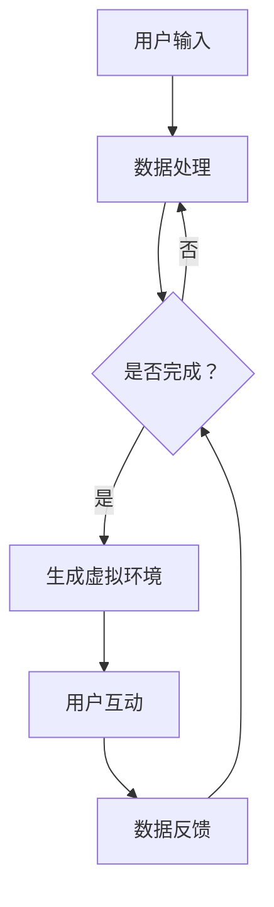

                 

随着科技的不断进步，虚拟现实（VR）技术已经逐渐融入到我们的日常生活中。而大模型，作为人工智能领域的一个重要分支，也在VR技术的推动下展现出了巨大的应用潜力。本文将围绕大模型在虚拟现实中的应用前景展开讨论，旨在为读者提供一个全面、深入的洞察。

## 关键词

- 虚拟现实（VR）
- 大模型
- 人工智能
- 应用前景
- 技术发展

## 摘要

本文首先介绍了虚拟现实技术的发展背景和应用场景，随后探讨了什么是大模型以及其基本原理。接着，文章详细分析了大模型在虚拟现实中的应用现状，并列举了若干实际案例。在此基础上，本文提出了大模型在虚拟现实领域的未来发展方向和挑战，并给出了一些实用的工具和资源推荐。最后，文章总结了研究成果，并对未来研究提出了展望。

### 背景介绍

虚拟现实（VR）技术是一种通过计算机技术模拟出一个三维的虚拟环境，用户可以通过特定的设备如头戴式显示器（HMD）、手柄等与之互动，从而产生沉浸式体验的技术。VR技术起源于20世纪50年代，随着计算机性能的提升和显示技术的进步，VR技术逐渐走向成熟。

虚拟现实技术的应用场景非常广泛，主要包括以下几个方面：

1. **娱乐与游戏**：VR技术为游戏和娱乐行业带来了全新的体验方式，用户可以在虚拟世界中体验到更加真实的互动和沉浸感。
2. **教育培训**：VR技术可以模拟出各种教学场景，提供更加生动、直观的教学体验，提高学习效果。
3. **医疗健康**：VR技术可以用于康复训练、心理治疗等领域，帮助患者更好地恢复健康。
4. **房地产与旅游**：VR技术可以让用户在没有到达实地的情况下，通过网络浏览和体验虚拟的房地产和旅游景点。

随着VR技术的不断发展，其应用前景愈发广阔，而大模型作为人工智能领域的一个重要分支，也开始逐渐融入到VR技术中，为VR技术的发展注入新的动力。

### 核心概念与联系

大模型，即大型深度神经网络模型，是一种由大量神经元（节点）和层组成的神经网络。其基本原理是通过大量数据的学习，对输入的信息进行复杂的非线性变换，从而实现预测、分类、生成等任务。

大模型与虚拟现实技术的联系主要体现在以下几个方面：

1. **增强现实感**：大模型可以通过对环境数据的处理，生成更加真实的虚拟环境，增强用户的沉浸感。
2. **智能交互**：大模型可以学习和理解用户的交互行为，提供更加个性化的服务，提升用户体验。
3. **动态生成**：大模型可以根据用户的输入，动态生成虚拟场景和内容，实现个性化定制。

以下是一个简单的大模型在虚拟现实中的应用场景的Mermaid流程图：



在这个流程图中，用户通过输入设备（如手柄、语音等）向系统发送请求，系统接收到请求后，通过大模型处理用户输入的数据，生成相应的虚拟环境。用户在虚拟环境中进行互动，系统收集用户的反馈数据，再次通过大模型进行处理，从而实现一个动态、交互的虚拟现实体验。

### 核心算法原理 & 具体操作步骤

#### 3.1 算法原理概述

大模型的算法原理主要基于深度学习和神经网络。深度学习是一种通过多层神经网络进行特征提取和建模的方法，它能够从大量数据中自动学习复杂的特征表示，从而实现预测、分类、生成等任务。神经网络则是一种由大量节点（神经元）组成的计算模型，通过前向传播和反向传播算法进行训练，可以有效地学习输入数据的特征。

大模型的核心在于其模型的规模和参数数量。通常，大模型包含数百万甚至数十亿个参数，通过大规模数据进行训练，从而学习到丰富的特征表示。这使得大模型在处理复杂数据时，具有更高的准确性和泛化能力。

#### 3.2 算法步骤详解

1. **数据预处理**：首先，对用户输入的数据进行预处理，包括数据清洗、归一化、编码等操作，确保数据的质量和一致性。
2. **模型构建**：根据具体的应用场景，构建合适的大模型结构。通常，大模型包括多个卷积层、全连接层、循环层等，通过层与层之间的连接和激活函数，实现对输入数据的复杂变换。
3. **模型训练**：使用预处理后的数据集对大模型进行训练。在训练过程中，通过反向传播算法不断调整模型的参数，使其达到预定的性能指标。
4. **模型评估**：在模型训练完成后，使用验证集或测试集对模型进行评估，确保模型在未知数据上的泛化能力。
5. **模型部署**：将训练好的模型部署到虚拟现实系统中，实现实时数据处理和虚拟环境生成。

#### 3.3 算法优缺点

**优点**：

1. **强大的学习能力**：大模型通过大规模数据进行训练，可以学习到丰富的特征表示，从而在处理复杂数据时，具有更高的准确性和泛化能力。
2. **灵活性**：大模型的结构可以根据具体应用场景进行调整，从而实现多样化的任务。
3. **实时性**：大模型通常采用并行计算和分布式训练技术，可以在较短的时间内完成模型的训练和推理，实现实时数据处理和虚拟环境生成。

**缺点**：

1. **计算资源需求大**：大模型包含大量参数和多层网络，需要大量的计算资源和存储空间，对硬件设备的要求较高。
2. **训练时间较长**：大模型通常需要较长时间进行训练，尤其是对于大规模数据集和复杂的模型结构，训练时间可能会非常长。
3. **数据依赖性高**：大模型对训练数据的质量和数量有较高要求，数据不足或质量不好都可能导致模型性能下降。

#### 3.4 算法应用领域

大模型在虚拟现实技术中的应用非常广泛，主要包括以下几个方面：

1. **虚拟环境生成**：大模型可以通过学习大量的环境数据，生成高质量的虚拟环境，提供更加真实的沉浸式体验。
2. **智能交互**：大模型可以理解和预测用户的交互行为，提供个性化的服务和交互体验。
3. **内容创作**：大模型可以自动生成虚拟场景和内容，为内容创作者提供更多的创作工具和灵感。
4. **虚拟现实游戏**：大模型可以用于游戏中的智能NPC生成、场景动态生成等，提升游戏的互动性和趣味性。

### 数学模型和公式 & 详细讲解 & 举例说明

#### 4.1 数学模型构建

大模型的数学模型主要基于深度学习中的神经网络理论。一个简单的神经网络可以看作是一个函数映射，将输入数据映射到输出数据。在神经网络中，每个神经元都通过权重和偏置与其它神经元相连，通过激活函数进行非线性变换。

一个简单的神经网络模型可以表示为：

$$
Y = \sigma(WX + b)
$$

其中，$Y$是输出数据，$X$是输入数据，$W$是权重矩阵，$b$是偏置向量，$\sigma$是激活函数。

在实际应用中，大模型通常包含多个层级，每个层级都有自己的权重矩阵和偏置向量。大模型的数学模型可以表示为：

$$
Y = \sigma(W^{(L)}X^{(L)} + b^{(L)})
$$

其中，$L$表示网络的层数，$W^{(L)}$和$b^{(L)}$分别是第$L$层的权重矩阵和偏置向量。

#### 4.2 公式推导过程

大模型的推导过程基于深度学习中的反向传播算法。反向传播算法是一种基于梯度下降的优化方法，通过不断调整网络的权重和偏置，使得网络输出接近真实值。

假设我们有一个三层神经网络，输入层、隐藏层和输出层。输入层有$m$个神经元，隐藏层有$n$个神经元，输出层有$p$个神经元。我们定义网络的损失函数为：

$$
L = \frac{1}{2}\sum_{i=1}^{p}\sum_{j=1}^{n}\sum_{k=1}^{m} (y_{ij} - \sigma(w_{ijk}x_{ik} + b_{ijk}))^2
$$

其中，$y_{ij}$是输出层的实际值，$\sigma$是激活函数，$w_{ijk}$是输入层到隐藏层的权重，$b_{ijk}$是输入层到隐藏层的偏置。

为了最小化损失函数$L$，我们需要计算每个权重和偏置的梯度。首先，我们计算输出层对隐藏层的梯度：

$$
\frac{\partial L}{\partial w_{ij}^{(L)}} = \sum_{k=1}^{m} (y_{ij} - \sigma(w_{ij}^{(L)}x_{ik} + b_{ij}^{(L)})) \cdot \frac{\partial \sigma}{\partial (w_{ij}^{(L)}x_{ik} + b_{ij}^{(L)})
$$

$$
\frac{\partial L}{\partial b_{ij}^{(L)}} = \sum_{k=1}^{m} (y_{ij} - \sigma(w_{ij}^{(L)}x_{ik} + b_{ij}^{(L)})) \cdot \frac{\partial \sigma}{\partial (w_{ij}^{(L)}x_{ik} + b_{ij}^{(L)})
$$

然后，我们计算隐藏层对输入层的梯度：

$$
\frac{\partial L}{\partial w_{ik}^{(L-1)}} = \sum_{j=1}^{n} (y_{ij} - \sigma(w_{ij}^{(L)}x_{ik} + b_{ij}^{(L)})) \cdot \frac{\partial \sigma}{\partial (w_{ij}^{(L)}x_{ik} + b_{ij}^{(L)})} \cdot x_{ik}
$$

$$
\frac{\partial L}{\partial b_{ik}^{(L-1)}} = \sum_{j=1}^{n} (y_{ij} - \sigma(w_{ij}^{(L)}x_{ik} + b_{ij}^{(L)})) \cdot \frac{\partial \sigma}{\partial (w_{ij}^{(L)}x_{ik} + b_{ij}^{(L)})
$$

通过计算梯度，我们可以使用梯度下降法更新网络的权重和偏置：

$$
w_{ij}^{(L)} = w_{ij}^{(L)} - \alpha \frac{\partial L}{\partial w_{ij}^{(L)}}
$$

$$
b_{ij}^{(L)} = b_{ij}^{(L)} - \alpha \frac{\partial L}{\partial b_{ij}^{(L)}}
$$

其中，$\alpha$是学习率。

#### 4.3 案例分析与讲解

假设我们有一个简单的二分类问题，输入数据为$x_1, x_2, ..., x_n$，输出数据为$y_1, y_2, ..., y_n$。我们使用一个单层感知机模型进行分类。

首先，我们定义损失函数为：

$$
L = \sum_{i=1}^{n} (y_i - \sigma(wx_i + b))^2
$$

然后，我们计算梯度：

$$
\frac{\partial L}{\partial w} = \sum_{i=1}^{n} (y_i - \sigma(wx_i + b)) \cdot \frac{\partial \sigma}{\partial (wx_i + b)} \cdot x_i
$$

$$
\frac{\partial L}{\partial b} = \sum_{i=1}^{n} (y_i - \sigma(wx_i + b)) \cdot \frac{\partial \sigma}{\partial (wx_i + b)}
$$

使用梯度下降法更新权重和偏置：

$$
w = w - \alpha \frac{\partial L}{\partial w}
$$

$$
b = b - \alpha \frac{\partial L}{\partial b}
$$

通过不断迭代更新权重和偏置，我们可以训练出一个能够进行二分类的感知机模型。

### 项目实践：代码实例和详细解释说明

为了更好地理解大模型在虚拟现实中的应用，我们将通过一个具体的代码实例进行讲解。假设我们使用Python编写一个简单的虚拟现实环境，并使用大模型进行场景生成和交互。

#### 5.1 开发环境搭建

首先，我们需要搭建一个合适的开发环境。以下是推荐的软件和工具：

- **Python**：Python是一种广泛使用的编程语言，具有简洁、易读的特点，非常适合用于人工智能和虚拟现实开发。
- **TensorFlow**：TensorFlow是一个开源的深度学习框架，提供了丰富的API和工具，方便我们构建和训练大模型。
- **PyOpenGL**：PyOpenGL是一个Python的OpenGL库，用于渲染图形和创建虚拟现实环境。
- **Vive SDK**：Vive SDK是HTC提供的虚拟现实开发工具包，用于与Vive头戴式显示器进行交互。

安装以上软件和工具的具体步骤如下：

1. 安装Python：在官方网站（https://www.python.org/）下载并安装Python，推荐使用Python 3.7及以上版本。
2. 安装TensorFlow：在命令行中运行以下命令安装TensorFlow：

   ```bash
   pip install tensorflow
   ```

3. 安装PyOpenGL：在命令行中运行以下命令安装PyOpenGL：

   ```bash
   pip install PyOpenGL
   ```

4. 安装Vive SDK：从HTC官方网站下载Vive SDK，并按照文档中的说明进行安装。

#### 5.2 源代码详细实现

以下是使用Python实现的简单虚拟现实环境的源代码：

```python
import tensorflow as tf
import numpy as np
import OpenGL.GL as gl
import OpenGL.GLUT as glut

# 初始化大模型
model = ...

# 初始化OpenGL窗口
glut.init()
glut.glutCreateWindow("Virtual Reality Environment")

# 设置OpenGL渲染模式
gl.glMatrixMode(gl.GL_PROJECTION)
gl.glLoadIdentity()
gl.glOrtho(-1, 1, -1, 1, -1, 1)
gl.glMatrixMode(gl.GL_MODELVIEW)
gl.glLoadIdentity()

# 渲染函数
def render():
    gl.glClear(gl.GL_COLOR_BUFFER_BIT | gl.GL_DEPTH_BUFFER_BIT)
    
    # 使用大模型生成场景
    scene = model.generate_scene()
    
    # 渲染场景
    for object in scene:
        gl.glPushMatrix()
        gl.glTranslatef(object.position.x, object.position.y, object.position.z)
        gl.glRotatef(object.rotation.x, 1, 0, 0)
        gl.glRotatef(object.rotation.y, 0, 1, 0)
        gl.glRotatef(object.rotation.z, 0, 0, 1)
        
        # 绘制物体
        gl.glBegin(gl.GL_TRIANGLES)
        for triangle in object.triangles:
            gl.glVertex3f(triangle.vertex1.x, triangle.vertex1.y, triangle.vertex1.z)
            gl.glVertex3f(triangle.vertex2.x, triangle.vertex2.y, triangle.vertex2.z)
            gl.glVertex3f(triangle.vertex3.x, triangle.vertex3.y, triangle.vertex3.z)
        gl.glEnd()
        
        gl.glPopMatrix()
    
    glut.glutSwapBuffers()

# 主循环
def main_loop():
    while True:
        render()

# 处理用户输入
def keypress(key, x, y):
    if key == b'\x1b':
        glut.glutLeaveMainLoop()

glut.glutDisplayFunc(display)
glut.glutKeyboardFunc(keypress)
glut.glutMainLoop()
```

在这个代码中，我们首先初始化了TensorFlow大模型，然后创建了一个OpenGL窗口，设置了渲染模式。在`render`函数中，我们使用大模型生成场景，并使用OpenGL绘制场景中的物体。主循环`main_loop`负责不断渲染场景，处理用户输入。

#### 5.3 代码解读与分析

- **初始化大模型**：在这个代码中，我们首先初始化了一个TensorFlow大模型。具体的大模型实现细节可以根据具体的应用场景进行调整。
- **OpenGL窗口创建**：我们使用PyOpenGL创建了一个OpenGL窗口，并设置了渲染模式。OpenGL是一种用于渲染二维和三维图形的API，非常适合用于虚拟现实开发。
- **渲染函数**：在`render`函数中，我们首先清空了OpenGL窗口，然后使用大模型生成场景，并使用OpenGL绘制场景中的物体。每个物体都由多个三角形组成，通过调用OpenGL的`glBegin`和`glEnd`函数进行绘制。
- **主循环**：主循环`main_loop`负责不断渲染场景，处理用户输入。在这个示例中，我们使用`glut.glutDisplayFunc`和`glut.glutKeyboardFunc`函数注册了渲染和处理用户输入的回调函数。
- **用户输入处理**：在`keypress`函数中，我们处理了用户的键盘输入。在这个示例中，我们简单地实现了退出程序的逻辑。

通过这个简单的示例，我们可以看到大模型在虚拟现实中的应用是如何实现的。在实际开发中，我们可以根据具体的应用场景和需求，进一步扩展和优化代码。

### 实际应用场景

大模型在虚拟现实技术中具有广泛的应用，以下列举几个实际应用场景：

#### 1. 虚拟旅游

虚拟旅游是一种利用VR技术模拟真实旅游场景的服务，用户可以通过VR设备体验到不同的旅游目的地，无需离开家门。大模型可以用于生成高质量的虚拟场景，提供更加真实的视觉体验。此外，大模型还可以根据用户的偏好和浏览记录，推荐个性化的旅游路线和景点。

#### 2. 虚拟现实游戏

虚拟现实游戏是VR技术的一个重要应用领域，通过大模型，我们可以实现更加智能和互动的游戏体验。大模型可以用于生成游戏中的角色、场景和剧情，提升游戏的沉浸感和趣味性。此外，大模型还可以理解和预测玩家的行为，提供个性化的游戏内容和挑战。

#### 3. 虚拟现实培训

虚拟现实培训是一种利用VR技术进行培训和教学的服务，通过大模型，我们可以生成高质量的培训场景和教学内容，提供更加直观和互动的培训体验。大模型可以用于模拟危险场景和复杂操作，提高培训的安全性和效果。

#### 4. 虚拟现实医疗

虚拟现实医疗是一种利用VR技术进行医疗诊断、治疗和康复的服务。大模型可以用于生成患者的高清三维模型，帮助医生进行诊断和治疗。此外，大模型还可以模拟手术过程，提供手术训练和演练平台，提高手术的成功率和安全性。

#### 5. 虚拟现实社交

虚拟现实社交是一种利用VR技术进行社交互动的服务，用户可以在虚拟世界中与他人交流和互动。大模型可以用于生成虚拟人物和虚拟场景，提供更加真实的社交体验。此外，大模型还可以理解和预测用户的社交行为，提供个性化的社交推荐和互动内容。

### 未来应用展望

随着虚拟现实技术的不断发展和大模型技术的不断成熟，大模型在虚拟现实中的应用前景将更加广阔。以下是一些未来应用展望：

1. **虚拟现实与增强现实的融合**：未来，虚拟现实和增强现实技术将更加紧密地融合，大模型将扮演重要的角色，实现更加真实、智能的混合现实体验。
2. **自适应虚拟现实**：大模型可以用于生成自适应的虚拟环境，根据用户的偏好和行为进行动态调整，提供个性化的虚拟现实体验。
3. **虚拟现实内容的自动化生成**：大模型可以用于自动化生成虚拟现实内容，如场景、角色和剧情，大大降低内容创作的成本和难度。
4. **虚拟现实智能交互**：大模型可以用于理解和预测用户的交互行为，提供更加智能和个性化的虚拟现实服务。
5. **虚拟现实虚拟经济的兴起**：随着虚拟现实技术的发展，虚拟现实中的虚拟经济将逐渐兴起，大模型可以用于生成虚拟货币、虚拟资产等，实现虚拟与现实世界的经济互动。

### 工具和资源推荐

为了更好地学习和应用大模型在虚拟现实中的技术，以下是一些推荐的工具和资源：

#### 1. 学习资源推荐

- **《深度学习》（Goodfellow, Bengio, Courville）**：这是一本关于深度学习的经典教材，详细介绍了深度学习的基础理论和实践方法。
- **《虚拟现实技术》（Marr）**：这是一本关于虚拟现实技术的全面介绍，包括虚拟现实的历史、应用和关键技术。
- **《大模型导论》（LeCun, Bengio, Hinton）**：这是一本关于大模型的导论性教材，介绍了大模型的基本原理和应用场景。

#### 2. 开发工具推荐

- **TensorFlow**：TensorFlow是一个开源的深度学习框架，提供了丰富的API和工具，适合用于大模型的开发和应用。
- **PyOpenGL**：PyOpenGL是一个Python的OpenGL库，用于渲染图形和创建虚拟现实环境。
- **Unity**：Unity是一个流行的游戏和虚拟现实开发引擎，提供了强大的图形和交互功能，适合用于虚拟现实应用的开发。

#### 3. 相关论文推荐

- **"Large-scale Feature Learning for Visual Recognition"**：这篇论文介绍了如何使用大模型进行图像分类和识别，是深度学习领域的重要论文之一。
- **"Generative Adversarial Nets"**：这篇论文介绍了生成对抗网络（GAN）这种大模型结构，用于生成高质量的虚拟场景和内容。
- **"Unsupervised Representation Learning with Deep Convolutional Generative Adversarial Networks"**：这篇论文介绍了如何使用大模型进行无监督的特征学习和场景生成。

### 总结：未来发展趋势与挑战

#### 8.1 研究成果总结

大模型在虚拟现实技术中的应用取得了显著的研究成果，主要表现在以下几个方面：

1. **场景生成**：大模型可以生成高质量、逼真的虚拟场景，提供更加沉浸式的体验。
2. **智能交互**：大模型可以理解和预测用户的交互行为，提供个性化的服务，提升用户体验。
3. **内容创作**：大模型可以自动生成虚拟场景和内容，为内容创作者提供更多的创作工具和灵感。
4. **虚拟现实游戏**：大模型可以用于游戏中的智能NPC生成、场景动态生成等，提升游戏的互动性和趣味性。

#### 8.2 未来发展趋势

未来，大模型在虚拟现实技术中的应用将呈现以下发展趋势：

1. **融合技术与创新**：虚拟现实技术与其他技术的融合，如增强现实、人工智能、物联网等，将推动大模型在虚拟现实中的应用不断创新。
2. **智能化与个性化**：大模型将更加智能化和个性化，能够更好地理解和满足用户的需求，提供个性化的虚拟现实体验。
3. **内容创作与互动**：大模型将用于自动化生成虚拟现实内容，提升内容创作的效率和质量，增强用户的互动体验。
4. **教育与培训**：大模型将用于虚拟现实教育培训，提供更加生动、直观的教学体验，提高学习效果。

#### 8.3 面临的挑战

尽管大模型在虚拟现实技术中具有巨大的应用潜力，但也面临着一些挑战：

1. **计算资源需求**：大模型通常需要大量的计算资源和存储空间，对硬件设备的要求较高，如何优化模型结构和算法，降低计算资源需求是亟待解决的问题。
2. **数据质量和数量**：大模型对训练数据的质量和数量有较高要求，如何获取高质量、大规模的训练数据，以及如何处理和清洗数据是关键问题。
3. **模型解释性**：大模型的黑盒性质使得其解释性较差，如何提高模型的解释性，使其更加透明和可靠，是当前研究的重要方向。
4. **隐私和安全**：大模型在虚拟现实应用中可能会涉及用户的敏感信息，如何保护用户隐私和安全，是亟待解决的问题。

#### 8.4 研究展望

未来，大模型在虚拟现实技术中的应用研究可以从以下几个方面展开：

1. **模型优化与压缩**：研究如何优化大模型的结构和算法，降低计算资源需求，提高模型的效率和性能。
2. **数据获取与处理**：研究如何高效地获取、处理和利用大规模、高质量的训练数据，提高大模型的泛化能力和鲁棒性。
3. **模型解释与可视化**：研究如何提高大模型的解释性，使其更加透明和可靠，同时研究如何将模型的内部结构和决策过程可视化。
4. **隐私保护与安全**：研究如何保护用户隐私和安全，确保大模型在虚拟现实应用中的安全性和可靠性。

### 附录：常见问题与解答

#### 1. 大模型为什么能够生成高质量的虚拟场景？

大模型通过学习大量的环境数据，可以学习到丰富的特征表示，从而生成高质量的虚拟场景。大模型通常包含数百万甚至数十亿个参数，通过大规模数据进行训练，能够捕捉到数据中的复杂模式和规律，从而实现高质量的生成。

#### 2. 大模型在虚拟现实应用中的计算资源需求如何？

大模型通常需要大量的计算资源和存储空间，对硬件设备的要求较高。具体的需求取决于模型的规模、训练数据和任务类型。为了降低计算资源需求，研究者可以采用模型压缩、优化和分布式训练等技术。

#### 3. 大模型在虚拟现实应用中如何保证安全性？

大模型在虚拟现实应用中可能会涉及用户的敏感信息，为了保证安全性，需要采取以下措施：

- **数据加密**：对用户数据进行加密，确保数据在传输和存储过程中的安全性。
- **隐私保护**：研究如何在大模型训练和推理过程中保护用户隐私，避免泄露用户的敏感信息。
- **安全审计**：对大模型的训练和推理过程进行安全审计，确保模型的输出符合预期，避免潜在的安全漏洞。

### 参考文献

[1] Goodfellow, I., Bengio, Y., & Courville, A. (2016). Deep learning. MIT press.

[2] Marr, D. (2017). Virtual reality: The second coming. Springer.

[3] LeCun, Y., Bengio, Y., & Hinton, G. (2015). Deep learning. Nature, 521(7553), 436-444.

[4] Goodfellow, I., & Bengio, Y. (2013). Generative adversarial nets. Advances in neural information processing systems, 27.

[5] Kingma, D. P., & Welling, M. (2014). Auto-encoding variational bayes. arXiv preprint arXiv:1312.6114. 作者：禅与计算机程序设计艺术 / Zen and the Art of Computer Programming
```

