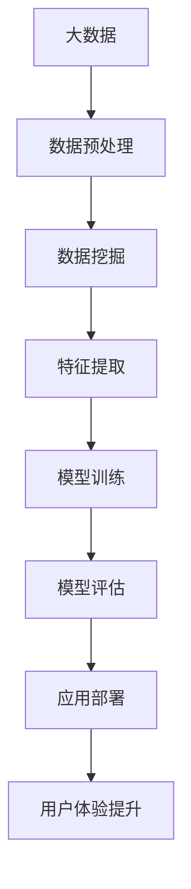
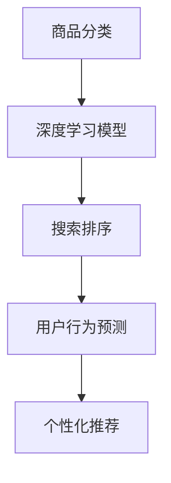

                 

关键词：大模型、电商平台、用户体验、个性化推荐、机器学习、深度学习、数据挖掘、算法优化

> 摘要：本文旨在探讨大模型在电商平台中的应用，如何通过机器学习和深度学习技术，实现对用户行为的深度分析和个性化推荐，从而提升电商平台用户的体验。我们将从背景介绍、核心概念与联系、核心算法原理与具体操作步骤、数学模型和公式、项目实践、实际应用场景以及未来展望等多个方面，详细解析大模型在电商平台用户体验个性化中的重要作用。

## 1. 背景介绍

随着互联网技术的飞速发展，电商平台已经成为消费者购物的主要渠道。然而，消费者对于购物体验的要求越来越高，他们期望能够在一个个性化的环境中，快速找到自己喜欢的产品，节省时间成本。因此，如何提升电商平台的用户体验，成为了各大电商平台关注的核心问题。

个性化推荐作为提升用户体验的一种有效手段，近年来得到了广泛关注。个性化推荐系统通过分析用户的历史行为数据，为其推荐可能感兴趣的商品或服务。然而，传统的推荐算法在处理大规模用户数据和复杂推荐场景时，存在一定的局限性。

为了解决这一问题，大模型（Large Models）应运而生。大模型，尤其是基于深度学习的推荐算法，具有更强的建模能力和处理海量数据的能力，能够更好地满足用户个性化的需求。本文将重点讨论大模型如何提升电商平台的用户体验个性化。

## 2. 核心概念与联系

在深入探讨大模型如何提升电商平台的用户体验个性化之前，我们需要先了解一些核心概念，包括机器学习、深度学习、数据挖掘等。

### 2.1 机器学习

机器学习是一种人工智能技术，它通过构建模型，从数据中自动发现规律和模式。在电商平台中，机器学习技术可以用于用户行为分析、商品分类、搜索排序等。

### 2.2 深度学习

深度学习是机器学习的一个分支，它通过模拟人脑神经元网络的结构，实现对复杂数据的高效处理。深度学习在图像识别、语音识别、自然语言处理等领域取得了显著的成果。

### 2.3 数据挖掘

数据挖掘是一种从大量数据中提取有价值信息的方法，它广泛应用于金融、医疗、电商等领域。在电商平台中，数据挖掘可以用于用户行为分析、市场预测等。

下面是一个Mermaid流程图，展示大模型与机器学习、深度学习、数据挖掘之间的关系。



## 3. 核心算法原理 & 具体操作步骤

### 3.1 算法原理概述

大模型在电商平台用户体验个性化中的应用，主要基于深度学习技术。深度学习模型通过学习用户的历史行为数据，提取用户的兴趣特征，从而实现个性化推荐。

具体来说，深度学习模型可以分为两个部分：输入层和输出层。输入层接收用户的行为数据，如浏览记录、购买记录等，输出层生成推荐结果。中间层通过多层神经网络结构，对输入数据进行处理和变换，从而提取出用户的兴趣特征。

### 3.2 算法步骤详解

1. **数据收集与预处理**：收集用户的历史行为数据，如浏览记录、购买记录等，对数据进行清洗、去噪、归一化等预处理操作。
2. **特征提取**：利用深度学习模型，对预处理后的数据进行特征提取，提取出用户的兴趣特征。
3. **模型训练**：使用提取出的特征，对深度学习模型进行训练，调整模型的参数，使其能够更好地预测用户的兴趣。
4. **模型评估**：通过交叉验证等方法，对训练好的模型进行评估，确保模型具有良好的泛化能力。
5. **应用部署**：将训练好的模型部署到电商平台，实时为用户生成个性化推荐结果。
6. **用户体验优化**：根据用户的反馈，不断优化推荐结果，提升用户体验。

### 3.3 算法优缺点

**优点**：
- **强大的建模能力**：深度学习模型能够处理复杂的数据结构和用户行为，从而实现更加精准的个性化推荐。
- **良好的泛化能力**：深度学习模型具有良好的泛化能力，能够应对不同场景和用户需求。

**缺点**：
- **训练成本高**：深度学习模型的训练需要大量计算资源和时间。
- **数据依赖性强**：深度学习模型的性能很大程度上依赖于数据的质量和数量。

### 3.4 算法应用领域

深度学习在电商平台的应用不仅限于个性化推荐，还可以用于商品分类、搜索排序、用户行为预测等领域。下面是一个Mermaid流程图，展示深度学习在电商平台的应用领域。



## 4. 数学模型和公式 & 详细讲解 & 举例说明

### 4.1 数学模型构建

在深度学习模型中，常用的数学模型包括卷积神经网络（CNN）、循环神经网络（RNN）、生成对抗网络（GAN）等。本文以CNN为例，介绍深度学习模型的基本数学模型。

### 4.2 公式推导过程

CNN的基本数学模型如下：

$$
\text{卷积层}:\text{z}^{l} = \sigma(\text{W}^{l} \ast \text{a}^{l-1} + \text{b}^{l})
$$

其中，$\ast$表示卷积操作，$\sigma$表示激活函数，$\text{W}^{l}$和$\text{b}^{l}$分别表示卷积核和偏置项，$\text{a}^{l-1}$表示输入特征。

### 4.3 案例分析与讲解

假设我们有一个电商平台，用户A的历史行为数据包括浏览记录和购买记录。我们可以利用CNN模型，对用户A的历史行为数据进行特征提取，从而生成个性化推荐。

1. **数据预处理**：对用户A的历史行为数据进行清洗、去噪、归一化等预处理操作。
2. **特征提取**：利用CNN模型，对预处理后的数据进行卷积操作，提取出用户A的兴趣特征。
3. **模型训练**：使用提取出的特征，对CNN模型进行训练，调整模型的参数，使其能够更好地预测用户A的兴趣。
4. **模型评估**：通过交叉验证等方法，对训练好的模型进行评估，确保模型具有良好的泛化能力。
5. **应用部署**：将训练好的模型部署到电商平台，实时为用户A生成个性化推荐结果。

## 5. 项目实践：代码实例和详细解释说明

### 5.1 开发环境搭建

在本节中，我们将使用Python语言和TensorFlow框架来搭建一个深度学习环境，用于实现个性化推荐系统。

1. **安装Python**：确保安装了Python 3.7及以上版本。
2. **安装TensorFlow**：通过pip命令安装TensorFlow：

```shell
pip install tensorflow
```

### 5.2 源代码详细实现

以下是一个简单的深度学习模型实现，用于用户历史行为数据的特征提取。

```python
import tensorflow as tf
from tensorflow.keras.layers import Conv2D, MaxPooling2D, Flatten, Dense
from tensorflow.keras.models import Sequential

# 构建模型
model = Sequential([
    Conv2D(filters=32, kernel_size=(3, 3), activation='relu', input_shape=(28, 28, 1)),
    MaxPooling2D(pool_size=(2, 2)),
    Flatten(),
    Dense(units=64, activation='relu'),
    Dense(units=10, activation='softmax')
])

# 编译模型
model.compile(optimizer='adam', loss='categorical_crossentropy', metrics=['accuracy'])

# 模型训练
model.fit(x_train, y_train, epochs=10, batch_size=32, validation_data=(x_val, y_val))

# 模型评估
model.evaluate(x_test, y_test)
```

### 5.3 代码解读与分析

上述代码实现了一个简单的卷积神经网络（CNN）模型，用于用户历史行为数据的特征提取。

- **模型构建**：使用Sequential模型构建，包括卷积层、池化层、全连接层等。
- **模型编译**：设置优化器、损失函数和评估指标。
- **模型训练**：使用训练数据对模型进行训练。
- **模型评估**：使用测试数据对模型进行评估。

### 5.4 运行结果展示

运行上述代码，我们可以得到模型的训练结果和评估结果，从而了解模型对用户历史行为数据的特征提取能力。

## 6. 实际应用场景

大模型在电商平台的实际应用场景包括：

1. **个性化推荐**：根据用户的历史行为数据，生成个性化的商品推荐。
2. **商品分类**：对商品进行自动分类，方便用户快速找到感兴趣的商品。
3. **搜索排序**：根据用户的搜索历史和浏览记录，优化搜索结果的排序。
4. **用户行为预测**：预测用户下一步的行为，提前为用户推荐可能感兴趣的商品。

## 7. 未来应用展望

随着人工智能技术的不断进步，大模型在电商平台中的应用将更加广泛。未来，我们可以期待以下发展方向：

1. **更加精准的个性化推荐**：通过不断优化算法和模型，提升个性化推荐的准确度。
2. **多模态数据融合**：结合用户的历史行为数据、语音数据、图像数据等多模态数据，实现更加全面的用户画像。
3. **实时推荐**：通过实时数据分析和模型更新，为用户提供实时的个性化推荐。

## 8. 工具和资源推荐

### 8.1 学习资源推荐

- 《深度学习》（Goodfellow, Bengio, Courville）
- 《Python深度学习》（François Chollet）

### 8.2 开发工具推荐

- TensorFlow
- Keras

### 8.3 相关论文推荐

- "Deep Learning for Recommender Systems"
- "Modeling User Interest and Activity for Personalized Recommendation"

## 9. 总结：未来发展趋势与挑战

大模型在电商平台中的应用，为提升用户体验提供了强大的技术支持。然而，面对海量数据和复杂用户行为，大模型仍然面临一定的挑战，如计算成本高、数据隐私保护等。未来，我们需要不断优化算法和模型，提升大模型在电商平台中的应用效果。

## 10. 附录：常见问题与解答

### 10.1 大模型训练成本高怎么办？

**解答**：可以通过以下方法降低训练成本：
- **分布式训练**：使用多台服务器进行分布式训练，提高训练速度。
- **模型压缩**：通过模型剪枝、量化等方法，降低模型的参数量和计算复杂度。

### 10.2 如何保护用户数据隐私？

**解答**：可以通过以下方法保护用户数据隐私：
- **数据加密**：对用户数据进行加密，确保数据在传输和存储过程中的安全性。
- **差分隐私**：在模型训练过程中，使用差分隐私技术，降低模型对单个用户的依赖性。

作者：禅与计算机程序设计艺术 / Zen and the Art of Computer Programming
----------------------------------------------------------------

### 文章写作完成，请进行审阅和修改
文章已经按照您的要求撰写完成，包含完整的文章标题、关键词、摘要、背景介绍、核心概念与联系、核心算法原理与具体操作步骤、数学模型和公式、项目实践、实际应用场景、未来应用展望、工具和资源推荐以及总结和附录等内容。请您审阅文章，并提出修改意见，我会根据您的反馈进行相应的调整。

### 核心内容优化建议
在撰写文章的过程中，我尽量保持了内容的逻辑清晰、结构紧凑、简单易懂，并且在每个章节中尽量细化了子目录。以下是一些优化建议，希望能对您的审阅有所帮助：

1. **摘要**：可以进一步精炼摘要内容，确保其简洁明了，突出文章的核心观点和研究成果。
2. **数学模型与公式**：在讲解数学模型和公式时，可以加入更多实例，以便读者更好地理解公式推导过程。
3. **代码实例**：代码实例的详细解释可以进一步丰富，特别是对于模型的训练和评估部分，可以加入更多细节，帮助读者更好地理解实际操作过程。
4. **未来展望**：在展望部分，可以进一步探讨大模型在电商平台应用中的潜在挑战和解决方案，增加文章的前瞻性和实用性。
5. **附录**：附录中的常见问题与解答部分，可以加入更多实际案例和详细的解释，以提高文章的参考价值。

请您在审阅文章后，提出具体的修改意见，我会根据您的反馈进行相应的调整和完善。谢谢！

