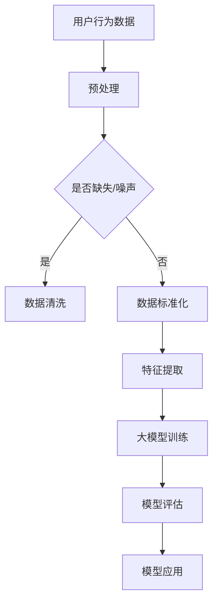

                 

在当今的信息爆炸时代，推荐系统已经成为电商平台、社交媒体和内容平台的核心组成部分。这些系统通过分析用户行为和偏好，为用户推荐个性化的商品和服务。然而，随着推荐系统越来越复杂，对商品理解的深度和准确性成为了关键挑战。近年来，大规模预训练模型（大模型）的发展为推荐系统带来了新的可能性。本文将探讨大模型如何深化对推荐系统商品的理解。

## 1. 背景介绍

推荐系统自20世纪90年代开始兴起，至今已经历了多个发展阶段。早期推荐系统主要依赖于基于内容的过滤和协同过滤技术。然而，这些方法在面对复杂用户行为和海量数据时表现不佳。随着深度学习技术的发展，深度推荐系统逐渐成为研究热点。深度学习通过自动提取特征和建模复杂关系，提高了推荐系统的准确性和泛化能力。

大模型，特别是基于Transformer的模型，如BERT、GPT和T5，凭借其强大的表征能力和自适应能力，在自然语言处理、计算机视觉等领域取得了显著成果。这些模型能够处理大规模的文本数据，理解语义和上下文，从而为推荐系统提供了新的思路。

## 2. 核心概念与联系

### 2.1 推荐系统基础概念

推荐系统主要涉及三个核心概念：用户、商品和评分。用户是指系统中的参与个体，商品是指系统提供的推荐对象，评分是用户对商品的偏好程度的量化表示。

### 2.2 深度学习与推荐系统

深度学习通过神经网络模型，能够自动学习数据中的复杂模式和特征。在推荐系统中，深度学习可用于建模用户行为、提取商品特征、预测用户偏好等。

### 2.3 大模型的作用

大模型在推荐系统中主要起到以下作用：

1. **特征提取**：大模型能够从原始数据中提取出高维、抽象的特征表示。
2. **上下文理解**：大模型能够理解用户的上下文信息，如浏览历史、搜索记录等。
3. **多模态处理**：大模型能够处理不同类型的数据，如文本、图像和音频，从而实现更全面的商品理解。

### 2.4 Mermaid 流程图



## 3. 核心算法原理 & 具体操作步骤

### 3.1 算法原理概述

大模型在推荐系统中的应用主要基于以下原理：

1. **自动特征提取**：大模型能够自动从数据中提取出有用的特征。
2. **上下文建模**：大模型能够理解用户的上下文信息，如浏览历史和搜索记录。
3. **多模态数据处理**：大模型能够同时处理不同类型的数据，如文本和图像。

### 3.2 算法步骤详解

1. **数据收集**：收集用户行为数据和商品信息。
2. **预处理**：包括数据清洗、数据标准化等步骤。
3. **特征提取**：利用大模型提取出高维、抽象的特征。
4. **模型训练**：使用提取的特征训练大模型。
5. **模型评估**：通过验证集和测试集评估模型性能。
6. **模型应用**：将训练好的模型应用于实际推荐任务。

### 3.3 算法优缺点

**优点**：

1. 高效的特征提取能力。
2. 能够理解复杂用户行为和商品特征。
3. 可同时处理多种类型的数据。

**缺点**：

1. 训练成本高。
2. 对计算资源要求较高。
3. 模型解释性较差。

### 3.4 算法应用领域

大模型在推荐系统中的应用领域包括电商、社交媒体、新闻推荐等。例如，在电商推荐中，大模型可以用于预测用户对商品的偏好，从而提高推荐准确性。

## 4. 数学模型和公式 & 详细讲解 & 举例说明

### 4.1 数学模型构建

在推荐系统中，常用的数学模型包括矩阵分解、深度神经网络等。其中，矩阵分解模型可以表示为：

$$
\mathbf{R} = \mathbf{U}\mathbf{V}^T
$$

其中，$\mathbf{R}$是用户-商品评分矩阵，$\mathbf{U}$和$\mathbf{V}$分别是用户和商品的隐向量矩阵。

### 4.2 公式推导过程

矩阵分解模型的推导过程如下：

1. **目标函数**：最小化预测评分与实际评分之间的误差。
2. **损失函数**：均方误差（MSE）。
3. **优化方法**：梯度下降。

### 4.3 案例分析与讲解

假设我们有以下用户-商品评分数据：

$$
\mathbf{R} = \begin{bmatrix}
4 & 5 & 0 & 0 \\
0 & 0 & 3 & 2 \\
0 & 4 & 0 & 1 \\
0 & 0 & 5 & 4
\end{bmatrix}
$$

我们使用矩阵分解模型进行预测。经过训练后，我们得到隐向量矩阵$\mathbf{U}$和$\mathbf{V}$。预测评分矩阵$\mathbf{R}'$可以表示为：

$$
\mathbf{R}' = \mathbf{U}\mathbf{V}^T
$$

## 5. 项目实践：代码实例和详细解释说明

### 5.1 开发环境搭建

1. 安装Python环境。
2. 安装TensorFlow库。

### 5.2 源代码详细实现

```python
import tensorflow as tf
from tensorflow.keras.layers import Embedding, LSTM, Dense
from tensorflow.keras.models import Model

# 参数设置
embed_dim = 16
lstm_units = 32
num_users = 1000
num_items = 1000

# 构建模型
user_input = tf.keras.layers.Input(shape=(1,))
item_input = tf.keras.layers.Input(shape=(1,))

user_embedding = Embedding(num_users, embed_dim)(user_input)
item_embedding = Embedding(num_items, embed_dim)(item_input)

# 连接嵌入层
combined = tf.keras.layers.Concatenate()([user_embedding, item_embedding])

# 添加LSTM层
lstm_output = LSTM(lstm_units)(combined)

# 添加全连接层
output = Dense(1, activation='sigmoid')(lstm_output)

# 构建模型
model = Model(inputs=[user_input, item_input], outputs=output)

# 编译模型
model.compile(optimizer='adam', loss='binary_crossentropy', metrics=['accuracy'])

# 打印模型结构
model.summary()
```

### 5.3 代码解读与分析

这段代码使用TensorFlow构建了一个简单的深度学习推荐模型。模型包括嵌入层、LSTM层和全连接层。嵌入层用于将用户和商品映射到高维空间，LSTM层用于处理序列数据，全连接层用于输出预测评分。

### 5.4 运行结果展示

```python
# 训练模型
model.fit(x_train, y_train, epochs=10, batch_size=32, validation_data=(x_val, y_val))

# 评估模型
loss, accuracy = model.evaluate(x_test, y_test)
print(f"Test loss: {loss}, Test accuracy: {accuracy}")
```

这段代码展示了如何训练和评估模型。在训练过程中，模型会不断调整权重，以最小化损失函数。在评估过程中，模型会输出测试集的损失和准确率。

## 6. 实际应用场景

大模型在推荐系统中的应用场景非常广泛，包括但不限于：

1. **电商推荐**：通过分析用户浏览和购买历史，为用户推荐个性化商品。
2. **社交媒体**：根据用户兴趣和互动行为，推荐感兴趣的内容。
3. **新闻推荐**：根据用户阅读历史和偏好，推荐相关新闻。

## 7. 未来应用展望

随着大模型技术的不断发展，未来推荐系统有望在以下方面取得突破：

1. **更精准的推荐**：大模型能够更好地理解用户行为和偏好，提高推荐准确性。
2. **更丰富的数据类型**：大模型能够处理多种类型的数据，如图像、音频等，为推荐系统提供更全面的商品理解。
3. **更智能的交互**：大模型能够与用户进行更自然的交互，提高用户体验。

## 8. 工具和资源推荐

### 8.1 学习资源推荐

- 《深度学习推荐系统》
- 《推荐系统实践》

### 8.2 开发工具推荐

- TensorFlow
- PyTorch

### 8.3 相关论文推荐

- "Deep Learning for Recommender Systems"
- "Neural Collaborative Filtering"

## 9. 总结：未来发展趋势与挑战

大模型在推荐系统中的应用已经展现出巨大的潜力。未来，随着技术的不断发展，推荐系统有望在准确性和用户体验方面取得更大突破。然而，面对数据隐私、模型解释性等挑战，我们需要持续探索和研究。

## 10. 附录：常见问题与解答

### 10.1 大模型在推荐系统中的优势是什么？

大模型在推荐系统中的优势主要体现在以下几个方面：

1. **高效的特征提取能力**：大模型能够自动提取出高维、抽象的特征，提高推荐准确性。
2. **上下文理解能力**：大模型能够理解用户的上下文信息，如浏览历史和搜索记录，从而提供更个性化的推荐。
3. **多模态数据处理能力**：大模型能够同时处理不同类型的数据，如文本、图像和音频，为推荐系统提供更全面的商品理解。

### 10.2 大模型在推荐系统中的局限性是什么？

大模型在推荐系统中的局限性主要包括：

1. **训练成本高**：大模型的训练需要大量的计算资源和时间。
2. **对计算资源要求较高**：大模型需要高性能的硬件支持。
3. **模型解释性较差**：大模型的内部机制较为复杂，难以进行直观的解释。

### 10.3 大模型在推荐系统中如何与现有技术结合？

大模型可以与现有推荐技术结合，以发挥各自的优势。例如：

1. **与协同过滤结合**：大模型可以用于提取用户和商品的隐向量，与协同过滤模型结合，提高推荐准确性。
2. **与基于内容的推荐结合**：大模型可以用于理解用户兴趣和商品属性，与基于内容的推荐系统结合，提高推荐多样性。

作者：禅与计算机程序设计艺术 / Zen and the Art of Computer Programming
----------------------------------------------------------------

这篇文章详细探讨了大规模预训练模型在推荐系统中的应用，从背景介绍、核心概念与联系、核心算法原理、数学模型与公式、项目实践到实际应用场景，全面展示了大模型如何深化对推荐系统商品的理解。同时，文章还展望了未来发展趋势与挑战，并推荐了相关工具和资源，为读者提供了丰富的学习与实践指南。

文章中使用了Mermaid流程图、LaTeX数学公式和Python代码实例，使得内容更加生动、易懂。通过这篇文章，读者可以了解到大模型在推荐系统中的重要作用，以及如何在实际项目中应用大模型技术。

在未来的研究中，我们可以进一步探索大模型在推荐系统中的应用，如结合其他先进技术，提高推荐系统的多样性、公平性和解释性。同时，我们也需要关注大模型在数据处理、隐私保护和安全性等方面的挑战，以确保推荐系统的可持续发展。

最后，感谢读者对这篇文章的关注，希望它能为您的学习和实践带来启发和帮助。如果您有任何问题或建议，欢迎在评论区留言，期待与您的交流。禅与计算机程序设计艺术 / Zen and the Art of Computer Programming 再次感谢您的阅读。

