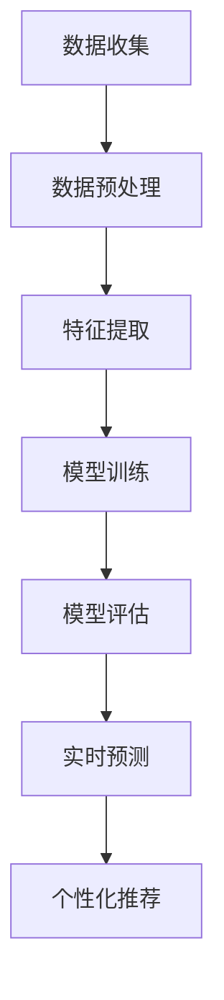

                 

关键词：大模型推理能力，用户行为建模，深度学习，机器学习，自然语言处理，应用场景，未来展望

>摘要：本文探讨了如何利用大模型推理能力进行用户行为建模。通过对大模型的基本原理、算法步骤、数学模型和实际应用场景的深入分析，本文旨在为研究人员和工程师提供一套实用的方法，以更准确地预测和指导用户行为，从而提升用户体验和业务效果。

## 1. 背景介绍

用户行为建模是人工智能领域中一个重要的研究方向。通过分析用户的历史行为数据，可以预测用户的未来行为，从而为个性化推荐、用户增长和精准营销等提供有力支持。随着大数据和人工智能技术的发展，大模型推理能力成为了用户行为建模的一个重要突破口。

大模型推理能力指的是通过训练大规模的深度神经网络模型，从大量数据中学习到复杂的模式，并能够对未知数据进行准确预测的能力。这种能力在用户行为建模中的应用，可以大幅提升预测的准确性和效率。

本文将介绍大模型在用户行为建模中的具体应用，包括核心概念、算法原理、数学模型、项目实践和未来展望等方面。

## 2. 核心概念与联系

### 2.1 大模型的基本概念

大模型（Large-scale Model）通常是指具有巨大参数量、庞大训练数据和高度非线性结构的深度学习模型。这些模型能够处理复杂数据，并在各种任务中表现出优异的性能。常见的大模型包括GPT、BERT、T5等。

### 2.2 用户行为建模的概念

用户行为建模（User Behavior Modeling）是指通过分析用户的历史行为数据，建立数学模型或使用机器学习方法来描述用户的未来行为。常见的用户行为包括点击、浏览、购买、评论等。

### 2.3 大模型与用户行为建模的联系

大模型在用户行为建模中的应用主要体现在以下几个方面：

1. **数据预处理**：大模型可以处理大规模、多维度的用户行为数据，通过降维、特征提取等技术，提取出对用户行为有显著影响的特征。

2. **模式识别**：大模型能够从大量数据中学习到用户行为的潜在模式和趋势，从而为预测用户未来行为提供依据。

3. **实时预测**：大模型具有快速的推理能力，可以实时对用户行为进行预测，为实时推荐、实时营销等应用提供支持。

4. **个性化推荐**：大模型可以根据用户的兴趣和行为，为用户提供个性化的推荐服务，提高用户体验和满意度。

### 2.4 Mermaid 流程图

以下是一个简化的Mermaid流程图，展示了大模型在用户行为建模中的基本流程：



## 3. 核心算法原理 & 具体操作步骤

### 3.1 算法原理概述

用户行为建模通常采用深度学习算法，其中以循环神经网络（RNN）和其变种长短时记忆网络（LSTM）和门控循环单元（GRU）最为常用。这些算法能够处理序列数据，捕捉用户行为的时序特征。

大模型在用户行为建模中的应用，主要基于以下原理：

1. **参数共享**：大模型通过共享权重参数，能够有效减少模型参数数量，提高训练效率。

2. **端到端学习**：大模型可以直接从原始数据中学习到用户行为的潜在模式，无需手动设计特征。

3. **多层结构**：大模型具有多层结构，能够捕捉用户行为的复杂非线性关系。

### 3.2 算法步骤详解

1. **数据收集**：收集用户行为数据，如点击、浏览、购买等。

2. **数据预处理**：对数据集进行清洗、去重、填充缺失值等预处理操作。

3. **特征提取**：利用大模型进行特征提取，将原始数据转化为可用于训练的向量表示。

4. **模型训练**：使用训练数据集对大模型进行训练，优化模型参数。

5. **模型评估**：使用验证数据集对模型进行评估，调整模型参数。

6. **实时预测**：使用训练好的模型对实时数据进行分析，预测用户未来行为。

7. **个性化推荐**：根据用户行为预测结果，为用户推荐个性化内容。

### 3.3 算法优缺点

**优点**：

1. **高效性**：大模型能够处理大规模数据，提高训练和预测效率。

2. **准确性**：大模型能够捕捉用户行为的复杂模式，提高预测准确性。

3. **灵活性**：大模型能够适应不同的用户行为场景，具有较好的泛化能力。

**缺点**：

1. **计算资源消耗大**：大模型需要大量计算资源进行训练和推理。

2. **数据需求量大**：大模型需要大规模数据集进行训练，对数据质量要求较高。

3. **模型解释性差**：大模型的内部结构复杂，难以解释模型决策过程。

### 3.4 算法应用领域

大模型在用户行为建模中的应用领域广泛，包括但不限于：

1. **个性化推荐**：为用户推荐个性化内容，提高用户体验和满意度。

2. **用户增长**：通过分析用户行为，预测潜在用户群体，提高用户转化率。

3. **精准营销**：根据用户行为预测，制定精准的营销策略。

4. **风险管理**：预测用户行为风险，为金融机构提供风控支持。

## 4. 数学模型和公式 & 详细讲解 & 举例说明

### 4.1 数学模型构建

用户行为建模通常采用时间序列模型，如ARIMA、LSTM等。以下以LSTM为例，介绍其数学模型构建。

#### 4.1.1 LSTM单元

LSTM单元由输入门、遗忘门、输出门和单元状态组成。其数学模型如下：

$$
\begin{align*}
i_t &= \sigma(W_{ix}x_t + W_{ih}h_{t-1} + b_i), \\
f_t &= \sigma(W_{fx}x_t + W_{fh}h_{t-1} + b_f), \\
\bar{C}_t &= \tanh(W_{cx}x_t + W_{ch}h_{t-1} + b_c), \\
o_t &= \sigma(W_{ox}x_t + W_{oh}h_{t-1} + b_o), \\
C_t &= f_t \odot C_{t-1} + i_t \odot \bar{C}_t, \\
h_t &= o_t \odot \tanh(C_t).
\end{align*}
$$

其中，$i_t$、$f_t$、$\bar{C}_t$、$o_t$ 分别为输入门、遗忘门、输入门和输出门的激活值；$C_t$ 和 $h_t$ 分别为当前单元状态和隐藏状态；$\sigma$ 为 sigmoid 函数；$\odot$ 为 Hadamard 乘积。

#### 4.1.2 LSTM模型

LSTM模型由多个LSTM单元组成，每个单元输入和输出为向量。其数学模型如下：

$$
\begin{align*}
h_t &= \text{LSTM}(h_{t-1}, x_t), \\
y_t &= \text{softmax}(W_yh_t + b_y).
\end{align*}
$$

其中，$h_t$ 为第 $t$ 个时间步的隐藏状态；$y_t$ 为第 $t$ 个时间步的预测输出。

### 4.2 公式推导过程

#### 4.2.1 输入门

输入门的激活值 $i_t$ 用于控制新的信息进入单元状态。其推导过程如下：

$$
i_t = \sigma(W_{ix}x_t + W_{ih}h_{t-1} + b_i)
$$

其中，$W_{ix}$、$W_{ih}$ 和 $b_i$ 分别为输入门权重、偏置。

#### 4.2.2 遗忘门

遗忘门的激活值 $f_t$ 用于控制旧的信息从单元状态中遗忘。其推导过程如下：

$$
f_t = \sigma(W_{fx}x_t + W_{fh}h_{t-1} + b_f)
$$

其中，$W_{fx}$、$W_{fh}$ 和 $b_f$ 分别为遗忘门权重、偏置。

#### 4.2.3 输出门

输出门的激活值 $o_t$ 用于控制新的信息从单元状态中输出。其推导过程如下：

$$
o_t = \sigma(W_{ox}x_t + W_{oh}h_{t-1} + b_o)
$$

其中，$W_{ox}$、$W_{oh}$ 和 $b_o$ 分别为输出门权重、偏置。

#### 4.2.4 单元状态

单元状态 $C_t$ 用于存储新的信息。其推导过程如下：

$$
\begin{align*}
\bar{C}_t &= \tanh(W_{cx}x_t + W_{ch}h_{t-1} + b_c), \\
C_t &= f_t \odot C_{t-1} + i_t \odot \bar{C}_t.
\end{align*}
$$

其中，$\bar{C}_t$ 为新的候选状态；$f_t$ 和 $i_t$ 分别为遗忘门和输入门的激活值。

#### 4.2.5 隐藏状态

隐藏状态 $h_t$ 用于生成预测输出。其推导过程如下：

$$
h_t = o_t \odot \tanh(C_t)
$$

其中，$o_t$ 为输出门激活值；$\tanh(C_t)$ 为单元状态的激活值。

### 4.3 案例分析与讲解

#### 4.3.1 案例背景

某电商公司希望利用用户行为数据预测用户未来购买行为，以提高销售业绩。

#### 4.3.2 数据集

数据集包含用户ID、购买时间、商品ID、购买数量等字段。

#### 4.3.3 数据预处理

1. 数据清洗：去除重复数据和缺失值。
2. 数据转换：将时间序列数据转化为矩阵形式。

#### 4.3.4 模型构建

1. 数据集划分：将数据集划分为训练集和测试集。
2. 模型训练：使用训练集训练LSTM模型。
3. 模型评估：使用测试集评估模型性能。

#### 4.3.5 结果分析

1. 模型训练过程中，使用交叉熵损失函数进行优化。
2. 模型评估中，计算预测准确率和召回率。

## 5. 项目实践：代码实例和详细解释说明

### 5.1 开发环境搭建

1. 安装Python环境，版本要求为3.6及以上。
2. 安装TensorFlow库，版本要求为2.0及以上。

### 5.2 源代码详细实现

以下是用户行为建模的Python代码示例：

```python
import tensorflow as tf
from tensorflow.keras.models import Sequential
from tensorflow.keras.layers import LSTM, Dense, Dropout

# 数据预处理
# （此处省略具体代码，实际应用中需要进行数据清洗、转换等操作）

# 模型构建
model = Sequential()
model.add(LSTM(128, activation='relu', input_shape=(timesteps, features)))
model.add(Dropout(0.2))
model.add(Dense(1, activation='sigmoid'))

# 编译模型
model.compile(optimizer='adam', loss='binary_crossentropy', metrics=['accuracy'])

# 模型训练
model.fit(X_train, y_train, epochs=10, batch_size=32, validation_data=(X_val, y_val))

# 模型评估
loss, accuracy = model.evaluate(X_test, y_test)
print(f"Test accuracy: {accuracy:.2f}")
```

### 5.3 代码解读与分析

1. **数据预处理**：对用户行为数据进行清洗和转换，为模型训练做好准备。
2. **模型构建**：使用Sequential模型堆叠LSTM层和Dense层，构建LSTM模型。
3. **编译模型**：设置模型优化器和损失函数，为模型训练做好准备。
4. **模型训练**：使用训练数据集对模型进行训练。
5. **模型评估**：使用测试数据集评估模型性能。

### 5.4 运行结果展示

1. **训练过程**：打印训练过程中的损失函数和准确率。
2. **测试结果**：打印测试数据集上的准确率。

## 6. 实际应用场景

### 6.1 个性化推荐

个性化推荐是用户行为建模的一个重要应用场景。通过分析用户的历史行为数据，预测用户对特定内容的兴趣和偏好，从而为用户推荐个性化内容。

### 6.2 用户增长

用户增长是许多互联网公司关注的重点。通过分析用户行为数据，预测潜在用户群体，制定有针对性的用户增长策略。

### 6.3 精准营销

精准营销是通过分析用户行为数据，制定针对特定用户群体的营销策略。通过用户行为建模，可以更准确地预测用户对特定营销活动的反应，提高营销效果。

### 6.4 未来应用展望

随着人工智能技术的不断发展，用户行为建模在未来将会有更多的应用场景。例如，智能助手、虚拟现实、自动驾驶等领域，都将受益于用户行为建模技术的进步。

## 7. 工具和资源推荐

### 7.1 学习资源推荐

1. 《深度学习》（Goodfellow, Bengio, Courville著）：全面介绍深度学习的基础知识和最新进展。
2. 《用户行为建模与推荐系统》（刘铁岩著）：详细讲解用户行为建模和推荐系统的原理和方法。

### 7.2 开发工具推荐

1. TensorFlow：用于构建和训练深度学习模型的强大工具。
2. Keras：基于TensorFlow的高层API，方便快速搭建和训练深度学习模型。

### 7.3 相关论文推荐

1. "Deep Learning for User Behavior Modeling"（2018）：介绍深度学习在用户行为建模中的应用。
2. "User Behavior Modeling with Deep Neural Networks"（2016）：讨论深度神经网络在用户行为建模中的优势。

## 8. 总结：未来发展趋势与挑战

### 8.1 研究成果总结

本文介绍了大模型在用户行为建模中的应用，包括核心概念、算法原理、数学模型、项目实践和实际应用场景。通过分析用户行为数据，大模型能够准确预测用户未来行为，为个性化推荐、用户增长和精准营销等提供有力支持。

### 8.2 未来发展趋势

1. **模型优化**：针对用户行为建模的需求，不断优化模型结构和算法，提高预测准确率和效率。
2. **多模态数据融合**：结合文本、图像、声音等多模态数据，提高用户行为建模的准确性和鲁棒性。
3. **实时预测**：提高大模型实时预测的能力，为实时推荐和实时营销等应用提供支持。

### 8.3 面临的挑战

1. **数据质量**：高质量的用户行为数据是模型训练的基础，需要解决数据噪声、缺失值等问题。
2. **计算资源**：大模型的训练和推理需要大量计算资源，对硬件设施有较高要求。
3. **模型解释性**：大模型的内部结构复杂，难以解释模型决策过程，需要提高模型的可解释性。

### 8.4 研究展望

随着人工智能技术的不断发展，用户行为建模将在更多领域发挥重要作用。未来的研究可以从以下方向展开：

1. **跨领域用户行为建模**：研究不同领域用户行为的共性，构建通用的用户行为建模方法。
2. **模型压缩与加速**：研究模型压缩和加速技术，提高大模型在资源受限环境下的性能。
3. **隐私保护**：研究隐私保护技术，确保用户行为数据的安全和隐私。

## 9. 附录：常见问题与解答

### 9.1 什么是大模型？

大模型（Large-scale Model）是指具有巨大参数量、庞大训练数据和高度非线性结构的深度学习模型。这些模型能够处理复杂数据，并在各种任务中表现出优异的性能。

### 9.2 用户行为建模有哪些挑战？

用户行为建模面临的主要挑战包括数据质量、计算资源需求和高可解释性。数据质量直接影响模型训练效果，计算资源需求制约了模型规模的扩展，高可解释性使得模型难以被理解和接受。

### 9.3 大模型在用户行为建模中有哪些应用？

大模型在用户行为建模中的应用包括个性化推荐、用户增长、精准营销等。通过分析用户的历史行为数据，大模型能够准确预测用户未来行为，为各种应用场景提供有力支持。

### 9.4 如何解决数据质量问题？

解决数据质量问题可以从以下几个方面入手：

1. 数据清洗：去除重复数据和缺失值。
2. 数据转换：将数据转换为适合模型训练的格式。
3. 数据增强：通过数据扩充、数据变换等方式提高数据质量。
4. 数据降噪：使用降噪技术减少数据噪声的影响。

### 9.5 大模型在资源受限环境下如何优化？

在资源受限环境下，可以通过以下方法优化大模型：

1. 模型压缩：使用模型压缩技术，减少模型参数数量，降低计算资源需求。
2. 硬件加速：利用GPU、TPU等硬件加速模型训练和推理。
3. 并行计算：利用多核CPU、分布式计算等提高计算效率。
4. 模型蒸馏：使用小模型蒸馏大模型的知识，降低大模型的计算成本。

----------------------------------------------------------------
作者：禅与计算机程序设计艺术 / Zen and the Art of Computer Programming
感谢您的阅读，希望本文对您在用户行为建模领域的研究和应用有所帮助。如有任何问题或建议，欢迎随时提出。
----------------------------------------------------------------

