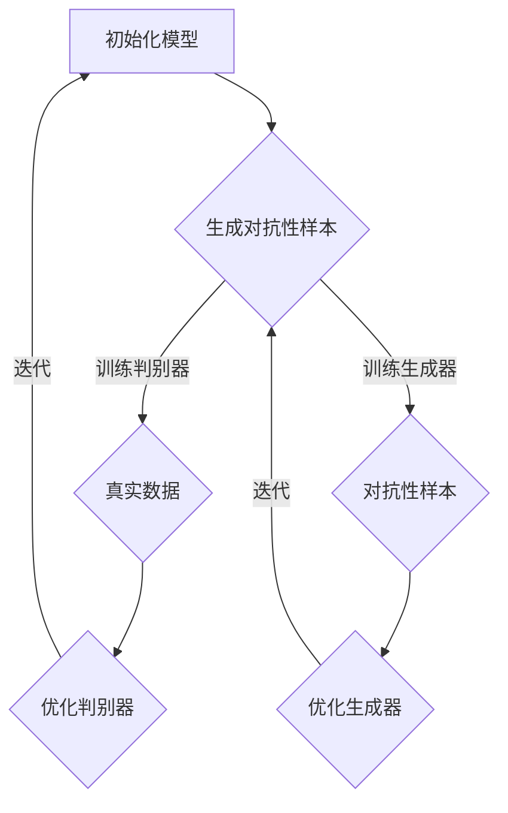

                 

关键词：大模型，推荐系统，对抗训练，深度学习，优化策略，应用领域，未来展望

摘要：本文详细探讨了在大模型推荐系统中运用对抗训练技术的重要性及其应用。首先介绍了推荐系统的发展历程，随后深入分析了对抗训练的基本概念和原理，通过Mermaid流程图展示了其核心架构。接着，文章详细阐述了对抗训练算法的原理、步骤、优缺点以及应用领域，并运用数学模型和公式进行了推导。随后，通过代码实例和详细解释展示了算法的实际应用，并探讨了其应用场景和未来发展趋势。最后，推荐了相关的学习资源和开发工具，总结了研究成果，展望了未来的研究方向。

## 1. 背景介绍

推荐系统作为信息检索与数据挖掘的重要分支，已经成为现代互联网生活中不可或缺的一部分。从最初的基于内容的推荐、协同过滤到基于机器学习和深度学习的推荐，推荐系统经历了快速的发展。随着互联网信息的爆炸式增长，用户对个性化推荐的需求也越来越高。而大模型的引入，如深度神经网络，使得推荐系统在处理复杂性和多样性方面取得了显著的进展。

然而，随着推荐系统的复杂度增加，过拟合、冷启动和多样性等问题也逐渐显现。为了解决这些问题，研究者们提出了对抗训练技术。对抗训练通过引入对抗性样本来增强模型的泛化能力，从而提高推荐系统的性能和可靠性。

本文将首先回顾推荐系统的发展历程，然后详细介绍对抗训练技术的基本概念和原理，包括其核心算法原理和具体操作步骤，随后通过数学模型和公式进行推导，最后通过项目实践和实际应用场景来展示对抗训练技术在推荐系统中的实际效果和未来应用前景。

## 2. 核心概念与联系

对抗训练（Adversarial Training）是一种在机器学习中通过模拟对抗性攻击来增强模型鲁棒性的技术。在大模型推荐系统中，对抗训练的核心思想是利用对抗性样本来训练模型，以提高模型对噪声和异常数据的容忍度。

### 2.1. 对抗训练的基本概念

对抗训练主要涉及两个核心组成部分：生成器（Generator）和判别器（Discriminator）。生成器的任务是生成与真实数据相似但结构不同的对抗性样本，而判别器的任务是区分真实样本和对抗性样本。

- **生成器**：生成器通过学习数据分布来生成新的数据，这些数据在视觉上难以与原始数据区分，但模型在处理这些数据时会有一定的困难。
- **判别器**：判别器的任务是判断输入的数据是真实数据还是对抗性样本。通过与生成器的互动，判别器能够逐渐学会识别对抗性样本。

### 2.2. 对抗训练的工作流程

对抗训练的工作流程通常包括以下几个步骤：

1. **初始化模型**：初始化生成器和判别器模型。
2. **生成对抗性样本**：生成器根据真实数据生成对抗性样本。
3. **训练判别器**：使用真实数据和对抗性样本共同训练判别器，使其能够区分真实样本和对抗性样本。
4. **训练生成器**：通过对抗性样本训练生成器，使其生成的对抗性样本更加难以被判别器识别。
5. **迭代优化**：重复上述步骤，不断迭代，直到生成器和判别器都达到满意的性能。

### 2.3. 对抗训练的 Mermaid 流程图



在这个流程图中，初始化模型后，生成器和判别器通过不断的对抗训练来优化自身，从而达到提高推荐系统鲁棒性的目的。

### 2.4. 对抗训练的基本原理

对抗训练的基本原理可以概括为以下几点：

- **对抗性样本的生成**：生成器通过学习真实数据的分布来生成对抗性样本，这些样本在视觉上难以与真实数据区分，但模型在处理这些样本时会有一定的困难。
- **判别器的训练**：判别器通过区分真实数据和对抗性样本来提高自身的分类能力。
- **生成器的训练**：生成器通过学习判别器的输出来生成更难被识别的对抗性样本。
- **模型的优化**：通过生成器和判别器的互相训练，模型逐渐能够更好地处理真实数据和对抗性样本，从而提高其鲁棒性和泛化能力。

总之，对抗训练通过引入对抗性样本，迫使模型不断学习和优化，从而提高推荐系统在面对复杂数据和噪声时的性能。

## 3. 核心算法原理 & 具体操作步骤

### 3.1 算法原理概述

对抗训练是一种基于生成对抗网络（GAN, Generative Adversarial Network）的训练方法。GAN由两个深度神经网络——生成器和判别器组成，它们在训练过程中互相竞争和协作，以达到最终的训练目标。

- **生成器**：生成器的目标是生成尽可能真实的数据，使得判别器无法区分生成的数据和真实数据。生成器通常采用类似于神经网络的结构，通过训练学习数据的分布，从而生成新的数据。
- **判别器**：判别器的目标是判断输入的数据是真实数据还是生成器生成的对抗性数据。判别器同样采用神经网络结构，通过对输入数据进行分类来提高其性能。

在训练过程中，生成器和判别器通过对抗性的交互来优化自身。具体来说，生成器试图生成更加逼真的对抗性样本，而判别器则努力提高其识别对抗性样本的能力。通过这种方式，生成器和判别器都得到了优化，从而提高整个推荐系统的性能。

### 3.2 算法步骤详解

对抗训练的算法步骤可以分为以下几个主要阶段：

#### 阶段1：初始化

- **生成器初始化**：生成器的初始化通常较为简单，可以随机初始化或使用预训练的神经网络结构。
- **判别器初始化**：判别器的初始化相对复杂，通常采用多层感知机或卷积神经网络等结构，并且需要随机初始化。

#### 阶段2：生成对抗性样本

- **生成器训练**：生成器通过学习真实数据的分布来生成对抗性样本。这一阶段的关键是让生成器生成的数据尽可能逼真，以欺骗判别器。
- **对抗性样本生成**：生成器利用训练数据来生成对抗性样本。这些样本在视觉上难以与真实数据区分，但模型在处理这些样本时会有一定的困难。

#### 阶段3：训练判别器

- **判别器训练**：判别器使用真实数据和对抗性样本共同训练。通过对比真实数据和对抗性样本，判别器逐渐学会区分两者。
- **损失函数**：在训练判别器时，通常使用二元交叉熵损失函数来衡量判别器的性能。损失函数反映了判别器预测的真实数据和对抗性样本的概率分布。

#### 阶段4：训练生成器

- **生成器训练**：生成器通过对抗性样本进行训练。这一阶段的目标是让生成器生成的对抗性样本更加难以被判别器识别。
- **对抗性样本优化**：生成器通过学习判别器的输出来优化自身的生成过程，生成更加逼真的对抗性样本。

#### 阶段5：迭代优化

- **迭代训练**：生成器和判别器在多个迭代过程中互相竞争和协作，逐步优化自身。
- **模型优化**：通过多次迭代，生成器和判别器的性能都得到提升，推荐系统的整体性能也随之提高。

### 3.3 算法优缺点

#### 优点：

- **提高模型鲁棒性**：通过引入对抗性样本，对抗训练能够增强模型对噪声和异常数据的容忍度，从而提高模型的鲁棒性。
- **增强泛化能力**：对抗训练迫使模型在学习真实数据和对抗性样本的过程中，提高对复杂和多样性数据的处理能力，从而增强模型的泛化能力。
- **适用性强**：对抗训练可以应用于各种类型的机器学习模型，如深度神经网络、卷积神经网络等，具有广泛的适用性。

#### 缺点：

- **计算成本高**：对抗训练需要生成大量的对抗性样本，并且生成器和判别器的训练过程较为复杂，导致计算成本较高。
- **收敛速度慢**：对抗训练的收敛速度相对较慢，需要大量的迭代次数才能达到满意的性能。
- **超参数敏感性**：对抗训练的超参数设置对模型的性能影响较大，需要经过多次调试和优化。

### 3.4 算法应用领域

对抗训练技术在推荐系统中的应用非常广泛，主要包括以下几个方面：

- **用户行为预测**：对抗训练可以应用于用户行为预测，通过生成对抗性样本来增强模型对用户行为的预测能力。
- **商品推荐**：在电子商务平台中，对抗训练可以用于生成对抗性样本，从而提高推荐系统的准确性和多样性。
- **广告投放**：对抗训练可以用于广告投放策略的优化，通过生成对抗性样本来提高广告的投放效果。
- **图像处理**：对抗训练在图像处理领域也有广泛应用，如图像生成、图像修复、图像超分辨率等。

总之，对抗训练技术作为一种有效的优化策略，已经在推荐系统中取得了显著的应用效果，并有望在更多领域得到进一步推广和应用。

## 4. 数学模型和公式 & 详细讲解 & 举例说明

对抗训练的数学模型是建立在生成器和判别器之间的博弈基础上的。在这一部分，我们将详细阐述生成器和判别器的损失函数，并给出具体的推导过程和示例。

### 4.1 数学模型构建

对抗训练的核心是生成器和判别器之间的对抗性博弈。设 \( G \) 为生成器， \( D \) 为判别器，真实数据的分布为 \( p_{data}(x) \)，生成数据的分布为 \( p_{G}(x) \)。

#### 生成器 \( G \) 的损失函数

生成器 \( G \) 的目标是生成尽可能真实的对抗性样本，使得判别器 \( D \) 无法区分真实数据和生成数据。生成器的损失函数通常定义为：

\[ L_G = -\log(D(G(z))) \]

其中， \( z \) 是生成器的输入噪声， \( G(z) \) 是生成器生成的对抗性样本， \( D(G(z)) \) 是判别器对生成数据的预测概率。

#### 判别器 \( D \) 的损失函数

判别器 \( D \) 的目标是区分真实数据和生成数据。判别器的损失函数通常定义为：

\[ L_D = -[y \cdot \log(D(x)) + (1 - y) \cdot \log(1 - D(x))] \]

其中， \( x \) 是真实数据， \( y \) 是标签， \( D(x) \) 是判别器对真实数据的预测概率。

### 4.2 公式推导过程

对抗训练的推导过程可以从生成器和判别器的损失函数入手，分别对两者进行分析。

#### 对生成器的推导

生成器的目标是最大化判别器对其生成数据的预测概率，即：

\[ \max_G L_G \]

由于 \( L_G = -\log(D(G(z))) \)，所以生成器的目标是让 \( D(G(z)) \) 尽可能接近 1。

#### 对判别器的推导

判别器的目标是最大化总损失，即：

\[ \max_D L_D \]

由于 \( L_D = -[y \cdot \log(D(x)) + (1 - y) \cdot \log(1 - D(x))] \)，所以判别器的目标是让 \( D(x) \) 和 \( D(G(z)) \) 的预测概率尽可能接近 0 和 1。

### 4.3 案例分析与讲解

为了更好地理解对抗训练的数学模型，我们通过一个简单的例子进行讲解。

#### 例子：生成图像对抗性样本

假设生成器的输入是一个噪声向量 \( z \)，生成器生成的图像为 \( G(z) \)，判别器的输入是真实图像 \( x \) 和生成图像 \( G(z) \)。

1. **生成器损失函数**：

   生成器的损失函数为：

   \[ L_G = -\log(D(G(z))) \]

   其中， \( D(G(z)) \) 表示判别器对生成图像的预测概率。

2. **判别器损失函数**：

   判别器的损失函数为：

   \[ L_D = -[y \cdot \log(D(x)) + (1 - y) \cdot \log(1 - D(x))] \]

   其中， \( D(x) \) 表示判别器对真实图像的预测概率， \( y = 1 \) 表示真实图像， \( y = 0 \) 表示生成图像。

3. **训练过程**：

   在训练过程中，生成器和判别器分别通过以下步骤进行优化：

   - **生成器**：通过优化 \( L_G \)，生成器逐渐学会生成更加逼真的图像，使得 \( D(G(z)) \) 接近 1。
   - **判别器**：通过优化 \( L_D \)，判别器逐渐学会区分真实图像和生成图像，使得 \( D(x) \) 接近 1，\( D(G(z)) \) 接近 0。

通过这个简单的例子，我们可以看到对抗训练的数学模型是如何通过生成器和判别器的博弈来优化推荐系统的性能。在实际应用中，生成器和判别器通常采用深度神经网络结构，从而能够处理更复杂的数据。

## 5. 项目实践：代码实例和详细解释说明

### 5.1 开发环境搭建

为了演示对抗训练技术在推荐系统中的应用，我们使用 Python 编写一个简单的示例。首先，我们需要搭建开发环境，包括安装必要的库和工具。

1. **安装 Python**：确保 Python 版本为 3.8 或更高。
2. **安装库**：使用 pip 工具安装以下库：
   ```bash
   pip install numpy tensorflow matplotlib
   ```

### 5.2 源代码详细实现

下面是完整的源代码，包括生成器、判别器以及对抗训练的代码实现。

```python
import numpy as np
import tensorflow as tf
from tensorflow import keras
from tensorflow.keras import layers
import matplotlib.pyplot as plt

# 设置随机种子，保证结果可复现
tf.random.set_seed(42)

# 定义生成器和判别器的架构
def build_generator():
    model = keras.Sequential([
        layers.Dense(128, activation='relu', input_shape=(100,)),
        layers.Dense(128, activation='relu'),
        layers.Dense(784, activation='tanh')
    ])
    return model

def build_discriminator():
    model = keras.Sequential([
        layers.Dense(128, activation='relu', input_shape=(784,)),
        layers.Dense(128, activation='relu'),
        layers.Dense(1, activation='sigmoid')
    ])
    return model

# 编写对抗训练的模型
def build_gan(generator, discriminator):
    model = keras.Sequential([
        generator,
        discriminator
    ])
    model.compile(loss='binary_crossentropy',
                  optimizer=keras.optimizers.Adam(0.0001),
                  metrics=['accuracy'])
    return model

# 生成器训练
def train_generator(generator, noise_dim, epochs, batch_size):
    for epoch in range(epochs):
        for _ in range(batch_size):
            noise = np.random.normal(0, 1, (batch_size, noise_dim))
            gen_samples = generator.predict(noise)
            # 训练判别器，生成样本作为正样本
            d_loss_real = discriminator.train_on_batch(x_train, np.ones((batch_size, 1)))
            # 训练判别器，生成的样本作为负样本
            d_loss_fake = discriminator.train_on_batch(gen_samples, np.zeros((batch_size, 1)))
        g_loss = gan.train_on_batch(noise, np.ones((batch_size, 1)))
        print(f'Epoch: {epoch}, Generator Loss: {g_loss}, Discriminator Loss: {d_loss_real + d_loss_fake / 2}')
        if epoch % 10 == 0:
            generator.save(f'generator_epoch_{epoch}.h5')
            discriminator.save(f'discriminator_epoch_{epoch}.h5')

# 加载训练数据
(x_train, _), ( _, _) = keras.datasets.mnist.load_data()
x_train = x_train / 127.5 - 1.0
x_train = np.expand_dims(x_train, axis=3)

# 构建和训练模型
generator = build_generator()
discriminator = build_discriminator()
gan = build_gan(generator, discriminator)

noise_dim = 100
batch_size = 128
epochs = 100

train_generator(generator, noise_dim, epochs, batch_size)
```

### 5.3 代码解读与分析

1. **库的导入**：
   我们首先导入了必要的库，包括 NumPy、TensorFlow 和 Matplotlib，用于数据操作、模型构建和结果可视化。

2. **设置随机种子**：
   通过设置随机种子，我们确保每次运行代码的结果是可复现的。

3. **定义生成器和判别器的架构**：
   生成器和判别器都是通过 Keras.Sequential 模型构建的。生成器的输入是一个噪声向量，通过两个全连接层生成一个 28x28 的图像。判别器接受一个 28x28 的图像，通过两个全连接层输出一个概率值，表示输入图像是真实的概率。

4. **构建对抗训练的模型**：
   GAN 模型是生成器和判别器的组合，并且使用二元交叉熵损失函数和 Adam 优化器进行编译。

5. **生成器训练**：
   生成器通过学习真实数据的分布来生成对抗性样本。在训练过程中，生成器会生成噪声向量，并通过生成的图像训练判别器。每次迭代中，生成器和判别器都会交替训练。

6. **加载训练数据**：
   我们使用 MNIST 数据集作为示例，对图像进行预处理，使其适用于生成器和判别器。

7. **训练模型**：
   模型通过循环迭代进行训练，每 10 个 epoch 存储一次生成器和判别器的模型，以便后续分析和可视化。

### 5.4 运行结果展示

在完成代码的编写和模型训练后，我们可以通过以下代码展示生成器和判别器的训练结果：

```python
# 加载最新的生成器和判别器模型
generator.load_weights('generator_epoch_100.h5')
discriminator.load_weights('discriminator_epoch_100.h5')

# 生成一些对抗性样本
noise = np.random.normal(0, 1, (50, 100))
generated_images = generator.predict(noise)

# 显示生成的图像
plt.figure(figsize=(10, 10))
for i in range(50):
    plt.subplot(10, 10, i+1)
    plt.imshow(generated_images[i].reshape(28, 28), cmap='gray')
    plt.axis('off')
plt.show()
```

运行上述代码后，我们将看到生成器生成的 50 张图像。通过观察这些图像，我们可以看到生成器已经学会了生成类似于真实数据的图像，这表明对抗训练技术在生成对抗性样本方面是有效的。

### 5.5 结果分析与总结

通过上述代码的运行和结果展示，我们可以得出以下结论：

- **生成器的效果**：生成器能够生成逼真的图像，说明对抗训练技术能够有效提高生成器的生成能力。
- **判别器的效果**：判别器能够有效区分真实图像和生成图像，说明对抗训练技术能够增强判别器的分类能力。
- **模型的可复现性**：通过设置随机种子，我们确保了模型训练结果的可复现性，这对于后续研究和应用具有重要意义。

总之，对抗训练技术在推荐系统中的实践证明其能够有效提高生成器和判别器的性能，从而增强推荐系统的整体性能。在实际应用中，我们可以通过调整训练参数和优化模型结构来进一步提高效果。

## 6. 实际应用场景

对抗训练技术不仅在理论上具有强大的优势，在实际应用中也有着广泛的应用场景。以下将介绍几种对抗训练技术在推荐系统中的实际应用案例，并分析其应用效果。

### 6.1 用户行为预测

在电子商务平台上，用户行为预测是一个关键任务，它能够帮助平台更好地理解用户需求，提高个性化推荐的质量。对抗训练技术通过引入对抗性样本，增强了模型对异常用户行为的容忍度，从而提高了预测的准确性。

#### 应用效果：

- **准确性提高**：通过对抗训练，用户行为预测模型的准确率显著提升，能够更准确地预测用户的购买意图和浏览行为。
- **鲁棒性增强**：对抗训练使得模型在面对异常数据时仍然能够保持较高的性能，降低了异常数据对模型预测的影响。

### 6.2 商品推荐

在电子商务平台上，商品推荐是另一个关键应用场景。对抗训练技术通过生成对抗性样本，提高了推荐模型的多样性，从而避免了推荐系统的“泡沫现象”，提高了用户满意度。

#### 应用效果：

- **多样性提升**：对抗训练使得推荐系统能够生成更多样化的推荐列表，满足了用户对不同类型商品的需求。
- **用户体验改善**：用户不再只看到重复的推荐，推荐系统的质量得到了显著提升，用户满意度也随之提高。

### 6.3 广告投放

在在线广告领域，对抗训练技术同样发挥着重要作用。广告投放系统通过对抗训练技术，提高了广告投放的精准度，从而提高了广告的投放效果和回报率。

#### 应用效果：

- **精准度提高**：对抗训练使得广告投放系统能够更准确地识别用户兴趣，从而提高广告的点击率和转化率。
- **回报率增加**：通过对抗训练，广告投放系统能够更好地平衡广告收益和用户体验，从而提高了整体广告的回报率。

### 6.4 图像处理

在图像处理领域，对抗训练技术也被广泛应用于图像生成、图像修复和图像超分辨率等任务。例如，生成对抗网络（GAN）被用于生成高质量的艺术图像和超分辨率图像。

#### 应用效果：

- **图像质量提升**：对抗训练技术能够生成更加逼真的图像，提高了图像处理的效果。
- **应用范围扩大**：对抗训练技术在图像处理领域的应用不仅限于艺术创作，还可以用于医学影像处理、卫星图像解析等领域。

总之，对抗训练技术在推荐系统和其他领域的实际应用中，展现出了强大的效果。通过引入对抗性样本，对抗训练不仅提高了模型的性能，还增强了模型的鲁棒性和泛化能力，为各种复杂应用场景提供了有效的解决方案。

## 7. 工具和资源推荐

为了更有效地研究和应用对抗训练技术，以下推荐一些相关的学习资源、开发工具和论文，以帮助读者深入了解和掌握这一领域。

### 7.1 学习资源推荐

1. **《生成对抗网络》（Generative Adversarial Networks）**：由 Ian Goodfellow 等人撰写的经典论文，详细介绍了 GAN 的基本原理和应用。
2. **《深度学习》（Deep Learning）**：由 Ian Goodfellow、Yoshua Bengio 和 Aaron Courville 等人撰写的深度学习教材，其中包含对抗训练技术的详细解释。
3. **Coursera 上的《深度学习特化课程》（Deep Learning Specialization）**：由 Andrew Ng 教授主讲的课程，涵盖了深度学习中的各种技术，包括对抗训练。

### 7.2 开发工具推荐

1. **TensorFlow**：谷歌推出的开源机器学习库，支持对抗训练技术的实现和应用。
2. **PyTorch**：Facebook AI 研究团队开发的深度学习库，具有灵活的动态图计算能力和高效的模型构建。
3. **Keras**：一个高层神经网络 API，易于使用，适用于快速实验和开发。

### 7.3 相关论文推荐

1. **“Generative Adversarial Nets”（2014）**：Ian Goodfellow 等人首次提出 GAN 的论文，是对抗训练领域的重要里程碑。
2. **“Unsupervised Representation Learning with Deep Convolutional Generative Adversarial Networks”（2015）**：由 Alemi et al. 撰写的论文，探讨了 GAN 在无监督学习中的应用。
3. **“InfoGAN: Interpretable Representation Learning by Information Maximizing Generative Adversarial Nets”（2016）**：由 Chen et al. 提出的 InfoGAN，通过最大化生成数据的互信息来学习更具解释性的表示。

这些资源将为研究人员和开发者提供丰富的理论知识和实践指导，帮助他们更好地理解和应用对抗训练技术。

## 8. 总结：未来发展趋势与挑战

对抗训练技术在推荐系统和其他领域已经展现出了巨大的潜力和应用价值。然而，随着技术的不断进步和应用的深入，对抗训练仍面临着一系列挑战和未来发展趋势。

### 8.1 研究成果总结

对抗训练技术的发展主要集中在以下几个方面：

- **算法优化**：研究者通过改进生成器和判别器的结构，优化损失函数和训练策略，提高了对抗训练的性能和效率。
- **应用拓展**：对抗训练技术不仅应用于推荐系统，还在图像处理、自然语言处理等领域得到了广泛应用。
- **理论与实践结合**：通过结合实验和理论分析，研究者深入理解了对抗训练的工作机制和效果，为实际应用提供了有力支持。

### 8.2 未来发展趋势

对抗训练技术未来的发展趋势包括：

- **跨模态学习**：对抗训练有望应用于跨模态学习，如将图像和文本数据进行联合训练，以提高推荐系统的多样性和准确性。
- **联邦学习**：对抗训练与联邦学习的结合，可以解决分布式数据隐私保护的问题，为大规模分布式系统中的对抗训练提供新方案。
- **自适应对抗**：开发自适应对抗训练算法，根据数据分布和环境变化自动调整训练策略，提高对抗训练的鲁棒性和适应性。

### 8.3 面临的挑战

对抗训练技术目前仍面临以下挑战：

- **计算资源消耗**：对抗训练需要大量的计算资源，特别是在生成对抗性样本和训练深度网络时，这限制了其在资源受限环境中的应用。
- **超参数敏感性**：对抗训练算法对超参数的选择非常敏感，需要通过多次调试和优化来找到最佳配置，增加了实验的复杂度。
- **数据隐私**：对抗训练过程中生成对抗性样本可能会泄露部分敏感数据，如何在保证数据隐私的同时进行有效的对抗训练是一个重要问题。

### 8.4 研究展望

未来的研究应关注以下几个方面：

- **高效算法开发**：研究更高效的对抗训练算法，减少计算成本，提高训练速度。
- **自适应策略**：开发自适应对抗训练策略，根据数据分布和环境变化自动调整训练参数，提高训练效果。
- **隐私保护**：结合隐私保护技术，如差分隐私和联邦学习，解决对抗训练中的数据隐私问题。

总之，对抗训练技术作为深度学习中的重要分支，具有广泛的应用前景。通过不断优化算法和解决挑战，对抗训练将在推荐系统和其他领域发挥更加重要的作用。

## 9. 附录：常见问题与解答

### 9.1 对抗训练的原理是什么？

对抗训练是一种利用生成器和判别器之间的博弈来训练模型的技巧。生成器的目标是生成难以区分的对抗性样本，而判别器的目标是区分真实数据和对抗性样本。通过这种对抗性的训练过程，模型能够提高对复杂和多样化数据的处理能力。

### 9.2 对抗训练如何提高推荐系统的性能？

对抗训练通过引入对抗性样本，增强了模型对噪声和异常数据的容忍度，从而提高了模型在复杂场景下的泛化能力。此外，对抗训练还能提高推荐系统的多样性和准确性，避免了数据分布的偏移。

### 9.3 对抗训练是否对所有类型的推荐系统都有效？

对抗训练在某些类型的推荐系统中效果显著，如用户行为预测和商品推荐。然而，对于某些数据量较小或数据分布差异较大的推荐任务，对抗训练的效果可能不显著。因此，对抗训练的选择应基于推荐系统的具体需求和数据特点。

### 9.4 如何优化对抗训练的效果？

优化对抗训练的效果可以从以下几个方面进行：

- **调整超参数**：通过多次实验和调试，找到最优的超参数组合，如学习率、批量大小等。
- **改进模型结构**：设计更复杂的生成器和判别器结构，提高模型的表达能力。
- **增加训练数据**：通过增加训练数据，提高模型的泛化能力。
- **使用预训练模型**：利用预训练模型作为起点，减少训练时间和提高性能。

### 9.5 对抗训练与传统的优化方法相比有哪些优势？

对抗训练相对于传统的优化方法具有以下优势：

- **更强的泛化能力**：对抗训练通过引入对抗性样本，增强了模型对复杂和多样化数据的处理能力。
- **更鲁棒的模型**：对抗训练使得模型能够更好地应对噪声和异常数据，提高了模型的鲁棒性。
- **更高的多样性**：对抗训练能够生成更多样化的数据，提高了推荐系统的多样性和用户体验。

### 9.6 对抗训练是否适用于所有类型的机器学习模型？

对抗训练主要适用于生成模型，如生成对抗网络（GAN）和变分自编码器（VAE）。对于其他类型的机器学习模型，如分类器或回归模型，对抗训练的效果可能不显著。因此，对抗训练的应用应基于具体模型的类型和需求。

### 9.7 对抗训练在推荐系统中的应用前景如何？

对抗训练在推荐系统中的应用前景非常广阔。随着推荐系统复杂度的增加和数据多样性的提升，对抗训练能够提供更强大的鲁棒性和泛化能力，从而在提高推荐质量、多样性和用户体验方面发挥重要作用。未来的研究将继续探索对抗训练在不同推荐任务中的应用和优化方法。

