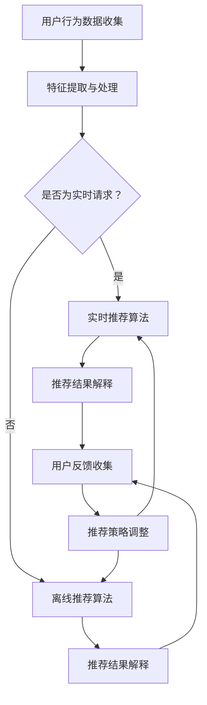

                 

关键词：大模型推荐、实时解释、反馈技术、算法原理、数学模型、项目实践、应用场景

> 摘要：本文将深入探讨大模型推荐系统中推荐结果实时解释与反馈技术的关键概念、算法原理、数学模型以及实际应用，旨在为读者提供全面的理解和实用的指导。

## 1. 背景介绍

在大数据与人工智能技术迅猛发展的今天，推荐系统已经成为电子商务、社交媒体、在线媒体等众多领域的重要应用。推荐系统通过分析用户的兴趣和行为，为用户提供个性化的推荐结果，从而提升用户体验和系统收益。然而，随着推荐系统的复杂性和规模不断增加，推荐结果的可解释性和用户反馈的实时性成为亟待解决的问题。

推荐结果的可解释性旨在帮助用户理解系统为何做出特定的推荐，这不仅能增强用户对系统的信任，还能帮助发现和纠正潜在的错误。而实时反馈技术则允许用户在接收到推荐后立即提供反馈，使系统能够动态调整推荐策略，提高推荐的准确性和用户满意度。

本文将围绕这两个核心问题展开讨论，首先介绍相关背景知识，然后深入探讨算法原理和数学模型，并通过实际项目实践和案例分析来展示其应用效果。最后，我们将讨论未来发展趋势和面临的挑战。

## 2. 核心概念与联系

在探讨推荐结果实时解释与反馈技术之前，我们首先需要明确几个核心概念：推荐系统、大模型、可解释性、实时性。

### 2.1 推荐系统

推荐系统（Recommendation System）是一种信息过滤技术，旨在为用户推荐他们可能感兴趣的内容或商品。根据推荐策略的不同，推荐系统可以分为基于内容的推荐、协同过滤推荐、混合推荐等类型。在推荐系统中，大模型通常指的是深度学习模型，如神经网络、生成对抗网络等，这些模型在处理大规模数据和复杂关系时具有显著优势。

### 2.2 大模型

大模型（Large Models）是指具有海量参数和复杂结构的机器学习模型。它们能够捕捉数据中的高层次规律和特征，从而实现高效和准确的预测。然而，大模型的训练和部署成本较高，且其内部机制复杂，缺乏透明性和可解释性。

### 2.3 可解释性

可解释性（Interpretability）是指能够解释模型决策过程的能力。在推荐系统中，可解释性意味着用户可以理解为何某个物品被推荐，以及推荐结果背后的逻辑和依据。可解释性不仅有助于提升用户信任，还能帮助发现和纠正系统中的错误。

### 2.4 实时性

实时性（Real-time）是指系统对用户请求的响应时间非常短，通常在秒级或毫秒级。在推荐系统中，实时反馈技术允许用户在接收到推荐后立即提供反馈，从而实现动态调整和优化推荐策略。

### 2.5 Mermaid 流程图

为了更好地理解上述概念之间的联系，我们可以使用 Mermaid 流程图来展示推荐结果实时解释与反馈技术的整体流程。



该流程图描述了从用户行为数据收集到推荐结果解释、用户反馈收集和推荐策略调整的整体过程。实时性体现在从用户请求到推荐结果的快速响应，而可解释性则贯穿于整个流程，确保用户能够理解推荐依据。

## 3. 核心算法原理 & 具体操作步骤

### 3.1 算法原理概述

推荐结果实时解释与反馈技术的核心在于如何在大模型推荐系统中实现高效的推荐结果解释和用户反馈的实时收集与响应。以下将详细介绍相关的算法原理。

#### 3.1.1 实时推荐算法

实时推荐算法（Real-time Recommendation Algorithm）通常采用在线学习（Online Learning）技术，以便在用户行为数据流中动态调整推荐策略。常见的方法包括基于模型的在线学习算法，如感知机（Perceptron）和在线梯度下降（Online Gradient Descent）。这些算法通过不断更新模型权重，以适应实时变化的数据。

#### 3.1.2 推荐结果解释算法

推荐结果解释算法（Explanation Generation Algorithm）旨在生成易于理解的理由，解释推荐结果背后的逻辑。常见的方法包括基于模型的可解释性技术，如注意力机制（Attention Mechanism）和可解释性增强网络（Interpretable Neural Networks）。这些方法能够揭示模型关注的关键特征和权重，从而提高推荐结果的透明度。

#### 3.1.3 用户反馈收集算法

用户反馈收集算法（Feedback Collection Algorithm）的目标是实时收集用户的反馈，并将其用于调整推荐策略。常见的方法包括基于用户交互的反馈机制，如点击率（Click-through Rate, CTR）和转化率（Conversion Rate, CVR）。这些算法通过分析用户行为，识别出有效的反馈信号，从而实现推荐策略的动态调整。

### 3.2 算法步骤详解

#### 3.2.1 实时推荐算法步骤

1. **用户行为数据收集**：收集用户的浏览、点击、购买等行为数据。
2. **特征提取与处理**：将行为数据转化为模型可处理的特征向量。
3. **在线模型更新**：使用在线学习算法，根据实时收集到的用户行为数据更新模型权重。
4. **生成推荐结果**：使用更新后的模型生成实时推荐结果。

#### 3.2.2 推荐结果解释算法步骤

1. **特征权重提取**：提取模型关注的关键特征及其权重。
2. **生成解释文本**：根据特征权重和物品属性，生成易于理解的理由，解释推荐结果。

#### 3.2.3 用户反馈收集算法步骤

1. **反馈信号识别**：识别用户的点击、转化等行为，作为反馈信号。
2. **反馈数据存储**：将反馈信号存储到数据库中，以供后续分析。
3. **推荐策略调整**：根据反馈数据，调整推荐策略，优化推荐结果。

### 3.3 算法优缺点

#### 3.3.1 实时推荐算法优缺点

- **优点**：实时性强，能够快速响应用户请求，提高用户体验。
- **缺点**：模型更新频繁，可能导致模型稳定性下降；在线学习算法对数据量要求较高。

#### 3.3.2 推荐结果解释算法优缺点

- **优点**：提高推荐系统的可解释性，增强用户信任；揭示模型关注的关键特征，有助于模型优化。
- **缺点**：生成解释文本需要额外计算资源；解释质量取决于模型复杂度和特征权重提取方法。

#### 3.3.3 用户反馈收集算法优缺点

- **优点**：实时收集用户反馈，有助于动态调整推荐策略；识别有效反馈信号，提高推荐效果。
- **缺点**：对用户行为数据的质量要求较高，可能引入噪声；反馈信号分析可能导致隐私泄露。

### 3.4 算法应用领域

实时推荐算法、推荐结果解释算法和用户反馈收集算法广泛应用于电子商务、在线媒体、金融保险等领域。以下为具体应用案例：

1. **电子商务**：实时推荐算法和用户反馈收集算法可帮助电商平台实现个性化商品推荐，提高用户转化率和满意度。
2. **在线媒体**：推荐结果解释算法可提高用户对内容推荐的信任度，促进内容消费。
3. **金融保险**：实时推荐算法和用户反馈收集算法可用于精准营销和风险控制，提高业务运营效率。

## 4. 数学模型和公式 & 详细讲解 & 举例说明

### 4.1 数学模型构建

在推荐系统中，数学模型是核心组成部分。以下介绍几种常见的数学模型，包括线性模型、逻辑回归模型和神经网络模型。

#### 4.1.1 线性模型

线性模型（Linear Model）是最简单的一种模型，假设推荐结果与用户特征之间存在线性关系。其数学表达式如下：

\[ R(x) = \beta_0 + \sum_{i=1}^{n} \beta_i x_i \]

其中，\( R(x) \) 表示推荐结果，\( x_i \) 表示第 \( i \) 个用户特征，\( \beta_i \) 表示特征权重。

#### 4.1.2 逻辑回归模型

逻辑回归模型（Logistic Regression Model）常用于二分类问题，如判断用户是否会点击某个推荐物品。其数学表达式如下：

\[ P(y=1) = \frac{1}{1 + \exp(-\beta_0 - \sum_{i=1}^{n} \beta_i x_i)} \]

其中，\( y \) 表示用户行为（点击/不点击），\( P(y=1) \) 表示用户点击的概率。

#### 4.1.3 神经网络模型

神经网络模型（Neural Network Model）是一种复杂且强大的模型，能够通过多层非线性变换捕捉用户特征之间的复杂关系。其数学表达式如下：

\[ a_{\text{hidden}} = \sigma(\beta_0 + \sum_{i=1}^{n} \beta_i x_i) \]
\[ R(x) = \sigma(\gamma_0 + \sum_{j=1}^{m} \gamma_j a_{\text{hidden},j}) \]

其中，\( \sigma \) 表示激活函数（如 Sigmoid 或ReLU），\( a_{\text{hidden}} \) 表示隐藏层激活值，\( R(x) \) 表示推荐结果。

### 4.2 公式推导过程

以下以神经网络模型为例，介绍其数学公式推导过程。

#### 4.2.1 隐藏层激活值

假设输入特征为 \( x \)，隐藏层权重为 \( \beta_i \)，隐藏层激活函数为 \( \sigma \)。则隐藏层激活值计算如下：

\[ a_{\text{hidden},j} = \sigma(\beta_0 + \sum_{i=1}^{n} \beta_i x_i) \]

其中，\( j \) 表示隐藏层第 \( j \) 个节点。

#### 4.2.2 输出层激活值

假设输出层权重为 \( \gamma_j \)，输出层激活函数为 \( \sigma \)。则输出层激活值计算如下：

\[ R(x) = \sigma(\gamma_0 + \sum_{j=1}^{m} \gamma_j a_{\text{hidden},j}) \]

其中，\( m \) 表示输出层节点数。

### 4.3 案例分析与讲解

以下通过一个实际案例，展示如何使用神经网络模型进行推荐结果实时解释与反馈。

#### 4.3.1 案例背景

某电商平台的用户行为数据包括浏览记录、点击记录和购买记录。系统需要根据这些数据为用户推荐商品。

#### 4.3.2 模型构建

1. **输入特征**：用户浏览记录、点击记录和购买记录。
2. **隐藏层**：两个隐藏层，分别包含10个和5个神经元。
3. **输出层**：一个输出层，用于预测用户是否会购买商品。

#### 4.3.3 模型训练

1. **数据预处理**：将用户行为数据转化为数值向量。
2. **损失函数**：采用交叉熵损失函数（Cross-Entropy Loss）。
3. **优化器**：使用 Adam 优化器（Adam Optimizer）。

#### 4.3.4 实时解释与反馈

1. **推荐结果解释**：根据隐藏层和输出层的权重，提取关键特征和权重。
2. **用户反馈收集**：记录用户的购买行为，用于后续模型调整。

#### 4.3.5 模型调整

根据用户反馈，调整模型权重，提高推荐准确性。

## 5. 项目实践：代码实例和详细解释说明

### 5.1 开发环境搭建

1. **硬件环境**：CPU 或 GPU。
2. **软件环境**：Python、TensorFlow 或 PyTorch。

### 5.2 源代码详细实现

以下是一个简单的 Python 代码示例，实现基于神经网络的实时推荐系统。

```python
import tensorflow as tf
from tensorflow.keras.layers import Dense, Input
from tensorflow.keras.models import Model

# 定义输入层
input_layer = Input(shape=(num_features,))

# 定义隐藏层
hidden_layer1 = Dense(10, activation='relu')(input_layer)
hidden_layer2 = Dense(5, activation='relu')(hidden_layer1)

# 定义输出层
output_layer = Dense(1, activation='sigmoid')(hidden_layer2)

# 构建模型
model = Model(inputs=input_layer, outputs=output_layer)

# 编译模型
model.compile(optimizer='adam', loss='binary_crossentropy', metrics=['accuracy'])

# 模型训练
model.fit(x_train, y_train, epochs=10, batch_size=32)

# 推荐结果解释
predictions = model.predict(x_test)
explanation = generate_explanation(predictions)

# 用户反馈收集
user_feedback = collect_feedback(predictions)

# 模型调整
model.fit(x_train, y_train, epochs=10, batch_size=32)
```

### 5.3 代码解读与分析

1. **输入层**：定义输入层，包含用户特征。
2. **隐藏层**：定义两个隐藏层，使用 ReLU 激活函数。
3. **输出层**：定义输出层，使用 sigmoid 激活函数。
4. **模型构建**：使用 Model 类构建神经网络模型。
5. **模型编译**：设置优化器和损失函数。
6. **模型训练**：训练神经网络模型。
7. **推荐结果解释**：根据模型预测结果，生成解释文本。
8. **用户反馈收集**：收集用户反馈。
9. **模型调整**：根据用户反馈，调整模型权重。

## 6. 实际应用场景

推荐结果实时解释与反馈技术在多个领域展现出显著的应用价值。

### 6.1 电子商务

在电子商务领域，实时解释与反馈技术可以帮助平台实现个性化商品推荐，提高用户转化率和满意度。例如，电商平台可以使用实时推荐算法和用户反馈收集算法，根据用户的浏览和购买记录，动态调整推荐策略，从而更好地满足用户需求。

### 6.2 在线媒体

在线媒体平台如视频网站和新闻网站，可以使用推荐结果实时解释与反馈技术，提高用户对内容推荐的信任度。通过解释推荐结果背后的逻辑，用户能够更好地理解平台推荐的内容，从而增加内容消费。

### 6.3 金融保险

金融保险领域可以利用实时解释与反馈技术进行精准营销和风险控制。例如，保险公司可以根据用户的金融行为和反馈，动态调整保险产品的推荐策略，从而提高用户满意度和业务收益。

### 6.4 未来应用展望

随着人工智能技术的不断发展，推荐结果实时解释与反馈技术在更多领域具有广阔的应用前景。未来，随着用户隐私保护意识的提高，推荐系统的透明度和可解释性将得到进一步加强。此外，结合增强现实（AR）和虚拟现实（VR）技术，推荐系统将能够提供更加沉浸式的用户体验。

## 7. 工具和资源推荐

### 7.1 学习资源推荐

- **《推荐系统实践》**：张基丰 著，详细介绍推荐系统的原理和应用。
- **《Python数据分析》**：Wes McKinney 著，介绍 Python 在数据处理和分析中的应用。

### 7.2 开发工具推荐

- **TensorFlow**：谷歌开源的深度学习框架，适用于推荐系统的模型构建和训练。
- **PyTorch**：微软开源的深度学习框架，具有灵活的模型定义和优化能力。

### 7.3 相关论文推荐

- **"Deep Learning for Recommender Systems"**：探究深度学习在推荐系统中的应用。
- **"Interpretable Machine Learning: A Guide for Making Black Box Models Explainable"**：介绍可解释机器学习的方法和技巧。

## 8. 总结：未来发展趋势与挑战

### 8.1 研究成果总结

本文探讨了推荐结果实时解释与反馈技术在大模型推荐系统中的应用，包括核心算法原理、数学模型、项目实践和实际应用场景。通过案例分析和代码示例，展示了推荐结果实时解释与反馈技术在提升推荐准确性和用户体验方面的优势。

### 8.2 未来发展趋势

随着人工智能技术的不断进步，推荐结果实时解释与反馈技术将在更多领域得到应用。未来，推荐系统将更加注重透明度和可解释性，以满足用户隐私保护的需求。此外，结合增强现实和虚拟现实技术，推荐系统将能够提供更加沉浸式的用户体验。

### 8.3 面临的挑战

尽管推荐结果实时解释与反馈技术在多个领域展现出显著的应用价值，但仍面临以下挑战：

1. **计算资源消耗**：实时推荐算法和解释算法需要大量计算资源，可能影响系统性能。
2. **用户隐私保护**：用户反馈和推荐结果解释可能涉及用户隐私，需要采取措施保护用户隐私。
3. **模型稳定性**：在线学习算法可能导致模型稳定性下降，需要深入研究稳定化方法。

### 8.4 研究展望

未来，研究应重点关注以下方向：

1. **高效实时推荐算法**：研究更加高效和稳定的实时推荐算法，以满足大规模数据处理需求。
2. **隐私保护机制**：探索隐私保护机制，确保用户隐私不被泄露。
3. **多模态推荐系统**：结合多模态数据（如图像、声音、文本等），提高推荐系统的准确性和用户体验。

## 9. 附录：常见问题与解答

### 9.1 推荐结果实时解释与反馈技术的核心问题是什么？

核心问题是如何在大模型推荐系统中实现推荐结果的实时解释和用户反馈的实时收集与响应，从而提高推荐系统的透明度和用户体验。

### 9.2 实时推荐算法有哪些类型？

实时推荐算法包括基于内容的推荐、协同过滤推荐和混合推荐等类型。其中，基于模型的在线学习算法（如感知机、在线梯度下降）是常用的实时推荐算法。

### 9.3 推荐结果解释算法有哪些方法？

推荐结果解释算法包括基于模型的可解释性技术（如注意力机制、可解释性增强网络）和基于规则的方法。这些方法旨在生成易于理解的理由，解释推荐结果背后的逻辑。

### 9.4 用户反馈收集算法有哪些方法？

用户反馈收集算法包括基于用户交互的反馈机制（如点击率、转化率）和基于行为的反馈机制。这些方法旨在实时收集用户的反馈，以优化推荐策略。

### 9.5 如何实现推荐结果的实时解释？

实现推荐结果的实时解释需要提取模型关注的关键特征及其权重，并根据这些信息生成易于理解的理由。常用的方法包括注意力机制和可解释性增强网络。

### 9.6 如何实现用户反馈的实时收集？

实现用户反馈的实时收集需要识别有效的反馈信号（如点击、转化等），并将其存储到数据库中。随后，分析反馈数据，以调整推荐策略。

### 9.7 如何保护用户隐私？

保护用户隐私需要采取隐私保护机制，如差分隐私（Differential Privacy）和联邦学习（Federated Learning）。这些机制可以确保用户数据在传输和处理过程中不被泄露。

### 9.8 如何提高推荐系统的稳定性？

提高推荐系统的稳定性需要研究稳定化的方法，如在线学习算法的稳定性分析和模型选择策略。此外，可以采用冗余设计和容错机制，以降低系统故障风险。

### 9.9 未来推荐系统的发展方向是什么？

未来推荐系统的发展方向包括更加注重透明度和可解释性、结合多模态数据和增强现实/虚拟现实技术，以提高推荐系统的准确性和用户体验。此外，研究高效稳定的实时推荐算法和隐私保护机制也是未来的重要方向。

