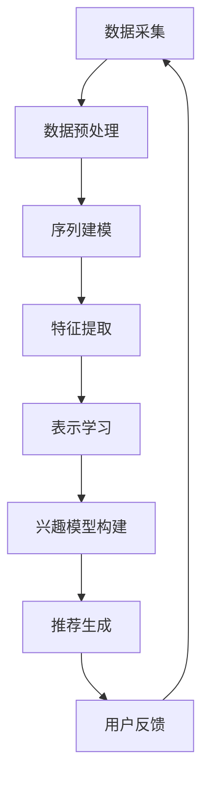

                 

摘要：本文旨在探讨大模型推荐系统中用户行为序列表示学习的新方法与应用。首先，我们介绍了大模型推荐系统的背景和现状，随后深入分析了用户行为序列表示学习的核心概念和原理。本文将详细阐述一种新型算法原理，包括算法的构建过程、操作步骤以及优缺点分析。通过数学模型和公式的推导，我们提供了详细的案例分析与讲解。随后，我们展示了项目实践中的代码实例，并对其进行了详细解读与分析。文章还探讨了实际应用场景，并展望了未来的发展趋势与挑战。最后，我们推荐了一些学习和开发资源，总结了研究成果，并对未来进行了展望。

## 1. 背景介绍

在大数据时代，推荐系统已成为互联网服务的关键组成部分。从电商平台到社交媒体，推荐系统能够根据用户的历史行为和兴趣为其提供个性化的推荐。然而，随着数据规模的不断扩大和用户行为复杂性增加，传统的推荐方法面临诸多挑战，如如何高效地处理大量数据、如何捕捉用户行为的时序特征等。

用户行为序列表示学习（User Behavior Sequence Representation Learning）作为一种新兴方法，致力于解决上述问题。该方法通过对用户行为序列进行建模和表示，使得推荐系统能够更好地理解和预测用户的行为。这一领域的研究对于提升推荐系统的准确性和用户体验具有重要意义。

本文将聚焦于用户行为序列表示学习的新方法，介绍其核心算法原理和具体应用步骤，并通过数学模型和公式进行详细解释。此外，我们还将通过项目实践展示代码实例，探讨其实际应用场景，并对未来发展趋势与挑战进行展望。

## 2. 核心概念与联系

### 2.1 用户行为序列

用户行为序列是指用户在特定场景下产生的行为记录的有序集合。这些行为可以是浏览网页、点击广告、购买商品、评价服务等多种形式。用户行为序列能够反映用户的兴趣和需求变化，是推荐系统个性化推荐的重要依据。

### 2.2 序列表示学习

序列表示学习（Sequence Representation Learning）是一种将序列数据转换为固定长度向量表示的方法。通过序列表示学习，原始的序列数据可以被转化为能够在高维空间中表示其特征和关系的向量。这一过程有助于提升模型处理序列数据的能力，是用户行为序列表示学习的基础。

### 2.3 表示学习在推荐系统中的应用

在推荐系统中，用户行为序列表示学习的关键应用在于构建用户兴趣模型。通过学习用户的行为序列，推荐系统能够捕捉用户的兴趣点，从而为用户提供更精准的推荐。此外，序列表示学习还可以用于交互式推荐、上下文感知推荐等领域，提升推荐系统的整体性能。

### 2.4 Mermaid 流程图

下面是用户行为序列表示学习的基本流程图：

在这个流程图中，数据采集通过收集用户行为数据，为后续处理提供原始数据。数据预处理则对数据进行清洗和归一化，以去除噪声和异常值。序列建模通过构建用户行为序列的数学模型，为特征提取提供基础。特征提取将序列数据转换为固定长度向量，表示学习通过机器学习算法进行特征提取，构建用户兴趣模型。最后，推荐生成根据用户兴趣模型生成个性化推荐，用户反馈则用于优化推荐系统。

## 3. 核心算法原理 & 具体操作步骤

### 3.1 算法原理概述

本文提出的新方法基于深度学习框架，通过递归神经网络（RNN）对用户行为序列进行建模和表示。具体来说，我们采用长短期记忆网络（LSTM）作为基础模型，LSTM 能够有效地捕捉用户行为序列中的长期依赖关系，避免传统 RNN 的梯度消失问题。此外，我们还引入了注意力机制（Attention Mechanism），通过注意力机制强化对用户行为序列中关键事件的关注，进一步提升表示效果。

### 3.2 算法步骤详解

#### 3.2.1 数据预处理

数据预处理是用户行为序列表示学习的重要环节，主要包括以下步骤：

1. **数据清洗**：去除重复数据、缺失值填充、异常值检测和修正。
2. **时间窗口划分**：将用户行为序列划分为固定长度的时间窗口，每个时间窗口包含一段时间内的用户行为记录。
3. **行为编码**：将用户行为编码为向量，可以使用独热编码（One-Hot Encoding）或嵌入编码（Embedding）等方法。

#### 3.2.2 序列建模

序列建模通过构建 LST

