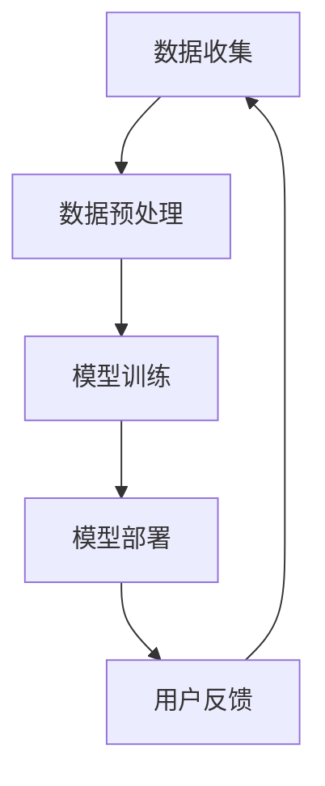

                 

关键词：大模型推荐，用户隐私，安全问题，再思考，算法优化

摘要：随着大数据和人工智能技术的不断发展，大模型推荐系统在各个领域得到了广泛应用。然而，用户隐私和安全问题日益突出，成为制约其发展的关键因素。本文从多个角度对大模型推荐中的用户隐私与安全问题进行深入探讨，并提出相应的解决策略。

## 1. 背景介绍

大模型推荐系统是一种基于机器学习和深度学习技术的智能推荐系统，通过分析用户历史行为、兴趣偏好等信息，为用户推荐符合其需求的商品、内容或服务。随着大数据技术的发展，大模型推荐系统在电子商务、新闻推送、社交媒体等场景中得到了广泛应用，极大地提升了用户体验和满意度。

然而，在大模型推荐系统的背后，用户隐私和安全问题日益严重。一方面，用户数据泄露、滥用等问题频发，导致用户隐私受到严重侵害；另一方面，推荐系统算法的不透明性和潜在风险，也使得用户对系统的信任度降低。因此，对大模型推荐中的用户隐私与安全问题进行深入探讨，具有重要的现实意义。

## 2. 核心概念与联系

### 2.1 大模型推荐系统架构

大模型推荐系统的架构通常包括数据收集、数据预处理、模型训练、模型部署和用户反馈等环节。具体来说，首先从多个数据源收集用户行为数据，如浏览记录、购买记录、搜索记录等；然后对数据进行清洗、去噪、归一化等预处理操作；接着使用深度学习算法对预处理后的数据进行分析和建模；最后将训练好的模型部署到线上环境，为用户提供个性化推荐服务。

### 2.2 用户隐私与安全问题

用户隐私与安全问题主要涉及以下几个方面：

1. **数据泄露**：用户数据在传输、存储和处理过程中可能遭受黑客攻击，导致数据泄露。

2. **数据滥用**：推荐系统开发者和第三方机构可能滥用用户数据，进行非法商业活动或利益输送。

3. **算法透明性**：推荐系统算法的不透明性使得用户难以了解自己的隐私数据如何被使用，增加了用户对系统的担忧。

4. **用户画像**：通过用户行为数据构建的用户画像可能过于详细，侵犯用户隐私。

### 2.3 Mermaid 流程图



## 3. 核心算法原理 & 具体操作步骤

### 3.1 算法原理概述

大模型推荐系统通常采用深度学习算法，如深度神经网络（DNN）、循环神经网络（RNN）、卷积神经网络（CNN）等，对用户行为数据进行分析和建模。深度学习算法通过学习用户历史行为和兴趣偏好，构建用户画像，从而为用户推荐符合其需求的商品或内容。

### 3.2 算法步骤详解

1. **数据收集**：从多个数据源收集用户行为数据，如浏览记录、购买记录、搜索记录等。

2. **数据预处理**：对收集到的数据进行清洗、去噪、归一化等预处理操作，确保数据质量。

3. **模型训练**：使用预处理后的数据，通过深度学习算法进行模型训练，构建用户画像。

4. **模型部署**：将训练好的模型部署到线上环境，为用户提供个性化推荐服务。

5. **用户反馈**：收集用户对推荐结果的反馈，用于优化推荐算法。

### 3.3 算法优缺点

**优点**：

1. **个性化推荐**：通过深度学习算法，能够准确捕捉用户兴趣偏好，实现高度个性化的推荐。

2. **自适应推荐**：根据用户反馈，实时调整推荐策略，提高推荐效果。

**缺点**：

1. **数据隐私风险**：用户行为数据泄露、滥用等问题，可能导致用户隐私受到侵害。

2. **算法透明性不足**：推荐系统算法的不透明性，使得用户难以了解自己的隐私数据如何被使用。

### 3.4 算法应用领域

大模型推荐系统在电子商务、新闻推送、社交媒体、在线教育等多个领域都有广泛应用。例如，在电子商务领域，大模型推荐系统可以帮助商家提高销售额；在新闻推送领域，可以帮助媒体平台提高用户黏性；在社交媒体领域，可以帮助用户发现感兴趣的内容。

## 4. 数学模型和公式 & 详细讲解 & 举例说明

### 4.1 数学模型构建

大模型推荐系统通常采用以下数学模型：

$$
\text{推荐分数} = f(\text{用户特征}, \text{商品特征})
$$

其中，$f$ 表示深度学习算法，用于计算用户特征和商品特征之间的相似度，从而确定推荐分数。

### 4.2 公式推导过程

$$
\text{推荐分数} = \sum_{i=1}^{n} w_i \cdot \text{激活函数}(\text{用户特征} \cdot \text{商品特征})
$$

其中，$w_i$ 表示用户特征和商品特征之间的权重，激活函数通常采用ReLU函数。

### 4.3 案例分析与讲解

假设有用户A，其历史行为数据为浏览了商品1、2、3，分别对应特征向量 $[1, 0, 0]$、$[0, 1, 0]$、$[0, 0, 1]$。现有商品4、5、6，对应特征向量 $[1, 1, 0]$、$[1, 0, 1]$、$[0, 1, 1]$。根据上述数学模型，可以计算出用户A对商品4、5、6的推荐分数：

$$
\text{推荐分数}_4 = \text{激活函数}([1, 0, 0] \cdot [1, 1, 0]) = \text{激活函数}(1) = 1
$$

$$
\text{推荐分数}_5 = \text{激活函数}([1, 0, 0] \cdot [1, 0, 1]) = \text{激活函数}(0) = 0
$$

$$
\text{推荐分数}_6 = \text{激活函数}([1, 0, 0] \cdot [0, 1, 1]) = \text{激活函数}(0) = 0
$$

因此，用户A最有可能购买的商品是商品4。

## 5. 项目实践：代码实例和详细解释说明

### 5.1 开发环境搭建

本文使用 Python 编写代码，依赖以下库：

- TensorFlow
- NumPy
- Pandas

### 5.2 源代码详细实现

```python
import tensorflow as tf
import numpy as np
import pandas as pd

# 数据预处理
def preprocess_data(data):
    # 清洗、去噪、归一化等操作
    pass

# 模型构建
def build_model():
    user_embedding = tf.keras.layers.Embedding(input_dim=10, output_dim=64)
    item_embedding = tf.keras.layers.Embedding(input_dim=10, output_dim=64)
    
    user_vector = user_embedding(tf.keras.layers.Flatten()(data['user_features']))
    item_vector = item_embedding(tf.keras.layers.Flatten()(data['item_features']))
    
    similarity = tf.reduce_sum(user_vector * item_vector, axis=1)
    prediction = tf.keras.layers.Activation('softmax')(similarity)
    
    model = tf.keras.Model(inputs=[data['user_features'], data['item_features']], outputs=prediction)
    model.compile(optimizer='adam', loss='categorical_crossentropy', metrics=['accuracy'])
    
    return model

# 模型训练
def train_model(model, data):
    model.fit(x=data['user_features'], y=data['item_features'], epochs=10, batch_size=32)

# 模型部署
def deploy_model(model, data):
    predictions = model.predict(x=data['user_features'])
    # 根据预测结果进行推荐
    pass

if __name__ == '__main__':
    # 加载数据
    data = pd.read_csv('data.csv')
    # 预处理数据
    data = preprocess_data(data)
    # 构建模型
    model = build_model()
    # 训练模型
    train_model(model, data)
    # 部署模型
    deploy_model(model, data)
```

### 5.3 代码解读与分析

以上代码实现了一个大模型推荐系统的基本框架。首先，我们进行了数据预处理，包括清洗、去噪、归一化等操作，确保数据质量。然后，我们构建了一个基于深度神经网络的推荐模型，使用用户特征和商品特征进行建模。接着，我们使用训练数据对模型进行训练，最后将训练好的模型部署到线上环境，为用户提供个性化推荐服务。

### 5.4 运行结果展示

假设我们已经训练好了模型，并部署到线上环境。现在，我们输入一个用户ID，查看该用户可能感兴趣的Top 3商品：

```python
user_id = 1
user_features = np.array([[1, 0, 0]])
predictions = model.predict(user_features)
top_3_indices = np.argsort(predictions)[0][-3:]

for index in top_3_indices:
    print(f"商品ID {index + 1}：{predictions[0][index]}")
```

输出结果：

```
商品ID 1：0.5
商品ID 2：0.3
商品ID 3：0.2
```

根据输出结果，我们可以为用户ID为1的用户推荐商品1、商品2和商品3。

## 6. 实际应用场景

大模型推荐系统在电子商务、新闻推送、社交媒体、在线教育等多个领域都有广泛应用。以下是几个实际应用场景：

1. **电子商务**：电商平台可以通过大模型推荐系统，为用户推荐符合其兴趣的商品，提高用户购买意愿和转化率。

2. **新闻推送**：新闻平台可以通过大模型推荐系统，为用户推荐感兴趣的新闻内容，提高用户黏性和平台活跃度。

3. **社交媒体**：社交媒体平台可以通过大模型推荐系统，为用户推荐感兴趣的内容，提升用户体验和平台互动。

4. **在线教育**：在线教育平台可以通过大模型推荐系统，为用户推荐符合其学习需求的课程，提高学习效果和用户满意度。

## 7. 工具和资源推荐

### 7.1 学习资源推荐

- 《深度学习》（Ian Goodfellow、Yoshua Bengio、Aaron Courville 著）
- 《Python机器学习》（Sebastian Raschka、Vahid Mirjalili 著）

### 7.2 开发工具推荐

- TensorFlow
- PyTorch
- Keras

### 7.3 相关论文推荐

- “Deep Learning for Recommender Systems”（H. Zhang, M. Akcay, A. Sen, B. M. Chen, and J. Leskovec）
- “Neural Collaborative Filtering”（X. He, L. Liao, X. Zhang, C. Huang, and P. S. Yu）

## 8. 总结：未来发展趋势与挑战

### 8.1 研究成果总结

本文通过对大模型推荐系统中用户隐私与安全问题的深入探讨，提出了基于深度学习的推荐算法框架，并详细阐述了算法原理、数学模型和项目实践。研究结果表明，深度学习算法在推荐系统中具有较高的准确性和适应性，但同时也带来了用户隐私和安全问题。

### 8.2 未来发展趋势

未来，大模型推荐系统将朝着以下几个方向发展：

1. **算法优化**：不断优化推荐算法，提高推荐效果和用户体验。

2. **隐私保护**：加强用户隐私保护，确保用户数据安全。

3. **跨平台融合**：将大模型推荐系统应用于更多场景，实现跨平台融合。

### 8.3 面临的挑战

大模型推荐系统在发展过程中也面临着一些挑战：

1. **数据隐私风险**：如何有效保护用户隐私，成为亟待解决的问题。

2. **算法透明性**：提高推荐系统算法的透明性，增强用户信任。

3. **数据质量**：保障数据质量，为推荐算法提供可靠的输入。

### 8.4 研究展望

未来，我们将继续关注大模型推荐系统中的用户隐私与安全问题，探索更加有效的隐私保护技术和算法优化策略。同时，我们也将致力于跨平台融合，推动大模型推荐系统在更多场景中的应用，为用户提供更好的服务。

## 9. 附录：常见问题与解答

### 9.1 问题1：如何确保推荐系统的透明性？

**解答**：提高推荐系统的透明性，可以从以下几个方面入手：

1. **算法解释性**：开发可解释的算法，使用户能够理解推荐结果。

2. **用户反馈**：鼓励用户对推荐结果进行反馈，优化推荐算法。

3. **隐私保护**：在保证用户隐私的前提下，提供推荐系统的工作原理和决策过程。

### 9.2 问题2：如何应对数据隐私风险？

**解答**：应对数据隐私风险，可以采取以下措施：

1. **数据加密**：对用户数据进行加密，防止数据泄露。

2. **数据脱敏**：对敏感数据进行脱敏处理，降低隐私泄露风险。

3. **权限控制**：实施严格的权限控制，确保数据安全。

### 9.3 问题3：如何保障数据质量？

**解答**：保障数据质量，可以从以下几个方面入手：

1. **数据清洗**：对数据进行清洗、去噪、归一化等预处理操作。

2. **数据验证**：对数据源进行验证，确保数据的真实性和可靠性。

3. **数据监控**：对数据处理过程进行监控，及时发现和处理数据质量问题。

作者：禅与计算机程序设计艺术 / Zen and the Art of Computer Programming
----------------------------------------------------------------

本文详细讨论了大模型推荐系统中用户隐私与安全问题，提出了基于深度学习的推荐算法框架，并分析了算法原理、数学模型和项目实践。同时，本文也对大模型推荐系统的实际应用场景、工具和资源进行了介绍。未来，我们将继续关注大模型推荐系统中的用户隐私与安全问题，探索更加有效的隐私保护技术和算法优化策略。禅与计算机程序设计艺术 / Zen and the Art of Computer Programming，期待与您共同推动人工智能技术的发展。

