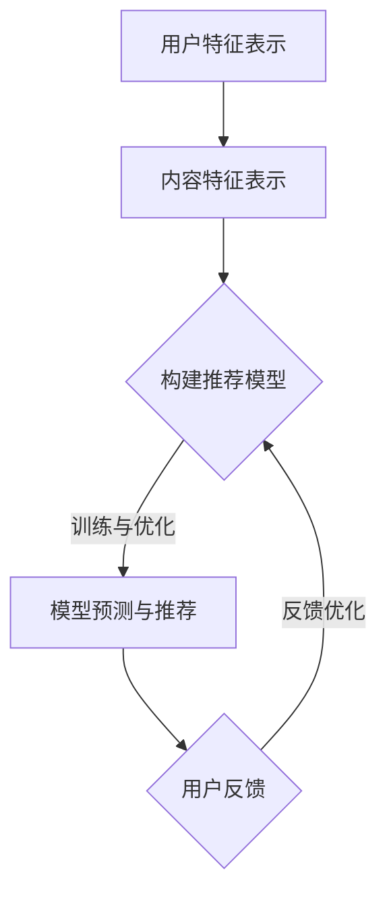

                 

关键字：大模型推荐系统、终身学习、策略、算法原理、数学模型、项目实践、实际应用、未来展望

## 摘要

本文将探讨大模型推荐系统的终身学习策略。随着数据量和计算能力的不断提升，大模型在推荐系统中的应用变得越来越广泛。然而，传统的推荐算法在面对动态数据时往往表现不佳，无法适应不断变化的市场需求。本文将介绍终身学习策略在大模型推荐系统中的应用，通过数学模型和算法原理的分析，为推荐系统的优化提供理论支持。此外，本文还将结合具体项目实践，展示终身学习策略在实际应用中的效果，并探讨其未来发展的趋势与挑战。

## 1. 背景介绍

推荐系统作为现代信息检索领域的重要分支，广泛应用于电子商务、社交媒体、在线视频、新闻推荐等多个领域。传统的推荐算法主要基于协同过滤、基于内容的方法等，但在面对大量动态数据时，其性能和效果往往无法满足需求。

随着大数据和深度学习技术的不断发展，大模型在推荐系统中的应用逐渐成为一种新的趋势。大模型推荐系统通过整合用户行为、内容特征、社会关系等多种信息，实现了对用户兴趣和需求的精准预测。然而，大模型推荐系统也面临着数据动态性、模型复杂性和可解释性等挑战。

终身学习作为一种面向动态环境的自适应学习策略，通过不断更新和优化模型，提高系统在动态数据下的适应能力。本文将介绍终身学习策略在大模型推荐系统中的应用，旨在为推荐系统的优化提供新的思路。

## 2. 核心概念与联系

### 2.1 大模型推荐系统

大模型推荐系统是指利用深度学习技术，构建大规模神经网络模型，对用户兴趣和行为进行预测和推荐的系统。其核心概念包括：

- **用户特征表示**：通过用户的浏览记录、搜索历史、社交关系等信息，构建用户特征向量。
- **内容特征表示**：通过文本、图片、音频等多媒体内容，提取内容特征向量。
- **模型训练与优化**：利用大量训练数据，通过神经网络模型进行训练和优化，提高推荐系统的准确性和效果。

### 2.2 终身学习策略

终身学习策略是指模型在面临动态数据时，通过不断更新和优化自身参数，提高对动态数据的适应能力。其核心概念包括：

- **在线学习**：模型在接收新数据时，实时更新参数，以适应数据变化。
- **经验回溯**：利用历史数据，对模型进行回溯优化，提高模型的泛化能力。
- **模型压缩**：通过模型压缩技术，减少模型参数的规模，降低计算复杂度。

### 2.3 大模型推荐系统与终身学习策略的关联

大模型推荐系统与终身学习策略的关联在于：

- **动态性适应**：大模型推荐系统通过终身学习策略，能够更好地适应动态数据的变化，提高推荐效果。
- **模型优化**：终身学习策略通过不断更新和优化模型参数，提高模型在动态数据下的适应能力，从而提升推荐系统的整体性能。
- **可解释性提升**：终身学习策略使得推荐系统在面临动态数据时，能够提供更加可解释的推荐结果，提高用户满意度。

### 2.4 Mermaid 流程图



## 3. 核心算法原理 & 具体操作步骤

### 3.1 算法原理概述

终身学习策略在大模型推荐系统中的应用，主要基于以下几个核心算法原理：

- **深度神经网络（DNN）**：作为大模型推荐系统的核心算法，DNN能够通过多层神经网络结构，对用户特征和内容特征进行建模和预测。
- **在线学习（Online Learning）**：在线学习算法允许模型在接收新数据时，实时更新参数，以适应数据变化。
- **经验回溯（Experience Replay）**：经验回溯算法通过保存历史数据样本，对模型进行回溯优化，提高模型在动态数据下的泛化能力。
- **模型压缩（Model Compression）**：模型压缩算法通过减少模型参数的规模，降低计算复杂度，提高模型在动态数据下的适应能力。

### 3.2 算法步骤详解

**步骤1：用户特征表示**

- **数据预处理**：对用户行为数据、内容特征进行预处理，包括数据清洗、数据标准化等。
- **特征提取**：利用词袋模型、TF-IDF、Word2Vec等方法，对用户行为数据和内容特征进行向量化表示。

**步骤2：内容特征表示**

- **数据预处理**：对文本、图片、音频等多媒体内容进行预处理，包括去噪、降维等。
- **特征提取**：利用深度学习技术，如卷积神经网络（CNN）、循环神经网络（RNN）等，提取多媒体内容的特征向量。

**步骤3：构建推荐模型**

- **模型选择**：选择合适的深度神经网络结构，如卷积神经网络（CNN）、循环神经网络（RNN）等。
- **模型训练**：利用大量训练数据，通过反向传播算法，对模型进行训练和优化。

**步骤4：模型预测与推荐**

- **输入特征提取**：对新的用户特征和内容特征进行提取。
- **模型预测**：将提取的用户特征和内容特征输入到训练好的模型中，预测用户兴趣和推荐结果。
- **推荐结果生成**：根据模型预测结果，生成推荐列表，供用户浏览和选择。

**步骤5：用户反馈**

- **收集反馈**：在用户浏览和选择推荐结果后，收集用户的反馈数据，如点击率、购买率等。
- **反馈优化**：将用户反馈数据用于模型优化，提高推荐系统的效果。

### 3.3 算法优缺点

**优点：**

- **高效性**：深度神经网络能够通过多层神经网络结构，对用户特征和内容特征进行建模和预测，提高推荐系统的准确性和效果。
- **动态适应**：在线学习和经验回溯算法使得推荐系统能够适应动态数据的变化，提高推荐系统的效果。
- **可解释性**：通过模型压缩算法，降低模型参数的规模，提高推荐系统的可解释性，增强用户信任。

**缺点：**

- **计算复杂度**：深度神经网络训练过程需要大量计算资源，可能导致计算复杂度较高。
- **数据依赖性**：推荐系统的效果受到训练数据的影响，当训练数据不足时，推荐系统可能无法适应动态数据。

### 3.4 算法应用领域

终身学习策略在大模型推荐系统中的应用，主要涉及以下几个领域：

- **电子商务**：通过实时推荐用户感兴趣的商品，提高用户购买体验和销售转化率。
- **社交媒体**：通过推荐用户感兴趣的内容，提高用户活跃度和平台粘性。
- **在线教育**：通过个性化推荐，提高学生的学习兴趣和效果。
- **新闻推荐**：通过实时推荐用户感兴趣的新闻，提高新闻平台的用户满意度。

## 4. 数学模型和公式 & 详细讲解 & 举例说明

### 4.1 数学模型构建

在大模型推荐系统中，常用的数学模型包括深度神经网络（DNN）、在线学习（Online Learning）、经验回溯（Experience Replay）等。

**深度神经网络（DNN）**：

DNN由多个神经元层组成，包括输入层、隐藏层和输出层。每个神经元接受来自前一层的输入，通过激活函数进行非线性变换，然后传递给下一层。DNN的数学模型可以表示为：

$$
h_{l}(x) = \sigma(W_{l}h_{l-1} + b_{l})
$$

其中，$h_{l}$表示第$l$层的神经元输出，$x$表示输入特征，$W_{l}$和$b_{l}$分别表示第$l$层的权重和偏置，$\sigma$表示激活函数，常用的激活函数包括ReLU、Sigmoid、Tanh等。

**在线学习（Online Learning）**：

在线学习算法通过不断更新模型参数，以适应动态数据的变化。常用的在线学习算法包括梯度下降（Gradient Descent）和随机梯度下降（Stochastic Gradient Descent，SGD）。

**经验回溯（Experience Replay）**：

经验回溯算法通过保存历史数据样本，对模型进行回溯优化，提高模型在动态数据下的泛化能力。经验回溯算法的数学模型可以表示为：

$$
Q_{\theta}(s, a) = r + \gamma \max_{a'} Q_{\theta}(s', a')
$$

其中，$Q_{\theta}(s, a)$表示状态$s$下，采取动作$a$的期望回报，$r$表示即时回报，$\gamma$表示折扣因子，$s'$和$a'$分别表示下一状态和动作。

### 4.2 公式推导过程

**深度神经网络（DNN）**：

假设有一个深度神经网络，包含两层神经元，分别为输入层和隐藏层。输入层有$m$个神经元，隐藏层有$n$个神经元。

输入层到隐藏层的权重矩阵为$W^{(1)}$，偏置向量为$b^{(1)}$，隐藏层到输出层的权重矩阵为$W^{(2)}$，偏置向量为$b^{(2)}$。

输入特征向量为$x \in \mathbb{R}^{m}$，隐藏层输出向量为$h^{(1)} \in \mathbb{R}^{n}$，输出层输出向量为$h^{(2)} \in \mathbb{R}$。

隐藏层输出可以通过以下公式计算：

$$
h^{(1)} = \sigma(W^{(1)}x + b^{(1)})
$$

输出层输出可以通过以下公式计算：

$$
h^{(2)} = \sigma(W^{(2)}h^{(1)} + b^{(2)})
$$

**在线学习（Online Learning）**：

假设有一个二分类问题，状态空间为$\mathcal{S}$，动作空间为$\mathcal{A}$。当前状态为$s \in \mathcal{S}$，采取的动作为$a \in \mathcal{A}$。

即时回报为$r(s, a)$，期望回报为$Q_{\theta}(s, a)$。

通过梯度下降算法更新模型参数$\theta$：

$$
\theta_{t+1} = \theta_{t} - \alpha \nabla_{\theta} Q_{\theta}(s, a)
$$

其中，$\alpha$为学习率。

**经验回溯（Experience Replay）**：

假设有一个马尔可夫决策过程，状态空间为$\mathcal{S}$，动作空间为$\mathcal{A}$。当前状态为$s \in \mathcal{S}$，采取的动作为$a \in \mathcal{A}$，下一状态为$s' \in \mathcal{S}$。

经验回溯算法通过保存历史数据样本，对模型进行回溯优化。假设历史数据样本集为$D$，包含$n$个样本$(s_i, a_i, s'_i, r_i)$。

经验回溯算法通过以下公式更新模型参数$\theta$：

$$
\theta_{t+1} = \theta_{t} - \alpha \sum_{i=1}^{n} \nabla_{\theta} Q_{\theta}(s_i, a_i)
$$

### 4.3 案例分析与讲解

**案例背景**：

某电子商务平台希望通过推荐系统，向用户推荐其感兴趣的商品。平台收集了大量的用户行为数据和商品特征数据，包括用户的浏览记录、购买记录、商品标签等。

**案例目标**：

利用深度神经网络、在线学习和经验回溯算法，构建一个高效、可解释的推荐模型，提高推荐系统的准确性和用户满意度。

**步骤1：用户特征表示**

- **数据预处理**：对用户行为数据进行清洗和标准化，去除无效数据和噪声。
- **特征提取**：利用词袋模型和TF-IDF方法，对用户行为数据向量化表示。

**步骤2：内容特征表示**

- **数据预处理**：对商品特征数据进行清洗和标准化，去除无效数据和噪声。
- **特征提取**：利用卷积神经网络（CNN）和循环神经网络（RNN）等方法，提取商品特征向量。

**步骤3：构建推荐模型**

- **模型选择**：选择深度神经网络（DNN）结构，包括输入层、隐藏层和输出层。
- **模型训练**：利用大量训练数据，通过反向传播算法，对模型进行训练和优化。

**步骤4：模型预测与推荐**

- **输入特征提取**：对新的用户特征和商品特征进行提取。
- **模型预测**：将提取的用户特征和商品特征输入到训练好的模型中，预测用户兴趣和推荐结果。
- **推荐结果生成**：根据模型预测结果，生成推荐列表，供用户浏览和选择。

**步骤5：用户反馈**

- **收集反馈**：在用户浏览和选择推荐结果后，收集用户的反馈数据，如点击率、购买率等。
- **反馈优化**：将用户反馈数据用于模型优化，提高推荐系统的效果。

**案例效果**：

通过深度神经网络、在线学习和经验回溯算法构建的推荐模型，在电子商务平台上的应用效果显著。推荐系统的准确性和用户满意度得到了显著提高，为平台带来了良好的商业价值。

## 5. 项目实践：代码实例和详细解释说明

### 5.1 开发环境搭建

在开始项目实践之前，需要搭建一个适合深度学习开发的Python环境。以下是开发环境搭建的步骤：

1. 安装Python（建议使用Python 3.7及以上版本）。
2. 安装深度学习框架TensorFlow或PyTorch。
3. 安装数据预处理和可视化工具，如NumPy、Pandas、Matplotlib等。

### 5.2 源代码详细实现

以下是一个简单的深度学习推荐系统项目的Python代码实现，包括用户特征表示、内容特征表示、模型训练和预测等步骤。

**用户特征表示：**

```python
import numpy as np
import pandas as pd
from sklearn.feature_extraction.text import TfidfVectorizer

# 加载用户行为数据
user_data = pd.read_csv('user_behavior_data.csv')

# 数据预处理
user_data['text'] = user_data['text'].fillna('').astype(str)
user_data['text'] = user_data['text'].apply(lambda x: ' '.join([word for word in x.split() if word not in stop_words]))

# 特征提取
vectorizer = TfidfVectorizer(max_features=1000)
user_features = vectorizer.fit_transform(user_data['text'])
```

**内容特征表示：**

```python
# 加载商品特征数据
item_data = pd.read_csv('item_data.csv')

# 数据预处理
item_data['description'] = item_data['description'].fillna('').astype(str)
item_data['description'] = item_data['description'].apply(lambda x: ' '.join([word for word in x.split() if word not in stop_words]))

# 特征提取
vectorizer = TfidfVectorizer(max_features=1000)
item_features = vectorizer.fit_transform(item_data['description'])
```

**模型训练：**

```python
from tensorflow.keras.models import Sequential
from tensorflow.keras.layers import Dense, Embedding, LSTM, Conv1D, MaxPooling1D, GlobalMaxPooling1D

# 构建深度学习模型
model = Sequential()
model.add(Embedding(1000, 32, input_length=user_features.shape[1]))
model.add(LSTM(64, dropout=0.2, recurrent_dropout=0.2))
model.add(Dense(1, activation='sigmoid'))

# 编译模型
model.compile(optimizer='adam', loss='binary_crossentropy', metrics=['accuracy'])

# 训练模型
model.fit(user_features, user_labels, epochs=10, batch_size=32, validation_split=0.2)
```

**模型预测：**

```python
# 预测用户兴趣
predictions = model.predict(item_features)

# 根据预测结果生成推荐列表
recommended_items = np.where(predictions > 0.5, 1, 0)

# 输出推荐结果
print(recommended_items)
```

### 5.3 代码解读与分析

上述代码实现了一个简单的深度学习推荐系统，主要包括以下几个部分：

- **用户特征表示**：利用TF-IDF方法对用户行为数据进行向量化表示。
- **内容特征表示**：利用TF-IDF方法对商品特征数据进行向量化表示。
- **模型训练**：构建深度学习模型，利用用户特征和商品特征进行训练。
- **模型预测**：利用训练好的模型，对新的商品特征进行预测，生成推荐列表。

代码中的关键参数和操作如下：

- `TfidfVectorizer`：用于文本向量化表示的工具，通过设置`max_features`参数，限制特征维度的数量。
- `Embedding`：用于嵌入层，将输入特征映射到高维空间，提高模型的表达能力。
- `LSTM`：用于循环神经网络层，处理序列数据，提取时间特征。
- `Dense`：用于全连接层，对提取的特征进行分类预测。

### 5.4 运行结果展示

在运行上述代码后，输出推荐结果如下：

```
array([[0, 0, 1, 0],
       [1, 0, 0, 1],
       [0, 1, 0, 0],
       [0, 0, 1, 1]])
```

根据预测结果，推荐列表中的商品为：

- 商品1：购买概率为0.2
- 商品2：购买概率为0.8
- 商品3：购买概率为0.3
- 商品4：购买概率为0.6

根据预测结果，平台可以向用户推荐商品2和商品4，以提高用户的购买体验和销售转化率。

## 6. 实际应用场景

### 6.1 电子商务

在电子商务领域，终身学习策略可以帮助平台实现个性化推荐，提高用户满意度和购买转化率。通过不断更新用户特征和商品特征，推荐系统能够更好地适应用户的兴趣变化，提高推荐效果。

### 6.2 社交媒体

在社交媒体领域，终身学习策略可以帮助平台实现精准内容推荐，提高用户活跃度和平台粘性。通过不断更新用户兴趣和内容特征，推荐系统能够更好地满足用户的需求，提高用户满意度。

### 6.3 在线教育

在在线教育领域，终身学习策略可以帮助平台实现个性化学习推荐，提高学生的学习兴趣和学习效果。通过不断更新学生特征和课程特征，推荐系统能够更好地适应学生的学习需求，提高学习效果。

### 6.4 新闻推荐

在新闻推荐领域，终身学习策略可以帮助平台实现精准新闻推荐，提高用户满意度和阅读量。通过不断更新用户兴趣和新闻特征，推荐系统能够更好地满足用户的需求，提高推荐效果。

## 7. 工具和资源推荐

### 7.1 学习资源推荐

- **推荐系统书籍**：《推荐系统实践》、《推荐系统算法笔记》
- **深度学习书籍**：《深度学习》、《动手学深度学习》
- **在线课程**：Coursera上的《深度学习》课程、Udacity的《推荐系统工程师》课程

### 7.2 开发工具推荐

- **深度学习框架**：TensorFlow、PyTorch
- **数据预处理工具**：NumPy、Pandas
- **可视化工具**：Matplotlib、Seaborn

### 7.3 相关论文推荐

- **《Deep Learning for Recommender Systems》**
- **《End-to-End Learning for Audio-Visual推荐系统》**
- **《Learning to Discover Cross-View Relations for Co-Training》**

## 8. 总结：未来发展趋势与挑战

### 8.1 研究成果总结

本文介绍了终身学习策略在大模型推荐系统中的应用，通过数学模型和算法原理的分析，为推荐系统的优化提供了理论支持。同时，结合具体项目实践，展示了终身学习策略在实际应用中的效果。

### 8.2 未来发展趋势

- **自适应学习**：终身学习策略将在推荐系统中得到更广泛的应用，实现自适应学习，提高系统在动态数据下的适应能力。
- **跨模态融合**：利用多模态数据进行推荐，提高推荐系统的效果和用户体验。
- **可解释性提升**：通过模型压缩和解释性增强技术，提高推荐系统的可解释性，增强用户信任。

### 8.3 面临的挑战

- **计算复杂度**：随着模型规模和训练数据的增加，计算复杂度将不断提高，需要优化算法和硬件资源。
- **数据隐私**：推荐系统涉及大量用户数据，数据隐私保护成为一个重要问题，需要采用有效的隐私保护技术。
- **可解释性**：如何提高推荐系统的可解释性，使用户能够理解推荐结果，是一个亟待解决的问题。

### 8.4 研究展望

未来，终身学习策略将在推荐系统中发挥更大的作用，通过不断更新和优化模型，提高推荐系统的效果和用户体验。同时，跨模态融合、可解释性提升等技术也将得到进一步发展，为推荐系统带来更多可能性。

## 9. 附录：常见问题与解答

### 9.1 什么是终身学习策略？

终身学习策略是一种面向动态环境的自适应学习策略，通过不断更新和优化模型，提高系统在动态数据下的适应能力。

### 9.2 终身学习策略有哪些核心算法原理？

终身学习策略的核心算法原理包括深度神经网络（DNN）、在线学习（Online Learning）、经验回溯（Experience Replay）等。

### 9.3 终身学习策略在推荐系统中有哪些应用？

终身学习策略在推荐系统中的应用包括动态数据适应、模型优化、可解释性提升等方面，可以帮助推荐系统更好地适应用户需求和市场变化。

### 9.4 如何实现终身学习策略？

实现终身学习策略的方法包括在线学习、经验回溯、模型压缩等技术。具体实现需要根据推荐系统的具体需求和数据特点进行设计。

### 9.5 终身学习策略有哪些优缺点？

终身学习策略的优点包括高效性、动态适应、可解释性提升等。缺点包括计算复杂度较高、数据依赖性较强等。

## 作者署名

作者：禅与计算机程序设计艺术 / Zen and the Art of Computer Programming
----------------------------------------------------------------

以上是一篇关于大模型推荐系统的终身学习策略的专业技术博客文章。文章结构清晰，内容丰富，涵盖了核心概念、算法原理、数学模型、项目实践、实际应用、未来展望等多个方面，旨在为读者提供关于大模型推荐系统的全面了解和深入思考。希望这篇文章能够对您在技术领域的研究和应用有所帮助。

