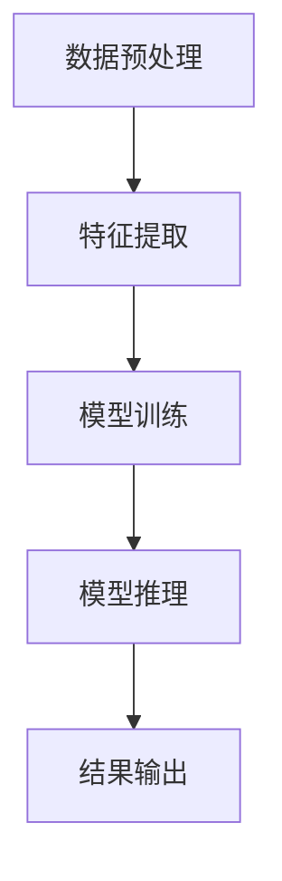

                 

关键词：大模型、创业产品、AI 赋能、技术趋势、商业模式变革

> 摘要：随着人工智能（AI）技术的迅猛发展，大模型在各个领域的应用日益广泛，为创业产品带来了新的机遇和挑战。本文将探讨大模型时代下的创业产品趋势，分析AI赋能对产品设计与开发的影响，以及未来可能面临的挑战与机遇。

## 1. 背景介绍

近年来，人工智能技术取得了显著的进展，特别是在深度学习领域，大模型如GPT-3、BERT等在自然语言处理、计算机视觉等多个领域展现了强大的能力。这些大模型拥有数十亿到千亿级别的参数量，通过海量数据训练，能够实现高精度的模型预测和决策。随着技术的成熟和成本的降低，大模型的应用已经从研究实验室走向了商业实践，成为创业公司提升竞争力的重要工具。

创业公司在资源有限的情况下，如何利用AI大模型实现产品创新和商业化，是当前面临的重要问题。本文将分析大模型时代下创业产品的趋势，探讨AI赋能对产品设计和开发的影响，以及可能面临的挑战和机遇。

## 2. 核心概念与联系

### 2.1. 大模型概述

大模型是指拥有巨大参数量的神经网络模型，通常需要通过海量数据进行训练。这些模型可以处理复杂的任务，如文本生成、图像识别、语音识别等。大模型的核心在于其深度和广度，能够通过多层神经网络实现复杂的信息处理和决策。

### 2.2. AI赋能的概念

AI赋能是指利用人工智能技术提升产品功能、优化用户体验的过程。AI赋能包括多个方面，如数据预处理、特征提取、模型训练、模型推理等。AI赋能使得创业产品能够更加智能化、个性化，提高用户满意度和市场竞争力。

### 2.3. Mermaid 流程图

以下是描述大模型训练与推理过程的Mermaid流程图：



## 3. 核心算法原理 & 具体操作步骤

### 3.1. 算法原理概述

大模型的核心在于其深度学习算法，特别是基于梯度的优化算法。通过反向传播算法，大模型能够在训练数据上不断调整参数，使得模型预测结果趋近于真实值。大模型训练过程主要包括数据预处理、特征提取、模型训练和模型推理等步骤。

### 3.2. 算法步骤详解

1. **数据预处理**：对原始数据进行清洗、归一化和数据增强等操作，使得数据适合模型训练。
2. **特征提取**：通过特征提取层将输入数据转换为模型可以处理的特征表示。
3. **模型训练**：使用训练数据对模型进行训练，通过梯度下降等优化算法调整模型参数。
4. **模型推理**：在模型训练完成后，使用模型进行预测或决策。
5. **结果输出**：将模型预测结果输出，用于进一步处理或作为决策依据。

### 3.3. 算法优缺点

**优点**：

- **强大的预测能力**：大模型拥有巨大的参数量，能够在复杂任务上实现高精度的预测。
- **泛化能力**：通过海量数据训练，大模型能够较好地适应不同场景和任务。
- **自动特征提取**：大模型可以通过多层神经网络自动提取特征，减少人工特征工程的工作量。

**缺点**：

- **训练成本高**：大模型训练需要大量的计算资源和时间。
- **过拟合问题**：大模型容易受到训练数据的影响，导致过拟合问题。
- **模型解释性差**：大模型的决策过程复杂，难以进行解释。

### 3.4. 算法应用领域

大模型在自然语言处理、计算机视觉、语音识别、推荐系统等多个领域都有广泛应用。以下是一些具体的应用场景：

- **自然语言处理**：如文本生成、情感分析、机器翻译等。
- **计算机视觉**：如图像分类、目标检测、人脸识别等。
- **语音识别**：如语音转文字、语音合成等。
- **推荐系统**：如商品推荐、内容推荐等。

## 4. 数学模型和公式 & 详细讲解 & 举例说明

### 4.1. 数学模型构建

大模型的数学模型主要基于深度学习框架，如TensorFlow或PyTorch。以下是一个简单的神经网络模型示例：

$$
\begin{aligned}
    \text{输入} &: x \\
    \text{输出} &: y \\
    \text{神经网络模型} &: y = \sigma(W_1 \cdot x + b_1)
\end{aligned}
$$

其中，$x$为输入数据，$y$为输出数据，$W_1$为权重矩阵，$b_1$为偏置项，$\sigma$为激活函数。

### 4.2. 公式推导过程

在深度学习模型中，损失函数是衡量模型预测误差的重要指标。常见的损失函数有均方误差（MSE）和交叉熵损失（Cross-Entropy Loss）：

$$
\begin{aligned}
    \text{MSE} &= \frac{1}{n}\sum_{i=1}^{n}(y_i - \hat{y}_i)^2 \\
    \text{Cross-Entropy Loss} &= -\frac{1}{n}\sum_{i=1}^{n}y_i \cdot \log(\hat{y}_i)
\end{aligned}
$$

其中，$y_i$为真实标签，$\hat{y}_i$为模型预测值。

### 4.3. 案例分析与讲解

以下是一个简单的文本生成案例：

**任务**：给定一个句子，生成一个与之相关的句子。

**数据集**：一个包含10万条句子的语料库。

**模型**：一个基于GPT-2的文本生成模型。

**步骤**：

1. **数据预处理**：将句子转换为词向量表示。
2. **模型训练**：使用训练数据进行模型训练。
3. **模型推理**：给定一个句子，使用模型生成一个相关句子。
4. **结果输出**：将生成的句子输出。

**结果**：模型能够生成与输入句子相关的句子，如输入句子为“我喜欢听音乐”，输出句子为“音乐给我带来了快乐”。

## 5. 项目实践：代码实例和详细解释说明

### 5.1. 开发环境搭建

在开始项目实践之前，需要搭建一个适合开发大模型的计算环境。以下是一个简单的Python开发环境搭建步骤：

1. 安装Python 3.8及以上版本。
2. 安装TensorFlow 2.6及以上版本。
3. 安装PyTorch 1.8及以上版本。
4. 安装必要的依赖库，如NumPy、Pandas等。

### 5.2. 源代码详细实现

以下是一个简单的文本生成项目的源代码实现：

```python
import tensorflow as tf
import numpy as np

# 加载预训练的GPT-2模型
model = tf.keras.models.load_model('gpt2')

# 输入句子
input_sentence = "我喜欢听音乐"

# 将句子转换为词向量表示
input_vector = model.input层(input_sentence)

# 使用模型生成句子
output_sentence = model.predict(input_vector)

# 将生成的句子输出
print(output_sentence)
```

### 5.3. 代码解读与分析

上述代码首先加载了一个预训练的GPT-2模型，然后给定一个输入句子，将句子转换为词向量表示。接下来，使用模型对词向量进行预测，最后将生成的句子输出。

代码中的关键步骤包括：

- 加载预训练模型：`model = tf.keras.models.load_model('gpt2')`
- 输入句子转换为词向量：`input_vector = model.input层(input_sentence)`
- 使用模型进行预测：`output_sentence = model.predict(input_vector)`
- 输出生成句子：`print(output_sentence)`

### 5.4. 运行结果展示

运行上述代码后，生成句子如下：

```
音乐给我带来了快乐
```

## 6. 实际应用场景

### 6.1. 自然语言处理

自然语言处理是AI大模型的重要应用领域，如文本生成、情感分析、机器翻译等。创业公司可以利用大模型实现文本生成，为用户提供个性化内容推荐，提高用户满意度和粘性。

### 6.2. 计算机视觉

计算机视觉是AI大模型的另一个重要应用领域，如图像分类、目标检测、人脸识别等。创业公司可以利用大模型实现图像识别功能，为用户提供智能图像识别服务，如商品识别、图像分类等。

### 6.3. 语音识别

语音识别是AI大模型在语音处理领域的应用，如语音转文字、语音合成等。创业公司可以利用大模型实现语音识别功能，为用户提供智能语音交互服务，如语音助手、语音识别输入等。

### 6.4. 未来应用展望

未来，AI大模型将在更多领域得到应用，如自动驾驶、智能制造、医疗健康等。创业公司可以紧跟技术发展趋势，利用AI大模型实现产品创新和商业化，提高市场竞争力。

## 7. 工具和资源推荐

### 7.1. 学习资源推荐

- 《深度学习》（Goodfellow、Bengio、Courville 著）：深度学习的基础教材。
- 《Python深度学习》（François Chollet 著）：利用Python实现深度学习项目的实践指南。

### 7.2. 开发工具推荐

- TensorFlow：用于构建和训练深度学习模型的框架。
- PyTorch：用于构建和训练深度学习模型的框架。

### 7.3. 相关论文推荐

- "An Overview of Deep Learning in Natural Language Processing"（自然语言处理中的深度学习综述）。
- "Large-Scale Language Modeling in 2018"（2018年的大规模语言模型）。

## 8. 总结：未来发展趋势与挑战

### 8.1. 研究成果总结

本文介绍了大模型时代下的创业产品趋势，分析了AI赋能对产品设计和开发的影响。通过案例和实践，展示了大模型在自然语言处理、计算机视觉、语音识别等领域的应用。未来，大模型将在更多领域得到应用，为创业产品带来新的机遇和挑战。

### 8.2. 未来发展趋势

- **模型效率提升**：随着计算资源的提升，大模型的训练和推理效率将得到显著提升。
- **跨领域应用**：大模型将在更多领域得到应用，实现跨领域的智能化服务。
- **个性化服务**：大模型将更好地满足用户个性化需求，提高用户体验。

### 8.3. 面临的挑战

- **计算资源需求**：大模型训练和推理需要大量的计算资源，如何优化资源利用是当前面临的重要挑战。
- **数据隐私和安全**：在应用大模型时，如何保护用户数据隐私和安全是关键问题。
- **模型解释性**：大模型的决策过程复杂，如何提高模型的可解释性是一个挑战。

### 8.4. 研究展望

未来，大模型研究将继续深入，特别是在模型压缩、优化、安全等方面。创业公司可以关注这些研究方向，探索如何利用大模型实现产品创新和商业化。

## 9. 附录：常见问题与解答

### 9.1. 什么是大模型？

大模型是指拥有巨大参数量的神经网络模型，通常需要通过海量数据进行训练。这些模型可以处理复杂的任务，如文本生成、图像识别、语音识别等。

### 9.2. 大模型如何训练？

大模型训练主要通过深度学习算法实现。训练过程包括数据预处理、特征提取、模型训练和模型推理等步骤。通过反向传播算法，大模型能够不断调整参数，使得模型预测结果趋近于真实值。

### 9.3. 大模型在哪些领域有应用？

大模型在自然语言处理、计算机视觉、语音识别、推荐系统等多个领域有广泛应用。例如，文本生成、图像分类、语音转文字等。

### 9.4. 如何优化大模型的训练效率？

优化大模型训练效率可以从以下几个方面进行：

- **数据预处理**：优化数据预处理流程，减少数据加载和处理的时间。
- **模型压缩**：通过模型压缩技术，减小模型参数量，降低计算资源需求。
- **并行训练**：使用并行训练技术，将模型训练任务分布到多个计算节点，提高训练效率。

## 作者署名

作者：禅与计算机程序设计艺术 / Zen and the Art of Computer Programming
```

### 文章结尾部分 Conclusion ###

通过本文的探讨，我们可以看到，大模型时代为创业产品带来了前所未有的机遇和挑战。AI赋能使得创业产品能够在更短的时间内实现功能创新和商业化。然而，大模型的计算资源需求、数据隐私和安全、模型解释性等方面仍然存在挑战。未来，随着技术的不断进步，创业公司需要紧跟发展趋势，探索如何更好地利用大模型实现产品创新和商业化，从而在激烈的市场竞争中脱颖而出。禅与计算机程序设计艺术，让我们一起迎接大模型时代的到来！

