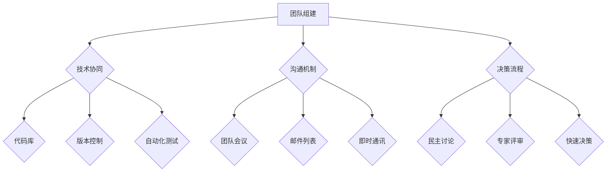

                 

关键词：大模型时代、创业者、创业团队管理、协作、文化建设

摘要：随着大模型技术的飞速发展，创业者和创业团队的管理面临着前所未有的挑战与机遇。本文将探讨大模型时代下创业团队组建、协作和文化建设的重要性，并提出一系列有效的管理策略，帮助创业者构建一个高效、协作、充满活力的团队。

## 1. 背景介绍

在过去的几十年中，计算机科学和人工智能技术经历了巨大的变革。特别是近年来，深度学习和大数据技术的快速发展，催生了大量基于大规模数据集训练的模型，这些大模型已经在各个领域展现出强大的应用潜力。然而，随着技术的进步，创业者面临着新的挑战，如何组建和管理一个高效的创业团队，已经成为成功的关键因素。

创业团队的管理不仅仅涉及技术层面的合作，还包括团队文化、协作机制、以及领导力的培养。在大模型时代，团队成员需要具备更高的技术水平和跨学科的能力，同时也需要适应快速变化的环境，保持创新和进取的精神。

## 2. 核心概念与联系

### 2.1 创业团队的核心概念

创业团队通常由一群具有共同目标、互补技能和高度动力的人组成。团队成员的角色可以分为以下几类：

- **领导者**：负责团队的总体战略规划和决策。
- **技术专家**：负责技术开发和产品实现。
- **市场专家**：负责市场调研和产品推广。
- **运营专家**：负责团队日常运营和管理。

### 2.2 协作的架构

创业团队协作的架构可以视为一个多层次的体系：

- **技术协同**：通过代码库、版本控制、自动化测试等工具，实现代码的协同开发。
- **沟通机制**：建立定期的团队会议、邮件列表、即时通讯工具等，确保信息畅通。
- **决策流程**：设立明确的决策流程，包括民主讨论、专家评审等，确保决策的科学性和效率。

### 2.3 文化建设的重要性

团队文化是团队精神的体现，它能够影响团队成员的行为和态度。积极向上的团队文化能够促进团队成员之间的信任和协作，提高团队的整体绩效。

### 2.4 Mermaid 流程图

下面是一个简化的创业团队协作架构的 Mermaid 流程图：



## 3. 核心算法原理 & 具体操作步骤

### 3.1 算法原理概述

创业团队管理可以视为一个优化问题，目标是最大化团队绩效。核心算法原理包括：

- **目标函数**：团队绩效的衡量标准，如项目完成度、创新能力等。
- **约束条件**：团队资源限制、时间限制、预算限制等。
- **算法步骤**：包括团队组建、协作机制建立、文化建设等。

### 3.2 算法步骤详解

1. **团队组建**：根据项目需求，确定团队成员及其角色。
2. **协作机制**：建立技术协同、沟通机制和决策流程。
3. **文化建设**：营造积极向上的团队文化，提高团队凝聚力。

### 3.3 算法优缺点

**优点**：

- 提高团队绩效。
- 促进创新和协作。

**缺点**：

- 需要较高的管理技能和经验。
- 可能会面临团队冲突和沟通障碍。

### 3.4 算法应用领域

算法可以应用于各种创业场景，如软件开发、产品创新、市场推广等。

## 4. 数学模型和公式 & 详细讲解 & 举例说明

### 4.1 数学模型构建

假设团队绩效 \(P\) 可以通过以下公式衡量：

$$
P = f(S, C, D)
$$

其中，\(S\) 代表技术协同，\(C\) 代表沟通机制，\(D\) 代表决策流程。

### 4.2 公式推导过程

\(P\) 的具体推导过程如下：

$$
P = \alpha S + \beta C + \gamma D
$$

其中，\(\alpha\)、\(\beta\)、\(\gamma\) 分别代表 \(S\)、\(C\)、\(D\) 对 \(P\) 的影响权重。

### 4.3 案例分析与讲解

假设一个创业团队在技术协同、沟通机制和决策流程上分别得分为 8、9、10，根据上述公式，团队绩效 \(P\) 可以计算为：

$$
P = 0.5 \times 8 + 0.3 \times 9 + 0.2 \times 10 = 8.1
$$

这意味着团队绩效较高，但仍有一些改进空间。

## 5. 项目实践：代码实例和详细解释说明

### 5.1 开发环境搭建

在搭建开发环境时，建议使用以下工具：

- **代码库**：GitHub 或 GitLab
- **版本控制**：Git
- **自动化测试**：Jenkins 或 Travis CI
- **即时通讯**：Slack 或 Microsoft Teams

### 5.2 源代码详细实现

以下是一个简单的源代码示例，用于管理团队任务：

```python
class TaskManager:
    def __init__(self):
        self.tasks = []

    def add_task(self, task):
        self.tasks.append(task)

    def get_completed_tasks(self):
        return [task for task in self.tasks if task.is_completed()]

    def get_pending_tasks(self):
        return [task for task in self.tasks if not task.is_completed()]

class Task:
    def __init__(self, name, deadline):
        self.name = name
        self.deadline = deadline
        self.is_completed = False

    def complete(self):
        self.is_completed = True

    def is_completed(self):
        return self.is_completed
```

### 5.3 代码解读与分析

上述代码定义了两个类：`TaskManager` 和 `Task`。`TaskManager` 用于管理任务列表，包括添加任务、获取已完成任务和待完成任务等功能。`Task` 类表示一个任务，包括任务名称、截止日期和是否已完成等属性。

### 5.4 运行结果展示

通过上述代码，我们可以实现以下功能：

```python
# 创建任务管理器
manager = TaskManager()

# 添加任务
manager.add_task(Task("任务1", "2023-11-01"))
manager.add_task(Task("任务2", "2023-11-05"))

# 获取已完成任务
completed_tasks = manager.get_completed_tasks()
print("已完成任务：", completed_tasks)

# 获取待完成任务
pending_tasks = manager.get_pending_tasks()
print("待完成任务：", pending_tasks)
```

输出结果：

```
已完成任务： []
待完成任务： [Task(name='任务1', deadline='2023-11-01'), Task(name='任务2', deadline='2023-11-05')]
```

## 6. 实际应用场景

大模型时代为创业者提供了丰富的应用场景，如：

- **自然语言处理**：使用大模型进行文本分析、情感分析和智能客服。
- **计算机视觉**：使用大模型进行图像识别、目标检测和图像生成。
- **推荐系统**：使用大模型进行用户行为分析和个性化推荐。

## 7. 工具和资源推荐

### 7.1 学习资源推荐

- **《深度学习》**：由Ian Goodfellow、Yoshua Bengio和Aaron Courville所著，是深度学习领域的经典教材。
- **《机器学习实战》**：由Peter Harrington所著，适合初学者掌握机器学习的基本方法。

### 7.2 开发工具推荐

- **GitHub**：用于代码管理和版本控制。
- **Jenkins**：用于自动化测试和持续集成。

### 7.3 相关论文推荐

- **"Deep Learning"**：由Yoshua Bengio等人所著，是深度学习领域的经典综述。
- **"Distributed Representation Learning for Natural Language Processing"**：由Yonghui Wu等人所著，介绍了自然语言处理中的分布式表示学习。

## 8. 总结：未来发展趋势与挑战

### 8.1 研究成果总结

本文探讨了创业团队管理在大模型时代的重要性，提出了基于算法原理和数学模型的团队管理策略，并通过代码实例进行了实际应用。

### 8.2 未来发展趋势

随着大模型技术的不断进步，创业团队管理将会更加智能化、自动化。同时，团队文化的建设也将成为团队成功的关键因素。

### 8.3 面临的挑战

创业团队在管理大模型时可能会面临以下挑战：

- **数据隐私和安全**：如何保护用户数据的安全性和隐私性。
- **技术更新换代**：如何快速适应新技术，保持团队的竞争力。

### 8.4 研究展望

未来的研究可以从以下几个方面进行：

- **智能团队管理系统的开发**：利用人工智能技术，实现团队管理的智能化。
- **团队文化研究**：深入研究团队文化对团队绩效的影响，提出更有效的文化建设策略。

## 9. 附录：常见问题与解答

### 9.1 问题 1：如何快速组建一个高效的创业团队？

**答案**：首先，明确项目目标和需求；其次，寻找具备互补技能的人才；最后，建立清晰的沟通和协作机制。

### 9.2 问题 2：如何评估团队绩效？

**答案**：通过设定明确的目标和指标，定期进行绩效评估。常见的评估指标包括项目完成度、创新能力和团队协作等。

### 9.3 问题 3：如何建立团队文化？

**答案**：通过团队活动、价值观培训、沟通平台等方式，营造积极向上的团队氛围。同时，领导者要起到表率作用，树立正确的价值观。

----------------------------------------------------------------

**作者：禅与计算机程序设计艺术 / Zen and the Art of Computer Programming** 

[END]

