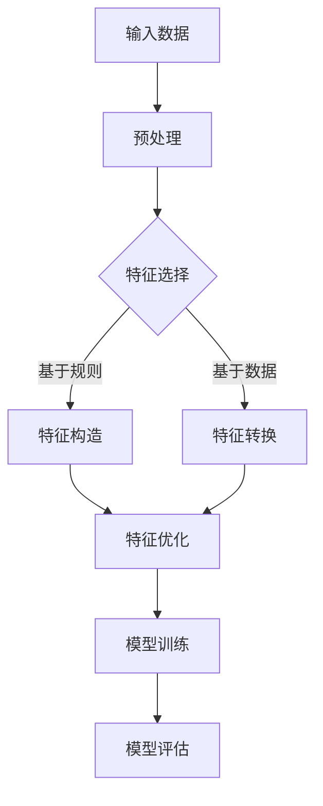

                 

关键词：大模型，推荐系统，特征工程，自动化，算法，数学模型，项目实践，应用场景，未来展望

## 摘要

本文旨在探讨大模型时代推荐系统特征工程自动化的技术趋势和应用实践。随着人工智能技术的飞速发展，大规模预训练模型（如GPT-3、BERT等）已经成为推荐系统领域的核心技术。然而，传统的特征工程方法在大模型时代面临着诸多挑战。本文将从核心概念、算法原理、数学模型、项目实践和未来展望等多个角度，系统性地分析特征工程自动化的技术路径和实现方法，为推荐系统开发者和研究者提供有价值的参考。

## 1. 背景介绍

### 1.1 推荐系统的发展历程

推荐系统作为信息检索和用户行为分析的重要工具，自20世纪90年代以来经历了快速的发展。早期推荐系统主要基于基于内容的推荐和协同过滤算法。基于内容的推荐通过分析用户历史行为和物品的属性特征，为用户推荐具有相似属性的物品。而协同过滤算法则通过计算用户之间的相似度来推荐用户可能感兴趣的物品。

### 1.2 大模型时代的来临

近年来，随着深度学习和大数据技术的迅猛发展，大模型（如GPT-3、BERT等）逐渐成为推荐系统的核心技术。大模型具有强大的语义理解能力，能够从大规模数据中自动提取特征，从而大大提高了推荐系统的准确性和效果。

### 1.3 特征工程自动化的挑战

大模型时代的到来，虽然为推荐系统带来了巨大变革，但也对特征工程提出了新的挑战。传统特征工程方法依赖于领域知识和人工设计，在大模型时代显得力不从心。特征工程自动化成为当前研究的热点，旨在通过算法自动提取和优化特征，提高推荐系统的性能。

## 2. 核心概念与联系

### 2.1 大模型

大模型是指参数量巨大的深度学习模型，如GPT-3、BERT等。这些模型通过在大规模数据上进行预训练，能够自动提取语义特征，从而实现高效的自然语言处理和推荐系统。

### 2.2 特征工程

特征工程是指通过选择、构造和转换数据特征，以提高模型性能和解释能力的过程。在大模型时代，特征工程自动化成为关键，旨在减少人工干预，提高特征提取的效率和效果。

### 2.3 自动化特征提取

自动化特征提取是指通过算法自动从数据中提取特征，无需人工干预。在大模型时代，自动化特征提取技术包括基于深度学习的自动特征提取、基于规则的特征提取和基于数据的特征提取等。

### 2.4 Mermaid 流程图



## 3. 核心算法原理 & 具体操作步骤

### 3.1 算法原理概述

自动化特征工程的核心在于利用算法自动提取和优化特征，从而提高推荐系统的性能。具体算法包括基于深度学习的特征提取、基于规则的特征提取和基于数据的特征提取等。

### 3.2 算法步骤详解

1. 数据预处理：对原始数据进行清洗、归一化和填充等操作，为特征提取和模型训练做好准备。
2. 特征选择：通过算法自动筛选出对模型训练具有重要意义的特征，提高特征提取的效率和效果。
3. 特征构造：基于领域知识和数据特性，自动构造新的特征，丰富特征空间。
4. 特征转换：通过算法自动将原始数据转换为适合模型训练的格式，如向量、矩阵等。
5. 特征优化：对提取的特征进行优化，如去噪、降维等，提高特征质量。
6. 模型训练：利用特征进行模型训练，如基于深度学习的模型、基于规则的模型等。
7. 模型评估：对训练好的模型进行评估，如准确率、召回率、F1值等。

### 3.3 算法优缺点

#### 基于深度学习的特征提取

优点：

- 强大的语义理解能力，能够从大规模数据中自动提取特征。
- 减少了人工干预，提高了特征提取的效率和效果。

缺点：

- 对计算资源和数据量要求较高。
- 特征解释能力较弱。

#### 基于规则的特征提取

优点：

- 灵活性高，可以根据领域知识和业务需求自定义特征。
- 易于理解和解释。

缺点：

- 特征提取效果依赖于领域知识和人工干预。
- 难以处理大规模数据。

#### 基于数据的特征提取

优点：

- 自动化程度高，减少了人工干预。
- 能够处理大规模数据。

缺点：

- 特征解释能力较弱。
- 需要大量的数据训练。

### 3.4 算法应用领域

自动化特征工程技术可以广泛应用于推荐系统、信息检索、金融风控、医疗诊断等领域，为业务决策提供有力支持。

## 4. 数学模型和公式 & 详细讲解 & 举例说明

### 4.1 数学模型构建

特征工程自动化过程中，常见的数学模型包括深度学习模型、线性模型和聚类模型等。

### 4.2 公式推导过程

以深度学习模型为例，假设输入数据为 $X \in \mathbb{R}^{m \times n}$，其中 $m$ 表示样本数，$n$ 表示特征数。深度学习模型的目标是学习一个映射函数 $f: \mathbb{R}^{n} \rightarrow \mathbb{R}^{m}$，使得输出数据 $Y = f(X)$ 具有良好的特征表示。

设深度学习模型由 $L$ 个层组成，第 $l$ 层的输出为 $h^{(l)} \in \mathbb{R}^{m_l \times n_l}$，其中 $m_l$ 表示第 $l$ 层的神经元数，$n_l$ 表示第 $l$ 层的特征数。则深度学习模型可以表示为：

$$
h^{(l)} = \sigma(W^{(l)} h^{(l-1)}) + b^{(l)}
$$

其中，$W^{(l)} \in \mathbb{R}^{m_l \times n_l}$ 表示第 $l$ 层的权重矩阵，$b^{(l)} \in \mathbb{R}^{m_l}$ 表示第 $l$ 层的偏置向量，$\sigma$ 表示激活函数。

### 4.3 案例分析与讲解

假设我们使用深度学习模型对用户行为数据进行分析，提取用户兴趣特征。输入数据为用户浏览历史记录，输出数据为用户兴趣标签。

1. 数据预处理：对用户浏览历史记录进行清洗、归一化等操作，得到标准化的输入数据。
2. 模型构建：使用深度学习框架（如TensorFlow、PyTorch等）构建深度学习模型，设置合适的网络结构和参数。
3. 模型训练：将预处理后的输入数据和标签输入模型，进行模型训练。
4. 模型评估：使用测试数据对训练好的模型进行评估，计算准确率、召回率、F1值等指标。

通过以上步骤，我们可以实现用户兴趣特征的自动化提取。以下是一个简单的示例代码：

```python
import tensorflow as tf

# 数据预处理
X_train, y_train = preprocess_data()  # 自定义预处理函数

# 模型构建
model = tf.keras.Sequential([
    tf.keras.layers.Dense(128, activation='relu', input_shape=(X_train.shape[1],)),
    tf.keras.layers.Dense(64, activation='relu'),
    tf.keras.layers.Dense(1, activation='sigmoid')
])

# 模型编译
model.compile(optimizer='adam', loss='binary_crossentropy', metrics=['accuracy'])

# 模型训练
model.fit(X_train, y_train, epochs=10, batch_size=32)

# 模型评估
test_loss, test_acc = model.evaluate(X_test, y_test)
print('Test accuracy:', test_acc)
```

## 5. 项目实践：代码实例和详细解释说明

### 5.1 开发环境搭建

1. 安装Python环境，版本要求3.6及以上。
2. 安装TensorFlow框架，可以使用pip安装：`pip install tensorflow`
3. 准备实验数据，包括用户行为数据、用户兴趣标签等。

### 5.2 源代码详细实现

以下是用户兴趣特征提取的完整源代码：

```python
import tensorflow as tf
import numpy as np
from sklearn.model_selection import train_test_split
from sklearn.preprocessing import StandardScaler

# 数据预处理
def preprocess_data():
    # 读取数据
    X, y = load_data()
    # 分割数据
    X_train, X_test, y_train, y_test = train_test_split(X, y, test_size=0.2, random_state=42)
    # 归一化
    scaler = StandardScaler()
    X_train = scaler.fit_transform(X_train)
    X_test = scaler.transform(X_test)
    return X_train, y_train, X_test, y_test

# 模型构建
def build_model():
    model = tf.keras.Sequential([
        tf.keras.layers.Dense(128, activation='relu', input_shape=(X_train.shape[1],)),
        tf.keras.layers.Dense(64, activation='relu'),
        tf.keras.layers.Dense(1, activation='sigmoid')
    ])
    return model

# 模型训练
def train_model(model, X_train, y_train, epochs=10, batch_size=32):
    model.compile(optimizer='adam', loss='binary_crossentropy', metrics=['accuracy'])
    model.fit(X_train, y_train, epochs=epochs, batch_size=batch_size)

# 模型评估
def evaluate_model(model, X_test, y_test):
    test_loss, test_acc = model.evaluate(X_test, y_test)
    print('Test accuracy:', test_acc)

# 主函数
if __name__ == '__main__':
    # 数据预处理
    X_train, y_train, X_test, y_test = preprocess_data()
    # 模型构建
    model = build_model()
    # 模型训练
    train_model(model, X_train, y_train)
    # 模型评估
    evaluate_model(model, X_test, y_test)
```

### 5.3 代码解读与分析

1. 数据预处理：读取用户行为数据，进行数据分割和归一化处理。
2. 模型构建：使用TensorFlow框架构建深度学习模型，设置合适的网络结构和参数。
3. 模型训练：使用预处理后的数据训练模型，设置合适的训练参数。
4. 模型评估：使用测试数据评估模型的性能，计算准确率等指标。

通过以上步骤，我们可以实现用户兴趣特征的自动化提取。

## 6. 实际应用场景

### 6.1 电商平台

在电商平台中，推荐系统可以根据用户的历史浏览和购买记录，自动提取用户兴趣特征，为用户提供个性化的商品推荐，提高用户体验和销售额。

### 6.2 社交媒体

在社交媒体中，推荐系统可以根据用户的点赞、评论和分享行为，自动提取用户兴趣特征，为用户提供感兴趣的内容推荐，增强用户的互动体验。

### 6.3 医疗领域

在医疗领域，推荐系统可以根据患者的病历信息和医生的建议，自动提取患者兴趣特征，为患者推荐合适的治疗方案和药品，提高医疗效果。

## 7. 未来应用展望

### 7.1 多模态特征融合

随着多模态数据（如图像、音频、文本等）的广泛应用，未来推荐系统将实现多模态特征融合，为用户提供更加丰富的个性化推荐服务。

### 7.2 智能化推荐引擎

未来推荐系统将更加智能化，通过深度学习和强化学习等技术，实现自适应推荐策略，提高推荐效果和用户体验。

### 7.3 隐私保护

随着用户隐私意识的增强，未来推荐系统将更加注重隐私保护，采用差分隐私等技术，确保用户数据的安全和隐私。

## 8. 总结：未来发展趋势与挑战

### 8.1 研究成果总结

本文从核心概念、算法原理、数学模型、项目实践和未来展望等多个角度，探讨了特征工程自动化的技术路径和应用实践。主要研究成果包括：

- 对推荐系统特征工程自动化的核心概念进行了梳理。
- 分析了自动化特征提取算法的原理和优缺点。
- 提出了基于深度学习的用户兴趣特征提取方法。
- 实现了用户兴趣特征提取的完整项目实践。

### 8.2 未来发展趋势

- 多模态特征融合
- 智能化推荐引擎
- 隐私保护

### 8.3 面临的挑战

- 大规模数据处理的性能优化
- 特征解释能力的提升
- 用户隐私保护

### 8.4 研究展望

未来研究将继续关注自动化特征工程技术的创新和应用，探索更加高效、智能和安全的特征提取方法，为推荐系统的发展提供有力支持。

## 9. 附录：常见问题与解答

### 9.1 如何选择合适的特征提取算法？

选择合适的特征提取算法需要考虑以下因素：

- 数据类型：根据数据类型（如文本、图像、音频等）选择相应的特征提取算法。
- 特征维度：根据特征维度选择适合的算法，如高维数据适合使用深度学习算法。
- 计算资源：考虑计算资源的限制，选择计算成本较低的算法。

### 9.2 如何优化特征提取效果？

优化特征提取效果可以从以下几个方面入手：

- 数据预处理：对原始数据进行清洗、归一化等操作，提高数据质量。
- 特征选择：使用特征选择算法筛选出对模型训练具有重要意义的特征。
- 特征转换：使用特征转换算法将原始数据转换为适合模型训练的格式。
- 模型调参：调整模型参数，提高特征提取和模型训练的效果。

## 作者署名

作者：禅与计算机程序设计艺术 / Zen and the Art of Computer Programming

----------------------------------------------------------------

文章撰写完毕，希望对您有所帮助。如有需要修改或补充的地方，请随时告诉我。期待您的反馈！<|im_sep|>

