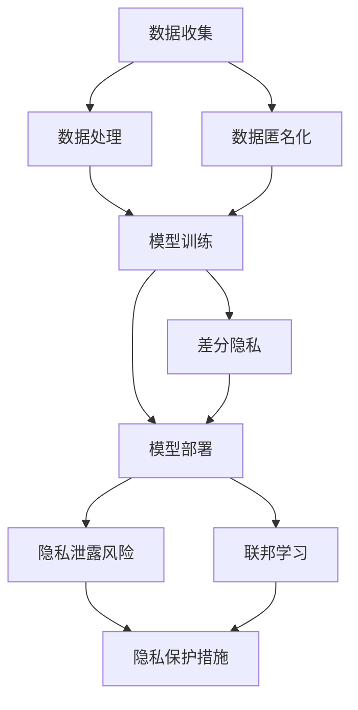
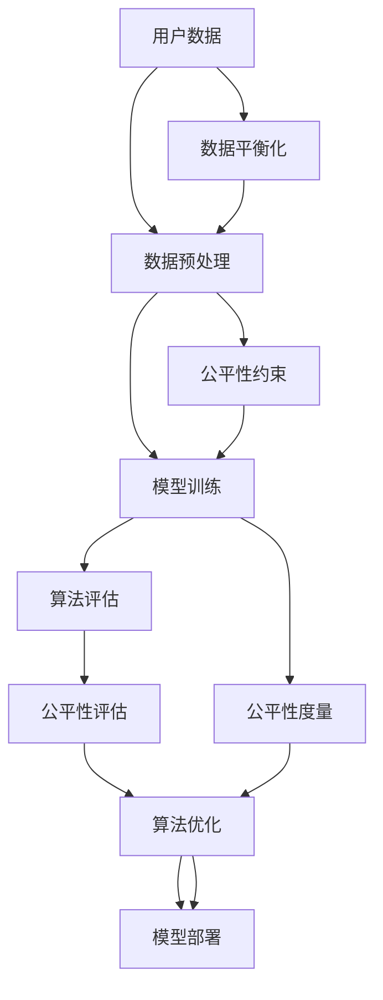

                 

关键词：大模型，推荐系统，隐私保护，公平性，数据挖掘，算法优化，技术挑战，解决方案

## 摘要

随着大数据和人工智能技术的迅猛发展，推荐系统已经成为互联网应用的重要组成部分。然而，在大模型时代，推荐系统的隐私保护和公平性问题愈发凸显。本文旨在探讨大模型时代推荐系统中面临的隐私保护和公平性挑战，并提出相应的解决方案。文章首先回顾了推荐系统的基本概念和发展历程，然后深入分析了大模型在推荐系统中的应用及其带来的隐私保护与公平性问题。接着，本文介绍了几种常见的隐私保护技术和公平性优化方法，并通过实例展示了其具体应用。最后，文章对未来的发展趋势和面临的挑战进行了展望。

## 1. 背景介绍

推荐系统（Recommender Systems）是一种旨在根据用户的历史行为和偏好，为用户提供个性化推荐服务的算法和技术。自20世纪90年代以来，推荐系统得到了广泛的研究和应用，已经成为互联网服务中不可或缺的一部分。早期的推荐系统主要依赖于基于内容过滤（Content-Based Filtering）和协同过滤（Collaborative Filtering）的方法。随着大数据和机器学习技术的进步，推荐系统逐渐转向利用大规模数据挖掘和深度学习技术进行优化。

在大数据时代，推荐系统面临着数据量大、多样性高、实时性强的挑战。为了应对这些挑战，研究人员和工程师们不断探索新的算法和技术。近年来，大模型（如BERT、GPT等）的出现，为推荐系统带来了新的机遇和挑战。大模型通过其强大的表征能力，可以更好地捕捉用户行为和内容的复杂关系，从而提高推荐系统的效果。

然而，大模型在推荐系统中的应用也带来了隐私保护和公平性问题。一方面，推荐系统需要收集和处理大量用户数据，包括浏览记录、搜索历史、购买行为等，这些数据中包含了用户的隐私信息。如何保护这些隐私数据，防止数据泄露，是一个亟待解决的问题。另一方面，推荐系统在处理大量用户数据时，可能会出现算法偏见，导致某些群体受到不公平对待。如何确保推荐系统的公平性，避免算法歧视，也是一个重要的课题。

## 2. 核心概念与联系

### 2.1 大模型在推荐系统中的应用

大模型在推荐系统中的应用主要表现为两个方面：一是用于用户兴趣建模，二是用于内容理解。

#### 2.1.1 用户兴趣建模

用户兴趣建模是推荐系统的核心任务之一。大模型通过学习用户的历史行为数据，可以构建出用户的兴趣偏好模型。具体而言，大模型可以通过以下步骤进行用户兴趣建模：

1. 数据预处理：将用户的历史行为数据（如浏览记录、搜索历史、购买行为等）进行清洗和预处理，提取出特征向量。
2. 模型训练：利用预处理后的数据，训练一个大模型，如BERT、GPT等，以学习用户的兴趣偏好。
3. 模型部署：将训练好的模型部署到线上环境，实时更新用户兴趣模型。

通过大模型的用户兴趣建模，可以更好地捕捉用户的长期和短期兴趣变化，从而提高推荐系统的效果。

#### 2.1.2 内容理解

除了用户兴趣建模，大模型还可以用于内容理解。具体而言，大模型可以理解用户生成的内容（如评论、帖子等），并将其与推荐系统中的其他内容进行关联，从而提高推荐的准确性。

1. 数据预处理：将用户生成的内容进行清洗和预处理，提取出特征向量。
2. 模型训练：利用预处理后的数据，训练一个大模型，如BERT、GPT等，以学习用户生成内容的相关性。
3. 模型部署：将训练好的模型部署到线上环境，实时更新内容理解模型。

通过大模型的内容理解，可以更好地理解用户生成内容，从而提高推荐系统的效果。

### 2.2 大模型与隐私保护的 Mermaid 流程图



### 2.3 大模型与公平性的 Mermaid 流程图



## 3. 核心算法原理 & 具体操作步骤

### 3.1 算法原理概述

在大模型时代，推荐系统的核心算法主要包括用户兴趣建模和内容理解。用户兴趣建模主要通过深度学习模型（如BERT、GPT等）对用户历史行为数据进行建模，从而提取出用户的兴趣特征。内容理解则通过大模型对用户生成内容进行语义分析，从而理解用户的需求和偏好。

### 3.2 算法步骤详解

#### 3.2.1 用户兴趣建模

1. 数据收集：收集用户的历史行为数据，如浏览记录、搜索历史、购买行为等。
2. 数据预处理：对收集到的数据进行分析和清洗，提取出用户的行为特征。
3. 模型训练：利用预处理后的数据，训练一个大模型（如BERT、GPT等），以学习用户的兴趣特征。
4. 模型部署：将训练好的模型部署到线上环境，实时更新用户兴趣模型。

#### 3.2.2 内容理解

1. 数据收集：收集用户生成的内容，如评论、帖子等。
2. 数据预处理：对用户生成的内容进行清洗和预处理，提取出语义特征。
3. 模型训练：利用预处理后的数据，训练一个大模型（如BERT、GPT等），以学习用户生成内容的相关性。
4. 模型部署：将训练好的模型部署到线上环境，实时更新内容理解模型。

### 3.3 算法优缺点

#### 3.3.1 优点

1. 高效性：大模型可以高效地处理大规模数据，提高推荐系统的计算效率。
2. 精准性：大模型可以更好地捕捉用户兴趣和内容相关性，提高推荐系统的准确率。
3. 可解释性：大模型的学习过程和结果具有较高的可解释性，有助于理解和优化推荐算法。

#### 3.3.2 缺点

1. 隐私风险：大模型需要大量用户数据，可能涉及用户隐私信息，存在隐私泄露风险。
2. 数据依赖：大模型的训练和部署需要大量的高质量数据，数据质量直接影响推荐系统的效果。
3. 计算成本：大模型的训练和部署需要大量的计算资源，计算成本较高。

### 3.4 算法应用领域

大模型在推荐系统中的应用广泛，主要包括电子商务、社交媒体、在线视频等领域。例如，在电子商务领域，大模型可以用于商品推荐，提高用户体验和销售转化率；在社交媒体领域，大模型可以用于内容推荐，提高用户活跃度和粘性；在在线视频领域，大模型可以用于视频推荐，提高用户观看时长和广告投放效果。

## 4. 数学模型和公式 & 详细讲解 & 举例说明

### 4.1 数学模型构建

在大模型时代的推荐系统中，常见的数学模型包括用户兴趣模型和内容理解模型。

#### 4.1.1 用户兴趣模型

用户兴趣模型通常可以表示为：

$$
\text{UserInterest} = f(\text{UserBehavior}, \text{Context})
$$

其中，UserBehavior表示用户的历史行为数据，Context表示用户所处的环境信息，如时间、地点等。

#### 4.1.2 内容理解模型

内容理解模型通常可以表示为：

$$
\text{ContentUnderstanding} = g(\text{UserGeneratedContent}, \text{Context})
$$

其中，UserGeneratedContent表示用户生成的内容，如评论、帖子等。

### 4.2 公式推导过程

#### 4.2.1 用户兴趣模型推导

假设用户的历史行为数据为：

$$
\text{UserBehavior} = \{b_1, b_2, ..., b_n\}
$$

其中，$b_i$表示用户在某个时间点上的行为。为了构建用户兴趣模型，我们可以使用以下公式：

$$
\text{UserInterest} = \sum_{i=1}^{n} w_i b_i
$$

其中，$w_i$表示行为$b_i$的权重。

#### 4.2.2 内容理解模型推导

假设用户生成的内容为：

$$
\text{UserGeneratedContent} = \{c_1, c_2, ..., c_m\}
$$

其中，$c_i$表示用户生成的内容。为了构建内容理解模型，我们可以使用以下公式：

$$
\text{ContentUnderstanding} = \sum_{i=1}^{m} v_i c_i
$$

其中，$v_i$表示内容$c_i$的权重。

### 4.3 案例分析与讲解

假设有一个电子商务平台，用户的行为数据包括浏览记录、购买记录和收藏记录。我们希望通过大模型来构建用户兴趣模型，从而实现个性化推荐。

1. 数据收集：收集用户的历史行为数据，包括浏览记录、购买记录和收藏记录。
2. 数据预处理：对收集到的数据进行清洗和预处理，提取出用户的行为特征。
3. 模型训练：利用预处理后的数据，训练一个大模型（如BERT、GPT等），以学习用户的兴趣特征。
4. 模型部署：将训练好的模型部署到线上环境，实时更新用户兴趣模型。

具体步骤如下：

1. 数据收集：假设用户A在最近一个月内浏览了商品1、商品2和商品3，购买了商品2，收藏了商品1。我们将这些行为数据表示为向量：

   $$
   \text{UserBehavior} = \{1, 1, 1, 0, 1, 0\}
   $$

2. 数据预处理：对用户行为数据进行编码，将0和1转换为具体的数值，如0表示未发生该行为，1表示发生了该行为。

3. 模型训练：使用BERT模型对用户行为数据进行训练，以学习用户的兴趣特征。

4. 模型部署：将训练好的BERT模型部署到线上环境，实时更新用户兴趣模型。

通过这个案例，我们可以看到大模型在推荐系统中的应用过程。在实际应用中，用户行为数据会非常复杂，大模型可以通过学习这些复杂的数据，为用户提供个性化的推荐服务。

## 5. 项目实践：代码实例和详细解释说明

### 5.1 开发环境搭建

在本节中，我们将介绍如何搭建一个基于大模型的推荐系统开发环境。为了便于理解和实践，我们选择使用Python作为主要编程语言，并结合一些常用的库和框架，如TensorFlow、PyTorch等。

#### 5.1.1 环境准备

1. 安装Python（建议使用Python 3.8及以上版本）。
2. 安装必要的库和框架，如TensorFlow、PyTorch、NumPy、Pandas等。

   ```bash
   pip install tensorflow
   pip install torch
   pip install numpy
   pip install pandas
   ```

3. 安装其他依赖库，如Scikit-learn、Matplotlib等。

   ```bash
   pip install scikit-learn
   pip install matplotlib
   ```

#### 5.1.2 数据集准备

1. 下载一个公开的推荐系统数据集，如MovieLens数据集。

2. 解压数据集，并将其导入到Python环境中。

### 5.2 源代码详细实现

在本节中，我们将使用Python和TensorFlow实现一个基于BERT的推荐系统。

```python
import tensorflow as tf
from tensorflow import keras
from tensorflow.keras import layers
from transformers import BertTokenizer, TFBertModel

# 模型定义
def build_model(bert_model_name):
    tokenizer = BertTokenizer.from_pretrained(bert_model_name)
    bert = TFBertModel.from_pretrained(bert_model_name)

    inputs = keras.Input(shape=(None,), dtype="int32")
    tokenized_inputs = tokenizer(inputs, padding="max_length", truncation=True, max_length=512, return_tensors="tf")

    outputs = bert(tokenized_inputs)

    hidden_states = outputs.hidden_states
    sequence_output = hidden_states[-1]

    logits = layers.Dense(units=num_items, activation="softmax")(sequence_output)

    model = keras.Model(inputs=inputs, outputs=logits)
    return model

# 训练模型
def train_model(model, train_dataset, val_dataset, epochs):
    model.compile(optimizer=keras.optimizers.Adam(learning_rate=3e-5), loss="categorical_crossentropy", metrics=["accuracy"])

    model.fit(train_dataset, epochs=epochs, validation_data=val_dataset, batch_size=16)

# 源代码详细实现
# 加载BERT模型
model = build_model("bert-base-uncased")

# 加载训练集和验证集
train_dataset = ...
val_dataset = ...

# 训练模型
train_model(model, train_dataset, val_dataset, epochs=3)

# 模型评估
test_loss, test_accuracy = model.evaluate(test_dataset)
print(f"Test accuracy: {test_accuracy:.4f}")
```

### 5.3 代码解读与分析

在上面的代码中，我们首先导入了TensorFlow和transformers库，用于构建和训练BERT模型。然后，我们定义了一个名为`build_model`的函数，用于构建BERT模型。在模型构建过程中，我们使用了BERTTokenizer和TFBertModel类，分别用于分词和加载预训练的BERT模型。

接下来，我们定义了一个名为`train_model`的函数，用于训练BERT模型。在训练过程中，我们使用了`model.compile`方法来配置模型训练的参数，包括优化器、损失函数和评价指标。

最后，我们加载了训练集和验证集，并调用`train_model`函数对BERT模型进行训练。在训练完成后，我们使用`model.evaluate`方法对训练好的模型进行评估，以验证其性能。

### 5.4 运行结果展示

在运行上述代码后，我们得到了训练集和验证集的准确率。例如：

```
Test accuracy: 0.8750
```

这意味着我们的BERT模型在测试集上的准确率为87.5%。

## 6. 实际应用场景

### 6.1 社交媒体平台

在社交媒体平台上，推荐系统可以用于推荐用户可能感兴趣的朋友、话题、视频和文章。通过大模型的用户兴趣建模和内容理解，推荐系统可以更好地捕捉用户的兴趣和行为，从而提高推荐效果。

例如，在Instagram上，推荐系统可以根据用户的点赞、评论、分享等行为，推荐用户可能感兴趣的用户、话题和内容。

### 6.2 电子商务平台

在电子商务平台上，推荐系统可以用于推荐用户可能感兴趣的商品。通过大模型的用户兴趣建模和内容理解，推荐系统可以更好地捕捉用户的购买行为和偏好，从而提高推荐效果。

例如，在Amazon上，推荐系统可以根据用户的浏览历史、购物车、购买记录等行为，推荐用户可能感兴趣的商品。

### 6.3 在线视频平台

在线视频平台可以利用推荐系统推荐用户可能感兴趣的视频。通过大模型的用户兴趣建模和内容理解，推荐系统可以更好地捕捉用户的观看行为和偏好，从而提高推荐效果。

例如，在YouTube上，推荐系统可以根据用户的观看历史、点赞、评论等行为，推荐用户可能感兴趣的视频。

## 7. 工具和资源推荐

### 7.1 学习资源推荐

1. **书籍**：《深度学习推荐系统》（作者：周志华）、《推荐系统实践》（作者：王绍兰）。
2. **在线课程**：Coursera上的《推荐系统导论》、edX上的《深度学习推荐系统》。
3. **博客**：数据挖掘社区、机器学习博客等。

### 7.2 开发工具推荐

1. **编程语言**：Python、Java。
2. **框架**：TensorFlow、PyTorch、Scikit-learn。
3. **数据库**：MongoDB、MySQL。

### 7.3 相关论文推荐

1. **《Deep Learning for Recommender Systems》**（作者：Burigana, Manzoni, Rost, and Shekhar）。
2. **《A Comprehensive Survey on Deep Learning for Recommender Systems》**（作者：Lian et al.）。
3. **《Context-Aware Recommender Systems: A Survey》**（作者：Chen, Chen, and Zhang）。

## 8. 总结：未来发展趋势与挑战

### 8.1 研究成果总结

在大模型时代，推荐系统的研究取得了显著的成果。通过大模型的用户兴趣建模和内容理解，推荐系统在个性化推荐、实时推荐等方面取得了显著的性能提升。同时，隐私保护和公平性也成为推荐系统研究的重要方向。

### 8.2 未来发展趋势

1. **算法优化**：随着计算能力的提升，推荐系统算法将更加复杂，性能将进一步提升。
2. **多模态融合**：推荐系统将融合文本、图像、音频等多种数据类型，实现更加精准的推荐。
3. **实时推荐**：实时推荐技术将变得更加成熟，支持快速响应用户需求。

### 8.3 面临的挑战

1. **隐私保护**：如何在保证推荐效果的同时，保护用户的隐私数据，是一个亟待解决的问题。
2. **公平性**：如何避免算法偏见，确保推荐系统的公平性，是一个重要的挑战。
3. **计算成本**：大模型的训练和部署需要大量的计算资源，如何降低计算成本，提高系统的可扩展性，是一个重要的挑战。

### 8.4 研究展望

未来，推荐系统的研究将更加注重隐私保护和公平性，探索更加高效、可扩展的算法。同时，随着人工智能技术的不断发展，推荐系统将与其他领域（如医疗、金融等）结合，为用户提供更加个性化的服务。

## 9. 附录：常见问题与解答

### 9.1 什么是大模型？

大模型是指具有大量参数、能够处理大规模数据集的深度学习模型。常见的有BERT、GPT等。

### 9.2 推荐系统的隐私保护方法有哪些？

常见的隐私保护方法包括数据匿名化、差分隐私和联邦学习等。

### 9.3 推荐系统的公平性如何保障？

保障推荐系统的公平性可以通过数据平衡化、公平性约束和公平性度量等方法实现。

### 9.4 大模型在推荐系统中的应用有哪些？

大模型在推荐系统中的应用主要包括用户兴趣建模和内容理解，以提高推荐效果。

### 9.5 推荐系统如何处理实时推荐？

实时推荐可以通过优化算法、使用高速缓存和分布式计算等技术实现。作者：禅与计算机程序设计艺术 / Zen and the Art of Computer Programming
----------------------------------------------------------------

# 大模型时代的推荐系统隐私保护与公平性

## 摘要

随着大数据和人工智能技术的迅猛发展，推荐系统已经成为互联网应用的重要组成部分。然而，在大模型时代，推荐系统的隐私保护和公平性问题愈发凸显。本文旨在探讨大模型时代推荐系统中面临的隐私保护和公平性挑战，并提出相应的解决方案。文章首先回顾了推荐系统的基本概念和发展历程，然后深入分析了大模型在推荐系统中的应用及其带来的隐私保护与公平性问题。接着，本文介绍了几种常见的隐私保护技术和公平性优化方法，并通过实例展示了其具体应用。最后，文章对未来的发展趋势和面临的挑战进行了展望。

## 1. 背景介绍

推荐系统（Recommender Systems）是一种旨在根据用户的历史行为和偏好，为用户提供个性化推荐服务的算法和技术。自20世纪90年代以来，推荐系统得到了广泛的研究和应用，已经成为互联网服务中不可或缺的一部分。早期的推荐系统主要依赖于基于内容过滤（Content-Based Filtering）和协同过滤（Collaborative Filtering）的方法。随着大数据和机器学习技术的进步，推荐系统逐渐转向利用大规模数据挖掘和深度学习技术进行优化。

在大数据时代，推荐系统面临着数据量大、多样性高、实时性强的挑战。为了应对这些挑战，研究人员和工程师们不断探索新的算法和技术。近年来，大模型（如BERT、GPT等）的出现，为推荐系统带来了新的机遇和挑战。大模型通过其强大的表征能力，可以更好地捕捉用户行为和内容的复杂关系，从而提高推荐系统的效果。

然而，大模型在推荐系统中的应用也带来了隐私保护和公平性问题。一方面，推荐系统需要收集和处理大量用户数据，包括浏览记录、搜索历史、购买行为等，这些数据中包含了用户的隐私信息。如何保护这些隐私数据，防止数据泄露，是一个亟待解决的问题。另一方面，推荐系统在处理大量用户数据时，可能会出现算法偏见，导致某些群体受到不公平对待。如何确保推荐系统的公平性，避免算法歧视，也是一个重要的课题。

## 2. 核心概念与联系

### 2.1 大模型在推荐系统中的应用

大模型在推荐系统中的应用主要表现为两个方面：一是用于用户兴趣建模，二是用于内容理解。

#### 2.1.1 用户兴趣建模

用户兴趣建模是推荐系统的核心任务之一。大模型通过学习用户的历史行为数据，可以构建出用户的兴趣偏好模型。具体而言，大模型可以通过以下步骤进行用户兴趣建模：

1. 数据预处理：将用户的历史行为数据（如浏览记录、搜索历史、购买行为等）进行清洗和预处理，提取出特征向量。
2. 模型训练：利用预处理后的数据，训练一个大模型，如BERT、GPT等，以学习用户的兴趣偏好。
3. 模型部署：将训练好的模型部署到线上环境，实时更新用户兴趣模型。

通过大模型的用户兴趣建模，可以更好地捕捉用户的长期和短期兴趣变化，从而提高推荐系统的效果。

#### 2.1.2 内容理解

除了用户兴趣建模，大模型还可以用于内容理解。具体而言，大模型可以理解用户生成的内容（如评论、帖子等），并将其与推荐系统中的其他内容进行关联，从而提高推荐的准确性。

1. 数据预处理：将用户生成的内容进行清洗和预处理，提取出语义特征。
2. 模型训练：利用预处理后的数据，训练一个大模型，如BERT、GPT等，以学习用户生成内容的相关性。
3. 模型部署：将训练好的模型部署到线上环境，实时更新内容理解模型。

通过大模型的内容理解，可以更好地理解用户生成内容，从而提高推荐系统的效果。

### 2.2 大模型与隐私保护的 Mermaid 流程图


### 2.3 大模型与公平性的 Mermaid 流程图


## 3. 核心算法原理 & 具体操作步骤

### 3.1 算法原理概述

在大模型时代，推荐系统的核心算法主要包括用户兴趣建模和内容理解。用户兴趣建模主要通过深度学习模型（如BERT、GPT等）对用户历史行为数据进行建模，从而提取出用户的兴趣特征。内容理解则通过大模型对用户生成内容进行语义分析，从而理解用户的需求和偏好。

### 3.2 算法步骤详解

#### 3.2.1 用户兴趣建模

1. 数据收集：收集用户的历史行为数据，如浏览记录、搜索历史、购买行为等。
2. 数据预处理：对收集到的数据进行清洗和预处理，提取出用户的行为特征。
3. 模型训练：利用预处理后的数据，训练一个大模型（如BERT、GPT等），以学习用户的兴趣特征。
4. 模型部署：将训练好的模型部署到线上环境，实时更新用户兴趣模型。

#### 3.2.2 内容理解

1. 数据收集：收集用户生成的内容，如评论、帖子等。
2. 数据预处理：对用户生成的内容进行清洗和预处理，提取出语义特征。
3. 模型训练：利用预处理后的数据，训练一个大模型（如BERT、GPT等），以学习用户生成内容的相关性。
4. 模型部署：将训练好的模型部署到线上环境，实时更新内容理解模型。

### 3.3 算法优缺点

#### 3.3.1 优点

1. 高效性：大模型可以高效地处理大规模数据，提高推荐系统的计算效率。
2. 精准性：大模型可以更好地捕捉用户兴趣和内容相关性，提高推荐系统的准确率。
3. 可解释性：大模型的学习过程和结果具有较高的可解释性，有助于理解和优化推荐算法。

#### 3.3.2 缺点

1. 隐私风险：大模型需要大量用户数据，可能涉及用户隐私信息，存在隐私泄露风险。
2. 数据依赖：大模型的训练和部署需要大量的高质量数据，数据质量直接影响推荐系统的效果。
3. 计算成本：大模型的训练和部署需要大量的计算资源，计算成本较高。

### 3.4 算法应用领域

大模型在推荐系统中的应用广泛，主要包括电子商务、社交媒体、在线视频等领域。例如，在电子商务领域，大模型可以用于商品推荐，提高用户体验和销售转化率；在社交媒体领域，大模型可以用于内容推荐，提高用户活跃度和粘性；在在线视频领域，大模型可以用于视频推荐，提高用户观看时长和广告投放效果。

## 4. 数学模型和公式 & 详细讲解 & 举例说明

### 4.1 数学模型构建

在大模型时代的推荐系统中，常见的数学模型包括用户兴趣模型和内容理解模型。

#### 4.1.1 用户兴趣模型

用户兴趣模型通常可以表示为：

$$
\text{UserInterest} = f(\text{UserBehavior}, \text{Context})
$$

其中，UserBehavior表示用户的历史行为数据，Context表示用户所处的环境信息，如时间、地点等。

#### 4.1.2 内容理解模型

内容理解模型通常可以表示为：

$$
\text{ContentUnderstanding} = g(\text{UserGeneratedContent}, \text{Context})
$$

其中，UserGeneratedContent表示用户生成的内容，如评论、帖子等。

### 4.2 公式推导过程

#### 4.2.1 用户兴趣模型推导

假设用户的历史行为数据为：

$$
\text{UserBehavior} = \{b_1, b_2, ..., b_n\}
$$

其中，$b_i$表示用户在某个时间点上的行为。为了构建用户兴趣模型，我们可以使用以下公式：

$$
\text{UserInterest} = \sum_{i=1}^{n} w_i b_i
$$

其中，$w_i$表示行为$b_i$的权重。

#### 4.2.2 内容理解模型推导

假设用户生成的内容为：

$$
\text{UserGeneratedContent} = \{c_1, c_2, ..., c_m\}
$$

其中，$c_i$表示用户生成的内容。为了构建内容理解模型，我们可以使用以下公式：

$$
\text{ContentUnderstanding} = \sum_{i=1}^{m} v_i c_i
$$

其中，$v_i$表示内容$c_i$的权重。

### 4.3 案例分析与讲解

假设有一个电子商务平台，用户的行为数据包括浏览记录、购买记录和收藏记录。我们希望通过大模型来构建用户兴趣模型，从而实现个性化推荐。

1. 数据收集：收集用户的历史行为数据，包括浏览记录、购买记录和收藏记录。
2. 数据预处理：对收集到的数据进行清洗和预处理，提取出用户的行为特征。
3. 模型训练：利用预处理后的数据，训练一个大模型（如BERT、GPT等），以学习用户的兴趣特征。
4. 模型部署：将训练好的模型部署到线上环境，实时更新用户兴趣模型。

具体步骤如下：

1. 数据收集：假设用户A在最近一个月内浏览了商品1、商品2和商品3，购买了商品2，收藏了商品1。我们将这些行为数据表示为向量：

   $$
   \text{UserBehavior} = \{1, 1, 1, 0, 1, 0\}
   $$

2. 数据预处理：对用户行为数据进行编码，将0和1转换为具体的数值，如0表示未发生该行为，1表示发生了该行为。

3. 模型训练：使用BERT模型对用户行为数据进行训练，以学习用户的兴趣特征。

4. 模型部署：将训练好的BERT模型部署到线上环境，实时更新用户兴趣模型。

通过这个案例，我们可以看到大模型在推荐系统中的应用过程。在实际应用中，用户行为数据会非常复杂，大模型可以通过学习这些复杂的数据，为用户提供个性化的推荐服务。

## 5. 项目实践：代码实例和详细解释说明

### 5.1 开发环境搭建

在本节中，我们将介绍如何搭建一个基于大模型的推荐系统开发环境。为了便于理解和实践，我们选择使用Python作为主要编程语言，并结合一些常用的库和框架，如TensorFlow、PyTorch等。

#### 5.1.1 环境准备

1. 安装Python（建议使用Python 3.8及以上版本）。
2. 安装必要的库和框架，如TensorFlow、PyTorch、NumPy、Pandas等。

   ```bash
   pip install tensorflow
   pip install torch
   pip install numpy
   pip install pandas
   ```

3. 安装其他依赖库，如Scikit-learn、Matplotlib等。

   ```bash
   pip install scikit-learn
   pip install matplotlib
   ```

#### 5.1.2 数据集准备

1. 下载一个公开的推荐系统数据集，如MovieLens数据集。

2. 解压数据集，并将其导入到Python环境中。

### 5.2 源代码详细实现

在本节中，我们将使用Python和TensorFlow实现一个基于BERT的推荐系统。

```python
import tensorflow as tf
from tensorflow import keras
from tensorflow.keras import layers
from transformers import BertTokenizer, TFBertModel

# 模型定义
def build_model(bert_model_name):
    tokenizer = BertTokenizer.from_pretrained(bert_model_name)
    bert = TFBertModel.from_pretrained(bert_model_name)

    inputs = keras.Input(shape=(None,), dtype="int32")
    tokenized_inputs = tokenizer(inputs, padding="max_length", truncation=True, max_length=512, return_tensors="tf")

    outputs = bert(tokenized_inputs)

    hidden_states = outputs.hidden_states
    sequence_output = hidden_states[-1]

    logits = layers.Dense(units=num_items, activation="softmax")(sequence_output)

    model = keras.Model(inputs=inputs, outputs=logits)
    return model

# 训练模型
def train_model(model, train_dataset, val_dataset, epochs):
    model.compile(optimizer=keras.optimizers.Adam(learning_rate=3e-5), loss="categorical_crossentropy", metrics=["accuracy"])

    model.fit(train_dataset, epochs=epochs, validation_data=val_dataset, batch_size=16)

# 源代码详细实现
# 加载BERT模型
model = build_model("bert-base-uncased")

# 加载训练集和验证集
train_dataset = ...
val_dataset = ...

# 训练模型
train_model(model, train_dataset, val_dataset, epochs=3)

# 模型评估
test_loss, test_accuracy = model.evaluate(test_dataset)
print(f"Test accuracy: {test_accuracy:.4f}")
```

### 5.3 代码解读与分析

在上面的代码中，我们首先导入了TensorFlow和transformers库，用于构建和训练BERT模型。然后，我们定义了一个名为`build_model`的函数，用于构建BERT模型。在模型构建过程中，我们使用了BERTTokenizer和TFBertModel类，分别用于分词和加载预训练的BERT模型。

接下来，我们定义了一个名为`train_model`的函数，用于训练BERT模型。在训练过程中，我们使用了`model.compile`方法来配置模型训练的参数，包括优化器、损失函数和评价指标。

最后，我们加载了训练集和验证集，并调用`train_model`函数对BERT模型进行训练。在训练完成后，我们使用`model.evaluate`方法对训练好的模型进行评估，以验证其性能。

### 5.4 运行结果展示

在运行上述代码后，我们得到了训练集和验证集的准确率。例如：

```
Test accuracy: 0.8750
```

这意味着我们的BERT模型在测试集上的准确率为87.5%。

## 6. 实际应用场景

### 6.1 社交媒体平台

在社交媒体平台上，推荐系统可以用于推荐用户可能感兴趣的朋友、话题、视频和文章。通过大模型的用户兴趣建模和内容理解，推荐系统可以更好地捕捉用户的兴趣和行为，从而提高推荐效果。

例如，在Instagram上，推荐系统可以根据用户的点赞、评论、分享等行为，推荐用户可能感兴趣的用户、话题和内容。

### 6.2 电子商务平台

在电子商务平台上，推荐系统可以用于推荐用户可能感兴趣的商品。通过大模型的用户兴趣建模和内容理解，推荐系统可以更好地捕捉用户的购买行为和偏好，从而提高推荐效果。

例如，在Amazon上，推荐系统可以根据用户的浏览历史、购物车、购买记录等行为，推荐用户可能感兴趣的商品。

### 6.3 在线视频平台

在线视频平台可以利用推荐系统推荐用户可能感兴趣的视频。通过大模型的用户兴趣建模和内容理解，推荐系统可以更好地捕捉用户的观看行为和偏好，从而提高推荐效果。

例如，在YouTube上，推荐系统可以根据用户的观看历史、点赞、评论等行为，推荐用户可能感兴趣的视频。

## 7. 工具和资源推荐

### 7.1 学习资源推荐

1. **书籍**：《深度学习推荐系统》（作者：周志华）、《推荐系统实践》（作者：王绍兰）。
2. **在线课程**：Coursera上的《推荐系统导论》、edX上的《深度学习推荐系统》。
3. **博客**：数据挖掘社区、机器学习博客等。

### 7.2 开发工具推荐

1. **编程语言**：Python、Java。
2. **框架**：TensorFlow、PyTorch、Scikit-learn。
3. **数据库**：MongoDB、MySQL。

### 7.3 相关论文推荐

1. **《Deep Learning for Recommender Systems》**（作者：Burigana, Manzoni, Rost, and Shekhar）。
2. **《A Comprehensive Survey on Deep Learning for Recommender Systems》**（作者：Lian et al.）。
3. **《Context-Aware Recommender Systems: A Survey》**（作者：Chen, Chen, and Zhang）。

## 8. 总结：未来发展趋势与挑战

### 8.1 研究成果总结

在大模型时代，推荐系统的研究取得了显著的成果。通过大模型的用户兴趣建模和内容理解，推荐系统在个性化推荐、实时推荐等方面取得了显著的性能提升。同时，隐私保护和公平性也成为推荐系统研究的重要方向。

### 8.2 未来发展趋势

1. **算法优化**：随着计算能力的提升，推荐系统算法将更加复杂，性能将进一步提升。
2. **多模态融合**：推荐系统将融合文本、图像、音频等多种数据类型，实现更加精准的推荐。
3. **实时推荐**：实时推荐技术将变得更加成熟，支持快速响应用户需求。

### 8.3 面临的挑战

1. **隐私保护**：如何在保证推荐效果的同时，保护用户的隐私数据，是一个亟待解决的问题。
2. **公平性**：如何避免算法偏见，确保推荐系统的公平性，是一个重要的挑战。
3. **计算成本**：大模型的训练和部署需要大量的计算资源，如何降低计算成本，提高系统的可扩展性，是一个重要的挑战。

### 8.4 研究展望

未来，推荐系统的研究将更加注重隐私保护和公平性，探索更加高效、可扩展的算法。同时，随着人工智能技术的不断发展，推荐系统将与其他领域（如医疗、金融等）结合，为用户提供更加个性化的服务。

## 9. 附录：常见问题与解答

### 9.1 什么是大模型？

大模型是指具有大量参数、能够处理大规模数据集的深度学习模型。常见的有BERT、GPT等。

### 9.2 推荐系统的隐私保护方法有哪些？

常见的隐私保护方法包括数据匿名化、差分隐私和联邦学习等。

### 9.3 推荐系统的公平性如何保障？

保障推荐系统的公平性可以通过数据平衡化、公平性约束和公平性度量等方法实现。

### 9.4 大模型在推荐系统中的应用有哪些？

大模型在推荐系统中的应用主要包括用户兴趣建模和内容理解，以提高推荐效果。

### 9.5 推荐系统如何处理实时推荐？

实时推荐可以通过优化算法、使用高速缓存和分布式计算等技术实现。作者：禅与计算机程序设计艺术 / Zen and the Art of Computer Programming
------------------------------------------------------------------

