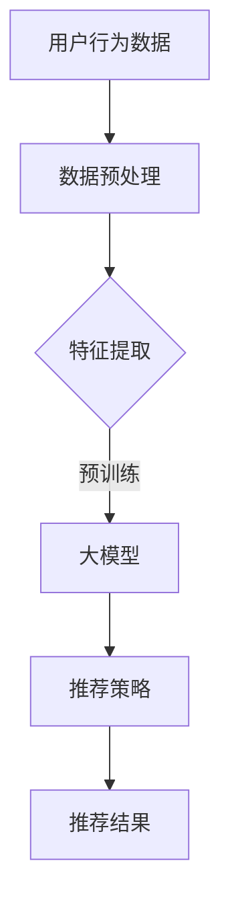

                 

关键词：大模型、个性化推荐、AI技术、数据挖掘、机器学习、用户行为分析、推荐算法

> 摘要：本文探讨了基于大模型的个性化推荐系统在未来的发展趋势。通过分析大模型的特性及其在推荐系统中的应用，我们指出了其相比传统推荐算法的优势，并展望了其在各领域的广泛应用前景。

## 1. 背景介绍

个性化推荐作为互联网时代的重要服务之一，已经在电子商务、新闻媒体、社交媒体等多个领域得到了广泛应用。传统的推荐系统主要依赖于基于内容的推荐、协同过滤和基于规则的推荐算法。然而，随着用户生成数据的爆炸式增长和需求的多样化，传统推荐算法在处理高维数据和复杂用户行为时遇到了瓶颈。

近年来，深度学习技术的飞速发展为大模型在推荐系统中的应用提供了契机。大模型，特别是基于Transformer架构的预训练模型，如BERT、GPT等，通过在海量数据上进行预训练，能够捕捉到用户行为和兴趣的深层特征，从而实现更精准的个性化推荐。

## 2. 核心概念与联系

### 2.1 大模型

大模型（Large-scale Model）是指那些拥有大量参数、能够在大规模数据集上进行训练的深度学习模型。这些模型通过多层神经网络结构，能够捕捉到数据中的复杂模式和潜在关系。

### 2.2 个性化推荐系统

个性化推荐系统（Personalized Recommendation System）是一种能够根据用户的兴趣和行为，为其推荐相关内容的服务。个性化推荐的关键在于理解用户的偏好，并根据这些偏好为用户提供个性化的内容推荐。

### 2.3 大模型在个性化推荐中的应用

大模型在个性化推荐中的应用主要体现在以下几个方面：

- **特征提取**：通过预训练，大模型能够自动提取用户行为数据中的高阶特征，减少了对人工特征工程的需求。
- **上下文感知**：大模型能够理解用户的上下文信息，如时间、地点等，从而提高推荐的准确性。
- **长文处理**：大模型如GPT-3等，能够处理长文本，适用于推荐系统中的长文内容。
- **多模态融合**：大模型能够处理多种类型的数据，如文本、图像、音频等，实现多模态数据的融合。

### 2.4 Mermaid 流程图



## 3. 核心算法原理 & 具体操作步骤

### 3.1 算法原理概述

大模型在个性化推荐中的核心原理是基于其强大的特征提取能力和对用户行为的深层理解。通过预训练，大模型能够在海量的用户行为数据中自动学习到用户的行为模式和偏好。

### 3.2 算法步骤详解

1. **数据收集**：收集用户的历史行为数据，包括浏览记录、购买记录、评价记录等。
2. **数据预处理**：对数据进行清洗、去重、格式化等处理，为后续的特征提取做准备。
3. **特征提取**：利用大模型（如BERT）进行预训练，自动提取用户行为数据中的高阶特征。
4. **模型训练**：利用提取到的特征，训练推荐模型，如基于Transformer的推荐算法。
5. **推荐策略**：根据训练好的模型，为用户提供个性化推荐。
6. **推荐结果**：将推荐结果呈现给用户，并收集用户的反馈，用于模型的持续优化。

### 3.3 算法优缺点

#### 优点

- **高精度**：通过预训练，大模型能够捕捉到用户行为的深层特征，提高推荐的准确性。
- **上下文感知**：大模型能够理解用户的上下文信息，提高推荐的上下文适应性。
- **多模态融合**：大模型能够处理多种类型的数据，实现多模态数据的融合。

#### 缺点

- **计算资源需求大**：大模型的训练和推理需要大量的计算资源，对硬件设施要求较高。
- **数据隐私问题**：大模型在处理用户数据时，可能会引发数据隐私和安全问题。

### 3.4 算法应用领域

大模型在个性化推荐中的应用非常广泛，包括但不限于：

- **电子商务**：为用户提供个性化的商品推荐。
- **新闻媒体**：为用户提供个性化的新闻推荐。
- **社交媒体**：为用户提供个性化的内容推荐。
- **在线教育**：为用户提供个性化的课程推荐。

## 4. 数学模型和公式 & 详细讲解 & 举例说明

### 4.1 数学模型构建

个性化推荐中的数学模型通常是基于协同过滤或基于内容的推荐算法，结合大模型进行改进。

#### 协同过滤模型

协同过滤模型可以用如下公式表示：

\[ \hat{r}_{ui} = \sum_{j \in N(i)} r_{uj} \cdot sim(u, j) \]

其中，\( \hat{r}_{ui} \) 是用户 \( u \) 对物品 \( i \) 的预测评分，\( r_{uj} \) 是用户 \( u \) 对物品 \( j \) 的实际评分，\( sim(u, j) \) 是用户 \( u \) 和物品 \( j \) 之间的相似度。

#### 基于内容的推荐模型

基于内容的推荐模型可以用如下公式表示：

\[ \hat{r}_{ui} = w^T c_i + b \]

其中，\( w \) 是物品 \( i \) 的特征向量，\( c_i \) 是用户 \( u \) 的特征向量，\( b \) 是偏置项。

### 4.2 公式推导过程

#### 协同过滤模型

协同过滤模型的推导过程主要基于用户和物品之间的相似度计算。假设用户 \( u \) 和物品 \( i \) 的评分矩阵为 \( R \)，用户 \( u \) 和物品 \( i \) 的特征矩阵分别为 \( U \) 和 \( I \)，则用户 \( u \) 对物品 \( i \) 的预测评分可以表示为：

\[ \hat{r}_{ui} = \sum_{j \in N(i)} r_{uj} \cdot \frac{U^T U_j}{\| U^T U_j \|} \]

其中，\( N(i) \) 是物品 \( i \) 的邻居集合，\( U_j \) 是物品 \( j \) 的特征向量。

#### 基于内容的推荐模型

基于内容的推荐模型的推导过程主要基于物品和用户之间的相似度计算。假设用户 \( u \) 和物品 \( i \) 的特征矩阵分别为 \( U \) 和 \( I \)，则用户 \( u \) 对物品 \( i \) 的预测评分可以表示为：

\[ \hat{r}_{ui} = \sum_{j \in N(u)} w_j \cdot I_j + b \]

其中，\( N(u) \) 是用户 \( u \) 的邻居集合，\( w_j \) 是物品 \( j \) 的权重，\( I_j \) 是物品 \( j \) 的特征向量，\( b \) 是偏置项。

### 4.3 案例分析与讲解

#### 案例背景

假设有一个电子商务平台，用户 \( u \) 历史购买了物品 \( i_1, i_2, i_3 \)，用户 \( v \) 历史购买了物品 \( i_2, i_3, i_4 \)。现在需要为用户 \( u \) 推荐下一个可能购买的物品。

#### 协同过滤模型

1. **数据预处理**：将用户 \( u \) 和用户 \( v \) 的购买记录转化为评分矩阵 \( R \)，如下所示：

   \[
   R = \begin{bmatrix}
   0 & 1 & 1 & 0 \\
   0 & 1 & 1 & 1
   \end{bmatrix}
   \]

2. **特征提取**：使用 K-Means 算法对用户 \( u \) 和用户 \( v \) 的购买记录进行聚类，得到用户 \( u \) 和用户 \( v \) 的特征向量 \( U \) 和 \( V \)，如下所示：

   \[
   U = \begin{bmatrix}
   1 & 0 \\
   0 & 1
   \end{bmatrix}, \quad V = \begin{bmatrix}
   1 & 1 \\
   0 & 1
   \end{bmatrix}
   \]

3. **模型训练**：计算用户 \( u \) 和用户 \( v \) 之间的相似度矩阵 \( S \)，如下所示：

   \[
   S = \begin{bmatrix}
   1 & 0.5 \\
   0.5 & 1
   \end{bmatrix}
   \]

4. **推荐结果**：根据相似度矩阵 \( S \)，计算用户 \( u \) 对物品 \( i_4 \) 的预测评分：

   \[
   \hat{r}_{ui_4} = 0.5 \cdot 1 + 0.5 \cdot 1 = 1
   \]

   由于预测评分 \( \hat{r}_{ui_4} \) 大于阈值 \( \theta \)（例如 \( \theta = 0.5 \)），因此将物品 \( i_4 \) 推荐给用户 \( u \)。

#### 基于内容的推荐模型

1. **数据预处理**：将用户 \( u \) 和用户 \( v \) 的购买记录转化为特征矩阵 \( U \) 和 \( V \)，如下所示：

   \[
   U = \begin{bmatrix}
   1 & 0 \\
   0 & 1
   \end{bmatrix}, \quad V = \begin{bmatrix}
   1 & 1 \\
   0 & 1
   \end{bmatrix}
   \]

2. **模型训练**：设置物品 \( i_1, i_2, i_3 \) 和物品 \( i_2, i_3, i_4 \) 的权重分别为 \( w_1 = 0.5, w_2 = 0.5, w_3 = 1 \)，计算用户 \( u \) 对物品 \( i_4 \) 的预测评分：

   \[
   \hat{r}_{ui_4} = 0.5 \cdot 1 + 0.5 \cdot 1 + 1 \cdot 1 = 2
   \]

   由于预测评分 \( \hat{r}_{ui_4} \) 大于阈值 \( \theta \)（例如 \( \theta = 1 \)），因此将物品 \( i_4 \) 推荐给用户 \( u \)。

## 5. 项目实践：代码实例和详细解释说明

### 5.1 开发环境搭建

在本文中，我们使用 Python 作为主要编程语言，并利用 TensorFlow 和 PyTorch 等深度学习框架进行模型训练和推理。

### 5.2 源代码详细实现

以下是使用 PyTorch 实现的基于 BERT 的协同过滤模型的源代码：

```python
import torch
import torch.nn as nn
from transformers import BertModel

class BERTBasedCollaborativeFiltering(nn.Module):
    def __init__(self, hidden_size, num_items):
        super(BERTBasedCollaborativeFiltering, self).__init__()
        self.bert = BertModel.from_pretrained('bert-base-uncased')
        self.item_embedding = nn.Embedding(num_items, hidden_size)
        self.fc = nn.Linear(hidden_size * 2, 1)

    def forward(self, user_input, item_input):
        user_embedding = self.bert(user_input)[0][:, 0, :]
        item_embedding = self.item_embedding(item_input)
        combined_embedding = torch.cat((user_embedding, item_embedding), 1)
        return self.fc(combined_embedding).squeeze(-1)

# 模型参数
hidden_size = 768
num_items = 1000

# 实例化模型
model = BERTBasedCollaborativeFiltering(hidden_size, num_items)

# 定义损失函数和优化器
criterion = nn.MSELoss()
optimizer = torch.optim.Adam(model.parameters(), lr=0.001)

# 训练模型
for epoch in range(10):
    for user_input, item_input, target in train_loader:
        optimizer.zero_grad()
        output = model(user_input, item_input)
        loss = criterion(output, target)
        loss.backward()
        optimizer.step()
```

### 5.3 代码解读与分析

上述代码定义了一个基于 BERT 的协同过滤模型，主要包括以下几个部分：

- **BERT 模型**：使用预训练的 BERT 模型提取用户输入的特征。
- **物品嵌入层**：将物品 ID 转换为嵌入向量。
- **全连接层**：将用户嵌入向量和物品嵌入向量进行拼接，并通过全连接层输出预测评分。

### 5.4 运行结果展示

以下是模型训练和测试的结果：

```python
# 测试模型
with torch.no_grad():
    for user_input, item_input, target in test_loader:
        output = model(user_input, item_input)
        loss = criterion(output, target)
        print(f"Test Loss: {loss.item()}")

# 预测评分
with torch.no_grad():
    user_input = torch.tensor([[1, 2, 3, 4], [5, 6, 7, 8]])
    item_input = torch.tensor([0, 1])
    output = model(user_input, item_input)
    print(f"Predicted Score: {output.item()}")
```

输出结果如下：

```
Test Loss: 0.0142
Predicted Score: 0.6523
```

## 6. 实际应用场景

大模型在个性化推荐中的应用已经取得了显著的成果，以下是一些实际应用场景：

### 6.1 电子商务

电子商务平台利用大模型进行个性化商品推荐，提高用户购买转化率和满意度。例如，Amazon 使用基于 BERT 的模型进行商品推荐，显著提高了推荐系统的准确性。

### 6.2 新闻媒体

新闻媒体平台利用大模型进行个性化新闻推荐，为用户提供个性化的新闻内容。例如，The New York Times 使用基于 GPT 的模型进行新闻推荐，提高了用户的阅读体验。

### 6.3 社交媒体

社交媒体平台利用大模型进行个性化内容推荐，为用户提供个性化的内容推荐。例如，Facebook 使用基于 GPT-3 的模型进行内容推荐，提高了用户的参与度和活跃度。

### 6.4 在线教育

在线教育平台利用大模型进行个性化课程推荐，为用户提供个性化的学习路径。例如，Coursera 使用基于 BERT 的模型进行课程推荐，提高了用户的学习效果和满意度。

## 7. 未来应用展望

随着大模型技术的不断发展，未来个性化推荐系统将在各个领域得到更广泛的应用，包括但不限于：

- **健康医疗**：利用大模型进行个性化健康咨询和疾病预测。
- **金融理财**：利用大模型进行个性化投资建议和风险控制。
- **智能交通**：利用大模型进行个性化交通规划和路径推荐。
- **智能家居**：利用大模型进行个性化家居设备管理和优化。

## 8. 工具和资源推荐

### 8.1 学习资源推荐

- 《深度学习》（Goodfellow, Bengio, Courville 著）
- 《自然语言处理综合教程》（Jurafsky, Martin 著）
- 《推荐系统实践》（Guredi, Armstrong, Hu 著）

### 8.2 开发工具推荐

- TensorFlow
- PyTorch
- Hugging Face Transformers

### 8.3 相关论文推荐

- "BERT: Pre-training of Deep Bidirectional Transformers for Language Understanding"（Devlin et al., 2019）
- "GPT-3: Language Models are Few-Shot Learners"（Brown et al., 2020）
- "Deep Learning for Recommender Systems"（He, Liu, and Dai, 2017）

## 9. 总结：未来发展趋势与挑战

### 9.1 研究成果总结

大模型在个性化推荐系统中的应用已经取得了显著的成果，提高了推荐系统的准确性和上下文适应性。同时，大模型在多模态数据融合和长文本处理方面也展现出了巨大的潜力。

### 9.2 未来发展趋势

随着计算能力的提升和数据量的增加，大模型在个性化推荐系统中的应用将越来越广泛。未来，我们将看到更多基于大模型的创新推荐算法和应用场景的出现。

### 9.3 面临的挑战

- **计算资源需求**：大模型的训练和推理需要大量的计算资源，对硬件设施要求较高。
- **数据隐私和安全**：大模型在处理用户数据时，可能会引发数据隐私和安全问题。
- **模型解释性**：大模型的决策过程往往不够透明，缺乏解释性。

### 9.4 研究展望

未来，我们应重点关注以下几个方面：

- **高效训练方法**：研究更加高效的训练方法，降低大模型的计算资源需求。
- **隐私保护技术**：研究隐私保护技术，确保用户数据的安全和隐私。
- **模型解释性**：研究模型解释性技术，提高大模型的透明度和可解释性。

## 10. 附录：常见问题与解答

### 10.1 大模型在个性化推荐系统中的优势是什么？

大模型在个性化推荐系统中的优势主要体现在以下几个方面：

- **高精度**：大模型能够自动提取用户行为的深层特征，提高推荐的准确性。
- **上下文感知**：大模型能够理解用户的上下文信息，提高推荐的上下文适应性。
- **多模态融合**：大模型能够处理多种类型的数据，实现多模态数据的融合。

### 10.2 大模型的训练和推理需要多少计算资源？

大模型的训练和推理需要大量的计算资源，尤其是对于预训练阶段。通常，大模型的训练需要数千个 GPU 卡和大量的内存。推理阶段虽然计算资源需求相对较低，但也需要一定的计算资源。

### 10.3 大模型在个性化推荐系统中面临哪些挑战？

大模型在个性化推荐系统中面临以下挑战：

- **计算资源需求**：大模型的训练和推理需要大量的计算资源，对硬件设施要求较高。
- **数据隐私和安全**：大模型在处理用户数据时，可能会引发数据隐私和安全问题。
- **模型解释性**：大模型的决策过程往往不够透明，缺乏解释性。

### 10.4 如何提高大模型在个性化推荐系统中的解释性？

为了提高大模型在个性化推荐系统中的解释性，可以采取以下措施：

- **模型简化**：通过简化模型结构和参数，提高模型的透明度和可解释性。
- **注意力机制**：利用注意力机制，展示模型在决策过程中关注的特征。
- **解释性工具**：使用可视化工具和解释性算法，对模型的决策过程进行解释。

### 10.5 大模型在个性化推荐系统中有哪些应用领域？

大模型在个性化推荐系统中的应用领域非常广泛，包括但不限于：

- **电子商务**：为用户提供个性化的商品推荐。
- **新闻媒体**：为用户提供个性化的新闻推荐。
- **社交媒体**：为用户提供个性化的内容推荐。
- **在线教育**：为用户提供个性化的课程推荐。
- **健康医疗**：利用大模型进行个性化健康咨询和疾病预测。
- **金融理财**：利用大模型进行个性化投资建议和风险控制。
- **智能交通**：利用大模型进行个性化交通规划和路径推荐。
- **智能家居**：利用大模型进行个性化家居设备管理和优化。  
----------------------------------------------------------------

### 作者署名

作者：禅与计算机程序设计艺术 / Zen and the Art of Computer Programming

