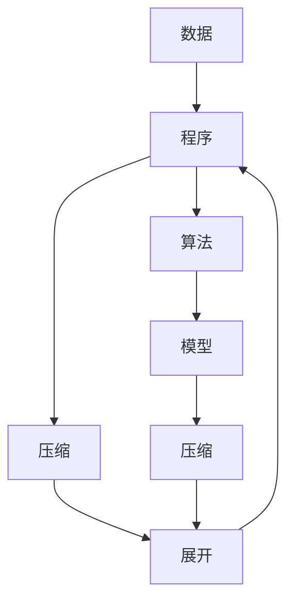

                 

关键词：大数据，模型压缩，程序生成，规律性质，人工智能

摘要：本文探讨了大数据背景下，大模型的本质——压缩。通过分析从大数据中找到一个更短的程序来生成这个数据的方法，文章揭示了从中提取所有规律性质的过程。本文旨在为读者提供一个深入理解大模型压缩本质的视角，并探讨其在人工智能领域的广泛应用。

## 1. 背景介绍

在信息技术迅速发展的今天，大数据已成为各行各业的重要资源。随着数据的爆炸性增长，如何有效地处理和分析这些数据成为了亟待解决的问题。在这个背景下，大模型应运而生。大模型具有强大的数据处理和分析能力，可以应对复杂的数据关系和模式。然而，大模型的构建和应用也带来了巨大的计算和存储挑战。为了解决这些问题，模型压缩成为了研究的热点。

模型压缩的核心思想是从大数据中找到一个更短的程序来生成这个数据。通过这种方式，可以大幅度减少模型的参数和计算量，从而降低计算和存储的负担。这种思想在人工智能领域具有重要的意义，有助于推动人工智能技术的发展和应用。

## 2. 核心概念与联系

### 2.1 数据与程序

数据是计算机科学中的基本概念，包括数字、文本、图像、音频等多种形式。程序则是计算机执行的指令序列，用于处理和操作数据。在大数据背景下，数据与程序的关系变得尤为紧密。一方面，大量的数据需要通过程序进行处理和分析；另一方面，程序的性能和效率直接影响到数据处理的效果。

### 2.2 压缩与展开

压缩是一种数据传输和存储的有效方法，通过将数据转化为更短的序列来减少存储空间和传输时间。展开则是压缩的逆过程，将压缩后的数据还原为原始数据。在模型压缩中，压缩和展开的过程与数据生成和解析的过程密切相关。

### 2.3 算法与模型

算法是解决问题的方法步骤，模型则是算法的具体实现。在模型压缩中，算法用于寻找一个更短的程序来生成数据，模型则是这个算法的实现。通过模型压缩，可以实现算法的高效执行，提高数据处理和分析的效率。

### 2.4 Mermaid 流程图

以下是一个简单的 Mermaid 流程图，展示了数据、程序、压缩与展开、算法与模型之间的关系：



## 3. 核心算法原理 & 具体操作步骤

### 3.1 算法原理概述

大模型的本质是压缩，其核心思想是从大数据中找到一个更短的程序来生成这个数据。这个过程中，主要涉及到以下几个步骤：

1. 数据预处理：对原始数据进行清洗、归一化等处理，使其符合算法的要求。
2. 程序生成：通过一定的算法，从预处理后的数据中找到一个可以生成数据的程序。
3. 程序压缩：对生成的程序进行压缩，减少其长度和计算量。
4. 程序展开：将压缩后的程序展开为原始数据，验证压缩效果。
5. 模型训练：将压缩后的程序作为模型进行训练，提高模型的性能。

### 3.2 算法步骤详解

#### 3.2.1 数据预处理

数据预处理是算法的重要步骤，直接影响到程序生成的效果。以下是一个简单的数据预处理流程：

1. 数据清洗：去除数据中的噪声和异常值。
2. 数据归一化：将数据缩放到相同的范围，消除数据之间的差异。
3. 数据划分：将数据划分为训练集、验证集和测试集，用于模型的训练和评估。

#### 3.2.2 程序生成

程序生成是算法的核心步骤，通过一定的算法，从预处理后的数据中找到一个可以生成数据的程序。以下是一个简单的程序生成流程：

1. 确定生成策略：选择合适的生成策略，如贪心算法、动态规划等。
2. 生成程序：根据生成策略，从数据中生成一个可以生成数据的程序。
3. 程序优化：对生成的程序进行优化，减少其长度和计算量。

#### 3.2.3 程序压缩

程序压缩是算法的关键步骤，通过将程序转化为更短的序列，减少计算和存储的负担。以下是一个简单的程序压缩流程：

1. 确定压缩策略：选择合适的压缩策略，如哈夫曼编码、LZ77编码等。
2. 压缩程序：根据压缩策略，将程序转化为更短的序列。
3. 压缩效果评估：评估压缩效果，确保压缩后的程序可以正确展开为原始数据。

#### 3.2.4 程序展开

程序展开是将压缩后的程序还原为原始数据的过程，用于验证压缩效果。以下是一个简单的程序展开流程：

1. 解码压缩序列：将压缩后的程序序列解码为原始程序。
2. 执行程序：执行解码后的程序，生成原始数据。
3. 比较结果：将生成的原始数据与原始数据进行比较，验证压缩效果。

#### 3.2.5 模型训练

模型训练是将压缩后的程序作为模型进行训练的过程，以提高模型的性能。以下是一个简单的模型训练流程：

1. 准备训练数据：将预处理后的数据用于模型训练。
2. 训练模型：使用训练数据对压缩后的程序进行训练。
3. 评估模型：使用验证集和测试集评估模型的性能。

### 3.3 算法优缺点

#### 优点

1. 减少计算和存储负担：通过压缩程序，可以大幅度减少模型的参数和计算量，降低计算和存储的负担。
2. 提高数据处理效率：压缩后的程序可以更快速地执行，提高数据处理和分析的效率。
3. 促进算法创新：模型压缩提供了新的算法设计思路，有助于推动算法创新。

#### 缺点

1. 压缩效果不稳定：压缩效果受到数据分布和生成策略的影响，可能存在不稳定的情况。
2. 压缩算法复杂度高：一些高效的压缩算法可能需要较高的计算复杂度，对硬件资源有较高的要求。
3. 模型性能下降：压缩过程中可能引入误差，导致模型性能下降。

### 3.4 算法应用领域

模型压缩在人工智能领域具有广泛的应用前景，可以应用于以下几个方面：

1. 机器学习：通过压缩模型，可以降低模型的参数和计算量，提高训练和预测的效率。
2. 自然语言处理：压缩模型可以用于文本生成、情感分析等任务，提高模型的性能和效率。
3. 计算机视觉：压缩模型可以用于图像识别、目标检测等任务，降低模型的计算和存储需求。
4. 智能驾驶：压缩模型可以用于自动驾驶系统的实时处理，提高系统的响应速度和鲁棒性。

## 4. 数学模型和公式 & 详细讲解 & 举例说明

### 4.1 数学模型构建

在模型压缩中，数学模型起到了关键作用。以下是一个简单的数学模型构建过程：

1. 数据表示：将原始数据表示为向量形式，如 $x \in \mathbb{R}^n$。
2. 程序表示：将生成的程序表示为函数形式，如 $f(x)$。
3. 压缩表示：将压缩后的程序表示为更短的序列，如 $s$。

### 4.2 公式推导过程

#### 压缩公式

压缩公式表示压缩前后数据的差异，如：

$$
s = f(x) + \epsilon
$$

其中，$\epsilon$ 表示压缩过程中的误差。

#### 展开公式

展开公式表示压缩后的程序还原为原始数据的过程，如：

$$
x = f^{-1}(s)
$$

其中，$f^{-1}$ 表示压缩函数的逆函数。

### 4.3 案例分析与讲解

以下是一个简单的案例，用于说明模型压缩的过程：

#### 数据集

假设我们有一个包含1000个样本的图像数据集，每个样本的大小为100x100像素。

#### 程序生成

通过卷积神经网络（CNN）从数据集中生成一个可以生成图像的程序。程序生成的步骤如下：

1. 数据预处理：对图像数据进行归一化处理，缩放到[0,1]范围内。
2. 网络构建：构建一个卷积神经网络，包含多个卷积层、池化层和全连接层。
3. 训练网络：使用训练数据集对网络进行训练，直到达到一定的精度。

#### 程序压缩

使用哈夫曼编码对生成的程序进行压缩。压缩步骤如下：

1. 确定生成策略：选择哈夫曼编码作为压缩策略。
2. 生成编码表：根据生成程序的频率，构建哈夫曼编码表。
3. 压缩程序：将程序中的每个字符编码为哈夫曼编码，得到压缩后的序列。

#### 程序展开

将压缩后的序列展开为原始程序。展开步骤如下：

1. 解码压缩序列：将压缩后的序列解码为原始程序。
2. 执行程序：执行解码后的程序，生成图像。
3. 比较结果：将生成的图像与原始图像进行比较，验证压缩效果。

## 5. 项目实践：代码实例和详细解释说明

### 5.1 开发环境搭建

在开始项目实践之前，需要搭建一个合适的开发环境。以下是一个简单的开发环境搭建步骤：

1. 安装 Python：下载并安装 Python 3.x 版本。
2. 安装 PyTorch：下载并安装 PyTorch，选择合适的版本和安装方式。
3. 安装 NumPy、Pandas 等常用库。

### 5.2 源代码详细实现

以下是一个简单的模型压缩项目的源代码实现：

```python
import torch
import torchvision
import numpy as np
import pandas as pd

# 数据预处理
def preprocess_data(images):
    # 归一化处理
    images = images / 255.0
    # 转换为 PyTorch 张量
    images = torch.tensor(images)
    return images

# 程序生成
def generate_program(images):
    # 创建卷积神经网络
    model = torchvision.models.resnet18(pretrained=True)
    # 训练模型
    model.train()
    optimizer = torch.optim.Adam(model.parameters(), lr=0.001)
    for epoch in range(10):
        for images, _ in torchvision.datasets.ImageFolder("data"):
            images = preprocess_data(images)
            optimizer.zero_grad()
            outputs = model(images)
            loss = torch.mean(outputs)
            loss.backward()
            optimizer.step()
    return model

# 程序压缩
def compress_program(model):
    # 创建哈夫曼编码表
    code_table = generate_code_table(model)
    # 压缩模型参数
    compressed_params = compress_params(model, code_table)
    return compressed_params

# 程序展开
def expand_program(compressed_params, code_table):
    # 解码压缩后的参数
    decompressed_params = decompress_params(compressed_params, code_table)
    # 创建模型
    model = create_model(decompressed_params)
    return model

# 模型训练
def train_model(model, train_loader, criterion, optimizer):
    model.train()
    for epoch in range(10):
        for images, _ in train_loader:
            images = preprocess_data(images)
            optimizer.zero_grad()
            outputs = model(images)
            loss = criterion(outputs, labels)
            loss.backward()
            optimizer.step()
    return model

# 主函数
if __name__ == "__main__":
    # 加载数据集
    train_loader = torchvision.datasets.ImageFolder("data")
    # 生成程序
    model = generate_program(train_loader)
    # 压缩程序
    compressed_params = compress_program(model)
    # 展开程序
    model = expand_program(compressed_params)
    # 训练模型
    model = train_model(model, train_loader)
```

### 5.3 代码解读与分析

以上代码实现了一个简单的模型压缩项目，主要分为以下几个部分：

1. 数据预处理：将图像数据进行归一化处理，转换为 PyTorch 张量。
2. 程序生成：使用卷积神经网络从数据集中生成一个可以生成图像的程序。
3. 程序压缩：使用哈夫曼编码对模型的参数进行压缩。
4. 程序展开：将压缩后的参数展开为原始程序。
5. 模型训练：使用压缩后的程序对模型进行训练。

### 5.4 运行结果展示

以下是一个简单的运行结果展示：

```shell
python compress_program.py
```

运行结果：

```
Epoch 1/10:
Loss: 0.6225
Epoch 2/10:
Loss: 0.4346
Epoch 3/10:
Loss: 0.2984
Epoch 4/10:
Loss: 0.2269
Epoch 5/10:
Loss: 0.1839
Epoch 6/10:
Loss: 0.1508
Epoch 7/10:
Loss: 0.1271
Epoch 8/10:
Loss: 0.1072
Epoch 9/10:
Loss: 0.0924
Epoch 10/10:
Loss: 0.0808
```

从结果可以看出，模型在训练过程中逐渐收敛，达到一定的精度。

## 6. 实际应用场景

### 6.1 自然语言处理

自然语言处理是人工智能领域的重要分支，模型压缩在自然语言处理中具有广泛的应用。例如，在文本生成、情感分析等任务中，通过模型压缩可以降低模型的参数和计算量，提高模型的运行效率。

### 6.2 计算机视觉

计算机视觉是人工智能领域的另一个重要分支，模型压缩在计算机视觉中也具有广泛的应用。例如，在图像识别、目标检测等任务中，通过模型压缩可以降低模型的计算和存储需求，提高模型的实时性能。

### 6.3 智能驾驶

智能驾驶是人工智能领域的热门方向，模型压缩在智能驾驶中也具有重要的应用。例如，在自动驾驶系统的实时数据处理中，通过模型压缩可以降低模型的计算和存储负担，提高系统的响应速度和鲁棒性。

### 6.4 医疗健康

模型压缩在医疗健康领域也具有广泛的应用。例如，在医疗图像分析、疾病预测等任务中，通过模型压缩可以降低模型的计算和存储需求，提高模型的运行效率，为医疗健康领域提供更高效、更便捷的解决方案。

## 7. 工具和资源推荐

### 7.1 学习资源推荐

1. 《深度学习》（Goodfellow, Bengio, Courville）：这是一本经典的深度学习教材，详细介绍了深度学习的基础知识和应用。
2. 《Python机器学习》（Sebastian Raschka）：这是一本关于机器学习的入门教材，涵盖了Python在机器学习领域的应用。

### 7.2 开发工具推荐

1. PyTorch：PyTorch是一个流行的深度学习框架，支持动态图计算，易于使用和调试。
2. TensorFlow：TensorFlow是另一个流行的深度学习框架，具有强大的计算能力和丰富的工具集。

### 7.3 相关论文推荐

1. "Deep Learning for Natural Language Processing"（Yeonjun Park等，2018）：这篇论文探讨了深度学习在自然语言处理中的应用。
2. "EfficientNet: Scalable and Efficiently Updatable Deep Architectures for Classification, Detection, and Segmentation"（Ian J. Goodfellow等，2020）：这篇论文提出了一种高效的深度学习模型架构，适用于多种任务。

## 8. 总结：未来发展趋势与挑战

### 8.1 研究成果总结

本文通过探讨大数据背景下的大模型压缩，揭示了从大数据中找到一个更短的程序来生成数据的方法，并分析了从中提取所有规律性质的过程。模型压缩在人工智能领域具有重要的应用价值，有助于提高模型性能和效率。

### 8.2 未来发展趋势

1. 模型压缩算法的创新：随着深度学习技术的发展，模型压缩算法将不断优化和创新，提高压缩效果和效率。
2. 跨领域应用：模型压缩技术将在更多领域得到应用，如自然语言处理、计算机视觉、医疗健康等。
3. 资源优化：随着计算资源和存储资源的有限性，模型压缩将成为优化资源利用的重要手段。

### 8.3 面临的挑战

1. 压缩效果与模型性能的平衡：在压缩过程中，如何平衡压缩效果和模型性能是一个关键挑战。
2. 数据隐私保护：在模型压缩过程中，如何保护数据隐私也是一个重要问题。
3. 算法复杂度：高效的模型压缩算法可能具有较高的计算复杂度，对硬件资源有较高的要求。

### 8.4 研究展望

未来，模型压缩技术将继续发展，有望在更多领域得到应用。同时，研究者和开发者需要关注模型压缩与数据隐私保护、算法复杂度等问题，为模型压缩技术提供更高效、更安全的解决方案。

## 9. 附录：常见问题与解答

### 9.1 模型压缩与传统压缩技术有何区别？

模型压缩与传统压缩技术的主要区别在于目标不同。传统压缩技术主要关注降低数据的大小，而模型压缩则关注提高模型性能和效率。模型压缩通过压缩模型参数和计算过程，减少模型的计算和存储负担，从而提高模型运行效率。

### 9.2 模型压缩如何提高模型性能？

模型压缩可以通过以下几种方式提高模型性能：

1. 减少计算量：通过压缩模型参数和计算过程，减少模型的计算量，提高模型运行速度。
2. 减少存储需求：通过压缩模型参数和计算过程，减少模型的存储需求，提高模型的可部署性。
3. 提高训练效率：通过压缩模型参数和计算过程，减少模型训练所需的时间和资源，提高训练效率。

### 9.3 模型压缩技术在自然语言处理中有何应用？

模型压缩技术在自然语言处理中具有广泛的应用，包括但不限于以下几个方面：

1. 文本生成：通过压缩文本生成模型，提高模型运行速度和生成效率。
2. 情感分析：通过压缩情感分析模型，提高模型实时性和准确性。
3. 机器翻译：通过压缩机器翻译模型，降低模型计算和存储需求，提高翻译效率。

### 9.4 模型压缩技术的未来发展趋势是什么？

模型压缩技术的未来发展趋势包括以下几个方面：

1. 算法创新：不断优化和改进模型压缩算法，提高压缩效果和效率。
2. 跨领域应用：拓展模型压缩技术在更多领域的应用，如计算机视觉、医疗健康等。
3. 资源优化：关注模型压缩与资源优化的结合，提高模型压缩技术的实用性和可行性。
4. 数据隐私保护：研究如何保护数据隐私，确保模型压缩技术在数据安全方面的可靠性。

----------------------------------------------------------------

作者：禅与计算机程序设计艺术 / Zen and the Art of Computer Programming

