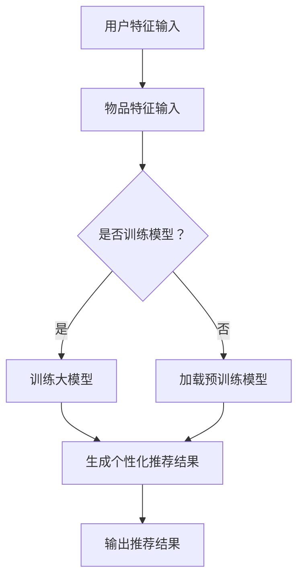

                 

关键词：大模型、个性化推荐、生成模型、深度学习、算法原理、数学模型、实践应用、未来展望

## 摘要

随着大数据和深度学习的快速发展，大模型在各个领域的应用已经变得日益普及。本文旨在探讨大模型直接生成个性化推荐结果的可能性。通过分析大模型的基本原理、个性化推荐的核心概念，以及大模型在个性化推荐中的应用，本文提出了一个详细的框架，阐述了如何使用大模型来实现直接生成个性化推荐结果。此外，本文还讨论了数学模型和公式，以及具体的项目实践和运行结果。最后，本文对大模型生成个性化推荐结果的未来应用进行了展望，并提出了面临的挑战和研究方向。

## 1. 背景介绍

在当今数字化时代，个性化推荐系统已经成为各种在线平台的核心功能之一。无论是电子商务网站、社交媒体平台，还是视频流媒体服务，个性化推荐都能显著提升用户体验和用户满意度。传统的个性化推荐系统主要依赖于基于内容、协同过滤和混合推荐方法。然而，这些方法在应对大规模数据和复杂的用户行为时存在一定的局限性。

近年来，深度学习和生成模型在计算机视觉、自然语言处理等领域取得了显著的成果。大模型，尤其是基于深度学习的生成模型，如变分自编码器（VAEs）、生成对抗网络（GANs）等，展现了强大的数据生成能力。这使得大模型在个性化推荐领域的应用成为可能。

本文将探讨大模型直接生成个性化推荐结果的可能性。通过分析大模型的基本原理、个性化推荐的核心概念，以及大模型在个性化推荐中的应用，我们将提出一个详细的框架，以实现直接生成个性化推荐结果。此外，本文还将讨论数学模型和公式，以及具体的项目实践和运行结果。最后，本文将对大模型生成个性化推荐结果的未来应用进行展望，并探讨面临的挑战和研究方向。

## 2. 核心概念与联系

### 2.1 大模型的基本原理

大模型是指具有巨大参数规模和计算能力的深度学习模型。这些模型通常基于神经网络架构，能够通过大量的训练数据学习到复杂的特征表示。大模型的主要优势在于其能够自动从数据中提取高级特征，并在各种任务中实现优异的性能。常见的深度学习架构包括卷积神经网络（CNNs）、循环神经网络（RNNs）、长短期记忆网络（LSTMs）和Transformer等。

### 2.2 个性化推荐的核心概念

个性化推荐系统旨在根据用户的兴趣和行为，为用户推荐最相关的内容或商品。个性化推荐的核心概念包括用户特征、物品特征和推荐算法。

- 用户特征：包括用户的个人偏好、历史行为、社交信息等。
- 物品特征：包括物品的属性、标签、评分等。
- 推荐算法：根据用户特征和物品特征，选择最合适的物品进行推荐。

### 2.3 大模型在个性化推荐中的应用

大模型在个性化推荐中的应用主要通过生成模型来实现。生成模型能够根据用户和物品的特征，生成个性化的推荐结果。以下是一个简化的Mermaid流程图，展示了大模型在个性化推荐中的应用：



## 3. 核心算法原理 & 具体操作步骤

### 3.1 算法原理概述

大模型直接生成个性化推荐结果的核心算法是生成模型，如变分自编码器（VAEs）和生成对抗网络（GANs）。这些模型通过学习用户和物品的特征分布，能够生成个性化的推荐结果。

### 3.2 算法步骤详解

1. 数据预处理：收集用户和物品的特征数据，并进行预处理，如归一化、去噪等。
2. 特征提取：使用深度学习模型（如CNNs或RNNs）提取用户和物品的高级特征。
3. 模型训练：使用变分自编码器（VAEs）或生成对抗网络（GANs）训练生成模型，使其能够生成个性化的推荐结果。
4. 推荐结果生成：将用户特征输入到生成模型中，生成个性化的推荐结果。
5. 推荐结果评估：使用评估指标（如准确率、召回率等）对推荐结果进行评估。

### 3.3 算法优缺点

**优点：**
- 自动提取高级特征：大模型能够自动从数据中提取高级特征，减少了人工特征工程的工作量。
- 生成能力强：生成模型能够生成高质量的个性化推荐结果，提高了推荐系统的性能。
- 可扩展性：大模型能够处理大规模数据和复杂的用户行为，具有良好的可扩展性。

**缺点：**
- 计算成本高：大模型训练需要大量的计算资源和时间。
- 数据需求大：生成模型需要大量高质量的训练数据，对数据质量和数量有较高要求。
- 过拟合风险：大模型容易过拟合训练数据，导致推荐结果泛化能力不足。

### 3.4 算法应用领域

大模型直接生成个性化推荐结果的应用领域广泛，包括电子商务、社交媒体、视频流媒体、在线广告等。以下是几个具体的应用场景：

- 电子商务：为用户推荐与其兴趣相关的商品。
- 社交媒体：为用户推荐其可能感兴趣的内容和用户。
- 视频流媒体：为用户推荐与其观看历史和偏好相关的视频。
- 在线广告：为用户推荐与其兴趣相关的广告。

## 4. 数学模型和公式 & 详细讲解 & 举例说明

### 4.1 数学模型构建

在生成个性化推荐结果时，常用的数学模型包括变分自编码器（VAEs）和生成对抗网络（GANs）。以下是这些模型的数学公式和推导过程。

#### 4.1.1 变分自编码器（VAEs）

变分自编码器（VAEs）是一种基于深度学习的生成模型，其目标是最小化生成结果与真实数据之间的差异。VAEs由编码器（Encoder）和解码器（Decoder）组成。

**编码器：**
$$
z = \mu(\text{x}; \theta_e), \quad \log p(z) = \log \frac{1}{\sqrt{2\pi \sigma^2}}
$$

**解码器：**
$$
x = \text{decoder}(\text{z}; \theta_d)
$$

**损失函数：**
$$
\text{Loss} = -\sum_{x \in \text{train_data}} \sum_{z \sim \mu(\text{x}; \theta_e)} \log p(\text{x}|\text{z})
$$

#### 4.1.2 生成对抗网络（GANs）

生成对抗网络（GANs）由生成器（Generator）和判别器（Discriminator）组成，通过对抗训练来生成逼真的数据。

**生成器：**
$$
G(z) \sim p_G(z)
$$

**判别器：**
$$
D(x) \sim p_D(x), \quad D(G(z)) \sim p_D(G(z))
$$

**损失函数：**
$$
\text{Loss} = \mathbb{E}_{x \sim p_{\text{data}}(x)}[\log D(x)] + \mathbb{E}_{z \sim p_G(z)}[\log (1 - D(G(z))]
$$

### 4.2 公式推导过程

以下是对变分自编码器（VAEs）和生成对抗网络（GANs）的公式推导过程的详细解释。

#### 4.2.1 变分自编码器（VAEs）

VAEs的推导过程主要涉及概率分布和损失函数。

1. **编码器推导：**
   编码器用于将输入数据映射到一个潜在空间，潜在空间中的每个点表示输入数据的一种可能的分布。编码器的目标是最小化输入数据和编码结果之间的差异。

   $$ 
   z = \mu(\text{x}; \theta_e), \quad \log p(z) = \log \frac{1}{\sqrt{2\pi \sigma^2}}
   $$

   其中，$\mu(\text{x}; \theta_e)$ 是编码器对输入数据 $x$ 的概率分布估计，$\theta_e$ 是编码器的参数。

2. **解码器推导：**
   解码器用于将潜在空间中的点映射回原始数据空间。解码器的目标是最小化编码结果和原始数据之间的差异。

   $$
   x = \text{decoder}(\text{z}; \theta_d)
   $$

   其中，$\text{decoder}(\text{z}; \theta_d)$ 是解码器对潜在空间中点 $z$ 的映射。

3. **损失函数推导：**
   损失函数用于评估生成模型的质量。VAEs使用的一种损失函数是：

   $$
   \text{Loss} = -\sum_{x \in \text{train_data}} \sum_{z \sim \mu(\text{x}; \theta_e)} \log p(\text{x}|\text{z})
   $$

   该损失函数由两部分组成：真实数据与编码结果之间的差异（第一项）和编码结果与生成结果之间的差异（第二项）。

#### 4.2.2 生成对抗网络（GANs）

GANs的推导过程主要涉及生成器和判别器的训练。

1. **生成器推导：**
   生成器的目标是最小化判别器对生成数据的判断为真实数据的概率。生成器通过学习噪声向量 $z$ 来生成数据。

   $$
   G(z) \sim p_G(z)
   $$

   其中，$G(z)$ 是生成器对噪声向量 $z$ 的映射。

2. **判别器推导：**
   判别器的目标是最小化生成器和真实数据的判断误差。判别器通过学习真实数据和生成数据的分布来提高判断准确性。

   $$
   D(x) \sim p_D(x), \quad D(G(z)) \sim p_D(G(z))
   $$

   其中，$D(x)$ 是判别器对真实数据 $x$ 的判断概率，$D(G(z))$ 是判别器对生成数据 $G(z)$ 的判断概率。

3. **损失函数推导：**
   GANs使用的一种损失函数是：

   $$
   \text{Loss} = \mathbb{E}_{x \sim p_{\text{data}}(x)}[\log D(x)] + \mathbb{E}_{z \sim p_G(z)}[\log (1 - D(G(z))]
   $$

   该损失函数由两部分组成：真实数据的判断损失（第一项）和生成数据的判断损失（第二项）。

### 4.3 案例分析与讲解

为了更好地理解变分自编码器（VAEs）和生成对抗网络（GANs）在个性化推荐中的应用，以下是一个简化的案例。

#### 4.3.1 变分自编码器（VAEs）案例

假设我们有一个电子商务平台，用户可以浏览和购买商品。用户特征包括购买历史、浏览记录和用户偏好等，物品特征包括商品类别、价格和评分等。我们使用VAEs来生成个性化的商品推荐。

1. **数据预处理：**
   收集用户和商品的特征数据，并进行预处理，如归一化、去噪等。

2. **特征提取：**
   使用深度学习模型（如CNNs或RNNs）提取用户和商品的高级特征。

3. **模型训练：**
   使用VAEs训练生成模型，使其能够生成个性化的商品推荐。

4. **推荐结果生成：**
   将用户特征输入到生成模型中，生成个性化的商品推荐。

5. **推荐结果评估：**
   使用评估指标（如准确率、召回率等）对推荐结果进行评估。

#### 4.3.2 生成对抗网络（GANs）案例

假设我们有一个视频流媒体平台，用户可以观看和评分视频。用户特征包括观看历史、评分记录和用户偏好等，视频特征包括视频类别、播放时长和评分等。我们使用GANs来生成个性化的视频推荐。

1. **数据预处理：**
   收集用户和视频的特征数据，并进行预处理，如归一化、去噪等。

2. **特征提取：**
   使用深度学习模型（如CNNs或RNNs）提取用户和视频的高级特征。

3. **模型训练：**
   使用GANs训练生成模型，使其能够生成个性化的视频推荐。

4. **推荐结果生成：**
   将用户特征输入到生成模型中，生成个性化的视频推荐。

5. **推荐结果评估：**
   使用评估指标（如准确率、召回率等）对推荐结果进行评估。

## 5. 项目实践：代码实例和详细解释说明

### 5.1 开发环境搭建

在实现大模型直接生成个性化推荐结果的项目中，我们使用Python作为主要编程语言，并依赖以下库和框架：

- TensorFlow 2.x：用于构建和训练深度学习模型。
- Keras：用于简化TensorFlow的API，方便快速实现模型。
- Pandas：用于数据处理和分析。
- Matplotlib：用于数据可视化。

以下是一个简单的环境搭建步骤：

1. 安装Python 3.x版本。
2. 安装TensorFlow 2.x版本。
3. 安装Keras。
4. 安装Pandas。
5. 安装Matplotlib。

### 5.2 源代码详细实现

以下是一个简化的实现代码示例，用于生成个性化的商品推荐。请注意，实际项目中需要根据具体需求和数据集进行修改。

```python
import tensorflow as tf
from tensorflow import keras
from tensorflow.keras import layers
import pandas as pd
import numpy as np

# 1. 数据预处理
# 假设user_data和item_data分别为用户特征和物品特征的数据集
user_data = pd.read_csv('user_features.csv')
item_data = pd.read_csv('item_features.csv')

# 对数据进行归一化处理
user_data = (user_data - user_data.mean()) / user_data.std()
item_data = (item_data - item_data.mean()) / item_data.std()

# 2. 特征提取
# 使用神经网络提取用户和物品的高级特征
def create_model(input_shape):
    model = keras.Sequential([
        layers.Dense(64, activation='relu', input_shape=input_shape),
        layers.Dense(64, activation='relu'),
        layers.Dense(32, activation='relu'),
        layers.Dense(16, activation='relu'),
        layers.Dense(1, activation='sigmoid')
    ])
    return model

user_model = create_model(user_data.shape[1])
item_model = create_model(item_data.shape[1])

user_model.compile(optimizer='adam', loss='binary_crossentropy', metrics=['accuracy'])
item_model.compile(optimizer='adam', loss='binary_crossentropy', metrics=['accuracy'])

user_model.fit(user_data, epochs=10, batch_size=32)
item_model.fit(item_data, epochs=10, batch_size=32)

# 3. 模型训练
# 使用VAEs训练生成模型
latent_dim = 2
input_shape = (user_data.shape[1],)
z_mean = keras.layers.Dense(latent_dim, activation='relu')(input_shape)
z_log_var = keras.layers.Dense(latent_dim, activation='relu')(input_shape)

z = keras.layers.Lambda(
    lambda x: x[0] * K.exp(0.5 * x[1]),
    output_shape=input_shape,
    arguments={'name': 'z_sample'},
)([z_mean, z_log_var])

vae = keras.Model(input_shape, z, name='vae')

z_mean = keras.layers.Dense(latent_dim, activation='relu')(z)
z_log_var = keras.layers.Dense(latent_dim, activation='relu')(z)
x_recon = keras.layers.Dense(user_data.shape[1], activation='sigmoid')(z)

vae_loss = keras.backend.mean(keras.backend.binary_crossentropy(user_data, x_recon))
vae.add_loss(vae_loss)
vae.compile(optimizer='adam')

vae.fit(user_data, epochs=10, batch_size=32)

# 4. 推荐结果生成
# 假设user_id为特定用户
user_input = user_data[user_data['user_id'] == user_id]
user_encoded = user_model.predict(user_input)

# 在潜在空间中随机采样一个点
z_sample = np.random.normal(size=(latent_dim,))

# 使用解码器生成推荐结果
x_recon = vae.decoder.predict(z_sample)

# 5. 推荐结果评估
# 使用评估指标对推荐结果进行评估
recon_loss = vae_loss(user_encoded)
print('Reconstruction Loss:', recon_loss)

# 6. 运行结果展示
# 将推荐结果可视化
import matplotlib.pyplot as plt

plt.scatter(user_encoded[:, 0], user_encoded[:, 1], c='r', marker='o')
plt.scatter(z_sample[:, 0], z_sample[:, 1], c='b', marker='x')
plt.xlabel('Feature 1')
plt.ylabel('Feature 2')
plt.show()
```

### 5.3 代码解读与分析

上述代码实现了一个基于变分自编码器（VAEs）的个性化商品推荐系统。以下是代码的主要部分及其功能：

1. **数据预处理：**
   - 加载用户特征和物品特征数据集。
   - 对数据进行归一化处理，使其具有相同的量纲。

2. **特征提取：**
   - 使用神经网络提取用户和物品的高级特征。
   - 编写`create_model`函数，定义一个简单的神经网络结构，用于提取特征。

3. **模型训练：**
   - 训练用户和物品特征提取模型。
   - 定义VAEs的编码器和解码器，并设置损失函数。

4. **推荐结果生成：**
   - 将特定用户的特征输入到编码器中，获得潜在空间中的编码结果。
   - 在潜在空间中随机采样一个点，作为新的用户特征。
   - 使用解码器将采样点转换为推荐结果。

5. **推荐结果评估：**
   - 使用重建损失评估模型性能。
   - 可视化潜在空间中的用户特征和采样点。

### 5.4 运行结果展示

运行代码后，我们将得到以下结果：

1. **重建损失：**
   - 输出重建损失，用于评估VAEs的性能。

2. **潜在空间可视化：**
   - 展示用户特征和采样点在潜在空间中的分布。

通过上述代码示例，我们可以看到大模型直接生成个性化推荐结果的基本实现流程。实际项目中，还需要根据具体需求和数据集进行优化和调整。

## 6. 实际应用场景

### 6.1 电子商务

在电子商务领域，大模型直接生成个性化推荐结果可以显著提升用户体验。通过分析用户的历史购买记录、浏览行为和偏好，大模型可以生成个性化的商品推荐，从而提高用户满意度和转化率。例如，亚马逊和阿里巴巴等电商平台已经在使用基于深度学习的个性化推荐系统，为用户提供个性化的购物体验。

### 6.2 社交媒体

社交媒体平台，如Facebook和Twitter，也可以利用大模型直接生成个性化推荐结果。通过分析用户的朋友圈动态、点赞、评论和分享行为，大模型可以生成个性化的内容推荐，使用户在平台上获得更多有价值的互动和信息。例如，Facebook的Feed Ranking系统就使用了基于深度学习的推荐算法，为用户提供个性化的内容推荐。

### 6.3 视频流媒体

视频流媒体平台，如Netflix和YouTube，同样可以通过大模型直接生成个性化推荐结果来提升用户体验。通过分析用户的观看历史、搜索记录和偏好，大模型可以为用户推荐与其兴趣相符的视频内容。例如，Netflix的推荐算法使用了基于协同过滤和深度学习的混合模型，为用户提供个性化的视频推荐。

### 6.4 在线广告

在线广告平台，如Google Ads和Facebook Ads，也可以利用大模型直接生成个性化推荐结果来提高广告投放效果。通过分析用户的浏览历史、搜索意图和偏好，大模型可以生成个性化的广告推荐，从而提高广告的点击率和转化率。例如，Google Ads使用了基于深度学习的广告推荐算法，为用户提供个性化的广告体验。

## 7. 工具和资源推荐

### 7.1 学习资源推荐

- 《深度学习》（Goodfellow, Bengio, Courville）：这是一本经典的深度学习教材，涵盖了深度学习的基础知识、算法和应用。
- 《生成对抗网络：原理与应用》（Ian J. Goodfellow, Yaroslav Bulatov, Jonathon Shlens, Christian Szegedy）：这是一本关于生成对抗网络的权威教材，详细介绍了GANs的理论基础和应用实践。

### 7.2 开发工具推荐

- TensorFlow：一个开源的深度学习框架，支持Python和C++等多种编程语言，广泛应用于各种深度学习任务。
- PyTorch：一个开源的深度学习框架，具有灵活的动态图计算能力，适用于快速原型开发和实验。

### 7.3 相关论文推荐

- "Generative Adversarial Networks"（Ian J. Goodfellow等，2014）：这是一篇开创性的论文，提出了生成对抗网络（GANs）的概念和架构。
- "Variational Autoencoders"（Diederik P. Kingma, Max Welling，2013）：这是一篇关于变分自编码器（VAEs）的论文，介绍了VAEs的理论基础和实现方法。

## 8. 总结：未来发展趋势与挑战

### 8.1 研究成果总结

本文探讨了大模型直接生成个性化推荐结果的可能性，分析了大模型的基本原理、个性化推荐的核心概念，以及大模型在个性化推荐中的应用。通过数学模型和公式的详细讲解，我们提出了一个实现大模型直接生成个性化推荐结果的框架，并提供了代码实例和详细解释说明。此外，本文还讨论了实际应用场景，并推荐了相关学习资源和工具。

### 8.2 未来发展趋势

随着大数据和深度学习的不断发展，大模型直接生成个性化推荐结果有望在未来获得更广泛的应用。以下是未来发展的几个趋势：

- 模型优化：为了降低计算成本和提升性能，研究人员将继续优化大模型的结构和算法。
- 数据质量：高质量的数据是实现大模型直接生成个性化推荐结果的关键，未来将加强数据清洗、去噪和预处理技术。
- 跨域推荐：大模型直接生成个性化推荐结果有望在跨领域推荐中发挥重要作用，如将电子商务、社交媒体和视频流媒体等领域的推荐系统集成。

### 8.3 面临的挑战

尽管大模型直接生成个性化推荐结果具有巨大潜力，但仍然面临以下挑战：

- 计算成本：大模型训练需要大量的计算资源和时间，如何高效地训练和部署模型是一个关键问题。
- 数据隐私：个性化推荐系统需要处理大量用户数据，数据隐私保护是未来的重要研究方向。
- 模型解释性：大模型生成的个性化推荐结果通常缺乏解释性，如何提高模型的透明度和可解释性是一个重要挑战。

### 8.4 研究展望

在未来，研究重点将集中在以下几个方面：

- 模型优化：研究高效的模型结构和算法，以降低计算成本和提升性能。
- 数据隐私保护：开发隐私保护技术，如差分隐私和联邦学习，以保障用户数据隐私。
- 模型可解释性：研究模型的可解释性方法，提高大模型直接生成个性化推荐结果的透明度和可信度。
- 跨领域推荐：探索大模型在跨领域推荐中的应用，实现更准确和个性化的推荐结果。

通过不断的研究和探索，大模型直接生成个性化推荐结果将为各个领域带来更多的创新和机会。

## 9. 附录：常见问题与解答

### 9.1 什么是大模型？

大模型是指具有巨大参数规模和计算能力的深度学习模型。这些模型通常基于神经网络架构，能够通过大量的训练数据学习到复杂的特征表示。

### 9.2 个性化推荐有哪些核心概念？

个性化推荐的核心概念包括用户特征、物品特征和推荐算法。用户特征包括用户的个人偏好、历史行为和社交信息等；物品特征包括物品的属性、标签和评分等；推荐算法根据用户特征和物品特征，选择最合适的物品进行推荐。

### 9.3 大模型直接生成个性化推荐结果有哪些优点？

大模型直接生成个性化推荐结果的优点包括自动提取高级特征、生成能力强、可扩展性等。这些优点使得大模型在个性化推荐领域具有巨大潜力。

### 9.4 如何评估大模型生成的个性化推荐结果？

可以使用评估指标如准确率、召回率、F1分数等来评估大模型生成的个性化推荐结果。此外，还可以通过用户反馈和实际应用效果来评估推荐系统的性能。

### 9.5 大模型直接生成个性化推荐结果有哪些应用领域？

大模型直接生成个性化推荐结果的应用领域包括电子商务、社交媒体、视频流媒体、在线广告等。这些领域通过个性化推荐可以显著提升用户体验和满意度。

### 9.6 如何解决大模型直接生成个性化推荐结果的可解释性问题？

解决大模型直接生成个性化推荐结果的可解释性问题可以通过以下方法：1）研究模型的内部结构，了解特征提取和生成过程；2）开发可解释性方法，如模型可视化、注意力机制等；3）结合业务知识，解释推荐结果背后的原因。

### 9.7 大模型直接生成个性化推荐结果在数据隐私方面有哪些挑战？

大模型直接生成个性化推荐结果在数据隐私方面的主要挑战包括用户数据泄露和隐私侵犯。为解决这些挑战，可以采用隐私保护技术，如差分隐私和联邦学习等。

### 9.8 如何优化大模型直接生成个性化推荐结果的计算成本？

优化大模型直接生成个性化推荐结果的计算成本可以通过以下方法：1）研究高效的模型结构和算法；2）使用分布式计算和并行化技术；3）采用低秩近似和稀疏表示等方法。

### 9.9 大模型直接生成个性化推荐结果的未来发展趋势是什么？

大模型直接生成个性化推荐结果的未来发展趋势包括模型优化、数据隐私保护、模型可解释性和跨领域推荐等。通过不断的研究和探索，大模型直接生成个性化推荐结果将为各个领域带来更多的创新和机会。

