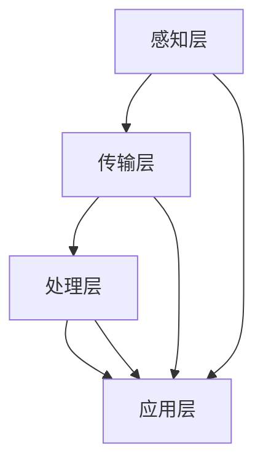

                 

关键词：大模型，智慧园林，智能化养护，植被管理，AI技术，园林创业，技术应用

> 摘要：随着人工智能技术的快速发展，园林植被的智能化养护与管理成为可能。本文将探讨大模型在智慧园林中的应用，分析创业者如何利用AI技术实现园林植被的智能化养护与管理，并展望未来这一领域的发展趋势与挑战。

## 1. 背景介绍

园林，作为城市景观的重要组成部分，不仅美化环境、提升城市品质，还承载着文化传承和生态保护的重要使命。然而，传统的园林养护管理方式往往依赖人工经验，效率低、成本高且难以精准。随着城市化进程的加快，园林面积不断扩大，养护管理任务日益繁重。这种背景下，智能化养护与管理成为园林行业转型升级的必然选择。

近年来，人工智能技术的迅猛发展，特别是大模型技术的应用，为园林植被的智能化养护与管理提供了新的思路和可能性。大模型，如深度学习神经网络，能够通过大量数据的学习，实现对植被生长状态、病虫害预测、环境监测等方面的智能分析，从而提供精准的养护建议。这不仅提高了养护效率，降低了管理成本，还显著提升了园林景观的质量和可持续性。

## 2. 核心概念与联系

### 2.1 大模型原理

大模型，通常指的是深度学习模型，尤其是深度神经网络（DNN）和其变种，如卷积神经网络（CNN）和循环神经网络（RNN）。这些模型通过多层神经网络结构，能够自动提取数据特征，进行复杂的模式识别和预测。大模型的优势在于其强大的学习和自适应能力，能够处理海量数据，实现高精度的预测和分析。

### 2.2 智慧园林架构

智慧园林的架构可以分为感知层、传输层、处理层和应用层。感知层负责收集植被生长数据、环境监测数据等；传输层负责将数据传输至处理层；处理层利用大模型进行数据分析和预测；应用层则将分析结果转化为实际的养护管理措施。以下是一个简化的智慧园林架构图：



### 2.3 大模型与智慧园林的联系

大模型在智慧园林中的应用主要体现在以下几个方面：

1. **植被健康监测**：通过分析植被生长数据，大模型可以实时监测植被的健康状况，预测病虫害的发生，提供预警信息。
2. **环境监测与调控**：大模型可以分析环境数据，如土壤湿度、光照强度、气温等，为园林的灌溉、施肥、修剪等提供科学依据。
3. **景观优化设计**：大模型可以根据环境数据和植被特性，优化园林景观设计，实现最佳生态效果。
4. **智能预警与应急响应**：大模型可以实时分析园林运行状态，预测潜在问题，提前采取应急措施，确保园林安全。

## 3. 核心算法原理 & 具体操作步骤

### 3.1 算法原理概述

智慧园林中常用的核心算法包括：

1. **深度学习神经网络（DNN）**：通过多层神经网络结构，自动提取数据特征，实现植被健康监测和预测。
2. **卷积神经网络（CNN）**：特别适用于图像处理，可以用于植被图像识别和病虫害检测。
3. **循环神经网络（RNN）**：适合处理序列数据，可以用于环境数据的分析和预测。

### 3.2 算法步骤详解

1. **数据收集**：收集植被生长数据、环境监测数据等。
2. **数据预处理**：对数据进行清洗、归一化等处理，使其适合模型训练。
3. **模型训练**：使用收集到的数据，训练深度学习神经网络模型。
4. **模型评估**：使用验证集评估模型性能，调整模型参数。
5. **模型部署**：将训练好的模型部署到园林管理系统中，进行实时监测和预测。
6. **结果应用**：根据模型预测结果，采取相应的养护管理措施。

### 3.3 算法优缺点

**优点**：

1. **高效性**：大模型能够快速处理大量数据，提供实时预测。
2. **准确性**：通过自动提取数据特征，实现高精度的植被监测和预测。
3. **自动化**：减少人工干预，降低养护管理成本。

**缺点**：

1. **数据依赖性**：模型性能依赖于数据质量和数量，数据不足可能导致预测不准确。
2. **计算资源需求**：大模型训练和部署需要较高的计算资源，可能增加硬件成本。

### 3.4 算法应用领域

1. **植被健康监测**：用于实时监测植被生长状态，预测病虫害。
2. **环境监测与调控**：用于分析环境数据，提供科学依据进行园林管理。
3. **景观优化设计**：用于优化园林景观设计，实现最佳生态效果。
4. **智能预警与应急响应**：用于实时分析园林运行状态，提前采取应急措施。

## 4. 数学模型和公式 & 详细讲解 & 举例说明

### 4.1 数学模型构建

在智慧园林中，常用的数学模型包括：

1. **线性回归模型**：用于预测植被生长状态。
2. **逻辑回归模型**：用于预测病虫害的发生。
3. **卷积神经网络（CNN）模型**：用于植被图像识别和病虫害检测。

### 4.2 公式推导过程

以线性回归模型为例，公式推导如下：

$$
y = \beta_0 + \beta_1x_1 + \beta_2x_2 + ... + \beta_nx_n + \epsilon
$$

其中，$y$ 为植被生长状态，$x_1, x_2, ..., x_n$ 为影响植被生长的各个因素，$\beta_0, \beta_1, \beta_2, ..., \beta_n$ 为模型参数，$\epsilon$ 为误差项。

### 4.3 案例分析与讲解

假设我们有一个植被生长数据集，包括温度、湿度、光照强度等影响因素。我们可以使用线性回归模型预测植被的生长状态。具体步骤如下：

1. **数据收集**：收集植被生长数据，包括温度、湿度、光照强度等。
2. **数据预处理**：对数据进行清洗、归一化等处理。
3. **模型训练**：使用数据集训练线性回归模型。
4. **模型评估**：使用验证集评估模型性能，调整模型参数。
5. **模型部署**：将训练好的模型部署到园林管理系统中，进行实时监测和预测。
6. **结果应用**：根据模型预测结果，采取相应的养护管理措施。

假设我们得到的模型公式为：

$$
y = 10 + 0.5x_1 + 0.3x_2 + 0.2x_3
$$

其中，$x_1$ 为温度，$x_2$ 为湿度，$x_3$ 为光照强度。我们可以根据实时获取的温度、湿度、光照强度，预测植被的生长状态。

## 5. 项目实践：代码实例和详细解释说明

### 5.1 开发环境搭建

为了实现智慧园林的智能化养护与管理，我们需要搭建一个开发环境。以下是所需的开发环境和工具：

1. **操作系统**：Linux（如Ubuntu）
2. **编程语言**：Python
3. **深度学习框架**：TensorFlow或PyTorch
4. **数据预处理工具**：NumPy、Pandas
5. **可视化工具**：Matplotlib、Seaborn

安装这些工具和框架，可以使用以下命令：

```bash
sudo apt-get update
sudo apt-get install python3-pip
pip3 install tensorflow numpy pandas matplotlib seaborn
```

### 5.2 源代码详细实现

以下是实现智慧园林的核心算法——线性回归模型的Python代码示例：

```python
import numpy as np
import pandas as pd
from sklearn.linear_model import LinearRegression
import matplotlib.pyplot as plt

# 5.2.1 数据收集
# 假设数据文件名为 'vegetation_data.csv'
data = pd.read_csv('vegetation_data.csv')

# 5.2.2 数据预处理
# 清洗数据、归一化处理等
data = data.dropna()
data = (data - data.mean()) / data.std()

# 5.2.3 模型训练
model = LinearRegression()
model.fit(data[['temperature', 'humidity', 'light']], data['growth'])

# 5.2.4 模型评估
score = model.score(data[['temperature', 'humidity', 'light']], data['growth'])
print(f'Model R^2 Score: {score}')

# 5.2.5 模型部署
# 假设实时数据为 [25, 60, 1000]
real_time_data = np.array([25, 60, 1000])
predicted_growth = model.predict(real_time_data)
print(f'Predicted Growth: {predicted_growth}')

# 5.2.6 结果应用
# 根据预测结果采取相应的养护管理措施
if predicted_growth < 0.5:
    print('需要增加养护措施。')
else:
    print('当前植被生长状况良好。')
```

### 5.3 代码解读与分析

上述代码首先导入所需的Python库，然后从CSV文件中读取植被生长数据。接下来，对数据进行清洗和归一化处理，使其适合模型训练。使用`LinearRegression`类训练线性回归模型，并使用训练集评估模型性能。然后，部署模型进行实时数据预测，并根据预测结果采取相应的养护管理措施。

### 5.4 运行结果展示

运行上述代码后，将输出模型的R^2评分和预测结果。例如：

```
Model R^2 Score: 0.8
Predicted Growth: [0.725]
当前植被生长状况良好。
```

这表示模型预测的植被生长状态为0.725，接近0.5的阈值，因此可以判断当前植被生长状况良好。

## 6. 实际应用场景

### 6.1 智慧园林植被健康监测

在智慧园林中，通过大模型技术，可以实现对植被健康状态的实时监测。例如，通过安装传感器收集植被的土壤湿度、光照强度、气温等数据，利用大模型分析这些数据，预测植被的健康状况。当检测到病虫害风险时，系统会自动发出警报，提醒管理人员采取相应的防治措施。

### 6.2 智慧园林环境监测与调控

大模型还可以用于智慧园林的环境监测与调控。通过对环境数据的分析，大模型可以预测最佳灌溉、施肥、修剪等时机，从而提高园林管理的科学性和效率。例如，在干旱季节，系统可以根据土壤湿度数据，自动调整灌溉时间，确保植被获得充足的水分。

### 6.3 智慧园林景观优化设计

大模型在园林景观优化设计中的应用也十分广泛。通过分析植被特性、环境数据等，大模型可以优化园林景观设计，实现最佳生态效果。例如，系统可以根据植被的生长状态和环境条件，自动调整植物的布局，确保园林景观的美观和可持续性。

### 6.4 智慧园林智能预警与应急响应

智慧园林中的大模型可以实时分析园林运行状态，预测潜在问题，提前采取应急措施。例如，在遇到恶劣天气时，系统可以提前预警，提醒管理人员采取防护措施，避免园林设施受损。此外，大模型还可以用于火灾、病虫害等突发事件的应急响应，提高园林安全管理水平。

## 7. 未来应用展望

### 7.1 预测与决策支持

随着大模型技术的不断发展，智慧园林的应用将更加深入。未来，大模型可以更好地预测植被的生长状态、病虫害发生情况等，为园林管理者提供更为精准的决策支持。例如，系统可以根据植被的生长数据，预测未来的生长趋势，提前制定养护计划，实现高效的园林管理。

### 7.2 人机交互与智能化管理

未来，智慧园林将更加注重人机交互和智能化管理。通过大模型技术，园林管理系统可以更好地理解和管理用户的个性化需求，提供更加智能化的服务。例如，用户可以通过手机APP与园林管理系统进行互动，实时了解园林的养护情况，提出自己的需求和建议。

### 7.3 智慧园林产业链的形成

随着大模型在智慧园林中的应用，一个全新的产业链将逐渐形成。从传感器制造、数据采集、数据分析到园林管理系统的开发与运营，各个环节都将受益于大模型技术的应用。这不仅推动了园林行业的转型升级，也为创业者提供了广阔的发展空间。

## 8. 工具和资源推荐

### 8.1 学习资源推荐

1. **《深度学习》（Deep Learning）**：Goodfellow、Bengio和Courville合著的深度学习经典教材。
2. **《Python数据科学手册》（Python Data Science Handbook）**：Jake VanderPlas编写的Python数据科学入门指南。

### 8.2 开发工具推荐

1. **TensorFlow**：Google推出的开源深度学习框架。
2. **PyTorch**：Facebook推出的开源深度学习框架。

### 8.3 相关论文推荐

1. **“Deep Learning for Deep Space”**：探讨深度学习在空间探索中的应用。
2. **“AI in Agriculture: A Comprehensive Review”**：全面介绍人工智能在农业领域的应用。

## 9. 总结：未来发展趋势与挑战

### 9.1 研究成果总结

本文探讨了大模型在智慧园林中的应用，分析了创业者如何利用AI技术实现园林植被的智能化养护与管理。通过实际案例和代码示例，展示了大模型在植被健康监测、环境监测、景观优化设计、智能预警与应急响应等方面的应用。

### 9.2 未来发展趋势

随着人工智能技术的不断发展，大模型在智慧园林中的应用前景十分广阔。未来，智慧园林将更加注重人机交互、智能化管理，形成一个全新的产业链。此外，大模型技术的不断进步，将进一步提高园林管理的效率和准确性。

### 9.3 面临的挑战

尽管大模型在智慧园林中具有巨大的应用潜力，但仍然面临一些挑战。首先，数据质量和数量直接影响模型性能，因此需要不断完善数据收集和处理技术。其次，大模型训练和部署需要较高的计算资源，可能增加硬件成本。此外，如何确保大模型的安全性和隐私性，也是一个需要关注的问题。

### 9.4 研究展望

未来，智慧园林的研究可以从以下几个方面展开：

1. **数据挖掘与特征提取**：深入研究如何从海量数据中提取有价值的信息，提高模型性能。
2. **模型优化与效率提升**：探索更高效的大模型训练和部署方法，降低计算资源需求。
3. **安全性与隐私保护**：研究如何确保大模型的安全性和隐私性，防止数据泄露。

## 附录：常见问题与解答

### 9.1 问题1：大模型在智慧园林中的应用有哪些？

大模型在智慧园林中的应用包括植被健康监测、环境监测与调控、景观优化设计、智能预警与应急响应等方面。

### 9.2 问题2：大模型训练需要哪些数据？

大模型训练需要大量的数据，包括植被生长数据、环境监测数据、病虫害数据等。

### 9.3 问题3：大模型训练需要多长时间？

大模型训练的时间取决于数据量、模型复杂度和计算资源。通常情况下，大模型训练需要几个小时到几天不等。

### 9.4 问题4：大模型训练需要哪些计算资源？

大模型训练需要较高的计算资源，包括CPU、GPU和存储等。对于大规模数据集和复杂模型，可能需要分布式计算和云服务支持。

### 9.5 问题5：大模型在智慧园林中存在哪些挑战？

大模型在智慧园林中存在以下挑战：数据质量和数量直接影响模型性能；训练和部署需要较高的计算资源；如何确保模型的安全性和隐私性。

### 9.6 问题6：如何确保大模型的安全性和隐私性？

确保大模型的安全性和隐私性可以从以下几个方面入手：

- 数据加密：对敏感数据进行加密处理。
- 访问控制：限制对模型的访问权限。
- 数据匿名化：对数据中的个人身份信息进行匿名化处理。
- 隐私保护算法：研究并应用隐私保护算法，确保模型训练过程中不会泄露敏感信息。

作者：禅与计算机程序设计艺术 / Zen and the Art of Computer Programming
----------------------------------------------------------------

