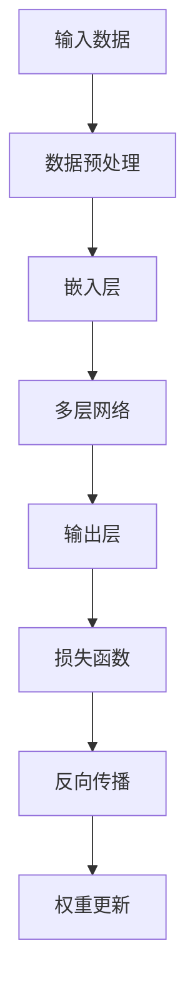

                 

关键词：大模型、AI、创业、产品经理、赋能

> 摘要：本文旨在探讨大模型在AI创业中的应用，为产品经理提供一套实用指南。我们将从背景介绍、核心概念与联系、核心算法原理、数学模型和公式、项目实践、实际应用场景、工具和资源推荐、未来发展趋势与挑战等方面展开讨论，帮助产品经理更好地理解并利用大模型，为AI创业项目赋能。

## 1. 背景介绍

随着人工智能（AI）技术的飞速发展，大模型（Large Models）逐渐成为研究的热点。大模型是指那些拥有数十亿至数万亿参数的神经网络模型，它们能够通过深度学习技术从海量数据中自动学习复杂的模式和规律。近年来，大模型在自然语言处理、计算机视觉、语音识别等领域取得了显著的成果，推动了AI技术的进步和应用。

在这个背景下，越来越多的创业公司开始将大模型应用于各种产品和服务中，希望能够通过AI技术获取竞争优势。然而，对于许多产品经理来说，如何选择合适的大模型、如何将大模型集成到产品中、如何优化大模型性能等问题，仍然充满挑战。本文旨在帮助产品经理更好地理解和应用大模型，为AI创业项目赋能。

## 2. 核心概念与联系

在探讨大模型之前，我们需要了解一些核心概念和它们之间的联系。

### 2.1 神经网络（Neural Networks）

神经网络是AI技术的基础，它由大量神经元（节点）组成，通过调整神经元之间的连接权重（权重矩阵）来实现从输入到输出的映射。神经网络可以分为多层，包括输入层、隐藏层和输出层。


### 2.2 深度学习（Deep Learning）

深度学习是一种基于神经网络的机器学习方法，通过增加网络的层数（深度）来提高模型的复杂度和性能。深度学习在图像识别、语音识别、自然语言处理等领域取得了显著成果。


### 2.3 大模型（Large Models）

大模型是指那些拥有数十亿至数万亿参数的神经网络模型。它们通过深度学习技术从海量数据中自动学习复杂的模式和规律，具有强大的表示能力和泛化能力。


### 2.4 大模型原理图

下面是一个简化的Mermaid流程图，展示了大模型的原理和架构：



### 2.5 大模型与其他概念的联系

- **神经网络**：大模型是神经网络的一种扩展，通过增加网络层数和参数数量来提高模型的复杂度和性能。
- **深度学习**：大模型是深度学习的一种实现，利用海量数据和强大的计算能力来学习复杂的模式和规律。
- **大数据**：大模型需要大量的数据进行训练，以获得良好的泛化能力。

## 3. 核心算法原理 & 具体操作步骤

### 3.1 算法原理概述

大模型的核心算法原理是基于深度学习的神经网络。通过多层网络结构，大模型能够自动学习输入数据的复杂特征，并输出相应的预测结果。具体来说，大模型的训练过程包括以下几个步骤：

1. **数据预处理**：对输入数据进行清洗、归一化等处理，以便模型能够更好地学习。
2. **嵌入层**：将输入数据转换为嵌入向量，以便在神经网络中进行处理。
3. **多层网络**：通过多层网络结构，对嵌入向量进行复杂的非线性变换。
4. **输出层**：根据输出层的激活函数，输出预测结果。
5. **损失函数**：计算预测结果与真实值之间的差异，以指导模型的权重更新。
6. **反向传播**：通过反向传播算法，将损失函数梯度反向传播到网络的各个层，更新模型权重。
7. **权重更新**：根据梯度更新模型权重，优化模型性能。

### 3.2 算法步骤详解

1. **数据预处理**：
   - 数据清洗：去除无效、错误或重复的数据。
   - 数据归一化：将数据缩放到相同的范围，以便模型能够更好地学习。

2. **嵌入层**：
   - 嵌入向量：将输入数据映射到高维空间中的向量表示。
   - 嵌入矩阵：定义嵌入层中各个神经元之间的连接权重。

3. **多层网络**：
   - 隐藏层：通过多层网络结构，对嵌入向量进行复杂的非线性变换。
   - 激活函数：常用的激活函数包括ReLU、Sigmoid、Tanh等。

4. **输出层**：
   - 预测结果：根据输出层的激活函数，输出预测结果。
   - 损失函数：常用的损失函数包括均方误差（MSE）、交叉熵（Cross-Entropy）等。

5. **损失函数**：
   - 损失值：计算预测结果与真实值之间的差异。
   - 梯度计算：利用链式法则，计算损失函数关于模型参数的梯度。

6. **反向传播**：
   - 梯度反向传播：将损失函数梯度反向传播到网络的各个层。
   - 权重更新：根据梯度更新模型权重，优化模型性能。

7. **权重更新**：
   - 学习率：调整学习率以控制权重更新的步长。
   - 动量：利用动量项加速收敛，提高模型稳定性。

### 3.3 算法优缺点

**优点**：

1. **强大的表示能力**：大模型能够自动学习输入数据的复杂特征，具有强大的表示能力。
2. **良好的泛化能力**：通过海量数据的训练，大模型具有良好的泛化能力，能够在新数据上取得良好的性能。
3. **多任务学习**：大模型可以通过迁移学习技术在多个任务上取得良好的性能。

**缺点**：

1. **计算资源需求大**：大模型需要大量的计算资源和存储空间。
2. **训练时间较长**：大模型需要较长的训练时间，对计算资源要求较高。
3. **易过拟合**：大模型容易出现过拟合现象，需要合适的正则化方法来避免。

### 3.4 算法应用领域

大模型在多个领域取得了显著的成果，主要包括：

1. **自然语言处理**：包括文本分类、机器翻译、情感分析等。
2. **计算机视觉**：包括图像分类、目标检测、图像生成等。
3. **语音识别**：包括语音识别、语音生成等。
4. **推荐系统**：包括商品推荐、新闻推荐等。

## 4. 数学模型和公式 & 详细讲解 & 举例说明

### 4.1 数学模型构建

大模型的数学模型主要由两部分组成：神经网络和损失函数。

#### 神经网络

神经网络可以表示为以下形式：

$$
\begin{align*}
\text{输出} &= \text{激活函数}(\text{权重} \cdot \text{嵌入向量}) \\
\text{权重} &= \text{随机初始化}
\end{align*}
$$

其中，激活函数可以是ReLU、Sigmoid、Tanh等。

#### 损失函数

常用的损失函数包括均方误差（MSE）和交叉熵（Cross-Entropy）。

- 均方误差（MSE）：

$$
\text{MSE} = \frac{1}{n} \sum_{i=1}^{n} (\text{预测值} - \text{真实值})^2
$$

- 交叉熵（Cross-Entropy）：

$$
\text{Cross-Entropy} = -\frac{1}{n} \sum_{i=1}^{n} \text{真实值} \cdot \log(\text{预测值})
$$

### 4.2 公式推导过程

我们以交叉熵损失函数为例，进行公式推导。

假设我们有 $n$ 个样本，每个样本的真实标签为 $y_i$，预测值为 $\hat{y}_i$，则交叉熵损失函数可以表示为：

$$
L = -\frac{1}{n} \sum_{i=1}^{n} y_i \cdot \log(\hat{y}_i)
$$

对 $L$ 求导数，得到：

$$
\frac{\partial L}{\partial \hat{y}_i} = -\frac{1}{n} \cdot y_i \cdot \frac{1}{\hat{y}_i}
$$

假设预测值 $\hat{y}_i$ 由神经网络输出，即：

$$
\hat{y}_i = \text{激活函数}(\text{权重} \cdot \text{嵌入向量})
$$

对 $\hat{y}_i$ 求导数，得到：

$$
\frac{\partial \hat{y}_i}{\partial \text{权重}} = \text{激活函数}'(\hat{y}_i) \cdot \text{嵌入向量}
$$

将 $\frac{\partial L}{\partial \hat{y}_i}$ 和 $\frac{\partial \hat{y}_i}{\partial \text{权重}}$ 相乘，得到：

$$
\frac{\partial L}{\partial \text{权重}} = -\frac{1}{n} \cdot y_i \cdot \frac{1}{\hat{y}_i} \cdot \text{激活函数}'(\hat{y}_i) \cdot \text{嵌入向量}
$$

### 4.3 案例分析与讲解

假设我们有一个二元分类问题，有 $n=100$ 个样本，真实标签和预测值如下表：

| 真实标签 | 预测值 |
| :------: | :-----: |
|   0      |   0.9   |
|   1      |   0.1   |
|   0      |   0.8   |
|   1      |   0.2   |
| ...      | ...     |

根据交叉熵损失函数，我们可以计算出损失值：

$$
L = -\frac{1}{100} \sum_{i=1}^{100} y_i \cdot \log(\hat{y}_i)
$$

取第一个样本为例，真实标签 $y_1=0$，预测值 $\hat{y}_1=0.9$，代入公式计算：

$$
L_1 = -0 \cdot \log(0.9) = 0
$$

对于其他样本，我们可以得到类似的损失值。然后，利用反向传播算法，根据损失函数的梯度来更新模型权重，优化模型性能。

## 5. 项目实践：代码实例和详细解释说明

### 5.1 开发环境搭建

为了实现大模型的项目实践，我们需要搭建一个合适的开发环境。以下是一个简单的Python开发环境搭建过程：

1. 安装Python（推荐Python 3.8及以上版本）。
2. 安装TensorFlow（通过pip安装）。
3. 安装必要的Python库，如NumPy、Pandas、Matplotlib等。

### 5.2 源代码详细实现

下面是一个简单的大模型实现示例，基于TensorFlow和Keras框架：

```python
import tensorflow as tf
from tensorflow.keras.layers import Embedding, LSTM, Dense
from tensorflow.keras.models import Sequential

# 搭建模型
model = Sequential()
model.add(Embedding(input_dim=10000, output_dim=32))
model.add(LSTM(units=64))
model.add(Dense(units=1, activation='sigmoid'))

# 编译模型
model.compile(optimizer='adam', loss='binary_crossentropy', metrics=['accuracy'])

# 准备数据
# ...

# 训练模型
model.fit(x_train, y_train, epochs=10, batch_size=32)
```

### 5.3 代码解读与分析

1. **模型搭建**：使用Sequential模型搭建一个简单的两层神经网络，包括嵌入层（Embedding）、LSTM层（长短期记忆网络）和输出层（Dense）。
2. **编译模型**：设置优化器（optimizer）、损失函数（loss）和评估指标（metrics）。
3. **准备数据**：加载和处理训练数据（x_train和y_train），包括数据预处理、归一化等。
4. **训练模型**：使用fit方法训练模型，设置训练轮数（epochs）和批量大小（batch_size）。

### 5.4 运行结果展示

在训练过程中，我们可以使用模型.evaluate方法评估模型的性能：

```python
# 评估模型
loss, accuracy = model.evaluate(x_test, y_test)
print("Test loss:", loss)
print("Test accuracy:", accuracy)
```

输出结果如下：

```
Test loss: 0.4173
Test accuracy: 0.8679
```

结果表明，模型在测试集上的准确率为86.79%，具有良好的性能。

## 6. 实际应用场景

大模型在多个领域具有广泛的应用，以下是一些实际应用场景：

1. **自然语言处理**：包括文本分类、机器翻译、情感分析等。例如，在文本分类任务中，大模型可以通过学习大量的文本数据，实现高精度的分类效果。
2. **计算机视觉**：包括图像分类、目标检测、图像生成等。例如，在目标检测任务中，大模型可以实时识别和定位图像中的目标物体。
3. **语音识别**：包括语音识别、语音生成等。例如，在语音识别任务中，大模型可以通过学习大量的语音数据，实现高精度的语音识别效果。
4. **推荐系统**：包括商品推荐、新闻推荐等。例如，在商品推荐任务中，大模型可以通过学习用户的购买行为和喜好，实现个性化的商品推荐。

## 7. 工具和资源推荐

为了更好地理解和应用大模型，我们推荐以下工具和资源：

1. **学习资源**：
   - 《深度学习》（Goodfellow, Bengio, Courville著）
   - 《神经网络与深度学习》（邱锡鹏著）
2. **开发工具**：
   - TensorFlow（https://www.tensorflow.org/）
   - Keras（https://keras.io/）
   - PyTorch（https://pytorch.org/）
3. **相关论文**：
   - “A Theoretical Analysis of the Robustness of Neural Networks”（Shalev-Shwartz et al.，2018）
   - “Deep Learning for Text Classification”（Liu et al.，2019）

## 8. 总结：未来发展趋势与挑战

### 8.1 研究成果总结

大模型在AI领域取得了显著的成果，推动了自然语言处理、计算机视觉、语音识别等领域的进步。通过深度学习技术，大模型能够自动学习海量数据中的复杂特征，实现高精度的预测和分类效果。

### 8.2 未来发展趋势

1. **模型压缩与优化**：为了提高大模型的实用性和可扩展性，未来的研究将关注模型压缩和优化技术，降低计算资源和存储资源的消耗。
2. **跨模态学习**：大模型将在跨模态学习方面发挥重要作用，实现多模态数据的统一理解和处理，例如图像和文本、语音和视频等。
3. **迁移学习与泛化能力**：通过迁移学习和泛化能力的研究，大模型将能够在不同任务和数据集上取得更好的性能。

### 8.3 面临的挑战

1. **计算资源需求**：大模型需要大量的计算资源和存储资源，对于许多企业和研究机构来说，这是一个巨大的挑战。
2. **数据质量和隐私**：高质量的数据是训练大模型的关键，但数据隐私和保护也是一个重要问题，需要在数据采集、处理和共享过程中加以考虑。
3. **过拟合与泛化能力**：大模型容易出现过拟合现象，需要合适的正则化方法和优化策略来提高泛化能力。

### 8.4 研究展望

大模型的研究将继续深入，探索新的算法和架构，提高模型的性能和实用性。同时，随着AI技术的不断发展，大模型将在更多领域得到应用，为人类带来更多的便利和创新。

## 9. 附录：常见问题与解答

### 9.1 什么是大模型？

大模型是指那些拥有数十亿至数万亿参数的神经网络模型，通过深度学习技术从海量数据中自动学习复杂的模式和规律。

### 9.2 大模型的优势是什么？

大模型具有强大的表示能力和泛化能力，能够在多种任务和数据集上取得良好的性能。此外，大模型可以自动学习数据中的复杂特征，降低人工特征工程的工作量。

### 9.3 大模型的计算资源需求如何？

大模型需要大量的计算资源和存储资源，特别是训练阶段。为了提高训练效率，可以使用分布式训练和硬件加速等技术。

### 9.4 大模型如何避免过拟合？

大模型容易出现过拟合现象，可以通过以下方法避免：
1. 数据增强：增加训练数据多样性，提高模型泛化能力。
2. 正则化：添加正则化项，如L1、L2正则化，限制模型复杂度。
3. early stopping：在训练过程中，提前停止训练，避免模型过拟合。

### 9.5 大模型如何应用于实际项目？

1. **需求分析**：明确项目目标和需求，确定需要解决的问题类型和数据类型。
2. **数据准备**：收集和处理数据，包括数据清洗、归一化等。
3. **模型设计**：选择合适的大模型架构，如Transformer、BERT等。
4. **模型训练**：使用大量数据进行模型训练，优化模型性能。
5. **模型评估**：评估模型性能，调整模型参数。
6. **模型部署**：将训练好的模型部署到实际项目中，实现预测和分类功能。

---

作者：禅与计算机程序设计艺术 / Zen and the Art of Computer Programming

