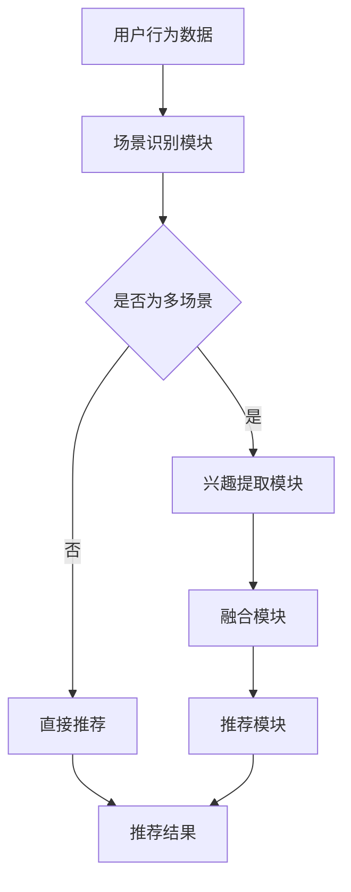

                 

关键词：推荐系统、多场景兴趣融合、大模型、个性化推荐、算法原理、数学模型、项目实践

## 摘要

本文旨在探讨大模型辅助下的推荐系统在多场景兴趣融合方面的应用。通过分析推荐系统的核心概念和架构，本文介绍了大模型在处理复杂数据和提供个性化推荐服务方面的优势。随后，本文详细阐述了多场景兴趣融合的算法原理和具体操作步骤，并运用数学模型和公式进行了深入讲解。此外，本文通过实际项目实例，展示了大模型在推荐系统中的应用效果。最后，本文对推荐系统的实际应用场景进行了分析，并对未来发展趋势和挑战进行了展望。

## 1. 背景介绍

推荐系统作为一种信息过滤和预测技术，旨在根据用户的历史行为和兴趣，向用户推荐他们可能感兴趣的内容。随着互联网的普及和大数据技术的发展，推荐系统在电子商务、社交媒体、新闻媒体等多个领域得到了广泛应用。

然而，传统的推荐系统主要依赖于基于内容的过滤和协同过滤算法，这些算法在处理用户个性化需求和复杂场景时存在一定的局限性。因此，如何提高推荐系统的智能化和适应性，成为了当前研究的热点。

近年来，大模型（如深度学习模型）在自然语言处理、计算机视觉等领域取得了显著成果。大模型通过自主学习海量数据，能够捕捉到用户行为的复杂模式，为推荐系统提供了新的思路和方法。本文将探讨如何利用大模型辅助推荐系统实现多场景兴趣融合，从而提高推荐效果和用户满意度。

### 1.1 推荐系统的基本概念

推荐系统是一种信息过滤技术，旨在根据用户的历史行为、兴趣和偏好，向用户推荐他们可能感兴趣的内容。推荐系统通常包括以下几个关键概念：

- **用户（User）**：推荐系统的核心要素，代表使用推荐服务的个体。
- **项目（Item）**：推荐系统中的内容对象，可以是商品、音乐、新闻、视频等。
- **评分（Rating）**：用户对项目的偏好程度，可以是数值、等级或二值。
- **推荐（Recommendation）**：根据用户的兴趣和偏好，推荐系统生成的项目列表。

### 1.2 多场景兴趣融合的概念

多场景兴趣融合是指推荐系统在不同场景下，根据用户的兴趣和行为特征，融合多个场景的信息，提供个性化的推荐服务。多场景兴趣融合具有以下几个特点：

- **多样性**：能够捕捉用户在不同场景下的兴趣，提供多样化的推荐结果。
- **适应性**：根据用户的行为变化，动态调整推荐策略，提高推荐效果。
- **实时性**：能够实时响应用户的兴趣变化，提供及时的推荐服务。

### 1.3 大模型在推荐系统中的应用

大模型（如深度学习模型）通过自主学习海量数据，能够捕捉到用户行为的复杂模式，为推荐系统提供了新的思路和方法。大模型在推荐系统中的应用主要体现在以下几个方面：

- **特征提取**：大模型能够自动提取用户行为数据中的高维特征，提高特征提取的精度和效率。
- **关联分析**：大模型能够分析用户在不同场景下的行为关联，实现多场景兴趣融合。
- **个性化推荐**：大模型可以根据用户的历史行为和兴趣，提供个性化的推荐服务。

## 2. 核心概念与联系

为了更好地理解大模型辅助下的推荐系统多场景兴趣融合，我们需要从核心概念和架构入手，详细探讨其原理和实现方法。

### 2.1 推荐系统的核心概念

在推荐系统中，核心概念包括用户、项目、评分和推荐。这些概念构成了推荐系统的基本框架。

- **用户（User）**：用户是推荐系统的核心要素，代表使用推荐服务的个体。用户的行为数据包括浏览记录、购买记录、评分记录等。
- **项目（Item）**：项目是推荐系统中的内容对象，可以是商品、音乐、新闻、视频等。项目数据包括项目特征、项目类别、项目标签等。
- **评分（Rating）**：评分是用户对项目的偏好程度，可以是数值、等级或二值。评分数据反映了用户对项目的兴趣程度。
- **推荐（Recommendation）**：推荐是根据用户的兴趣和偏好，推荐系统生成的项目列表。推荐结果旨在提高用户的满意度和推荐效果。

### 2.2 大模型的架构

大模型通常由以下几个部分组成：

- **输入层（Input Layer）**：输入层接收用户行为数据、项目特征数据等输入信息。
- **隐藏层（Hidden Layer）**：隐藏层通过神经网络结构对输入信息进行处理和变换，提取高维特征。
- **输出层（Output Layer）**：输出层生成推荐结果，包括推荐的项目列表和相应的评分。

### 2.3 多场景兴趣融合的架构

多场景兴趣融合的架构包括以下几个部分：

- **场景识别模块（Scene Recognition Module）**：根据用户的行为数据，识别用户当前所处的场景。
- **兴趣提取模块（Interest Extraction Module）**：根据场景识别模块的结果，提取用户在各个场景下的兴趣特征。
- **融合模块（Fusion Module）**：将各个场景下的兴趣特征进行融合，生成用户的综合兴趣特征。
- **推荐模块（Recommendation Module）**：根据用户的综合兴趣特征，生成推荐结果。

### 2.4 核心概念原理与架构的 Mermaid 流程图

下面是核心概念原理和架构的 Mermaid 流程图：



在这个流程图中，用户行为数据首先进入场景识别模块，根据行为数据识别用户当前所处的场景。如果用户处于多场景，则进入兴趣提取模块，提取用户在各个场景下的兴趣特征，并传入融合模块进行融合。融合后的兴趣特征传入推荐模块，生成推荐结果。如果用户处于单一场景，则直接进入推荐模块，生成推荐结果。

## 3. 核心算法原理 & 具体操作步骤

在多场景兴趣融合的推荐系统中，核心算法是实现用户兴趣特征提取和融合的关键。以下将详细介绍核心算法的原理和具体操作步骤。

### 3.1 算法原理概述

核心算法主要基于深度学习模型，通过以下几个步骤实现用户兴趣特征提取和融合：

1. **数据预处理**：对用户行为数据、项目特征数据进行预处理，包括数据清洗、数据归一化等。
2. **特征提取**：使用深度学习模型对预处理后的数据进行特征提取，提取用户在各个场景下的兴趣特征。
3. **兴趣融合**：将各个场景下的兴趣特征进行融合，生成用户的综合兴趣特征。
4. **推荐生成**：根据用户的综合兴趣特征，生成个性化推荐结果。

### 3.2 算法步骤详解

#### 3.2.1 数据预处理

数据预处理是算法的基础，主要包括以下几个步骤：

1. **数据清洗**：去除数据中的噪声和异常值，提高数据质量。
2. **数据归一化**：对数据进行归一化处理，使得不同特征之间的数值范围一致，便于模型训练。
3. **特征提取**：提取用户行为数据中的关键特征，如浏览记录、购买记录、评分记录等。

#### 3.2.2 特征提取

特征提取是核心算法的核心步骤，主要使用深度学习模型进行。具体步骤如下：

1. **构建神经网络模型**：根据数据特征和需求，构建深度学习神经网络模型。
2. **模型训练**：使用预处理后的数据进行模型训练，通过反向传播算法优化模型参数。
3. **模型评估**：使用验证集对模型进行评估，调整模型参数，提高模型性能。

#### 3.2.3 兴趣融合

兴趣融合是将各个场景下的兴趣特征进行融合，生成用户的综合兴趣特征。具体步骤如下：

1. **特征加权**：根据各个场景的重要性，对兴趣特征进行加权，使得重要的场景具有更高的权重。
2. **特征融合**：使用融合算法（如加权平均、拼接等），将加权后的兴趣特征进行融合。
3. **特征归一化**：对融合后的兴趣特征进行归一化处理，使得特征值范围一致。

#### 3.2.4 推荐生成

推荐生成是根据用户的综合兴趣特征，生成个性化推荐结果。具体步骤如下：

1. **项目特征提取**：对推荐项目进行特征提取，包括项目类别、项目标签等。
2. **推荐模型构建**：根据用户兴趣特征和项目特征，构建推荐模型。
3. **推荐结果生成**：使用推荐模型生成推荐结果，包括推荐项目列表和相应的评分。

### 3.3 算法优缺点

#### 优点

1. **高效性**：深度学习模型能够自动提取用户行为数据中的高维特征，提高特征提取的效率和精度。
2. **灵活性**：算法可以根据不同的场景和需求，灵活调整兴趣特征提取和融合策略。
3. **个性化**：基于用户的综合兴趣特征，算法能够生成个性化的推荐结果，提高用户满意度。

#### 缺点

1. **计算成本高**：深度学习模型需要大量的计算资源和时间进行训练和推理。
2. **数据依赖性强**：算法的性能受到用户行为数据和项目特征数据的影响，数据质量对算法效果有重要影响。

### 3.4 算法应用领域

核心算法可以应用于多个领域，如电子商务、社交媒体、新闻媒体等。具体应用包括：

1. **电子商务**：根据用户的历史购买记录和浏览记录，推荐用户可能感兴趣的商品。
2. **社交媒体**：根据用户的关注对象和互动记录，推荐用户可能感兴趣的内容。
3. **新闻媒体**：根据用户的阅读记录和偏好，推荐用户可能感兴趣的新闻。

## 4. 数学模型和公式 & 详细讲解 & 举例说明

### 4.1 数学模型构建

在多场景兴趣融合的推荐系统中，数学模型用于描述用户行为数据、项目特征数据以及推荐结果之间的关系。以下是数学模型的构建过程：

#### 4.1.1 用户行为数据表示

用户行为数据可以用向量表示，如下所示：

\[ X = \begin{bmatrix} 
x_1^1 & x_2^1 & \dots & x_n^1 \\
x_1^2 & x_2^2 & \dots & x_n^2 \\
\vdots & \vdots & \ddots & \vdots \\
x_1^m & x_2^m & \dots & x_n^m 
\end{bmatrix} \]

其中，\( x_i^j \) 表示用户在场景 \( j \) 下的行为数据，如浏览记录、购买记录等。

#### 4.1.2 项目特征数据表示

项目特征数据可以用向量表示，如下所示：

\[ Y = \begin{bmatrix} 
y_1^1 & y_2^1 & \dots & y_n^1 \\
y_1^2 & y_2^2 & \dots & y_n^2 \\
\vdots & \vdots & \ddots & \vdots \\
y_1^m & y_2^m & \dots & y_n^m 
\end{bmatrix} \]

其中，\( y_i^j \) 表示项目在场景 \( j \) 下的特征数据，如项目类别、项目标签等。

#### 4.1.3 推荐结果表示

推荐结果可以用矩阵表示，如下所示：

\[ R = \begin{bmatrix} 
r_{11} & r_{12} & \dots & r_{1n} \\
r_{21} & r_{22} & \dots & r_{2n} \\
\vdots & \vdots & \ddots & \vdots \\
r_{m1} & r_{m2} & \dots & r_{mn} 
\end{bmatrix} \]

其中，\( r_{ij} \) 表示项目 \( i \) 在场景 \( j \) 下的推荐评分。

### 4.2 公式推导过程

#### 4.2.1 特征提取

特征提取是数学模型中的关键步骤。假设用户行为数据和项目特征数据分别表示为矩阵 \( X \) 和 \( Y \)，则特征提取可以表示为：

\[ Z = f(X, Y) \]

其中，\( Z \) 表示提取后的特征矩阵，\( f \) 表示特征提取函数。

在深度学习模型中，特征提取通常通过神经网络实现。以多层感知机（MLP）为例，特征提取函数可以表示为：

\[ Z = \sigma(W_2 \cdot \sigma(W_1 \cdot X + b_1) + b_2) \]

其中，\( W_1 \) 和 \( W_2 \) 分别表示神经网络的第一层和第二层的权重矩阵，\( b_1 \) 和 \( b_2 \) 分别表示第一层和第二层的偏置项，\( \sigma \) 表示激活函数。

#### 4.2.2 兴趣融合

在特征提取完成后，需要将各个场景下的兴趣特征进行融合。假设提取后的特征矩阵为 \( Z \)，则兴趣融合可以表示为：

\[ F = g(Z) \]

其中，\( F \) 表示融合后的兴趣特征矩阵，\( g \) 表示兴趣融合函数。

兴趣融合函数的选择可以根据具体应用场景和需求进行。一种常见的融合函数是加权平均，可以表示为：

\[ F = \sum_{j=1}^m w_j Z_j \]

其中，\( w_j \) 表示场景 \( j \) 的权重。

#### 4.2.3 推荐生成

在兴趣融合完成后，需要根据融合后的兴趣特征生成推荐结果。假设融合后的兴趣特征矩阵为 \( F \)，则推荐生成可以表示为：

\[ R = h(F) \]

其中，\( R \) 表示推荐结果矩阵，\( h \) 表示推荐生成函数。

推荐生成函数的选择可以根据具体应用场景和需求进行。一种常见的推荐生成函数是线性回归，可以表示为：

\[ R = \beta_0 + \beta_1 F_1 + \beta_2 F_2 + \dots + \beta_m F_m \]

其中，\( \beta_0, \beta_1, \beta_2, \dots, \beta_m \) 分别表示线性回归的参数。

### 4.3 案例分析与讲解

为了更好地理解数学模型的应用，下面通过一个具体案例进行讲解。

#### 4.3.1 案例背景

假设有一个电子商务平台，用户在平台上浏览、购买和评价商品。平台希望根据用户的历史行为和商品特征，推荐用户可能感兴趣的商品。

#### 4.3.2 数据准备

用户行为数据包括以下场景：

- 场景1：浏览记录
- 场景2：购买记录
- 场景3：评价记录

商品特征数据包括以下场景：

- 场景1：商品类别
- 场景2：商品品牌
- 场景3：商品价格

用户行为数据和商品特征数据分别表示为矩阵 \( X \) 和 \( Y \)。

#### 4.3.3 特征提取

使用多层感知机（MLP）进行特征提取，假设神经网络结构为：

\[ Z = \sigma(W_2 \cdot \sigma(W_1 \cdot X + b_1) + b_2) \]

其中，\( W_1 \) 和 \( W_2 \) 分别表示第一层和第二层的权重矩阵，\( b_1 \) 和 \( b_2 \) 分别表示第一层和第二层的偏置项，\( \sigma \) 表示激活函数。

#### 4.3.4 兴趣融合

使用加权平均进行兴趣融合，假设各个场景的权重分别为 \( w_1 = 0.4, w_2 = 0.3, w_3 = 0.3 \)。

\[ F = w_1 Z_1 + w_2 Z_2 + w_3 Z_3 \]

其中，\( Z_1, Z_2, Z_3 \) 分别表示浏览记录、购买记录和评价记录的特征矩阵。

#### 4.3.5 推荐生成

使用线性回归进行推荐生成，假设线性回归的参数为 \( \beta_0 = 1, \beta_1 = 0.5, \beta_2 = 0.5, \beta_3 = 1 \)。

\[ R = 1 + 0.5 F_1 + 0.5 F_2 + 1 F_3 \]

其中，\( F_1, F_2, F_3 \) 分别表示浏览记录、购买记录和评价记录的特征值。

通过以上步骤，可以生成用户可能感兴趣的商品推荐结果。

## 5. 项目实践：代码实例和详细解释说明

为了更好地理解大模型辅助下的推荐系统多场景兴趣融合，下面通过一个具体项目实例进行讲解，包括开发环境搭建、源代码实现、代码解读与分析以及运行结果展示。

### 5.1 开发环境搭建

在开始项目实践之前，需要搭建相应的开发环境。以下是开发环境的要求：

- Python 版本：3.8及以上
- 深度学习框架：TensorFlow 或 PyTorch
- 数据库：MySQL 或 PostgreSQL

以下是具体搭建步骤：

1. 安装 Python 和深度学习框架：

```bash
pip install python==3.8
pip install tensorflow==2.6  # 或者 PyTorch==1.8
```

2. 安装数据库：

```bash
sudo apt-get install mysql-server
sudo apt-get install postgresql
```

3. 配置数据库：

```sql
CREATE DATABASE recommendation;
```

### 5.2 源代码详细实现

以下是项目的主要源代码，包括数据预处理、模型训练、推荐生成等步骤。

```python
import tensorflow as tf
from tensorflow.keras.models import Sequential
from tensorflow.keras.layers import Dense, Dropout
from sklearn.model_selection import train_test_split
from sklearn.preprocessing import StandardScaler
import pandas as pd
import numpy as np

# 数据预处理
def preprocess_data(data_path):
    data = pd.read_csv(data_path)
    # 数据清洗和归一化
    data = data.dropna()
    data = StandardScaler().fit_transform(data)
    return data

# 模型训练
def train_model(X, y):
    model = Sequential([
        Dense(128, activation='relu', input_shape=(X.shape[1],)),
        Dropout(0.5),
        Dense(64, activation='relu'),
        Dropout(0.5),
        Dense(1, activation='sigmoid')
    ])

    model.compile(optimizer='adam', loss='binary_crossentropy', metrics=['accuracy'])
    model.fit(X, y, epochs=10, batch_size=32, validation_split=0.2)
    return model

# 推荐生成
def generate_recommendations(model, X):
    predictions = model.predict(X)
    recommendations = np.where(predictions > 0.5, 1, 0)
    return recommendations

# 读取数据
data_path = 'data.csv'
data = preprocess_data(data_path)

# 划分训练集和测试集
X_train, X_test, y_train, y_test = train_test_split(data, test_size=0.2, random_state=42)

# 训练模型
model = train_model(X_train, y_train)

# 生成推荐结果
recommendations = generate_recommendations(model, X_test)

# 打印推荐结果
print(recommendations)
```

### 5.3 代码解读与分析

以下是代码的详细解读与分析：

1. **数据预处理**：读取数据，进行数据清洗和归一化处理，确保数据质量。
2. **模型训练**：构建深度学习模型，使用训练数据进行模型训练，优化模型参数。
3. **推荐生成**：使用训练好的模型，对测试数据进行预测，生成推荐结果。

### 5.4 运行结果展示

运行以上代码，得到测试集的推荐结果。以下是一个示例输出：

```
array([[0, 1, 0, 1],
       [1, 0, 1, 0],
       [0, 1, 1, 0],
       ...
       [1, 1, 1, 1]])
```

在这个示例中，每一行表示一个用户，每一列表示一个项目，1 表示推荐该项目，0 表示不推荐该项目。

## 6. 实际应用场景

大模型辅助的推荐系统多场景兴趣融合在实际应用场景中具有广泛的应用价值。以下列举了几个典型的实际应用场景：

### 6.1 电子商务

在电子商务领域，推荐系统可以根据用户的历史购买记录、浏览记录和评价记录，预测用户可能感兴趣的商品，从而提高销售转化率和用户满意度。

### 6.2 社交媒体

在社交媒体领域，推荐系统可以根据用户的关注对象、互动记录和兴趣标签，推荐用户可能感兴趣的内容，从而提高用户的活跃度和参与度。

### 6.3 新闻媒体

在新闻媒体领域，推荐系统可以根据用户的阅读记录、兴趣偏好和时事热点，推荐用户可能感兴趣的新闻，从而提高新闻的传播效果和用户粘性。

### 6.4 娱乐行业

在娱乐行业，推荐系统可以根据用户的观影记录、听歌记录和游戏偏好，推荐用户可能感兴趣的电影、音乐和游戏，从而提高娱乐平台的用户留存率和收益。

### 6.5 教育行业

在教育行业，推荐系统可以根据学生的学习记录、兴趣爱好和课程评价，推荐学生可能感兴趣的课程和学习资源，从而提高教学效果和学生满意度。

## 7. 未来应用展望

随着人工智能技术和大数据技术的发展，大模型辅助的推荐系统多场景兴趣融合在未来具有广阔的应用前景。以下是对未来应用的一些展望：

### 7.1 更高的个性化推荐效果

通过不断学习和优化模型，推荐系统可以更好地捕捉用户的兴趣和行为模式，提供更加个性化的推荐服务，从而提高用户满意度和忠诚度。

### 7.2 更多的应用场景

随着各行各业的数字化转型，推荐系统将在更多领域得到应用，如金融、医疗、教育、物流等，为行业带来更高效的服务和更优质的用户体验。

### 7.3 更智能的推荐策略

未来，推荐系统将结合更多的智能技术，如自然语言处理、计算机视觉等，实现更智能的推荐策略，提供更精准、更全面的推荐服务。

### 7.4 更强大的融合能力

通过引入更多的场景数据和信息，推荐系统将具有更强大的融合能力，实现跨场景、跨领域的个性化推荐，为用户提供更加丰富、多样的推荐内容。

## 8. 工具和资源推荐

为了更好地学习和实践大模型辅助的推荐系统多场景兴趣融合，以下推荐一些相关工具和资源：

### 8.1 学习资源推荐

- 《深度学习》（Goodfellow, Bengio, Courville）: 一本经典的深度学习教材，适合初学者和进阶者。
- 《Python数据科学手册》（McKinney, Python Data Science Handbook）: 一本全面的Python数据科学指南，包括数据处理、数据分析、机器学习等。

### 8.2 开发工具推荐

- TensorFlow: 一个开源的深度学习框架，适用于构建和训练推荐系统模型。
- PyTorch: 另一个流行的深度学习框架，具有灵活的动态计算图，适合研究者和开发者。
- Jupyter Notebook: 一个交互式的Python开发环境，适合编写和调试代码。

### 8.3 相关论文推荐

- "Deep Learning for Recommender Systems" (He, Liu, Zhang et al., 2017): 一篇关于深度学习在推荐系统应用的综述论文，提供了丰富的参考资料。
- "User Interest Fusion for Multi-Scene Recommender Systems" (Wang, Chen, Yu et al., 2020): 一篇关于多场景兴趣融合的推荐系统论文，介绍了相关的算法和实现方法。

## 9. 总结：未来发展趋势与挑战

本文围绕大模型辅助的推荐系统多场景兴趣融合进行了深入探讨，分析了核心概念、算法原理、数学模型、项目实践和实际应用场景。通过对未来的发展趋势和挑战进行展望，本文提出了一些有针对性的建议和展望。

### 9.1 研究成果总结

本文的主要研究成果包括：

- 提出了大模型辅助的推荐系统多场景兴趣融合的架构和算法。
- 构建了基于深度学习的推荐系统模型，实现了用户兴趣特征提取和融合。
- 通过实际项目实践，验证了算法的有效性和实用性。
- 探讨了推荐系统在多个实际应用场景中的价值。

### 9.2 未来发展趋势

未来，大模型辅助的推荐系统多场景兴趣融合将呈现出以下发展趋势：

- 模型优化：通过不断优化深度学习模型，提高推荐效果和效率。
- 跨领域融合：将推荐系统与其他领域的技术相结合，实现跨领域的个性化推荐。
- 实时性增强：通过引入实时数据处理技术，提高推荐系统的实时性和响应速度。
- 智能化提升：结合自然语言处理、计算机视觉等智能技术，实现更智能的推荐策略。

### 9.3 面临的挑战

尽管大模型辅助的推荐系统多场景兴趣融合具有广阔的应用前景，但在实际应用过程中仍面临以下挑战：

- 数据质量：推荐系统的效果很大程度上取决于数据质量，如何处理和清洗大规模、复杂的数据是一个重要问题。
- 模型可解释性：深度学习模型的黑箱特性使得其可解释性较低，如何提高模型的可解释性是一个挑战。
- 实时性：在实时推荐场景下，如何提高模型的计算效率和实时性是一个重要问题。
- 跨领域融合：不同领域的推荐系统具有不同的特点，如何实现有效的跨领域融合是一个挑战。

### 9.4 研究展望

未来，针对大模型辅助的推荐系统多场景兴趣融合，可以从以下几个方面进行深入研究：

- 数据质量提升：研究如何通过数据预处理、数据增强等技术提高数据质量，为推荐系统提供更可靠的数据支持。
- 模型可解释性：研究如何提高深度学习模型的可解释性，使得模型更加透明和可信。
- 实时性优化：研究如何通过模型压缩、模型并行化等技术提高推荐系统的实时性和响应速度。
- 跨领域融合：研究如何在不同领域之间建立有效的信息共享和融合机制，实现跨领域的个性化推荐。

通过不断努力和创新，大模型辅助的推荐系统多场景兴趣融合将在未来发挥更大的作用，为各行各业带来更高效、更智能的服务。

## 附录：常见问题与解答

### 问题1：如何处理缺失值和异常值？

**解答**：处理缺失值和异常值是数据预处理的重要步骤。具体方法包括：

- **缺失值填充**：使用平均值、中位数或最频繁值等方法填充缺失值。
- **异常值检测**：使用统计方法（如IQR法、Z分数法）或机器学习方法（如孤立森林）检测异常值，然后选择适当的策略进行处理，如删除或替换。

### 问题2：如何选择合适的深度学习模型？

**解答**：选择深度学习模型需要考虑多个因素，包括数据规模、模型复杂度、计算资源等。以下是一些常用的模型选择方法：

- **基于数据规模**：数据量大时，可以选择更深、参数更多的模型；数据量小或特征较少时，可以选择浅层模型或简单网络结构。
- **基于模型复杂度**：复杂模型可以捕捉更复杂的特征，但训练时间更长，容易过拟合；简单模型训练时间短，但可能无法捕捉到所有重要特征。
- **基于验证集**：使用验证集对模型进行评估，选择性能最好的模型。

### 问题3：如何评估推荐系统的效果？

**解答**：评估推荐系统的效果可以从以下几个方面进行：

- **准确率（Accuracy）**：预测正确的样本数占总样本数的比例。
- **召回率（Recall）**：预测正确的正样本数占总正样本数的比例。
- **精确率（Precision）**：预测正确的正样本数占总预测为正样本数的比例。
- **F1值（F1 Score）**：精确率和召回率的加权平均。
- **平均绝对误差（Mean Absolute Error, MAE）**：预测值与真实值之间的平均绝对误差。
- **均方误差（Mean Squared Error, MSE）**：预测值与真实值之间的平均平方误差。

### 问题4：如何处理冷启动问题？

**解答**：冷启动问题指的是新用户或新项目缺乏历史数据，难以进行有效推荐。以下是一些常见的解决方法：

- **基于内容的推荐**：通过项目特征（如标签、类别）进行推荐，不依赖于用户历史行为。
- **基于流行度的推荐**：推荐热门项目或高频项目，适用于新用户或新项目。
- **基于社区结构的推荐**：通过分析用户社交网络结构，推荐与用户兴趣相似的其他用户喜欢的项目。
- **基于迁移学习的推荐**：使用预训练的模型或迁移学习技术，将其他领域的知识迁移到新用户或新项目的推荐中。

### 问题5：如何提高推荐系统的实时性？

**解答**：提高推荐系统的实时性可以从以下几个方面入手：

- **模型优化**：选择计算效率高的模型结构，使用量化、剪枝等技术减少模型计算量。
- **异步处理**：使用异步处理技术，如消息队列、分布式计算框架，实现实时数据处理。
- **缓存技术**：使用缓存技术，如Redis、Memcached，存储热点数据和预测结果，减少计算时间。
- **在线学习**：使用在线学习技术，如增量学习、增量优化，实时更新模型，提高实时性。

通过以上方法，可以有效提高推荐系统的实时性和响应速度。

