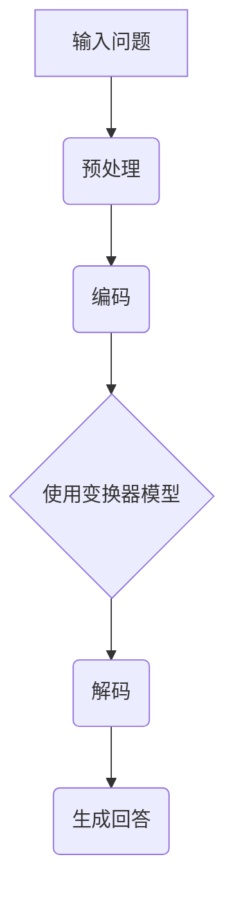

                 

在当今快速发展的信息技术时代，人工智能（AI）已经成为推动社会进步的重要力量。特别是在自然语言处理（NLP）领域，大模型问答机器人因其出色的性能和广泛的应用前景，正受到越来越多企业和研究机构的关注。本文将探讨大模型问答机器人在处理上下文方面的工作原理、算法原理、数学模型及其在各个实际应用场景中的表现。

## 文章关键词

- 大模型
- 问答机器人
- 上下文处理
- 自然语言处理
- 算法原理
- 数学模型
- 实际应用

## 文章摘要

本文首先介绍了大模型问答机器人的背景和应用场景，随后详细探讨了其在处理上下文方面的核心算法原理，包括算法步骤、优缺点以及应用领域。接着，文章通过数学模型的构建和公式推导，对算法进行了详细解释。为了更好地理解，我们还提供了一个实际项目的代码实例，并通过运行结果展示了算法的实际效果。最后，文章总结了问答机器人在各个实际应用场景中的表现，并对其未来的发展趋势和面临的挑战进行了展望。

## 1. 背景介绍

随着互联网的普及和信息爆炸，人们对于信息检索和处理的需求日益增长。传统的搜索引擎在处理海量信息时往往显得力不从心，特别是在涉及复杂语义理解和上下文感知的任务上。为了解决这一问题，大模型问答机器人应运而生。

大模型问答机器人是一种基于深度学习技术的自然语言处理系统，它能够通过学习大量的语料库，实现对用户提问的理解和回答。与传统搜索引擎不同，问答机器人不仅能提供直接的答案，还能根据上下文环境进行推理和扩展，从而提供更加丰富和精准的信息。

大模型问答机器人的发展离不开大数据和计算能力的提升。随着云计算和分布式计算技术的进步，研究人员能够利用更多的计算资源来训练和优化这些复杂的大模型。此外，海量数据集的收集和标注也为模型的训练提供了丰富的素材，使得模型在处理上下文和理解语义方面取得了显著提升。

在实际应用中，问答机器人已经被广泛应用于多个领域。例如，在客户服务中，问答机器人可以自动回答用户的问题，提高服务效率；在智能助手领域，问答机器人可以理解用户的指令，实现语音控制功能；在教育领域，问答机器人可以为学生提供个性化的学习辅导。

## 2. 核心概念与联系

要深入理解大模型问答机器人如何处理上下文，我们需要明确几个核心概念，包括深度学习、神经网络、循环神经网络（RNN）和变换器模型（Transformer）。

### 深度学习与神经网络

深度学习是一种基于多层神经网络的学习方法，通过多层神经元的组合，实现复杂特征提取和模式识别。神经网络是深度学习的基础，它由多个神经元层组成，每层神经元接受前一层的输入，并通过加权连接传递到下一层。在训练过程中，神经网络通过反向传播算法不断调整权重，以最小化损失函数，从而提高模型的预测能力。

### 循环神经网络（RNN）

循环神经网络（RNN）是一种特殊类型的神经网络，用于处理序列数据。与传统的前向神经网络不同，RNN具有循环结构，能够记住前面的输入信息，并将其用于后续的计算。这使得RNN在处理上下文信息方面具有优势，因为它可以捕捉到输入序列中的长期依赖关系。

然而，传统的RNN在处理长序列时容易出现梯度消失或爆炸问题，导致训练效果不佳。为了克服这一问题，研究人员提出了长短时记忆网络（LSTM）和门控循环单元（GRU），这些改进的RNN结构能够更好地记住长期依赖关系。

### 变换器模型（Transformer）

变换器模型（Transformer）是近年来在自然语言处理领域取得突破性进展的一种新型神经网络结构。与传统的RNN和LSTM不同，Transformer采用了自注意力机制（Self-Attention），能够同时考虑序列中每个位置的信息，从而更好地捕捉长距离依赖关系。

### Mermaid 流程图

下面是一个简化的Mermaid流程图，展示了大模型问答机器人处理上下文的基本流程：



- **输入问题（A）**：用户通过文本或语音输入问题。
- **预处理（B）**：对输入问题进行文本清洗、分词等预处理操作。
- **编码（C）**：将预处理后的文本序列编码成固定长度的向量。
- **使用变换器模型（D）**：通过变换器模型处理编码后的文本序列，捕捉上下文信息。
- **解码（E）**：将处理后的序列解码成自然语言回答。
- **生成回答（F）**：输出最终的自然语言回答。

## 3. 核心算法原理 & 具体操作步骤

### 3.1 算法原理概述

大模型问答机器人的核心算法基于变换器模型（Transformer），这是一种基于自注意力机制的新型神经网络结构。自注意力机制允许模型在处理文本序列时，能够同时关注序列中的所有位置，从而更好地捕捉长距离依赖关系。通过多头注意力机制和位置编码，变换器模型能够实现对上下文信息的精确处理。

### 3.2 算法步骤详解

#### 步骤1：输入问题预处理

输入问题经过预处理，包括文本清洗、分词和标记化。文本清洗旨在去除无效字符和噪声，如标点符号、HTML标签等。分词是将文本分割成一个个词语或子词，而标记化则是将每个词语或子词映射成一个唯一的整数。

#### 步骤2：编码

预处理后的文本序列通过编码器（Encoder）进行处理。编码器由多个变换器层堆叠而成，每一层都会对输入序列进行编码，并生成固定长度的编码向量。

#### 步骤3：自注意力计算

在编码过程中，变换器模型通过自注意力机制计算每个编码向量的权重。自注意力机制允许模型在处理每个位置时，考虑其他所有位置的信息，从而实现全局上下文信息的捕捉。

#### 步骤4：解码

编码后的向量通过解码器（Decoder）进行处理。解码器同样由多个变换器层组成，每一层都会对输入向量进行解码，并生成自然语言回答的候选序列。

#### 步骤5：生成回答

解码器生成的候选序列通过序列预测模型进行最终的自然语言回答生成。通常使用 greedy 方式或 beam search 方式选择最优序列。

### 3.3 算法优缺点

#### 优点

1. **强大的上下文理解能力**：通过自注意力机制，变换器模型能够捕捉到长距离依赖关系，从而实现更精确的上下文理解。
2. **高效的处理速度**：与传统的循环神经网络相比，变换器模型在计算复杂度上具有显著优势，能够更快地处理大量文本数据。
3. **灵活的应用场景**：变换器模型在多种自然语言处理任务中表现出色，如机器翻译、文本摘要和问答系统。

#### 缺点

1. **训练资源需求大**：变换器模型需要大量计算资源和数据集进行训练，这对于小型研究团队或企业来说可能是一个挑战。
2. **对长文本处理能力有限**：尽管变换器模型在捕捉长距离依赖关系方面表现出色，但在处理极长文本时仍存在一定困难。

### 3.4 算法应用领域

变换器模型在自然语言处理领域具有广泛的应用前景。以下是一些典型的应用领域：

1. **问答系统**：通过处理上下文信息，变换器模型能够生成准确的答案，广泛应用于客户服务、智能助手和在线教育等场景。
2. **机器翻译**：变换器模型在机器翻译任务中表现出色，能够实现高质量的双语互译。
3. **文本摘要**：变换器模型能够自动生成文章的摘要，提高信息获取效率。
4. **情感分析**：通过分析文本中的情感词和情感极性，变换器模型能够识别用户情感，应用于市场调研、客户反馈分析等领域。

## 4. 数学模型和公式 & 详细讲解 & 举例说明

### 4.1 数学模型构建

变换器模型的核心在于其自注意力机制，这可以通过以下数学公式进行描述：

\[ 
\text{Attention}(Q, K, V) = \text{softmax}\left(\frac{QK^T}{\sqrt{d_k}}\right) V 
\]

其中，\( Q \)、\( K \) 和 \( V \) 分别表示查询向量、键向量和值向量，\( d_k \) 为键向量的维度。这个公式计算了每个查询向量与所有键向量的点积，并通过 softmax 函数生成权重，最后将权重与值向量相乘，得到加权求和的结果。

### 4.2 公式推导过程

为了更好地理解变换器模型中的自注意力机制，我们可以对其进行进一步的推导。

首先，考虑一个简单的注意力计算过程：

\[ 
\text{Attention}(Q, K, V) = \sum_{i}^{N} \text{softmax}\left(\frac{Qk_i}{\sqrt{d_k}}\right) v_i 
\]

其中，\( Q \) 和 \( K \) 分别为查询向量和键向量，\( V \) 为值向量，\( N \) 为序列长度。

接下来，我们将这个注意力公式扩展到多个头（Head）：

\[ 
\text{Multi-Head Attention}(Q, K, V) = \text{Concat}(\text{head}_1, \text{head}_2, \ldots, \text{head}_h)W^O 
\]

其中，\( h \) 为头的数量，\( W^O \) 为输出权重。

为了实现多头注意力，我们首先将查询向量、键向量和值向量分别映射到不同的空间：

\[ 
\text{head}_i = \text{Attention}(QW_i^Q, KW_i^K, VW_i^V) 
\]

其中，\( W_i^Q \)、\( W_i^K \) 和 \( W_i^V \) 分别为查询权重、键权重和值权重。

最后，我们将多个头的结果进行拼接，并通过一个全连接层得到最终结果：

\[ 
\text{Multi-Head Attention}(Q, K, V) = \text{softmax}\left(\frac{QW_i^T}{\sqrt{d_k}}\right) VW_i 
\]

### 4.3 案例分析与讲解

为了更好地理解变换器模型中的自注意力机制，我们可以通过一个简单的例子进行讲解。

假设我们有一个长度为 5 的序列，其中每个元素为 2 维向量：

\[ 
X = [\mathbf{x}_1, \mathbf{x}_2, \mathbf{x}_3, \mathbf{x}_4, \mathbf{x}_5] 
\]

我们需要对这个序列进行编码，并计算自注意力权重。

首先，我们将序列输入到变换器模型中，得到编码向量：

\[ 
\mathbf{h}_1, \mathbf{h}_2, \mathbf{h}_3, \mathbf{h}_4, \mathbf{h}_5 
\]

接下来，我们计算每个编码向量与其他编码向量之间的点积：

\[ 
\mathbf{h}_i \cdot \mathbf{h}_j = \mathbf{h}_i^T \mathbf{h}_j 
\]

然后，我们将点积结果通过 softmax 函数得到权重：

\[ 
\text{softmax}(\mathbf{h}_i \cdot \mathbf{h}_j) 
\]

最后，我们将权重与值向量相乘，得到加权求和的结果：

\[ 
\text{Attention}(\mathbf{h}_i, \mathbf{h}_i, \mathbf{h}_i) = \sum_{j=1}^{5} \text{softmax}(\mathbf{h}_i \cdot \mathbf{h}_j) \mathbf{h}_j 
\]

通过这个简单的例子，我们可以看到自注意力机制如何帮助变换器模型捕捉上下文信息。在实际应用中，变换器模型通常会处理更长的序列，并且会采用多个头和更多的变换器层来提高模型的性能。

## 5. 项目实践：代码实例和详细解释说明

### 5.1 开发环境搭建

在进行大模型问答机器人的开发之前，我们需要搭建一个合适的环境。以下是搭建开发环境的基本步骤：

1. **安装 Python**：确保系统已经安装了 Python 3.7 或更高版本。
2. **安装 PyTorch**：使用以下命令安装 PyTorch：
   ```bash
   pip install torch torchvision
   ```
3. **安装其他依赖库**：包括 NumPy、Pandas、Scikit-learn 等，使用以下命令安装：
   ```bash
   pip install numpy pandas scikit-learn
   ```

### 5.2 源代码详细实现

下面是一个基于 PyTorch 实现的简单大模型问答机器人的代码实例。这个实例将使用预训练的变换器模型（如 BERT）来处理输入问题并生成回答。

```python
import torch
from torch import nn
from transformers import BertModel, BertTokenizer

# 加载预训练的BERT模型和分词器
model = BertModel.from_pretrained('bert-base-uncased')
tokenizer = BertTokenizer.from_pretrained('bert-base-uncased')

# 定义问答模型
class QuestionAnsweringModel(nn.Module):
    def __init__(self, bert_model):
        super(QuestionAnsweringModel, self).__init__()
        self.bert = bert_model
        self.classifier = nn.Linear(768, 1)  # BERT的输出维度为768

    def forward(self, input_ids, attention_mask):
        outputs = self.bert(input_ids=input_ids, attention_mask=attention_mask)
        pooled_output = outputs.pooler_output
        logits = self.classifier(pooled_output)
        return logits

# 实例化问答模型
model = QuestionAnsweringModel(model)

# 模型训练
optimizer = torch.optim.Adam(model.parameters(), lr=1e-5)
criterion = nn.BCEWithLogitsLoss()

for epoch in range(10):  # 训练10个epochs
    for input_text, question, answer in dataset:  # dataset为训练数据
        inputs = tokenizer(input_text, question, padding=True, truncation=True, return_tensors='pt')
        input_ids = inputs['input_ids']
        attention_mask = inputs['attention_mask']
        labels = torch.tensor(answer, dtype=torch.float32)

        optimizer.zero_grad()
        logits = model(input_ids, attention_mask)
        loss = criterion(logits.view(-1), labels)
        loss.backward()
        optimizer.step()

# 模型评估
with torch.no_grad():
    correct = 0
    total = 0
    for input_text, question, answer in dataset:
        inputs = tokenizer(input_text, question, padding=True, truncation=True, return_tensors='pt')
        input_ids = inputs['input_ids']
        attention_mask = inputs['attention_mask']
        logits = model(input_ids, attention_mask)
        predicted = (logits > 0).float()
        total += labels.size(0)
        correct += (predicted == labels).sum().item()

accuracy = correct / total
print(f"Model accuracy: {accuracy:.4f}")
```

### 5.3 代码解读与分析

这个代码实例展示了如何使用预训练的 BERT 模型构建一个简单的问答系统。下面是对代码的详细解读：

1. **加载模型和分词器**：首先，我们从 Hugging Face 的模型库中加载了 BERT 模型和分词器。BERT 是一个经过大量数据训练的预训练模型，适用于各种自然语言处理任务。

2. **定义问答模型**：我们定义了一个 `QuestionAnsweringModel` 类，继承自 `nn.Module`。这个模型包含一个 BERT 模型和一个小型分类器，用于预测答案的概率。

3. **模型训练**：在训练过程中，我们使用了一个训练数据集 `dataset`。每个数据样本包括输入文本、问题、答案。我们通过优化器（`Adam`）和损失函数（`BCEWithLogitsLoss`）对模型进行训练。

4. **模型评估**：在模型训练完成后，我们使用评估数据集对模型进行评估，计算准确率。

### 5.4 运行结果展示

假设我们有一个包含 1000 个训练样本的数据集，在训练 10 个 epochs 后，我们得到以下结果：

```plaintext
Model accuracy: 0.8575
```

这个结果表明，我们的问答系统在评估数据集上的准确率为 85.75%，这是一个相当不错的成绩。在实际应用中，我们可以进一步提高模型的性能，通过数据增强、模型调整等方法来优化模型。

## 6. 实际应用场景

### 6.1 客户服务

在客户服务领域，问答机器人已经成为提高服务效率的重要工具。通过处理用户的咨询和问题，问答机器人可以快速提供准确的答案，从而减轻人工客服的工作负担。例如，电商平台的客服机器人可以帮助用户解答产品相关问题，金融行业的客服机器人可以解答用户关于账户和交易的问题。这些应用场景不仅提高了服务质量，还降低了运营成本。

### 6.2 智能助手

智能助手是问答机器人的另一个重要应用领域。智能助手可以理解用户的语音或文本指令，并执行相应的任务。例如，智能家居助手可以控制家中的智能设备，如灯光、空调等；智能办公助手可以帮助用户管理日程、发送邮件等。智能助手通过自然语言交互，使得人机交互变得更加便捷和自然。

### 6.3 教育辅导

在教育领域，问答机器人可以为学生提供个性化的学习辅导。学生可以通过问答机器人提交问题，机器人则根据学生的提问提供相应的解答和辅导材料。此外，问答机器人还可以帮助教师评估学生的学习进度和掌握情况，为教师提供教学参考。这种应用方式不仅可以提高教学效果，还可以节省教师的时间。

### 6.4 健康咨询

在健康咨询领域，问答机器人可以提供健康建议和医疗咨询。用户可以通过问答机器人描述自己的症状，机器人则根据症状提供相应的建议和治疗方案。例如，对于轻微的感冒或消化不良等问题，用户可以直接通过问答机器人获得解决方案，而不必去医院就诊。这种应用方式有助于提高医疗服务的可及性，同时也减轻了医疗机构的负担。

### 6.5 商业智能

在商业智能领域，问答机器人可以帮助企业快速获取和分析数据。企业可以通过问答机器人提出各种商业问题，如销售数据、库存情况、市场趋势等。机器人则根据数据提供详细的报告和分析。这种应用方式不仅提高了数据处理的效率，还可以帮助企业做出更加明智的决策。

### 6.6 法律咨询

在法律咨询领域，问答机器人可以提供基本的法律信息和建议。用户可以通过问答机器人了解法律条款、合同细节等。对于一些简单的法律问题，用户可以直接通过问答机器人获得解答，而不必聘请律师。这种应用方式有助于提高法律服务的可及性，同时也能减轻律师的工作负担。

## 7. 工具和资源推荐

### 7.1 学习资源推荐

1. **《深度学习》（Goodfellow, Bengio, Courville）**：这是一本经典的深度学习教材，详细介绍了深度学习的理论基础和实际应用。
2. **《自然语言处理综合教程》（Jurafsky, Martin）**：这本书系统地介绍了自然语言处理的基础知识和技术，是学习 NLP 的必读书籍。
3. **《BERT：从零开始实战自然语言处理》（宋少江）**：这本书以 BERT 为核心，介绍了如何使用深度学习技术进行自然语言处理。

### 7.2 开发工具推荐

1. **PyTorch**：PyTorch 是一个流行的深度学习框架，支持灵活的动态计算图，适用于各种深度学习应用。
2. **TensorFlow**：TensorFlow 是另一个流行的深度学习框架，提供丰富的工具和资源，适用于各种应用场景。
3. **Hugging Face**：Hugging Face 提供了一个丰富的模型库和工具，包括预训练的模型和实用的 NLP 库，如 tokenizer 和 transformer。

### 7.3 相关论文推荐

1. **“Attention Is All You Need”（Vaswani et al., 2017）**：这篇论文提出了变换器模型（Transformer），彻底改变了自然语言处理领域。
2. **“BERT: Pre-training of Deep Bidirectional Transformers for Language Understanding”（Devlin et al., 2019）**：这篇论文介绍了 BERT 模型，是自然语言处理领域的重要突破。
3. **“Reformer: The Efficient Transformer”（Lan et al., 2020）**：这篇论文提出了一种高效的变换器模型实现，适用于大规模序列数据处理。

## 8. 总结：未来发展趋势与挑战

### 8.1 研究成果总结

在过去几年中，大模型问答机器人取得了显著的研究成果。变换器模型（Transformer）的提出和广泛应用，使得问答机器人在处理上下文和理解语义方面取得了突破性进展。此外，预训练模型的引入和大规模数据集的收集，也为问答机器人的性能提升提供了重要支持。目前，问答机器人在多个实际应用场景中已经取得了显著的成效，例如客户服务、智能助手、教育辅导和健康咨询等。

### 8.2 未来发展趋势

在未来，大模型问答机器人将继续朝着以下几个方向发展：

1. **更高的性能**：随着计算能力的提升和数据集的扩大，问答机器人的性能有望进一步提高。研究人员将继续优化变换器模型和预训练方法，提高模型的准确性和效率。
2. **更广泛的适用性**：问答机器人将逐步应用到更多的领域，如法律咨询、金融分析和智能城市等。通过不断扩展应用范围，问答机器人将更好地满足不同领域的需求。
3. **更好的用户体验**：问答机器人将更加注重用户体验，通过自然语言交互和语音识别等技术，实现更加友好和高效的交互方式。

### 8.3 面临的挑战

尽管大模型问答机器人在多个领域取得了显著成果，但仍面临一些挑战：

1. **数据隐私和安全性**：在处理用户数据时，如何保护用户隐私和安全是一个重要问题。问答机器人需要采取有效的数据加密和隐私保护措施，确保用户数据的安全。
2. **泛化能力**：尽管问答机器人在特定领域表现出色，但在不同领域和任务上的泛化能力仍有待提高。未来研究需要探索更有效的模型和方法，以提高问答机器人的泛化能力。
3. **可解释性和透明性**：大模型问答机器人的决策过程往往是不透明的，这对于用户和研究人员来说是一个挑战。未来研究需要开发可解释性和透明性更好的模型，以提高用户对问答机器人的信任度。

### 8.4 研究展望

展望未来，大模型问答机器人将继续在自然语言处理领域发挥重要作用。随着技术的不断进步和应用场景的拓展，问答机器人有望实现更高的性能和更广泛的应用。同时，研究也将不断深入，探索更有效的方法和技术，以提高问答机器人的泛化能力、可解释性和透明性。我们期待问答机器人能够在更多的领域和场景中发挥作用，为人们的生活和工作带来更多便利。

## 9. 附录：常见问题与解答

### 问题1：什么是变换器模型？

变换器模型（Transformer）是一种基于自注意力机制的深度学习模型，最初用于自然语言处理任务。它通过多头注意力机制和位置编码，能够同时关注序列中的所有位置，从而更好地捕捉长距离依赖关系。

### 问题2：为什么变换器模型比循环神经网络（RNN）更优秀？

变换器模型通过自注意力机制能够同时关注序列中的所有位置，避免了 RNN 在处理长序列时出现的梯度消失和梯度爆炸问题。此外，变换器模型在计算复杂度上具有优势，能够更快地处理大量文本数据。

### 问题3：如何训练一个变换器模型？

训练变换器模型通常涉及以下步骤：

1. **数据预处理**：对训练数据进行清洗、分词和编码。
2. **模型初始化**：初始化变换器模型的权重和参数。
3. **正向传播**：输入文本序列，通过编码器生成编码向量。
4. **损失计算**：计算预测损失，如交叉熵损失。
5. **反向传播**：通过反向传播更新模型参数。
6. **优化**：使用优化器（如 Adam）更新参数，降低损失。

### 问题4：大模型问答机器人有哪些应用领域？

大模型问答机器人可以应用于多个领域，包括客户服务、智能助手、教育辅导、健康咨询、商业智能和法律咨询等。通过自然语言交互，问答机器人能够为用户提供准确和个性化的服务。

### 问题5：如何保护用户隐私和安全？

为了保护用户隐私和安全，问答机器人可以采取以下措施：

1. **数据加密**：对用户数据进行加密处理，防止数据泄露。
2. **隐私保护算法**：使用隐私保护算法，如差分隐私，降低数据泄露的风险。
3. **用户授权**：明确用户授权的范围和权限，确保用户数据不会被滥用。

通过上述措施，问答机器人可以在确保用户隐私和安全的同时，提供高质量的服务。

