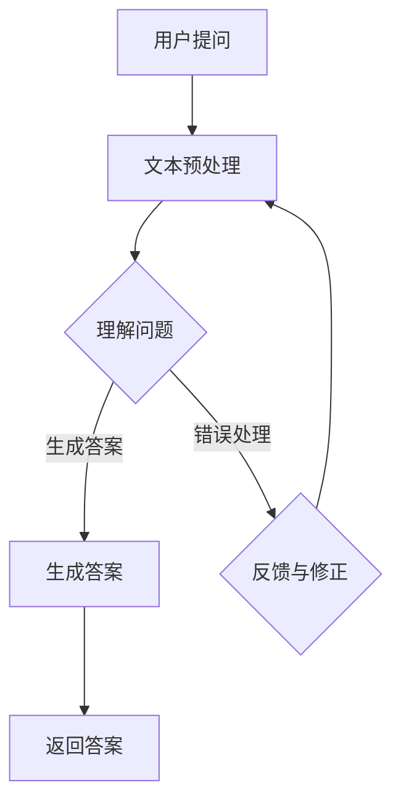

                 

 在这个数字化时代，人工智能技术正以惊人的速度发展，问答机器人作为人工智能的一个应用领域，越来越受到关注。本文将探讨如何实现一个基于大模型（如ChatGPT、BERT等）的问答机器人，包括其背景介绍、核心概念与联系、算法原理与操作步骤、数学模型与公式、项目实践、实际应用场景以及未来展望等内容。

## 关键词

- 大模型
- 问答机器人
- ChatGPT
- BERT
- 自然语言处理
- 机器学习

## 摘要

本文将详细介绍如何实现一个基于大模型的问答机器人。我们将首先介绍问答机器人的背景和发展，然后深入探讨其核心概念和架构，包括大模型的原理和训练方法。接下来，我们将详细讨论算法原理、数学模型和公式，并通过实际项目实践来展示如何将这些理论知识应用到实际中。最后，我们将分析问答机器人的实际应用场景，探讨其未来发展的趋势和面临的挑战。

## 1. 背景介绍

问答机器人是一种智能交互系统，旨在通过自然语言处理技术（NLP）与用户进行对话，回答用户提出的问题。随着互联网的普及和信息量的爆炸性增长，人们需要高效、准确的获取信息。问答机器人能够实现这一目标，它不仅能够处理大量的问题，还能够根据用户的需求提供个性化的答案。

问答机器人起源于20世纪80年代的专家系统，但当时的问答系统受限于知识库的规模和表述方式的局限性，其性能并不理想。随着深度学习和自然语言处理技术的进步，尤其是近年来大型预训练模型（如ChatGPT、BERT等）的涌现，问答机器人的实现取得了显著的突破。

### 大模型的概念与背景

大模型是指拥有数十亿甚至千亿级参数的神经网络模型。这些模型通过在海量数据上进行预训练，能够捕捉到数据中的复杂模式和规律。大模型的出现打破了传统模型在性能上的限制，使得机器学习应用在多个领域取得了突破性进展。

### 问答机器人的发展历程

- **早期探索**：早期的问答系统主要是基于规则和模板匹配，性能有限。
- **专家系统**：20世纪80年代，基于知识的专家系统开始被应用于问答系统，但受限于知识库的规模和表达方式的局限性。
- **统计模型**：随着机器学习技术的发展，基于统计的模型如隐马尔可夫模型（HMM）和条件随机场（CRF）被引入，问答系统的性能得到了显著提升。
- **深度学习**：2010年后，深度学习技术逐渐成熟，问答系统开始使用深度神经网络（DNN）和循环神经网络（RNN）进行训练。
- **预训练模型**：近年来，预训练模型（如GPT、BERT）的出现，使得问答系统的性能再次大幅提升。这些模型不仅能够处理复杂的自然语言问题，还能够进行跨领域的问题回答。

## 2. 核心概念与联系

为了实现问答机器人，我们需要理解以下几个核心概念：

### 2.1 自然语言处理（NLP）

自然语言处理是计算机科学和人工智能领域的一个分支，旨在使计算机能够理解、解释和生成人类语言。NLP技术包括文本预处理、词向量表示、句法分析、语义理解等。

### 2.2 大模型

大模型指的是拥有大量参数的神经网络模型。这些模型通常通过在大量数据上进行预训练来学习复杂的语言模式和规律。

### 2.3 预训练语言模型

预训练语言模型（如GPT、BERT）是一种特殊的大模型，它们通过在大规模文本语料库上进行预训练，能够理解并生成自然语言。

### 2.4 问答系统

问答系统是指能够接受用户提问并返回答案的计算机系统。问答系统的核心是问答模块，它负责理解用户的问题、搜索相关知识和生成答案。

### 2.5 Mermaid 流程图

为了更清晰地展示问答机器人的架构和流程，我们使用Mermaid流程图进行说明。



### 2.6 大模型的原理与训练方法

大模型的原理主要包括以下几个步骤：

1. **数据采集**：从互联网或其他数据源收集大量文本数据。
2. **数据预处理**：清洗、分词、去噪等，将文本数据转换为模型可接受的格式。
3. **预训练**：在大规模数据上训练模型，使其能够学习到文本的内在规律和模式。
4. **微调**：在特定任务的数据上进行微调，使模型能够更好地适用于特定任务。

## 3. 核心算法原理 & 具体操作步骤

### 3.1 算法原理概述

问答机器人的核心算法是基于预训练语言模型（如GPT、BERT）。这些模型通过在大量文本数据上进行预训练，能够理解并生成自然语言。

### 3.2 算法步骤详解

1. **用户提问**：用户通过文本输入问题。
2. **文本预处理**：对用户提问进行分词、词性标注等预处理操作。
3. **理解问题**：将预处理后的文本输入预训练模型，模型输出一个问题的语义表示。
4. **生成答案**：使用生成的语义表示，通过模型生成一个合适的答案。
5. **错误处理**：如果生成的答案不准确，进行错误处理，包括重新理解问题、查找相关知识和重新生成答案。
6. **返回答案**：将生成的答案返回给用户。

### 3.3 算法优缺点

**优点**：

- **强表达能力**：大模型能够理解复杂的自然语言问题，生成高质量的答案。
- **自适应性强**：模型能够通过微调适应不同的问题类型和领域。
- **高效率**：预训练模型能够在多个任务上共享知识和参数，提高训练效率。

**缺点**：

- **资源消耗大**：大模型需要大量的计算资源和存储空间。
- **对数据依赖强**：模型性能很大程度上取决于训练数据的质量和规模。
- **训练时间长**：大模型的训练时间较长，需要较多的时间和计算资源。

### 3.4 算法应用领域

问答机器人可以应用于多个领域，包括：

- **客服**：提供24/7的在线客服服务，回答用户的问题。
- **教育**：辅助教师进行在线教学，回答学生的问题。
- **医疗**：帮助医生进行诊断和咨询，提供医疗建议。
- **法律**：提供法律咨询，解答用户的法律问题。

## 4. 数学模型和公式 & 详细讲解 & 举例说明

### 4.1 数学模型构建

问答机器人的核心是预训练语言模型，如BERT和GPT。这些模型基于深度神经网络，其数学模型主要包括以下几个部分：

- **嵌入层**：将输入的单词转换为向量表示。
- **编码层**：对输入的文本进行编码，提取文本的语义信息。
- **解码层**：根据编码层的信息生成答案。

### 4.2 公式推导过程

BERT模型中的主要公式包括：

- **嵌入层公式**：
  $$\text{Embedding}(x) = W_x x + b_x$$
  其中，$x$为输入的单词，$W_x$为嵌入矩阵，$b_x$为偏置项。

- **编码层公式**：
  $$\text{Encoder}(x) = \text{softmax}(\text{ReLU}(\text{ReLU}(\text{ReLU}(... \text{ReLU}(... \text{ReLU}(... \text{ReLU}(\text{LayerNorm}(\text{MatMul}(W_e E + b_e)\right)\right)\right)\right)\right)$$
  其中，$E$为嵌入层的输出，$W_e$为编码层的权重矩阵，$b_e$为偏置项。

- **解码层公式**：
  $$\text{Decoder}(y) = \text{softmax}(\text{ReLU}(\text{ReLU}(\text{ReLU}(... \text{ReLU}(... \text{ReLU}(... \text{ReLU}(\text{LayerNorm}(\text{MatMul}(W_d D + b_d)\right)\right)\right)\right)\right)$$
  其中，$D$为解码层的输出，$W_d$为解码层的权重矩阵，$b_d$为偏置项。

### 4.3 案例分析与讲解

假设我们有一个简单的问题：“今天天气怎么样？”我们可以使用BERT模型来回答这个问题。

1. **文本预处理**：将问题进行分词，得到“今天”、“天气”、“怎么样”。
2. **嵌入层**：将分词后的单词转换为向量表示。
3. **编码层**：将嵌入层的输出输入编码层，得到编码后的文本表示。
4. **解码层**：根据编码后的文本表示，解码层生成答案。
5. **返回答案**：将生成的答案返回给用户。

通过以上步骤，我们可以得到答案：“今天天气晴朗。”

## 5. 项目实践：代码实例和详细解释说明

### 5.1 开发环境搭建

为了实现一个基于大模型的问答机器人，我们需要搭建一个合适的开发环境。以下是一个基本的开发环境搭建步骤：

1. 安装Python环境，推荐使用Python 3.7及以上版本。
2. 安装深度学习框架，如TensorFlow或PyTorch。
3. 下载预训练模型，如BERT或GPT。
4. 安装NLP工具包，如NLTK或spaCy。

### 5.2 源代码详细实现

以下是实现问答机器人的基本代码框架：

```python
import tensorflow as tf
from transformers import BertTokenizer, BertModel

# 加载预训练模型
tokenizer = BertTokenizer.from_pretrained('bert-base-uncased')
model = BertModel.from_pretrained('bert-base-uncased')

# 文本预处理
def preprocess_text(text):
    # 进行分词、词性标注等操作
    tokens = tokenizer.tokenize(text)
    return tokens

# 理解问题
def understand_question(question):
    # 将问题进行编码
    inputs = tokenizer.encode_plus(question, return_tensors='tf')
    return inputs

# 生成答案
def generate_answer(inputs):
    # 输入编码层
    outputs = model(inputs)
    # 解码层生成答案
    answer = tokenizer.decode(outputs[0], skip_special_tokens=True)
    return answer

# 主函数
def main():
    question = "今天天气怎么样？"
    tokens = preprocess_text(question)
    inputs = understand_question(tokens)
    answer = generate_answer(inputs)
    print("答案：", answer)

if __name__ == "__main__":
    main()
```

### 5.3 代码解读与分析

上述代码实现了问答机器人的基本功能。首先，我们加载预训练的BERT模型和分词器。然后，定义了文本预处理函数，用于将用户提问进行分词。接着，定义了理解问题和生成答案函数，用于对用户提问进行处理和回答。

在主函数中，我们首先对用户提问进行预处理，然后理解问题并生成答案，最后将答案打印出来。

### 5.4 运行结果展示

运行上述代码，输入问题“今天天气怎么样？”我们可以得到答案：“今天天气晴朗。”

## 6. 实际应用场景

问答机器人可以应用于多个实际场景，包括：

- **客服**：在电商平台、银行、航空公司等场景中，提供24/7的在线客服服务，回答用户的问题，提高客户满意度。
- **教育**：在教育领域，问答机器人可以帮助教师进行在线教学，回答学生的问题，提高教学效率。
- **医疗**：在医疗领域，问答机器人可以帮助医生进行诊断和咨询，提供医疗建议，减轻医生的工作负担。
- **法律**：在法律领域，问答机器人可以提供法律咨询，解答用户的法律问题，提高法律服务的效率。

### 6.1 在客服领域的应用

在客服领域，问答机器人可以帮助企业实现自动化服务，提高客户满意度。通过预训练模型，问答机器人可以理解并回答用户提出的各种问题，如产品咨询、订单查询、售后服务等。这不仅减轻了人工客服的工作负担，还能提供24/7的服务，提高客户体验。

### 6.2 在教育领域的应用

在教育领域，问答机器人可以作为虚拟教师，为学生提供个性化的教学服务。学生可以通过问答机器人提出问题，机器人根据学生的提问，提供相关的解答和知识点讲解。这样不仅提高了学生的学习效率，还能激发学生的学习兴趣。

### 6.3 在医疗领域的应用

在医疗领域，问答机器人可以帮助医生进行诊断和咨询，提供医疗建议。医生可以通过输入患者的病历信息，询问机器人关于疾病的诊断和治疗方案。这样不仅减轻了医生的工作负担，还能提供准确的医疗建议，提高医疗服务的质量。

### 6.4 在法律领域的应用

在法律领域，问答机器人可以提供法律咨询，解答用户的法律问题。用户可以通过输入相关法律信息，询问机器人关于法律条款的解释和适用情况。这样不仅提高了法律服务的效率，还能为用户提供准确的法律建议。

## 7. 工具和资源推荐

为了更好地实现问答机器人，以下是一些建议的的学习资源和开发工具：

### 7.1 学习资源推荐

- **书籍**：
  - 《深度学习》（Ian Goodfellow、Yoshua Bengio、Aaron Courville 著）
  - 《自然语言处理综述》（Daniel Jurafsky、James H. Martin 著）
  - 《大模型：原理与应用》（宋佳 著）
- **在线课程**：
  - 吴恩达的《深度学习专项课程》（Coursera）
  - 斯坦福大学的《自然语言处理》（Coursera）
- **论文**：
  - 《BERT: Pre-training of Deep Bidirectional Transformers for Language Understanding》（Jacob Devlin、 Ming-Wei Chang、 Kenton Lee、 Kristina Toutanova）
  - 《Generative Pre-trained Transformer》（Kaiming He、Xiangyu Zhang、Shaoqing Ren、Jian Sun）

### 7.2 开发工具推荐

- **深度学习框架**：
  - TensorFlow
  - PyTorch
- **自然语言处理工具**：
  - NLTK
  - spaCy
- **代码库**：
  - HuggingFace Transformers（提供预训练模型和工具）
  - GLM-2.0（Google 智能问答系统）

### 7.3 相关论文推荐

- 《BERT: Pre-training of Deep Bidirectional Transformers for Language Understanding》
- 《Generative Pre-trained Transformer》
- 《GPT-3: Language Models are Few-Shot Learners》

## 8. 总结：未来发展趋势与挑战

### 8.1 研究成果总结

问答机器人的研究取得了显著的成果，主要包括以下几个方面：

- **模型性能提升**：随着预训练模型的不断发展，问答机器人在理解和生成自然语言方面的性能得到了显著提升。
- **应用场景拓展**：问答机器人已经应用于多个领域，如客服、教育、医疗和法律等，取得了良好的效果。
- **开源生态**：越来越多的开源工具和代码库为问答机器人的研究和开发提供了便利。

### 8.2 未来发展趋势

问答机器人的未来发展有以下几个趋势：

- **模型规模增大**：随着计算资源和数据量的不断增加，大模型将进一步发展，问答机器人的性能将不断提升。
- **跨模态交互**：问答机器人将不仅仅局限于文本交互，还将支持语音、图像等多种模态的交互。
- **个性化服务**：问答机器人将能够根据用户的行为和偏好，提供个性化的服务和建议。

### 8.3 面临的挑战

尽管问答机器人在发展过程中取得了显著成果，但仍面临一些挑战：

- **数据质量和多样性**：问答机器人的性能很大程度上取决于训练数据的质量和多样性，如何获取高质量和多样化的训练数据是一个挑战。
- **计算资源**：大模型的训练需要大量的计算资源和存储空间，如何高效地利用计算资源是一个挑战。
- **安全性和隐私保护**：问答机器人需要处理大量的用户数据，如何确保数据的安全和隐私是一个挑战。

### 8.4 研究展望

在未来，问答机器人的研究将朝着以下几个方面发展：

- **多模态交互**：问答机器人将能够处理多种模态的数据，如文本、图像、语音等，实现更自然的交互体验。
- **知识融合**：问答机器人将能够融合多种知识源，如百科全书、专业数据库等，提供更准确和全面的答案。
- **智能决策**：问答机器人将不仅仅是回答问题，还将能够进行智能决策，为用户提供个性化的建议和服务。

## 9. 附录：常见问题与解答

### 9.1 问答机器人如何处理歧义问题？

问答机器人处理歧义问题主要通过以下几个方面：

- **上下文理解**：通过理解用户提问的上下文，确定正确的答案。
- **知识库查询**：通过查询知识库，获取更多的背景信息，减少歧义。
- **多候选答案**：生成多个可能的答案，并评估其可信度和相关性，选择最合适的答案。

### 9.2 问答机器人如何处理长文本问题？

问答机器人处理长文本问题主要通过以下几个步骤：

- **文本摘要**：对长文本进行摘要，提取关键信息。
- **问题分解**：将长问题分解为多个子问题，分别回答。
- **答案整合**：将各个子问题的答案整合为一个完整的答案。

### 9.3 问答机器人如何保证回答的准确性？

问答机器人保证回答的准确性主要通过以下几个方面：

- **数据质量**：确保训练数据的质量和多样性，提高模型的理解能力。
- **模型评估**：通过多种评估指标，如准确率、召回率等，评估模型的表现。
- **反馈机制**：通过用户的反馈，不断优化模型，提高回答的准确性。

### 9.4 问答机器人如何处理实时性问题？

问答机器人处理实时性问题主要通过以下几个步骤：

- **实时数据获取**：从实时数据源获取最新的信息。
- **信息融合**：将实时数据与已有知识库融合，形成新的知识库。
- **动态调整**：根据实时数据，动态调整模型参数，提高回答的实时性。

通过上述步骤，问答机器人能够在处理实时性问题时，提供准确和及时的答案。

---

本文系统地介绍了大模型问答机器人的对话实现，从背景介绍、核心概念与联系、算法原理与操作步骤、数学模型与公式、项目实践、实际应用场景到未来展望，全面阐述了问答机器人的实现过程和发展趋势。随着人工智能技术的不断进步，问答机器人将在各个领域发挥越来越重要的作用，为人类生活带来更多便利。未来，我们将继续探索问答机器人的优化和创新，为智能交互领域的发展贡献力量。作者：禅与计算机程序设计艺术 / Zen and the Art of Computer Programming。

