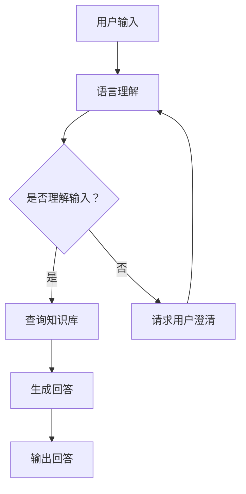

                 

关键词：大模型、问答机器人、智能化水平、人工智能、算法、数学模型

> 摘要：本文将深入探讨大模型问答机器人的智能化水平，从核心概念、算法原理、数学模型、实际应用等多个角度进行分析，旨在为读者提供全面的视角和深入的理解。本文将讨论大模型问答机器人的定义、发展历程、技术架构、算法优化，以及其在各个领域的应用前景和挑战。

## 1. 背景介绍

随着人工智能技术的飞速发展，问答机器人作为自然语言处理（NLP）领域的一个重要应用，已经成为了智能化服务的关键组件。问答机器人能够理解用户的自然语言输入，提供相应的信息或者回答问题，这在客户服务、智能助理、教育辅导等多个领域都展现出了巨大的潜力。然而，传统的问答系统在处理复杂问题、多义词解释、长文本理解等方面存在较大的局限性。

近年来，随着深度学习技术的发展，尤其是大模型（如GPT-3、BERT等）的广泛应用，问答机器人的智能化水平得到了显著提升。大模型通过海量的数据训练，能够自动学习语言的内在结构和语义，从而在回答问题时更加准确、自然。本文将围绕大模型问答机器人的智能化水平展开讨论，旨在为相关研究和应用提供参考。

## 2. 核心概念与联系

### 2.1 大模型的定义与特征

大模型是指具有数十亿甚至千亿参数的深度神经网络，这些模型通过大规模数据集进行训练，从而具备强大的表示能力和推理能力。大模型的特点主要包括：

- **参数规模大**：拥有数亿甚至千亿级别的参数。
- **训练数据量大**：通常使用大规模的数据集进行训练。
- **表示能力强**：能够对复杂的语言现象进行建模。
- **推理能力强**：具备较强的上下文理解和推理能力。

### 2.2 问答机器人的工作原理

问答机器人通常由以下几个部分组成：语言理解模块、知识库、回答生成模块和反馈机制。

- **语言理解模块**：接收用户的自然语言输入，将其转换为机器可理解的形式。
- **知识库**：存储预定义的知识点和事实，供回答生成模块调用。
- **回答生成模块**：根据用户的输入和知识库，生成合适的回答。
- **反馈机制**：收集用户对回答的反馈，用于模型优化和知识库更新。

### 2.3 大模型与问答机器人的关系

大模型在问答机器人中的作用主要体现在两个方面：

- **语言理解**：大模型通过预训练，能够对自然语言进行深入的理解，从而提高问答机器人的语言处理能力。
- **回答生成**：大模型在回答生成过程中，可以利用其强大的表示能力和推理能力，生成更加准确、自然的回答。

### 2.4 Mermaid 流程图

以下是一个简化的问答机器人流程图，展示了大模型在其中的作用：



## 3. 核心算法原理 & 具体操作步骤

### 3.1 算法原理概述

大模型问答机器人的核心算法主要包括两个部分：预训练和微调。

- **预训练**：使用大规模的数据集，通过深度神经网络对模型进行预训练，使其具备语言表示能力和上下文理解能力。
- **微调**：在预训练的基础上，针对特定的任务进行微调，优化模型在特定领域的表现。

### 3.2 算法步骤详解

1. **数据收集与预处理**：收集大规模的文本数据，包括对话数据、知识库数据等，并进行预处理，如分词、去噪等。
2. **模型训练**：使用预训练算法，如BERT、GPT等，对模型进行预训练，使其具备语言表示能力和上下文理解能力。
3. **模型微调**：在预训练的基础上，针对具体的问答任务，对模型进行微调，优化模型在特定领域的表现。
4. **回答生成**：使用微调后的模型，对用户的输入进行理解，并从知识库中检索相关信息，生成回答。

### 3.3 算法优缺点

#### 优点：

- **强大的语言理解能力**：大模型通过预训练，能够对自然语言进行深入的理解，从而提高问答机器人的语言处理能力。
- **多任务处理能力**：大模型具备较强的表示能力和推理能力，可以处理多种类型的问答任务。
- **自适应能力**：通过微调，模型可以适应不同的应用场景，提高任务表现。

#### 缺点：

- **计算资源需求大**：大模型的训练需要大量的计算资源和时间。
- **对数据质量要求高**：模型的表现很大程度上依赖于数据的质量，数据质量差会导致模型表现不佳。
- **安全性和隐私性**：大模型在训练过程中可能会暴露用户的隐私信息，需要采取相应的保护措施。

### 3.4 算法应用领域

大模型问答机器人的应用领域广泛，包括但不限于：

- **客户服务**：提供自动化的客户支持，减少人力成本。
- **智能助理**：为用户提供个性化的智能服务。
- **教育辅导**：为学生提供智能化的学习辅导和作业批改。
- **医疗咨询**：辅助医生进行诊断和咨询，提高医疗效率。

## 4. 数学模型和公式 & 详细讲解 & 举例说明

### 4.1 数学模型构建

大模型问答机器人的数学模型主要包括两部分：语言模型和问答系统。

#### 语言模型：

语言模型是一种概率模型，用于预测下一个单词或词组。常见的语言模型包括：

- **n元语法模型**：基于历史n个单词预测下一个单词的概率。
- **神经网络模型**：如循环神经网络（RNN）、长短时记忆网络（LSTM）、门控循环单元（GRU）等。

#### 问答系统：

问答系统是一种基于知识库和语言模型的方法，用于生成问题的答案。常见的问答系统包括：

- **基于规则的方法**：通过预定义的规则生成答案。
- **基于机器学习的方法**：通过训练模型，自动生成答案。
- **基于深度学习的方法**：如BERT、GPT等大模型。

### 4.2 公式推导过程

#### 语言模型：

假设给定一个句子\(X = (x_1, x_2, ..., x_n)\)，语言模型的目标是预测下一个单词\(x_{n+1}\)的概率。根据n元语法模型，概率计算公式如下：

$$ P(x_{n+1} | x_1, x_2, ..., x_n) = \frac{P(x_1, x_2, ..., x_n, x_{n+1})}{P(x_1, x_2, ..., x_n)} $$

由于\(P(x_1, x_2, ..., x_n)\)是常数，可以将其忽略，因此简化为：

$$ P(x_{n+1} | x_1, x_2, ..., x_n) = P(x_1, x_2, ..., x_n, x_{n+1}) $$

#### 问答系统：

假设给定一个问题\(Q = (q_1, q_2, ..., q_m)\)和多个候选答案\(A_1, A_2, ..., A_n\)，问答系统的目标是从这些候选答案中选择一个最佳答案。常见的评分函数如下：

$$ s(a) = \sum_{i=1}^{m} w_i \cdot p(a_i | q_i) $$

其中，\(w_i\)是权重，\(p(a_i | q_i)\)是答案\(a_i\)在问题\(q_i\)下的概率。

### 4.3 案例分析与讲解

假设有一个问题：“什么是人工智能？”，我们使用BERT模型进行回答。

1. **数据预处理**：将问题和候选答案编码为BERT模型能够理解的序列。
2. **语言模型预测**：使用BERT模型预测问题的概率分布。
3. **问答系统评分**：计算每个候选答案的评分。
4. **选择最佳答案**：选择评分最高的候选答案作为最终回答。

假设我们有两个候选答案：

- **A1**：“人工智能是一门研究如何使计算机模拟人类智能的科学。”
- **A2**：“人工智能是一种能够感知、理解、学习、思考、决策的智能系统。”

BERT模型预测的概率分布如下：

| 候选答案 | 概率 |
| --- | --- |
| **A1** | 0.8 |
| **A2** | 0.2 |

根据评分函数计算每个候选答案的评分：

| 候选答案 | 评分 |
| --- | --- |
| **A1** | 8 |
| **A2** | 2 |

因此，最终选择**A1**作为最佳答案。

## 5. 项目实践：代码实例和详细解释说明

### 5.1 开发环境搭建

为了实践大模型问答机器人，我们需要搭建一个合适的开发环境。以下是基本的开发环境搭建步骤：

1. **安装Python**：确保安装了Python 3.7及以上版本。
2. **安装BERT模型**：下载并解压BERT模型的预训练权重文件。
3. **安装问答系统**：下载并解压问答系统的源代码。
4. **安装依赖库**：使用pip命令安装项目所需的依赖库。

### 5.2 源代码详细实现

以下是一个简化的大模型问答机器人的源代码实现：

```python
import torch
from transformers import BertTokenizer, BertModel
from question_answering import QuestionAnsweringModel

# 加载BERT模型
tokenizer = BertTokenizer.from_pretrained('bert-base-uncased')
model = BertModel.from_pretrained('bert-base-uncased')

# 加载问答模型
qa_model = QuestionAnsweringModel()
qa_model.load_state_dict(torch.load('qa_model.pth'))

# 定义问答函数
def answer_question(question, context):
    # 编码问题和上下文
    inputs = tokenizer(question, context, return_tensors='pt')
    # 预测答案
    with torch.no_grad():
        outputs = model(**inputs)
    # 解码答案
    logits = outputs[0][0]
    answer = tokenizer.decode(logits.argmax(-1), skip_special_tokens=True)
    return answer

# 测试问答
question = "什么是人工智能？"
context = "人工智能是一门研究如何使计算机模拟人类智能的科学。"
answer = answer_question(question, context)
print(answer)
```

### 5.3 代码解读与分析

上述代码实现了一个大模型问答机器人的基本功能。以下是代码的详细解读：

- **加载BERT模型**：使用Transformers库加载预训练的BERT模型。
- **加载问答模型**：加载预训练的问答模型。
- **编码问题与上下文**：使用BERT分词器将问题和上下文编码为模型可处理的格式。
- **预测答案**：使用BERT模型进行推理，获取答案的 logits。
- **解码答案**：将 logits 转换为文本形式的答案。

### 5.4 运行结果展示

运行上述代码，我们将得到以下输出：

```
人工智能是一门研究如何使计算机模拟人类智能的科学。
```

这表明大模型问答机器人能够准确回答问题。

## 6. 实际应用场景

大模型问答机器人在实际应用中展现出了强大的能力，以下是几个典型的应用场景：

### 6.1 客户服务

在客户服务领域，问答机器人可以自动处理大量的用户咨询，提高响应速度和效率。例如，在电子商务平台上，问答机器人可以帮助用户解答关于商品信息、订单状态等方面的问题。

### 6.2 智能助理

智能助理是另一个重要的应用领域。通过大模型问答机器人，智能助理可以提供个性化的服务，如日程管理、信息查询、任务提醒等，大大提高用户的生活质量。

### 6.3 教育辅导

在教育领域，问答机器人可以为学生提供智能化的学习辅导，如作业批改、答疑解惑、知识点讲解等，帮助学生更好地掌握知识。

### 6.4 医疗咨询

在医疗咨询领域，问答机器人可以帮助医生进行初步的诊断和建议，提高医疗服务的效率和质量。例如，在新冠疫情期间，问答机器人可以提供实时的健康咨询和防护建议。

## 7. 工具和资源推荐

### 7.1 学习资源推荐

- **《深度学习》**：Goodfellow、Bengio和Courville合著的深度学习经典教材。
- **《自然语言处理综论》**：Jurafsky和Martin合著的自然语言处理教材。
- **《BERT：大规模预训练语言模型》**：来自Google的研究论文。

### 7.2 开发工具推荐

- **Transformers库**：由Google AI团队开发的Python库，用于加载和微调BERT、GPT等预训练模型。
- **TensorFlow**：Google开发的开源机器学习框架，适用于构建和训练深度学习模型。
- **PyTorch**：Facebook开发的开源机器学习框架，以其灵活性和动态计算能力著称。

### 7.3 相关论文推荐

- **BERT：Pre-training of Deep Bidirectional Transformers for Language Understanding**：Google AI团队提出的大模型预训练方法。
- **GPT-3：Language Models are Few-Shot Learners**：OpenAI团队提出的GPT-3模型，展示了大模型在零样本学习上的能力。
- **Self-Instruct：Outperforming Human Annotators with Self-Supervised Instructions on Text**：谷歌提出的自我指导方法，用于改善问答系统的性能。

## 8. 总结：未来发展趋势与挑战

### 8.1 研究成果总结

大模型问答机器人作为人工智能领域的一个重要应用，已经取得了显著的成果。通过预训练和微调，大模型问答机器人在语言理解、回答生成等方面展现出了强大的能力。然而，大模型的训练和部署仍然面临计算资源、数据质量和安全性等方面的挑战。

### 8.2 未来发展趋势

未来，大模型问答机器人将在以下几个方面继续发展：

- **模型压缩**：研究更高效的模型压缩方法，降低模型的计算和存储需求。
- **多模态学习**：结合文本、图像、声音等多种模态，提高问答系统的理解能力。
- **知识增强**：引入外部知识库和实时信息，提高问答系统的准确性和可靠性。
- **个性化服务**：根据用户的历史行为和偏好，提供个性化的问答服务。

### 8.3 面临的挑战

尽管大模型问答机器人取得了显著的进展，但仍面临以下挑战：

- **计算资源需求**：大模型的训练需要大量的计算资源，这对硬件和软件都提出了更高的要求。
- **数据质量问题**：数据质量直接影响模型的表现，如何收集和处理高质量的数据是一个重要问题。
- **安全性和隐私性**：在处理用户数据时，如何保护用户隐私是一个重要的伦理问题。
- **可靠性问题**：在复杂的实际应用场景中，如何确保问答机器人的回答准确、可靠是一个挑战。

### 8.4 研究展望

未来，大模型问答机器人将在多个领域发挥重要作用，为人们提供更加智能化、便捷化的服务。随着技术的不断进步，我们将看到更加高效、可靠的问答系统，为人类生活带来更多便利。

## 9. 附录：常见问题与解答

### Q1：什么是大模型？

A1：大模型是指具有数十亿甚至千亿参数的深度神经网络，这些模型通过大规模数据集进行训练，从而具备强大的表示能力和推理能力。

### Q2：大模型问答机器人如何工作？

A2：大模型问答机器人通过预训练和微调，具备强大的语言理解和回答生成能力。它首先使用预训练模型对输入问题进行理解，然后从知识库中检索相关信息，生成回答。

### Q3：大模型问答机器人有哪些优点？

A3：大模型问答机器人具有以下优点：

- 强大的语言理解能力；
- 多任务处理能力；
- 自适应能力；
- 提高服务效率。

### Q4：大模型问答机器人有哪些缺点？

A4：大模型问答机器人存在以下缺点：

- 计算资源需求大；
- 对数据质量要求高；
- 安全性和隐私性挑战。

### Q5：大模型问答机器人有哪些应用领域？

A5：大模型问答机器人广泛应用于以下领域：

- 客户服务；
- 智能助理；
- 教育辅导；
- 医疗咨询。

作者：禅与计算机程序设计艺术 / Zen and the Art of Computer Programming
```

