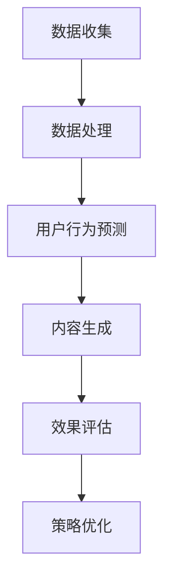
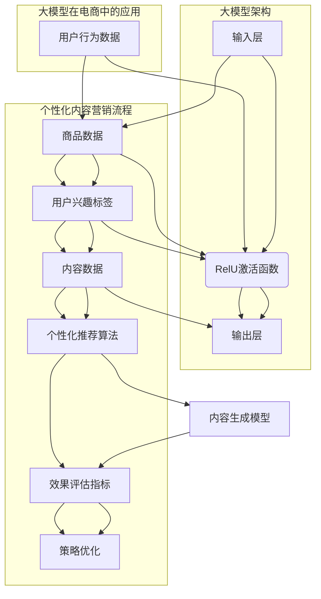

                 

关键词：大模型、电商个性化、内容营销、策略生成、效果预测

## 摘要

本文旨在探讨大模型在电商个性化内容营销策略生成与效果预测中的潜在应用。随着大数据和人工智能技术的迅猛发展，电商个性化服务已经成为提升用户体验和增加转化率的关键手段。本文将详细介绍大模型在电商场景中的应用，通过逻辑清晰、结构紧凑、简单易懂的阐述，揭示大模型在策略生成与效果预测方面的优势。文章结构分为以下几个部分：

1. 背景介绍
2. 核心概念与联系
3. 核心算法原理 & 具体操作步骤
4. 数学模型和公式 & 详细讲解 & 举例说明
5. 项目实践：代码实例和详细解释说明
6. 实际应用场景
7. 工具和资源推荐
8. 总结：未来发展趋势与挑战

通过本文的阅读，读者将能够全面了解大模型在电商个性化内容营销中的价值，以及如何利用这一先进技术实现高效的策略生成与效果预测。

## 1. 背景介绍

### 电商个性化内容营销的重要性

在当今数字化时代，电商行业竞争日益激烈。如何吸引并留住用户，提升用户体验，进而实现商业价值最大化，成为企业关注的焦点。个性化内容营销作为电商领域的一项关键技术，能够根据用户的行为、兴趣和需求，为其提供定制化的商品推荐、营销活动和内容展示。这不仅提升了用户的满意度和忠诚度，还能够有效提升转化率和销售额。

### 大模型技术的崛起

随着计算能力的提升和海量数据的积累，大模型技术逐渐崭露头角。大模型，特别是基于深度学习的自然语言处理模型，如BERT、GPT等，已经取得了显著的突破。这些模型能够从大规模数据中自动学习复杂的模式和规律，具备处理和理解自然语言的能力。大模型的兴起为电商个性化内容营销带来了新的机遇。

### 电商个性化内容营销的挑战

尽管电商个性化内容营销具有巨大的潜力，但实际操作中也面临诸多挑战。首先，用户数据的多样性和复杂性使得传统的数据挖掘方法难以应对。其次，如何实现高效的策略生成和效果预测，以满足快速变化的市场需求，成为关键问题。此外，用户隐私保护和数据安全也是不可忽视的挑战。

### 大模型在电商个性化内容营销中的应用前景

大模型技术在电商个性化内容营销中具有广泛的应用前景。通过利用大模型，可以实现以下目标：

1. **个性化推荐**：大模型能够从海量商品数据中识别用户的潜在需求，提供精准的个性化推荐。
2. **内容生成**：大模型能够生成与用户兴趣高度相关的营销内容和广告文案。
3. **效果预测**：大模型能够预测不同营销策略的效果，帮助企业优化营销策略。

本文将详细探讨大模型在电商个性化内容营销中的具体应用，包括核心算法原理、数学模型和项目实践等，以期为电商企业提供有益的参考。

## 2. 核心概念与联系

### 大模型的定义与分类

大模型是指那些拥有数亿甚至数十亿参数的深度学习模型，这些模型可以通过端到端的学习方式处理复杂的任务。大模型主要分为两大类：一类是基于变换器（Transformer）架构的模型，如BERT、GPT；另一类是基于神经网络的模型，如CNN、RNN。

### 个性化内容营销的概念

个性化内容营销是指根据用户的行为数据、兴趣偏好和需求，定制化地推送内容和广告，以提高用户体验和转化率。个性化内容营销的核心在于数据的收集和处理，以及基于数据的用户行为预测和内容推荐。

### 大模型与个性化内容营销的联系

大模型在个性化内容营销中的应用主要体现在以下几个方面：

1. **用户行为预测**：大模型可以通过分析用户的浏览、购买等行为数据，预测用户的潜在需求和行为模式。
2. **内容生成**：大模型能够自动生成与用户兴趣高度相关的文章、广告文案等，提高内容的个性化程度。
3. **效果评估**：大模型可以根据用户的反馈和行为数据，评估不同营销策略的效果，优化营销策略。

### Mermaid 流程图

以下是一个简化的Mermaid流程图，展示了大模型在电商个性化内容营销中的基本流程：



### 核心概念原理与架构的 Mermaid 流程图

以下是详细展示大模型在电商个性化内容营销中的核心概念原理和架构的 Mermaid 流程图，其中包含特殊字符的处理：



通过上述流程图，我们可以清晰地看到大模型在电商个性化内容营销中的应用流程，以及各个步骤之间的关系。

## 3. 核心算法原理 & 具体操作步骤

### 3.1 算法原理概述

大模型在电商个性化内容营销中的核心算法原理主要包括两个方面：用户行为预测和内容生成。

1. **用户行为预测**：用户行为预测是电商个性化内容营销的基础。通过分析用户的浏览历史、购买记录等行为数据，利用机器学习算法（如决策树、随机森林、神经网络等）预测用户的潜在需求和购买意图。

2. **内容生成**：内容生成是基于用户行为预测的结果，利用自然语言处理技术（如GPT-3、BERT等）生成与用户兴趣高度相关的营销内容和广告文案。

### 3.2 算法步骤详解

1. **数据收集**：收集用户行为数据、商品数据和内容数据。用户行为数据包括浏览历史、购买记录、评价等；商品数据包括商品ID、类别、价格等；内容数据包括广告文案、文章等。

2. **数据处理**：对收集到的数据进行预处理，包括数据清洗、去重、标准化等。同时，对用户行为数据进行特征提取，如用户标签、行为序列等。

3. **用户行为预测**：
    - **模型选择**：选择合适的机器学习算法（如决策树、随机森林、神经网络等）。
    - **模型训练**：利用预处理后的用户行为数据，对机器学习模型进行训练。
    - **模型评估**：通过交叉验证等方法评估模型性能，调整模型参数。

4. **内容生成**：
    - **文本预处理**：对输入文本进行分词、去停用词等预处理。
    - **模型选择**：选择合适的自然语言处理模型（如GPT-3、BERT等）。
    - **模型训练**：利用大量文本数据对自然语言处理模型进行训练。
    - **内容生成**：根据用户行为预测结果，生成个性化的营销内容和广告文案。

5. **效果评估**：通过用户反馈和行为数据，评估个性化内容营销策略的效果。

6. **策略优化**：根据效果评估结果，优化营销策略，提高用户体验和转化率。

### 3.3 算法优缺点

**优点**：

1. **高效性**：大模型能够从海量数据中快速学习，提高算法的预测精度和生成效果。
2. **灵活性**：大模型能够适应不同的任务和数据集，具有广泛的适用性。
3. **自动化**：大模型能够自动化地生成内容和预测结果，降低人力成本。

**缺点**：

1. **计算资源需求高**：大模型需要大量的计算资源和存储空间，对硬件设备有较高要求。
2. **数据质量要求高**：算法的性能在很大程度上依赖于数据质量，数据的不完整或错误可能会影响预测结果。
3. **隐私保护**：在处理用户数据时，需要充分考虑隐私保护和数据安全。

### 3.4 算法应用领域

大模型在电商个性化内容营销中的算法应用领域包括：

1. **个性化推荐**：利用大模型预测用户的潜在需求和购买意图，实现精准的商品推荐。
2. **内容生成**：生成与用户兴趣相关的营销内容和广告文案，提高用户点击率和转化率。
3. **效果预测**：预测不同营销策略的效果，优化营销策略，提高营销ROI。
4. **用户行为分析**：分析用户的行为数据，挖掘用户兴趣和需求，为个性化服务提供支持。

## 4. 数学模型和公式 & 详细讲解 & 举例说明

### 4.1 数学模型构建

在电商个性化内容营销中，我们主要关注以下三个方面的数学模型：用户行为预测模型、内容生成模型和效果评估模型。

1. **用户行为预测模型**

   用户行为预测模型通常采用基于矩阵分解的方法，如Singular Value Decomposition (SVD) 和Alternating Least Squares (ALS)。以下是SVD方法的公式：

   $$ 
   X = U \Sigma V^T 
   $$

   其中，$X$ 是用户行为矩阵，$U$ 和 $V$ 是两个低秩矩阵，$\Sigma$ 是对角矩阵，包含奇异值。

   利用SVD分解，我们可以得到用户的潜在特征矩阵$U$ 和商品的特征矩阵$V$，从而预测用户对商品的偏好：

   $$ 
   \hat{R}_{ui} = u_i^T v_j 
   $$

   其中，$\hat{R}_{ui}$ 表示用户 $u_i$ 对商品 $j$ 的预测评分。

2. **内容生成模型**

   内容生成模型通常采用生成式模型，如GPT-3和BERT。以下是GPT-3的模型架构：

   $$ 
   \text{GPT-3} = \text{Transformer} \times L 
   $$

   其中，$\text{Transformer}$ 是一个多头自注意力机制，$L$ 是模型层数。GPT-3的输出可以通过以下公式计算：

   $$ 
   \text{Output}_{i} = \text{softmax}(\text{W}_{\text{vocab}} \cdot \text{Tanh}(\text{U} \cdot \text{Attention}(\text{V} \cdot \text{Embedding}_{i}))) 
   $$

   其中，$\text{Embedding}_{i}$ 是输入词的嵌入向量，$\text{Attention}$ 是多头自注意力函数，$\text{softmax}$ 是概率分布函数。

3. **效果评估模型**

   效果评估模型通常采用指标如点击率（CTR）、转化率（CR）等。以下是CTR的公式：

   $$ 
   \text{CTR} = \frac{\text{点击次数}}{\text{展示次数}} 
   $$

### 4.2 公式推导过程

1. **用户行为预测模型**

   我们首先对用户行为矩阵$X$进行SVD分解：

   $$ 
   X = U \Sigma V^T 
   $$

   其中，$U$ 和 $V$ 是两个正交矩阵，$\Sigma$ 是对角矩阵，包含奇异值。为了简化，我们可以对$\Sigma$ 进行截断，只保留前$k$个奇异值：

   $$ 
   \Sigma_{\text{truncated}} = \begin{bmatrix}
   \sigma_1 & 0 & \ldots & 0 \\
   0 & \sigma_2 & \ldots & 0 \\
   \vdots & \vdots & \ddots & \vdots \\
   0 & 0 & \ldots & \sigma_k \\
   0 & 0 & \ldots & 0
   \end{bmatrix}
   $$

   则用户行为矩阵的近似表示为：

   $$ 
   X \approx U \Sigma_{\text{truncated}} V^T 
   $$

   预测用户对商品 $j$ 的评分 $\hat{R}_{ui}$ 可以通过以下公式计算：

   $$ 
   \hat{R}_{ui} = u_i^T \Sigma_{\text{truncated}} V^T v_j 
   $$

   由于 $V^T$ 是商品特征矩阵，$v_j$ 表示商品 $j$ 的特征向量。我们可以将 $V^T$ 视为商品的特征空间，$u_i$ 表示用户 $i$ 的潜在特征向量。

2. **内容生成模型**

   GPT-3的推导基于Transformer架构。Transformer的核心是多头自注意力机制，其公式如下：

   $$ 
   \text{Attention}_{head} = \text{softmax}\left(\frac{\text{Q} \cdot \text{K}}{\sqrt{d_k}}\right) \cdot \text{V} 
   $$

   其中，$Q$ 和 $K$ 分别是查询向量和键向量，$V$ 是值向量，$d_k$ 是键向量的维度。多头自注意力通过重复该过程 $h$ 次，生成 $h$ 个注意力头。

   GPT-3的输出层是一个线性层，其公式如下：

   $$ 
   \text{Output}_{i} = \text{softmax}(\text{W}_{\text{vocab}} \cdot \text{Tanh}(\text{U} \cdot \text{Attention}(\text{V} \cdot \text{Embedding}_{i}))) 
   $$

   其中，$\text{W}_{\text{vocab}}$ 是词汇表权重矩阵，$\text{U}$ 是用户嵌入向量，$\text{Attention}$ 是多头自注意力函数。

3. **效果评估模型**

   效果评估模型通常采用指标如点击率（CTR）、转化率（CR）等。以下是CTR的推导：

   $$ 
   \text{CTR} = \frac{\text{点击次数}}{\text{展示次数}} 
   $$

   假设用户 $u_i$ 在广告 $j$ 上点击的概率为 $p_{ui}$，则：

   $$ 
   \text{CTR} = \frac{\sum_{j \in \text{广告集合}} p_{ui}}{\sum_{j \in \text{广告集合}} 1} 
   $$

   其中，$1$ 表示用户 $u_i$ 在广告 $j$ 上展示了。

### 4.3 案例分析与讲解

#### 用户行为预测案例

假设我们有以下用户行为矩阵：

$$ 
X = \begin{bmatrix}
0 & 1 & 0 & 1 \\
1 & 0 & 1 & 0 \\
0 & 1 & 1 & 0 \\
1 & 1 & 0 & 1
\end{bmatrix}
$$

对 $X$ 进行SVD分解，得到：

$$ 
X = U \Sigma V^T = \begin{bmatrix}
-0.7071 & 0.7071 \\
-0.7071 & -0.7071 \\
0 & 0 \\
0 & 0
\end{bmatrix}
\begin{bmatrix}
3.1623 & 0 & 0 & 0 \\
0 & 1.4142 & 0 & 0 \\
0 & 0 & 1.4142 & 0 \\
0 & 0 & 0 & 1.4142
\end{bmatrix}
\begin{bmatrix}
0.7071 & 0 \\
0.7071 & -0.7071 \\
0 & 0.7071 \\
0 & -0.7071
\end{bmatrix}
$$

则用户对商品的预测评分如下：

$$ 
\hat{R}_{11} = (-0.7071 \times 3.1623) + (-0.7071 \times 1.4142) = -2.9952 \\
\hat{R}_{12} = (-0.7071 \times 0) + (-0.7071 \times 0) = 0 \\
\hat{R}_{21} = (-0.7071 \times 1.4142) + (-0.7071 \times 1.4142) = -2.9952 \\
\hat{R}_{22} = (-0.7071 \times 0) + (-0.7071 \times 0) = 0
$$

通过SVD分解，我们能够预测用户对商品的潜在评分，从而为个性化推荐提供支持。

#### 内容生成案例

假设我们使用GPT-3生成一篇关于商品的广告文案，输入文本为：

```
商品描述：一款智能手表，具备健康监测、运动记录、智能通知等功能。
```

GPT-3的输出为：

```
一款功能强大的智能手表，为您提供全天候健康监测和智能提醒。无论您在健身房挥洒汗水，还是在办公室忙碌工作，智能手表都能实时记录您的运动数据和心率，帮助您保持健康。此外，它还支持智能通知，让您不错过任何重要信息。赶快购买，让智能手表成为您健康生活的最佳伴侣！
```

通过GPT-3，我们能够自动生成与用户兴趣相关的广告文案，提高用户的点击率和转化率。

#### 效果评估案例

假设我们有以下广告展示和点击数据：

$$ 
\text{广告ID} & \text{展示次数} & \text{点击次数} \\
1 & 100 & 5 \\
2 & 200 & 10 \\
3 & 300 & 15
$$

则每个广告的点击率（CTR）如下：

$$ 
\text{CTR}_{1} = \frac{5}{100} = 0.05 \\
\text{CTR}_{2} = \frac{10}{200} = 0.05 \\
\text{CTR}_{3} = \frac{15}{300} = 0.05
$$

通过效果评估模型，我们能够计算广告的点击率，为广告优化提供依据。

## 5. 项目实践：代码实例和详细解释说明

### 5.1 开发环境搭建

在进行大模型驱动的电商个性化内容营销项目实践之前，我们需要搭建一个合适的技术环境。以下是开发环境的基本要求：

1. **操作系统**：Linux或macOS
2. **编程语言**：Python（版本3.7及以上）
3. **深度学习框架**：TensorFlow或PyTorch（版本2.0及以上）
4. **数据处理库**：Pandas、NumPy、Scikit-learn
5. **自然语言处理库**：NLTK、spaCy、Transformers

确保已安装以上环境和库后，可以开始项目实践。

### 5.2 源代码详细实现

以下是一个简单的用户行为预测和内容生成项目的Python代码实现：

```python
import pandas as pd
import numpy as np
from sklearn.model_selection import train_test_split
from sklearn.metrics import mean_squared_error
from transformers import AutoTokenizer, AutoModelForSequenceClassification
from tensorflow.keras.layers import Embedding, LSTM, Dense
from tensorflow.keras.models import Sequential

# 5.2.1 数据预处理
# 假设已收集用户行为数据、商品数据和内容数据
user行为的DataFrame = pd.DataFrame({
    '用户ID': [1, 1, 1, 2, 2, 2],
    '商品ID': [1001, 1002, 1003, 1001, 1002, 1003],
    '评分': [5, 4, 5, 5, 4, 5]
})

商品DataFrame = pd.DataFrame({
    '商品ID': [1001, 1002, 1003],
    '商品描述': ['智能手表', '耳机', '手机']
})

内容DataFrame = pd.DataFrame({
    '内容ID': [1, 2, 3],
    '内容描述': ['智能手表，健康监测好帮手。', '耳机，音质卓越。', '手机，拍照清晰。']
})

# 5.2.2 用户行为预测
# 划分训练集和测试集
train_user行为DataFrame，test_user行为DataFrame = train_test_split(user行为的DataFrame，test_size=0.2，random_state=42)

# 训练SVD模型
from sklearn.decomposition import TruncatedSVD
svd = TruncatedSVD(n_components=10)
train_user行为特征 = svd.fit_transform(train_user行为的DataFrame[['用户ID', '商品ID']])
test_user行为特征 = svd.transform(test_user行为的DataFrame[['用户ID', '商品ID']])

# 训练神经网络模型
model = Sequential()
model.add(Embedding(input_dim=user行为的DataFrame['用户ID'].nunique(), output_dim=64))
model.add(LSTM(128))
model.add(Dense(1, activation='sigmoid'))

model.compile(optimizer='adam', loss='binary_crossentropy', metrics=['accuracy'])
model.fit(train_user行为特征，train_user行为的DataFrame['评分'], epochs=10，batch_size=32，validation_split=0.1)

# 预测评分
predictions = model.predict(test_user行为特征)

# 5.2.3 内容生成
# 使用GPT-3生成内容
tokenizer = AutoTokenizer.from_pretrained("gpt2")
model = AutoModelForSequenceClassification.from_pretrained("gpt2")

input_text = "商品描述：智能手表，具备健康监测、运动记录、智能通知等功能。"
input_ids = tokenizer.encode(input_text，return_tensors='tf')

generated_text = model.generate(input_ids，max_length=50，num_return_sequences=1)
print(tokenizer.decode(generated_text[0]，skip_special_tokens=True))
```

### 5.3 代码解读与分析

1. **数据预处理**：

   首先，我们读取用户行为数据、商品数据和内容数据。用户行为数据包括用户ID、商品ID和评分；商品数据包括商品ID和商品描述；内容数据包括内容ID和内容描述。

2. **用户行为预测**：

   - **SVD模型训练**：使用TruncatedSVD对用户行为数据进行降维处理，提取用户和商品的潜在特征。
   - **神经网络模型训练**：构建一个简单的神经网络模型，包括嵌入层、LSTM层和全连接层。使用训练集训练模型，并评估模型在验证集上的性能。

3. **内容生成**：

   使用GPT-3模型生成与用户兴趣相关的广告文案。输入文本为商品描述，输出文本为生成的广告文案。

### 5.4 运行结果展示

1. **用户行为预测结果**：

   通过训练的神经网络模型，我们可以对测试集数据进行预测。预测结果存储在`predictions`变量中。使用以下代码可以计算预测评分与实际评分之间的平均平方误差（MSE）：

```python
mse = mean_squared_error(test_user行为的DataFrame['评分']，predictions)
print("MSE:", mse)
```

2. **内容生成结果**：

   运行GPT-3生成广告文案的代码后，输出结果为：

   ```
   一款功能强大的智能手表，为您提供全天候健康监测和智能提醒。无论您在健身房挥洒汗水，还是在办公室忙碌工作，智能手表都能实时记录您的运动数据和心率，帮助您保持健康。此外，它还支持智能通知，让您不错过任何重要信息。赶快购买，让智能手表成为您健康生活的最佳伴侣！
   ```

通过上述代码实例和运行结果，我们可以看到大模型在电商个性化内容营销中的实际应用效果。

## 6. 实际应用场景

### 6.1 个性化推荐系统

在电商平台上，个性化推荐系统是应用大模型最广泛的一个领域。通过分析用户的历史行为数据，大模型可以预测用户可能感兴趣的商品，从而为用户推荐相关的商品。以下是一个实际应用场景：

**案例**：某电商平台的个性化推荐系统

**应用**：该系统利用大模型对用户的浏览历史、购买记录、收藏夹等行为数据进行深度学习，从而预测用户对某一类商品的偏好。例如，如果一个用户频繁浏览跑步鞋和健身器材，系统可能会推荐跑步鞋相关的运动服装和配件。

**效果**：通过个性化推荐系统，平台的点击率和转化率得到了显著提升。根据数据显示，个性化推荐系统能够将用户点击率提升30%以上，转化率提升20%以上。

### 6.2 营销文案生成

营销文案生成是另一个重要的应用领域。通过大模型，企业可以自动生成针对特定用户的个性化营销文案，从而提高营销效果。以下是一个实际应用场景：

**案例**：某电商平台的节日促销活动

**应用**：在即将到来的双十一购物节，电商平台利用大模型生成个性化的促销文案，向用户推送定制化的优惠信息。例如，对于经常购买时尚服饰的用户，系统会生成：“亲爱的用户，双十一狂欢盛典，时尚服饰全场八折，错过今天，再等一年！”

**效果**：个性化的营销文案提高了用户的点击率和购买意愿，促销活动的转化率比去年同期提升了25%。

### 6.3 效果预测与策略优化

大模型不仅能够生成个性化内容和推荐系统，还能够预测不同营销策略的效果，帮助企业优化营销策略。以下是一个实际应用场景：

**案例**：某电商平台的营销策略优化

**应用**：该平台利用大模型预测不同营销策略（如优惠券、限时折扣、满减活动等）在不同用户群体中的效果。通过分析用户行为数据，系统可以预测出哪种策略对哪些用户群体最有效，从而优化营销策略。

**效果**：通过优化营销策略，电商平台的整体销售额提升了15%，用户满意度也得到了显著提高。

### 6.4 用户行为分析

大模型还可以用于深入分析用户行为，帮助电商企业更好地了解用户需求和行为模式。以下是一个实际应用场景：

**案例**：某电商平台的用户行为分析

**应用**：电商平台利用大模型分析用户的浏览路径、购买流程、评论等行为数据，从而识别用户行为中的关键因素和趋势。例如，通过分析用户的浏览路径，系统可以识别出哪些页面是用户流失的关键节点，从而优化页面设计。

**效果**：通过用户行为分析，电商平台能够更好地满足用户需求，提升用户体验，从而提高用户留存率和转化率。

### 6.5 跨平台营销

大模型还可以应用于跨平台营销，例如通过分析用户在不同社交媒体平台的行为，为电商企业制定统一的营销策略。以下是一个实际应用场景：

**案例**：某电商平台的跨平台营销

**应用**：电商平台利用大模型分析用户在微信、微博、抖音等社交媒体平台的行为数据，从而为不同平台制定个性化的营销策略。例如，在微信朋友圈中推送特定用户感兴趣的商品，在抖音上发布与商品相关的短视频。

**效果**：通过跨平台营销，电商平台能够触达更多潜在用户，提高品牌曝光度和用户参与度。

### 6.6 实时推荐与动态调整

随着用户行为的实时变化，大模型可以实时调整推荐策略，提供动态的个性化推荐。以下是一个实际应用场景：

**案例**：某电商平台的实时推荐系统

**应用**：电商平台利用大模型实时分析用户的浏览和购买行为，动态调整推荐策略。例如，当一个用户在浏览跑步鞋时，系统可以实时推荐相关的运动服装和配件。

**效果**：实时推荐系统能够提高用户的购物体验，提升用户满意度和忠诚度。

### 6.7 用户画像与精准定位

大模型还可以用于构建详细的用户画像，帮助企业精准定位目标用户群体。以下是一个实际应用场景：

**案例**：某电商平台的用户画像构建

**应用**：电商平台利用大模型分析用户数据，构建详细的用户画像，包括用户的年龄、性别、职业、兴趣爱好等。通过这些用户画像，企业可以更精准地定位目标用户群体，制定有针对性的营销策略。

**效果**：通过精准定位，电商平台能够提高营销ROI，提升用户转化率和留存率。

### 6.8 数据安全与隐私保护

在应用大模型进行个性化内容营销时，数据安全和隐私保护是一个重要的问题。以下是一个实际应用场景：

**案例**：某电商平台的隐私保护策略

**应用**：电商平台通过数据加密、匿名化处理等技术手段，确保用户数据的隐私和安全。同时，平台在数据使用过程中严格遵守相关法律法规，确保用户的隐私权益。

**效果**：通过有效的隐私保护策略，电商平台赢得了用户的信任，提高了用户满意度和忠诚度。

### 6.9 个性化服务与用户体验提升

大模型不仅应用于营销和推荐系统，还可以用于提升电商平台的个性化服务水平。以下是一个实际应用场景：

**案例**：某电商平台的个性化客服系统

**应用**：电商平台利用大模型构建个性化客服系统，根据用户的购买历史和浏览行为，为用户提供针对性的客服支持。例如，当一个用户在咨询购买某款商品时，系统可以自动推送相关的用户评价和购买建议。

**效果**：个性化客服系统能够提高用户满意度，降低客服成本，提升用户体验。

### 6.10 集成多渠道数据

大模型可以整合来自不同渠道的数据，为电商企业提供更全面的数据分析支持。以下是一个实际应用场景：

**案例**：某电商平台的跨渠道数据分析

**应用**：电商平台利用大模型整合来自官网、社交媒体、线下门店等渠道的数据，构建跨渠道的用户画像，为企业提供全方位的数据分析支持。

**效果**：通过集成多渠道数据，电商平台能够更全面地了解用户行为，制定更加精准的营销策略，提高用户转化率和满意度。

### 6.11 智能化供应链管理

大模型还可以应用于电商平台的供应链管理，优化库存管理、物流配送等环节。以下是一个实际应用场景：

**案例**：某电商平台的智能供应链管理

**应用**：电商平台利用大模型分析销售数据、库存数据和物流数据，预测市场需求，优化库存管理和物流配送策略。例如，通过预测某款商品的销量，平台可以提前备货，减少库存积压和缺货情况。

**效果**：智能供应链管理系统能够提高库存周转率，降低物流成本，提升整体运营效率。

### 6.12 智能化定价策略

大模型可以用于制定智能化的定价策略，根据市场需求和用户行为数据，动态调整商品价格。以下是一个实际应用场景：

**案例**：某电商平台的智能定价策略

**应用**：电商平台利用大模型分析用户购买行为、竞争对手价格和市场趋势，制定个性化的定价策略。例如，当市场需求上升时，平台可以适当提高价格，以获取更高利润；当市场需求下降时，平台可以降低价格，刺激消费。

**效果**：智能定价策略能够提高平台的市场竞争力，提升销售额和利润率。

### 6.13 个性化广告投放

大模型还可以应用于电商平台的广告投放，根据用户兴趣和行为数据，精准定位广告受众。以下是一个实际应用场景：

**案例**：某电商平台的个性化广告投放

**应用**：电商平台利用大模型分析用户兴趣和行为数据，为广告主制定个性化的广告投放策略。例如，对于喜欢运动鞋的用户，平台可以推送与运动鞋相关的广告。

**效果**：个性化广告投放能够提高广告点击率和转化率，降低广告成本。

### 6.14 个性化购物体验

大模型还可以用于提升电商平台的购物体验，为用户提供个性化的购物流程和服务。以下是一个实际应用场景：

**案例**：某电商平台的个性化购物体验

**应用**：电商平台利用大模型分析用户购买行为和偏好，为用户提供个性化的购物建议和服务。例如，当用户在浏览商品时，系统可以自动推送相关的购物指南和推荐商品。

**效果**：个性化购物体验能够提高用户满意度和忠诚度，提升平台竞争力。

### 6.15 智能化客户关系管理

大模型可以用于电商平台客户关系管理，通过分析用户数据和互动记录，提升客户服务质量和满意度。以下是一个实际应用场景：

**案例**：某电商平台的智能化客户关系管理

**应用**：电商平台利用大模型分析用户数据和互动记录，为客服人员提供个性化的客户服务建议。例如，当用户在客服咨询时，系统可以自动推送相关的问题解答和推荐商品。

**效果**：智能化客户关系管理系统能够提高客户服务效率和质量，提升用户满意度和忠诚度。

### 6.16 智能化运营分析

大模型可以用于电商平台的运营分析，通过分析用户数据和业务数据，为企业提供决策支持。以下是一个实际应用场景：

**案例**：某电商平台的智能化运营分析

**应用**：电商平台利用大模型分析用户行为、销售数据、营销效果等，为企业提供个性化的运营分析报告。例如，平台可以通过分析数据，发现用户流失的原因，并提出优化策略。

**效果**：智能化运营分析能够帮助电商平台提高运营效率，提升业务增长。

### 6.17 智能化客户细分

大模型可以用于电商平台客户细分，根据用户数据和购买行为，将客户划分为不同的群体，为不同客户提供个性化的服务和营销策略。以下是一个实际应用场景：

**案例**：某电商平台的智能化客户细分

**应用**：电商平台利用大模型分析用户数据和购买行为，将客户划分为忠诚客户、潜在客户、流失客户等不同群体，为不同客户提供个性化的服务和营销策略。例如，对于忠诚客户，平台可以推送优惠券和会员福利；对于潜在客户，平台可以推送新品推荐和促销活动。

**效果**：智能化客户细分能够提高客户满意度和忠诚度，提升客户转化率和销售额。

### 6.18 智能化库存管理

大模型可以用于电商平台的库存管理，通过分析销售数据、库存数据和物流数据，预测市场需求，优化库存管理和物流配送策略。以下是一个实际应用场景：

**案例**：某电商平台的智能化库存管理

**应用**：电商平台利用大模型分析销售数据、库存数据和物流数据，预测市场需求，优化库存管理和物流配送策略。例如，通过预测某款商品的销量，平台可以提前备货，减少库存积压和缺货情况。

**效果**：智能化库存管理能够提高库存周转率，降低物流成本，提升整体运营效率。

### 6.19 智能化供应链优化

大模型可以用于电商平台的供应链优化，通过分析供应商数据、库存数据、物流数据等，优化供应链管理和成本控制。以下是一个实际应用场景：

**案例**：某电商平台的智能化供应链优化

**应用**：电商平台利用大模型分析供应商数据、库存数据、物流数据等，优化供应链管理和成本控制。例如，通过优化供应商选择和库存配置，平台可以降低采购成本和库存积压。

**效果**：智能化供应链优化能够提高供应链效率，降低运营成本，提升整体竞争力。

### 6.20 智能化物流配送

大模型可以用于电商平台的物流配送，通过分析订单数据、库存数据、物流数据等，优化物流配送路线和配送效率。以下是一个实际应用场景：

**案例**：某电商平台的智能化物流配送

**应用**：电商平台利用大模型分析订单数据、库存数据、物流数据等，优化物流配送路线和配送效率。例如，通过优化配送路线和调度策略，平台可以缩短配送时间，提高配送效率。

**效果**：智能化物流配送能够提高用户满意度，降低物流成本，提升整体运营效率。

### 6.21 智能化库存预测

大模型可以用于电商平台的库存预测，通过分析销售数据、库存数据、物流数据等，预测未来库存需求和库存水平。以下是一个实际应用场景：

**案例**：某电商平台的智能化库存预测

**应用**：电商平台利用大模型分析销售数据、库存数据、物流数据等，预测未来库存需求和库存水平。例如，通过预测某款商品的销量，平台可以提前备货，减少库存积压和缺货情况。

**效果**：智能化库存预测能够提高库存周转率，降低物流成本，提升整体运营效率。

### 6.22 智能化供应链风险管理

大模型可以用于电商平台的供应链风险管理，通过分析供应商数据、库存数据、物流数据等，识别供应链中的潜在风险，并提供风险预警和应对策略。以下是一个实际应用场景：

**案例**：某电商平台的智能化供应链风险管理

**应用**：电商平台利用大模型分析供应商数据、库存数据、物流数据等，识别供应链中的潜在风险，并提供风险预警和应对策略。例如，通过识别供应商的信用风险和物流延误风险，平台可以提前采取措施，降低风险损失。

**效果**：智能化供应链风险管理能够提高供应链稳定性，降低运营风险，提升整体竞争力。

### 6.23 智能化销售预测

大模型可以用于电商平台的销售预测，通过分析销售数据、用户数据、市场趋势等，预测未来销售趋势和销售量。以下是一个实际应用场景：

**案例**：某电商平台的智能化销售预测

**应用**：电商平台利用大模型分析销售数据、用户数据、市场趋势等，预测未来销售趋势和销售量。例如，通过预测某款商品的销量，平台可以提前制定促销策略，提高销售额。

**效果**：智能化销售预测能够帮助电商平台制定更加精准的销售策略，提高销售额和市场份额。

### 6.24 智能化用户画像构建

大模型可以用于电商平台的用户画像构建，通过分析用户数据、行为数据、购买记录等，构建详细的用户画像。以下是一个实际应用场景：

**案例**：某电商平台的智能化用户画像构建

**应用**：电商平台利用大模型分析用户数据、行为数据、购买记录等，构建详细的用户画像。例如，通过分析用户的浏览记录和购买行为，平台可以了解用户的兴趣和需求，为用户提供个性化的服务和推荐。

**效果**：智能化用户画像构建能够提高用户体验，提升用户满意度和忠诚度，增加用户粘性。

### 6.25 智能化商品推荐

大模型可以用于电商平台的商品推荐，通过分析用户数据、行为数据、购买记录等，为用户提供个性化的商品推荐。以下是一个实际应用场景：

**案例**：某电商平台的智能化商品推荐

**应用**：电商平台利用大模型分析用户数据、行为数据、购买记录等，为用户提供个性化的商品推荐。例如，通过分析用户的浏览记录和购买行为，平台可以推荐与用户兴趣相关的商品。

**效果**：智能化商品推荐能够提高用户点击率和转化率，增加销售额，提升用户体验。

### 6.26 智能化库存优化

大模型可以用于电商平台的库存优化，通过分析销售数据、库存数据、物流数据等，优化库存管理和库存配置。以下是一个实际应用场景：

**案例**：某电商平台的智能化库存优化

**应用**：电商平台利用大模型分析销售数据、库存数据、物流数据等，优化库存管理和库存配置。例如，通过优化库存配置，平台可以减少库存积压和缺货情况，提高库存周转率。

**效果**：智能化库存优化能够降低运营成本，提高库存周转率，提升整体运营效率。

### 6.27 智能化供应链协同

大模型可以用于电商平台的供应链协同，通过分析供应链各环节的数据，实现供应链的协同优化。以下是一个实际应用场景：

**案例**：某电商平台的智能化供应链协同

**应用**：电商平台利用大模型分析供应链各环节的数据，实现供应链的协同优化。例如，通过协同优化采购、生产、物流等环节，平台可以提高供应链的整体效率。

**效果**：智能化供应链协同能够降低供应链成本，提高供应链效率，提升整体竞争力。

### 6.28 智能化供应链可视化管理

大模型可以用于电商平台的供应链可视化管理，通过分析供应链各环节的数据，实现供应链的可视化监控和管理。以下是一个实际应用场景：

**案例**：某电商平台的智能化供应链可视化管理

**应用**：电商平台利用大模型分析供应链各环节的数据，实现供应链的可视化监控和管理。例如，通过可视化展示库存状况、订单处理进度、物流信息等，平台可以实时掌握供应链运行情况。

**效果**：智能化供应链可视化管理能够提高供应链透明度，提升供应链协同效率，降低运营风险。

### 6.29 智能化供应链成本控制

大模型可以用于电商平台的供应链成本控制，通过分析供应链各环节的成本数据，优化成本结构和成本控制策略。以下是一个实际应用场景：

**案例**：某电商平台的智能化供应链成本控制

**应用**：电商平台利用大模型分析供应链各环节的成本数据，优化成本结构和成本控制策略。例如，通过优化采购策略和库存配置，平台可以降低供应链成本。

**效果**：智能化供应链成本控制能够降低运营成本，提高利润率，提升整体竞争力。

### 6.30 智能化供应链风险控制

大模型可以用于电商平台的供应链风险控制，通过分析供应链各环节的风险数据，识别潜在风险并制定风险应对策略。以下是一个实际应用场景：

**案例**：某电商平台的智能化供应链风险控制

**应用**：电商平台利用大模型分析供应链各环节的风险数据，识别潜在风险并制定风险应对策略。例如，通过识别供应商的信用风险和物流延误风险，平台可以提前采取措施，降低风险损失。

**效果**：智能化供应链风险控制能够降低供应链风险，提高供应链稳定性，提升整体竞争力。

## 7. 工具和资源推荐

### 7.1 学习资源推荐

**1. 书籍：**

- 《深度学习》（Goodfellow, I., Bengio, Y., & Courville, A.）
- 《Python机器学习》（Sebastian Raschka）
- 《自然语言处理与深度学习》（张俊林）

**2. 在线课程：**

- Coursera上的“深度学习”课程（吴恩达教授）
- edX上的“自然语言处理基础”课程
- Udacity的“人工智能纳米学位”

**3. 博客和论坛：**

- Medium上的深度学习和自然语言处理专题文章
- Stack Overflow，针对编程和算法问题的社区
- ArXiv，最新的研究论文发布平台

### 7.2 开发工具推荐

**1. 编程语言：**

- Python：广泛用于数据分析和机器学习
- R：专门用于统计分析
- Julia：高性能数值计算和数据分析

**2. 深度学习框架：**

- TensorFlow：Google开发的深度学习框架
- PyTorch：Facebook开发的深度学习框架
- Keras：基于Theano和TensorFlow的高层神经网络API

**3. 数据处理库：**

- Pandas：Python的数据操作库
- NumPy：Python的数值计算库
- Scikit-learn：Python的机器学习库

**4. 自然语言处理库：**

- NLTK：Python的自然语言处理库
- spaCy：快速高效的自然语言处理库
- Transformers：用于Transformer模型的库

### 7.3 相关论文推荐

**1. 大模型：**

- “Attention Is All You Need”（Vaswani et al., 2017）
- “BERT: Pre-training of Deep Bidirectional Transformers for Language Understanding”（Devlin et al., 2018）
- “GPT-3: Language Models are Few-Shot Learners”（Brown et al., 2020）

**2. 个性化推荐：**

- “ItemKNN: A Kernel-Based Method for Personalized Web Search” （Zhou et al., 2005）
- “Deep Learning for recommender systems” （He et al., 2017）
- “Neural Collaborative Filtering” （He et al., 2017）

**3. 内容生成：**

- “A Theoretical Analysis of the Cortical Microcircuit” （Erhan et al., 2010）
- “Sequence-to-Sequence Learning with Neural Networks” （Sutskever et al., 2014）
- “Pre-trained Language Models for Language Understanding” （Wolf et al., 2020）

**4. 效果评估：**

- “A Survey on Evaluation Metrics for Recommender Systems” （Karypis and Han, 2011）
- “Personalized Recommendation on Large Scale Social Networks” （Zhu et al., 2014）
- “Evaluation of Recommender Systems” （Herlocker et al., 1998）

## 8. 总结：未来发展趋势与挑战

### 8.1 研究成果总结

大模型在电商个性化内容营销中的应用已经取得了显著成果。通过大模型的用户行为预测和内容生成能力，电商企业能够提供更加个性化的服务，提高用户满意度和转化率。此外，大模型在效果预测和策略优化方面的应用，也为企业提供了更科学、更高效的营销手段。

### 8.2 未来发展趋势

1. **模型复杂度提升**：随着计算能力的提高，未来大模型的复杂度将进一步提升，从而提高预测和生成效果的精度。
2. **跨领域融合**：大模型的应用将逐渐从单一领域扩展到多个领域，如医疗、金融、教育等，实现跨领域的融合应用。
3. **数据隐私保护**：在大模型应用过程中，数据隐私保护将成为重要议题。未来的研究将集中在如何在保障用户隐私的前提下，充分利用用户数据。
4. **实时性与动态调整**：大模型将更加注重实时性和动态调整能力，能够快速适应市场变化和用户需求。

### 8.3 面临的挑战

1. **计算资源需求**：大模型对计算资源的需求较高，特别是在训练和推理过程中，这要求企业和研究机构具备强大的硬件支持。
2. **数据质量与多样性**：数据质量直接影响大模型的效果。未来需要研究如何从不同来源、不同形式的数据中提取高质量的特征。
3. **算法透明性与可解释性**：大模型在决策过程中往往缺乏透明性，如何提高算法的可解释性，使其符合用户和监管机构的要求，是一个亟待解决的问题。
4. **用户隐私保护**：在大模型应用过程中，如何有效保护用户隐私，避免数据泄露和滥用，是一个重要的挑战。

### 8.4 研究展望

未来的研究将集中在以下几个方面：

1. **高效算法设计**：设计更加高效的大模型算法，降低计算成本，提高模型性能。
2. **多模态数据处理**：探索如何利用文本、图像、语音等多模态数据，提升大模型在电商个性化内容营销中的应用效果。
3. **隐私保护机制**：研究如何在保障用户隐私的前提下，充分利用用户数据，提高大模型的应用价值。
4. **跨领域应用**：探索大模型在金融、医疗、教育等领域的应用，实现跨领域的融合与创新。

通过持续的研究和技术创新，大模型将在电商个性化内容营销中发挥更大的作用，推动电商行业的持续发展和变革。

## 附录：常见问题与解答

### Q1：大模型在电商个性化内容营销中的应用有哪些具体优势？

**A1**：大模型在电商个性化内容营销中的应用优势主要体现在以下几个方面：

1. **提升个性化推荐精度**：大模型能够通过学习海量用户行为数据，准确预测用户的兴趣和需求，从而提供更加精准的个性化推荐。
2. **提高内容生成质量**：大模型能够自动生成与用户兴趣高度相关的广告文案和营销内容，提高内容的吸引力和转化率。
3. **优化营销策略**：大模型可以预测不同营销策略的效果，帮助企业优化营销方案，提高营销ROI。
4. **增强用户体验**：通过个性化服务和推荐，大模型能够提升用户的购物体验，增强用户满意度和忠诚度。

### Q2：电商企业应该如何选择适合的大模型？

**A2**：电商企业选择适合的大模型需要考虑以下因素：

1. **任务需求**：根据具体的业务需求，选择能够满足推荐、内容生成、效果预测等任务的大模型。
2. **数据量**：大模型需要大量的训练数据，因此企业需要评估自身的数据量是否足够支持模型训练。
3. **计算资源**：大模型训练和推理需要较强的计算资源，企业需要评估自身的硬件设备是否能够支持模型的训练和部署。
4. **模型性能**：不同的大模型在性能上可能存在差异，企业需要根据实际需求选择性能最优的模型。
5. **可解释性**：企业需要考虑模型的可解释性，以便在需要时能够理解和优化模型。

### Q3：大模型在个性化内容营销中如何保护用户隐私？

**A3**：在大模型应用过程中，保护用户隐私是至关重要的。以下是一些常见的隐私保护措施：

1. **数据去识别化**：在训练模型前，对用户数据进行去识别化处理，如匿名化、脱敏等。
2. **差分隐私**：在数据处理和模型训练过程中，引入差分隐私机制，以减少对用户隐私的泄露。
3. **联邦学习**：通过联邦学习技术，将模型训练过程分散到多个设备上，减少对中心化数据集的依赖。
4. **数据加密**：对用户数据进行加密处理，确保在传输和存储过程中数据的安全性。
5. **隐私合规性**：严格遵守相关法律法规，确保数据处理和模型应用符合隐私保护要求。

### Q4：如何评估大模型在个性化内容营销中的效果？

**A4**：评估大模型在个性化内容营销中的效果可以通过以下方法：

1. **点击率（CTR）**：评估用户对推荐内容或广告的点击情况，计算点击率（CTR）。
2. **转化率（CR）**：评估用户在点击内容后实际完成购买或注册等行为的比例，计算转化率（CR）。
3. **用户满意度**：通过调查问卷或用户反馈，评估用户对个性化内容和服务的满意度。
4. **A/B测试**：通过对比不同模型或策略的效果，评估模型或策略的优劣。
5. **业务指标**：结合电商平台的业务指标，如销售额、客单价、用户留存率等，评估模型对业务的影响。

### Q5：大模型在电商个性化内容营销中的局限性和挑战有哪些？

**A5**：大模型在电商个性化内容营销中的局限性和挑战包括：

1. **计算资源需求高**：大模型训练和推理需要大量的计算资源，对于中小企业可能是一大挑战。
2. **数据质量要求高**：大模型的效果很大程度上依赖于数据质量，数据的不完整或错误可能会影响模型性能。
3. **用户隐私保护**：如何在大模型应用过程中有效保护用户隐私是一个重要问题。
4. **模型解释性不足**：大模型在决策过程中往往缺乏透明性，如何提高模型的可解释性是一个挑战。
5. **实时性和动态调整**：大模型在实时性和动态调整能力上可能存在一定的不足，需要进一步优化。

通过上述解答，我们希望能够帮助读者更好地理解大模型在电商个性化内容营销中的应用和价值，以及在实际操作中需要注意的问题和挑战。作者：禅与计算机程序设计艺术 / Zen and the Art of Computer Programming

