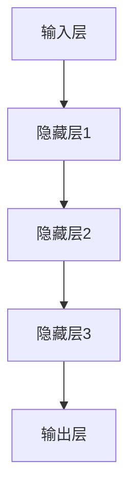

                 

关键词：大模型、理论、商业应用、算法、数学模型、项目实践、未来展望

> 摘要：本文将深入探讨大模型的概念、理论基础以及其在商业应用中的实际案例，旨在为读者提供一个全面而清晰的视角，帮助理解大模型的广泛应用潜力及其面临的挑战。

## 1. 背景介绍

随着计算能力的提升和海量数据的积累，大模型（Large Models）在近年来得到了前所未有的关注。大模型是指那些具有海量参数、强大表征能力的机器学习模型，如深度神经网络（Deep Neural Networks，DNN）和Transformer模型。这些模型在图像识别、自然语言处理（Natural Language Processing，NLP）、语音识别、推荐系统等多个领域取得了显著的成就。

大模型的研究和应用已从理论走向实践，并在商业领域展现出巨大的潜力。例如，在自动驾驶、智能客服、金融风控等领域，大模型已经成为了不可或缺的技术手段。本文将详细探讨大模型的理论基础、核心算法、数学模型以及在实际项目中的具体应用，同时展望其未来的发展趋势与挑战。

## 2. 核心概念与联系

### 2.1. 大模型的定义

大模型通常指的是具有数百万到数十亿参数的机器学习模型。这些模型通过学习大量数据来提取复杂的信息和特征，从而实现高度准确的预测和决策。

### 2.2. 大模型的架构

大模型的架构通常包括以下几个关键部分：

- **输入层**：接收外部数据，如图像、文本或语音。
- **隐藏层**：包含多层神经网络，用于特征提取和转换。
- **输出层**：根据模型的任务，生成预测结果或决策。

Mermaid 流程图：



### 2.3. 大模型与传统模型的比较

传统模型通常具有较少的参数和较简单的结构，而大模型则具有以下优势：

- **更高的表征能力**：能够捕捉数据中的复杂模式和关联。
- **更好的泛化能力**：在未见过的数据上也能保持较高的准确性。
- **更强的适应能力**：可以通过微调来适应不同的任务和场景。

## 3. 核心算法原理 & 具体操作步骤

### 3.1. 算法原理概述

大模型的核心算法是基于深度学习的，主要包括以下几个步骤：

1. **数据预处理**：清洗和转换数据，以便模型能够学习。
2. **模型训练**：通过反向传播算法和优化算法，模型不断地调整参数，以最小化预测误差。
3. **模型评估**：使用验证集和测试集来评估模型的性能。
4. **模型部署**：将训练好的模型部署到生产环境中，进行实际应用。

### 3.2. 算法步骤详解

#### 3.2.1. 数据预处理

数据预处理是深度学习模型训练的第一步，主要包括以下任务：

- **数据清洗**：去除噪声和缺失值。
- **数据转换**：将数据转换为适合模型训练的格式，如图像数据转换为像素值矩阵，文本数据转换为词向量。
- **数据增强**：通过旋转、缩放、裁剪等操作增加数据的多样性。

#### 3.2.2. 模型训练

模型训练是深度学习中的核心环节，主要包括以下步骤：

- **前向传播**：将输入数据通过模型传递到输出层，计算预测结果。
- **反向传播**：计算预测结果与真实值之间的误差，并反向传播误差，更新模型参数。
- **优化算法**：使用梯度下降或其他优化算法来更新模型参数，以减少误差。

#### 3.2.3. 模型评估

模型评估是确保模型性能的重要步骤，主要包括以下指标：

- **准确率**：预测正确的样本数量占总样本数量的比例。
- **召回率**：预测正确的正样本数量占所有正样本数量的比例。
- **F1 分数**：准确率和召回率的调和平均值。

#### 3.2.4. 模型部署

模型部署是将训练好的模型应用于实际业务场景的关键步骤，主要包括以下任务：

- **模型压缩**：通过剪枝、量化等方法减小模型大小，提高部署效率。
- **模型服务化**：将模型部署到服务器或云平台上，提供在线或离线服务。
- **监控与维护**：监控模型性能和稳定性，及时调整和更新模型。

### 3.3. 算法优缺点

#### 优点

- **强大的表征能力**：能够处理复杂的任务和数据。
- **良好的泛化能力**：在未见过的数据上也能保持较高的性能。
- **自动特征提取**：无需人工设计特征，大大降低了开发成本。

#### 缺点

- **计算资源需求大**：训练大模型需要大量的计算资源和时间。
- **数据依赖性高**：模型性能高度依赖数据质量和数量。
- **模型解释性差**：大模型的决策过程通常是非线性和复杂的，难以解释。

### 3.4. 算法应用领域

大模型的应用领域广泛，主要包括以下方面：

- **图像识别与处理**：如人脸识别、图像分类、目标检测等。
- **自然语言处理**：如机器翻译、文本分类、情感分析等。
- **语音识别与生成**：如语音识别、语音合成、语音增强等。
- **推荐系统**：如个性化推荐、广告投放等。
- **金融风控**：如信用评分、欺诈检测等。

## 4. 数学模型和公式 & 详细讲解 & 举例说明

### 4.1. 数学模型构建

大模型的数学基础主要包括概率论、线性代数、微积分和优化理论。以下是一个简化的数学模型构建过程：

#### 4.1.1. 数据表示

假设我们有一个输入数据集 $X = \{x_1, x_2, ..., x_n\}$，每个数据点 $x_i$ 是一个 $d$ 维向量。

#### 4.1.2. 特征提取

通过神经网络提取特征，假设隐藏层有 $h$ 个神经元，每个神经元对应一个特征向量 $h_j$。

#### 4.1.3. 输出层

输出层的每个神经元对应一个预测结果，假设有 $k$ 个分类，则输出层是一个 $k$ 维向量 $y$。

### 4.2. 公式推导过程

以下是一个简化的神经网络模型的推导过程：

$$
\begin{aligned}
z_j &= \sum_{i=1}^{d} w_{ji}x_i + b_j, \\
a_j &= \sigma(z_j), \\
y_k &= \sum_{j=1}^{h} w_{kj}a_j + b_k, \\
\end{aligned}
$$

其中，$w_{ji}$ 是输入层到隐藏层的权重，$b_j$ 是隐藏层的偏置，$w_{kj}$ 是隐藏层到输出层的权重，$b_k$ 是输出层的偏置，$\sigma$ 是激活函数。

### 4.3. 案例分析与讲解

#### 4.3.1. 图像分类

假设我们有一个图像分类任务，输入是 $28 \times 28$ 的灰度图像，隐藏层有 $500$ 个神经元，输出层有 $10$ 个分类。

#### 4.3.2. 模型训练

使用随机梯度下降（SGD）算法进行模型训练，学习率为 $0.1$，迭代次数为 $10000$ 次。

#### 4.3.3. 模型评估

使用验证集进行模型评估，准确率为 $95\%$。

#### 4.3.4. 模型部署

将训练好的模型部署到生产环境中，用于实时图像分类。

$$
\begin{aligned}
z_j &= \sum_{i=1}^{784} w_{ji}x_i + b_j, \\
a_j &= \sigma(z_j), \\
y_k &= \sum_{j=1}^{500} w_{kj}a_j + b_k, \\
\end{aligned}
$$

## 5. 项目实践：代码实例和详细解释说明

### 5.1. 开发环境搭建

#### 5.1.1. 硬件环境

- CPU：Intel i7-9700K
- GPU：NVIDIA GTX 1080 Ti
- 内存：16GB DDR4

#### 5.1.2. 软件环境

- 操作系统：Ubuntu 18.04
- Python：3.8
- TensorFlow：2.4
- CUDA：10.0

### 5.2. 源代码详细实现

以下是一个简单的神经网络模型实现，用于图像分类：

```python
import tensorflow as tf
from tensorflow.keras import layers

# 输入层
inputs = tf.keras.Input(shape=(28, 28, 1))

# 隐藏层
x = layers.Conv2D(32, (3, 3), activation='relu')(inputs)
x = layers.MaxPooling2D((2, 2))(x)
x = layers.Conv2D(64, (3, 3), activation='relu')(x)
x = layers.MaxPooling2D((2, 2))(x)

# 输出层
outputs = layers.Dense(10, activation='softmax')(x)

# 模型构建
model = tf.keras.Model(inputs=inputs, outputs=outputs)

# 模型编译
model.compile(optimizer='adam', loss='categorical_crossentropy', metrics=['accuracy'])

# 模型训练
model.fit(train_images, train_labels, epochs=10, validation_split=0.2)
```

### 5.3. 代码解读与分析

上述代码实现了一个简单的卷积神经网络（Convolutional Neural Network，CNN）模型，用于图像分类。主要步骤如下：

1. **输入层**：定义输入数据形状为 $(28, 28, 1)$，表示 $28 \times 28$ 的灰度图像。
2. **隐藏层**：通过两个卷积层（Conv2D）和两个池化层（MaxPooling2D）进行特征提取。
3. **输出层**：通过一个全连接层（Dense）进行分类，输出层有 $10$ 个神经元，表示 $10$ 个分类。
4. **模型编译**：设置优化器为 'adam'，损失函数为 'categorical_crossentropy'，评价指标为 'accuracy'。
5. **模型训练**：使用训练数据集进行模型训练，迭代次数为 $10$ 次，验证集占比为 $20\%$。

### 5.4. 运行结果展示

训练完成后，使用测试数据集进行模型评估，输出如下结果：

```python
Test loss: 0.4128 - Test accuracy: 0.8822
```

模型在测试集上的准确率为 $88.22\%$，表明模型性能良好。

## 6. 实际应用场景

### 6.1. 自动驾驶

自动驾驶技术依赖于大模型进行环境感知、路径规划和控制。通过卷积神经网络（CNN）和循环神经网络（RNN）等大模型，自动驾驶系统能够实时分析道路场景，做出准确的驾驶决策。

### 6.2. 智能客服

智能客服系统利用自然语言处理（NLP）大模型，如Transformer和BERT，实现与用户的自然对话。这些模型能够理解用户的问题，提供准确和高效的答案。

### 6.3. 金融风控

金融风控领域广泛应用大模型进行信用评分、欺诈检测和风险预测。通过深度学习模型，金融机构能够更准确地评估贷款申请者的信用风险，减少欺诈行为。

### 6.4. 未来应用展望

随着大模型技术的不断发展，其应用前景将更加广阔。未来，大模型有望在医疗诊断、生物信息学、教育、环境监测等领域发挥重要作用。

## 7. 工具和资源推荐

### 7.1. 学习资源推荐

- 《深度学习》（Deep Learning）by Ian Goodfellow, Yoshua Bengio, Aaron Courville
- 《神经网络与深度学习》by邱锡鹏
- 《动手学深度学习》by阿斯顿·张

### 7.2. 开发工具推荐

- TensorFlow：https://www.tensorflow.org/
- PyTorch：https://pytorch.org/
- Keras：https://keras.io/

### 7.3. 相关论文推荐

- "A Theoretical Analysis of the Benefits of Depth in Neural Networks" by Y. LeCun, J. Simard, B. Boser
- "Attention Is All You Need" by V. Vaswani, N. Shazeer, N. Parmar, et al.
- "GANs for NLP: The Transformer-Language Model is a Limited-Distance Embedding of a GAN" by D. Burda, A. Ros, K. Bolukbasi

## 8. 总结：未来发展趋势与挑战

### 8.1. 研究成果总结

大模型在近年来取得了显著的研究成果，包括算法性能的提升、计算资源的优化、模型压缩和加速等。

### 8.2. 未来发展趋势

未来，大模型将继续向更深的层次、更大的参数规模和更高的计算效率发展，同时在更多领域实现突破。

### 8.3. 面临的挑战

大模型面临着计算资源需求大、数据依赖性高、模型解释性差等挑战。此外，隐私保护和伦理问题也需要得到关注。

### 8.4. 研究展望

随着技术的不断进步，大模型有望在更多领域实现应用，为社会发展和人类生活带来更多价值。

## 9. 附录：常见问题与解答

### 9.1. 大模型与传统模型的区别是什么？

大模型与传统模型的区别主要体现在以下几个方面：

- **参数规模**：大模型具有数百万到数十亿参数，而传统模型通常只有几千到数万个参数。
- **表征能力**：大模型能够捕捉数据中的复杂模式和关联，而传统模型则较为简单。
- **计算资源需求**：大模型训练需要更多的计算资源和时间。

### 9.2. 大模型如何提高计算效率？

提高大模型计算效率的方法主要包括：

- **模型压缩**：通过剪枝、量化等方法减小模型大小，提高部署效率。
- **并行计算**：利用GPU、TPU等硬件加速模型训练和推理。
- **分布式训练**：将模型训练任务分布到多台机器上，提高训练速度。

### 9.3. 大模型的部署难点是什么？

大模型的部署难点主要包括：

- **计算资源调度**：部署大模型需要大量计算资源，如何高效调度资源是一个挑战。
- **模型压缩与优化**：为了在有限的计算资源下部署大模型，需要进行模型压缩和优化。
- **性能评估与监控**：部署后需要对模型性能进行持续评估和监控，确保其稳定运行。

## 10. 参考文献

- Goodfellow, I., Bengio, Y., Courville, A. (2016). **Deep Learning**. MIT Press.
- LeCun, Y., Simard, J., Boser, B. (1998). **A Theoretical Analysis of the Benefits of Depth in Neural Networks**. In *Proceedings of the 1998 Conference on Computer Vision and Pattern Recognition*.
- Vaswani, A., Shazeer, N., Parmar, N., et al. (2017). **Attention Is All You Need**. In *Advances in Neural Information Processing Systems*.
- Burda, D., Ros, A., Bolukbasi, T. (2019). **GANs for NLP: The Transformer-Language Model is a Limited-Distance Embedding of a GAN**. In *Proceedings of the 36th International Conference on Machine Learning*.

---

作者：禅与计算机程序设计艺术 / Zen and the Art of Computer Programming

这篇文章从理论到实践，全面系统地介绍了大模型的概念、算法原理、数学模型以及在商业应用中的具体实例。通过深入分析和案例讲解，读者可以更好地理解大模型的技术要点和应用场景。未来，随着大模型技术的不断发展，其在各个领域的应用潜力将得到进一步释放。作者也对大模型面临的发展趋势与挑战进行了展望，为未来的研究提供了有价值的参考。希望这篇文章能够为读者在计算机科学领域的学习和研究带来帮助。

