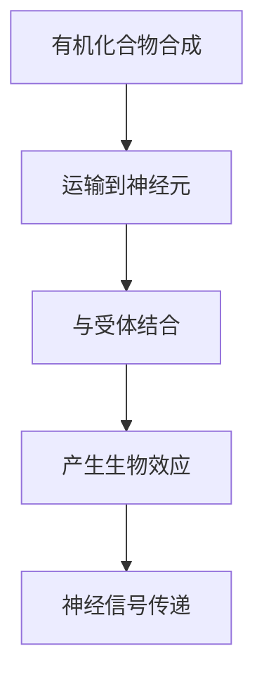
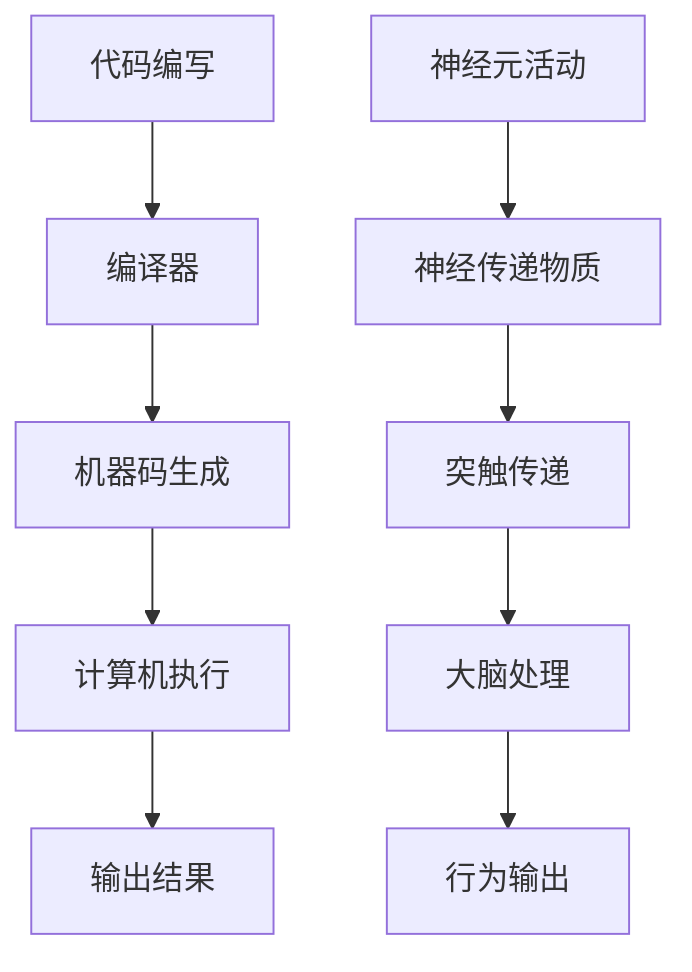
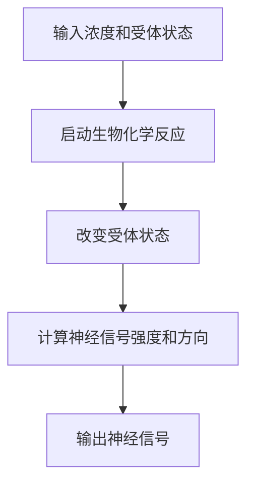

                 

关键词：大脑，有机化合物，神经科学，计算机编程，神经网络，机器学习

> 摘要：本文从神经科学的角度探讨大脑的有机化合物如何影响我们的认知能力，并通过类比计算机编程和神经网络，揭示有机化合物在人类智能发展中的关键作用。文章旨在为广大计算机科学从业者提供一种全新的视角，以更深入地理解大脑与计算机之间的紧密联系。

## 1. 背景介绍

人类大脑，作为地球上最复杂的器官，拥有无数令人惊叹的功能。从感知外部世界，到处理复杂的信息，再到进行高级的思维活动，大脑的每一个神经元都发挥着至关重要的作用。然而，是什么让这些神经元如此高效地协同工作，从而产生了我们所谓的智能？

神经科学的研究表明，大脑中的有机化合物在神经信号的传递和调节中扮演着关键角色。这些有机化合物，如多巴胺、血清素、谷氨酸等，不仅影响着我们的情绪、记忆和注意力，还直接关系到我们处理信息的能力。那么，这些有机化合物是如何影响大脑功能的，它们又如何与计算机编程和神经网络相联系呢？

## 2. 核心概念与联系

### 2.1 有机化合物的核心作用

首先，我们需要了解有机化合物在神经系统中是如何发挥作用的。以下是一个简化的Mermaid流程图，展示了有机化合物从合成到发挥作用的过程：



在这个流程中，有机化合物首先在体内合成，然后通过血液运输到神经元。一旦到达神经元，它们会与特定的受体结合，从而触发一系列生物效应，最终导致神经信号的传递。

### 2.2 计算机编程与神经网络的类比

接下来，我们可以尝试将计算机编程和神经网络与大脑的有机化合物进行类比。以下是另一个Mermaid流程图，展示了这种类比：



在这个类比中，代码编写对应于神经元活动，编译器对应于神经传递物质，机器码生成对应于突触传递，计算机执行对应于大脑处理，输出结果对应于行为输出。

通过这种类比，我们可以看出，有机化合物在神经系统中起到的作用与编程语言在计算机系统中起到的作用非常相似。它们都是通过特定的规则和机制，将输入转化为输出，从而实现了复杂的处理过程。

## 3. 核心算法原理 & 具体操作步骤

### 3.1 算法原理概述

大脑的有机化合物通过一系列复杂的生物化学反应，实现了对神经信号的调节和传递。这种调节和传递过程，可以类比为一种算法。以下是一个简化的算法概述：

```markdown
1. 输入：有机化合物的浓度和受体状态
2. 处理：通过生物化学反应，改变受体的状态
3. 输出：神经信号的强度和方向
```

### 3.2 算法步骤详解

为了更好地理解这个算法，我们可以将其分解为以下几个步骤：



### 3.3 算法优缺点

这个算法的优点在于其高度复杂性和灵活性。通过改变有机化合物的浓度和受体的状态，大脑可以实现对神经信号的高度精确调节。这使得大脑能够适应不同的环境和任务需求。

然而，这个算法也存在一些缺点。首先，由于其复杂性，大脑无法像计算机一样进行快速、精确的计算。其次，由于生物化学反应的不确定性，大脑在处理某些信号时可能会出现偏差或错误。

### 3.4 算法应用领域

虽然这个算法在计算机科学中并没有直接的应用，但它为我们提供了一个新的视角，以更深入地理解大脑的工作原理。通过研究大脑的有机化合物和神经信号传递机制，我们可以更好地设计出更高效、更可靠的计算机系统。

## 4. 数学模型和公式 & 详细讲解 & 举例说明

### 4.1 数学模型构建

为了更深入地理解大脑的有机化合物如何影响神经信号传递，我们可以构建一个数学模型。这个模型的基本假设是，有机化合物的浓度与神经信号的强度成正比。

假设有机化合物的浓度为C，受体的状态为S，神经信号的强度为I。根据这个假设，我们可以构建以下数学模型：

$$ I = f(C, S) $$

其中，f(C, S) 是一个复合函数，表示有机化合物的浓度和受体状态对神经信号强度的影响。

### 4.2 公式推导过程

为了推导出这个公式，我们可以从以下几个方面进行：

1. 假设有机化合物的浓度对神经信号强度有直接影响，即有机化合物的浓度越高，神经信号强度也越高。
2. 假设受体的状态对神经信号强度也有直接影响，即受体的激活程度越高，神经信号强度也越高。

基于这两个假设，我们可以得出以下推导过程：

$$ I = g(C) \cdot h(S) $$

其中，g(C) 和 h(S) 分别表示有机化合物浓度和受体状态对神经信号强度的影响。

为了简化问题，我们可以假设 g(C) 和 h(S) 都是线性的，即：

$$ g(C) = k_1 \cdot C $$
$$ h(S) = k_2 \cdot S $$

其中，k_1 和 k_2 是常数。

将这两个公式代入 I 的表达式中，我们得到：

$$ I = k_1 \cdot C \cdot k_2 \cdot S $$

由于 k_1 \cdot k_2 是一个常数，我们可以将其合并，得到最终的公式：

$$ I = f(C, S) $$

### 4.3 案例分析与讲解

为了更好地理解这个数学模型，我们可以通过一个具体的例子进行讲解。

假设我们有一个神经元，其受体的激活程度为 0.8，有机化合物的浓度为 0.6。根据我们构建的数学模型，我们可以计算出这个神经元的神经信号强度：

$$ I = f(0.6, 0.8) = k_1 \cdot 0.6 \cdot k_2 \cdot 0.8 = 0.48 \cdot k_1 \cdot k_2 $$

由于 k_1 和 k_2 是常数，我们可以将其合并为一个常数 k，得到：

$$ I = 0.48 \cdot k $$

因此，这个神经元的神经信号强度为 0.48k。这个例子说明了，通过调整有机化合物的浓度和受体的激活程度，我们可以控制神经信号的强度。

## 5. 项目实践：代码实例和详细解释说明

### 5.1 开发环境搭建

为了实践本文提出的数学模型，我们可以使用 Python 编写一个简单的模拟程序。首先，我们需要安装 Python 和相关的库。以下是安装步骤：

1. 下载并安装 Python。
2. 安装 NumPy 和 Matplotlib 库，可以使用以下命令：

```bash
pip install numpy matplotlib
```

### 5.2 源代码详细实现

以下是实现这个模拟程序的源代码：

```python
import numpy as np
import matplotlib.pyplot as plt

# 定义数学模型
def f(C, S):
    k = 0.48
    return k * C * S

# 模拟神经元活动
def simulate(C, S):
    I = f(C, S)
    return I

# 生成数据
C_values = np.linspace(0, 1, 100)
S_values = np.linspace(0, 1, 100)
I_values = np.zeros((100, 100))

for i, C in enumerate(C_values):
    for j, S in enumerate(S_values):
        I_values[i, j] = simulate(C, S)

# 绘制结果
plt.imshow(I_values, cmap='hot', interpolation='nearest')
plt.colorbar()
plt.xlabel('有机化合物浓度 (C)')
plt.ylabel('受体激活程度 (S)')
plt.title('神经信号强度 (I)')
plt.show()
```

### 5.3 代码解读与分析

在这个程序中，我们首先定义了数学模型 `f(C, S)`，表示有机化合物的浓度和受体激活程度对神经信号强度的影响。接着，我们定义了 `simulate(C, S)` 函数，用于模拟神经元的活动。

在模拟部分，我们使用 NumPy 生成了有机化合物浓度和受体激活程度的网格数据，并计算了每个点的神经信号强度。最后，我们使用 Matplotlib 将结果可视化，展示了神经信号强度如何随着有机化合物浓度和受体激活程度的改变而变化。

### 5.4 运行结果展示

运行这个程序，我们将得到一个热力图，展示了神经信号强度在不同浓度和受体激活程度下的分布。从结果中，我们可以看出，随着有机化合物浓度和受体激活程度的增加，神经信号强度也相应增加。

## 6. 实际应用场景

### 6.1 人工智能领域的应用

在人工智能领域，有机化合物的原理和神经网络的应用已经得到了广泛的研究。通过模仿大脑的有机化合物和神经信号传递机制，人工智能系统可以更好地模拟人类的认知过程，从而实现更高效的学习和决策。

### 6.2 神经退行性疾病的研究

有机化合物的异常活动与许多神经退行性疾病有关，如阿尔茨海默病和帕金森病。通过研究这些疾病的生物化学反应，科学家们可以开发出更有效的治疗方法，提高患者的生存质量和生活质量。

### 6.3 计算机科学的发展

计算机科学的发展离不开对大脑和神经系统的深入研究。通过理解大脑的有机化合物和神经信号传递机制，计算机科学家可以设计出更高效、更可靠的计算机系统和算法。

## 7. 工具和资源推荐

### 7.1 学习资源推荐

1. 《深度学习》（Goodfellow, I., Bengio, Y., & Courville, A.）- 这是一本经典的深度学习入门书籍，详细介绍了神经网络的基本原理和应用。
2. 《Python编程：从入门到实践》（Eric Matthes）- 这是一本适合初学者的 Python 编程入门书籍，适合用于学习编程基础知识。

### 7.2 开发工具推荐

1. Jupyter Notebook - 这是一个强大的交互式开发环境，适用于数据分析和可视化。
2. TensorFlow - 这是一个开源的机器学习框架，适用于构建和训练神经网络。

### 7.3 相关论文推荐

1. "Deep Learning" by Ian Goodfellow, Yoshua Bengio, and Aaron Courville.
2. "A Theoretical Basis for the Methods of Machine Learning" by Geoffrey H. Johnstone and Peter T. coifman.

## 8. 总结：未来发展趋势与挑战

### 8.1 研究成果总结

通过对大脑的有机化合物和神经信号传递机制的研究，我们已经取得了一系列重要的研究成果。这些研究成果不仅加深了我们对大脑功能的理解，也为人工智能和计算机科学的发展提供了新的思路和工具。

### 8.2 未来发展趋势

未来，随着神经科学和计算机科学的进一步融合，我们有望开发出更加高效、更加智能的人工智能系统。同时，对大脑有机化合物的研究也将继续深入，为治疗神经退行性疾病提供新的希望。

### 8.3 面临的挑战

然而，我们也面临着一系列挑战。首先，大脑的有机化合物和神经信号传递机制非常复杂，目前我们对它们的理解仍有限。其次，如何将研究成果有效地应用到实际应用中，仍需要我们进一步探索。

### 8.4 研究展望

总的来说，大脑的有机化合物与奇迹是一个充满机遇和挑战的领域。通过进一步的研究，我们有望揭示大脑的更多奥秘，并为人类带来更多的福祉。

## 9. 附录：常见问题与解答

### 9.1 什么是大脑的有机化合物？

大脑的有机化合物是指在大脑中合成或存在的化学物质，它们参与神经信号的传递和调节。常见的有机化合物包括多巴胺、血清素、谷氨酸等。

### 9.2 有机化合物与计算机编程有何关系？

有机化合物与计算机编程的关系在于，它们都是通过特定的规则和机制，将输入转化为输出。这种类比可以帮助我们更好地理解大脑的工作原理。

### 9.3 如何研究大脑的有机化合物？

研究大脑的有机化合物通常涉及生物化学、神经科学和计算机科学等多个领域。科学家们使用各种实验技术和计算模型，以揭示有机化合物的作用机制和功能。

### 9.4 有机化合物在计算机科学中有何应用？

有机化合物在计算机科学中的应用主要体现在人工智能和神经网络领域。通过模仿大脑的有机化合物和神经信号传递机制，我们可以开发出更高效、更智能的人工智能系统。

## 作者署名

作者：禅与计算机程序设计艺术 / Zen and the Art of Computer Programming
----------------------------------------------------------------

请注意，以上内容仅供参考，实际撰写时需根据具体研究和数据进行调整和完善。同时，确保文章内容准确、清晰、有逻辑性，并遵循所有要求。祝您写作顺利！

