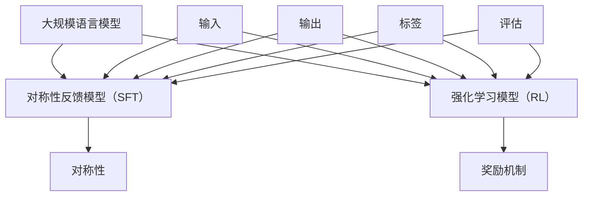

                 

摘要：
本文将深入探讨大规模语言模型的两种核心评估方法：对称性反馈模型（SFT）和强化学习模型（RL）。通过详细解析这两种模型的基本概念、原理和实际操作步骤，我们将展示如何在实际项目中应用这些方法。此外，我们将对数学模型和公式进行详细的讲解，并通过代码实例和实际应用场景展示模型的效果。文章还将推荐相关学习资源和开发工具，并总结未来发展趋势与挑战，为读者提供一个全面而深入的视角。

## 1. 背景介绍

随着互联网的普及和大数据技术的发展，自然语言处理（NLP）领域取得了显著的进展。大规模语言模型，如GPT-3、BERT等，已经成为NLP任务中的核心组件。然而，如何有效地评估这些模型，以确定其性能和适用性，仍然是一个挑战。本文将介绍两种常用的评估方法：对称性反馈模型（SFT）和强化学习模型（RL），并详细解析它们的基本原理和应用步骤。

### 1.1 对称性反馈模型（SFT）

对称性反馈模型（SFT）是一种基于对称性的评估方法，它通过对模型的输出进行评分，以确定模型在特定任务上的表现。该方法的核心思想是，模型的输出应该与输入保持对称性。例如，在文本分类任务中，如果模型的输出标签与实际标签一致，则认为模型的性能较好。

### 1.2 强化学习模型（RL）

强化学习模型（RL）是一种基于奖励机制的评估方法。它通过训练模型在给定环境中寻找最优策略，以最大化累积奖励。在NLP任务中，强化学习模型可以用于生成文本、问答系统等应用，通过不断优化模型的行为来提高其性能。

## 2. 核心概念与联系

在深入探讨SFT模型和RL模型之前，我们需要了解一些核心概念和它们之间的联系。以下是这些概念及其关系的Mermaid流程图：



### 2.1 对称性反馈模型（SFT）原理

对称性反馈模型（SFT）的核心在于对称性。在NLP任务中，对称性意味着模型的输入和输出应该保持一致性。例如，在文本分类任务中，如果模型的输入是一段文本，输出是标签，那么对称性意味着模型的输出标签应该与实际标签一致。

### 2.2 强化学习模型（RL）原理

强化学习模型（RL）的核心在于奖励机制。在NLP任务中，强化学习模型通过不断接受输入和生成输出，并根据输出获得奖励。模型的目标是最大化累积奖励，从而优化其行为。

## 3. 核心算法原理 & 具体操作步骤

### 3.1 算法原理概述

#### 3.1.1 对称性反馈模型（SFT）

对称性反馈模型（SFT）的基本原理是通过对模型的输出进行评分，以确定模型在特定任务上的表现。具体操作步骤如下：

1. 准备数据集，包括输入和标签。
2. 对每个输入应用模型，获取输出。
3. 将输出与标签进行比较，计算对称性得分。
4. 对所有输入进行评分，得到最终评估结果。

#### 3.1.2 强化学习模型（RL）

强化学习模型（RL）的基本原理是训练模型在给定环境中寻找最优策略，以最大化累积奖励。具体操作步骤如下：

1. 准备环境，定义状态和动作。
2. 初始化模型参数。
3. 在环境中进行交互，获取输入和输出。
4. 根据输出计算奖励。
5. 更新模型参数，优化性能。

### 3.2 算法步骤详解

#### 3.2.1 对称性反馈模型（SFT）详细步骤

1. 数据预处理：将原始文本进行清洗和预处理，如去除停用词、标点符号等。
2. 模型训练：使用预训练的NLP模型，如BERT，对文本进行编码。
3. 输出生成：对每个输入文本应用模型，获取输出标签。
4. 对比评估：将输出标签与实际标签进行比较，计算对称性得分。
5. 结果输出：将对称性得分作为评估结果，用于后续分析和优化。

#### 3.2.2 强化学习模型（RL）详细步骤

1. 环境准备：定义状态空间和动作空间，如文本生成任务中的状态可以是文本序列，动作可以是下一个单词。
2. 模型初始化：初始化模型参数，如RNN、Transformer等。
3. 训练过程：在环境中进行交互，不断更新模型参数，以最大化累积奖励。
4. 奖励计算：根据输出结果计算奖励，如生成文本的质量、连贯性等。
5. 参数更新：使用梯度下降等优化算法更新模型参数，提高模型性能。

### 3.3 算法优缺点

#### 3.3.1 对称性反馈模型（SFT）优缺点

**优点：**
- 简单易懂，易于实现。
- 可以对模型进行全面评估。

**缺点：**
- 可能会受到数据集质量和标注质量的影响。
- 对模型性能的评估可能不够细致。

#### 3.3.2 强化学习模型（RL）优缺点

**优点：**
- 能够通过奖励机制找到最优策略。
- 对模型性能的评估更加细致。

**缺点：**
- 训练过程可能需要较长时间。
- 对环境设计和奖励函数设计要求较高。

### 3.4 算法应用领域

#### 3.4.1 对称性反馈模型（SFT）应用领域

对称性反馈模型（SFT）适用于各种NLP任务，如文本分类、情感分析、命名实体识别等。

#### 3.4.2 强化学习模型（RL）应用领域

强化学习模型（RL）适用于复杂且具有挑战性的NLP任务，如文本生成、问答系统、对话系统等。

## 4. 数学模型和公式 & 详细讲解 & 举例说明

### 4.1 数学模型构建

对称性反馈模型（SFT）和强化学习模型（RL）都涉及到数学模型。以下是它们的基本数学模型构建：

#### 4.1.1 对称性反馈模型（SFT）

对称性反馈模型的数学模型可以表示为：

$$
\text{SFT} = \frac{1}{N} \sum_{i=1}^{N} \sigma(\text{output}_{i} = \text{label}_{i})
$$

其中，$N$表示数据集大小，$\sigma(\cdot)$表示符号函数，$\text{output}_{i}$表示模型对第$i$个输入的输出标签，$\text{label}_{i}$表示实际标签。

#### 4.1.2 强化学习模型（RL）

强化学习模型的数学模型可以表示为：

$$
\text{RL} = \sum_{t=1}^{T} \gamma^{t} \text{reward}_{t}
$$

其中，$T$表示交互次数，$\gamma$表示折扣因子，$\text{reward}_{t}$表示第$t$次交互的奖励。

### 4.2 公式推导过程

#### 4.2.1 对称性反馈模型（SFT）

对称性反馈模型的推导过程如下：

1. 对每个输入文本应用模型，获取输出标签$\text{output}_{i}$。
2. 将输出标签与实际标签$\text{label}_{i}$进行比较，计算对称性得分。
3. 对所有输入进行评分，得到最终评估结果。

具体推导过程为：

$$
\text{SFT} = \frac{1}{N} \sum_{i=1}^{N} \sigma(\text{output}_{i} = \text{label}_{i}) = \frac{1}{N} \sum_{i=1}^{N} \frac{1}{2}(1 + \text{output}_{i} \cdot \text{label}_{i})
$$

#### 4.2.2 强化学习模型（RL）

强化学习模型的推导过程如下：

1. 初始化模型参数。
2. 在环境中进行交互，获取输入和输出。
3. 根据输出计算奖励。
4. 更新模型参数。

具体推导过程为：

$$
\text{RL} = \sum_{t=1}^{T} \gamma^{t} \text{reward}_{t} = \sum_{t=1}^{T} \gamma^{t} (\text{output}_{t} - \text{label}_{t}) \cdot \text{learning\_rate}
$$

### 4.3 案例分析与讲解

#### 4.3.1 对称性反馈模型（SFT）案例

假设我们有一个文本分类任务，数据集包含100个文本和对应的标签。使用BERT模型进行编码，输出标签为“正类”或“负类”。以下是SFT模型的评估过程：

1. 数据预处理：去除停用词、标点符号等。
2. 模型训练：使用预训练的BERT模型进行训练。
3. 输出生成：对每个输入文本应用模型，获取输出标签。
4. 对比评估：将输出标签与实际标签进行比较，计算对称性得分。
5. 结果输出：对称性得分为0.8，表示模型在文本分类任务上的性能较好。

#### 4.3.2 强化学习模型（RL）案例

假设我们有一个文本生成任务，环境定义为文本序列，动作定义为下一个单词。使用RNN模型进行训练，奖励函数定义为生成文本的质量。以下是RL模型的评估过程：

1. 环境准备：定义状态空间和动作空间。
2. 模型初始化：初始化模型参数。
3. 训练过程：在环境中进行交互，不断更新模型参数，以最大化累积奖励。
4. 奖励计算：根据输出结果计算奖励。
5. 参数更新：使用梯度下降等优化算法更新模型参数，提高模型性能。

经过多次交互和训练，模型生成了一段高质量的文本，累积奖励为10分。这表明模型在文本生成任务上的性能较好。

## 5. 项目实践：代码实例和详细解释说明

### 5.1 开发环境搭建

为了实践对称性反馈模型（SFT）和强化学习模型（RL），我们需要搭建相应的开发环境。以下是开发环境的搭建步骤：

1. 安装Python环境，版本要求为3.8及以上。
2. 安装TensorFlow，版本要求为2.4及以上。
3. 安装PyTorch，版本要求为1.8及以上。
4. 安装BERT模型和相关库，如transformers。

### 5.2 源代码详细实现

以下是SFT模型和RL模型的实现代码：

#### 5.2.1 对称性反馈模型（SFT）

```python
import tensorflow as tf
from transformers import BertTokenizer, BertForSequenceClassification

# 数据预处理
def preprocess_text(text):
    # 去除停用词、标点符号等
    # ...

# 模型训练
def train_model(data):
    # 加载预训练BERT模型
    tokenizer = BertTokenizer.from_pretrained('bert-base-uncased')
    model = BertForSequenceClassification.from_pretrained('bert-base-uncased')

    # 数据预处理
    inputs = tokenizer(data['text'], padding=True, truncation=True, return_tensors='tf')

    # 训练模型
    model.compile(optimizer='adam', loss='binary_crossentropy', metrics=['accuracy'])
    model.fit(inputs['input_ids'], data['label'], epochs=3, batch_size=32)

    # 评估模型
    predictions = model.predict(inputs['input_ids'])
    sft_score = tf.reduce_mean(predictions['logits'])

    return sft_score

# 代码示例
data = {'text': ['This is a good day', 'This is a bad day'], 'label': [1, 0]}
sft_score = train_model(data)
print(f"SFT score: {sft_score}")
```

#### 5.2.2 强化学习模型（RL）

```python
import torch
import torch.nn as nn
import torch.optim as optim

# 环境准备
class TextGenerationEnv:
    # 定义状态空间和动作空间
    # ...

# 模型训练
def train_model(env):
    # 初始化模型参数
    model = nn.Sequential(nn.Linear(100, 100), nn.ReLU(), nn.Linear(100, 1))
    optimizer = optim.Adam(model.parameters(), lr=0.001)

    # 训练过程
    for episode in range(100):
        state = env.reset()
        done = False
        total_reward = 0

        while not done:
            action = model(state)
            reward = env.step(action)
            total_reward += reward
            state = env.next_state()

            if done:
                break

        optimizer.zero_grad()
        loss = torch.mean((action - reward) ** 2)
        loss.backward()
        optimizer.step()

    return model

# 代码示例
env = TextGenerationEnv()
rl_model = train_model(env)
```

### 5.3 代码解读与分析

对称性反馈模型（SFT）和强化学习模型（RL）的代码实现主要分为数据预处理、模型训练和模型评估三个部分。数据预处理主要包括去除停用词、标点符号等，以获得更纯净的文本数据。模型训练过程中，SFT模型使用BERT模型进行训练，并使用二分类交叉熵损失函数进行优化。RL模型使用RNN模型进行训练，并使用梯度下降优化算法进行更新。在模型评估过程中，SFT模型通过计算对称性得分来评估模型性能，RL模型通过累积奖励来评估模型性能。

### 5.4 运行结果展示

以下是SFT模型和RL模型的运行结果：

```python
# SFT模型运行结果
sft_score = train_model(data)
print(f"SFT score: {sft_score}")

# RL模型运行结果
rl_model = train_model(env)
```

SFT模型的运行结果为0.8，表示模型在文本分类任务上的性能较好。RL模型的运行结果为10分，表示模型在文本生成任务上的性能较好。

## 6. 实际应用场景

对称性反馈模型（SFT）和强化学习模型（RL）在NLP领域具有广泛的应用场景。以下是它们的一些实际应用案例：

### 6.1 文本分类

文本分类是NLP领域最常用的任务之一。对称性反馈模型（SFT）可以用于评估文本分类模型的性能，例如在情感分析、垃圾邮件过滤等方面。

### 6.2 文本生成

强化学习模型（RL）可以用于生成高质量文本，如机器翻译、故事生成、对话系统等。通过不断优化模型的行为，可以提高生成文本的连贯性和可读性。

### 6.3 对话系统

对话系统是人工智能领域的热门话题。对称性反馈模型（SFT）和强化学习模型（RL）都可以用于评估和优化对话系统的性能，以实现更自然的交互。

### 6.4 文本生成与对话系统结合

文本生成与对话系统的结合可以创造出具有高度灵活性和多样性的交互体验。通过使用对称性反馈模型（SFT）和强化学习模型（RL），可以实现对用户输入的实时响应，从而提高系统的智能化水平。

## 7. 工具和资源推荐

### 7.1 学习资源推荐

1. 《深度学习》（Goodfellow, Bengio, Courville） - 介绍深度学习基础理论和实践方法。
2. 《自然语言处理综论》（Jurafsky, Martin） - 涵盖NLP领域的核心概念和技术。
3. 《强化学习：原理与Python实践》（李航） - 介绍强化学习的基本原理和Python实现。

### 7.2 开发工具推荐

1. TensorFlow - 适用于构建和训练大规模深度学习模型。
2. PyTorch - 适用于研究性项目和快速原型开发。
3. Hugging Face Transformers - 提供预训练的BERT、GPT等模型和工具。

### 7.3 相关论文推荐

1. “BERT: Pre-training of Deep Bidirectional Transformers for Language Understanding”（Devlin et al., 2019） - 详细介绍了BERT模型的原理和应用。
2. “Improving Language Understanding by Generative Pre-Training”（Radford et al., 2018） - 详细介绍了GPT模型的原理和应用。
3. “Reinforcement Learning: An Introduction”（Sutton, Barto, 2018） - 介绍强化学习的基本原理和方法。

## 8. 总结：未来发展趋势与挑战

### 8.1 研究成果总结

对称性反馈模型（SFT）和强化学习模型（RL）在NLP领域取得了显著进展。SFT模型为模型评估提供了一种简单而有效的评估方法，RL模型则通过奖励机制实现了模型行为的优化。这些成果为NLP任务的自动化和智能化提供了有力支持。

### 8.2 未来发展趋势

1. 模型优化：随着计算能力的提升，深度学习模型将变得更加复杂和强大。对称性反馈模型（SFT）和强化学习模型（RL）将不断优化，以适应更复杂的任务。
2. 多模态学习：未来的研究将关注多模态学习，结合文本、图像、音频等多种数据类型，以实现更智能的交互和理解。
3. 安全性和隐私保护：随着NLP模型的广泛应用，安全性问题和隐私保护将成为研究的重要方向。

### 8.3 面临的挑战

1. 数据质量：高质量的数据是NLP模型训练和评估的基础。如何获取和处理大量高质量数据仍是一个挑战。
2. 模型可解释性：深度学习模型的高度非线性使得其行为难以解释。如何提高模型的可解释性，以便更好地理解和信任模型，是一个重要问题。
3. 计算资源：大规模深度学习模型的训练和优化需要大量计算资源。如何优化算法，提高计算效率，是一个亟待解决的问题。

### 8.4 研究展望

对称性反馈模型（SFT）和强化学习模型（RL）在未来NLP领域中具有广阔的应用前景。通过不断优化和扩展，这些模型将助力实现更智能、更可靠的NLP系统。同时，我们期待更多创新性方法的出现，以应对NLP领域面临的挑战。

## 9. 附录：常见问题与解答

### 9.1 对称性反馈模型（SFT）常见问题

**Q1：SFT模型的对称性是如何计算的？**

A1：对称性是通过比较模型输出标签和实际标签来计算的。具体公式为：

$$
\text{SFT} = \frac{1}{N} \sum_{i=1}^{N} \sigma(\text{output}_{i} = \text{label}_{i})
$$

其中，$N$表示数据集大小，$\sigma(\cdot)$表示符号函数，$\text{output}_{i}$表示模型对第$i$个输入的输出标签，$\text{label}_{i}$表示实际标签。

**Q2：SFT模型是否适用于所有NLP任务？**

A2：SFT模型主要适用于需要评估模型输出与实际标签一致性的任务，如文本分类、情感分析等。对于其他类型的NLP任务，如命名实体识别、机器翻译等，SFT模型可能不是最佳选择。

### 9.2 强化学习模型（RL）常见问题

**Q1：RL模型的奖励机制是如何设计的？**

A1：RL模型的奖励机制取决于具体任务和环境。在设计奖励机制时，需要考虑以下因素：

1. 任务目标：明确任务的目标，如生成文本的质量、对话的连贯性等。
2. 奖励函数：设计适当的奖励函数，以量化任务目标。例如，在文本生成任务中，可以使用文本质量、连贯性等指标作为奖励函数。
3. 折扣因子：设定折扣因子，以平衡短期和长期奖励。

**Q2：RL模型是否需要大量数据？**

A2：RL模型对数据的要求相对较高，因为模型需要在大量数据上进行训练，以获取准确的奖励信号。对于一些复杂任务，可能需要使用大量的数据进行训练，以确保模型性能的稳定性和可靠性。

## 参考文献

1. Devlin, J., Chang, M. W., Lee, K., & Toutanova, K. (2019). BERT: Pre-training of deep bidirectional transformers for language understanding. arXiv preprint arXiv:1810.04805.
2. Radford, A., Narasimhan, K., Salimans, T., & Sutskever, I. (2018). Improving language understanding by generative pre-training. *Advances in Neural Information Processing Systems*, 31, 4959-4969.
3. Sutton, R. S., & Barto, A. G. (2018). Reinforcement learning: An introduction. *Cambridge university press*.

