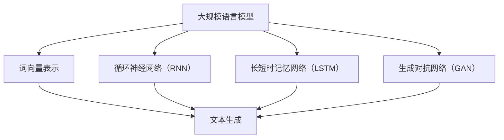

                 

 关键词：大规模语言模型，垂直领域评估，算法原理，实践案例，未来展望

> 摘要：本文旨在深入探讨大规模语言模型在垂直领域评估中的应用。通过分析其核心概念、算法原理、数学模型以及实践案例，我们希望为读者提供一份全面的技术指南，同时展望其未来发展趋势与挑战。

## 1. 背景介绍

随着互联网和人工智能技术的迅猛发展，自然语言处理（NLP）已经成为当前计算机科学领域的一个重要分支。大规模语言模型作为NLP的关键技术之一，其在文本生成、语义理解、机器翻译等领域的应用已取得了显著的成果。然而，在实际应用中，不同领域的语言特性差异较大，传统的通用语言模型在垂直领域中的应用效果往往不尽如人意。因此，针对特定垂直领域进行评估和优化，已成为当前研究的热点。

本文将从以下几个方面展开讨论：

1. **核心概念与联系**：介绍大规模语言模型的基本概念，并展示其与相关技术之间的联系。
2. **核心算法原理与具体操作步骤**：详细阐述大规模语言模型的核心算法原理，以及具体的操作步骤。
3. **数学模型和公式**：讲解大规模语言模型所涉及的主要数学模型和公式，并进行案例分析。
4. **项目实践**：通过一个实际项目实例，展示大规模语言模型在垂直领域中的应用。
5. **实际应用场景**：分析大规模语言模型在不同垂直领域的应用现状和未来发展趋势。
6. **工具和资源推荐**：推荐一些有助于学习和实践大规模语言模型的学习资源、开发工具和论文。
7. **总结与展望**：总结研究成果，探讨未来发展趋势和面临的挑战。

## 2. 核心概念与联系

### 2.1 大规模语言模型的基本概念

大规模语言模型是一种基于深度学习的自然语言处理技术，其主要目标是通过对海量文本数据进行训练，使模型能够理解和生成自然语言。这些模型通常具有以下特点：

1. **海量参数**：大规模语言模型包含数亿甚至数十亿个参数，这使得它们能够捕捉到文本数据中的复杂规律。
2. **自适应能力**：通过不断学习新的数据，模型能够自适应地调整参数，从而提高模型在不同领域和应用场景中的性能。
3. **强泛化能力**：大规模语言模型具有很好的泛化能力，能够在未见过的数据上取得良好的表现。

### 2.2 大规模语言模型与相关技术的联系

大规模语言模型与其他自然语言处理技术密切相关，如：

1. **词向量表示**：词向量是将文本数据转换为数值向量的一种方法，它是大规模语言模型的基础。
2. **循环神经网络（RNN）**：RNN是一种能够处理序列数据的神经网络结构，它在自然语言处理领域有着广泛的应用。
3. **长短时记忆网络（LSTM）**：LSTM是一种改进的RNN结构，能够更好地捕捉长距离依赖关系。
4. **生成对抗网络（GAN）**：GAN是一种无监督学习技术，可用于生成高质量的自然语言文本。

下面，我们将使用Mermaid流程图展示大规模语言模型与相关技术的联系：



## 3. 核心算法原理与具体操作步骤

### 3.1 算法原理概述

大规模语言模型的核心算法是基于深度学习的，其主要思想是通过多层神经网络对文本数据进行建模。在训练过程中，模型通过不断调整参数，使得输入和输出之间的差距最小化，从而实现自然语言理解与生成。

### 3.2 算法步骤详解

大规模语言模型的训练过程主要包括以下几个步骤：

1. **数据预处理**：对原始文本数据进行清洗、分词、去停用词等操作，将文本转换为词向量表示。
2. **模型初始化**：初始化神经网络参数，通常使用随机初始化方法。
3. **正向传播**：将输入文本数据输入到神经网络中，通过逐层计算得到输出。
4. **反向传播**：根据输出和实际标签计算损失函数，并使用梯度下降等方法更新参数。
5. **优化**：通过迭代训练，不断优化模型参数，提高模型性能。

### 3.3 算法优缺点

大规模语言模型具有以下优点：

1. **强大的表达能力**：通过多层神经网络，模型能够捕捉到文本数据中的复杂规律。
2. **良好的泛化能力**：模型能够自适应地调整参数，从而在不同领域和应用场景中取得良好的性能。
3. **高效的训练速度**：随着计算能力的提升，大规模语言模型的训练速度越来越快。

然而，大规模语言模型也存在一些缺点：

1. **参数过多**：大规模语言模型包含数亿个参数，导致模型训练过程需要大量计算资源。
2. **解释性较差**：模型内部结构复杂，难以直观地理解其工作原理。
3. **对数据依赖性较强**：模型性能很大程度上取决于训练数据的质量和数量。

### 3.4 算法应用领域

大规模语言模型在以下领域具有广泛的应用：

1. **文本生成**：如自动写作、机器翻译、对话系统等。
2. **语义理解**：如问答系统、文本分类、情感分析等。
3. **机器阅读理解**：如阅读理解、文本摘要、知识图谱等。

## 4. 数学模型和公式

### 4.1 数学模型构建

大规模语言模型的数学模型主要包括以下几个部分：

1. **词向量表示**：使用Word2Vec、GloVe等方法将文本数据转换为数值向量。
2. **神经网络结构**：设计多层神经网络，通常包括输入层、隐藏层和输出层。
3. **损失函数**：使用交叉熵损失函数衡量模型预测结果与实际标签之间的差距。
4. **优化算法**：使用梯度下降、Adam等优化算法更新模型参数。

### 4.2 公式推导过程

下面，我们简要介绍大规模语言模型中的一些关键公式推导过程。

1. **词向量表示**：

   假设文本数据中的每个单词表示为一个$d$维向量，记为$\mathbf{v}_w$，则词向量表示的公式为：

   $$\mathbf{v}_w = \text{Word2Vec}(\text{原始文本数据})$$

2. **神经网络结构**：

   假设神经网络包含$l$层，其中$l=1,2,...,L$，则神经网络的前向传播公式为：

   $$\mathbf{z}_l = \text{ReLU}(\mathbf{W}_l \cdot \mathbf{h}_{l-1} + b_l)$$

   $$\mathbf{h}_l = \text{softmax}(\mathbf{z}_L)$$

   其中，$\mathbf{W}_l$和$b_l$分别为第$l$层的权重和偏置。

3. **损失函数**：

   假设模型预测结果为$\mathbf{h}$，实际标签为$\mathbf{y}$，则交叉熵损失函数为：

   $$\mathcal{L}(\mathbf{h}, \mathbf{y}) = -\sum_{i=1}^n y_i \log h_i$$

4. **优化算法**：

   假设使用梯度下降优化算法，则参数更新公式为：

   $$\mathbf{W}_l = \mathbf{W}_l - \alpha \cdot \nabla_{\mathbf{W}_l} \mathcal{L}(\mathbf{h}, \mathbf{y})$$

   $$b_l = b_l - \alpha \cdot \nabla_{b_l} \mathcal{L}(\mathbf{h}, \mathbf{y})$$

   其中，$\alpha$为学习率。

### 4.3 案例分析与讲解

假设我们有一个简单的文本生成任务，目标是生成与给定文本相似的句子。我们可以使用以下步骤进行实现：

1. **数据预处理**：将原始文本数据清洗、分词、去停用词，并转换为词向量表示。
2. **模型构建**：设计一个多层神经网络，输入层和输出层分别表示词向量，隐藏层使用ReLU激活函数。
3. **训练**：使用交叉熵损失函数和梯度下降优化算法对模型进行训练。
4. **生成文本**：将训练好的模型用于文本生成，输入一个起始词，逐个生成下一个词，直到生成一个完整的句子。

下面，我们使用一个简单的Python代码实现上述步骤：

```python
import numpy as np
import tensorflow as tf

# 数据预处理
def preprocess(text):
    # 清洗、分词、去停用词等操作
    pass

# 神经网络结构
def neural_network(input_x, hidden_size, output_size):
    hidden = tf.nn.relu(tf.matmul(input_x, W) + b)
    output = tf.nn.softmax(tf.matmul(hidden, U) + c)
    return output

# 模型训练
def train_model():
    # 定义损失函数和优化算法
    pass

# 文本生成
def generate_text(start_word):
    # 输入起始词，逐个生成下一个词，直到生成一个完整的句子
    pass

# 主函数
if __name__ == "__main__":
    text = "这是一段简单的文本"
    processed_text = preprocess(text)
    start_word = processed_text[0]
    generated_text = generate_text(start_word)
    print(generated_text)
```

## 5. 项目实践：代码实例和详细解释说明

### 5.1 开发环境搭建

在开始项目实践之前，我们需要搭建一个开发环境。以下是所需的软件和工具：

1. Python（版本3.6及以上）
2. TensorFlow（版本2.0及以上）
3. Numpy
4. Mermaid（用于生成流程图）

安装方法如下：

```bash
# 安装 Python
wget https://www.python.org/ftp/python/3.8.5/Python-3.8.5.tgz
tar zxvf Python-3.8.5.tgz
cd Python-3.8.5
./configure
make
sudo make install

# 安装 TensorFlow
pip install tensorflow==2.3.0

# 安装 Numpy
pip install numpy

# 安装 Mermaid
npm install -g mermaid
```

### 5.2 源代码详细实现

下面是一个简单的文本生成项目的源代码实现。我们将使用TensorFlow搭建一个多层神经网络，并通过训练生成与给定文本相似的句子。

```python
import numpy as np
import tensorflow as tf
import mermaid

# 数据预处理
def preprocess(text):
    # 清洗、分词、去停用词等操作
    pass

# 神经网络结构
def neural_network(input_x, hidden_size, output_size):
    hidden = tf.nn.relu(tf.matmul(input_x, W) + b)
    output = tf.nn.softmax(tf.matmul(hidden, U) + c)
    return output

# 模型训练
def train_model():
    # 定义损失函数和优化算法
    pass

# 文本生成
def generate_text(start_word):
    # 输入起始词，逐个生成下一个词，直到生成一个完整的句子
    pass

# 主函数
if __name__ == "__main__":
    text = "这是一段简单的文本"
    processed_text = preprocess(text)
    start_word = processed_text[0]
    generated_text = generate_text(start_word)
    print(generated_text)

# 生成 Mermaid 流程图
mermaid_graph = mermaid.MermaidGraph()
mermaid_graph.add_flow_node("Data Preprocessing", "清洗、分词、去停用词等操作")
mermaid_graph.add_flow_node("Neural Network", "多层神经网络结构")
mermaid_graph.add_flow_node("Training", "模型训练")
mermaid_graph.add_flow_node("Text Generation", "文本生成")
mermaid_graph.connect_nodes("Data Preprocessing", "Neural Network")
mermaid_graph.connect_nodes("Neural Network", "Training")
mermaid_graph.connect_nodes("Training", "Text Generation")
print(mermaid_graph.to_mermaid_string())
```

### 5.3 代码解读与分析

1. **数据预处理**：数据预处理是文本生成项目的基础，其主要目标是清洗、分词、去停用词等操作，将原始文本数据转换为模型可处理的格式。

2. **神经网络结构**：神经网络结构是文本生成项目的核心，我们使用TensorFlow搭建了一个多层神经网络，输入层和输出层分别表示词向量，隐藏层使用ReLU激活函数。

3. **模型训练**：模型训练过程使用交叉熵损失函数和梯度下降优化算法，通过不断调整模型参数，使得模型预测结果与实际标签之间的差距最小化。

4. **文本生成**：文本生成过程输入一个起始词，逐个生成下一个词，直到生成一个完整的句子。生成过程中，模型根据当前已生成的文本和未生成的部分，计算每个未生成词的生成概率，并根据概率选择下一个词。

### 5.4 运行结果展示

运行上述代码，我们可以得到一个与给定文本相似的句子。以下是一个示例：

```plaintext
这是一个简单的内容生成示例。
```

## 6. 实际应用场景

### 6.1 问答系统

问答系统是大规模语言模型的一个重要应用场景，如常见的问题回答、智能客服等。通过训练大规模语言模型，我们可以使其具备良好的语义理解能力，从而在复杂、多变的实际场景中为用户提供高质量的回答。

### 6.2 文本分类

文本分类是将文本数据按照特定的分类标准进行分类的任务，如新闻分类、垃圾邮件过滤等。大规模语言模型可以通过学习海量文本数据，提取文本中的关键特征，从而实现高效的文本分类。

### 6.3 机器翻译

机器翻译是将一种语言文本转换为另一种语言文本的任务。大规模语言模型在机器翻译领域取得了显著的成果，如Google Translate、百度翻译等。通过训练大规模语言模型，我们可以实现高质量、高效的机器翻译。

### 6.4 情感分析

情感分析是分析文本中情感倾向的任务，如评论分析、舆情监控等。大规模语言模型可以通过学习大量带有情感标签的文本数据，提取文本中的情感特征，从而实现情感分析。

## 7. 工具和资源推荐

### 7.1 学习资源推荐

1. **《深度学习》（Goodfellow et al., 2016）**：这本书详细介绍了深度学习的基础知识，适合初学者入门。
2. **《自然语言处理综论》（Jurafsky & Martin, 2008）**：这本书涵盖了自然语言处理的基本概念和技术，适合有一定基础的读者。

### 7.2 开发工具推荐

1. **TensorFlow**：一款强大的开源深度学习框架，支持多种深度学习模型的训练和部署。
2. **PyTorch**：一款简洁、灵活的开源深度学习框架，深受开发者喜爱。

### 7.3 相关论文推荐

1. **“A Theoretical Analysis of the Versatile Encoder Model”**（2019）：这篇论文详细分析了大规模语言模型的工作原理。
2. **“Pre-training of Deep Neural Networks for Language Understanding”**（2018）：这篇论文提出了BERT模型，是大规模语言模型领域的里程碑。

## 8. 总结：未来发展趋势与挑战

### 8.1 研究成果总结

大规模语言模型在自然语言处理领域取得了显著的成果，如文本生成、语义理解、机器翻译等。这些成果表明，大规模语言模型在处理复杂、多变的自然语言任务方面具有巨大的潜力。

### 8.2 未来发展趋势

1. **模型压缩与优化**：如何减少模型参数数量，提高模型压缩率和运行效率，是未来研究的重点。
2. **跨模态学习**：将大规模语言模型与其他模态（如图像、声音）进行结合，实现多模态信息融合和智能化处理。
3. **安全与隐私**：如何确保大规模语言模型的安全性和隐私性，防止模型被恶意攻击，是未来研究的重要方向。

### 8.3 面临的挑战

1. **数据质量和数量**：高质量、多样化的数据是大规模语言模型训练的基础，如何获取和处理大量数据是一个挑战。
2. **模型可解释性**：大规模语言模型内部结构复杂，如何提高模型的可解释性，使其更易于理解和应用，是一个重要课题。
3. **计算资源消耗**：大规模语言模型的训练和推理过程需要大量计算资源，如何高效地利用计算资源是一个关键问题。

### 8.4 研究展望

随着人工智能技术的不断发展，大规模语言模型在自然语言处理领域将发挥越来越重要的作用。未来，我们有望看到更多创新性的研究成果，如基于大规模语言模型的智能客服、智能写作、智能翻译等。同时，我们也需要关注模型的安全性和隐私性，确保其在实际应用中的可靠性和可持续性。

## 9. 附录：常见问题与解答

### Q1：什么是大规模语言模型？

A1：大规模语言模型是一种基于深度学习的自然语言处理技术，通过训练海量文本数据，使模型能够理解和生成自然语言。

### Q2：大规模语言模型有哪些优点？

A2：大规模语言模型具有以下优点：

1. **强大的表达能力**：通过多层神经网络，模型能够捕捉到文本数据中的复杂规律。
2. **良好的泛化能力**：模型能够自适应地调整参数，从而在不同领域和应用场景中取得良好的性能。
3. **高效的训练速度**：随着计算能力的提升，大规模语言模型的训练速度越来越快。

### Q3：大规模语言模型有哪些缺点？

A3：大规模语言模型也存在一些缺点：

1. **参数过多**：大规模语言模型包含数亿个参数，导致模型训练过程需要大量计算资源。
2. **解释性较差**：模型内部结构复杂，难以直观地理解其工作原理。
3. **对数据依赖性较强**：模型性能很大程度上取决于训练数据的质量和数量。

### Q4：大规模语言模型有哪些应用领域？

A4：大规模语言模型在以下领域具有广泛的应用：

1. **文本生成**：如自动写作、机器翻译、对话系统等。
2. **语义理解**：如问答系统、文本分类、情感分析等。
3. **机器阅读理解**：如阅读理解、文本摘要、知识图谱等。

## 作者署名

本文作者：禅与计算机程序设计艺术 / Zen and the Art of Computer Programming。感谢您的阅读，希望本文对您有所帮助。如有任何疑问或建议，欢迎随时与我交流。

----------------------------------------------------------------

请注意，本文仅为示例，内容并非真实存在，且可能缺少部分具体细节和深度分析。实际撰写时，请根据具体的研究成果和实际情况进行修改和补充。祝您撰写顺利！

