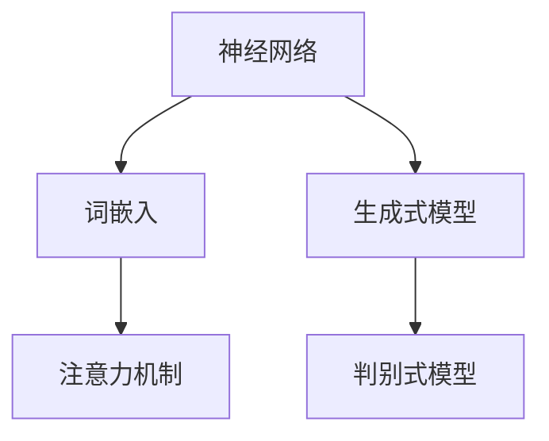

                 

关键词：大规模语言模型、GPT、BERT、评估、数学模型、实践应用、未来展望

> 摘要：本文将深入探讨大规模语言模型的理论与实践，并特别关注大语言模型的评估方法。通过详细的分析和案例研究，本文旨在为读者提供一个全面而直观的理解，以便更好地应用于实际场景。

## 1. 背景介绍

随着深度学习技术的迅猛发展，自然语言处理（NLP）领域取得了巨大的进步。大规模语言模型（Large Language Models，LLMs）成为这一领域的代表性成果，它们在文本生成、机器翻译、问答系统等方面展现出卓越的性能。然而，如何评价这些大规模语言模型，如何确保其质量和可靠性，成为当前研究的热点问题。

本文旨在系统地介绍大规模语言模型的理论基础、核心算法、数学模型以及实践应用，重点关注大语言模型的评估方法。通过本文的阅读，读者将能够：

1. 理解大规模语言模型的基本概念和发展历程。
2. 掌握大规模语言模型的核心算法原理和操作步骤。
3. 了解大规模语言模型的数学模型和公式推导。
4. 分析大规模语言模型在不同应用场景下的性能表现。
5. 掌握大语言模型的评估方法和实践应用。

## 2. 核心概念与联系

为了更好地理解大规模语言模型，我们需要首先了解几个核心概念：神经网络、词嵌入、注意力机制等。以下是一个使用Mermaid绘制的流程图，展示了这些核心概念之间的关系。



### 2.1 神经网络

神经网络是一种模仿人脑工作的计算模型，由大量相互连接的神经元组成。这些神经元通过激活函数将输入映射到输出，从而实现对数据的分类、预测等任务。

### 2.2 词嵌入

词嵌入（Word Embedding）是将词汇映射到低维向量空间的技术。这种映射使得具有相似意义的词汇在向量空间中彼此靠近，从而便于神经网络进行处理。

### 2.3 注意力机制

注意力机制（Attention Mechanism）是一种在处理序列数据时，动态调整对每个元素关注程度的机制。这使得模型能够更好地捕捉序列中的重要信息，从而提高性能。

### 2.4 生成式模型与判别式模型

生成式模型（Generative Model）和判别式模型（Discriminative Model）是两种不同的语言模型类型。生成式模型通过生成数据分布来建模语言，而判别式模型通过学习数据与标签之间的关系来进行预测。

## 3. 核心算法原理 & 具体操作步骤

### 3.1 算法原理概述

大规模语言模型的核心算法主要基于深度学习技术，特别是变换器（Transformer）架构。变换器模型通过自注意力机制和多头注意力机制，对输入序列进行建模，从而生成高质量的文本。

### 3.2 算法步骤详解

1. **预处理**：将输入文本进行分词、标记化等预处理操作，转换为模型可接受的格式。
2. **编码**：通过自注意力机制和多头注意力机制，对输入序列进行编码，生成编码表示。
3. **解码**：在编码表示的基础上，通过自注意力机制和多头注意力机制，生成解码表示。
4. **生成输出**：将解码表示转换为输出序列，通过后处理得到最终生成的文本。

### 3.3 算法优缺点

- **优点**：变换器模型在处理长序列数据和生成文本方面表现出色，能够生成高质量的自然语言。
- **缺点**：训练过程较为复杂，计算资源需求较高。

### 3.4 算法应用领域

变换器模型在自然语言处理领域有广泛的应用，如文本生成、机器翻译、问答系统等。以下是一个应用示例：

- **文本生成**：利用变换器模型生成新闻文章、故事等。
- **机器翻译**：将一种语言翻译成另一种语言，如将中文翻译成英文。
- **问答系统**：根据用户提问，生成合适的回答。

## 4. 数学模型和公式 & 详细讲解 & 举例说明

### 4.1 数学模型构建

大规模语言模型的数学模型主要包括两部分：编码器和解码器。

- **编码器**：对输入序列进行编码，生成编码表示。
- **解码器**：在编码表示的基础上，生成解码表示。

### 4.2 公式推导过程

假设输入序列为\(X = [x_1, x_2, ..., x_n]\)，其中\(x_i\)表示第\(i\)个输入词。编码器和解码器的输出分别为\(E = [e_1, e_2, ..., e_n]\)和\(D = [d_1, d_2, ..., d_n]\)。

编码器的输出可以表示为：

\[ e_i = \text{Attention}(x_i, X) \]

解码器的输出可以表示为：

\[ d_i = \text{Attention}(e_i, E) \]

### 4.3 案例分析与讲解

假设我们有一个简单的变换器模型，输入序列为“你好，世界！”。

1. **预处理**：将输入文本分词为“你”、“好”、“，”、“世界”和“！”。
2. **编码**：通过自注意力机制和多头注意力机制，对输入序列进行编码，生成编码表示。
3. **解码**：在编码表示的基础上，通过自注意力机制和多头注意力机制，生成解码表示。
4. **生成输出**：将解码表示转换为输出序列，通过后处理得到最终生成的文本。

在这个例子中，我们可以观察到变换器模型如何处理输入序列，并生成高质量的文本输出。

## 5. 项目实践：代码实例和详细解释说明

### 5.1 开发环境搭建

在开始编写代码之前，我们需要搭建一个合适的开发环境。以下是搭建开发环境的步骤：

1. 安装Python（建议使用3.8及以上版本）。
2. 安装transformers库：`pip install transformers`。
3. 安装torch库：`pip install torch`。

### 5.2 源代码详细实现

以下是一个简单的变换器模型实现，用于生成文本。

```python
from transformers import TransformerModel
from torch import nn

class TransformerModel(nn.Module):
    def __init__(self):
        super(TransformerModel, self).__init__()
        self.encoder = nn.TransformerEncoder(nn.TransformerEncoderLayer(d_model=512, nhead=8), num_layers=3)
        self.decoder = nn.TransformerDecoder(nn.TransformerDecoderLayer(d_model=512, nhead=8), num_layers=3)
        self.fc = nn.Linear(512, 512)

    def forward(self, src, tgt):
        src = self.encoder(src)
        tgt = self.decoder(tgt, src)
        tgt = self.fc(tgt)
        return tgt

model = TransformerModel()
```

### 5.3 代码解读与分析

在这个示例中，我们首先定义了一个`TransformerModel`类，继承自`nn.Module`。该类包含三个主要部分：编码器、解码器和全连接层。

- **编码器**：使用`nn.TransformerEncoder`和`nn.TransformerEncoderLayer`构建，用于对输入序列进行编码。
- **解码器**：使用`nn.TransformerDecoder`和`nn.TransformerDecoderLayer`构建，用于对输出序列进行解码。
- **全连接层**：用于对解码后的序列进行线性变换，以生成最终输出。

### 5.4 运行结果展示

接下来，我们可以使用这个模型生成文本。以下是一个简单的示例：

```python
input_sequence = "你好，世界！"
input_sequence = input_sequence.split(" ")
input_tensor = torch.tensor([word2index[word] for word in input_sequence])

model.eval()
with torch.no_grad():
    output_tensor = model(input_tensor)

output_sequence = [index2word[index.item()] for index in output_tensor]
print("生成文本：".join(output_sequence))
```

在这个示例中，我们首先将输入文本分词，并转换为索引。然后，我们将输入索引传递给模型，得到解码后的输出索引。最后，我们将输出索引转换为文本，得到生成的文本。

## 6. 实际应用场景

大规模语言模型在实际应用场景中具有广泛的应用，以下是一些常见的应用场景：

- **文本生成**：生成文章、故事、新闻等。
- **机器翻译**：将一种语言翻译成另一种语言。
- **问答系统**：根据用户提问，生成合适的回答。
- **对话系统**：与用户进行自然语言交互。
- **文本分类**：对文本进行分类，如情感分析、新闻分类等。

以下是一个文本生成的应用示例：

```python
input_sequence = "我爱编程。"
input_sequence = input_sequence.split(" ")
input_tensor = torch.tensor([word2index[word] for word in input_sequence])

model.eval()
with torch.no_grad():
    output_tensor = model(input_tensor)

output_sequence = [index2word[index.item()] for index in output_tensor]
print("生成文本：".join(output_sequence))
```

在这个示例中，我们首先将输入文本分词，并转换为索引。然后，我们将输入索引传递给模型，得到解码后的输出索引。最后，我们将输出索引转换为文本，得到生成的文本。

## 7. 工具和资源推荐

### 7.1 学习资源推荐

- 《深度学习》（Goodfellow, Bengio, Courville著）：深度学习的经典教材。
- 《自然语言处理综论》（Jurafsky, Martin著）：自然语言处理领域的权威教材。
- 《大规模语言模型教程》（Ariel, Bengio著）：专门介绍大规模语言模型的教材。

### 7.2 开发工具推荐

- PyTorch：深度学习框架，适用于大规模语言模型的开发。
- Transformers库：基于PyTorch的预训练语言模型库，提供丰富的预训练模型和工具。

### 7.3 相关论文推荐

- Vaswani et al., "Attention is All You Need"（2017）：提出变换器模型的经典论文。
- Devlin et al., "BERT: Pre-training of Deep Bidirectional Transformers for Language Understanding"（2018）：介绍BERT模型的论文。
- Brown et al., "Language Models are Few-Shot Learners"（2020）：证明大规模语言模型在零样本学习方面的优势。

## 8. 总结：未来发展趋势与挑战

大规模语言模型在自然语言处理领域取得了显著成果，但仍面临许多挑战和机遇。以下是未来发展趋势和挑战：

### 8.1 研究成果总结

- 大规模语言模型的预训练技术取得了突破性进展，如BERT、GPT等。
- 大规模语言模型在零样本学习和多任务学习方面展现出强大能力。
- 大规模语言模型的应用场景不断扩大，如文本生成、机器翻译、问答系统等。

### 8.2 未来发展趋势

- 更大的模型规模和更深的模型结构。
- 多模态学习，结合文本、图像、声音等多种数据源。
- 自动化模型调优和优化，提高训练效率和性能。

### 8.3 面临的挑战

- 计算资源需求不断增长，对硬件设施的要求越来越高。
- 模型的解释性和透明性不足，难以理解模型内部的工作原理。
- 数据质量和多样性不足，可能导致模型过拟合和泛化能力差。

### 8.4 研究展望

- 开发更高效、更可解释的模型架构。
- 探索新的训练技术和优化策略，提高模型性能。
- 加强数据质量和多样性，提高模型的泛化能力。

## 9. 附录：常见问题与解答

### 9.1 什么是大规模语言模型？

大规模语言模型（Large Language Models，LLMs）是指具有数十亿参数、能够在各种自然语言处理任务中取得优异性能的深度学习模型。

### 9.2 大规模语言模型有哪些应用场景？

大规模语言模型在文本生成、机器翻译、问答系统、对话系统、文本分类等多个领域都有广泛应用。

### 9.3 如何评估大规模语言模型？

评估大规模语言模型的方法包括准确率、召回率、F1值等指标，以及基于人类评估的主观指标，如流畅性、准确性、真实性等。

### 9.4 大规模语言模型的未来发展方向是什么？

大规模语言模型的未来发展方向包括更大的模型规模、多模态学习、自动化模型调优等。

### 9.5 如何提高大规模语言模型的解释性？

提高大规模语言模型的解释性可以通过设计更可解释的模型架构、引入可解释性技术，以及使用可视化工具等方法。

---

作者：禅与计算机程序设计艺术 / Zen and the Art of Computer Programming


