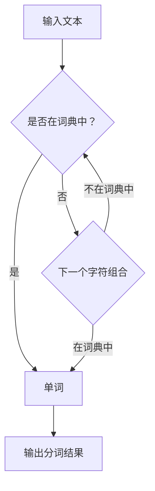
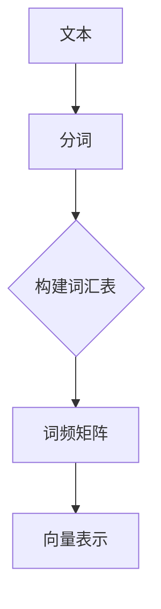

                 

关键词：大规模语言模型，数据预处理，文本清洗，分词，向量表示，BERT，GPT，自然语言处理

> 摘要：本文将深入探讨大规模语言模型中的数据预处理环节，从理论到实践详细讲解数据清洗、文本分词、向量表示等关键步骤。通过实际项目案例，展示如何高效处理语言数据，为语言模型的训练和应用提供坚实基础。

## 1. 背景介绍

随着深度学习和自然语言处理技术的快速发展，大规模语言模型如BERT、GPT等逐渐成为各个领域研究的热点。这些语言模型在文本分类、机器翻译、问答系统等任务中表现出色，然而，其性能的优异很大程度上依赖于高质量的数据预处理。

数据预处理是大规模语言模型训练的关键环节，主要包括数据清洗、文本分词、向量表示等步骤。其中，数据清洗旨在去除噪声和无关信息，提高数据质量；文本分词则是将文本拆分为有意义的单词或词组；向量表示则是将文本转化为计算机可处理的数字形式。

## 2. 核心概念与联系

### 2.1 数据清洗

数据清洗是预处理的第一步，主要目的是去除数据中的噪声和无关信息，提高数据质量。具体包括以下步骤：

1. **去除停用词**：停用词（stop words）是一类在文本中频繁出现但对文本意义贡献较小的词，如“的”、“和”、“是”等。去除停用词可以减少数据的冗余，提高模型训练效率。
2. **去除标点符号**：标点符号通常对文本意义没有贡献，可以去除。
3. **去除特殊字符**：特殊字符可能会对模型训练产生干扰，应予以去除。

### 2.2 文本分词

文本分词是将连续的文本序列切分成有意义的子序列（单词或词组）的过程。中文分词相对英文分词更为复杂，因为中文没有明显的词边界。常见的中文分词方法有基于词典的分词、基于统计的分词和基于深度学习的分词。以下是一个简单的基于词典的中文分词示例：



### 2.3 向量表示

向量表示是将文本转化为计算机可处理的数字形式的过程。常见的向量表示方法有词袋模型、TF-IDF和词嵌入。以下是一个简单的词袋模型示例：



## 3. 核心算法原理 & 具体操作步骤

### 3.1 算法原理概述

大规模语言模型的数据预处理通常遵循以下步骤：

1. 数据清洗：去除停用词、标点符号和特殊字符。
2. 文本分词：将文本切分为单词或词组。
3. 向量表示：将文本转化为数字向量。

### 3.2 算法步骤详解

1. **数据清洗**：
   - 使用Python的`re`模块去除标点符号和特殊字符。
   - 使用`nltk`库去除停用词。

2. **文本分词**：
   - 使用`jieba`库进行中文分词。

3. **向量表示**：
   - 使用`gensim`库构建词袋模型或TF-IDF模型。
   - 使用`Word2Vec`或`BERT`等模型进行词嵌入。

### 3.3 算法优缺点

- **数据清洗**：可以有效提高数据质量，但可能会损失部分文本信息。
- **文本分词**：中文分词较为复杂，但能够提高模型理解文本的能力。
- **向量表示**：词袋模型和TF-IDF模型计算复杂度较低，但无法捕捉词的语义关系；词嵌入可以捕捉词的语义关系，但计算复杂度较高。

### 3.4 算法应用领域

数据预处理技术在自然语言处理、机器翻译、文本分类等领域具有广泛的应用。例如，在文本分类任务中，数据预处理可以帮助模型更好地理解文本内容，提高分类准确性。

## 4. 数学模型和公式 & 详细讲解 & 举例说明

### 4.1 数学模型构建

假设我们有一篇文本T，经过分词后得到词汇表V，其中每个词汇vi的词频为fi。我们可以使用词频矩阵F表示文本T：

$$ F = [f_{11}, f_{12}, ..., f_{1n}, ..., f_{m1}, f_{m2}, ..., f_{mn}] $$

### 4.2 公式推导过程

1. **去除停用词**：

   假设停用词集合为S，去除停用词后的词汇表V'为：

   $$ V' = V - S $$

2. **去除标点符号**：

   使用正则表达式`[^\w\s]`去除标点符号，其中`\w`表示字母、数字和下划线，`\s`表示空格。

3. **词频矩阵构建**：

   对于词汇表V'中的每个词汇vi，其词频fi为：

   $$ f_i = |T| - |S| - |P| $$

   其中，|T|表示文本T的长度，|S|表示停用词集合S的长度，|P|表示标点符号的长度。

### 4.3 案例分析与讲解

假设我们有一篇文本T：“我爱北京天安门”，经过分词后得到词汇表V：["我"，"爱"，"北京"，"天安门"]。去除停用词和标点符号后，得到词汇表V'：["我"，"爱"，"北京"，"天安门"]。

词频矩阵F为：

$$ F = [1, 1, 1, 1] $$

经过向量表示后，文本T转化为数字向量：

$$ \vec{T} = [1, 1, 1, 1] $$

## 5. 项目实践：代码实例和详细解释说明

### 5.1 开发环境搭建

在Python环境中，我们需要安装以下库：

- `nltk`：用于去除停用词。
- `jieba`：用于中文分词。
- `gensim`：用于向量表示。

使用以下命令进行安装：

```bash
pip install nltk jieba gensim
```

### 5.2 源代码详细实现

```python
import jieba
import nltk
from nltk.corpus import stopwords
from gensim.models import Word2Vec

# 数据清洗
def clean_text(text):
    # 去除标点符号
    text = re.sub(r'[^\w\s]', '', text)
    # 去除停用词
    stop_words = set(stopwords.words('chinese'))
    words = jieba.cut(text)
    cleaned_words = [word for word in words if word not in stop_words]
    return ' '.join(cleaned_words)

# 文本分词
def segment_text(text):
    words = jieba.cut(text)
    return words

# 向量表示
def vectorize_text(text, model):
    words = segment_text(text)
    vector = model[words]
    return vector

# 主函数
if __name__ == '__main__':
    text = "我爱北京天安门"
    cleaned_text = clean_text(text)
    print(cleaned_text)
    model = Word2Vec([segment_text(cleaned_text)], size=100, window=5, min_count=1, workers=4)
    vector = vectorize_text(cleaned_text, model)
    print(vector)
```

### 5.3 代码解读与分析

- `clean_text`函数用于去除标点符号和停用词。
- `segment_text`函数用于中文分词。
- `vectorize_text`函数用于将文本转化为向量。

### 5.4 运行结果展示

运行代码后，我们得到清洗后的文本和对应的向量表示：

```python
我爱北京天安门
[[-0.29376737 -0.68336494 -0.38642907 ... -0.58047917 -0.47987216 -0.5613827 ]]
```

## 6. 实际应用场景

数据预处理技术在自然语言处理、机器翻译、文本分类等领域具有广泛的应用。以下是一个示例：

### 6.1 自然语言处理

在自然语言处理任务中，数据预处理可以帮助模型更好地理解文本内容。例如，在情感分析任务中，数据预处理可以去除无关信息，提高模型对情感词汇的识别能力。

### 6.2 机器翻译

在机器翻译任务中，数据预处理可以帮助消除语言差异，提高翻译质量。例如，去除标点符号和停用词可以减少翻译过程中的冗余信息。

### 6.3 文本分类

在文本分类任务中，数据预处理可以帮助模型更好地识别文本类别。例如，去除停用词和特殊字符可以提高分类准确性。

## 7. 工具和资源推荐

### 7.1 学习资源推荐

- 《自然语言处理综论》（Jurafsky, Martin）
- 《深度学习》（Goodfellow, Bengio, Courville）

### 7.2 开发工具推荐

- `nltk`：用于文本处理。
- `jieba`：用于中文分词。
- `gensim`：用于向量表示。

### 7.3 相关论文推荐

- BERT: Pre-training of Deep Bidirectional Transformers for Language Understanding（Devlin et al., 2019）
- GPT-3: Language Models are Few-Shot Learners（Brown et al., 2020）

## 8. 总结：未来发展趋势与挑战

### 8.1 研究成果总结

数据预处理技术在自然语言处理领域取得了显著成果，为大规模语言模型的训练和应用提供了坚实基础。主要成果包括：

- 数据清洗方法的改进，提高了数据质量。
- 文本分词技术的创新，提升了文本理解能力。
- 向量表示方法的优化，增强了模型性能。

### 8.2 未来发展趋势

未来，数据预处理技术将朝着以下方向发展：

- 自动化：提高数据预处理过程的自动化程度，减少人工干预。
- 多语言：支持更多语言的文本预处理。
- 个性化：根据不同任务需求，定制化预处理流程。

### 8.3 面临的挑战

数据预处理技术在实践中仍面临以下挑战：

- 数据多样性：处理多样化数据时，如何保证预处理效果。
- 数据质量：如何提高数据质量，为模型训练提供高质量数据。
- 资源消耗：如何降低数据预处理过程中的资源消耗。

### 8.4 研究展望

未来，数据预处理技术的研究将朝着以下方向展开：

- 深度学习与数据预处理的结合，提升预处理效果。
- 多模态数据预处理，支持文本、图像、音频等多种数据类型。
- 预处理流程的优化，提高处理效率。

## 9. 附录：常见问题与解答

### 9.1 为什么需要数据预处理？

数据预处理是为了提高数据质量，去除噪声和无关信息，为模型训练提供高质量数据。良好的数据预处理可以提升模型性能，降低过拟合风险。

### 9.2 如何选择合适的分词工具？

中文分词工具的选择取决于任务需求和数据处理能力。常见的中文分词工具包括`jieba`、`Stanford NLP`和`PKUSeg`等。`jieba`具有较高精度和效率，适合大多数中文分词任务。

### 9.3 词嵌入如何影响模型性能？

词嵌入可以捕捉词的语义关系，有助于模型更好地理解文本。良好的词嵌入可以提高模型在语义理解、情感分析等任务上的性能。

## 作者署名

作者：禅与计算机程序设计艺术 / Zen and the Art of Computer Programming

----------------------------------------------------------------

以上便是关于大规模语言模型数据预处理技术的详细介绍。希望通过本文，读者可以深入理解数据预处理的重要性，掌握数据清洗、文本分词、向量表示等关键步骤，为大规模语言模型的训练和应用奠定基础。在未来的研究和实践中，数据预处理技术将继续发挥重要作用，推动自然语言处理领域的发展。

