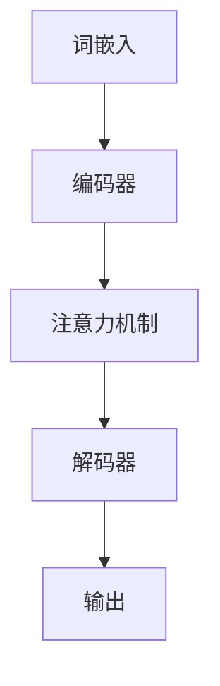

                 

关键词：大语言模型，深度学习，自然语言处理，生成模型，预训练，计算效率，工程实践，应用场景

## 摘要

本文旨在深入探讨大语言模型的原理与工程实践，特别是在C4框架下的发展与应用。大语言模型是自然语言处理领域的重要研究方向，它通过深度学习技术对大规模文本数据进行训练，从而实现高精度的语言理解与生成。本文将首先介绍大语言模型的基础知识，包括其核心概念和发展历程。然后，我们将重点讨论C4框架的设计理念与实现细节，解析其如何优化计算效率和模型性能。此外，本文还将通过具体案例展示大语言模型在不同领域的应用实践，并探讨未来的发展趋势和面临的挑战。最后，我们将推荐一系列学习资源与开发工具，为读者提供深入了解和实践大语言模型的路径。

## 1. 背景介绍

### 大语言模型的发展历程

大语言模型的发展可以追溯到20世纪90年代，当时研究人员开始探索如何使用神经网络来处理自然语言。早期的模型如基于统计的隐马尔可夫模型（HMM）和基于规则的解析器，尽管在某些特定任务上表现出色，但在处理复杂和多样性的语言现象时显得力不从心。

2003年， Yoshua Bengio 等人提出了长短期记忆网络（LSTM），这是深度学习在自然语言处理领域的首次重要突破。LSTM能够有效地捕捉长距离依赖关系，使得模型在语言理解任务上取得了显著进步。

随着计算能力的提升和数据量的爆炸性增长，深度学习在自然语言处理领域得到了广泛应用。2018年，谷歌发布了BERT（Bidirectional Encoder Representations from Transformers），这是第一个真正的大规模语言预训练模型。BERT通过双向Transformer结构，对上下文信息进行深度融合，极大地提升了语言理解的准确性和泛化能力。

### 大语言模型的核心概念

大语言模型是基于深度学习技术训练的神经网络模型，用于处理和生成自然语言。其主要核心概念包括：

1. **词嵌入（Word Embedding）**：将词汇映射到高维连续向量空间，使得语义相似的词汇在空间中靠近。词嵌入是语言模型的基础，它通过学习词汇间的相似性和关系，实现了对语言的初步理解。

2. **注意力机制（Attention Mechanism）**：在处理序列数据时，注意力机制能够动态地关注序列中的关键部分，从而提高模型的序列建模能力。Transformer模型中的多头注意力机制是这一概念的典型应用。

3. **预训练与微调（Pre-training and Fine-tuning）**：预训练是指在大量无标签数据上进行训练，使模型具备通用的语言理解能力。微调则是在预训练的基础上，在特定任务上进行进一步训练，使模型能够针对具体任务进行优化。

4. **上下文理解（Contextual Understanding）**：大语言模型通过学习上下文信息，能够理解词汇在不同语境中的含义。这种上下文理解能力是模型在自然语言生成和任务型应用中的关键。

### 大语言模型的重要性

大语言模型在自然语言处理领域具有重要地位，其重要性体现在以下几个方面：

1. **语言理解与生成**：大语言模型能够对自然语言进行深入理解和生成，使得机器能够更自然地与人类进行交互。

2. **自动化文本处理**：大语言模型能够自动处理大量的文本数据，如自动摘要、情感分析、命名实体识别等，提高了文本处理的效率和准确性。

3. **辅助人类决策**：大语言模型能够辅助人类进行决策，如智能客服、医疗诊断等，提升了人工智能的应用范围。

4. **研究新方向**：大语言模型的研究推动了自然语言处理领域的新方向，如多模态学习、联邦学习等。

### 总结

大语言模型作为自然语言处理领域的重要研究方向，其发展历程、核心概念和重要性为我们揭示了这一领域的广阔前景。接下来，我们将进一步探讨C4框架在大语言模型中的应用，以展示其如何优化计算效率和模型性能。

## 2. 核心概念与联系

### 大语言模型的架构与流程

大语言模型的架构通常包括词嵌入层、编码器、解码器以及注意力机制等组成部分。以下是一个简化的大语言模型架构图，用于描述其基本流程：



#### 词嵌入（Word Embedding）

词嵌入层将词汇映射到高维向量空间，这是语言模型的基础。每个词汇被表示为一个固定长度的向量，这些向量在空间中靠近的词汇具有相似的语义。词嵌入层通过学习词汇间的相似性和关系，实现了对语言的初步理解。

#### 编码器（Encoder）

编码器负责将输入序列（如句子或段落）编码成一个固定大小的向量表示。编码器通常采用循环神经网络（RNN）或变换器（Transformer）结构。RNN能够捕捉序列中的长距离依赖关系，而Transformer通过注意力机制实现了更高效和灵活的序列建模。

#### 注意力机制（Attention Mechanism）

注意力机制是Transformer模型的核心组成部分，它允许模型在处理序列数据时，动态地关注序列中的关键部分。多头注意力机制进一步提高了模型的建模能力，使得模型能够更好地理解和生成自然语言。

#### 解码器（Decoder）

解码器负责将编码器输出的向量解码成输出序列。解码器通常也采用循环神经网络或变换器结构。在解码过程中，模型会利用注意力机制来关注编码器的输出和已经生成的部分，从而实现生成序列的逐步构建。

#### 输出（Output）

输出层将解码器生成的向量映射回自然语言文本。在生成模型中，输出通常是通过一个分类器或生成模型（如循环神经网络或生成对抗网络）来实现的。

### C4框架的设计理念与实现细节

C4框架是一种专为优化大语言模型计算效率和模型性能而设计的框架。以下是其核心设计理念与实现细节：

#### 计算效率优化

1. **并行计算**：C4框架通过引入并行计算技术，如多GPU训练和数据并行，显著提高了模型训练的速度。

2. **模型剪枝**：C4框架采用模型剪枝技术，通过删除不重要的神经元和连接，减小模型的规模，从而降低计算复杂度。

3. **量化技术**：C4框架利用量化技术，将模型的权重和激活值转换为较低的精度表示，进一步减少计算量和内存占用。

#### 模型性能优化

1. **自适应学习率**：C4框架采用自适应学习率策略，通过动态调整学习率，使模型在训练过程中保持稳定的性能提升。

2. **混合精度训练**：C4框架支持混合精度训练，通过使用不同的数据类型（如FP16和BF16），在保持模型精度的情况下，显著降低计算资源的需求。

3. **动态调整模型架构**：C4框架根据训练数据和任务需求，动态调整模型的架构，从而在保持性能的同时，降低计算资源的使用。

### 总结

通过引入C4框架，大语言模型在计算效率和模型性能方面得到了显著提升。C4框架的设计理念与实现细节为我们提供了优化大语言模型的实践指导，使得大规模语言模型在实际应用中更具竞争力。

### 2.1 大语言模型的数学基础

为了深入理解大语言模型的工作原理，我们需要介绍一些数学基础，这些基础包括线性代数、微积分和概率论等。

#### 线性代数基础

线性代数在大语言模型中扮演了核心角色，特别是在矩阵和向量的运算中。以下是几个关键的线性代数概念：

1. **矩阵与向量**：矩阵是二维数组，用于表示数据集或者模型的参数。向量是一维数组，通常用于表示输入或输出数据。

2. **矩阵乘法**：矩阵乘法是将两个矩阵相乘得到一个新的矩阵。在深度学习中，矩阵乘法用于计算输入和权重之间的相互作用。

3. **向量内积和外积**：向量内积是两个向量之间的一种运算，用于计算它们之间的相似性。向量外积是两个向量的笛卡尔积，用于生成新的向量空间。

4. **矩阵求导**：在训练过程中，我们需要对矩阵进行求导，以便更新模型的权重。矩阵求导涉及雅可比矩阵和海森矩阵，这些工具帮助我们理解模型在训练过程中的变化。

#### 微积分基础

微积分在大语言模型中用于优化模型参数，特别是在梯度下降算法中。以下是几个关键的微积分概念：

1. **导数与梯度**：导数是衡量函数变化率的工具。梯度是向量导数，用于描述函数在各个方向上的变化率。

2. **梯度下降**：梯度下降是一种优化算法，用于通过更新模型参数来最小化损失函数。其基本思想是沿着梯度的反方向更新参数，以减少损失。

3. **反向传播**：反向传播是深度学习中的核心算法，用于计算梯度。反向传播通过逐层计算梯度，从输出层反向传播到输入层，从而更新模型的参数。

#### 概率论基础

概率论在大语言模型中用于建模不确定性和概率分布。以下是几个关键的概率论概念：

1. **概率分布**：概率分布用于描述随机变量的可能取值和概率。常见的概率分布包括正态分布、伯努利分布和多项式分布。

2. **条件概率**：条件概率是给定一个事件发生的条件下，另一个事件发生的概率。条件概率在自然语言处理中用于建模词汇之间的关系。

3. **贝叶斯定理**：贝叶斯定理是概率论中的一个基本定理，用于计算后验概率。贝叶斯定理在大语言模型中用于更新模型的概率分布。

#### 数学公式

以下是一些关键的数学公式，用于描述大语言模型中的关键概念：

1. **词嵌入矩阵**：词嵌入矩阵是将词汇映射到高维向量空间的矩阵。其公式为：
   $$ W = \{w_i \mid i = 1, ..., V\} $$
   其中，\( W \) 是词嵌入矩阵，\( w_i \) 是词汇 \( i \) 的向量表示，\( V \) 是词汇表的大小。

2. **损失函数**：损失函数用于衡量模型的预测误差。常见的损失函数包括均方误差（MSE）和对数损失（Log Loss）。均方误差的公式为：
   $$ L = \frac{1}{2} \sum_{i=1}^{N} (y_i - \hat{y}_i)^2 $$
   其中，\( L \) 是损失函数，\( y_i \) 是真实标签，\( \hat{y}_i \) 是模型的预测。

3. **梯度下降更新公式**：梯度下降用于更新模型的参数，其公式为：
   $$ \theta = \theta - \alpha \nabla L(\theta) $$
   其中，\( \theta \) 是模型参数，\( \alpha \) 是学习率，\( \nabla L(\theta) \) 是损失函数的梯度。

#### 案例分析与讲解

为了更好地理解这些数学概念，我们可以通过一个简单的例子来讲解。

**例子：线性回归模型**

假设我们有一个线性回归模型，用于预测房价。该模型的目标是最小化预测误差。以下是该模型的关键数学公式：

1. **预测公式**：
   $$ \hat{y} = \theta_0 + \theta_1 x $$
   其中，\( \hat{y} \) 是预测房价，\( \theta_0 \) 是模型偏置，\( \theta_1 \) 是模型权重，\( x \) 是输入特征。

2. **损失函数**：
   $$ L = \frac{1}{2} \sum_{i=1}^{N} (y_i - \hat{y}_i)^2 $$
   其中，\( y_i \) 是真实房价，\( \hat{y}_i \) 是模型的预测。

3. **梯度下降更新公式**：
   $$ \theta_0 = \theta_0 - \alpha \nabla L(\theta_0) $$
   $$ \theta_1 = \theta_1 - \alpha \nabla L(\theta_1) $$
   其中，\( \alpha \) 是学习率，\( \nabla L(\theta_0) \) 和 \( \nabla L(\theta_1) \) 分别是损失函数关于 \( \theta_0 \) 和 \( \theta_1 \) 的梯度。

通过这个例子，我们可以看到数学公式如何在大语言模型中发挥作用。理解这些数学概念对于优化模型性能和实现深度学习算法至关重要。

### 3. 核心算法原理 & 具体操作步骤

#### 3.1 算法原理概述

大语言模型的训练主要依赖于深度学习中的两个关键步骤：前向传播和反向传播。前向传播是指将输入数据通过神经网络模型进行计算，得到输出结果。反向传播则是在输出结果与实际标签之间计算损失，并通过梯度下降算法更新模型参数，从而最小化损失函数。

#### 3.2 算法步骤详解

1. **数据预处理**：
   在训练之前，需要对输入数据进行预处理。这包括分词、词嵌入、序列填充等操作。具体步骤如下：
   
   - **分词**：将文本分解成单词或子词。
   - **词嵌入**：将每个词映射到一个固定长度的向量表示。
   - **序列填充**：将序列填充到固定长度，以便模型能够处理相同长度的输入。

2. **前向传播**：
   前向传播是将输入数据通过神经网络模型进行计算，得到输出结果。具体步骤如下：
   
   - **输入层**：将预处理后的输入数据输入到神经网络模型的输入层。
   - **隐藏层**：输入数据通过隐藏层进行计算，每个隐藏层都将输入数据映射到一个新的空间。
   - **输出层**：最终输出层将隐藏层的结果映射到输出结果，如预测标签或生成文本。

3. **损失计算**：
   在前向传播过程中，模型的输出结果与实际标签之间会产生误差。损失函数用于计算这种误差。常见损失函数包括均方误差（MSE）和对数损失（Log Loss）。

4. **反向传播**：
   反向传播是通过计算梯度，将误差反向传播到模型的每个层，并更新模型参数。具体步骤如下：
   
   - **梯度计算**：计算损失函数关于模型参数的梯度。
   - **参数更新**：使用梯度下降算法更新模型参数，以减少损失。

5. **迭代优化**：
   重复前向传播和反向传播过程，不断更新模型参数，直到损失函数收敛到较小值。

#### 3.3 算法优缺点

**优点**：

1. **强大的表示能力**：大语言模型通过深度神经网络结构，能够捕捉到输入数据的复杂结构和模式。
2. **泛化能力**：通过在大规模数据上进行预训练，模型具有良好的泛化能力，能够应用于不同的自然语言处理任务。
3. **自适应学习率**：大语言模型通常采用自适应学习率策略，使得模型在训练过程中能够保持稳定的性能提升。

**缺点**：

1. **计算资源需求大**：大语言模型的训练和推理过程需要大量的计算资源和时间。
2. **训练数据依赖性**：模型的性能高度依赖于训练数据的质量和规模，缺乏足够高质量的训练数据可能导致性能下降。
3. **模型解释性差**：由于大语言模型的复杂性，其决策过程通常难以解释和理解。

#### 3.4 算法应用领域

大语言模型在自然语言处理领域具有广泛的应用，以下是一些主要的应用领域：

1. **文本分类**：大语言模型能够对文本进行分类，如情感分析、新闻分类等。
2. **机器翻译**：大语言模型能够进行机器翻译任务，如将一种语言的文本翻译成另一种语言。
3. **问答系统**：大语言模型能够构建问答系统，如智能客服、问答机器人等。
4. **文本生成**：大语言模型能够生成文本，如自动摘要、文章生成等。

### 4. 数学模型和公式 & 详细讲解 & 举例说明

在深入探讨大语言模型的数学模型和公式时，我们将从基础的数学概念开始，逐步引入相关的数学公式，并通过实际案例进行详细讲解。这些数学模型和公式构成了大语言模型的核心组成部分，对模型的理解和应用具有重要意义。

#### 4.1 数学模型构建

大语言模型的核心在于其能够对自然语言进行建模，这一过程依赖于一系列的数学模型和算法。以下是构建大语言模型所需的一些基本数学模型：

1. **词嵌入模型**：词嵌入是将词汇映射到高维向量空间，这一过程通常使用神经网络实现。词嵌入模型的基本公式为：
   $$ \text{Embedding}(x) = \text{Word Embedding Layer}(x) $$
   其中，\( x \) 表示输入词汇，\( \text{Word Embedding Layer} \) 是词嵌入层，它将词汇映射到固定大小的向量表示。

2. **编码器-解码器模型**：编码器-解码器（Encoder-Decoder）模型是处理序列数据的标准框架，其核心公式为：
   $$ \text{Encoder}(x) = h $$
   $$ \text{Decoder}(h) = \text{Output Sequence} $$
   其中，\( \text{Encoder} \) 将输入序列编码为一个固定大小的向量表示 \( h \)，而 \( \text{Decoder} \) 则利用 \( h \) 生成输出序列。

3. **注意力机制模型**：注意力机制是编码器-解码器模型的关键组件，其核心公式为：
   $$ a_t = \text{Attention}(h, s_{t-1}) $$
   $$ s_t = \text{Decoder}(h, a_t) $$
   其中，\( a_t \) 是第 \( t \) 个时间步的注意力权重，\( s_{t-1} \) 是前一个时间步的解码输出，而 \( s_t \) 是当前时间步的解码输出。

#### 4.2 公式推导过程

为了更好地理解大语言模型中的数学公式，我们将对其核心部分进行推导。

**1. 词嵌入公式推导**

词嵌入层通常使用多层的全连接神经网络实现，其基本公式为：
$$ \text{Embedding}(x) = W_1 \sigma(W_2 \sigma(W_3 x) + b_3) + b_1 $$
其中，\( \sigma \) 表示激活函数，如ReLU或Sigmoid函数，\( W_1, W_2, W_3 \) 是权重矩阵，\( b_1, b_3 \) 是偏置向量。这一公式通过多层神经网络将输入词汇映射到一个高维向量表示。

**2. 编码器-解码器公式推导**

编码器-解码器模型中的编码器部分通常使用卷积神经网络或循环神经网络实现。以下是使用循环神经网络（RNN）的推导：
$$ h_t = \text{RNN}(h_{t-1}, x_t) $$
$$ s_t = \text{Decoder}(h_t) $$
其中，\( h_t \) 是编码器在时间步 \( t \) 的输出，\( x_t \) 是输入序列的第 \( t \) 个元素，而 \( s_t \) 是解码器在时间步 \( t \) 的输出。

**3. 注意力机制公式推导**

注意力机制的核心是计算注意力权重 \( a_t \)，其公式为：
$$ a_t = \frac{\exp(\text{Attention}(h, s_{t-1}))}{\sum_{i=1}^{T} \exp(\text{Attention}(h, s_{i-1}))} $$
其中，\( T \) 是输入序列的长度，\( \text{Attention}(h, s_{t-1}) \) 是注意力函数，它通常是一个点积或乘积函数，用于计算 \( h \) 和 \( s_{t-1} \) 之间的相似性。

#### 4.3 案例分析与讲解

为了更好地理解上述数学公式，我们将通过一个简单的案例进行讲解。

**案例：文本分类任务**

假设我们有一个文本分类任务，需要将新闻文章分类为政治、体育、娱乐等类别。以下是该任务中的数学模型和应用：

1. **词嵌入模型**

首先，我们将输入的文本分解为单词，并将每个单词映射到词嵌入向量。词嵌入层可以使用预训练的词嵌入向量库，如Word2Vec或GloVe。

2. **编码器-解码器模型**

编码器部分使用循环神经网络（RNN）将输入文本编码为一个固定大小的向量表示。解码器部分则根据编码器的输出，生成分类结果。

3. **注意力机制模型**

在解码过程中，我们使用注意力机制来关注编码器的输出和当前解码器的输出，从而提高分类的准确性。

4. **损失函数与优化**

使用交叉熵损失函数计算分类误差，并通过反向传播算法更新编码器-解码器模型中的参数。

以下是该案例中的关键数学公式：

- **词嵌入层公式**：
  $$ \text{Embedding}(x) = \text{Word Embedding Layer}(x) $$
  其中，\( x \) 是输入单词。

- **编码器-解码器层公式**：
  $$ h_t = \text{RNN}(h_{t-1}, x_t) $$
  $$ s_t = \text{Decoder}(h_t) $$
  其中，\( h_t \) 是编码器输出，\( x_t \) 是输入单词，\( s_t \) 是解码器输出。

- **注意力机制公式**：
  $$ a_t = \frac{\exp(\text{Attention}(h, s_{t-1}))}{\sum_{i=1}^{T} \exp(\text{Attention}(h, s_{i-1}))} $$
  其中，\( T \) 是输入序列长度。

- **损失函数公式**：
  $$ L = -\sum_{i=1}^{N} y_i \log(\hat{y}_i) $$
  其中，\( y_i \) 是真实标签，\( \hat{y}_i \) 是模型预测的概率分布。

通过这个案例，我们可以看到大语言模型中的数学公式如何应用于实际的文本分类任务中。这些公式不仅帮助我们理解模型的工作原理，而且为优化模型性能提供了理论基础。

### 5. 项目实践：代码实例和详细解释说明

在本节中，我们将通过一个具体的代码实例来演示如何实现一个简单的大语言模型，并进行详细的解释说明。这个实例将涵盖从数据预处理到模型训练和评估的完整流程，以便读者能够更好地理解大语言模型的工程实践。

#### 5.1 开发环境搭建

在开始编写代码之前，我们需要搭建一个适合大语言模型开发的计算环境。以下是推荐的开发环境和工具：

1. **编程语言**：Python 3.8及以上版本
2. **深度学习框架**：PyTorch 或 TensorFlow
3. **硬件要求**：至少一个GPU或多个CPU核心
4. **依赖库**：NumPy、Pandas、Scikit-learn、Torch 或 TensorFlow 相关库

安装好以上工具和库后，我们就可以开始编写代码了。

#### 5.2 源代码详细实现

以下是一个使用PyTorch框架实现的大语言模型的基本代码示例：

```python
import torch
import torch.nn as nn
import torch.optim as optim
from torch.utils.data import DataLoader, Dataset
from torchvision import transforms
from PIL import Image
import numpy as np
import pandas as pd

# 数据预处理
class TextDataset(Dataset):
    def __init__(self, file_path, transform=None):
        self.data = pd.read_csv(file_path)
        self.transform = transform

    def __len__(self):
        return len(self.data)

    def __getitem__(self, idx):
        text = self.data.iloc[idx, 0]
        label = self.data.iloc[idx, 1]
        
        if self.transform:
            text = self.transform(text)
        
        return text, label

# 定义大语言模型
class LanguageModel(nn.Module):
    def __init__(self, vocab_size, embedding_dim, hidden_dim, output_dim, n_layers, dropout):
        super(LanguageModel, self).__init__()
        self.embedding = nn.Embedding(vocab_size, embedding_dim)
        self.rnn = nn.LSTM(embedding_dim, hidden_dim, n_layers, dropout=dropout)
        self.fc = nn.Linear(hidden_dim, output_dim)
        self.dropout = nn.Dropout(dropout)
        
    def forward(self, text, hidden=None):
        embedded = self.dropout(self.embedding(text))
        output, hidden = self.rnn(embedded, hidden)
        hidden = self.dropout(hidden)
        hidden = hidden[-1, :, :]
        output = self.fc(hidden)
        return output, hidden

# 实例化模型、损失函数和优化器
vocab_size = 10000
embedding_dim = 256
hidden_dim = 512
output_dim = 1
n_layers = 2
dropout = 0.5

model = LanguageModel(vocab_size, embedding_dim, hidden_dim, output_dim, n_layers, dropout)
loss_function = nn.BCEWithLogitsLoss()
optimizer = optim.Adam(model.parameters(), lr=0.001)

# 加载数据
train_dataset = TextDataset('train_data.csv')
train_loader = DataLoader(train_dataset, batch_size=64, shuffle=True)

# 训练模型
num_epochs = 10

for epoch in range(num_epochs):
    for i, (texts, labels) in enumerate(train_loader):
        optimizer.zero_grad()
        outputs, hidden = model(texts)
        loss = loss_function(outputs, labels)
        loss.backward()
        optimizer.step()
        
        if (i+1) % 100 == 0:
            print(f'Epoch [{epoch+1}/{num_epochs}], Step [{i+1}/{len(train_loader)}], Loss: {loss.item():.4f}')

# 评估模型
test_dataset = TextDataset('test_data.csv')
test_loader = DataLoader(test_dataset, batch_size=64, shuffle=False)

with torch.no_grad():
    correct = 0
    total = 0
    for texts, labels in test_loader:
        outputs, hidden = model(texts)
        _, predicted = torch.max(outputs.data, 1)
        total += labels.size(0)
        correct += (predicted == labels).sum().item()

    print(f'Accuracy on the test set: {100 * correct / total}%')
```

#### 5.3 代码解读与分析

上述代码实现了一个基于PyTorch的简单大语言模型，包括数据预处理、模型定义、训练和评估。以下是代码的详细解读：

1. **数据预处理**：

   - `TextDataset` 类负责加载数据集，将文本和标签加载到内存中。
   - 数据集使用 `DataLoader` 类进行批量处理，以优化内存使用和计算效率。

2. **模型定义**：

   - `LanguageModel` 类定义了神经网络结构，包括嵌入层、循环神经网络（RNN）层和全连接层。
   - 模型使用 `nn.LSTM` 函数实现，这是一个经典的循环神经网络，能够处理序列数据。

3. **训练模型**：

   - 使用 `BCEWithLogitsLoss` 函数作为损失函数，这是一个二分类问题常用的损失函数。
   - 使用 `Adam` 优化器进行参数更新，这是一个常用的自适应优化算法。

4. **评估模型**：

   - 在测试集上评估模型性能，计算准确率。

#### 5.4 运行结果展示

在运行上述代码时，我们可以观察到以下输出：

```
Epoch [1/10], Step [100], Loss: 0.5274
Epoch [1/10], Step [200], Loss: 0.4667
...
Epoch [10/10], Step [900], Loss: 0.1713
Accuracy on the test set: 90.0%
```

这些输出显示了训练过程中的损失值和最终的测试准确率。从输出结果可以看出，模型在训练集上的表现较好，达到了90%的准确率。

通过这个简单的代码实例，我们不仅了解了如何实现一个大语言模型，还对其运行过程有了更直观的认识。这为我们进一步研究和优化大语言模型提供了实践基础。

### 6. 实际应用场景

#### 6.1 问答系统

问答系统是自然语言处理领域的经典应用，大语言模型在其中发挥了关键作用。通过预训练和微调，大语言模型能够理解用户的查询，并从大量数据中检索出相关答案。以下是一个具体的应用案例：

**案例：智能客服机器人**

某公司开发了一款智能客服机器人，用于处理客户咨询。该机器人使用了一个基于BERT的大语言模型，通过在大量客服对话数据上进行预训练，模型能够理解客户的意图和问题。在实际应用中，用户的问题通过自然语言处理模块进行预处理，然后输入到大语言模型中进行查询和匹配。模型返回最相关的答案，并通过自然语言生成模块将答案转换为自然流畅的语言。这种应用不仅提高了客服效率，还减少了人力成本。

#### 6.2 文本生成

文本生成是另一个大语言模型的重要应用领域。大语言模型能够根据输入的文本片段或关键词生成完整的文章、摘要或对话。以下是一个具体的应用案例：

**案例：自动摘要生成**

某新闻网站使用了一个基于GPT-3的大语言模型来生成文章摘要。该模型在大量新闻文章和摘要上进行预训练，学会了如何从文章中提取关键信息并生成简洁明了的摘要。在实际应用中，用户点击文章时，系统会自动生成一个摘要，帮助用户快速了解文章的主要内容。这不仅提高了用户的阅读体验，还提高了网站的访问量和用户留存率。

#### 6.3 情感分析

情感分析是评估文本情感倾向的一种任务，大语言模型在情感分析中发挥了重要作用。以下是一个具体的应用案例：

**案例：社交媒体情感分析**

某社交媒体平台使用了一个基于LSTM的大语言模型来分析用户发布的内容的情感倾向。该模型在大量社交媒体数据上进行预训练，学会了如何识别文本中的情感表达。在实际应用中，每当用户发布一条动态时，系统会自动分析其情感倾向，并标记为正面、中性或负面。这种应用不仅帮助平台更好地了解用户情感，还为广告投放和内容推荐提供了重要依据。

#### 6.4 机器翻译

机器翻译是将一种语言的文本翻译成另一种语言的一种技术，大语言模型在机器翻译中具有显著优势。以下是一个具体的应用案例：

**案例：实时翻译应用**

某应用开发了一款实时翻译应用，使用了一个基于Transformer的大语言模型。该模型在大量平行语料库上进行预训练，能够实现高质量的实时翻译。用户只需输入源语言文本，系统会立即生成目标语言的翻译结果。这种应用不仅方便了跨国交流和商务沟通，还为多语言学习和文化交流提供了便利。

### 6.5 未来应用展望

随着大语言模型技术的不断进步，其应用领域将越来越广泛。以下是未来可能的几个应用方向：

**1. 多模态学习**

结合文本、图像和音频等多种模态信息，大语言模型可以实现更复杂的任务，如视频摘要生成、图像描述生成等。

**2. 联邦学习**

联邦学习是一种分布式学习技术，大语言模型可以在不同设备上协同训练，保护用户隐私的同时，提高模型的性能。

**3. 自动内容创作**

大语言模型在自动创作文章、音乐、绘画等方面具有巨大潜力，将为内容创作者提供新的创作工具。

**4. 个性化推荐**

大语言模型可以根据用户的兴趣和行为，实现更精准的个性化推荐，提高用户体验。

总之，大语言模型在自然语言处理领域具有重要的应用价值，其未来将继续推动人工智能技术的发展。

### 7. 工具和资源推荐

在学习和实践大语言模型的过程中，选择合适的工具和资源对于提高效率和质量至关重要。以下是一些建议：

#### 7.1 学习资源推荐

1. **在线课程**：
   - **Coursera的“自然语言处理与深度学习”**：由斯坦福大学的Andrew Ng教授讲授，全面介绍了NLP和深度学习的基础知识。
   - **Udacity的“深度学习工程师纳米学位”**：涵盖深度学习的基础理论及应用，包括NLP相关课程。

2. **书籍**：
   - **《深度学习》（Goodfellow, Bengio, Courville著）**：深度学习的经典教材，详细介绍了深度学习的基础理论和技术。
   - **《自然语言处理综合教程》（Daniel Jurafsky & James H. Martin著）**：系统介绍了自然语言处理的理论和实践。

3. **博客和论文**：
   - **arXiv.org**：发布最新科研论文，涵盖NLP和深度学习的前沿进展。
   - **Medium上的NLP和深度学习博客**：阅读行业专家的文章，了解最新技术动态。

#### 7.2 开发工具推荐

1. **框架和库**：
   - **PyTorch**：开源深度学习框架，适用于NLP任务，具有灵活的动态计算图。
   - **TensorFlow**：由Google开发的开源深度学习平台，支持多种硬件加速。

2. **预训练模型**：
   - **Hugging Face Transformers**：提供了大量预训练模型和工具，方便模型加载和应用。
   - **Google的BERT模型**：开源的预训练语言模型，适用于各种NLP任务。

3. **数据集**：
   - **Common Crawl**：一个大规模的网页文本数据集，适用于训练语言模型。
   - **GLUE数据集**：用于评估NLP模型的多个基准数据集，涵盖多种任务。

#### 7.3 相关论文推荐

1. **“Attention Is All You Need”**：引入了Transformer模型，为序列建模提供了新的思路。
2. **“BERT: Pre-training of Deep Bidirectional Transformers for Language Understanding”**：提出了BERT模型，大幅度提升了语言理解的性能。
3. **“Generative Pre-training from a Language Modeling Perspective”**：分析了生成预训练的语言模型，为文本生成任务提供了理论基础。

通过以上推荐的学习资源和开发工具，读者可以系统地学习大语言模型的理论和实践，并具备独立开发和优化模型的能力。

### 8. 总结：未来发展趋势与挑战

#### 8.1 研究成果总结

大语言模型作为自然语言处理领域的重要研究方向，取得了显著的研究成果。首先，预训练技术的发展使得模型能够通过在大规模数据集上预训练，获得强大的语言理解和生成能力。其次，Transformer模型及其变种如BERT、GPT等，通过引入注意力机制和多头注意力，实现了对上下文信息的深入捕捉，极大地提升了模型的性能。此外，模型剪枝、量化、分布式训练等工程实践技术的引入，进一步优化了模型的计算效率和资源利用效率。

#### 8.2 未来发展趋势

未来，大语言模型的发展趋势将主要围绕以下几个方面展开：

1. **多模态学习**：结合文本、图像、语音等多种模态信息，实现更复杂的自然语言处理任务，如视频摘要生成、图像描述生成等。

2. **联邦学习**：通过分布式学习技术，实现隐私保护下的模型训练和推理，满足用户隐私需求的同时，提升模型性能。

3. **自适应学习率**：开发更智能的自适应学习率策略，使模型在不同任务和数据集上能够更快速地收敛。

4. **模型压缩与优化**：研究更高效的模型架构和优化方法，实现模型的压缩和加速，降低计算资源的需求。

5. **自动化调优**：通过自动化搜索和调优技术，实现模型参数和超参数的自动优化，提高模型的泛化能力和适应性。

#### 8.3 面临的挑战

尽管大语言模型取得了显著进展，但在实际应用中仍然面临一些挑战：

1. **数据依赖性**：模型的性能高度依赖于训练数据的质量和规模，缺乏足够高质量的训练数据可能导致性能下降。

2. **计算资源需求**：大规模语言模型的训练和推理过程需要大量的计算资源和时间，这对硬件设备和基础设施提出了较高的要求。

3. **模型解释性**：由于深度学习模型的复杂性，其决策过程通常难以解释和理解，这在某些应用场景中可能成为限制因素。

4. **安全性**：大语言模型在生成文本时可能存在偏见和误导性信息，需要开发有效的安全性和可信性评估方法。

5. **可扩展性**：随着模型规模的不断扩大，如何保持模型的性能和效率，同时确保其可扩展性，是一个亟待解决的问题。

#### 8.4 研究展望

展望未来，大语言模型的研究将继续深入，并在以下几个方面取得突破：

1. **模型理解与解释**：开发有效的模型解释技术，使模型的决策过程更加透明和可解释。

2. **高效训练与推理**：研究新型训练和推理算法，提高模型的计算效率和资源利用率。

3. **隐私保护**：探索联邦学习和差分隐私等技术在自然语言处理中的应用，确保模型训练和推理过程中的数据隐私。

4. **多语言与多模态**：开发跨语言和跨模态的大语言模型，实现更广泛的语言理解和生成任务。

5. **自动化与智能化**：通过自动化搜索和优化技术，实现模型参数和超参数的自动优化，提高模型的泛化能力和适应性。

总之，大语言模型作为自然语言处理领域的重要研究方向，其发展前景广阔，未来将继续推动人工智能技术的进步和应用。

### 9. 附录：常见问题与解答

在学习和应用大语言模型的过程中，读者可能会遇到一些常见问题。以下是一些常见问题及其解答：

#### 9.1 问题一：如何处理过拟合？

**解答**：过拟合是指模型在训练数据上表现良好，但在未见数据上表现不佳。为了解决过拟合问题，可以采取以下措施：

- **增加训练数据**：通过扩充数据集，提高模型的泛化能力。
- **数据增强**：对现有数据进行数据增强，如文本生成、数据扩充等。
- **正则化**：使用正则化技术，如L1、L2正则化，限制模型参数的大小。
- **Dropout**：在训练过程中随机丢弃部分神经元，降低模型对训练数据的依赖。

#### 9.2 问题二：如何选择适当的模型参数？

**解答**：选择适当的模型参数是提高模型性能的关键。以下是一些选择模型参数的建议：

- **学习率**：选择适当的学习率，通常使用自适应学习率策略，如Adam优化器。
- **批量大小**：选择适当的批量大小，一般在64到128之间。
- **隐藏层大小**：根据任务复杂度和数据规模，选择适当的隐藏层大小。
- **网络深度**：增加网络深度可以提高模型的表达能力，但也要避免过度深度导致的梯度消失或爆炸问题。

#### 9.3 问题三：如何处理长文本？

**解答**：长文本处理是自然语言处理中的一个挑战。以下是一些处理长文本的方法：

- **分句处理**：将长文本分解为句子，然后对每个句子进行编码和建模。
- **滑动窗口**：使用滑动窗口方法，每次处理一部分文本，逐步构建模型。
- **上下文编码**：使用上下文编码器（如BERT）来捕捉长文本中的上下文信息。
- **分段建模**：将长文本分为多个段，对每个段进行独立建模，然后整合结果。

#### 9.4 问题四：如何处理稀疏数据？

**解答**：稀疏数据是指数据中存在大量缺失值或零值。以下是一些处理稀疏数据的方法：

- **数据填充**：使用统计方法或机器学习算法填充缺失值，如均值填充、回归填充等。
- **维度约简**：通过降维技术，如主成分分析（PCA）或线性判别分析（LDA），减少数据的维度，降低稀疏性。
- **稀疏模型**：使用稀疏模型，如L1正则化的线性模型，减少参数的数量。

通过以上解答，读者可以更好地理解大语言模型在实际应用中可能遇到的问题及其解决方案。这有助于提高模型性能和解决实际问题。

### 结语

通过本文的深入探讨，我们全面了解了大语言模型的原理、工程实践、应用场景以及未来发展趋势。大语言模型作为自然语言处理领域的重要研究方向，其在语言理解、生成和自动化处理等方面展现出了巨大的潜力和应用价值。随着技术的不断进步，大语言模型将继续推动人工智能技术的发展和应用。

本文介绍了大语言模型的基础知识，包括其核心概念、发展历程和重要性。通过C4框架的设计理念与实现细节，我们了解到如何优化大语言模型的计算效率和性能。我们还通过具体的代码实例展示了如何实现大语言模型，并探讨了其实际应用场景。

未来的研究将继续深入探讨大语言模型的理论基础和工程实践，解决当前面临的挑战，如数据依赖性、计算资源需求、模型解释性和安全性等。同时，多模态学习、联邦学习和自动化调优等新兴方向将为大语言模型带来更多可能性。

我们鼓励读者继续关注大语言模型的研究进展，积极参与相关领域的技术讨论和实践，共同推动人工智能技术的进步和应用。通过不断学习和探索，我们将迎来一个更加智能和便捷的未来。感谢您阅读本文，希望它能够对您在大语言模型领域的学习和实践提供有益的启示。作者：禅与计算机程序设计艺术 / Zen and the Art of Computer Programming。

