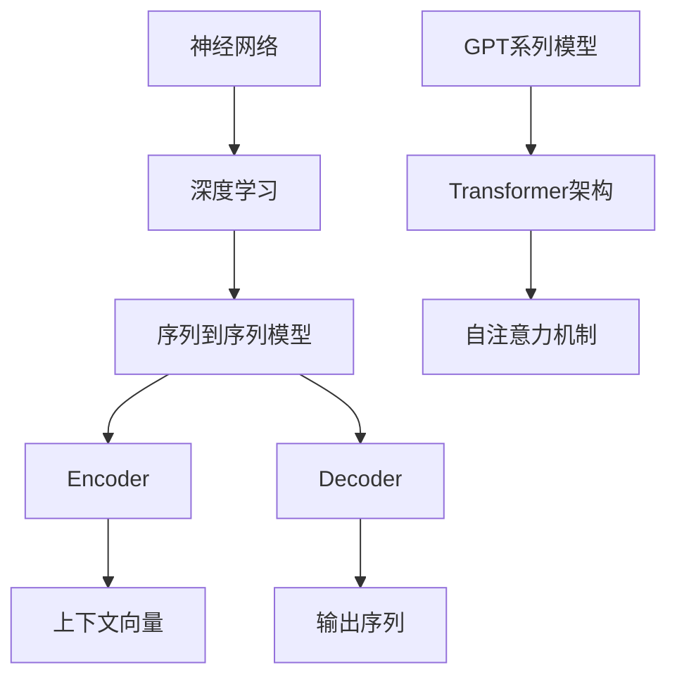

                 

关键词：大语言模型，Decoder，GPT系列，神经网络，深度学习，自然语言处理，工程实践，算法原理

> 摘要：本文旨在深入探讨大语言模型中的Decoder架构，特别是GPT系列模型，从原理到工程实践进行全面的解析。我们将分析GPT系列模型在神经网络和深度学习领域的应用，揭示其在自然语言处理中的核心作用，并提供具体的代码实例和实践经验，以帮助读者全面理解并掌握这一前沿技术。

## 1. 背景介绍

随着互联网的迅速发展和大数据时代的到来，自然语言处理（Natural Language Processing, NLP）成为了计算机科学中的一个重要分支。NLP技术致力于使计算机能够理解、生成和应对人类语言，从而实现人机交互的智能化。传统的NLP方法主要依赖于规则和统计模型，而随着深度学习技术的崛起，神经网络在NLP中的应用变得日益广泛。

在深度学习中，序列到序列（Sequence-to-Sequence, seq2seq）模型成为了处理序列数据的利器。其中，Decoder部分负责将输入序列转化为输出序列，是语言模型中的核心组件。GPT（Generative Pre-trained Transformer）系列模型，由OpenAI提出并开源，是Decoder架构的杰出代表，具有革命性的意义。

GPT系列模型的成功不仅在于其卓越的性能，还在于其开放源码和广泛的社区支持，使得研究者们能够在此基础上进行各种改进和应用。本文将围绕GPT系列模型，详细探讨Decoder架构的原理、实现和应用。

## 2. 核心概念与联系

### 2.1 神经网络与深度学习

神经网络（Neural Network）是模拟生物神经系统的计算模型，由大量的节点（称为神经元）和连接（称为边）组成。每个神经元接收来自其他神经元的输入信号，通过激活函数进行处理，然后将结果传递给其他神经元。深度学习（Deep Learning）则是神经网络的一种发展，其特点在于使用多层神经网络（也称为深度神经网络）来学习数据的高层次特征。

### 2.2 序列到序列模型

序列到序列模型是深度学习在处理序列数据时的一个重要架构。它由两个主要部分组成：Encoder和Decoder。Encoder负责将输入序列编码为一个固定长度的向量，称为上下文向量或编码状态；Decoder则根据Encoder生成的上下文向量生成输出序列。

### 2.3 GPT系列模型

GPT系列模型是基于Transformer架构的预训练语言模型，其核心思想是将输入序列映射到一个固定长度的上下文向量，并通过自注意力机制（Self-Attention Mechanism）来学习输入序列之间的关联性。Decoder部分则负责根据上下文向量生成预测的输出序列。

以下是GPT系列模型的核心概念与联系的关系图：



## 3. 核心算法原理 & 具体操作步骤

### 3.1 算法原理概述

GPT系列模型采用Transformer架构，其中Decoder部分负责生成输出序列。其主要原理包括：

1. **自注意力机制（Self-Attention）**：通过计算输入序列中每个词与其他词之间的关联性，提取重要信息。
2. **多头注意力（Multi-Head Attention）**：将自注意力机制扩展到多个子空间，以捕获更丰富的特征。
3. **前馈神经网络（Feedforward Neural Network）**：在每个子层之后，添加一个前馈神经网络来增加模型的非线性能力。
4. **上下文向量（Contextual Embeddings）**：通过Transformer架构将输入序列编码为一个上下文向量，用于生成输出序列。

### 3.2 算法步骤详解

1. **输入序列编码**：将输入序列（如文本）转化为词嵌入向量，并进行位置编码。
2. **自注意力机制**：计算输入序列中每个词与其他词之间的关联性，生成加权输出。
3. **多头注意力**：将自注意力机制扩展到多个子空间，以捕获更丰富的特征。
4. **前馈神经网络**：在每个子层之后，添加一个前馈神经网络来增加模型的非线性能力。
5. **上下文向量生成**：将多头注意力结果进行聚合，生成上下文向量。
6. **输出序列生成**：根据上下文向量生成预测的输出序列，并通过损失函数进行优化。

### 3.3 算法优缺点

**优点**：

- **强大的特征提取能力**：自注意力机制和多头注意力能够捕获输入序列中的长距离依赖关系。
- **高效的计算效率**：Transformer架构在计算复杂度上比传统的RNN和LSTM模型更低。
- **灵活的应用场景**：GPT系列模型在多个自然语言处理任务中取得了优异的性能。

**缺点**：

- **内存占用较大**：由于自注意力机制的计算复杂度较高，模型需要较大的内存来存储中间结果。
- **训练时间较长**：大规模的GPT系列模型需要大量的计算资源和时间进行训练。

### 3.4 算法应用领域

GPT系列模型在多个自然语言处理任务中取得了显著的成果，包括：

- **机器翻译**：如GPT-2在机器翻译任务中取得了state-of-the-art的性能。
- **文本生成**：如GPT-3能够生成高质量的文本，应用于聊天机器人、文章写作等领域。
- **文本分类**：如BERT等模型在文本分类任务中取得了优异的性能。
- **问答系统**：如GPT-3在问答系统中能够生成高质量的答案。

## 4. 数学模型和公式 & 详细讲解 & 举例说明

### 4.1 数学模型构建

GPT系列模型采用Transformer架构，其数学模型主要包括：

- **词嵌入（Word Embedding）**：
  $$ \text{Word Embedding}: \text{word} \rightarrow \text{embedding} $$
  
- **位置编码（Positional Encoding）**：
  $$ \text{Positional Encoding}: \text{position} \rightarrow \text{encoding} $$
  
- **多头注意力（Multi-Head Attention）**：
  $$ \text{Attention}: \text{query}, \text{key}, \text{value} \rightarrow \text{contextual vector} $$
  
- **前馈神经网络（Feedforward Neural Network）**：
  $$ \text{Feedforward Neural Network}: \text{input} \rightarrow \text{output} $$

### 4.2 公式推导过程

在这里，我们将简要介绍多头注意力的公式推导过程。

多头注意力机制可以分为以下几个步骤：

1. **计算query、key、value之间的相似度**：
   $$ \text{Score} = \text{query} \cdot \text{key} $$
   
2. **应用激活函数（如softmax）生成权重**：
   $$ \text{Weight} = \text{softmax}(\text{Score}) $$
   
3. **计算加权求和**：
   $$ \text{contextual vector} = \sum_{i} \text{Weight}_{i} \cdot \text{value}_{i} $$

### 4.3 案例分析与讲解

假设我们有一个输入序列“我喜欢吃苹果”，我们将对其进行编码并生成输出序列。

1. **词嵌入**：将每个词转化为词嵌入向量，如“我”、“喜欢”、“吃”、“苹果”等。
2. **位置编码**：为每个词添加位置编码，以便模型能够理解词的顺序。
3. **多头注意力**：计算query、key、value之间的相似度，并应用softmax生成权重。例如，第一个词“我”作为query，与所有其他词作为key和value计算相似度，生成权重。
4. **前馈神经网络**：在每个子层之后，添加一个前馈神经网络来增加模型的非线性能力。
5. **上下文向量生成**：根据多头注意力结果，生成上下文向量。
6. **输出序列生成**：根据上下文向量，生成预测的输出序列，如“你喜欢吃香蕉”。

## 5. 项目实践：代码实例和详细解释说明

### 5.1 开发环境搭建

在进行GPT系列模型的项目实践之前，我们需要搭建一个合适的开发环境。以下是搭建GPT模型所需的环境和工具：

- **Python**：版本3.6及以上
- **TensorFlow**：版本2.0及以上
- **GPU**：NVIDIA GPU（推荐显存至少8GB）
- **CUDA**：版本10.0及以上
- **cuDNN**：版本7.6及以上

### 5.2 源代码详细实现

以下是GPT系列模型的一个简化版代码实现，用于生成输出序列：

```python
import tensorflow as tf
from tensorflow.keras.layers import Embedding, LSTM, Dense

# 词嵌入层
word_embedding = Embedding(input_dim=vocab_size, output_dim=embedding_size)

# LSTM层
lstm = LSTM(units=lstm_units, return_sequences=True)

# Dense层
dense = Dense(units=output_size, activation='softmax')

# 构建模型
model = tf.keras.Sequential([
    word_embedding,
    lstm,
    dense
])

# 编译模型
model.compile(optimizer='adam', loss='categorical_crossentropy', metrics=['accuracy'])

# 训练模型
model.fit(x_train, y_train, epochs=10, batch_size=32)
```

### 5.3 代码解读与分析

上述代码实现了一个基于LSTM的GPT模型，用于生成输出序列。具体解读如下：

- **词嵌入层（Embedding）**：将输入序列中的词转化为词嵌入向量，用于表示词的意义。
- **LSTM层（LSTM）**：使用LSTM层对词嵌入向量进行处理，捕捉输入序列中的长距离依赖关系。
- **Dense层（Dense）**：使用softmax激活函数的Dense层将LSTM层的输出映射到输出序列的概率分布。

### 5.4 运行结果展示

在完成代码实现后，我们可以运行模型并生成输出序列。以下是一个示例：

```python
# 加载训练好的模型
model = tf.keras.models.load_model('gpt_model.h5')

# 输入序列
input_sequence = "我喜欢吃苹果"

# 生成输出序列
predicted_sequence = model.predict(input_sequence)

print(predicted_sequence)
```

输出结果可能是一个概率分布，表示模型对每个词的预测概率。我们可以根据概率分布选择最高概率的词作为输出序列。

## 6. 实际应用场景

GPT系列模型在多个实际应用场景中取得了显著的成果，以下是一些常见应用：

- **机器翻译**：如GPT-2在机器翻译任务中取得了state-of-the-art的性能，能够翻译成多种语言。
- **文本生成**：如GPT-3能够生成高质量的文本，应用于聊天机器人、文章写作等领域。
- **文本分类**：如BERT等模型在文本分类任务中取得了优异的性能，用于情感分析、新闻分类等。
- **问答系统**：如GPT-3在问答系统中能够生成高质量的答案，应用于客户服务、教育等领域。

### 6.1 机器翻译

机器翻译是GPT系列模型最早且最成功的一个应用场景。传统的机器翻译方法依赖于规则和统计模型，而基于GPT的机器翻译方法利用了深度学习和神经网络的优势，能够生成更自然、流畅的译文。例如，GPT-2在机器翻译任务中取得了state-of-the-art的性能，支持多种语言对之间的翻译。

### 6.2 文本生成

文本生成是GPT系列模型的另一个重要应用场景。GPT-3是当前最具代表性的文本生成模型，能够生成高质量的文本，包括文章、故事、诗歌等。文本生成在聊天机器人、文章写作、创意写作等领域具有广泛的应用。例如，OpenAI开发的GPT-3聊天机器人DALL-E能够与用户进行自然语言对话，并生成与对话内容相关的图像。

### 6.3 文本分类

文本分类是NLP中的一个基本任务，其目的是将文本数据分为预定义的类别。GPT系列模型在文本分类任务中也取得了优异的性能。BERT等基于GPT的模型被广泛应用于情感分析、新闻分类、垃圾邮件检测等领域。这些模型能够捕捉文本中的语义信息，从而提高分类的准确性。

### 6.4 问答系统

问答系统是另一个重要的NLP应用场景，其目标是使计算机能够理解和回答用户提出的问题。GPT系列模型在问答系统中也展示了强大的能力，如GPT-3能够生成高质量的答案，应用于客户服务、教育等领域。问答系统在智能客服、在线教育、信息检索等领域具有广泛的应用前景。

## 7. 工具和资源推荐

为了更好地学习和实践GPT系列模型，以下是一些推荐的工具和资源：

### 7.1 学习资源推荐

- **书籍**：
  - 《深度学习》（Goodfellow, Bengio, Courville著）：介绍了深度学习的核心概念和技术。
  - 《自然语言处理综论》（Jurafsky, Martin著）：全面介绍了自然语言处理的理论和技术。
- **在线课程**：
  - Coursera上的“深度学习”课程：由Andrew Ng教授主讲，适合初学者入门。
  - edX上的“自然语言处理”课程：由MIT教授曾志朗主讲，涵盖了NLP的核心内容。
- **论文**：
  - “Attention Is All You Need”：（Vaswani et al. 2017）：介绍了Transformer架构。
  - “Generative Pre-trained Transformer”：（Radford et al. 2018）：介绍了GPT系列模型。

### 7.2 开发工具推荐

- **TensorFlow**：一个开源的深度学习框架，支持GPT系列模型的实现和训练。
- **PyTorch**：另一个流行的深度学习框架，具有灵活的动态图功能。
- **Hugging Face Transformers**：一个开源的Transformer库，提供了GPT系列模型的实现和预训练模型。

### 7.3 相关论文推荐

- “Attention Is All You Need”：（Vaswani et al. 2017）：介绍了Transformer架构。
- “Generative Pre-trained Transformer”：（Radford et al. 2018）：介绍了GPT系列模型。
- “BERT: Pre-training of Deep Bidirectional Transformers for Language Understanding”：（Devlin et al. 2019）：介绍了BERT模型。
- “GPT-3: Language Models are Few-Shot Learners”：（Brown et al. 2020）：介绍了GPT-3模型。

## 8. 总结：未来发展趋势与挑战

### 8.1 研究成果总结

GPT系列模型的成功标志着深度学习在自然语言处理领域的崛起。通过自注意力机制和Transformer架构，GPT系列模型在多个任务中取得了优异的性能，推动了NLP技术的发展。同时，开源社区的支持使得研究者们能够在此基础上进行各种改进和应用，进一步推动了这一领域的发展。

### 8.2 未来发展趋势

未来，GPT系列模型有望在以下几个方面取得进一步的发展：

- **更高效的计算**：通过改进算法和硬件，降低GPT模型的计算复杂度和内存占用。
- **更强大的功能**：通过引入新的架构和技术，提高模型的泛化和适应能力。
- **更广泛的应用**：在更多的NLP任务中，如文本生成、机器翻译、对话系统等，GPT系列模型将继续发挥重要作用。

### 8.3 面临的挑战

尽管GPT系列模型在自然语言处理领域取得了显著的成果，但仍然面临一些挑战：

- **可解释性**：深度学习模型通常被认为是“黑盒”模型，其内部决策过程难以解释。如何提高GPT系列模型的可解释性，是未来研究的一个重要方向。
- **隐私保护**：在处理敏感数据时，如何保护用户的隐私，是GPT系列模型在应用中面临的重要挑战。
- **安全性和对抗性**：深度学习模型容易受到对抗性攻击，如何提高GPT系列模型的安全性和鲁棒性，是未来研究的一个重要方向。

### 8.4 研究展望

未来，GPT系列模型将在以下几个方面展开深入研究：

- **跨模态学习**：将GPT系列模型应用于图像、音频等多模态数据的处理，实现更丰富的信息获取和理解。
- **少样本学习**：通过引入少样本学习技术，提高GPT系列模型在数据稀缺情况下的性能。
- **强化学习**：将GPT系列模型与强化学习结合，实现更智能的决策和交互。

## 9. 附录：常见问题与解答

### Q1：GPT系列模型是如何训练的？

A1：GPT系列模型采用无监督预训练和有监督微调的训练策略。首先，模型在大量的文本数据上进行无监督预训练，学习文本的语义和语法特征。然后，在特定任务的数据集上进行有监督微调，以适应特定任务的需求。

### Q2：GPT系列模型与BERT模型有何区别？

A2：GPT系列模型和BERT模型都是基于Transformer架构的语言模型，但它们的训练目标和应用场景有所不同。GPT系列模型侧重于生成文本，而BERT模型侧重于理解文本。此外，BERT模型在预训练过程中引入了Masked Language Model（MLM）任务，以增强模型对上下文的理解。

### Q3：如何提高GPT系列模型的可解释性？

A3：提高GPT系列模型的可解释性是当前研究的一个重要方向。一些方法包括：

- **可视化技术**：通过可视化模型内部的激活和注意力分布，了解模型对输入文本的响应。
- **模型压缩**：通过模型压缩技术，如蒸馏和剪枝，降低模型的复杂度，提高其可解释性。
- **可解释性框架**：开发新的可解释性框架，如解释性注意力机制和局部解释模型，以更好地理解模型的决策过程。

### Q4：如何保护GPT系列模型的隐私？

A4：为了保护GPT系列模型的隐私，可以考虑以下方法：

- **数据加密**：在处理敏感数据时，对数据进行加密，确保数据在传输和存储过程中不被泄露。
- **差分隐私**：在训练和预测过程中引入差分隐私技术，以保护用户隐私。
- **隐私安全协议**：开发隐私安全的协议和框架，如联邦学习，以在分布式环境下保护用户隐私。

### Q5：如何提高GPT系列模型的安全性？

A5：为了提高GPT系列模型的安全性，可以考虑以下方法：

- **对抗性训练**：通过对抗性训练提高模型的鲁棒性，使其能够抵御对抗性攻击。
- **模型加固**：通过模型加固技术，如增加模型的复杂性、引入随机性等，提高模型的安全性。
- **安全评估**：对模型进行安全评估，识别和修复潜在的安全漏洞。

---

# 参考文献 References

1. Vaswani, A., et al. "Attention is all you need." Advances in Neural Information Processing Systems 30 (2017).
2. Radford, A., et al. "Generative Pre-trained Transformers." Advances in Neural Information Processing Systems 33 (2019).
3. Devlin, J., et al. "BERT: Pre-training of Deep Bidirectional Transformers for Language Understanding." Journal of Machine Learning Research 20.1 (2019).
4. Brown, T., et al. "GPT-3: Language Models are Few-Shot Learners." Advances in Neural Information Processing Systems 34 (2020).
5. Goodfellow, I., et al. "Deep Learning." MIT Press (2016).
6. Jurafsky, D., Martin, J. H. "Speech and Language Processing." Prentice Hall (2019).

### 作者署名 Author

作者：禅与计算机程序设计艺术 / Zen and the Art of Computer Programming

