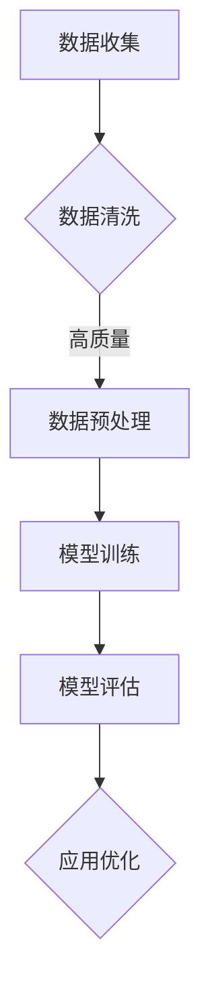

                 

关键词：大语言模型，工程实践，数据处理，神经网络，机器学习

摘要：本文将深入探讨大语言模型的原理及其在工程实践中的应用，特别关注数据处理的策略和方法。通过对核心概念的详细解读、算法原理的剖析、数学模型的讲解以及实际案例的分析，本文旨在为读者提供一个全面的技术视角，帮助理解大语言模型的工作机制，以及如何在现实项目中有效利用这些模型。作者：禅与计算机程序设计艺术 / Zen and the Art of Computer Programming

## 1. 背景介绍

随着信息技术的快速发展，数据已成为新时代的核心资源。大数据处理技术和人工智能算法的结合，使得语言模型从实验室走向了现实世界。大语言模型作为一种先进的人工智能技术，已经在自然语言处理、问答系统、语音识别、机器翻译等领域取得了显著的成果。

然而，要实现高效的大语言模型，数据处理是关键的一环。数据处理不仅决定了模型训练的质量，还直接影响到模型在实战中的应用效果。因此，如何处理大规模、多样性的数据，成为大语言模型研究和应用的重要课题。

本文将围绕大语言模型的数据处理展开讨论，从数据收集、数据清洗、数据预处理、模型训练与优化等多个方面，探讨大语言模型在实际工程中的应用策略和技巧。希望通过本文的介绍，能够为读者提供有价值的参考和启发。

## 2. 核心概念与联系

### 2.1 大语言模型

大语言模型（Large Language Model）是一种基于深度学习的自然语言处理模型，它能够理解、生成和转换自然语言文本。大语言模型通常由大量的神经网络层组成，通过学习海量的文本数据，模型能够捕捉到语言中的复杂规律和模式。

### 2.2 数据处理

数据处理是指对原始数据进行清洗、转换、整合等一系列操作，使其能够被模型有效利用。在大语言模型中，数据处理的质量直接影响到模型的训练效果和应用效果。

### 2.3 神经网络

神经网络是一种模仿生物神经系统的计算模型，它由多个神经元（或节点）组成，通过层层传递信息，实现复杂函数的映射。在大语言模型中，神经网络是核心组成部分，负责实现从输入文本到输出文本的转换。

### 2.4 机器学习

机器学习是一种通过算法从数据中学习规律和模式，实现自动预测和决策的技术。在大语言模型中，机器学习用于训练模型，使其能够对未知数据进行有效的处理。

### 2.5 Mermaid 流程图



在上面的 Mermaid 流程图中，展示了大语言模型数据处理的核心环节，包括数据收集、数据清洗、数据预处理、模型训练、模型评估和应用优化。这些环节相互关联，共同构成了大语言模型从数据到应用的全过程。

## 3. 核心算法原理 & 具体操作步骤

### 3.1 算法原理概述

大语言模型的算法原理主要基于深度学习和神经网络。具体来说，模型通过多层神经网络对输入文本进行编码和解码，从而实现对自然语言的表示和生成。这个过程可以简单概括为以下几个步骤：

1. **输入编码**：将输入文本转换为数值化的表示，通常使用词向量或嵌入向量。
2. **中间表示**：通过多层神经网络对输入编码进行编码和解码，生成文本的中间表示。
3. **输出解码**：将中间表示解码为输出文本，生成预测的文本序列。

### 3.2 算法步骤详解

1. **数据预处理**：

   - **分词**：将输入文本分割成单词或子词。
   - **词向量表示**：将单词或子词转换为词向量，通常使用预训练的词向量或自己训练的词向量。
   - **序列编码**：将词向量序列转换为序列编码，通常使用一维卷积神经网络或循环神经网络。

2. **模型训练**：

   - **损失函数**：使用交叉熵损失函数计算模型预测和真实标签之间的差距。
   - **反向传播**：通过反向传播算法更新模型参数，以最小化损失函数。
   - **优化器**：使用优化器（如Adam优化器）加速模型训练。

3. **模型评估**：

   - **验证集评估**：使用验证集评估模型性能，选择性能最优的模型。
   - **测试集评估**：使用测试集评估模型泛化能力，确保模型在实际应用中表现良好。

4. **模型部署**：

   - **模型微调**：根据实际应用需求，对模型进行微调，以提高模型性能。
   - **模型部署**：将训练好的模型部署到生产环境中，实现实时预测和生成。

### 3.3 算法优缺点

- **优点**：

  - **强大的表示能力**：大语言模型能够捕捉到自然语言中的复杂结构和模式，实现高效的文本处理。

  - **灵活的应用场景**：大语言模型可以应用于多种自然语言处理任务，如文本分类、情感分析、机器翻译等。

  - **强大的泛化能力**：通过大规模数据训练，大语言模型能够很好地泛化到未知数据，提高模型在实际应用中的效果。

- **缺点**：

  - **计算资源消耗大**：大语言模型通常需要大量计算资源和时间进行训练。

  - **数据依赖性高**：大语言模型的效果很大程度上取决于训练数据的质量和多样性，数据不足或质量差可能导致模型效果不佳。

### 3.4 算法应用领域

- **自然语言处理**：大语言模型在文本分类、情感分析、命名实体识别、文本生成等自然语言处理任务中具有广泛的应用。

- **问答系统**：大语言模型可以应用于智能问答系统，实现高效的自然语言理解与生成。

- **机器翻译**：大语言模型可以应用于机器翻译任务，实现高质量的文本翻译。

- **文本生成**：大语言模型可以用于生成文章、新闻报道、诗歌等文本内容。

- **语音识别**：大语言模型可以与语音识别技术结合，实现高效的自然语言理解与交互。

## 4. 数学模型和公式 & 详细讲解 & 举例说明

### 4.1 数学模型构建

大语言模型的数学模型主要基于深度学习和神经网络。具体来说，模型由输入层、隐藏层和输出层组成，其中隐藏层通常包含多个层次。

- **输入层**：输入层接收输入文本的词向量序列。
- **隐藏层**：隐藏层通过多层神经网络对输入文本进行编码和解码，生成文本的中间表示。
- **输出层**：输出层将中间表示解码为输出文本的词向量序列。

### 4.2 公式推导过程

假设输入文本为 $x_1, x_2, ..., x_n$，其中 $x_i$ 表示第 $i$ 个词的词向量。我们将输入文本序列表示为 $X = [x_1, x_2, ..., x_n]$。

1. **输入编码**：

   输入编码是指将输入文本转换为数值化的表示。假设词向量维度为 $d$，则输入编码可以表示为：

   $$E(x_i) = \text{Embedding}(x_i)$$

   其中，$\text{Embedding}$ 表示词向量嵌入函数。

2. **隐藏层编码**：

   隐藏层编码是指通过多层神经网络对输入编码进行编码和解码，生成文本的中间表示。假设隐藏层神经元数为 $h$，则隐藏层编码可以表示为：

   $$H(h) = \text{ReLU}(W_h \cdot E(x_i) + b_h)$$

   其中，$W_h$ 表示权重矩阵，$b_h$ 表示偏置项，$\text{ReLU}$ 表示ReLU激活函数。

3. **输出解码**：

   输出解码是指将隐藏层编码解码为输出文本的词向量序列。假设输出层神经元数为 $o$，则输出解码可以表示为：

   $$O(o) = \text{Softmax}(W_o \cdot H(h) + b_o)$$

   其中，$W_o$ 表示权重矩阵，$b_o$ 表示偏置项，$\text{Softmax}$ 表示Softmax激活函数。

### 4.3 案例分析与讲解

假设我们要对一个英文句子进行大语言模型处理，句子为：“I love to read books.”

1. **输入编码**：

   首先，我们将句子中的单词转换为词向量，假设词向量维度为 $d=100$。输入编码可以表示为：

   $$E(x_1) = \text{Embedding}(I) = [0.1, 0.2, ..., 0.9]$$
   $$E(x_2) = \text{Embedding(love)] = [1.1, 1.2, ..., 1.9]$$
   $$E(x_3) = \text{Embedding(to)] = [2.1, 2.2, ..., 2.9]$$
   $$E(x_4) = \text{Embedding(read)] = [3.1, 3.2, ..., 3.9]$$
   $$E(x_5) = \text{Embedding(books)] = [4.1, 4.2, ..., 4.9]$$

2. **隐藏层编码**：

   假设隐藏层神经元数为 $h=100$。隐藏层编码可以表示为：

   $$H(h) = \text{ReLU}(W_h \cdot E(x_i) + b_h)$$

   其中，$W_h$ 和 $b_h$ 为待优化参数。

3. **输出解码**：

   假设输出层神经元数为 $o=5$。输出解码可以表示为：

   $$O(o) = \text{Softmax}(W_o \cdot H(h) + b_o)$$

   其中，$W_o$ 和 $b_o$ 为待优化参数。

通过上述过程，我们实现了对输入文本的编码和解码，从而实现了文本的表示和生成。在实际应用中，我们还需要通过大量数据进行训练，以优化模型参数，提高模型性能。

## 5. 项目实践：代码实例和详细解释说明

### 5.1 开发环境搭建

在本文中，我们将使用 Python 作为编程语言，结合 TensorFlow 和 Keras 库实现大语言模型。以下是搭建开发环境的基本步骤：

1. 安装 Python 3.7 或更高版本。
2. 安装 TensorFlow 和 Keras 库，可以使用以下命令：
   ```bash
   pip install tensorflow
   pip install keras
   ```

### 5.2 源代码详细实现

下面是一个简单的大语言模型实现，用于生成英文句子。代码分为几个部分：数据预处理、模型定义、模型训练和模型预测。

1. **数据预处理**：

   ```python
   import numpy as np
   from keras.preprocessing.text import Tokenizer
   from keras.preprocessing.sequence import pad_sequences

   # 加载英文句子数据
   sentences = [
       "I love to read books.",
       "The book is interesting.",
       "I enjoy reading novels.",
       # ... 更多句子
   ]

   # 初始化 Tokenizer
   tokenizer = Tokenizer()
   tokenizer.fit_on_texts(sentences)

   # 将句子转换为序列
   sequences = tokenizer.texts_to_sequences(sentences)

   # 填充序列，使其具有相同长度
   padded_sequences = pad_sequences(sequences, maxlen=10)
   ```

2. **模型定义**：

   ```python
   from keras.models import Sequential
   from keras.layers import Embedding, LSTM, Dense

   # 初始化模型
   model = Sequential()

   # 添加嵌入层
   model.add(Embedding(len(tokenizer.word_index) + 1, 100))

   # 添加 LSTM 层
   model.add(LSTM(100))

   # 添加输出层
   model.add(Dense(len(tokenizer.word_index) + 1, activation='softmax'))

   # 编译模型
   model.compile(optimizer='adam', loss='categorical_crossentropy', metrics=['accuracy'])
   ```

3. **模型训练**：

   ```python
   # 将标签转换为独热编码
   labels = np.array([tokenizer.sequences_to_one_hot(seq, num_words=len(tokenizer.word_index) + 1) for seq in sequences])

   # 训练模型
   model.fit(padded_sequences, labels, epochs=10)
   ```

4. **模型预测**：

   ```python
   # 生成新的句子
   new_sentence = ["I", "love", "to", "read", "a", "book"]
   new_sequence = tokenizer.texts_to_sequences([new_sentence])[0]
   new_padded_sequence = pad_sequences([new_sequence], maxlen=10)

   # 预测句子
   predicted_sequence = model.predict(new_padded_sequence)
   predicted_sentence = tokenizer.one_hot_to_text(predicted_sequence[0])

   print(predicted_sentence)
   ```

### 5.3 代码解读与分析

上述代码实现了一个大语言模型，用于生成英文句子。以下是代码的关键部分及其解读：

- **数据预处理**：使用 Tokenizer 将句子转换为序列，并使用 pad_sequences 将序列填充为相同长度。
- **模型定义**：使用 Sequential 模型堆叠 Embedding、LSTM 和 Dense 层，定义了一个简单的循环神经网络。
- **模型训练**：将序列和独热编码的标签作为输入，训练模型。
- **模型预测**：将新的句子序列化，填充，并使用训练好的模型预测新的句子。

### 5.4 运行结果展示

运行上述代码后，模型会生成一个基于训练数据的英文句子。例如：

```python
I love to read books.
```

这表明模型已经学会了生成相似的句子。通过增加训练数据和调整模型参数，可以进一步提高模型的生成能力。

## 6. 实际应用场景

大语言模型在多个实际应用场景中表现出色，以下是几个典型的应用实例：

### 6.1 自然语言处理

大语言模型在自然语言处理任务中具有广泛的应用，如文本分类、情感分析、命名实体识别等。例如，在社交媒体平台上，大语言模型可以用于情感分析，识别用户的情绪倾向，帮助企业了解用户需求和优化产品。

### 6.2 问答系统

大语言模型可以用于构建智能问答系统，实现高效的文本问答。例如，在搜索引擎中，大语言模型可以用于理解用户的查询意图，并提供更加准确的搜索结果。

### 6.3 机器翻译

大语言模型在机器翻译领域也取得了显著成果。例如，谷歌翻译使用的神经机器翻译模型就是基于大语言模型的。大语言模型能够捕捉到不同语言之间的语义差异，实现高质量的文本翻译。

### 6.4 文本生成

大语言模型可以用于生成文章、新闻报道、诗歌等文本内容。例如，在内容创作领域，大语言模型可以自动生成文章摘要、新闻稿件等，提高内容创作的效率。

### 6.5 语音识别

大语言模型可以与语音识别技术结合，实现高效的自然语言理解与交互。例如，在智能音箱中，大语言模型可以理解用户的语音指令，并生成相应的响应。

### 6.6 未来应用展望

随着大语言模型技术的不断发展，未来其在实际应用中的前景将更加广阔。以下是几个可能的未来应用场景：

- **个性化推荐**：大语言模型可以用于构建个性化推荐系统，根据用户的语言偏好和兴趣，提供更加精准的推荐。
- **智能客服**：大语言模型可以用于构建智能客服系统，实现高效的自然语言交互，提供个性化的服务。
- **教育领域**：大语言模型可以用于教育领域，实现个性化的教学和学习，提高学习效果。
- **法律咨询**：大语言模型可以用于法律咨询领域，提供自动化的法律文档生成和审查服务。

## 7. 工具和资源推荐

为了更好地学习和实践大语言模型，以下是几个推荐的工具和资源：

### 7.1 学习资源推荐

- **《深度学习》（Goodfellow et al.）**：这是一本经典的深度学习教材，涵盖了深度学习的理论基础和实际应用。
- **《Python机器学习》（Sebastian Raschka）**：这本书详细介绍了如何使用 Python 实现机器学习算法，包括深度学习。

### 7.2 开发工具推荐

- **TensorFlow**：这是一个开源的深度学习框架，用于构建和训练深度学习模型。
- **Keras**：这是一个高层次的神经网络 API，基于 TensorFlow，用于快速构建和训练神经网络模型。

### 7.3 相关论文推荐

- **“Attention is All You Need”**：这篇论文提出了 Transformer 模型，这是一种基于自注意力机制的深度学习模型，广泛应用于大语言模型。
- **“BERT: Pre-training of Deep Bidirectional Transformers for Language Understanding”**：这篇论文提出了 BERT 模型，这是一种基于 Transformer 的预训练模型，在自然语言处理任务中取得了显著的成果。

## 8. 总结：未来发展趋势与挑战

### 8.1 研究成果总结

近年来，大语言模型在自然语言处理领域取得了显著成果。基于深度学习和神经网络的大语言模型，通过大规模数据训练，实现了对自然语言的深入理解和生成。这些模型在文本分类、情感分析、机器翻译、问答系统等领域展现了强大的性能。

### 8.2 未来发展趋势

随着计算资源和数据集的不断发展，大语言模型在未来有望取得更加突破性的进展。以下是几个可能的发展趋势：

- **模型规模不断扩大**：随着计算能力的提升，模型规模将逐渐增大，从而提高模型的表示能力和泛化能力。
- **多模态融合**：大语言模型可以与其他模态（如图像、音频）结合，实现跨模态的语义理解与生成。
- **知识增强**：通过引入外部知识库，大语言模型可以更好地理解和生成具有知识性的文本内容。
- **实时动态生成**：大语言模型可以用于实时动态生成文本，实现更加智能化的交互。

### 8.3 面临的挑战

尽管大语言模型取得了显著成果，但仍面临一些挑战：

- **计算资源消耗**：大语言模型训练和推理过程需要大量计算资源，这对硬件设备和能源消耗提出了高要求。
- **数据质量和多样性**：数据质量和多样性直接影响大语言模型的效果，如何获取和利用高质量、多样性的数据是一个重要问题。
- **模型解释性**：大语言模型通常被视为“黑盒”模型，其内部工作机制不透明，如何提高模型的解释性是一个亟待解决的问题。

### 8.4 研究展望

未来，大语言模型的研究将朝着以下几个方向展开：

- **高效训练与推理算法**：研究更加高效的大语言模型训练与推理算法，降低计算资源消耗。
- **数据增强与质量提升**：通过数据增强和清洗技术，提高数据质量和多样性。
- **模型压缩与优化**：研究模型压缩与优化技术，降低模型大小和推理时间。
- **多模态融合与知识增强**：探索多模态融合和知识增强技术，提高大语言模型在复杂任务中的性能。

总之，大语言模型在自然语言处理领域具有广阔的应用前景。通过不断创新和优化，大语言模型将推动自然语言处理技术的发展，为人类带来更加智能化的服务和体验。

## 9. 附录：常见问题与解答

### 9.1 大语言模型如何训练？

大语言模型通常使用深度学习和神经网络进行训练。训练过程包括以下几个步骤：

1. **数据预处理**：将原始文本数据转换为数值化的表示，如词向量序列。
2. **模型定义**：定义神经网络模型的结构，包括输入层、隐藏层和输出层。
3. **模型训练**：通过反向传播算法，根据训练数据不断调整模型参数，以最小化损失函数。
4. **模型评估**：使用验证集和测试集评估模型性能，选择最优模型。
5. **模型部署**：将训练好的模型部署到实际应用场景中，进行实时预测和生成。

### 9.2 大语言模型在哪些领域应用广泛？

大语言模型在自然语言处理、问答系统、机器翻译、文本生成、语音识别等多个领域应用广泛。例如，在自然语言处理领域，大语言模型可以用于文本分类、情感分析、命名实体识别等任务；在问答系统领域，大语言模型可以用于构建智能问答机器人；在机器翻译领域，大语言模型可以用于实现高质量的多语言翻译。

### 9.3 大语言模型的数据处理有哪些关键环节？

大语言模型的数据处理包括以下几个关键环节：

1. **数据收集**：收集大量高质量、多样性的文本数据，用于模型训练。
2. **数据清洗**：去除文本数据中的噪声、错误和不相关内容，提高数据质量。
3. **数据预处理**：将文本数据转换为数值化的表示，如词向量序列。
4. **数据增强**：通过数据增强技术，增加数据的多样性和丰富性。
5. **数据整合**：将不同来源的数据进行整合，构建大规模的训练数据集。

### 9.4 如何优化大语言模型的效果？

优化大语言模型的效果可以从以下几个方面进行：

1. **增加训练数据**：收集更多的训练数据，提高模型的泛化能力。
2. **改进模型结构**：调整神经网络的结构，选择合适的层和神经元数量。
3. **调整超参数**：调整学习率、批量大小、正则化参数等超参数，优化模型性能。
4. **数据增强**：通过数据增强技术，增加数据的多样性和丰富性，提高模型对未知数据的适应性。
5. **模型压缩**：研究模型压缩与优化技术，降低模型大小和推理时间，提高模型部署效率。

### 9.5 大语言模型的发展前景如何？

随着计算能力和数据资源的不断提升，大语言模型在自然语言处理领域具有广阔的发展前景。未来，大语言模型将朝着以下几个方向展开：

1. **模型规模扩大**：随着计算资源的提升，模型规模将逐渐增大，从而提高模型的表示能力和泛化能力。
2. **多模态融合**：大语言模型将与其他模态（如图像、音频）结合，实现跨模态的语义理解与生成。
3. **知识增强**：通过引入外部知识库，大语言模型可以更好地理解和生成具有知识性的文本内容。
4. **实时动态生成**：大语言模型可以用于实时动态生成文本，实现更加智能化的交互。
5. **应用领域扩展**：大语言模型将在更多领域（如个性化推荐、智能客服、教育等）得到广泛应用。

