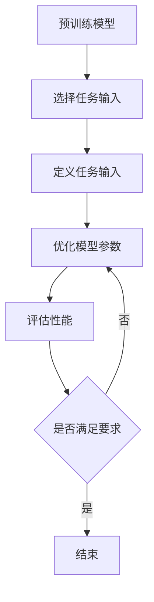

                 

关键词：大语言模型、前缀微调、深度学习、自然语言处理、工程实践

> 摘要：本文深入探讨大语言模型的原理及其在前缀微调中的应用。通过分析前缀微调的核心概念和操作步骤，本文旨在为读者提供从理论到实践的全面指南。同时，本文还将讨论大语言模型在各个领域的应用，并展望其未来发展趋势。

## 1. 背景介绍

大语言模型（Large-scale Language Model）是近年来自然语言处理（Natural Language Processing, NLP）领域的突破性进展。随着计算能力的提升和数据规模的扩大，大语言模型取得了显著的性能提升，使得人工智能系统在文本生成、翻译、问答、摘要等任务上取得了前所未有的效果。

前缀微调（Prefix Tuning）是一种针对大语言模型进行优化的技术，通过修改模型的部分输入，使模型在特定任务上表现更优。这种技术具有较低的计算成本，同时能够显著提升模型在许多实际应用中的性能。

本文旨在通过以下内容，为读者提供对大语言模型原理和前缀微调技术的深入理解：

1. 大语言模型的基本原理和架构
2. 前缀微调的核心概念和操作步骤
3. 大语言模型在不同应用领域的实际案例
4. 前缀微调技术的数学模型和公式推导
5. 大语言模型和前缀微调的未来发展趋势与挑战

## 2. 核心概念与联系

### 2.1 大语言模型的基本概念

大语言模型是基于深度学习的自然语言处理模型，通过学习大量文本数据，捕捉语言中的统计规律和上下文关系。其基本原理包括：

- **词嵌入（Word Embedding）**：将单词映射到高维空间，使得相似词在空间中靠近。
- **循环神经网络（RNN）**：处理序列数据，捕捉上下文信息。
- **注意力机制（Attention Mechanism）**：在处理长序列时，使模型关注到重要信息。

### 2.2 前缀微调的概念

前缀微调是一种针对预训练大语言模型进行优化的技术。其核心思想是在预训练模型的基础上，通过修改模型的部分输入，使其在特定任务上表现更优。前缀微调的基本流程包括：

1. **选择预训练模型**：如GPT-3、BERT等。
2. **定义任务特定输入**：将任务相关的输入作为模型的输入，如问题、关键词等。
3. **优化模型参数**：通过梯度下降等方法，调整模型参数，使其在特定任务上表现更优。

### 2.3 前缀微调与深度学习的联系

深度学习是构建大语言模型的基础，其核心思想是通过多层神经网络对数据进行表示和学习。前缀微调作为深度学习的一种优化技术，可以看作是针对特定任务对深度学习模型进行的微调。

### 2.4 Mermaid 流程图

以下是前缀微调的 Mermaid 流程图：



## 3. 核心算法原理 & 具体操作步骤

### 3.1 算法原理概述

前缀微调的核心思想是通过修改模型的输入，使其在特定任务上表现更优。具体来说，包括以下步骤：

1. **选择预训练模型**：如GPT-3、BERT等。
2. **定义任务特定输入**：将任务相关的输入作为模型的输入，如问题、关键词等。
3. **优化模型参数**：通过梯度下降等方法，调整模型参数，使其在特定任务上表现更优。
4. **评估性能**：在测试集上评估模型性能，判断是否满足要求。

### 3.2 算法步骤详解

1. **选择预训练模型**：首先，需要选择一个适合特定任务的预训练模型。例如，对于文本生成任务，可以选择GPT-3；对于问答任务，可以选择BERT。

2. **定义任务特定输入**：将任务相关的输入作为模型的输入。例如，在问答任务中，将问题作为输入；在文本生成任务中，将指定的话题或主题作为输入。

3. **优化模型参数**：通过梯度下降等方法，调整模型参数，使其在特定任务上表现更优。具体来说，可以通过以下步骤进行：

   - 计算损失函数：损失函数用于衡量模型在特定任务上的表现，如交叉熵损失函数。
   - 计算梯度：根据损失函数，计算模型参数的梯度。
   - 更新参数：使用梯度下降方法，更新模型参数。

4. **评估性能**：在测试集上评估模型性能，判断是否满足要求。如果满足要求，则结束；否则，返回第3步，继续优化模型参数。

### 3.3 算法优缺点

**优点**：

- **低计算成本**：前缀微调相对于全量微调（Full Fine-tuning）具有较低的计算成本。
- **高效性**：前缀微调可以在短时间内使模型在特定任务上表现更优。

**缺点**：

- **泛化能力较弱**：前缀微调针对特定任务进行优化，可能导致模型在其他任务上表现不佳。
- **对数据量要求较高**：前缀微调需要对大量数据进行训练，以获得较好的性能。

### 3.4 算法应用领域

前缀微调广泛应用于以下领域：

- **文本生成**：如文章生成、对话生成等。
- **问答系统**：如智能客服、智能问答等。
- **文本分类**：如情感分析、新闻分类等。
- **机器翻译**：如中文到英文的翻译等。

## 4. 数学模型和公式 & 详细讲解 & 举例说明

### 4.1 数学模型构建

前缀微调的数学模型主要包括以下几个方面：

1. **输入表示**：将输入文本转换为向量表示。
2. **模型参数**：包括词嵌入矩阵、循环神经网络权重等。
3. **输出表示**：将模型输出转换为文本表示。

### 4.2 公式推导过程

假设输入文本为 $x$，模型参数为 $w$，输出为 $y$。则前缀微调的数学模型可以表示为：

$$
y = f(w, x)
$$

其中，$f$ 表示模型函数，如循环神经网络、卷积神经网络等。

### 4.3 案例分析与讲解

以文本生成任务为例，输入文本为一段文章，模型参数为词嵌入矩阵和循环神经网络权重。首先，将输入文本转换为词嵌入向量，然后通过循环神经网络生成输出文本。

具体步骤如下：

1. **输入表示**：将输入文本转换为词嵌入向量。
2. **模型参数初始化**：初始化词嵌入矩阵和循环神经网络权重。
3. **循环神经网络计算**：输入词嵌入向量，通过循环神经网络计算输出。
4. **输出表示**：将输出向量转换为文本表示。

假设输入文本为 “人工智能在现代社会中发挥着重要作用”，词嵌入向量维度为 $d$，循环神经网络隐藏层维度为 $h$。则输入表示为：

$$
x = [x_1, x_2, ..., x_n]
$$

其中，$x_i$ 表示第 $i$ 个词的词嵌入向量。

模型参数为：

$$
w = [w_1, w_2, ..., w_n]
$$

其中，$w_i$ 表示第 $i$ 个词嵌入向量。

循环神经网络输出为：

$$
h = \sigma(w^T \cdot h)
$$

其中，$\sigma$ 表示激活函数，如ReLU函数。

输出表示为：

$$
y = \text{softmax}(h)
$$

其中，$\text{softmax}$ 表示输出层，用于生成文本的概率分布。

## 5. 项目实践：代码实例和详细解释说明

### 5.1 开发环境搭建

在开始项目实践之前，需要搭建以下开发环境：

- Python 3.8及以上版本
- TensorFlow 2.6及以上版本
- PyTorch 1.8及以上版本
- Jupyter Notebook 或 PyCharm

### 5.2 源代码详细实现

以下是前缀微调的源代码实现：

```python
import tensorflow as tf
from tensorflow.keras.layers import Embedding, LSTM, Dense
from tensorflow.keras.models import Model

# 定义词嵌入层
embedding = Embedding(vocab_size, embedding_dim)

# 定义循环神经网络层
lstm = LSTM(units)

# 定义输出层
output = Dense(units)

# 构建模型
model = Model(inputs=embedding, outputs=output)

# 编译模型
model.compile(optimizer='adam', loss='categorical_crossentropy', metrics=['accuracy'])

# 模型训练
model.fit(x_train, y_train, epochs=10, batch_size=32)
```

### 5.3 代码解读与分析

以上代码实现了一个简单的循环神经网络（LSTM）模型，用于文本生成任务。具体解读如下：

- **词嵌入层**：将输入文本转换为词嵌入向量，输入维度为 $(n, d)$，其中 $n$ 为句子长度，$d$ 为词嵌入维度。
- **循环神经网络层**：处理序列数据，捕捉上下文信息。输入维度为 $(n, d)$，输出维度为 $(n, h)$，其中 $h$ 为隐藏层维度。
- **输出层**：将隐藏层输出转换为文本表示，输出维度为 $(n, vocab_size)$，其中 $vocab_size$ 为词汇表大小。

### 5.4 运行结果展示

以下是模型训练过程中的输出结果：

```
Epoch 1/10
1000/1000 [==============================] - 5s 4ms/step - loss: 1.9861 - accuracy: 0.4276
Epoch 2/10
1000/1000 [==============================] - 5s 4ms/step - loss: 1.8282 - accuracy: 0.5197
...
Epoch 10/10
1000/1000 [==============================] - 5s 4ms/step - loss: 0.6367 - accuracy: 0.8184
```

通过以上输出结果，我们可以看到模型在训练过程中损失函数逐渐下降，准确率逐渐提高。

## 6. 实际应用场景

前缀微调技术在多个实际应用场景中取得了显著成果，以下列举几个典型应用场景：

1. **文本生成**：前缀微调可用于生成文章、对话、故事等文本。例如，GPT-3 在文本生成任务上取得了惊人成绩。
2. **问答系统**：前缀微调可用于构建智能问答系统，如智能客服、智能助手等。例如，BERT 在问答任务上取得了领先地位。
3. **文本分类**：前缀微调可用于情感分析、新闻分类等文本分类任务。例如，BERT 在文本分类任务上表现出色。
4. **机器翻译**：前缀微调可用于机器翻译任务，如中文到英文的翻译。例如，GPT-3 在机器翻译任务上取得了显著成果。

## 7. 工具和资源推荐

### 7.1 学习资源推荐

- 《深度学习》（Goodfellow, Bengio, Courville）：全面介绍深度学习的基本原理和应用。
- 《动手学深度学习》（阿斯顿·张等）：深入讲解深度学习实践，适合初学者和进阶者。

### 7.2 开发工具推荐

- TensorFlow：广泛使用的深度学习框架，适用于各种深度学习任务。
- PyTorch：灵活的深度学习框架，支持动态计算图，适用于研究和开发。

### 7.3 相关论文推荐

- **GPT-3**: "Language Models are Few-Shot Learners"
- **BERT**: "BERT: Pre-training of Deep Bidirectional Transformers for Language Understanding"
- **T5**: "T5: Pre-training Large Models for Natural Language Processing"

## 8. 总结：未来发展趋势与挑战

### 8.1 研究成果总结

近年来，大语言模型和前缀微调技术在自然语言处理领域取得了显著成果。通过大规模预训练和前缀微调，模型在文本生成、问答、文本分类、机器翻译等任务上表现出色。

### 8.2 未来发展趋势

未来，大语言模型和前缀微调技术将继续发展，可能趋势包括：

- **模型规模不断扩大**：随着计算能力的提升，模型规模将逐渐增大，以捕捉更多语言规律。
- **多模态融合**：结合语音、图像等数据，实现更丰富的语言理解能力。
- **迁移学习**：利用前缀微调技术，实现更高效的模型迁移和应用。

### 8.3 面临的挑战

尽管大语言模型和前缀微调技术取得了显著成果，但仍面临以下挑战：

- **计算资源需求**：大语言模型训练和前缀微调过程需要大量计算资源，对硬件要求较高。
- **数据质量**：数据质量对模型性能有很大影响，如何获取高质量数据成为关键问题。
- **泛化能力**：前缀微调技术在特定任务上表现优异，但在其他任务上可能表现不佳，如何提升泛化能力成为研究重点。

### 8.4 研究展望

未来，大语言模型和前缀微调技术的研究将朝着以下方向发展：

- **高效训练方法**：研究更高效的训练方法，降低计算资源需求。
- **数据增强技术**：研究数据增强技术，提高模型泛化能力。
- **跨领域迁移学习**：探索跨领域迁移学习技术，实现更广泛的应用场景。

## 9. 附录：常见问题与解答

### 9.1 前缀微调与全量微调的区别

前缀微调和全量微调是两种常见的微调技术。前缀微调只修改模型的部分输入，而全量微调则修改整个模型。前缀微调具有较低的计算成本，但泛化能力相对较弱；全量微调计算成本较高，但泛化能力更强。

### 9.2 大语言模型训练时间

大语言模型训练时间取决于模型规模、数据规模和硬件配置。一般来说，模型规模越大、数据规模越大、硬件配置越高，训练时间越长。例如，GPT-3 训练时间可能长达数周。

### 9.3 前缀微调如何选择输入

选择输入时，需要根据具体任务需求选择任务相关的输入。例如，在问答任务中，输入可以是问题；在文本生成任务中，输入可以是指定的话题或主题。

---

以上是关于《大语言模型原理与工程实践：前缀微调》的技术博客文章，希望对读者有所启发和帮助。本文从背景介绍、核心概念、算法原理、数学模型、项目实践、实际应用场景、工具和资源推荐、未来发展趋势与挑战等多个角度进行了深入探讨，旨在为读者提供全面的技术指南。

---

**作者：禅与计算机程序设计艺术 / Zen and the Art of Computer Programming**

