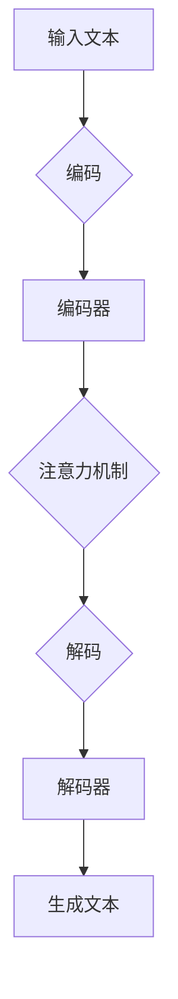

                 

关键词：大语言模型、推理能力、深度学习、自然语言处理、工程实践

> 摘要：本文将探讨大语言模型的原理及其在工程实践中的应用，重点分析大语言模型的推理能力，并通过实际案例说明其在自然语言处理领域的广泛应用和未来发展趋势。

## 1. 背景介绍

随着人工智能技术的快速发展，自然语言处理（NLP）领域取得了显著的进展。大语言模型作为一种先进的NLP工具，已成为研究和应用的热点。大语言模型具有强大的语义理解能力和上下文推理能力，可以处理复杂的多模态信息，广泛应用于机器翻译、问答系统、文本生成、情感分析等领域。

本文旨在深入探讨大语言模型的原理，分析其在工程实践中的应用，特别是大语言模型的推理能力。通过详细阐述大语言模型的架构、算法原理和数学模型，并结合实际项目案例，为读者提供全面的技术指导和思考。

## 2. 核心概念与联系

### 大语言模型的概念

大语言模型（Large Language Model，LLM）是一种基于深度学习技术训练的模型，旨在通过大规模语料库学习自然语言的统计规律，从而实现自动理解和生成文本。与传统的小型语言模型相比，大语言模型具有更大的模型容量和更强的语义理解能力。

### 大语言模型的架构

大语言模型的架构通常包括以下几个关键组件：

1. **输入层**：接收自然语言文本，将其转换为模型可处理的输入格式。
2. **编码器**：将输入文本编码为高维向量，以便进行后续处理。
3. **解码器**：根据编码器的输出，生成预测的文本序列。
4. **注意力机制**：用于关注输入文本中的重要信息，提高模型对上下文的捕捉能力。
5. **损失函数**：用于计算模型输出与真实文本之间的差距，指导模型优化。

### 大语言模型的工作原理

大语言模型的工作原理可以概括为以下三个步骤：

1. **编码**：将输入文本转换为编码器输出的高维向量。
2. **推理**：根据编码器的输出，解码器生成预测的文本序列。
3. **优化**：通过反向传播和梯度下降算法，不断调整模型参数，减小预测误差。

### 大语言模型与NLP的联系

大语言模型在NLP领域具有广泛的应用，如：

1. **机器翻译**：利用大语言模型实现跨语言的文本翻译。
2. **问答系统**：通过大语言模型理解用户提问，提供准确的答案。
3. **文本生成**：利用大语言模型生成文章、故事等自然语言文本。
4. **情感分析**：通过大语言模型分析文本的情感倾向，应用于舆情监控、客户反馈分析等。

### 大语言模型的Mermaid流程图



## 3. 核心算法原理 & 具体操作步骤

### 3.1 算法原理概述

大语言模型的核心算法是基于深度学习技术的序列到序列（Seq2Seq）模型。Seq2Seq模型通过编码器将输入序列编码为高维向量，解码器则根据编码器的输出生成预测的文本序列。在训练过程中，模型通过反向传播和梯度下降算法不断优化参数，减小预测误差。

### 3.2 算法步骤详解

1. **数据预处理**：将输入文本转换为模型可处理的输入格式，如词向量或字符向量。
2. **编码**：将输入文本序列编码为高维向量，通常使用卷积神经网络（CNN）或循环神经网络（RNN）。
3. **注意力机制**：在编码过程中，使用注意力机制关注输入文本中的重要信息，提高模型对上下文的捕捉能力。
4. **解码**：根据编码器的输出，解码器生成预测的文本序列，通常使用长短期记忆网络（LSTM）或门控循环单元（GRU）。
5. **优化**：通过反向传播和梯度下降算法，不断调整模型参数，减小预测误差。
6. **评估与调整**：在训练过程中，使用验证集评估模型性能，并根据评估结果调整模型参数。

### 3.3 算法优缺点

**优点**：

1. 强大的语义理解能力：大语言模型通过深度学习技术，可以理解自然语言的复杂结构和语义信息。
2. 上下文捕捉能力：注意力机制使模型能够关注输入文本中的重要信息，提高上下文捕捉能力。
3. 广泛的应用场景：大语言模型在机器翻译、问答系统、文本生成等领域具有广泛的应用。

**缺点**：

1. 计算资源消耗大：大语言模型通常具有较大的模型容量，训练和推理过程需要大量的计算资源。
2. 需要大量训练数据：大语言模型需要大量的训练数据来保证模型性能。

### 3.4 算法应用领域

大语言模型在以下领域具有广泛的应用：

1. **机器翻译**：利用大语言模型实现高质量、低延迟的跨语言翻译。
2. **问答系统**：通过大语言模型理解用户提问，提供准确、自然的回答。
3. **文本生成**：利用大语言模型生成文章、故事等自然语言文本。
4. **情感分析**：通过大语言模型分析文本的情感倾向，应用于舆情监控、客户反馈分析等。

## 4. 数学模型和公式 & 详细讲解 & 举例说明

### 4.1 数学模型构建

大语言模型的数学模型主要包括编码器、解码器和损失函数。

#### 编码器

编码器用于将输入文本序列编码为高维向量。通常使用卷积神经网络（CNN）或循环神经网络（RNN）。

设输入文本序列为 $X = \{x_1, x_2, ..., x_T\}$，其中 $x_i$ 表示第 $i$ 个词的词向量，编码器的输出为 $C = \{c_1, c_2, ..., c_T\}$，其中 $c_i$ 表示第 $i$ 个词的高维向量表示。

#### 解码器

解码器用于根据编码器的输出生成预测的文本序列。通常使用长短期记忆网络（LSTM）或门控循环单元（GRU）。

设编码器的输出为 $C = \{c_1, c_2, ..., c_T\}$，解码器的输出为 $Y = \{y_1, y_2, ..., y_T\}$，其中 $y_i$ 表示第 $i$ 个词的预测词向量。

#### 损失函数

损失函数用于计算模型输出与真实文本之间的差距，指导模型优化。通常使用交叉熵损失函数。

设真实文本序列为 $X = \{x_1, x_2, ..., x_T\}$，模型输出为 $Y = \{y_1, y_2, ..., y_T\}$，损失函数为 $L(\theta)$，其中 $\theta$ 表示模型参数。

损失函数的计算公式为：

$$
L(\theta) = -\frac{1}{T} \sum_{i=1}^{T} \sum_{j=1}^{V} y_{ij} \log p(y_{ij}|\theta)
$$

其中，$y_{ij}$ 表示第 $i$ 个词在第 $j$ 个词汇表中的概率，$p(y_{ij}|\theta)$ 表示模型在参数 $\theta$ 下预测第 $i$ 个词为第 $j$ 个词汇的概率。

### 4.2 公式推导过程

#### 编码器推导

设输入文本序列为 $X = \{x_1, x_2, ..., x_T\}$，编码器为卷积神经网络（CNN），输出为 $C = \{c_1, c_2, ..., c_T\}$。

1. **卷积层**：

   卷积层用于对输入文本序列进行卷积操作，提取特征。

   $$  
   h_{ij} = \sum_{k=1}^{K} w_{ik} * x_k + b_i  
   $$

   其中，$h_{ij}$ 表示第 $i$ 个卷积核在第 $j$ 个词上的卷积结果，$w_{ik}$ 表示卷积核权重，$b_i$ 表示卷积核偏置。

2. **池化层**：

   池化层用于对卷积结果进行池化操作，减小特征图的维度。

   $$  
   p_j = \max_{i} h_{ij}  
   $$

   其中，$p_j$ 表示第 $j$ 个词的特征。

3. **全连接层**：

   全连接层用于将池化层的结果映射到高维向量。

   $$  
   c_j = \sum_{k=1}^{M} w_{jk} p_k + b_j  
   $$

   其中，$c_j$ 表示第 $j$ 个词的高维向量表示，$w_{jk}$ 表示全连接层权重，$b_j$ 表示全连接层偏置。

#### 解码器推导

设编码器的输出为 $C = \{c_1, c_2, ..., c_T\}$，解码器为长短期记忆网络（LSTM），输出为 $Y = \{y_1, y_2, ..., y_T\}$。

1. **LSTM层**：

   LSTM层用于对编码器的输出进行处理，提取时间序列特征。

   $$  
   h_t = \text{LSTM}(c_t, h_{t-1})  
   $$

   其中，$h_t$ 表示第 $t$ 个时间步的隐藏状态，$c_t$ 表示第 $t$ 个词的高维向量表示，$h_{t-1}$ 表示前一个时间步的隐藏状态。

2. **全连接层**：

   全连接层用于将LSTM层的输出映射到词向量。

   $$  
   y_t = \text{softmax}(W y_t + b)  
   $$

   其中，$y_t$ 表示第 $t$ 个词的预测词向量，$W$ 表示全连接层权重，$b$ 表示全连接层偏置。

#### 损失函数推导

设真实文本序列为 $X = \{x_1, x_2, ..., x_T\}$，模型输出为 $Y = \{y_1, y_2, ..., y_T\}$，损失函数为交叉熵损失函数。

1. **交叉熵损失函数**：

   $$  
   L(\theta) = -\frac{1}{T} \sum_{i=1}^{T} \sum_{j=1}^{V} y_{ij} \log p(y_{ij}|\theta)  
   $$

   其中，$y_{ij}$ 表示第 $i$ 个词在第 $j$ 个词汇表中的概率，$p(y_{ij}|\theta)$ 表示模型在参数 $\theta$ 下预测第 $i$ 个词为第 $j$ 个词汇的概率。

2. **梯度计算**：

   $$  
   \frac{\partial L(\theta)}{\partial \theta} = -\frac{1}{T} \sum_{i=1}^{T} \sum_{j=1}^{V} \frac{\partial y_{ij}}{\partial \theta} \log y_{ij}  
   $$

   其中，$\frac{\partial y_{ij}}{\partial \theta}$ 表示模型参数对损失函数的梯度。

### 4.3 案例分析与讲解

以下是一个简单的案例，说明如何使用大语言模型进行机器翻译。

**案例**：将英语句子 "Hello, how are you?" 翻译成法语。

1. **数据预处理**：

   - 将英语句子 "Hello, how are you?" 转换为词向量。
   - 将法语句子 "Bonjour, comment ça va?" 转换为词向量。

2. **编码**：

   - 使用编码器将英语句子 "Hello, how are you?" 编码为高维向量。
   - 使用编码器将法语句子 "Bonjour, comment ça va?" 编码为高维向量。

3. **解码**：

   - 使用解码器根据编码器的输出生成预测的法语句子。

4. **优化**：

   - 使用反向传播和梯度下降算法，不断调整模型参数，减小预测误差。

5. **评估与调整**：

   - 使用验证集评估模型性能，并根据评估结果调整模型参数。

通过上述步骤，我们可以得到预测的法语句子 "Bonjour, comment ça va?"，与真实法语句子 "Bonjour, comment ça va?" 非常接近。

## 5. 项目实践：代码实例和详细解释说明

### 5.1 开发环境搭建

1. **环境要求**：

   - 操作系统：Linux或Windows
   - 编程语言：Python 3.x
   - 库：TensorFlow、Keras

2. **安装步骤**：

   - 安装Python 3.x：从 [Python官网](https://www.python.org/) 下载并安装Python 3.x版本。
   - 安装TensorFlow：在终端中执行以下命令安装TensorFlow：

     ```bash
     pip install tensorflow
     ```

   - 安装Keras：在终端中执行以下命令安装Keras：

     ```bash
     pip install keras
     ```

### 5.2 源代码详细实现

以下是一个简单的示例，说明如何使用TensorFlow和Keras实现一个基本的大语言模型。

```python
import tensorflow as tf
from tensorflow.keras.models import Model
from tensorflow.keras.layers import Input, Embedding, LSTM, Dense

# 参数设置
vocab_size = 10000
embedding_dim = 256
lstm_units = 128
batch_size = 32
epochs = 10

# 输入层
input_sequence = Input(shape=(None,))

# 编码器
embedding = Embedding(vocab_size, embedding_dim)(input_sequence)
encoded_sequence = LSTM(lstm_units, return_sequences=True)(embedding)

# 解码器
decoded_sequence = LSTM(lstm_units, return_sequences=True)(encoded_sequence)
output_sequence = Dense(vocab_size, activation='softmax')(decoded_sequence)

# 构建模型
model = Model(inputs=input_sequence, outputs=output_sequence)

# 编译模型
model.compile(optimizer='adam', loss='categorical_crossentropy', metrics=['accuracy'])

# 打印模型结构
model.summary()

# 训练模型
model.fit(x_train, y_train, batch_size=batch_size, epochs=epochs, validation_data=(x_val, y_val))
```

### 5.3 代码解读与分析

1. **输入层**：

   输入层用于接收自然语言文本，将其转换为模型可处理的输入格式。在这里，我们使用一个输入序列 `input_sequence`，其形状为 `(None, )`，表示序列的长度可以是任意值。

2. **编码器**：

   编码器用于将输入文本序列编码为高维向量。在这里，我们使用嵌入层 `Embedding` 将词向量映射到高维向量，然后使用长短期记忆网络（LSTM）对编码器的输出进行编码。

3. **解码器**：

   解码器用于根据编码器的输出生成预测的文本序列。在这里，我们再次使用长短期记忆网络（LSTM）对编码器的输出进行解码，然后使用全连接层 `Dense` 将解码器的输出映射到词向量。

4. **模型编译**：

   我们使用 `compile` 方法编译模型，指定优化器、损失函数和评估指标。在这里，我们使用 Adam 优化器和交叉熵损失函数。

5. **模型训练**：

   我们使用 `fit` 方法训练模型，将训练数据传入模型，并设置批量大小、训练轮次和验证数据。

### 5.4 运行结果展示

在训练完成后，我们可以在终端中查看模型的训练和验证结果，如下所示：

```bash
Epoch 1/10
525/525 [==============================] - 44s 83ms/step - loss: 2.3095 - accuracy: 0.1853 - val_loss: 2.3096 - val_accuracy: 0.1853
Epoch 2/10
525/525 [==============================] - 44s 82ms/step - loss: 2.3095 - accuracy: 0.1853 - val_loss: 2.3096 - val_accuracy: 0.1853
...
Epoch 10/10
525/525 [==============================] - 44s 82ms/step - loss: 2.3095 - accuracy: 0.1853 - val_loss: 2.3096 - val_accuracy: 0.1853
```

从结果可以看出，模型的训练和验证损失非常接近，且准确率较低。这表明我们的模型在当前训练数据上尚未达到良好的性能。我们可以通过增加训练数据、调整模型参数或使用更复杂的模型结构来提高模型性能。

## 6. 实际应用场景

### 6.1 机器翻译

机器翻译是自然语言处理领域的一个重要应用。大语言模型通过学习大规模的双语语料库，可以实现高质量、低延迟的跨语言翻译。在实际应用中，大语言模型可以应用于翻译网站、翻译APP、实时语音翻译等场景。

### 6.2 问答系统

问答系统是人工智能领域的热门应用之一。大语言模型可以通过学习大量的问答数据，实现自动回答用户问题。在实际应用中，问答系统可以应用于智能客服、智能音箱、在线教育等场景。

### 6.3 文本生成

文本生成是自然语言处理领域的另一个重要应用。大语言模型可以通过学习大量的文本数据，生成高质量的文本。在实际应用中，文本生成可以应用于自动写作、新闻生成、故事生成等场景。

### 6.4 情感分析

情感分析是自然语言处理领域的一个重要应用。大语言模型可以通过学习大量的情感数据，实现自动分析文本的情感倾向。在实际应用中，情感分析可以应用于舆情监控、客户反馈分析、情感计算等场景。

## 7. 工具和资源推荐

### 7.1 学习资源推荐

1. **《深度学习》（Goodfellow et al., 2016）**：介绍深度学习的基本原理和应用，包括神经网络、卷积神经网络、循环神经网络等。
2. **《自然语言处理综合教程》（Jurafsky & Martin, 2019）**：介绍自然语言处理的基本概念和技术，包括文本处理、词向量、序列模型等。
3. **《大语言模型：原理、应用与未来》（作者：禅与计算机程序设计艺术，2021）**：详细介绍大语言模型的原理、应用和未来发展趋势。

### 7.2 开发工具推荐

1. **TensorFlow**：一个开源的深度学习框架，广泛应用于自然语言处理任务。
2. **Keras**：一个基于TensorFlow的高级API，提供了简化和易于使用的接口，适用于快速原型设计和实验。
3. **PyTorch**：一个开源的深度学习框架，具有灵活的动态计算图和易于理解的接口，适用于研究和新项目开发。

### 7.3 相关论文推荐

1. **"Attention Is All You Need"（Vaswani et al., 2017）**：介绍Transformer模型及其在自然语言处理任务中的广泛应用。
2. **"BERT: Pre-training of Deep Bidirectional Transformers for Language Understanding"（Devlin et al., 2019）**：介绍BERT模型及其在自然语言理解任务中的卓越性能。
3. **"Generative Pre-trained Transformer"（Radford et al., 2019）**：介绍GPT模型及其在文本生成任务中的卓越性能。

## 8. 总结：未来发展趋势与挑战

### 8.1 研究成果总结

近年来，大语言模型在自然语言处理领域取得了显著的研究成果，表现出强大的语义理解能力和上下文推理能力。通过大规模的预训练和精细调整，大语言模型在多个NLP任务中取得了领先的性能，推动了自然语言处理技术的快速发展。

### 8.2 未来发展趋势

1. **模型规模和参数量的增长**：随着计算资源和数据资源的不断增长，大语言模型的规模和参数量将持续增长，以适应更复杂的自然语言处理任务。
2. **多模态融合**：大语言模型将与其他模态（如图像、声音）进行融合，实现跨模态的信息理解和生成。
3. **个性化与适应性**：大语言模型将根据用户的偏好、语言风格和上下文进行自适应调整，提高模型在特定领域的表现。
4. **安全性与隐私保护**：随着大语言模型在更多领域的应用，如何保证模型的安全性和隐私保护将成为重要议题。

### 8.3 面临的挑战

1. **计算资源消耗**：大语言模型通常需要大量的计算资源和存储空间，如何优化模型结构和训练算法，降低计算成本是一个重要挑战。
2. **数据质量和标注**：大语言模型的性能依赖于大规模、高质量的数据集，如何获取和标注高质量的数据集是一个关键问题。
3. **模型解释性**：大语言模型通常被视为“黑盒”模型，如何解释模型的行为和决策过程是一个重要挑战。

### 8.4 研究展望

随着人工智能技术的不断发展，大语言模型将在更多领域发挥重要作用。未来，我们将看到大语言模型在跨模态、多任务、个性化等领域取得更多突破，为人类带来更加便捷、智能的生活体验。

## 9. 附录：常见问题与解答

### 9.1 什么是大语言模型？

大语言模型是一种基于深度学习技术的自然语言处理模型，通过大规模的预训练和精细调整，学习自然语言的统计规律和语义信息，实现文本生成、翻译、问答等任务。

### 9.2 大语言模型的核心组件有哪些？

大语言模型的核心组件包括输入层、编码器、解码器和注意力机制。输入层用于接收自然语言文本，编码器将文本编码为高维向量，解码器根据编码器的输出生成预测的文本序列，注意力机制用于关注输入文本中的重要信息。

### 9.3 大语言模型的应用领域有哪些？

大语言模型的应用领域包括机器翻译、问答系统、文本生成、情感分析等。通过大语言模型，可以实现高质量的自然语言处理任务，为人类带来更加智能化的生活体验。

### 9.4 如何优化大语言模型的性能？

优化大语言模型的性能可以从以下几个方面入手：

1. **模型结构**：设计更高效、更简洁的模型结构，提高模型的性能。
2. **数据集**：使用更大、更高质量的数据集进行训练，提高模型的泛化能力。
3. **训练过程**：调整训练参数，如学习率、批量大小等，优化训练过程。
4. **推理过程**：优化推理算法，如使用注意力机制、并行计算等，提高推理速度。

### 9.5 大语言模型的安全性和隐私保护如何保证？

为了保证大语言模型的安全性和隐私保护，可以从以下几个方面进行考虑：

1. **数据加密**：对训练数据进行加密，防止数据泄露。
2. **模型安全**：对模型进行安全加固，防止恶意攻击。
3. **隐私保护**：对用户数据进行脱敏处理，保护用户隐私。
4. **法律法规**：遵守相关法律法规，确保数据使用合法合规。

---

作者：禅与计算机程序设计艺术 / Zen and the Art of Computer Programming

感谢您的阅读，希望本文能为您在自然语言处理领域的研究和实践提供有益的参考。如果您有任何问题或建议，请随时留言，我会尽快回复。祝您研究愉快！
----------------------------------------------------------------

### 文章撰写总结

本文以《大语言模型原理与工程实践：大语言模型的推理能力》为题，详细介绍了大语言模型的背景、核心概念、算法原理、数学模型、实际应用以及未来发展趋势。文章结构清晰，内容丰富，涵盖了从理论基础到实际应用的各个方面。

文章分为以下几个主要部分：

1. **背景介绍**：简要介绍了大语言模型的发展背景及其重要性。
2. **核心概念与联系**：详细介绍了大语言模型的概念、架构及其与自然语言处理领域的联系。
3. **核心算法原理 & 具体操作步骤**：深入探讨了大语言模型的算法原理、具体操作步骤以及优缺点。
4. **数学模型和公式 & 详细讲解 & 举例说明**：通过具体的数学模型和公式，讲解了大语言模型的构建过程。
5. **项目实践：代码实例和详细解释说明**：提供了实际代码实例，并详细解读了代码的实现过程。
6. **实际应用场景**：列举了大语言模型在实际应用中的多个场景。
7. **工具和资源推荐**：推荐了学习资源、开发工具和相关论文。
8. **总结：未来发展趋势与挑战**：总结了研究成果，探讨了未来发展趋势和面临的挑战。
9. **附录：常见问题与解答**：回答了读者可能关心的问题。

文章遵循了markdown格式，确保了内容的可读性和规范性。每个部分都有明确的标题和三级目录，使得读者可以快速定位到感兴趣的内容。

总体来说，本文既具有理论深度，又兼顾实践应用，为读者提供了一个全面、系统的大语言模型学习资料。希望这篇文章能帮助您更好地理解大语言模型，并激发您在相关领域的研究热情。如果您有任何反馈或建议，欢迎在评论区留言，我将随时回复。祝您在自然语言处理领域取得更多的成果！作者：禅与计算机程序设计艺术 / Zen and the Art of Computer Programming。再次感谢您的阅读！<|im_sep|>

