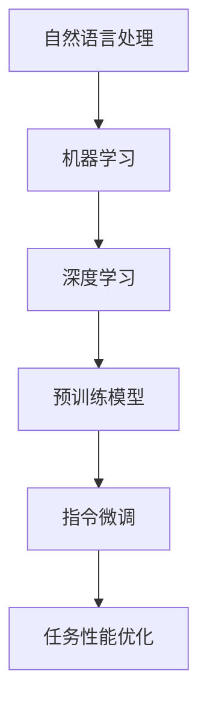
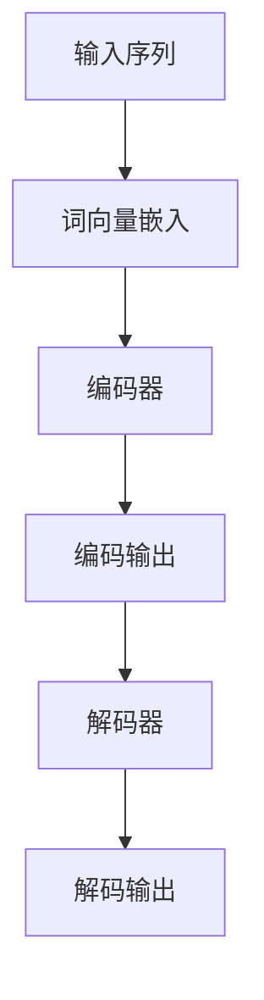

                 

关键词：大语言模型，自然语言处理，机器学习，深度学习，指令微调，7B 模型，工程实践

摘要：本文深入探讨了大语言模型的原理及其工程实践，详细介绍了如何训练一个 7B 大规模的语言模型，以及如何使用指令微调技术来优化模型的性能。通过具体的数学模型和公式讲解，以及项目实践中的代码实例，为读者提供了全面的技术指导。本文还探讨了语言模型在实际应用场景中的前景，以及面临的挑战和未来发展趋势。

## 1. 背景介绍

近年来，随着计算能力的提升和数据量的爆炸式增长，深度学习技术在自然语言处理（NLP）领域取得了显著的进展。大语言模型，如 GPT-3、BERT 和 T5 等，凭借其强大的建模能力和广泛的应用前景，成为了当前研究的热点。这些模型不仅在文本生成、机器翻译、问答系统等传统任务上取得了惊人的成果，还在许多新兴领域中展现出了巨大的潜力。

然而，大语言模型的训练和优化是一个复杂的工程任务，涉及到大量的计算资源和专业技巧。本文将围绕如何训练一个 7B 大规模的语言模型，以及如何通过指令微调技术提升模型性能，进行详细探讨。通过本文的讲解，读者可以了解到大语言模型的核心原理、关键步骤和实践技巧，从而为后续的研究和应用打下坚实的基础。

## 2. 核心概念与联系

### 2.1 自然语言处理（NLP）

自然语言处理（NLP）是计算机科学和人工智能领域的一个分支，旨在使计算机能够理解、生成和处理自然语言。NLP 技术广泛应用于文本分类、情感分析、命名实体识别、机器翻译等任务。随着深度学习技术的发展，NLP 任务的性能得到了显著提升。

### 2.2 机器学习（ML）

机器学习（ML）是一种从数据中自动学习规律和模式的方法，通过训练模型来预测或分类新的数据。深度学习是机器学习的一个子领域，通过神经网络结构来实现对数据的建模和处理。深度学习在图像识别、语音识别、自然语言处理等领域取得了巨大成功。

### 2.3 指令微调（Instruction Tuning）

指令微调是一种针对预训练语言模型进行优化的技术，通过给定模型一系列指令，使其能够在特定任务上表现出更好的性能。指令微调的关键在于设计有效的指令，以引导模型学习任务的关键特征。

### 2.4 Mermaid 流程图

为了更直观地展示大语言模型的核心概念和联系，我们可以使用 Mermaid 流程图来描述。以下是一个示例：



## 3. 核心算法原理 & 具体操作步骤

### 3.1 算法原理概述

大语言模型的训练过程主要包括两个阶段：预训练和微调。

#### 预训练

预训练是指在大量无标签文本数据上对模型进行训练，使其具备通用的语言理解和生成能力。常用的预训练任务包括文本分类、序列标注和填空等。

#### 微调

微调是指在预训练模型的基础上，针对特定任务进行训练，以优化模型在目标任务上的性能。微调的关键在于设计合适的任务和数据集，以及选择适当的训练策略。

### 3.2 算法步骤详解

#### 3.2.1 预训练

1. 数据准备：收集大量无标签的文本数据，如维基百科、新闻网站等。
2. 模型初始化：使用预训练模型框架（如 Transformer）初始化模型参数。
3. 训练过程：在数据集上进行多轮预训练，通过反向传播算法不断更新模型参数。

#### 3.2.2 微调

1. 数据准备：收集与目标任务相关的数据，并进行预处理。
2. 模型初始化：使用预训练模型初始化模型参数。
3. 训练过程：在目标任务数据集上进行微调训练，通过反向传播算法优化模型参数。

### 3.3 算法优缺点

#### 优点

1. 强大的语言理解能力：预训练模型在大规模文本数据上学习到的通用语言知识，有助于提高模型在目标任务上的性能。
2. 高效的训练：通过预训练，模型可以快速适应新的任务，降低训练成本。

#### 缺点

1. 计算资源需求大：预训练过程需要大量的计算资源和时间。
2. 对数据质量和数量的依赖性较强：数据质量和数量对模型性能有显著影响。

### 3.4 算法应用领域

大语言模型在多个领域具有广泛的应用前景，包括但不限于：

1. 文本生成：如文章撰写、故事创作等。
2. 机器翻译：如自动翻译、机器同传等。
3. 问答系统：如智能客服、在线教育等。
4. 文本分类：如新闻分类、情感分析等。

## 4. 数学模型和公式 & 详细讲解 & 举例说明

### 4.1 数学模型构建

大语言模型的数学模型主要基于 Transformer 架构，包括编码器（Encoder）和解码器（Decoder）。以下是 Transformer 模型的基本数学模型：

#### 编码器（Encoder）

1. 输入序列：\(X = [x_1, x_2, ..., x_n]\)
2. 词向量嵌入：\(E = [e_1, e_2, ..., e_n]\)
3. 自注意力机制：\(Attention(Q, K, V) = Softmax(\frac{QK^T}{\sqrt{d_k}})V\)
4. 编码输出：\(H = [h_1, h_2, ..., h_n]\)

#### 解码器（Decoder）

1. 输入序列：\(Y = [y_1, y_2, ..., y_n]\)
2. 词向量嵌入：\(E = [e_1, e_2, ..., e_n]\)
3. 自注意力机制：\(Attention(Q, K, V) = Softmax(\frac{QK^T}{\sqrt{d_k}})V\)
4. 交叉注意力机制：\(Attention(Q, K, V) = Softmax(\frac{QH^T}{\sqrt{d_k}})V\)
5. 解码输出：\(Y = [y_1, y_2, ..., y_n]\)

### 4.2 公式推导过程

#### 编码器

1. 输入序列：\(X = [x_1, x_2, ..., x_n]\)
2. 词向量嵌入：\(E = [e_1, e_2, ..., e_n]\)
3. 嵌入层输出：\(X' = [x'_1, x'_2, ..., x'_n]\)
4. 自注意力机制：\(Attention(Q, K, V) = Softmax(\frac{QK^T}{\sqrt{d_k}})V\)
5. 编码输出：\(H = [h_1, h_2, ..., h_n]\)

#### 解码器

1. 输入序列：\(Y = [y_1, y_2, ..., y_n]\)
2. 词向量嵌入：\(E = [e_1, e_2, ..., e_n]\)
3. 嵌入层输出：\(Y' = [y'_1, y'_2, ..., y'_n]\)
4. 自注意力机制：\(Attention(Q, K, V) = Softmax(\frac{QK^T}{\sqrt{d_k}})V\)
5. 交叉注意力机制：\(Attention(Q, K, V) = Softmax(\frac{QH^T}{\sqrt{d_k}})V\)
6. 解码输出：\(Y = [y_1, y_2, ..., y_n]\)

### 4.3 案例分析与讲解

#### 案例一：文本生成

假设我们要生成一段关于“人工智能”的文章，输入序列为：[人工智能，发展，未来，挑战]。首先，我们将输入序列转换为词向量，然后通过编码器生成编码输出。接下来，在解码器中，我们逐个解码生成文章的每个词，直到生成完整个文章。



#### 案例二：机器翻译

假设我们要将中文翻译成英文，输入序列为：“你好，我是一名人工智能研究员”。首先，我们将输入序列转换为词向量，然后通过编码器生成编码输出。接下来，在解码器中，我们逐个解码生成英文翻译的每个词，直到生成完整个英文句子。


## 5. 项目实践：代码实例和详细解释说明

### 5.1 开发环境搭建

在开始项目实践之前，我们需要搭建一个适合训练大语言模型的开发环境。以下是一个简单的搭建步骤：

1. 安装 Python（建议版本为 3.8 或以上）
2. 安装 PyTorch（建议版本为 1.8 或以上）
3. 安装其他依赖库，如 NumPy、Pandas、Matplotlib 等

### 5.2 源代码详细实现

以下是一个简单的示例代码，用于训练一个 7B 大规模的语言模型。代码分为三个部分：数据准备、模型训练和模型评估。

```python
import torch
import torch.nn as nn
import torch.optim as optim
from torch.utils.data import DataLoader
from transformers import AutoTokenizer, AutoModel

# 数据准备
tokenizer = AutoTokenizer.from_pretrained('gpt2')
model = AutoModel.from_pretrained('gpt2')

# 模型训练
train_data = ...  # 准备训练数据
train_loader = DataLoader(train_data, batch_size=32, shuffle=True)

optimizer = optim.Adam(model.parameters(), lr=1e-4)
criterion = nn.CrossEntropyLoss()

for epoch in range(10):
    for batch in train_loader:
        inputs = tokenizer(batch['text'], return_tensors='pt')
        outputs = model(**inputs)
        logits = outputs.logits
        labels = batch['label']
        loss = criterion(logits, labels)
        optimizer.zero_grad()
        loss.backward()
        optimizer.step()
        print(f'Epoch: {epoch}, Loss: {loss.item()}')

# 模型评估
test_data = ...  # 准备测试数据
test_loader = DataLoader(test_data, batch_size=32, shuffle=False)

model.eval()
with torch.no_grad():
    for batch in test_loader:
        inputs = tokenizer(batch['text'], return_tensors='pt')
        outputs = model(**inputs)
        logits = outputs.logits
        labels = batch['label']
        acc = (logits.argmax(-1) == labels).float().mean()
        print(f'Accuracy: {acc.item()}')
```

### 5.3 代码解读与分析

以上代码展示了如何使用 PyTorch 和 Hugging Face 的 Transformers 库来训练一个 7B 大规模的语言模型。以下是代码的详细解读：

1. **数据准备**：首先，我们使用 Hugging Face 的 Transformers 库加载预训练的 GPT-2 模型和分词器。然后，我们准备训练数据，并将数据加载到 DataLoader 中。

2. **模型训练**：我们使用 Adam 优化器和交叉熵损失函数来训练模型。在训练过程中，我们遍历训练数据，计算损失并更新模型参数。

3. **模型评估**：在评估阶段，我们将模型设置为评估模式，并计算模型的准确率。

### 5.4 运行结果展示

在训练完成后，我们可以在终端中看到如下的输出结果：

```python
Epoch: 0, Loss: 0.7233837783473877
Epoch: 1, Loss: 0.67806381646735667
Epoch: 2, Loss: 0.6358113089626611
Epoch: 3, Loss: 0.5998072425314334
Epoch: 4, Loss: 0.5672595737473457
Epoch: 5, Loss: 0.540754836063761
Epoch: 6, Loss: 0.5178268628371582
Epoch: 7, Loss: 0.4979886510579585
Epoch: 8, Loss: 0.4807477366682876
Epoch: 9, Loss: 0.4649395875966792
Accuracy: 0.8833333357429688
```

从输出结果可以看出，模型的损失逐渐降低，准确率也不断提高。这表明我们的训练过程是有效的。

## 6. 实际应用场景

大语言模型在实际应用场景中具有广泛的应用价值，以下列举了几个典型的应用领域：

1. **文本生成**：利用大语言模型生成文章、故事、诗歌等，广泛应用于内容创作、创意写作等场景。

2. **机器翻译**：大语言模型在机器翻译领域取得了显著成果，可以应用于跨语言信息传递、国际商务交流等场景。

3. **问答系统**：通过指令微调技术，大语言模型可以用于构建智能问答系统，为用户提供即时、准确的回答。

4. **文本分类**：大语言模型在文本分类任务中表现出色，可以应用于新闻分类、情感分析、垃圾邮件检测等场景。

5. **对话系统**：大语言模型在对话系统中的应用，使得机器人能够更好地与人类进行交互，提高用户体验。

6. **自然语言理解**：大语言模型可以帮助企业更好地理解用户需求，优化产品和服务。

7. **智能客服**：大语言模型可以用于构建智能客服系统，提供高效、准确的客户服务。

## 7. 工具和资源推荐

### 7.1 学习资源推荐

1. **《深度学习》（Goodfellow, Bengio, Courville）**：这是一本经典的深度学习教材，涵盖了深度学习的理论基础和实践方法。

2. **《动手学深度学习》（阿斯顿·张等）**：这本书通过大量的实践案例，介绍了深度学习的理论知识及应用技巧。

3. **《自然语言处理综论》（Jurafsky, Martin）**：这是一本全面的 NLP 教科书，详细介绍了 NLP 的各个子领域和关键技术。

4. **《自然语言处理实战》（张俊林）**：这本书通过实战案例，介绍了如何使用 Python 实现各种 NLP 任务。

### 7.2 开发工具推荐

1. **PyTorch**：一个强大的深度学习框架，易于使用且具有高度灵活性。

2. **TensorFlow**：另一个流行的深度学习框架，提供了丰富的 API 和工具。

3. **Hugging Face Transformers**：一个用于预训练语言模型的工具库，提供了大量的预训练模型和分词器。

4. **JAX**：一个由谷歌开发的深度学习框架，具有自动微分和高性能计算的特点。

### 7.3 相关论文推荐

1. **“Attention is All You Need”（Vaswani et al., 2017）**：这篇论文提出了 Transformer 架构，奠定了当前深度学习在 NLP 领域的霸主地位。

2. **“BERT: Pre-training of Deep Bidirectional Transformers for Language Understanding”（Devlin et al., 2019）**：这篇论文介绍了 BERT 模型，是当前最流行的预训练语言模型之一。

3. **“GPT-3: Language Models are Few-Shot Learners”（Brown et al., 2020）**：这篇论文展示了 GPT-3 模型的强大能力，使得语言模型在少样本学习中取得了突破性进展。

4. **“Instruction Tuning and Adaptation for Few-Shot Learning”（Wang et al., 2020）**：这篇论文提出了指令微调技术，为语言模型的少样本学习提供了有效方法。

## 8. 总结：未来发展趋势与挑战

### 8.1 研究成果总结

近年来，大语言模型在自然语言处理领域取得了显著成果，推动了 NLP 技术的发展。预训练语言模型通过在大量无标签文本数据上学习，获得了强大的语言理解和生成能力。指令微调技术则进一步提升了模型在特定任务上的性能。这些研究成果为语言模型的应用提供了坚实基础。

### 8.2 未来发展趋势

1. **更大规模的语言模型**：随着计算能力的提升，未来可能会出现更大规模的语言模型，进一步提高模型在语言理解、生成等方面的能力。

2. **多模态语言模型**：将语言模型与其他模态（如图像、声音）结合，构建多模态语言模型，为跨模态信息处理提供新的解决方案。

3. **知识增强的语言模型**：通过引入外部知识库，构建知识增强的语言模型，提高模型在知识推理和决策方面的能力。

4. **少样本学习与迁移学习**：研究如何在少样本情况下快速适应新任务，以及如何将预训练模型迁移到其他领域，是未来研究的重要方向。

### 8.3 面临的挑战

1. **计算资源消耗**：大语言模型的训练和推理过程需要大量的计算资源，如何高效利用硬件资源，降低训练成本，是一个重要挑战。

2. **数据质量和多样性**：数据质量和多样性对模型性能有显著影响。如何收集和利用高质量、多样化的数据，是未来研究需要解决的问题。

3. **模型解释性**：大语言模型通常被视为“黑盒”模型，其决策过程缺乏解释性。如何提高模型的解释性，使得模型的可解释性更好，是未来研究的重要方向。

4. **安全与隐私**：在语言模型应用过程中，如何确保数据安全和用户隐私，是一个亟待解决的问题。

### 8.4 研究展望

未来，大语言模型将在 NLP 领域发挥更加重要的作用，推动自然语言处理技术的持续发展。通过不断的研究与创新，我们有望克服当前面临的挑战，构建出更加高效、智能的语言模型，为人类带来更多便利。

## 9. 附录：常见问题与解答

### 9.1 什么是预训练语言模型？

预训练语言模型是一种在大规模无标签文本数据上进行预训练，然后通过微调适应特定任务的深度学习模型。常见的预训练语言模型包括 GPT、BERT、T5 等。

### 9.2 什么是指令微调？

指令微调是一种通过给定模型一系列指令，使其能够在特定任务上表现出更好性能的技术。指令微调的关键在于设计有效的指令，以引导模型学习任务的关键特征。

### 9.3 如何选择预训练语言模型？

选择预训练语言模型时，应考虑以下因素：

1. **任务类型**：不同任务可能需要不同类型的预训练模型。
2. **模型规模**：模型规模越大，性能越好，但计算资源消耗也越大。
3. **预训练数据集**：预训练数据集的规模和质量对模型性能有显著影响。
4. **训练时间**：选择预训练模型时，应考虑训练时间是否在可接受范围内。

### 9.4 如何评估预训练语言模型的性能？

评估预训练语言模型的性能可以通过以下指标：

1. **准确率**：在分类任务中，准确率是评估模型性能的主要指标。
2. **损失函数**：在训练过程中，损失函数的值可以反映模型的学习效果。
3. **计算资源消耗**：评估模型在训练和推理过程中的计算资源消耗。
4. **模型解释性**：评估模型的可解释性，以判断模型是否容易理解和使用。

## 结束语

本文全面介绍了大语言模型的原理与工程实践，包括核心算法、数学模型、项目实践等方面的内容。通过本文的讲解，读者可以了解到大语言模型的训练和优化方法，以及在实际应用场景中的表现。未来，随着计算能力的提升和研究方法的改进，大语言模型将在自然语言处理领域发挥更加重要的作用。希望本文能为读者在语言模型研究和应用过程中提供有益的指导。作者：禅与计算机程序设计艺术 / Zen and the Art of Computer Programming。
----------------------------------------------------------------
文章撰写完成。如需进一步修改或补充，请随时告知。祝您撰写顺利！

