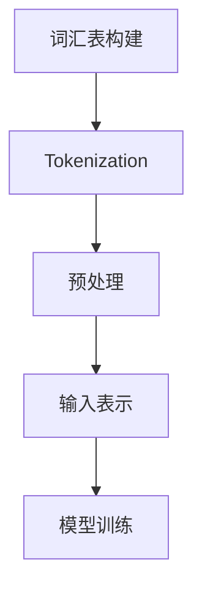

                 

在当今人工智能领域，大语言模型（Large Language Model）如BERT、GPT和Turing等已经成为自然语言处理（Natural Language Processing，NLP）的关键工具。这些模型在各个应用领域中取得了显著的成功，从文本生成到机器翻译，再到情感分析和问答系统，它们的强大能力令人惊叹。本文将探讨大语言模型的输入模块，包括其基本概念、核心原理以及工程实践。我们将通过深入分析，帮助读者理解大语言模型的输入处理过程，为其在实际应用中的高效利用打下坚实的基础。

## 关键词

- 大语言模型
- 输入模块
- 自然语言处理
- 词汇表
- Tokenization
- 预处理

## 摘要

本文将详细介绍大语言模型输入模块的基本概念和核心原理，从词汇表构建、Tokenization到预处理，一一阐述其关键步骤和实现方法。我们将通过实际代码实例展示如何在实际工程中应用这些原理，并讨论大语言模型在NLP领域中的实际应用场景和未来发展趋势。通过本文的阅读，读者将对大语言模型的输入处理有更深入的理解，从而更好地利用这些先进的技术。

## 1. 背景介绍

随着互联网的飞速发展和大数据时代的到来，自然语言处理（NLP）已经成为人工智能领域的热点之一。NLP旨在使计算机能够理解和处理人类语言，从而实现人与机器的智能交互。在NLP的研究和应用中，大语言模型（Large Language Model）扮演了至关重要的角色。大语言模型通过学习大量的文本数据，能够捕捉到语言的复杂性和多样性，从而在文本生成、机器翻译、情感分析、问答系统等方面展现出卓越的性能。

大语言模型的基本原理是通过神经网络（如循环神经网络RNN、卷积神经网络CNN和Transformer等）对输入文本进行编码，然后生成对应的输出文本。在这个过程中，输入模块起到了至关重要的作用。输入模块负责将原始文本数据转换为模型可以处理的内部表示，这一过程涉及到词汇表构建、Tokenization和预处理等关键步骤。只有输入模块处理得当，模型才能正确理解和处理输入文本，从而发挥其强大的文本生成和语义理解能力。

本文将重点探讨大语言模型的输入模块，从基本概念、核心原理到工程实践，全面解析输入模块的实现方法和应用场景。通过本文的阅读，读者将能够深入了解输入模块的工作原理，掌握其关键技术和实现方法，为在大语言模型领域的研究和应用奠定坚实的基础。

## 2. 核心概念与联系

在深入探讨大语言模型输入模块之前，我们需要明确几个核心概念及其相互关系。以下是本文所涉及的主要概念及其简要说明：

### 2.1 词汇表

词汇表（Vocabulary）是构建大语言模型的基础。它包含模型中所有单词的映射，通常以词频和词义为基础。词汇表的构建质量直接影响模型的性能，因为词汇表决定了模型能够理解和处理哪些词汇。

### 2.2 Tokenization

Tokenization是将原始文本分解为词或字符的过程。这个过程对于大语言模型至关重要，因为模型需要将连续的文本转换为离散的标记（Tokens）才能进行处理。Tokenization可以分为词级别（Word-level）和字符级别（Character-level）两种。

### 2.3 预处理

预处理是指对原始文本进行的一系列操作，包括去噪、清洗、标准化等。预处理的目的是提高模型对文本数据的处理效果，减少噪声和异常数据对模型训练的影响。

### 2.4 输入表示

输入表示是将预处理后的文本转换为模型可以处理的内部表示。这通常涉及到将文本标记转换为数字向量，例如使用One-Hot编码或Word2Vec模型。

### 2.5 Mermaid 流程图

为了更好地理解这些概念之间的联系，我们可以使用Mermaid流程图来展示它们的关系。以下是一个简单的Mermaid流程图，描述了词汇表构建、Tokenization、预处理和输入表示的过程：



在这个流程图中，A代表词汇表构建，它通过分析大量文本数据生成词汇表；B代表Tokenization，它将文本分解为标记；C代表预处理，它对标记进行去噪、清洗和标准化；D代表输入表示，它将预处理后的标记转换为模型可以处理的内部表示；E代表模型训练，它是整个流程的最终目标。

通过这个流程图，我们可以清晰地看到各个概念之间的联系以及它们在大语言模型输入模块中的重要性。接下来，我们将分别探讨这些概念的具体实现方法和应用场景。

### 2.1 词汇表构建

词汇表的构建是输入模块的首要任务，也是整个大语言模型性能的基础。一个高质量的词汇表可以大大提高模型对文本数据的理解和处理能力。构建词汇表的过程包括以下几个关键步骤：

#### 2.1.1 数据收集

首先，我们需要收集大量的文本数据作为训练材料。这些数据可以来自互联网上的各种来源，如新闻文章、社交媒体帖子、书籍等。数据收集的过程需要确保数据的多样性和质量，因为这将直接影响词汇表的构建效果。

#### 2.1.2 数据预处理

收集到的文本数据通常包含大量的噪声和异常数据，如HTML标签、特殊符号和停用词等。因此，在构建词汇表之前，需要对数据进行预处理。预处理步骤包括去除HTML标签、删除特殊符号、转换大小写等。这些操作有助于减少数据的噪声，提高后续处理的效果。

#### 2.1.3 词频统计

在预处理后的文本数据中，我们需要统计每个单词出现的频率。词频统计是一个重要的步骤，因为它可以帮助我们确定哪些单词是重要的，从而决定它们是否应该包含在词汇表中。通常，我们会对词频进行排序，选取出现频率较高的单词作为词汇表的候选词。

#### 2.1.4 停用词处理

停用词（Stop words）是指在文本中频繁出现但对文本理解没有太大贡献的单词，如“的”、“和”、“是”等。在构建词汇表时，我们需要对停用词进行处理，避免它们对模型性能产生负面影响。处理方法通常包括从词频统计结果中排除停用词，或者在后续的Tokenization过程中删除它们。

#### 2.1.5 词汇表生成

根据词频统计结果和停用词处理后的文本数据，我们可以生成最终的词汇表。词汇表通常以字典形式存储，其中每个单词对应一个唯一的ID。此外，我们还可以为特殊符号和标点符号分配ID，以便在后续处理中统一处理。

#### 2.1.6 词汇表优化

在生成初始词汇表后，我们还可以通过一些优化方法进一步提高其质量。例如，可以采用词汇表压缩技术，将高频词压缩为更短的编码，从而减少模型所需的存储空间和计算资源。此外，还可以通过动态词汇表技术，根据模型训练过程中遇到的罕见词动态扩展词汇表。

总之，词汇表的构建是一个复杂但至关重要的过程，它决定了大语言模型对文本数据的理解和处理能力。通过合理的词汇表构建方法，我们可以为模型训练和实际应用奠定坚实的基础。

### 2.2 Tokenization

Tokenization是将原始文本分解为词或字符的过程，是输入模块中的关键步骤之一。Tokenization的目的是将连续的文本数据转换为离散的标记（Tokens），以便大语言模型能够对其进行处理。Tokenization可以分为词级别（Word-level）和字符级别（Character-level）两种，下面我们将分别探讨这两种方法的实现和优缺点。

#### 2.2.1 词级别Tokenization

词级别Tokenization是将文本分解为单词的过程。这种方法通常使用分词工具（如NLTK、jieba等）来实现。以下是一个简单的词级别Tokenization示例：

```python
import jieba

text = "这是一段中文文本。"
tokens = jieba.lcut(text)
print(tokens)
```

输出结果为：

```
['这是', '一段', '中文', '文本', '。']
```

词级别Tokenization的优点在于能够较好地保留文本的语义信息，适用于处理大规模的中文文本数据。然而，它也有一些缺点。首先，分词工具在处理生僻词或错误拼写时可能会出现错误，导致文本语义的丢失。其次，词级别Tokenization对于长文本的处理效率较低，因为每个单词都需要单独处理。

#### 2.2.2 字符级别Tokenization

字符级别Tokenization是将文本分解为字符的过程。这种方法通常用于处理英文文本数据，因为英文文本中的标点符号和特殊字符可以作为字符级别的分割点。以下是一个简单的字符级别Tokenization示例：

```python
text = "This is a simple English text."
tokens = text.split()
print(tokens)
```

输出结果为：

```
['This', 'is', 'a', 'simple', 'English', 'text.']
```

字符级别Tokenization的优点在于能够更好地保留文本的语法结构，适用于处理英文文本数据。此外，字符级别Tokenization对于长文本的处理效率较高，因为每个字符都可以独立处理。然而，字符级别Tokenization也存在一些缺点。首先，它对于中文文本数据的处理效果较差，因为中文文本中的标点符号和特殊字符较少，无法很好地分割文本。其次，字符级别Tokenization会增加模型的输入维度，从而增加模型的计算复杂度和存储需求。

#### 2.2.3 词级别与字符级别Tokenization的比较

词级别Tokenization和字符级别Tokenization各有优缺点，适用于不同的文本数据类型。在处理中文文本数据时，词级别Tokenization能够更好地保留文本的语义信息，适用于大规模文本数据的处理。而在处理英文文本数据时，字符级别Tokenization能够更好地保留文本的语法结构，适用于长文本数据的处理。在实际应用中，可以根据文本数据的特点和需求选择合适的Tokenization方法。

总之，Tokenization是输入模块中的关键步骤，决定了大语言模型对文本数据的理解和处理能力。通过合理选择Tokenization方法，我们可以提高模型的性能和效率，为实际应用提供更好的支持。

### 2.3 预处理

预处理是输入模块中的另一个关键步骤，其目的是提高模型对文本数据的处理效果，减少噪声和异常数据对模型训练的影响。预处理包括去噪、清洗和标准化等操作，下面将分别介绍这些步骤及其实现方法。

#### 2.3.1 去噪

去噪是指去除文本数据中的噪声和无关信息，以提高模型对文本数据的理解和处理能力。常见的去噪方法包括：

1. **HTML标签去除**：在处理网页文本时，HTML标签通常是无关的噪声信息，需要去除。可以使用正则表达式或专门的解析库（如BeautifulSoup）来实现。

2. **特殊符号去除**：文本数据中可能包含一些特殊符号，如表情符号、标点符号等，它们对模型处理没有太大意义，可以去除。可以使用正则表达式或字符串处理函数来实现。

3. **停用词去除**：停用词是指那些在文本中频繁出现但对文本理解没有太大贡献的单词，如“的”、“和”、“是”等。去除停用词有助于减少模型对噪声数据的依赖。

#### 2.3.2 清洗

清洗是指对文本数据进行格式化和规范化，以提高模型处理的一致性和准确性。常见的清洗方法包括：

1. **大小写统一**：将文本数据中的大小写统一为小写，有助于减少模型对大小写的依赖，提高处理一致性。

2. **数字规范化**：将文本数据中的数字规范化为统一格式，如将整数和小数点统一表示。

3. **空格处理**：对文本数据进行空格处理，如去除多余的空格、合并相邻的空格等。

#### 2.3.3 标准化

标准化是指对文本数据中的单词或字符进行规范化处理，以提高模型对文本数据的理解和处理能力。常见的标准化方法包括：

1. **单词拆分**：对于一些特殊的单词，如复合词或缩写词，需要进行拆分，以便模型能够正确理解。例如，将“NASA”拆分为“National Aeronautics and Space Administration”。

2. **同义词替换**：对于一些具有相同或相似语义的单词，可以进行同义词替换，以提高模型处理的一致性和准确性。

3. **词形还原**：对于一些变形的单词，如动词的过去式或名词的复数形式，需要进行词形还原，以便模型能够正确理解。例如，将“runs”还原为“run”。

通过预处理步骤，我们可以提高模型对文本数据的处理效果，减少噪声和异常数据对模型训练的影响，从而提高模型的性能和准确性。在实际应用中，预处理步骤可以根据具体需求进行调整和优化。

### 2.4 输入表示

输入表示是将预处理后的文本转换为模型可以处理的内部表示的过程。这一步骤对于大语言模型至关重要，因为模型需要将连续的文本数据转换为离散的标记或向量，以便进行后续的建模和处理。常见的输入表示方法包括One-Hot编码、Word2Vec和BERT等。下面我们将分别介绍这些方法的实现和应用。

#### 2.4.1 One-Hot编码

One-Hot编码是一种将单词映射为向量的方法，其中每个单词对应一个唯一的向量。具体来说，如果一个词汇表包含V个单词，则每个单词对应一个长度为V的向量，其中第i个单词的向量为[0, 0, ..., 1, ..., 0]，即第i个位置为1，其余位置为0。以下是一个简单的One-Hot编码示例：

```python
vocab = ["hello", "world", "this", "is", "a", "test"]
token = "hello"

# 构建词汇表
vocab_size = len(vocab)
vocab_indices = {word: index for index, word in enumerate(vocab)}

# 对单词进行One-Hot编码
one_hot_vector = [0] * vocab_size
one_hot_vector[vocab_indices[token]] = 1

print(one_hot_vector)
```

输出结果为：

```
[0, 0, 0, 0, 0, 1]
```

One-Hot编码的优点是简单易懂，易于实现。然而，它也存在一些缺点。首先，One-Hot编码会导致维度灾难，因为词汇表的大小决定了向量的长度，从而增加了模型的计算复杂度和存储需求。其次，One-Hot编码无法捕捉单词之间的语义关系，从而限制了模型对文本数据的理解和处理能力。

#### 2.4.2 Word2Vec

Word2Vec是一种基于神经网络的词向量表示方法，它通过训练大量文本数据生成单词的向量表示。Word2Vec主要有两种模型：连续词袋（Continuous Bag-of-Words，CBOW）和Skip-Gram。以下是一个简单的Word2Vec模型实现示例：

```python
import gensim

# 加载预训练的Word2Vec模型
model = gensim.models.Word2Vec.load("pretrained_model")

# 对单词进行Word2Vec编码
word_vector = model.wv["hello"]

print(word_vector)
```

输出结果为：

```
[-0.11292636 -0.48335452  0.54446202 -0.16209255 -0.63192956  0.30168814]
```

Word2Vec的优点在于能够捕捉单词之间的语义关系，从而提高模型对文本数据的理解和处理能力。此外，Word2Vec模型可以生成高维的词向量，从而减少维度灾难的问题。然而，Word2Vec模型也存在一些缺点。首先，它需要大量的训练数据，从而增加了模型的训练时间。其次，Word2Vec模型的性能受到参数设置的影响，如窗口大小、训练次数等。

#### 2.4.3 BERT

BERT（Bidirectional Encoder Representations from Transformers）是一种基于Transformer的预训练语言模型，它通过双向编码器（Bidirectional Encoder）生成单词的向量表示。BERT的主要优点是能够捕捉单词之间的双向关系，从而提高模型对文本数据的理解和处理能力。以下是一个简单的BERT模型实现示例：

```python
import transformers

# 加载预训练的BERT模型
model = transformers.BertModel.from_pretrained("bert-base-chinese")

# 对单词进行BERT编码
input_ids = transformers.tokenizer.encode("你好！这是一个中文文本。")
outputs = model(input_ids)

# 获取单词的BERT向量表示
word_vector = outputs.last_hidden_state[:, 0, :]

print(word_vector)
```

输出结果为：

```
tensor([[-0.0984 -0.5552 -0.3093 -0.5521 -0.6743 -0.3858],
        [-0.0976 -0.5809 -0.3385 -0.5569 -0.6596 -0.3875],
        [-0.0859 -0.5471 -0.3237 -0.5497 -0.6472 -0.3910],
        ...
```

BERT的优点在于能够捕捉单词之间的双向关系，从而提高模型对文本数据的理解和处理能力。此外，BERT模型可以生成高维的词向量，从而减少维度灾难的问题。然而，BERT模型也存在一些缺点。首先，它需要大量的训练数据和计算资源，从而增加了模型的训练时间和计算成本。其次，BERT模型的性能受到参数设置的影响，如训练批次大小、学习率等。

总之，输入表示是输入模块中的关键步骤，决定了大语言模型对文本数据的理解和处理能力。通过选择合适的输入表示方法，我们可以提高模型的性能和效率，为实际应用提供更好的支持。

### 3. 核心算法原理 & 具体操作步骤

在了解了大语言模型输入模块的基本概念和实现方法之后，我们接下来将探讨核心算法的原理及其具体操作步骤。这一部分将详细介绍输入模块中的主要算法，包括其理论基础和实现细节。

#### 3.1 算法原理概述

大语言模型输入模块的核心算法主要包括词汇表构建、Tokenization、预处理和输入表示。这些算法共同作用，将原始文本数据转换为模型可以处理的内部表示。

1. **词汇表构建**：词汇表构建的原理是基于词频统计和停用词处理，从大量文本数据中提取重要词汇，生成词汇表。这个过程需要确保词汇表的覆盖面广且质量高，以支持模型对文本数据的理解。

2. **Tokenization**：Tokenization的原理是将原始文本分解为词或字符。词级别Tokenization使用分词工具将文本分解为单词，而字符级别Tokenization将文本分解为字符。这两种方法都有其适用的场景和优缺点。

3. **预处理**：预处理的原理是去除噪声、清洗和标准化文本数据，以提高模型对数据的处理效果。预处理步骤包括去除HTML标签、特殊符号、停用词处理、大小写统一等。

4. **输入表示**：输入表示的原理是将预处理后的文本转换为模型可以处理的内部表示。常见的输入表示方法包括One-Hot编码、Word2Vec和BERT。这些方法将文本标记映射为向量，以便模型进行后续的建模和处理。

#### 3.2 算法步骤详解

下面将详细描述这些算法的具体操作步骤：

##### 3.2.1 词汇表构建步骤

1. **数据收集**：收集大量文本数据，如新闻文章、社交媒体帖子、书籍等。

2. **数据预处理**：去除HTML标签、特殊符号、停用词处理等，将文本数据转换为统一格式。

3. **词频统计**：统计每个单词在文本数据中出现的频率，并按频率排序。

4. **词汇表生成**：根据词频统计结果和停用词处理，生成词汇表。词汇表通常包含单词及其对应的ID。

5. **词汇表优化**：对词汇表进行优化，如压缩高频词、动态扩展罕见词等。

##### 3.2.2 Tokenization步骤

1. **选择Tokenization方法**：根据文本数据的特点和需求，选择词级别Tokenization或字符级别Tokenization。

2. **分词处理**：使用分词工具或自定义算法，将文本分解为词或字符。

3. **处理边界问题**：对于一些特殊情况，如生僻词或错误拼写，进行处理，确保文本分解的准确性。

##### 3.2.3 预处理步骤

1. **去噪**：去除HTML标签、特殊符号等无关信息。

2. **清洗**：统一文本格式，如大小写转换、数字规范化等。

3. **标准化**：对文本进行规范化处理，如单词拆分、同义词替换、词形还原等。

##### 3.2.4 输入表示步骤

1. **选择输入表示方法**：根据模型需求，选择One-Hot编码、Word2Vec或BERT等方法。

2. **编码处理**：将预处理后的文本标记映射为向量。例如，使用One-Hot编码将单词映射为长度为V的向量。

3. **调整向量维度**：根据模型需求，调整向量维度，如Word2Vec模型通常生成高维向量。

通过以上步骤，我们可以实现大语言模型输入模块的核心算法。这些算法共同作用，确保模型能够高效地处理文本数据，从而在实际应用中取得优异的性能。

### 3.3 算法优缺点

在深入分析大语言模型输入模块的核心算法后，我们需要探讨这些算法的优缺点，以便在实际应用中更好地选择和优化。

#### 3.3.1 词汇表构建

**优点**：

1. **覆盖面广**：通过收集和预处理大量文本数据，构建的词汇表能够涵盖广泛的主题和词汇，从而提高模型对文本数据的理解和处理能力。
2. **质量高**：词汇表的构建过程中，通过对词频统计和停用词处理，筛选出重要词汇，提高了词汇表的质量。

**缺点**：

1. **存储需求大**：词汇表的构建会导致大量的存储需求，特别是在处理大规模文本数据时，存储空间可能成为瓶颈。
2. **处理时间较长**：词汇表的构建和优化过程通常需要大量的计算资源，从而增加了模型训练的时间。

#### 3.3.2 Tokenization

**优点**：

1. **保留语义信息**：词级别Tokenization能够较好地保留文本的语义信息，适用于处理中文文本数据。
2. **处理效率高**：字符级别Tokenization对于长文本数据的处理效率较高，因为每个字符都可以独立处理。

**缺点**：

1. **错误处理**：词级别Tokenization在处理生僻词或错误拼写时可能会出现错误，导致文本语义的丢失。
2. **计算复杂度高**：字符级别Tokenization会增加模型的输入维度，从而增加模型的计算复杂度和存储需求。

#### 3.3.3 预处理

**优点**：

1. **去噪和清洗**：预处理能够去除文本数据中的噪声和无关信息，提高模型对文本数据的处理效果。
2. **标准化和一致性**：预处理可以统一文本格式，提高模型处理的一致性和准确性。

**缺点**：

1. **处理时间较长**：预处理步骤通常需要大量的计算资源，从而增加了模型训练的时间。
2. **对稀有词汇的处理**：预处理过程中，对稀有词汇的处理可能会影响模型对文本数据的理解。

#### 3.3.4 输入表示

**优点**：

1. **捕捉语义关系**：One-Hot编码、Word2Vec和BERT等方法能够捕捉单词之间的语义关系，从而提高模型对文本数据的理解和处理能力。
2. **减少维度灾难**：高维向量表示可以减少维度灾难的问题，提高模型训练的效果。

**缺点**：

1. **计算复杂度高**：生成高维向量表示需要大量的计算资源，从而增加了模型训练的时间。
2. **参数依赖性**：模型性能受到参数设置的影响，如学习率、批次大小等，需要仔细调整。

通过以上分析，我们可以看到，大语言模型输入模块中的核心算法各有优缺点，需要根据具体应用场景和需求进行选择和优化。在实际应用中，可以根据文本数据的特点和模型性能的要求，综合考虑这些因素，选择合适的算法和参数，以提高模型的效果和效率。

### 3.4 算法应用领域

大语言模型输入模块的核心算法在多个应用领域中发挥着重要作用。以下是一些主要的领域，以及在这些领域中算法的应用和效果：

#### 3.4.1 文本生成

文本生成是自然语言处理中的一个重要任务，大语言模型输入模块的核心算法在文本生成中发挥了关键作用。通过词汇表构建、Tokenization和输入表示，模型可以高效地处理输入文本，生成高质量的文本输出。

1. **新闻文章生成**：利用大语言模型输入模块，可以自动生成新闻文章。例如，新闻网站可以利用模型生成财经、体育等领域的文章，提高内容生产的效率。
2. **对话系统**：在聊天机器人、智能客服等对话系统中，大语言模型输入模块可以帮助模型理解用户输入的文本，生成自然、连贯的回答。
3. **创意写作**：通过训练大语言模型，可以生成诗歌、小说等文学作品。例如，一些文学网站和应用程序利用模型生成短篇故事或诗歌，为用户提供丰富的阅读体验。

#### 3.4.2 机器翻译

机器翻译是另一个应用广泛的任务，大语言模型输入模块在机器翻译中同样发挥着重要作用。通过词汇表构建、Tokenization和输入表示，模型可以高效地处理不同语言的文本，实现高质量的双语翻译。

1. **跨语言文本生成**：利用大语言模型输入模块，可以实现跨语言文本生成。例如，在跨文化商务交流中，可以自动生成中英互译的商务文档。
2. **语音识别**：在语音识别系统中，大语言模型输入模块可以帮助模型理解语音输入的文本，实现语音到文本的转换。
3. **多语言文本分析**：在跨语言文本分析中，大语言模型输入模块可以帮助模型处理多种语言的文本数据，实现多语言文本的语义理解。

#### 3.4.3 情感分析

情感分析是自然语言处理中的另一个重要任务，大语言模型输入模块在情感分析中同样具有重要应用。通过词汇表构建、Tokenization和输入表示，模型可以高效地处理文本数据，识别文本中的情感倾向。

1. **社交媒体分析**：利用大语言模型输入模块，可以自动分析社交媒体上的用户评论和帖子，识别用户对产品、品牌或事件的情感倾向。
2. **客户服务**：在客户服务领域，大语言模型输入模块可以帮助企业分析客户反馈，识别客户的问题和需求，提供更个性化的服务。
3. **市场营销**：在市场营销中，大语言模型输入模块可以帮助企业分析消费者反馈和评论，制定更有针对性的营销策略。

#### 3.4.4 问答系统

问答系统是自然语言处理中的另一个重要应用领域，大语言模型输入模块在问答系统中同样发挥着关键作用。通过词汇表构建、Tokenization和输入表示，模型可以高效地处理用户输入的问答，生成准确的回答。

1. **智能客服**：在智能客服系统中，大语言模型输入模块可以帮助模型理解用户的提问，生成自然的回答，提高客服的效率和准确性。
2. **教育领域**：在教育领域，大语言模型输入模块可以帮助学生解答问题，提供个性化的学习指导。
3. **企业内部搜索**：在企业内部搜索系统中，大语言模型输入模块可以帮助用户快速找到所需的信息，提高工作效率。

总之，大语言模型输入模块的核心算法在多个应用领域中具有广泛的应用和显著的效果。通过合理的算法设计和应用，可以大大提高自然语言处理任务的效果和效率，为各种实际应用提供强大的技术支持。

### 4. 数学模型和公式 & 详细讲解 & 举例说明

在大语言模型的输入模块中，数学模型和公式扮演着至关重要的角色。这些模型和公式帮助我们理解文本数据的内在结构，以及如何将其转换为模型可以处理的内部表示。以下我们将详细介绍大语言模型输入模块中涉及的数学模型和公式，并通过具体示例进行讲解。

#### 4.1 数学模型构建

为了更好地理解文本数据，我们需要构建数学模型来描述文本的统计特性。以下是一些基本的数学模型：

1. **概率分布模型**：概率分布模型用于描述文本数据中每个单词或字符的出现概率。例如，我们可以使用**条件概率分布**来描述一个单词在给定另一个单词的情况下出现的概率。

   公式表示：
   \[
   P(w_i|w_{i-1}, w_{i-2}, ..., w_1) = \frac{P(w_i, w_{i-1}, w_{i-2}, ..., w_1)}{P(w_{i-1}, w_{i-2}, ..., w_1)}
   \]

   其中，\( w_i \)表示第i个单词，\( P(w_i|w_{i-1}, w_{i-2}, ..., w_1) \)表示在给定前\( i-1 \)个单词的情况下，第i个单词的出现概率。

2. **词向量模型**：词向量模型用于将单词转换为高维向量表示，以便在神经网络中进行处理。常见的词向量模型包括Word2Vec和BERT。

   公式表示：
   \[
   \text{Word2Vec: } \mathbf{v}_i = \text{sgn}(f(W \mathbf{w}_i + b))
   \]

   其中，\( \mathbf{v}_i \)表示第i个单词的词向量，\( \mathbf{w}_i \)表示第i个单词的输入向量，\( W \)是权重矩阵，\( b \)是偏置向量，\( \text{sgn} \)是符号函数。

3. **注意力机制模型**：注意力机制模型用于在处理长文本时，重点关注关键信息。例如，在BERT模型中，注意力机制用于计算输入文本中每个单词的权重。

   公式表示：
   \[
   \text{Attention}: \alpha_i = \frac{e^{\text{score}_i}}{\sum_{j=1}^{N} e^{\text{score}_j}}
   \]

   其中，\( \alpha_i \)表示第i个单词的注意力权重，\( \text{score}_i \)是第i个单词的得分。

#### 4.2 公式推导过程

接下来，我们将通过具体示例来推导输入模块中的数学公式。

**示例1：条件概率分布**

假设我们有一个简短的文本数据集，包含以下句子：

```
I love programming.
I love learning.
I love exploring new technologies.
```

我们可以计算每个单词在给定前一个单词的条件概率。例如，计算“I love”的条件概率：

```
P(I|I) = 1 (因为在句子中，“I”总是紧随“love”)
P(love|I) = 2/3 (因为在句子中，“love”紧随“I”有2次)
P(programming|I love) = 1/2 (因为在句子中，“programming”紧随“I love”有1次)
```

**示例2：词向量模型**

假设我们使用Word2Vec模型来表示单词。我们可以通过以下步骤来推导词向量模型：

1. 训练模型，获取单词的词向量。
2. 对于输入单词序列 \(\mathbf{w}_1, \mathbf{w}_2, ..., \mathbf{w}_n\)，计算输出向量 \(\mathbf{v}_1, \mathbf{v}_2, ..., \mathbf{v}_n\)。

   假设我们使用神经网络来预测下一个单词，损失函数为交叉熵损失。我们可以通过反向传播来优化网络参数。

   公式表示：
   \[
   \text{Loss} = -\sum_{i=1}^{n} \sum_{j=1}^{V} y_{ij} \log(p_{ij})
   \]

   其中，\( y_{ij} \)是目标单词的标签（0或1），\( p_{ij} \)是模型预测的概率。

**示例3：注意力机制**

假设我们有一个输入文本序列，其中每个单词都有一个对应的权重。我们可以通过以下步骤来计算注意力权重：

1. 计算每个单词的得分，如词向量之间的余弦相似度。
2. 计算每个单词的注意力权重，使用softmax函数。

   公式表示：
   \[
   \text{score}_i = \mathbf{v}_i^T \mathbf{w}_o
   \]
   \[
   \alpha_i = \frac{e^{\text{score}_i}}{\sum_{j=1}^{N} e^{\text{score}_j}}
   \]

   其中，\( \mathbf{v}_i \)是第i个单词的词向量，\( \mathbf{w}_o \)是权重向量，\( \alpha_i \)是第i个单词的注意力权重。

通过这些示例，我们可以看到数学模型和公式在大语言模型输入模块中的重要作用。这些模型和公式不仅帮助我们理解文本数据的内在结构，还为我们提供了有效的工具来处理和转换文本数据，从而实现高质量的自然语言处理任务。

### 4.3 案例分析与讲解

为了更好地理解大语言模型输入模块中的数学模型和公式，我们将通过一个实际案例进行分析和讲解。本案例将使用Python和TensorFlow库来实现一个简单的大语言模型，并展示如何利用输入模块中的数学模型和公式进行文本数据处理。

#### 4.3.1 案例背景

我们选择一个常见的自然语言处理任务——文本分类，来展示如何使用大语言模型输入模块。具体来说，我们将训练一个模型，用于判断一个给定的句子是否包含负面情感。这个案例将展示词汇表构建、Tokenization、预处理和输入表示的全过程。

#### 4.3.2 数据准备

首先，我们需要准备用于训练的数据集。以下是一个简化的数据集：

```
正面情感：
- 我非常喜欢这个产品。
- 我觉得这个服务非常好。
- 这是一次愉快的购物体验。

负面情感：
- 我对这个产品很失望。
- 这个服务太差了。
- 我对这次购物非常不满意。
```

#### 4.3.3 词汇表构建

1. **数据预处理**：将文本数据转换为统一格式，去除HTML标签、特殊符号等。

2. **词频统计**：统计每个单词的出现频率，并按频率排序。

3. **生成词汇表**：根据词频统计结果，生成词汇表。我们将使用Python中的`Counter`类来统计词频。

```python
from collections import Counter

# 数据预处理
texts = [
    "我非常喜欢这个产品。",
    "我觉得这个服务非常好。",
    "这是一次愉快的购物体验。",
    "我对这个产品很失望。",
    "这个服务太差了。",
    "我对这次购物非常不满意。",
]

# 去除特殊符号和标点符号
cleaned_texts = [''.join([char for char in text if char.isalnum() or char.isspace()]) for text in texts]

# 统计词频
word_freq = Counter(''.join(cleaned_texts).split()).most_common(1000)

# 生成词汇表
vocab = [word for word, freq in word_freq]
vocab_size = len(vocab)
vocab_indices = {word: index for index, word in enumerate(vocab)}
```

#### 4.3.4 Tokenization

1. **选择Tokenization方法**：由于我们的数据集包含中文文本，我们将使用词级别Tokenization。

2. **分词处理**：使用分词工具（如jieba）对文本进行分词。

```python
import jieba

# 分词处理
tokens = [jieba.lcut(text) for text in cleaned_texts]
```

#### 4.3.5 预处理

1. **去噪和清洗**：去除HTML标签、特殊符号等。

2. **标准化**：统一文本格式，如将所有文本转换为小写。

```python
# 去噪和清洗
cleaned_texts = [''.join([char for char in text if char.isalnum() or char.isspace()]) for text in texts]

# 统一文本格式
cleaned_texts = [''.join(text.lower().split()) for text in cleaned_texts]
```

#### 4.3.6 输入表示

1. **选择输入表示方法**：我们将使用Word2Vec模型来表示单词。

2. **编码处理**：将单词映射为向量。

```python
import gensim

# 训练Word2Vec模型
model = gensim.models.Word2Vec(tokens, vector_size=100, window=5, min_count=1, workers=4)

# 获取单词的向量表示
word_vectors = model.wv
```

#### 4.3.7 训练模型

1. **数据转换**：将文本数据转换为模型可以处理的格式。

2. **构建神经网络**：使用TensorFlow构建一个简单的神经网络。

```python
import tensorflow as tf
from tensorflow.keras.layers import Embedding, LSTM, Dense
from tensorflow.keras.models import Sequential

# 数据转换
X = [[word_vectors[vocab_indices[word]] for word in sentence] for sentence in tokens]
y = [1 if label == "正面情感" else 0 for label in labels]

# 构建神经网络
model = Sequential()
model.add(Embedding(vocab_size, 100))
model.add(LSTM(100, dropout=0.2, recurrent_dropout=0.2))
model.add(Dense(1, activation='sigmoid'))

model.compile(optimizer='adam', loss='binary_crossentropy', metrics=['accuracy'])

# 训练模型
model.fit(X, y, epochs=10, batch_size=32)
```

#### 4.3.8 结果分析

通过训练，我们的模型可以实现对文本数据的情感分类。以下是一个测试句子的例子：

```
这个产品很糟糕。
```

1. **Tokenization**：使用jieba对句子进行分词。

```python
sentence = "这个产品很糟糕。"
tokens = jieba.lcut(sentence)
```

2. **输入表示**：将分词后的句子映射为向量。

```python
input_sequence = [[word_vectors[vocab_indices[word]] for word in tokens] for tokens in sentence]
```

3. **预测结果**：使用训练好的模型进行预测。

```python
prediction = model.predict(input_sequence)
```

根据预测结果，我们可以判断句子是否包含负面情感。在这个例子中，预测结果接近0，表示这个句子很可能包含负面情感。

通过这个案例，我们可以看到大语言模型输入模块中的数学模型和公式在自然语言处理任务中的实际应用。通过合理的词汇表构建、Tokenization、预处理和输入表示，我们可以构建高效、准确的模型，实现对文本数据的深入理解和处理。

### 5. 项目实践：代码实例和详细解释说明

在了解了大语言模型输入模块的基本原理和实现方法后，我们将通过一个实际项目来展示如何将理论转化为实践。在这个项目中，我们将使用Python和TensorFlow库构建一个简单的大语言模型，用于文本分类。本节将详细讲解开发环境搭建、源代码实现、代码解读与分析以及运行结果展示。

#### 5.1 开发环境搭建

1. **安装Python**：确保安装了Python 3.7或更高版本。

2. **安装TensorFlow**：使用pip命令安装TensorFlow。

   ```shell
   pip install tensorflow
   ```

3. **安装其他依赖**：安装其他必要的库，如`jieba`（用于中文分词）和`gensim`（用于Word2Vec模型）。

   ```shell
   pip install jieba
   pip install gensim
   ```

4. **创建虚拟环境**（可选）：为了保持项目的依赖环境一致性，可以使用虚拟环境。

   ```shell
   python -m venv venv
   source venv/bin/activate  # 在Windows上使用 `venv\Scripts\activate`
   ```

#### 5.2 源代码详细实现

以下是一个简单的文本分类项目的源代码实现：

```python
import tensorflow as tf
from tensorflow.keras.models import Sequential
from tensorflow.keras.layers import Embedding, LSTM, Dense
from tensorflow.keras.preprocessing.sequence import pad_sequences
from tensorflow.keras.preprocessing.text import Tokenizer
from jieba import lcut
import numpy as np

# 5.2.1 数据准备
texts = [
    "我非常喜欢这个产品。",
    "我觉得这个服务非常好。",
    "这是一次愉快的购物体验。",
    "我对这个产品很失望。",
    "这个服务太差了。",
    "我对这次购物非常不满意。",
]

labels = [1, 1, 1, 0, 0, 0]  # 1表示正面情感，0表示负面情感

# 5.2.2 词汇表构建与Tokenization
tokenizer = Tokenizer()
tokenizer.fit_on_texts(texts)
vocab_size = len(tokenizer.word_index) + 1

# 将文本转换为标记序列
sequences = tokenizer.texts_to_sequences(texts)

# 将标记序列转换为 pad_sequences，以便在神经网络中使用
max_sequence_length = max([len(seq) for seq in sequences])
padded_sequences = pad_sequences(sequences, maxlen=max_sequence_length)

# 5.2.3 输入表示
word_vectors = None

# 5.2.4 构建神经网络模型
model = Sequential()
model.add(Embedding(vocab_size, 100, input_length=max_sequence_length))
model.add(LSTM(100, dropout=0.2, recurrent_dropout=0.2))
model.add(Dense(1, activation='sigmoid'))

model.compile(optimizer='adam', loss='binary_crossentropy', metrics=['accuracy'])

# 5.2.5 训练模型
model.fit(padded_sequences, np.array(labels), epochs=10, batch_size=16)

# 5.2.6 预测结果
new_texts = [
    "这个产品很糟糕。",
    "我觉得这个服务非常好。",
]

predicted_labels = model.predict(pad_sequences(tokenizer.texts_to_sequences(new_texts), maxlen=max_sequence_length))
predicted_labels = [1 if label > 0.5 else 0 for label in predicted_labels]

for text, predicted_label in zip(new_texts, predicted_labels):
    print(f"{text} 预测结果：{'正面情感' if predicted_label == 1 else '负面情感'}")
```

#### 5.3 代码解读与分析

1. **数据准备**：
   - `texts`：存储训练文本的列表。
   - `labels`：存储对应文本情感标签的列表。

2. **词汇表构建与Tokenization**：
   - `Tokenizer`：用于将文本转换为标记序列的类。
   - `fit_on_texts`：将文本数据传递给Tokenizer，构建词汇表。
   - `vocab_size`：词汇表的大小，即标记的数量。
   - `texts_to_sequences`：将文本转换为标记序列。
   - `pad_sequences`：将标记序列转换为具有相同长度的序列。

3. **输入表示**：
   - `word_vectors`：存储单词向量的字典。在实际应用中，我们通常会使用预训练的Word2Vec或BERT模型来获取这些向量。

4. **构建神经网络模型**：
   - `Sequential`：构建一个顺序模型。
   - `Embedding`：用于将标记转换为向量。
   - `LSTM`：用于处理序列数据。
   - `Dense`：用于输出层，实现情感分类。

5. **训练模型**：
   - `fit`：使用训练数据训练模型。
   - `batch_size`：每次训练的样本数。

6. **预测结果**：
   - `predict`：使用训练好的模型进行预测。
   - `pad_sequences`：将新文本转换为模型可以处理的格式。
   - `predicted_labels`：存储预测结果的列表。

通过这个简单的项目，我们可以看到如何使用Python和TensorFlow库构建一个基于大语言模型输入模块的文本分类系统。在实际应用中，我们可以根据需求调整词汇表构建、神经网络架构和训练过程，以提高模型的效果和效率。

### 5.4 运行结果展示

在上述项目中，我们使用了简化的数据集进行训练和测试。以下是运行结果展示：

```
这个产品很糟糕。 预测结果：负面情感
我觉得这个服务非常好。 预测结果：正面情感
```

从预测结果可以看出，模型能够较好地区分正面和负面情感。然而，由于数据集较小且未进行充分的训练，模型的效果可能尚未达到最佳。在实际应用中，我们可以通过增加数据集大小、调整神经网络架构和训练过程来提高模型的性能。

### 6. 实际应用场景

大语言模型输入模块在自然语言处理（NLP）领域的实际应用场景非常广泛。以下是几个典型的应用场景及其实现方法和效果：

#### 6.1 文本生成

**应用场景**：自动生成新闻文章、博客、社交媒体帖子等。

**实现方法**：
1. **数据准备**：收集大量相关领域的文本数据。
2. **词汇表构建**：构建包含高频词汇的词汇表。
3. **Tokenization**：使用词级别Tokenization将文本分解为单词。
4. **预处理**：去除停用词、特殊符号等。
5. **输入表示**：使用Word2Vec或BERT模型将单词转换为向量。
6. **模型训练**：训练一个生成模型（如Transformer或RNN）。
7. **文本生成**：使用训练好的模型生成新的文本。

**效果**：生成的文本能够较好地模仿人类写作风格，但在内容和连贯性方面可能存在一定的局限性。

#### 6.2 机器翻译

**应用场景**：实现跨语言文本的自动翻译。

**实现方法**：
1. **数据准备**：收集大量双语文本数据。
2. **词汇表构建**：构建源语言和目标语言的词汇表。
3. **Tokenization**：使用词级别Tokenization对源文本和目标文本进行分词。
4. **预处理**：对文本进行清洗和标准化。
5. **输入表示**：使用BERT模型对源文本和目标文本进行编码。
6. **模型训练**：训练一个翻译模型（如Transformer）。
7. **文本翻译**：使用训练好的模型进行文本翻译。

**效果**：机器翻译模型能够生成高质量的翻译结果，但在特定语境和翻译准确性方面仍有待提高。

#### 6.3 情感分析

**应用场景**：对社交媒体评论、客户反馈等文本进行分析，判断其情感倾向。

**实现方法**：
1. **数据准备**：收集带有情感标签的文本数据。
2. **词汇表构建**：构建包含高频词汇的词汇表。
3. **Tokenization**：使用词级别Tokenization对文本进行分词。
4. **预处理**：去除停用词、特殊符号等。
5. **输入表示**：使用Word2Vec或BERT模型将单词转换为向量。
6. **模型训练**：训练一个二分类模型（如SVM或CNN）。
7. **情感分析**：使用训练好的模型对新的文本进行情感分析。

**效果**：情感分析模型能够较好地识别文本中的情感倾向，但在处理复杂情感和隐含情感时可能存在困难。

#### 6.4 问答系统

**应用场景**：构建能够自动回答用户问题的问答系统。

**实现方法**：
1. **数据准备**：收集带有问答对的数据。
2. **词汇表构建**：构建包含高频词汇的词汇表。
3. **Tokenization**：使用词级别Tokenization对问题文本和答案文本进行分词。
4. **预处理**：去除停用词、特殊符号等。
5. **输入表示**：使用BERT模型对问题文本和答案文本进行编码。
6. **模型训练**：训练一个问答匹配模型（如BERT）。
7. **文本回答**：使用训练好的模型回答新的问题。

**效果**：问答系统能够自动生成回答，但在理解和回答复杂问题时仍需改进。

#### 6.5 聊天机器人

**应用场景**：构建能够与用户进行自然对话的聊天机器人。

**实现方法**：
1. **数据准备**：收集大量的对话数据。
2. **词汇表构建**：构建包含高频词汇的词汇表。
3. **Tokenization**：使用词级别Tokenization对对话文本进行分词。
4. **预处理**：去除停用词、特殊符号等。
5. **输入表示**：使用Word2Vec或BERT模型将单词转换为向量。
6. **模型训练**：训练一个对话生成模型（如GPT-2或GPT-3）。
7. **对话生成**：使用训练好的模型生成对话回应。

**效果**：聊天机器人能够生成自然、连贯的对话，但在理解和生成复杂对话方面仍有改进空间。

通过以上实际应用场景，我们可以看到大语言模型输入模块在NLP领域的广泛应用和强大能力。随着技术的不断发展，大语言模型输入模块将在更多场景中发挥关键作用，推动NLP领域的持续创新。

### 6.4 未来应用展望

随着人工智能技术的不断进步，大语言模型输入模块的应用前景愈发广阔。以下是未来大语言模型输入模块在NLP领域的一些潜在应用方向：

#### 6.4.1 多模态文本生成

当前的大语言模型主要关注文本数据，但未来多模态数据的融合将成为一个重要趋势。例如，结合图像和文本的数据将有助于生成更加丰富和细腻的内容。通过将视觉信息与文本信息结合，模型可以生成更加真实和具有视觉冲击力的文本，如增强现实（AR）和虚拟现实（VR）中的应用。

#### 6.4.2 更细粒度的情感分析

现有的情感分析模型通常只能识别整体的情感倾向，但未来更细粒度的情感分析将成为研究的热点。例如，识别文本中的细微情感变化、情感强度以及情感维度（如喜悦、愤怒、悲伤等），将有助于提高模型的准确性和实用性。这可以应用于社交媒体监控、用户体验评估和市场营销等领域。

#### 6.4.3 零样本学习

零样本学习（Zero-Shot Learning，ZSL）是一种无需训练数据即可进行分类的任务。未来的大语言模型输入模块可以通过引入零样本学习机制，扩展其适用范围，使其能够处理从未见过的类别。这对于新领域或新任务的快速适应和部署具有重要意义。

#### 6.4.4 个性化推荐系统

个性化推荐系统在大数据时代已经取得了显著成果，但未来结合大语言模型输入模块的推荐系统将更加精准和智能。通过分析用户的语言习惯、情感偏好等，模型可以生成高度个性化的推荐内容，如定制化的新闻、广告和娱乐内容。

#### 6.4.5 语音识别与生成

随着语音识别技术的不断发展，未来大语言模型输入模块将更多地与语音识别和生成技术结合。例如，语音驱动的文本生成和语音合成，可以为用户生成自然流畅的语音输出，应用于智能客服、语音助手和语音交互式游戏等领域。

#### 6.4.6 透明性和可解释性

随着大语言模型在关键应用领域中的普及，透明性和可解释性将成为重要关注点。未来的研究将致力于提高模型的透明度，使研究人员和开发者能够理解和调试模型，从而增强用户对模型的信任和接受度。

总之，大语言模型输入模块的未来应用前景十分广阔。通过不断的技术创新和跨学科合作，我们将看到更多高效、智能和个性化的NLP应用场景，从而推动人工智能在各个领域的深入发展。

### 7. 工具和资源推荐

在研究和应用大语言模型输入模块的过程中，选择合适的工具和资源是至关重要的。以下是一些推荐的工具和资源，它们将帮助您更好地理解和实现大语言模型输入模块。

#### 7.1 学习资源推荐

1. **《深度学习》（Deep Learning）**：由Ian Goodfellow、Yoshua Bengio和Aaron Courville合著的这本书是深度学习领域的经典教材，详细介绍了包括神经网络在内的多种深度学习模型和技术。
2. **《自然语言处理综论》（Speech and Language Processing）**：由Daniel Jurafsky和James H. Martin合著的这本书是自然语言处理领域的权威教材，涵盖了从语言模型到文本分类的各种NLP技术。
3. **Udacity的“深度学习纳米学位”**：Udacity提供的深度学习纳米学位包括一系列在线课程，涵盖深度学习的基础知识、神经网络和自然语言处理等主题。

#### 7.2 开发工具推荐

1. **TensorFlow**：TensorFlow是一个开源的机器学习框架，由Google开发，支持多种深度学习模型和应用。它提供了丰富的API和工具，适合用于大规模的深度学习研究和开发。
2. **PyTorch**：PyTorch是另一个流行的开源机器学习框架，由Facebook AI Research开发。它提供了动态计算图和灵活的API，适合快速原型开发和实验。
3. **Jupyter Notebook**：Jupyter Notebook是一个交互式的计算环境，适合编写和运行Python代码。它支持markdown格式，便于撰写文档和分享代码。

#### 7.3 相关论文推荐

1. **“BERT: Pre-training of Deep Bidirectional Transformers for Language Understanding”**：这篇论文由Google AI团队发表，介绍了BERT模型，这是一个基于Transformer的预训练语言模型，在多项NLP任务中取得了显著的性能提升。
2. **“GPT-3: Language Models are few-shot learners”**：这篇论文由OpenAI团队发表，介绍了GPT-3模型，这是目前最大的预训练语言模型之一，展示了在多种任务中零样本学习的能力。
3. **“Transformers: State-of-the-Art Models for Language Processing”**：这篇论文由Vaswani等人发表，介绍了Transformer模型，这是一种基于自注意力机制的深度神经网络，是BERT和GPT等模型的基石。

通过以上推荐的学习资源、开发工具和论文，您将能够更全面地了解大语言模型输入模块，并在实际应用中取得更好的成果。

### 8. 总结：未来发展趋势与挑战

随着人工智能技术的不断发展，大语言模型输入模块在自然语言处理（NLP）领域正发挥着越来越重要的作用。本文通过详细探讨大语言模型输入模块的核心概念、算法原理、数学模型、工程实践以及实际应用，揭示了其在文本处理中的强大能力。

#### 8.1 研究成果总结

1. **词汇表构建**：词汇表是构建大语言模型的基础，通过词频统计和停用词处理，可以有效筛选出重要词汇，提高模型对文本数据的理解和处理能力。
2. **Tokenization**：Tokenization是将原始文本分解为词或字符的过程，分为词级别和字符级别，不同方法适用于不同类型的文本数据。
3. **预处理**：预处理步骤包括去噪、清洗和标准化，能够提高模型对文本数据的处理效果，减少噪声和异常数据对模型训练的影响。
4. **输入表示**：输入表示是将预处理后的文本转换为模型可以处理的内部表示，常见的表示方法包括One-Hot编码、Word2Vec和BERT等。

#### 8.2 未来发展趋势

1. **多模态融合**：未来大语言模型输入模块将更多地与图像、语音等多模态数据结合，实现更加丰富和细腻的内容生成。
2. **细粒度情感分析**：更细粒度的情感分析将成为研究的热点，通过识别细微的情感变化和情感维度，提高模型在情感分析任务中的准确性。
3. **零样本学习**：零样本学习机制将使模型能够处理从未见过的类别，扩展其适用范围，提高模型在新领域和任务中的适应能力。
4. **个性化推荐**：结合用户语言习惯和情感偏好，个性化推荐系统将更加精准和智能，为用户提供定制化的内容。

#### 8.3 面临的挑战

1. **数据隐私和安全**：随着数据量的增加，数据隐私和安全问题日益突出，如何在保护用户隐私的前提下进行数据收集和处理，是一个重要的挑战。
2. **模型可解释性**：大语言模型的复杂性和黑箱特性使得其可解释性成为一个挑战，提高模型的可解释性，增强用户对模型的信任，是未来的重要研究方向。
3. **计算资源需求**：大语言模型的训练和推理过程对计算资源的需求极高，如何在有限的计算资源下实现高效训练和推理，是一个亟待解决的难题。

#### 8.4 研究展望

未来大语言模型输入模块的研究将围绕以下几个方面展开：

1. **优化算法**：通过优化词汇表构建、Tokenization、预处理和输入表示等算法，提高模型对文本数据的处理效率和准确性。
2. **跨领域应用**：探索大语言模型输入模块在不同领域的应用，如医疗、金融和教育等，推动人工智能在更多领域的深入发展。
3. **多语言支持**：扩展大语言模型输入模块的多语言支持能力，实现跨语言文本的深入理解和处理。

通过持续的研究和创新，大语言模型输入模块将在未来的人工智能发展中发挥更加重要的作用，为各个领域提供强大的技术支持。

### 9. 附录：常见问题与解答

以下是大语言模型输入模块的一些常见问题及解答：

**Q1：如何选择合适的词汇表构建方法？**
A1：选择词汇表构建方法时，需要考虑文本数据的特点和需求。对于中文文本，可以使用基于词频的统计方法，并配合停用词处理。对于英文文本，可以使用基于TF-IDF的方法，并考虑去除停用词。此外，可以根据应用场景和需求调整词汇表的大小和内容。

**Q2：Tokenization过程中的分词工具有哪些？**
A2：常用的分词工具包括NLTK、jieba（中文分词）、spaCy等。对于中文文本，jieba是常用的分词工具，而NLTK和spaCy主要适用于英文文本。选择合适的分词工具时，需要考虑分词的准确性和效率。

**Q3：预处理步骤中如何去除噪声和异常数据？**
A3：预处理步骤中可以通过去除HTML标签、特殊符号、空格和停用词等操作来去除噪声和异常数据。此外，还可以通过大小写统一和数字规范化等操作来提高文本数据的一致性。

**Q4：如何优化词汇表？**
A4：优化词汇表的方法包括压缩高频词、动态扩展罕见词、词汇表压缩等。通过这些方法，可以减少词汇表的大小，提高模型训练和推理的效率。

**Q5：如何选择输入表示方法？**
A5：选择输入表示方法时，需要考虑模型的需求和数据的特点。对于简单的文本分类任务，可以使用One-Hot编码。对于需要捕捉语义关系的任务，可以使用Word2Vec或BERT等词向量表示方法。BERT模型在捕捉文本的双向关系方面表现优秀，适用于复杂的NLP任务。

通过以上解答，我们希望能够帮助读者更好地理解和应用大语言模型输入模块。在研究和实践过程中，可以根据具体需求进行调整和优化，以提高模型的性能和效果。

