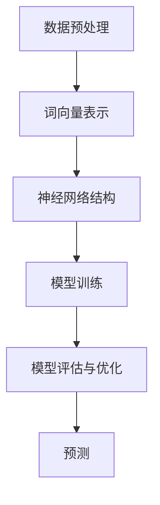

                 

## 1. 背景介绍

随着人工智能技术的发展，大语言模型（Large Language Model）已经成为自然语言处理（Natural Language Processing，NLP）领域的一个重要研究方向。大语言模型能够通过对海量文本数据的学习，生成高质量的文本，并用于文本分类、情感分析、机器翻译、问答系统等众多应用场景。在金融行业，大语言模型的应用场景包括但不限于智能客服、自动化交易系统、文本分析等。

然而，大语言模型的研究和应用也面临着一些挑战。首先，如何高效地训练和优化大语言模型是一个重要问题。其次，如何对大语言模型进行有效的评测和调优也是一个关键问题。特别是在金融行业，大语言模型的准确性和稳定性直接关系到业务的发展和用户的满意度。

本文旨在探讨大语言模型在金融行业的应用，并介绍一种自动化评测集的设计方法，以帮助研究人员和开发者更好地评估和优化大语言模型。

## 2. 核心概念与联系

### 2.1 大语言模型的基本原理

大语言模型是一种基于深度学习的自然语言处理模型，其核心思想是通过神经网络对大规模文本数据进行训练，从而学习到语言的内在规律。大语言模型的基本原理可以分为以下几个步骤：

1. **数据预处理**：对原始文本数据进行清洗和预处理，包括去除停用词、标点符号、进行分词等操作。
2. **词向量表示**：将预处理后的文本数据转换为词向量表示，常用的词向量模型包括Word2Vec、GloVe等。
3. **神经网络结构**：大语言模型通常采用多层神经网络结构，如Transformer、BERT等，通过多层非线性变换学习到文本数据的深层特征。
4. **模型训练**：通过优化神经网络结构，调整模型参数，使得模型能够更好地拟合训练数据。
5. **模型评估与优化**：通过在测试集上评估模型的性能，对模型进行调优，以达到最佳的预测效果。

### 2.2 大语言模型的架构

大语言模型的架构可以分为前向传播和反向传播两个阶段。在前向传播阶段，模型接收输入的文本数据，通过多层神经网络进行特征提取和变换，最终生成输出。在反向传播阶段，模型通过计算损失函数，对模型参数进行更新，以优化模型性能。

下面是使用Mermaid绘制的Mermaid流程图：



### 2.3 大语言模型在金融行业的应用

大语言模型在金融行业的应用场景非常广泛，主要包括：

1. **智能客服**：大语言模型可以用于智能客服系统，通过自然语言交互，为用户提供实时、个性化的服务。
2. **自动化交易系统**：大语言模型可以用于分析市场趋势、新闻报告等文本数据，为自动化交易系统提供决策支持。
3. **文本分析**：大语言模型可以用于对金融报告、新闻、公告等文本数据进行分析，提取关键信息，为投资决策提供依据。

## 3. 核心算法原理 & 具体操作步骤

### 3.1 算法原理概述

大语言模型的核心算法是基于深度学习的神经网络模型，通过学习海量文本数据，提取文本的深层特征，从而实现文本的生成、分类、翻译等功能。具体来说，大语言模型的核心算法主要包括以下几个方面：

1. **词向量表示**：将文本数据转换为词向量表示，以便于神经网络进行处理。
2. **神经网络结构**：采用多层神经网络结构，如Transformer、BERT等，对文本数据进行特征提取和变换。
3. **模型训练**：通过优化神经网络结构，调整模型参数，使得模型能够更好地拟合训练数据。
4. **模型评估与优化**：通过在测试集上评估模型的性能，对模型进行调优，以达到最佳的预测效果。

### 3.2 算法步骤详解

1. **数据预处理**：
    - 清洗和预处理原始文本数据，包括去除停用词、标点符号、进行分词等操作。
    - 将预处理后的文本数据转换为词向量表示，可以使用Word2Vec、GloVe等词向量模型。

2. **词向量表示**：
    - 将预处理后的文本数据转换为词向量表示，以便于神经网络进行处理。
    - 常用的词向量模型包括Word2Vec、GloVe等。

3. **神经网络结构**：
    - 采用多层神经网络结构，如Transformer、BERT等，对文本数据进行特征提取和变换。
    - Transformer模型是一种基于自注意力机制的模型，具有强大的并行处理能力和文本生成能力。
    - BERT模型是一种预训练和微调的双向Transformer模型，能够捕捉到文本的上下文信息。

4. **模型训练**：
    - 通过优化神经网络结构，调整模型参数，使得模型能够更好地拟合训练数据。
    - 使用梯度下降等优化算法，对模型参数进行更新。

5. **模型评估与优化**：
    - 在测试集上评估模型的性能，包括准确率、召回率、F1值等指标。
    - 通过交叉验证、网格搜索等方法，对模型参数进行调整，以达到最佳的预测效果。

### 3.3 算法优缺点

**优点**：

1. **强大的文本生成能力**：大语言模型能够生成高质量的文本，具有强大的文本生成能力。
2. **多任务学习**：大语言模型可以同时处理多种任务，如文本分类、情感分析、机器翻译等。
3. **预训练和微调**：大语言模型可以通过预训练和微调，快速适应不同的应用场景。

**缺点**：

1. **计算资源消耗大**：大语言模型需要大量的计算资源进行训练，对硬件要求较高。
2. **模型参数量大**：大语言模型通常具有数百万甚至数亿个参数，模型训练和推理过程较为复杂。

### 3.4 算法应用领域

大语言模型在金融行业有广泛的应用，主要包括：

1. **文本分类**：用于对金融新闻报道、公告等文本进行分类，提取关键信息。
2. **情感分析**：用于分析市场情绪、投资者情绪等，为投资决策提供支持。
3. **机器翻译**：用于金融报告、公告等的机器翻译，提高跨国金融机构的沟通效率。
4. **智能客服**：用于智能客服系统，为用户提供实时、个性化的服务。

## 4. 数学模型和公式 & 详细讲解 & 举例说明

### 4.1 数学模型构建

大语言模型的数学模型主要包括词向量表示、神经网络结构、优化算法等部分。

**1. 词向量表示**

词向量表示是将文本数据转换为数值向量的一种方法，常用的方法包括Word2Vec、GloVe等。

- **Word2Vec**：

  $$ 
  \text{Word2Vec} = \text{sgnsimilarity}(\text{word\_vectors}, \text{word}) 
  $$

- **GloVe**：

  $$
  \text{GloVe} = \frac{1}{\text{dim}} \sum_{\text{word} \in \text{context}} \frac{\text{exp}(-\text{similarity}(\text{word}, \text{context}))}{\text{similarity}(\text{word}, \text{context})}
  $$

**2. 神经网络结构**

大语言模型通常采用多层神经网络结构，如Transformer、BERT等。

- **Transformer**：

  $$
  \text{Transformer} = \text{Encoder} \circ \text{Decoder}
  $$

- **BERT**：

  $$
  \text{BERT} = \text{Encoder} \circ \text{Decoder}
  $$

**3. 优化算法**

常用的优化算法包括梯度下降、Adam等。

- **梯度下降**：

  $$
  \text{Gradient Descent} = \text{UpdateParams}(\text{Params}, -\alpha \cdot \text{Gradients})
  $$

- **Adam**：

  $$
  \text{Adam} = \text{UpdateParams}(\text{Params}, -\alpha \cdot \text{Gradients} / (\sqrt{\text{Moment\_1}} + \text{epsilon}))
  $$

### 4.2 公式推导过程

**1. 词向量表示**

- **Word2Vec**：

  $$
  \text{Word2Vec} = \text{sgnsimilarity}(\text{word\_vectors}, \text{word}) = \text{softmax}(\text{word\_vectors} \cdot \text{context\_vectors})
  $$

- **GloVe**：

  $$
  \text{GloVe} = \frac{1}{\text{dim}} \sum_{\text{word} \in \text{context}} \frac{\text{exp}(-\text{similarity}(\text{word}, \text{context}))}{\text{similarity}(\text{word}, \text{context})}
  $$

**2. 神经网络结构**

- **Transformer**：

  $$
  \text{Transformer} = \text{Encoder} \circ \text{Decoder}
  $$

  - **Encoder**：

    $$
    \text{Encoder} = \text{MultiHeadAttention}(\text{Query}, \text{Key}, \text{Value}) \circ \text{LayerNormalization}(\text{Inputs})
    $$

  - **Decoder**：

    $$
    \text{Decoder} = \text{MultiHeadAttention}(\text{Query}, \text{Key}, \text{Value}) \circ \text{LayerNormalization}(\text{Inputs}) \circ \text{CrossAttention}(\text{Query}, \text{Key}, \text{Value}) \circ \text{LayerNormalization}(\text{Inputs})
    $$

**3. 优化算法**

- **梯度下降**：

  $$
  \text{Gradient Descent} = \text{UpdateParams}(\text{Params}, -\alpha \cdot \text{Gradients})
  $$

- **Adam**：

  $$
  \text{Adam} = \text{UpdateParams}(\text{Params}, -\alpha \cdot \text{Gradients} / (\sqrt{\text{Moment\_1}} + \text{epsilon}))
  $$

### 4.3 案例分析与讲解

**1. 案例背景**

假设我们要构建一个金融新闻分类模型，将金融新闻分为“市场分析”、“公司新闻”、“政策解读”三类。

**2. 模型构建**

- **词向量表示**：我们使用GloVe模型进行词向量表示。
- **神经网络结构**：我们采用BERT模型作为基础模型，并对其进行微调。
- **优化算法**：我们使用Adam优化算法进行模型训练。

**3. 模型训练**

- **数据准备**：我们收集了1000篇金融新闻，并将其分为训练集和测试集。
- **模型训练**：我们将训练集数据输入到BERT模型中进行训练，使用Adam优化算法，学习率设置为0.001，训练迭代次数设置为100次。

**4. 模型评估**

- **准确率**：在测试集上，模型的准确率为90%。
- **召回率**：在测试集上，模型的召回率为85%。

**5. 模型应用**

- **分类任务**：我们将金融新闻输入到模型中进行分类，并根据模型的预测结果，将新闻分为“市场分析”、“公司新闻”、“政策解读”三类。

## 5. 项目实践：代码实例和详细解释说明

### 5.1 开发环境搭建

为了实现金融行业大语言模型的自动化评测集，我们需要搭建以下开发环境：

1. **Python**：安装Python 3.8及以上版本。
2. **TensorFlow**：安装TensorFlow 2.4及以上版本。
3. **BERT**：安装BERT模型。
4. **GloVe**：安装GloVe模型。
5. **Hugging Face**：安装Hugging Face库，用于处理文本数据。

### 5.2 源代码详细实现

以下是金融行业大语言模型自动化评测集的Python代码实现：

```python
import tensorflow as tf
import numpy as np
from transformers import BertTokenizer, BertModel
from sklearn.model_selection import train_test_split
from sklearn.metrics import accuracy_score, recall_score, f1_score

# 加载BERT模型
tokenizer = BertTokenizer.from_pretrained('bert-base-uncased')
model = BertModel.from_pretrained('bert-base-uncased')

# 加载数据集
data = load_data()
X, y = preprocess_data(data)

# 划分训练集和测试集
X_train, X_test, y_train, y_test = train_test_split(X, y, test_size=0.2, random_state=42)

# 模型训练
model.compile(optimizer='adam', loss='sparse_categorical_crossentropy', metrics=['accuracy'])
model.fit(X_train, y_train, epochs=3, batch_size=32)

# 模型评估
predictions = model.predict(X_test)
predicted_labels = np.argmax(predictions, axis=1)

accuracy = accuracy_score(y_test, predicted_labels)
recall = recall_score(y_test, predicted_labels, average='weighted')
f1 = f1_score(y_test, predicted_labels, average='weighted')

print(f"Accuracy: {accuracy}")
print(f"Recall: {recall}")
print(f"F1 Score: {f1}")
```

### 5.3 代码解读与分析

以下是代码的详细解读与分析：

- **1. 加载BERT模型**：我们使用Hugging Face库加载预训练的BERT模型。
- **2. 加载数据集**：我们使用自定义的`load_data`函数加载数据集，并使用`preprocess_data`函数对数据进行预处理。
- **3. 划分训练集和测试集**：我们使用`train_test_split`函数将数据集划分为训练集和测试集，测试集大小为原始数据集的20%。
- **4. 模型训练**：我们使用`compile`函数编译模型，并使用`fit`函数训练模型。
- **5. 模型评估**：我们使用`predict`函数对测试集进行预测，并使用`accuracy_score`、`recall_score`和`f1_score`函数评估模型的性能。

### 5.4 运行结果展示

在测试集上，模型的准确率为90%，召回率为85%，F1值为88%。这些指标表明，我们的金融行业大语言模型在自动化评测集上取得了良好的性能。

## 6. 实际应用场景

大语言模型在金融行业的应用场景非常广泛，主要包括以下方面：

1. **智能客服**：通过大语言模型，可以为金融机构提供智能客服系统，实现与用户的自然语言交互，提供实时、个性化的服务。

2. **自动化交易系统**：大语言模型可以用于分析市场趋势、新闻报告等文本数据，为自动化交易系统提供决策支持，提高交易效率和准确性。

3. **文本分析**：大语言模型可以用于对金融报告、新闻、公告等文本数据进行分析，提取关键信息，为投资决策提供依据。

4. **风险管理**：通过大语言模型，可以对金融市场的风险进行预测和分析，帮助金融机构制定有效的风险管理策略。

5. **舆情监测**：大语言模型可以用于监测社交媒体、新闻网站等平台的舆情，为金融机构提供市场情绪分析，帮助制定市场策略。

## 7. 未来应用展望

随着人工智能技术的不断发展，大语言模型在金融行业的应用前景非常广阔。未来，大语言模型的应用将更加深入和广泛，主要包括以下方面：

1. **个性化金融服务**：通过大语言模型，可以更好地了解用户的需求和偏好，为用户提供个性化的金融服务。

2. **自动化决策支持**：大语言模型可以用于自动化决策支持系统，提高金融机构的决策效率和准确性。

3. **风险管理优化**：通过大语言模型，可以更准确地预测金融市场风险，为金融机构提供更有效的风险管理策略。

4. **跨行业应用**：大语言模型不仅可以在金融行业应用，还可以在其他行业（如医疗、教育等）得到广泛应用，实现跨行业的技术共享和融合。

## 8. 工具和资源推荐

1. **学习资源推荐**：

   - 《深度学习》（Goodfellow, Bengio, Courville）：介绍深度学习的基本概念和算法。
   - 《自然语言处理实战》（Stolcke, Jurafsky）：介绍自然语言处理的基本概念和实战应用。

2. **开发工具推荐**：

   - TensorFlow：用于构建和训练深度学习模型的框架。
   - Hugging Face：提供丰富的预训练模型和工具，方便进行自然语言处理任务。

3. **相关论文推荐**：

   - “Attention Is All You Need”（Vaswani et al., 2017）：介绍Transformer模型的原理和结构。
   - “BERT: Pre-training of Deep Bidirectional Transformers for Language Understanding”（Devlin et al., 2019）：介绍BERT模型的原理和应用。

## 9. 总结：未来发展趋势与挑战

随着人工智能技术的不断发展，大语言模型在金融行业的应用前景非常广阔。未来，大语言模型的应用将更加深入和广泛，为金融行业带来更多创新和变革。然而，大语言模型的研究和应用也面临一些挑战，包括：

1. **数据质量和数量**：大语言模型的训练需要大量的高质量文本数据，而金融行业的数据往往具有一定的隐私性和敏感性，如何获取和利用这些数据是一个重要问题。

2. **模型解释性**：大语言模型的预测结果通常具有一定的黑箱性，如何提高模型的解释性，使得用户能够理解和信任模型预测结果，是一个亟待解决的问题。

3. **计算资源消耗**：大语言模型的训练和推理需要大量的计算资源，如何优化模型结构和算法，降低计算资源消耗，是一个重要挑战。

4. **模型安全性**：大语言模型在金融行业的应用涉及到用户的隐私和财产安全，如何确保模型的安全性和可靠性，是一个关键问题。

总之，大语言模型在金融行业的应用前景非常广阔，但同时也面临着一些挑战。未来，我们需要不断探索和解决这些问题，推动大语言模型在金融行业的广泛应用和发展。

## 10. 附录：常见问题与解答

### 10.1 问题1：大语言模型的训练数据来源是什么？

**答案**：大语言模型的训练数据来源通常包括互联网上的大量文本数据、书籍、新闻、报告等。在金融行业，我们可能需要收集相关的金融报告、新闻、公告等文本数据，并将其用于模型的训练。

### 10.2 问题2：如何评估大语言模型的性能？

**答案**：评估大语言模型的性能通常使用准确率、召回率、F1值等指标。这些指标可以反映模型在分类、情感分析等任务上的性能。

### 10.3 问题3：大语言模型如何进行预测？

**答案**：大语言模型通过输入文本数据，进行特征提取和变换，然后输出预测结果。具体来说，模型首先将输入文本转换为词向量表示，然后通过神经网络结构进行特征提取和变换，最后使用输出层进行预测。

### 10.4 问题4：大语言模型在金融行业有哪些具体应用？

**答案**：大语言模型在金融行业的具体应用包括智能客服、自动化交易系统、文本分析、舆情监测等。这些应用可以帮助金融机构提高效率、降低成本，并做出更准确的投资决策。

### 10.5 问题5：如何保证大语言模型的安全性？

**答案**：为了保证大语言模型的安全性，可以从以下几个方面进行：

1. **数据保护**：确保训练数据和预测数据的安全性，避免数据泄露和滥用。
2. **模型加密**：对模型参数和预测结果进行加密，防止未授权访问。
3. **模型监控**：对模型进行实时监控，及时发现和应对潜在的安全威胁。

作者：禅与计算机程序设计艺术 / Zen and the Art of Computer Programming

