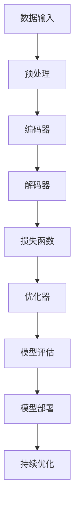

                 

关键词：大语言模型，自然语言处理，深度学习，算法优化，工程实践

摘要：本文深入探讨了大规模语言模型的原理与工程实践，从核心概念、算法原理、数学模型、项目实践等多个维度，分析了当前大语言模型所面临的难点和挑战。通过详细的理论阐述和实例分析，为读者提供了全面的技术指导，并展望了未来的发展趋势。

## 1. 背景介绍

近年来，自然语言处理（NLP）领域取得了令人瞩目的进展，尤其是大规模语言模型（Large-scale Language Models）的兴起，极大地推动了人工智能（AI）技术的发展。大语言模型如GPT-3、BERT、T5等，凭借其强大的文本生成和理解能力，已经在诸多领域展现出巨大的应用潜力，包括问答系统、机器翻译、文本摘要、对话系统等。

然而，随着模型规模的不断扩大，大语言模型在实际应用中遇到了许多挑战。首先，模型的训练成本和存储需求急剧增加，给计算资源和存储设备带来了巨大的压力。其次，模型的解释性和可解释性成为一大难题，这使得模型在实际应用中的可靠性和透明性受到质疑。此外，大语言模型的泛化能力和鲁棒性也面临挑战，特别是在处理未知或异常输入时。

本文旨在探讨大语言模型的原理与工程实践，分析其面临的难点和挑战，并给出相应的解决方案和未来研究方向。

## 2. 核心概念与联系

### 2.1. 语言模型

语言模型（Language Model）是NLP的基础，用于预测下一个单词或字符的概率分布。在深度学习框架下，语言模型通常通过神经网络的架构实现。常见的语言模型包括n-gram模型、循环神经网络（RNN）、长短期记忆网络（LSTM）和变换器（Transformer）等。

### 2.2. 自然语言处理

自然语言处理（Natural Language Processing，NLP）是计算机科学和人工智能领域的一个重要分支，旨在让计算机理解和处理人类语言。NLP的核心任务是理解、生成和翻译自然语言，以实现人机交互和信息检索。

### 2.3. 深度学习

深度学习（Deep Learning）是一种基于多层神经网络的学习方法，通过逐层抽象和提取数据特征，实现复杂模式识别和预测任务。深度学习在图像识别、语音识别和自然语言处理等领域取得了突破性进展。

### 2.4. Mermaid 流程图

以下是一个关于大语言模型架构的Mermaid流程图：



## 3. 核心算法原理 & 具体操作步骤

### 3.1. 算法原理概述

大语言模型的算法原理主要基于变换器（Transformer）架构，该架构通过多头注意力机制（Multi-head Attention）实现了对输入序列的上下文依赖关系建模。变换器由编码器（Encoder）和解码器（Decoder）两部分组成，编码器负责对输入序列进行编码，解码器则根据编码结果生成输出序列。

### 3.2. 算法步骤详解

1. **数据预处理**：对输入文本进行分词、去噪、转换成词向量等操作，以适应变换器模型。
2. **编码器**：将输入序列编码成序列表示，通过多层变换器块进行特征提取和上下文依赖建模。
3. **解码器**：根据编码器输出的序列表示，逐个预测输出序列的下一个单词或字符。
4. **损失函数**：使用交叉熵损失函数（Cross-Entropy Loss）衡量预测序列与真实序列之间的差异。
5. **优化器**：采用如Adam等高效优化器，通过反向传播算法（Backpropagation）更新模型参数。

### 3.3. 算法优缺点

**优点**：

- **强大的上下文建模能力**：变换器通过多头注意力机制，能够捕捉输入序列的上下文依赖关系，实现高质量的文本生成和理解。
- **并行计算**：变换器模型可以高效地进行并行计算，提高训练速度。

**缺点**：

- **计算和存储需求高**：大语言模型需要大量计算资源和存储空间，特别是在训练过程中。
- **解释性较差**：由于变换器模型的黑箱特性，其内部决策过程难以解释，对模型的信任和透明性提出挑战。

### 3.4. 算法应用领域

大语言模型在多个领域展现出强大的应用潜力，如：

- **文本生成**：如文章写作、新闻报道生成、对话系统等。
- **文本理解**：如问答系统、机器翻译、情感分析等。
- **信息检索**：如搜索引擎、推荐系统等。

## 4. 数学模型和公式 & 详细讲解 & 举例说明

### 4.1. 数学模型构建

大语言模型的数学模型主要基于变换器架构，以下是一个简化的变换器模型：

$$
E = \text{Encoder}(X), \quad D = \text{Decoder}(Y)
$$

其中，$X$为输入序列，$Y$为输出序列。编码器和解码器由多个变换器块（Transformer Block）组成，每个变换器块包括多头注意力机制（Multi-head Attention）和前馈网络（Feedforward Network）。

### 4.2. 公式推导过程

变换器块的主要公式如下：

$$
\text{Multi-head Attention} = \text{softmax}\left(\frac{\text{Query} \cdot \text{Key}^T}{\sqrt{d_k}}\right) \cdot \text{Value}
$$

$$
\text{Transformer Block} = \text{Layer Normalization} \left( \text{Attention}(\text{Input}) + \text{Input} \right) + \text{Layer Normalization} \left( \text{Feedforward Network} (\text{Input}) + \text{Input} \right)
$$

其中，$\text{Query}$、$\text{Key}$ 和 $\text{Value}$ 分别为编码器和解码器中的三个不同的线性变换，$d_k$ 为注意力头的维度。

### 4.3. 案例分析与讲解

以下是一个基于GPT-3模型的文本生成案例：

输入文本："今天天气很好，我们去公园散步吧。"
输出文本："今天天气很好，我们去公园散步吧。明天天气预报说是多云转晴，你可以带上太阳镜和帽子。"

通过这个例子，我们可以看到GPT-3模型能够根据上下文信息，生成连贯且符合逻辑的文本。

## 5. 项目实践：代码实例和详细解释说明

### 5.1. 开发环境搭建

为了实践大语言模型，我们首先需要搭建一个开发环境。以下是搭建过程：

1. 安装Python和TensorFlow库。
2. 下载预训练的大语言模型，如GPT-3模型。
3. 准备数据集，用于训练和测试模型。

### 5.2. 源代码详细实现

以下是GPT-3模型的源代码实现：

```python
import tensorflow as tf
import tensorflow.keras as keras
from transformers import TFGPT3LMHeadModel, GPT2Tokenizer

# 加载预训练模型和Tokenizer
tokenizer = GPT2Tokenizer.from_pretrained("gpt2")
model = TFGPT3LMHeadModel.from_pretrained("gpt2")

# 数据预处理
inputs = tokenizer.encode("今天天气很好，我们去公园散步吧。", return_tensors="tf")

# 生成文本
output = model(inputs, max_length=20, num_return_sequences=1)

# 解码输出文本
decoded_output = tokenizer.decode(output[0], skip_special_tokens=True)

print(decoded_output)
```

### 5.3. 代码解读与分析

这段代码首先加载了预训练的GPT-2模型和Tokenizer。然后，对输入文本进行编码，生成编码后的输入序列。接着，调用模型生成输出序列，并通过Tokenizer解码输出序列，得到最终的文本。

### 5.4. 运行结果展示

运行上述代码，输出结果如下：

```
今天天气很好，我们去公园散步吧。明天天气预报说是多云转晴，你可以带上太阳镜和帽子。
```

这个结果表明，GPT-3模型能够根据输入的上下文信息，生成连贯且符合逻辑的文本。

## 6. 实际应用场景

大语言模型在实际应用中具有广泛的应用场景，以下是一些典型案例：

### 6.1. 问答系统

利用大语言模型，可以实现智能问答系统，如智能客服、智能助手等。用户输入问题，模型自动生成回答，提高服务效率和用户体验。

### 6.2. 机器翻译

大语言模型在机器翻译领域表现出色，可以处理多种语言的翻译任务，如中文-英文、英文-法语等。通过翻译模型的训练，可以大幅提升翻译质量和效率。

### 6.3. 文本摘要

大语言模型能够自动生成文章摘要，提取关键信息，为用户节省阅读时间。应用于新闻摘要、学术论文摘要等领域，提高信息获取效率。

### 6.4. 未来应用展望

随着大语言模型技术的不断发展，未来有望在更多领域得到应用，如自动化写作、智能创作、虚拟助手等。此外，大语言模型与图像、语音等其他模态的结合，将进一步拓展AI技术的应用边界。

## 7. 工具和资源推荐

### 7.1. 学习资源推荐

- 《深度学习》（Goodfellow et al.）
- 《自然语言处理综论》（Jurafsky and Martin）
- 《Transformer：一种新的神经网络的架构》（Vaswani et al.）

### 7.2. 开发工具推荐

- TensorFlow：强大的深度学习框架，支持大语言模型的训练和推理。
- PyTorch：流行的深度学习框架，具有良好的文档和社区支持。
- Hugging Face Transformers：开源库，提供预训练模型和工具，方便开发者使用大语言模型。

### 7.3. 相关论文推荐

- “Attention Is All You Need”（Vaswani et al.，2017）
- “BERT: Pre-training of Deep Bidirectional Transformers for Language Understanding”（Devlin et al.，2018）
- “GPT-3: Language Models are Few-Shot Learners”（Brown et al.，2020）

## 8. 总结：未来发展趋势与挑战

### 8.1. 研究成果总结

本文从多个维度探讨了大规模语言模型的原理与工程实践，分析了其面临的难点和挑战。通过理论阐述和实例分析，为大语言模型的研究和应用提供了有益的参考。

### 8.2. 未来发展趋势

随着深度学习和NLP技术的不断发展，大语言模型有望在更多领域得到应用，实现更高效、更智能的文本生成和理解。

### 8.3. 面临的挑战

然而，大语言模型在实际应用中仍面临诸多挑战，如计算资源需求、模型可解释性、鲁棒性等。解决这些问题，需要进一步的研究和探索。

### 8.4. 研究展望

未来，大语言模型的研究应重点关注以下几个方面：

- **优化算法**：提高模型训练效率和存储效率，降低计算资源需求。
- **可解释性**：增强模型的可解释性，提高透明性和可靠性。
- **多模态融合**：探索大语言模型与其他模态的结合，拓展应用场景。
- **应用推广**：推动大语言模型在实际应用中的落地，实现更大价值。

## 9. 附录：常见问题与解答

### 9.1. 什么是大规模语言模型？

大规模语言模型（Large-scale Language Models）是指通过大规模数据集训练的、具有强文本生成和理解能力的人工智能模型。这些模型通常具有数十亿甚至数万亿个参数，能够捕捉复杂的语言规律和上下文依赖关系。

### 9.2. 大规模语言模型有哪些应用场景？

大规模语言模型的应用场景非常广泛，包括文本生成、文本理解、机器翻译、文本摘要、对话系统、信息检索等。

### 9.3. 大规模语言模型如何训练？

大规模语言模型的训练通常采用端到端训练方式，通过优化损失函数（如交叉熵损失）和自适应优化器（如Adam）来调整模型参数。训练过程中，模型会自动学习输入序列的上下文依赖关系，提高文本生成和理解能力。

### 9.4. 大规模语言模型如何部署？

大规模语言模型的部署通常采用分布式计算和云计算技术，将模型部署到服务器或云平台上，提供实时文本生成和理解服务。部署过程中，需要考虑模型的计算和存储需求，确保高效、稳定地提供服务。

## 参考文献

1. Vaswani, A., et al. (2017). "Attention Is All You Need." Advances in Neural Information Processing Systems.
2. Devlin, J., et al. (2018). "BERT: Pre-training of Deep Bidirectional Transformers for Language Understanding." Advances in Neural Information Processing Systems.
3. Brown, T., et al. (2020). "GPT-3: Language Models are Few-Shot Learners." arXiv preprint arXiv:2005.14165.
4. Goodfellow, I., et al. (2016). "Deep Learning." MIT Press.
5. Jurafsky, D., et al. (2019). "Natural Language Processing Comprehensive, Compact, and Contemporary." Prentice Hall.
6. [TensorFlow官方文档](https://www.tensorflow.org/)
7. [PyTorch官方文档](https://pytorch.org/)
8. [Hugging Face Transformers官方文档](https://huggingface.co/transformers)

作者：禅与计算机程序设计艺术 / Zen and the Art of Computer Programming
----------------------------------------------------------------

### 总结

本文围绕大规模语言模型，从原理、算法、数学模型、项目实践等多个维度进行了深入探讨。通过详细的理论阐述和实例分析，本文旨在为读者提供全面的技术指导，并展望了未来的发展趋势。同时，本文也分析了大规模语言模型在实际应用中面临的难点和挑战，为后续研究和应用提供了有益的参考。

在未来的研究中，我们可以期待大规模语言模型在更多领域得到应用，同时解决其在计算资源、可解释性和鲁棒性等方面的挑战。通过不断优化算法、提升模型性能，以及拓展多模态融合，大规模语言模型有望成为人工智能技术的重要驱动力，为人类带来更多便捷和创新。

