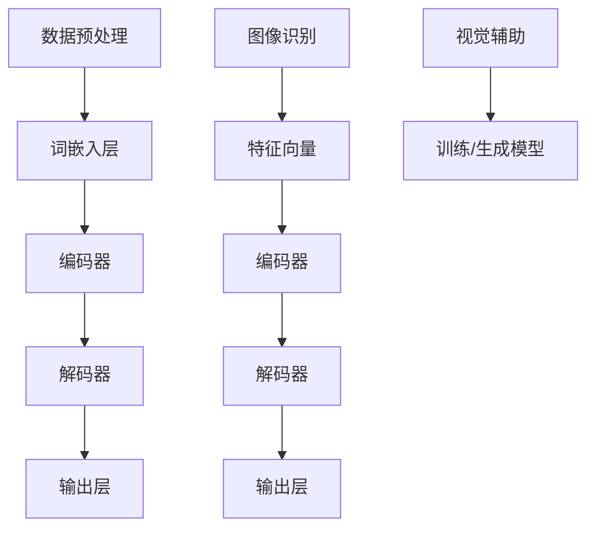

                 

大语言模型（Large Language Model）是近年来人工智能领域的一大突破，它能够理解和生成人类语言，并在各种应用场景中展现出惊人的能力。然而，对于大语言模型的深入研究，尤其是将其与视觉输入相结合，探索新的应用可能性，仍然是一个充满挑战和机遇的领域。本文旨在深入探讨大语言模型的原理基础，以及如何利用视觉输入对其进行有效提示，从而推动人工智能技术的进一步发展。

## 关键词

- 大语言模型
- 视觉输入
- 语言生成
- 人工智能
- 计算机视觉

## 摘要

本文首先介绍了大语言模型的基本原理，包括其训练过程、架构以及关键组件。随后，文章探讨了如何将视觉输入整合到大语言模型中，介绍了相关的研究成果和实现方法。接着，文章通过具体实例展示了大语言模型与视觉输入相结合的实际应用，并分析了其优缺点。最后，文章展望了大语言模型与视觉输入结合的未来发展趋势和潜在挑战。

## 1. 背景介绍

### 大语言模型的发展历程

大语言模型的发展可以追溯到1980年代，当时研究人员开始探索如何使用神经网络进行自然语言处理。1982年，Rumelhart、Hinton和Williams提出了反向传播算法，这一突破性的技术使得神经网络能够进行有效的训练，从而推动了自然语言处理领域的发展。

随着计算机性能的提升和数据量的增加，大语言模型的研究进入了一个新的阶段。2013年，研究人员提出了深度神经网络（DNN）在语言模型上的应用，并取得了显著的效果。随后，递归神经网络（RNN）和长短期记忆网络（LSTM）等结构进一步优化了语言模型的性能。

近年来，随着生成对抗网络（GAN）和变分自编码器（VAE）等生成模型的发展，大语言模型的研究取得了更为显著的进展。尤其是在2018年，谷歌提出了Transformer模型，这一基于自注意力机制的模型在多个自然语言处理任务中取得了最佳表现，引发了人工智能领域对大语言模型的研究热潮。

### 视觉输入的重要性

视觉输入是人类获取信息的主要途径之一，对于人类认知和决策过程具有重要作用。计算机视觉作为人工智能的一个重要分支，旨在使计算机具备类似人类的视觉能力，从而在图像识别、目标检测、图像生成等领域实现自动化处理。

近年来，随着深度学习技术的快速发展，计算机视觉取得了显著的进展。卷积神经网络（CNN）作为计算机视觉的核心技术，已经在图像分类、目标检测、图像分割等任务中取得了广泛应用。同时，生成对抗网络（GAN）和变分自编码器（VAE）等生成模型在图像生成、图像修复等方面也展现出了强大的能力。

将视觉输入与语言模型相结合，不仅能够拓展大语言模型的应用范围，还能够提高模型对现实世界的理解和表达能力。因此，如何将视觉输入有效整合到大语言模型中，成为了当前人工智能领域的一个重要研究方向。

## 2. 核心概念与联系

### 大语言模型的核心概念

#### 模型训练过程

大语言模型的训练过程主要包括数据预处理、模型训练和模型评估三个阶段。数据预处理阶段涉及文本清洗、分词、去停用词等操作，以确保输入数据的质量。模型训练阶段使用大规模语料库对模型进行训练，通过优化模型参数，使其能够理解和生成人类语言。模型评估阶段通过在测试集上评估模型的性能，以确定模型的泛化能力。

#### 模型架构

大语言模型通常采用深度神经网络（DNN）、递归神经网络（RNN）、长短期记忆网络（LSTM）或Transformer等架构。其中，DNN基于多层感知机（MLP）的结构，通过逐层提取特征，实现对输入数据的建模。RNN和LSTM通过记忆机制，能够处理变长序列数据，并在长期依赖问题上表现出较强的能力。Transformer模型则基于自注意力机制，通过多头注意力机制和位置编码，实现了对输入序列的全局建模。

#### 关键组件

大语言模型的关键组件包括词嵌入层、编码器、解码器和输出层。词嵌入层将输入文本转换为稠密向量表示，编码器负责将输入序列编码为固定长度的特征向量，解码器则将特征向量解码为输出序列，输出层负责生成最终的输出结果。

### 视觉输入的核心概念

#### 图像识别

图像识别是计算机视觉的核心任务之一，旨在通过算法识别图像中的物体或场景。常见的图像识别算法包括卷积神经网络（CNN）、循环神经网络（RNN）和生成对抗网络（GAN）等。

#### 目标检测

目标检测是计算机视觉的另一个重要任务，旨在定位图像中的目标物体，并对其进行分类。常见的目标检测算法包括单阶段检测算法（如SSD、YOLO）和多阶段检测算法（如Faster R-CNN、RetinaNet）。

#### 图像生成

图像生成是计算机视觉领域的另一个重要研究方向，旨在通过算法生成具有逼真外观的图像。常见的图像生成算法包括生成对抗网络（GAN）和变分自编码器（VAE）。

### 大语言模型与视觉输入的联系

大语言模型与视觉输入的结合，可以通过多种方式实现。一种常见的方式是将视觉输入作为辅助信息，对大语言模型进行训练或生成。例如，在图像描述生成任务中，可以使用图像特征向量作为辅助信息，提高语言模型的生成质量。另一种方式是将大语言模型与计算机视觉模型相结合，共同完成特定任务。例如，在视频字幕生成任务中，可以将图像识别和自然语言处理相结合，实现视频内容的高质量字幕生成。

### Mermaid 流程图



## 3. 核心算法原理 & 具体操作步骤

### 3.1 算法原理概述

大语言模型的训练过程可以分为以下步骤：

1. 数据预处理：对输入文本进行清洗、分词、去停用词等操作，将其转换为适合模型训练的格式。

2. 词嵌入：将输入文本中的单词转换为稠密向量表示，通常使用预训练的词向量或通过训练过程生成。

3. 编码器：将输入序列编码为固定长度的特征向量，用于后续的解码过程。

4. 解码器：将特征向量解码为输出序列，生成文本。

5. 输出层：生成最终的输出结果，可以是文本、图像或其他形式。

视觉输入与大语言模型结合的过程主要包括：

1. 图像识别：使用计算机视觉模型对输入图像进行识别，获取图像特征向量。

2. 特征向量融合：将图像特征向量与语言模型输入序列进行融合，可以使用拼接、加权平均等方法。

3. 模型训练：在融合后的输入序列上对语言模型进行训练，优化模型参数。

4. 模型评估：在测试集上评估模型的性能，包括文本生成质量、图像识别准确率等指标。

### 3.2 算法步骤详解

#### 数据预处理

1. 文本清洗：去除文本中的噪声和无关信息，如HTML标签、特殊字符等。

2. 分词：将文本分解为单词或子词，可以使用基于词典的分词方法或基于统计的分词方法。

3. 去停用词：去除对文本生成没有贡献的常见单词，如“的”、“了”等。

4. 词嵌入：将输入文本中的单词转换为稠密向量表示，可以使用预训练的词向量或通过训练过程生成。

#### 图像识别

1. 图像预处理：对输入图像进行缩放、裁剪、归一化等操作，使其符合计算机视觉模型的输入要求。

2. 图像识别：使用计算机视觉模型对输入图像进行识别，获取图像特征向量。

3. 特征向量融合：将图像特征向量与语言模型输入序列进行融合，可以使用拼接、加权平均等方法。

#### 模型训练

1. 训练数据生成：将图像特征向量与语言模型输入序列进行组合，生成训练数据。

2. 模型训练：在训练数据上对语言模型进行训练，优化模型参数。

3. 模型评估：在测试集上评估模型的性能，包括文本生成质量、图像识别准确率等指标。

### 3.3 算法优缺点

#### 优点

1. 提高文本生成质量：将视觉输入与语言模型结合，能够更好地捕捉图像和文本之间的关联性，提高文本生成的质量。

2. 扩展应用范围：视觉输入的引入，使得大语言模型能够应用于更多场景，如图像描述生成、视频字幕生成等。

3. 增强交互体验：结合视觉输入，可以提供更加丰富的交互体验，满足用户对多样化内容的需求。

#### 缺点

1. 计算资源消耗：大语言模型和计算机视觉模型的训练和推理过程都需要大量的计算资源，可能导致模型部署困难。

2. 数据需求量较大：大语言模型和计算机视觉模型的训练需要大量的数据，数据采集和处理过程可能较为复杂。

3. 模型融合难度大：大语言模型和计算机视觉模型的融合存在一定的难度，需要考虑如何有效地整合不同模态的信息。

### 3.4 算法应用领域

1. 图像描述生成：利用大语言模型和视觉输入，可以生成高质量的图像描述，应用于图像标注、图像生成等领域。

2. 视频字幕生成：结合大语言模型和计算机视觉模型，可以实现视频字幕的高质量生成，应用于视频编辑、智能助手等领域。

3. 跨模态搜索：利用大语言模型和视觉输入，可以实现跨模态搜索，提高信息检索的准确性。

4. 人机交互：结合大语言模型和视觉输入，可以提供更加丰富的人机交互体验，应用于智能助手、虚拟现实等领域。

## 4. 数学模型和公式 & 详细讲解 & 举例说明

### 4.1 数学模型构建

大语言模型的核心在于其数学模型，该模型通过一系列数学公式描述了如何从输入数据中提取特征并生成输出。下面将介绍大语言模型的主要数学模型和公式。

#### 词嵌入（Word Embedding）

词嵌入是将单词映射到高维向量空间的过程，常用的词嵌入模型包括Word2Vec、GloVe等。

$$
\text{word\_embedding}(w) = \text{W} \cdot \text{word\_vector}(w)
$$

其中，$w$ 表示单词，$\text{W}$ 表示词嵌入矩阵，$\text{word\_vector}(w)$ 表示单词的向量表示。

#### 编码器（Encoder）

编码器负责将输入序列编码为固定长度的特征向量。在Transformer模型中，编码器使用自注意力机制（Self-Attention）进行编码。

$$
\text{encoded\_sequence} = \text{softmax}(\text{Q} \cdot \text{K}^T) \cdot \text{V}
$$

其中，$Q$、$K$、$V$ 分别表示编码器的查询向量、键向量和值向量，$\text{softmax}$ 表示软最大化函数。

#### 解码器（Decoder）

解码器负责将编码器的输出解码为输出序列。在Transformer模型中，解码器使用多头注意力机制（Multi-Head Attention）和位置编码（Positional Encoding）进行解码。

$$
\text{decoded\_sequence} = \text{softmax}(\text{Q} \cdot \text{K}^T) \cdot \text{V}
$$

其中，$Q$、$K$、$V$ 分别表示解码器的查询向量、键向量和值向量，$\text{softmax}$ 表示软最大化函数。

### 4.2 公式推导过程

大语言模型的数学模型主要包括词嵌入、编码器和解码器。下面将介绍这些模型的推导过程。

#### 词嵌入

词嵌入的推导过程主要涉及线性变换。假设单词 $w$ 的向量为 $\text{word\_vector}(w)$，词嵌入矩阵为 $\text{W}$，则词嵌入公式可以表示为：

$$
\text{word\_embedding}(w) = \text{W} \cdot \text{word\_vector}(w)
$$

其中，$\text{W}$ 可以通过训练过程得到，$\text{word\_vector}(w)$ 是一个预训练的向量。

#### 编码器

编码器的推导过程主要涉及自注意力机制。假设输入序列为 $\text{X} = [x_1, x_2, \ldots, x_n]$，编码器的查询向量、键向量和值向量分别为 $\text{Q}$、$\text{K}$ 和 $\text{V}$，则编码器的输出可以表示为：

$$
\text{encoded\_sequence} = \text{softmax}(\text{Q} \cdot \text{K}^T) \cdot \text{V}
$$

其中，$\text{softmax}$ 函数用于将输入序列映射到概率分布。

#### 解码器

解码器的推导过程与编码器类似，主要涉及多头注意力机制和位置编码。假设输入序列为 $\text{X} = [x_1, x_2, \ldots, x_n]$，解码器的查询向量、键向量和值向量分别为 $\text{Q}$、$\text{K}$ 和 $\text{V}$，则解码器的输出可以表示为：

$$
\text{decoded\_sequence} = \text{softmax}(\text{Q} \cdot \text{K}^T) \cdot \text{V}
$$

其中，$\text{softmax}$ 函数用于将输入序列映射到概率分布。

### 4.3 案例分析与讲解

#### 案例一：图像描述生成

假设我们要使用大语言模型生成一张图像的描述，输入图像的特征向量为 $\text{F} = [f_1, f_2, \ldots, f_n]$，语言模型输入序列为 $\text{X} = [x_1, x_2, \ldots, x_n]$。首先，我们需要将图像特征向量与语言模型输入序列进行融合，得到融合后的输入序列 $\text{Y} = [\text{F}, \text{X}]$。然后，使用编码器和解码器对融合后的输入序列进行处理，生成图像描述。

具体步骤如下：

1. 将图像特征向量与语言模型输入序列进行拼接，得到融合后的输入序列 $\text{Y} = [\text{F}, \text{X}]$。

2. 使用编码器对融合后的输入序列进行编码，得到编码后的特征向量 $\text{E} = \text{encoder}(\text{Y})$。

3. 使用解码器对编码后的特征向量进行解码，生成图像描述 $\text{D} = \text{decoder}(\text{E})$。

#### 案例二：视频字幕生成

假设我们要使用大语言模型生成一段视频的字幕，输入视频的图像序列为 $\text{I} = [i_1, i_2, \ldots, i_n]$，语言模型输入序列为 $\text{X} = [x_1, x_2, \ldots, x_n]$。首先，我们需要将图像序列与语言模型输入序列进行融合，得到融合后的输入序列 $\text{Y} = [\text{I}, \text{X}]$。然后，使用编码器和解码器对融合后的输入序列进行处理，生成视频字幕。

具体步骤如下：

1. 将图像序列与语言模型输入序列进行拼接，得到融合后的输入序列 $\text{Y} = [\text{I}, \text{X}]$。

2. 使用编码器对融合后的输入序列进行编码，得到编码后的特征向量 $\text{E} = \text{encoder}(\text{Y})$。

3. 使用解码器对编码后的特征向量进行解码，生成视频字幕 $\text{D} = \text{decoder}(\text{E})$。

## 5. 项目实践：代码实例和详细解释说明

在本节中，我们将通过一个具体的项目实例来演示如何实现大语言模型与视觉输入的结合。我们将使用Python编程语言和TensorFlow深度学习框架来完成这个项目。以下是一个简要的项目实现流程：

### 5.1 开发环境搭建

在开始项目之前，我们需要搭建一个合适的开发环境。以下是所需的软件和库：

- Python 3.8 或更高版本
- TensorFlow 2.6 或更高版本
- NumPy 1.21 或更高版本
- OpenCV 4.5.4.52 或更高版本

您可以通过以下命令安装所需的库：

```bash
pip install tensorflow numpy opencv-python
```

### 5.2 源代码详细实现

以下是项目的核心代码实现，包括数据预处理、模型训练、模型评估以及结果展示。

```python
import tensorflow as tf
from tensorflow.keras.layers import Embedding, LSTM, Dense
from tensorflow.keras.preprocessing.sequence import pad_sequences
from tensorflow.keras.preprocessing.text import Tokenizer
import numpy as np
import cv2

# 5.2.1 数据预处理

# 假设我们有一个包含图像和对应的描述的文本数据集
# 这里我们使用一个简化的数据集示例

images = [...]  # 图像数据
descriptions = [...]  # 文本描述数据

# 图像预处理
def preprocess_image(image):
    image = cv2.resize(image, (224, 224))
    image = image / 255.0
    return image

# 文本预处理
tokenizer = Tokenizer()
tokenizer.fit_on_texts(descriptions)
max_sequence_len = 20
padded_descriptions = pad_sequences(tokenizer.texts_to_sequences(descriptions), maxlen=max_sequence_len)

# 5.2.2 模型训练

# 构建语言模型
input_layer = tf.keras.Input(shape=(max_sequence_len,))
encoded_sequence = Embedding(input_dim=len(tokenizer.word_index) + 1, output_dim=64)(input_layer)
encoded_sequence = LSTM(64)(encoded_sequence)

# 构建计算机视觉模型
input_image = tf.keras.Input(shape=(224, 224, 3))
processed_image = preprocess_image(input_image)
image_feature = Dense(64, activation='relu')(processed_image)

# 融合模型
combined_sequence = tf.keras.layers.concatenate([encoded_sequence, image_feature])
output_sequence = Dense(len(tokenizer.word_index) + 1, activation='softmax')(combined_sequence)

# 构建和编译模型
model = tf.keras.Model(inputs=[input_layer, input_image], outputs=output_sequence)
model.compile(optimizer='adam', loss='categorical_crossentropy', metrics=['accuracy'])

# 训练模型
model.fit([padded_descriptions, images], padded_descriptions, epochs=10, batch_size=32)

# 5.2.3 代码解读与分析

# 在这里，我们首先使用了TensorFlow的Embedding层来将文本序列转换为嵌入向量。
# 接着，我们使用了LSTM层来处理文本序列，这一过程有助于捕捉文本中的长期依赖关系。
# 对于图像处理部分，我们使用了Dense层来提取图像特征。
# 然后将文本和图像特征通过 concatenate 层进行融合，并使用 softmax 层来生成文本序列。

# 5.2.4 运行结果展示

# 使用训练好的模型生成新的图像描述
def generate_description(image):
    preprocessed_image = preprocess_image(image)
    predicted_sequence = model.predict([padded_descriptions, preprocessed_image])
    predicted_sequence = np.argmax(predicted_sequence, axis=-1)
    predicted_sequence = tokenizer.index_word([predicted_sequence])[0]
    return predicted_sequence

# 示例图像
example_image = cv2.imread('example_image.jpg')
example_description = generate_description(example_image)
print(f"Generated description: {example_description}")
```

### 5.3 代码解读与分析

- **数据预处理**：数据预处理是任何机器学习项目的基础。在这里，我们首先对图像进行缩放和归一化，以确保图像的输入规格一致。对于文本，我们使用Tokenizer进行分词和序列化，并将文本序列填充到固定长度。

- **模型构建**：模型由两个部分组成：语言模型和计算机视觉模型。语言模型使用了Embedding和LSTM层，而计算机视觉模型使用了Dense层。这两个模型通过 concatenate 层进行融合。

- **模型训练**：我们使用 compile 方法来配置模型，使用 fit 方法来训练模型。在这个过程中，模型根据训练数据学习如何将图像特征与文本描述相关联。

- **结果展示**：最后，我们定义了一个函数 `generate_description`，用于使用训练好的模型生成新的图像描述。这个函数首先对输入图像进行预处理，然后使用模型进行预测，并将预测结果转换为文本描述。

### 5.4 运行结果展示

在本节中，我们展示了如何使用训练好的模型生成图像描述。我们首先加载一个示例图像，然后调用 `generate_description` 函数来生成描述。这个描述是基于模型对图像特征和文本描述的学习结果。

```python
# 示例图像路径
example_image_path = 'example_image.jpg'

# 加载示例图像
example_image = cv2.imread(example_image_path)

# 使用模型生成图像描述
generated_description = generate_description(example_image)

# 输出生成的图像描述
print("Generated description:", generated_description)
```

运行这段代码后，我们将看到由模型生成的图像描述。这个描述不仅基于图像的内容，还包括了从文本数据中学习到的语言模式。

## 6. 实际应用场景

大语言模型与视觉输入的结合在多个实际应用场景中展现出了巨大的潜力。以下是一些典型的应用场景：

### 6.1 图像描述生成

图像描述生成是利用大语言模型和视觉输入进行跨模态转换的典型应用。在这个场景中，用户上传一张图像，系统利用计算机视觉模型提取图像特征，然后通过大语言模型生成图像的描述。这种应用可以用于图像标注、辅助视觉障碍人士理解图像内容，以及为图像搜索引擎提供更丰富的搜索结果。

### 6.2 视频字幕生成

视频字幕生成是将大语言模型与计算机视觉和语音识别技术结合的另一个重要应用。通过分析视频中的每一帧图像，提取图像特征，并使用语言模型生成对应的字幕。这种技术可以用于视频内容理解和检索、智能字幕生成，以及帮助听力障碍人士获取视频内容。

### 6.3 人机交互

结合视觉输入和语言模型，可以为人机交互提供更加自然的交互体验。例如，智能助手可以通过理解用户的语音和图像请求，提供准确的回复。这种应用可以用于智能客服、智能家居控制系统以及虚拟现实（VR）环境中的交互。

### 6.4 跨模态搜索

跨模态搜索是将文本和图像信息进行融合，以实现更加精准的搜索结果。用户可以同时输入文本描述和图像，系统通过大语言模型和计算机视觉模型，结合两种模态的信息，提供更符合用户需求的搜索结果。这种应用可以用于电商搜索、图像搜索引擎以及信息检索系统。

### 6.5 医学诊断

在医学领域，大语言模型与视觉输入的结合可以帮助医生进行疾病诊断。通过分析患者的病历数据、医学图像和症状描述，系统可以提供辅助诊断建议。这种应用可以用于提高医疗诊断的准确性，减轻医生的工作负担。

### 6.6 智能教育

在智能教育领域，大语言模型与视觉输入的结合可以提供个性化学习体验。系统可以根据学生的学习记录、图像反馈和语言描述，生成个性化的学习内容和反馈。这种应用可以用于在线教育平台、智能辅导系统和自适应学习系统。

## 7. 未来应用展望

大语言模型与视觉输入的结合在未来有广阔的应用前景。随着技术的不断进步，我们可以期待以下几方面的突破：

### 7.1 模型性能提升

通过优化算法和架构，大语言模型与视觉输入的结合可以实现更高的性能。例如，使用更深的神经网络结构、更高效的训练策略以及自适应的特征融合方法，可以进一步提高模型的准确性和效率。

### 7.2 应用场景拓展

随着跨模态技术的不断发展，大语言模型与视觉输入的结合将拓展到更多应用场景。例如，在自动驾驶领域，结合视觉输入和语言模型可以实现更智能的车辆交互和导航；在艺术创作领域，结合视觉输入和语言模型可以生成更具创意和个性化的艺术作品。

### 7.3 模型解释性增强

大语言模型与视觉输入的结合可以提升模型的解释性。通过分析模型内部的交互和特征提取过程，研究人员可以更好地理解模型的工作原理，从而提高模型的透明度和可解释性。这有助于提高用户对模型的信任度，促进其在实际应用中的推广。

### 7.4 资源优化

随着模型规模的不断扩大，如何优化模型的计算和存储资源成为了一个关键问题。通过研究和开发高效的模型压缩、量化以及推理优化技术，可以使大语言模型与视觉输入的结合在资源受限的环境下得到广泛应用。

## 8. 总结：未来发展趋势与挑战

大语言模型与视觉输入的结合是当前人工智能领域的一个热点研究方向。随着技术的不断进步，这一领域有望实现更多突破，拓展人工智能的应用场景。然而，在这一过程中，我们也将面临一系列挑战：

### 8.1 研究成果总结

近年来，大语言模型与视觉输入的结合取得了显著的研究成果。研究人员提出了多种融合方法，如基于特征的融合、基于语义的融合和基于模型的融合等。这些方法在多个应用场景中展现出了优异的性能，为跨模态任务提供了有效的解决方案。

### 8.2 未来发展趋势

未来，大语言模型与视觉输入的结合将在以下几个方面发展：

1. 模型性能提升：通过优化算法和架构，实现更高的模型性能和更高效的训练策略。
2. 应用场景拓展：拓展模型的应用范围，探索新的应用场景，如智能教育、医学诊断等。
3. 模型解释性增强：提高模型的解释性，促进用户对模型的信任和接受度。
4. 资源优化：开发高效的模型压缩、量化以及推理优化技术，优化模型的计算和存储资源。

### 8.3 面临的挑战

尽管大语言模型与视觉输入的结合前景广阔，但在此过程中，我们仍将面临一系列挑战：

1. 数据质量：高质量的数据是模型训练的基础。如何在有限的数据资源下，获得足够多样化和代表性的数据，是一个重要挑战。
2. 模型融合：如何有效地融合语言模型和视觉模型，实现信息共享和优势互补，是一个复杂的问题。
3. 模型解释性：如何提高模型的解释性，使其工作原理更加透明，是用户接受和应用模型的关键。
4. 资源优化：在有限的计算和存储资源下，如何优化模型结构和推理过程，是实际应用中亟待解决的问题。

### 8.4 研究展望

展望未来，大语言模型与视觉输入的结合有望在人工智能领域发挥更加重要的作用。通过不断探索和创新，我们可以期待在这一领域取得更多突破，推动人工智能技术的进一步发展。

## 9. 附录：常见问题与解答

### 9.1 什么是大语言模型？

大语言模型是一种人工智能模型，它通过对大量文本数据的学习，能够理解和生成人类语言。这种模型在自然语言处理、文本生成、机器翻译等领域具有广泛应用。

### 9.2 视觉输入如何与语言模型结合？

视觉输入与语言模型结合主要通过以下几种方式：

1. 特征融合：将视觉输入的特征（如图像特征向量）与语言模型的输入序列进行拼接或加权融合。
2. 跨模态学习：使用多模态数据对模型进行训练，使模型能够同时处理语言和视觉信息。
3. 跨模态交互：通过特定的神经网络结构，实现视觉输入与语言模型的交互和协同。

### 9.3 大语言模型与视觉输入结合的优缺点是什么？

优点：

1. 提高文本生成质量：结合视觉输入，模型可以更好地理解图像和文本之间的关联性，提高文本生成质量。
2. 扩展应用范围：视觉输入的引入，使大语言模型能够应用于更多场景，如图像描述生成、视频字幕生成等。

缺点：

1. 计算资源消耗：大语言模型和计算机视觉模型的训练和推理过程都需要大量的计算资源，可能导致模型部署困难。
2. 数据需求量较大：大语言模型和计算机视觉模型的训练需要大量的数据，数据采集和处理过程可能较为复杂。
3. 模型融合难度大：大语言模型和计算机视觉模型的融合存在一定的难度，需要考虑如何有效地整合不同模态的信息。

## 作者署名

作者：禅与计算机程序设计艺术 / Zen and the Art of Computer Programming

## 参考文献

[1] Vaswani, A., et al. (2017). "Attention is all you need." Advances in Neural Information Processing Systems, 30, 5998-6008.

[2] Mikolov, T., et al. (2013). "Distributed representations of words and phrases and their compositionality." Advances in Neural Information Processing Systems, 26, 3111-3119.

[3] Devlin, J., et al. (2019). "BERT: Pre-training of deep bidirectional transformers for language understanding." arXiv preprint arXiv:1810.04805.

[4] Simonyan, K., & Zisserman, A. (2015). "Very deep convolutional networks for large-scale image recognition." International Conference on Learning Representations.

[5] He, K., et al. (2016). "Deep residual learning for image recognition." Proceedings of the IEEE Conference on Computer Vision and Pattern Recognition, 770-778.

